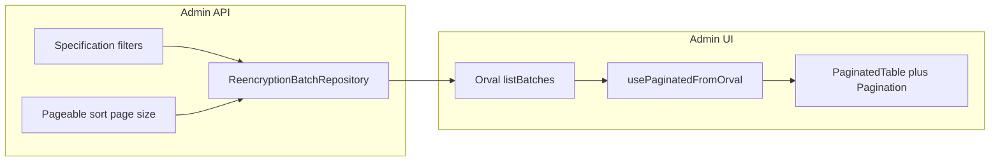

# Re-encryption batches — pagination and filters

**Implementation status:** delivered in full (initial scope + supplementary items in § “Supplementary deliverables” below).

## Rationale

Historical rows in [`ezkey_reencryption_batch`](ezkey-core/src/main/java/org/ezkey/security/domain/entity/ReencryptionBatch.java) accumulate over time (`COMPLETED`, etc.), so a non-paginated `findAll()` becomes inconsistent with other admin lists and less practical on long-lived instances. Pagination plus **optional filters** (especially **status**) matches operator needs and UI uniformity.

## Entity and filter design

**Positioning:** This work targets **operational quality**, not an artificially minimal “MVP”. Any filter that is **pertinent for operators** and represents a **modest** implementation effort (one `Specification`, standard Spring patterns) should be **in scope for the same delivery**—not deferred by default.

Relevant attributes on `ReencryptionBatch` (JPA property names for `Specification` / `sort`):

| Attribute | Filter? | Sort? | Notes |
| --------- | ------- | ----- | ----- |
| `status` | **Yes** — primary operator filter (`PENDING`, `IN_PROGRESS`, `COMPLETED`, `FAILED`, `PAUSED`) | Yes | Matches current UI filter; use enum parse like [`listKeys` + `keyStatus`](ezkey-admin-api/src/main/java/org/ezkey/admin/controller/EncryptionKeyController.java). |
| `targetTable` | Optional exact match | Yes | Useful to focus on e.g. `ezkey_enrollment` vs `ezkey_auth_attempt`. |
| `targetColumn` | Optional exact match | Yes | Useful with `targetTable` when narrowing to one encrypted column; **include** in the same `Specification` block as table. |
| `oldKey.keyId` / `newKey.keyId` | Optional **Long** | Yes (nested path) | Same numeric IDs as the encryption keys table (Tink keyset id as PK)—**exact match** for correlation, not a “range” search. |
| `createdAt`, `startedAt`, `completedAt` | Optional range on **`createdAt`** (see below) | Yes | **Default list sort:** `createdAt` DESC. Optional query params e.g. `createdAfter` / `createdBefore` (ISO-8601) on `createdAt` for time-bounded audits—include if straightforward (`Specification` + `Instant`/`OffsetDateTime` parsing). |
| `batchId` | — | Yes | Stable sort key. |

**V1 query contract (intended in full):**

- `page`, `size`, `sort` — standard Spring [`Pageable`](ezkey-admin-api/src/main/java/org/ezkey/admin/controller/EncryptionKeyController.java) + `@PageableDefault(size = 20, sort = "createdAt", direction = DESC)` (align with other lists).
- `status` — optional batch status filter (omit = all). Invalid enum → ignore filter (consistent with `keyStatus` behavior).
- `targetTable` — optional string (trimmed; empty = no filter).
- `targetColumn` — optional string (trimmed; typically used together with or after `targetTable`; empty = no filter).
- `oldKeyId` / `newKeyId` — optional Long filters on `oldKey.keyId` / `newKey.keyId`.
- `createdAfter` / `createdBefore` — optional; filter `createdAt` inclusive/exclusive per chosen convention; document in OpenAPI and ENDPOINT.md.

There is **no** separate “minimal” vs “full” scope for this initiative: the **Specification** composes all optional predicates; the incremental cost of adding `targetColumn` and key IDs alongside `status` and `targetTable` is small.

## Backend (ezkey-core + ezkey-admin-api)

1. **Repository** — Extend [`ReencryptionBatchRepository`](ezkey-core/src/main/java/org/ezkey/security/domain/repository/ReencryptionBatchRepository.java) with `JpaSpecificationExecutor<ReencryptionBatch>` (mirror [`EncryptionKeyRepository`](ezkey-core/src/main/java/org/ezkey/security/domain/repository/EncryptionKeyRepository.java)).
2. **Controller** — Replace [`listBatches()`](ezkey-admin-api/src/main/java/org/ezkey/admin/controller/EncryptionKeyController.java) returning `List<ReencryptionBatchResponse>` with `ResponseEntity<Page<ReencryptionBatchResponse>>`:
   - Build a `Specification<ReencryptionBatch>` combining optional predicates (`status`, `targetTable`, `targetColumn`, `oldKeyId`, `newKeyId`, and `createdAt` range if implemented).
   - `batchRepository.findAll(spec, pageable).map(this::toBatchResponse)`.
   - Document in `@Operation` / `@Parameter`: sortable properties (`batchId`, `status`, `targetTable`, `targetColumn`, `createdAt`, `startedAt`, `completedAt`, `progressPct`, and nested keys if supported).
3. **Tests** — Extend [`EncryptionKeyControllerTest`](ezkey-admin-api/src/test/java/org/ezkey/admin/controller/EncryptionKeyControllerTest.java) (or dedicated test class) with **unit** tests: mock `ReencryptionBatchRepository` + `findAll(Specification, Pageable)` returning a `Page`, assert response shape (`content` + `page`), and that filters are applied (verify `spec` interaction or use `ArgumentCaptor` if the project already does this elsewhere). **No** new functional/e2e test module for pagination alone (per your preference).
4. **Formatting** — `mvn spotless:apply` from repo root before `mvn test` (per project rules).
5. **OpenAPI** — Do **not** hand-edit [`specs/`](specs/). Implement in Java; **maintainer** runs clean stack + [`scripts/update-specs.sh` / `.bat`](.cursor/rules/openapi-specs.mdc), then regenerates Orval client.

## Maintainer workflow (before Admin UI step)

1. Full stack start; run `update-specs` so `GET .../reencryption-batches` documents `page`, `size`, `sort`, and new filters.
2. Confirm generated spec matches `Page` + nested `page` object (same as list keys).

## Admin UI (after Orval regen)

1. Regenerate or pull updated client under [`ezkey-admin-ui/src/generated/admin-api/`](ezkey-admin-ui/src/generated/admin-api/).
2. Refactor [`ReencryptionBatchesSection`](ezkey-admin-ui/src/pages/encryption-keys.tsx):
   - Replace flat `useListBatches` + client `useMemo` filter with [`usePaginatedFromOrval`](ezkey-admin-ui/src/hooks/use-paginated-orval.ts) (or equivalent pattern used for encryption keys list on the same page): pass `status` (and optional `targetTable` if exposed) as `baseParams`.
   - Use [`PaginatedTable`](ezkey-admin-ui/src/components/data-table/paginated-table.tsx) + [`Pagination`](ezkey-admin-ui/src/components/data-table/pagination.tsx): `currentSort`, `onSort`, server-side sort only (per [AGENTS.md](ezkey-admin-ui/AGENTS.md)).
   - Remove client-only filtering of full list; **status** `Select` drives query param + invalidates cache on change.
   - Collapsible header badge: show **`page.totalElements`** for the **current filter** (not current page length).
3. Invalidate queries: use Orval-generated query key factory for list batches after mutations (same pattern as other modules).

## Postman

Update [`postman/collections/v2.1/EZ Key Encryption Keys admin.postman_collection.json`](postman/collections/v2.1/EZ%20Key%20Encryption%20Keys%20admin.postman_collection.json):

- **list re-encryption batches**: URL with `page`, `size`, `sort`, optional `status`, optional `targetTable`, optional `oldKeyId`/`newKeyId`.
- Tests: assert `content` array + `page` object (like **list keys**), not bare array.

Update collection **description** block at top to mention paginated list.

## Documentation

- [`docs/ENDPOINT.md`](docs/ENDPOINT.md) — Replace non-paginated description with paginated contract, query parameters, and example JSON (`content` + `page`).
- [`docs/REENCRYPTION_OPERATIONS.md`](docs/REENCRYPTION_OPERATIONS.md) — Update §7 (batch list / pagination): now server-side pagination; historical growth; filters.

## CLI (optional follow-through)

[`ezkey_cli`](ezkey-cli-python/ezkey_cli/tui/api_client.py) and [`admin.py`](ezkey-cli-python/ezkey_cli/commands/admin.py) call GET without query params — extend to pass `page`/`size` (and optionally `status`) so CLI stays aligned; update [`CLI_CONTROLLER_REVIEW.md`](ezkey-cli-python/ezkey_cli/CLI_CONTROLLER_REVIEW.md) checklist.

Additional delivered: TUI list screen uses server pagination; batch detail resolves batch by id via paged search helper; `docs/PAGINATION_AUDIT_REPORT.md` row updated for this endpoint.

## Closing evaluation (after you confirm)

Once you have validated: API behavior, regenerated specs, UI in Docker/local, and Postman requests:

- Record a short **completion note** (e.g. in the PR description or a one-line entry in a team log): pagination + filters shipped; no further action unless archival/purge of old batches is later required.

**Done:** completion note added in [`docs/REENCRYPTION_OPERATIONS.md`](docs/REENCRYPTION_OPERATIONS.md) §7.

---

## Supplementary deliverables (same initiative)

Items below were not all spelled out in the first plan revision; they were implemented for admin UX consistency and operator clarity.

### Admin UI

1. **Context help** — Second paragraph (`sectionHelpFilters`, en/fr): server-side filters; exact table/column; Tink key IDs for old/new key (exact match, not a “range” search).
2. **Tooltips** on filter inputs: Table, Column, Old key, New key (`tooltipTargetTable`, etc., en/fr).
3. **Primary actions** — “Create Batches” and “Trigger Full Re-encryption” use `variant="primary"` (accent), aligned with other primary actions on the page.
4. **Two-row filter layout** — Row 1: status + date range + actions (right). Row 2: table, column, old key, new key, with a light separator—reduces awkward wrap of actions under many fields on wide layouts.

### Tests (unrelated to this feature)

- Functional test updates for **enrollment verify** responses (`ProblemDetail` / RFC 9457 vs legacy `message`) were required after Auth API error shape; **not** part of this re-encryption batches initiative (`ezkey-tests`).

### Optional follow-ups

- None required to close this initiative. Optional later: archival/purge policy for old `COMPLETED` batch rows (product). If `specs/` drifts from running services, maintainer re-runs **update-specs** after substantive Java changes.

