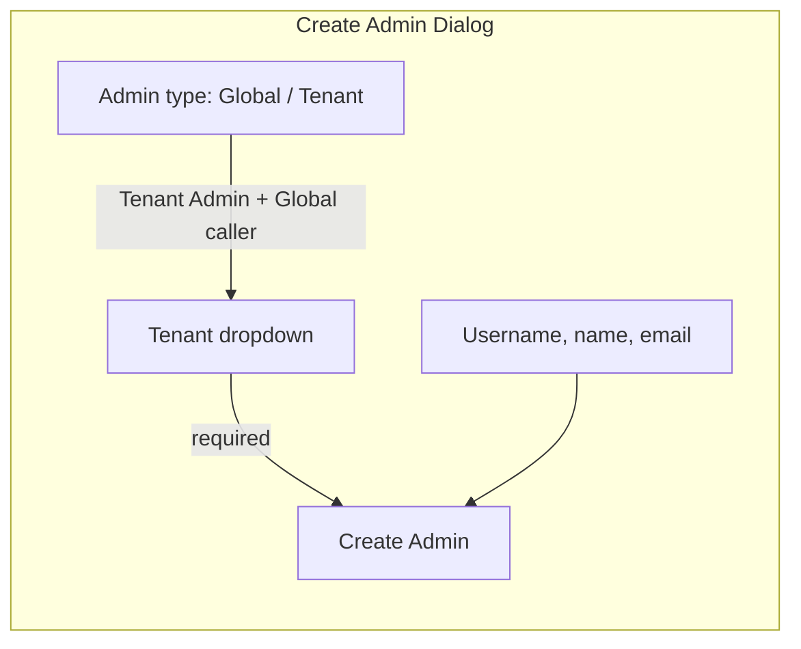

# Tenant selection for Tenant Admin creation (Admin UI)

## Status: **Completed**

Implemented in [ezkey-admin-ui/src/pages/admins.tsx](ezkey-admin-ui/src/pages/admins.tsx). A client-side partial string filter (case-insensitive, matches any part of tenant name, organization, domain, ID, and display label) was added above the tenant dropdown for better usability with large tenant lists.

---

## Problem

Creating a **Tenant Admin** as a **Global Admin** fails with: *"tenantid is required for tenant administrator creation"*. The API `[POST /api/v1/admins/tenant](ezkey-admin-api/src/main/java/org/ezkey/admin/controller/AdminProvisioningController.java)` requires `tenantId` in the body when the caller is a Global Admin; when the caller is a Tenant Admin, the backend infers `tenantId` from the JWT and does not require it.

## Current behaviour

- [admins.tsx](ezkey-admin-ui/src/pages/admins.tsx): `CreateAdminDialog` has a radio choice (Tenant Admin / Global Admin) and a form with username, first/last name, email. It never sends `tenantId` for the tenant path, so Global Admin → Tenant Admin always fails.
- Tenant Admin creating a peer: backend already accepts the request without `tenantId` (it uses the principal's tenant). So no UI change is required for that case.

## Design

### 1. Tenant selector (Global Admin only, when "Tenant Admin" is selected)

- **Placement**: In the Create Admin dialog, directly under the "Tenant Admin / Global Admin" radio group when **Tenant Admin** is selected and the current user is a **Global Admin**.
- **Control**: A single **required** `<Select>` dropdown:
  - **Label**: e.g. "Tenant *" or "Assign to tenant *".
  - **Options**: One option per tenant returned by `useListTenants()`, **excluding the system tenant** (`isSystemTenant === true`), because the API does not allow creating a tenant admin in the system tenant.
  - **Option label**: `{tenantName} (ID: {tenantId})` or `{tenantName}` with `value={tenantId}` so the user sees a readable name and the payload gets a numeric `tenantId`.
- **Empty state**: If the list of eligible tenants (non-system) is empty, show a short message: "No tenant available. Create a tenant first." with a link to the Tenants page (`/tenants`). Disable the "Create Admin" button in that case so the user cannot submit without a tenant.

### 2. Tenant Admin caller (no selector)

- When the current user is a **Tenant Admin**, the "Create Admin" flow only allows creating a **Tenant Admin** for their own tenant (no Global Admin option). Do **not** show the tenant selector; keep sending the body without `tenantId` so the backend continues to use the principal's tenant.

### 3. Form validation and submit

- **Schema**: Extend the create-admin form schema (e.g. Zod) with an optional `tenantId` (number). When `callerIsGlobal && !isGlobalType`, require `tenantId` (e.g. "Select a tenant").
- **Submit**: When creating a Tenant Admin as Global Admin, include `tenantId` from the selector in the request body ([AdminCreateRequestDto](ezkey-admin-ui/src/generated/admin-api/model/adminCreateRequestDto.ts) already has `tenantId?: number`). When creating as Tenant Admin, keep the current behaviour (no `tenantId` in body).

### 4. Data and loading

- Reuse `**useListTenants`** from [tenants.ts](ezkey-admin-ui/src/generated/admin-api/tenants/tenants.ts) (already used on the Tenants page). The dialog can use the same hook; TanStack Query will cache it.
- While tenants are loading, show a loading state for the dropdown (e.g. disabled with "Loading tenants…") or a small spinner so the user knows why the list is empty initially.

## Flow summary

- **Global Admin + "Tenant Admin"**: Show tenant dropdown (required). Submit with `tenantId`. If no eligible tenants, show message + link to Tenants and disable submit.
- **Global Admin + "Global Admin"**: No tenant field; submit without `tenantId`.
- **Tenant Admin**: No type choice, no tenant field; submit without `tenantId` (backend uses session tenant).

## Files to change

| File                                                                       | Change                                                                                                                                                                                                                                                                                                                                                                                                                                                                                                           |
| -------------------------------------------------------------------------- | ---------------------------------------------------------------------------------------------------------------------------------------------------------------------------------------------------------------------------------------------------------------------------------------------------------------------------------------------------------------------------------------------------------------------------------------------------------------------------------------------------------------- |
| [ezkey-admin-ui/src/pages/admins.tsx](ezkey-admin-ui/src/pages/admins.tsx) | (1) Add `useListTenants` and derive eligible tenants (exclude system). (2) Add optional `tenantId` to form schema and require it when Global + Tenant Admin. (3) In the dialog, when `callerIsGlobal && !isGlobalType`, render the tenant `<Select>` (and empty-state message + link if no eligible tenants). (4) On submit, for Global + Tenant Admin pass `tenantId` in the create request body. (5) Disable submit when Tenant Admin type is selected but no tenant is selected or no eligible tenants exist. |

No backend or OpenAPI changes: the API already documents and accepts `tenantId` for tenant admin creation; only the UI was missing the selector and payload.

## Edge cases

- **System tenant**: Never offered in the dropdown (backend would reject creation in system tenant).
- **No tenants**: Only system tenant exists → show "Create a tenant first" and disable Create Admin for Tenant Admin type.
- **Tenant Admin caller**: No selector; backend infers tenant. No change to session or auth types required.
