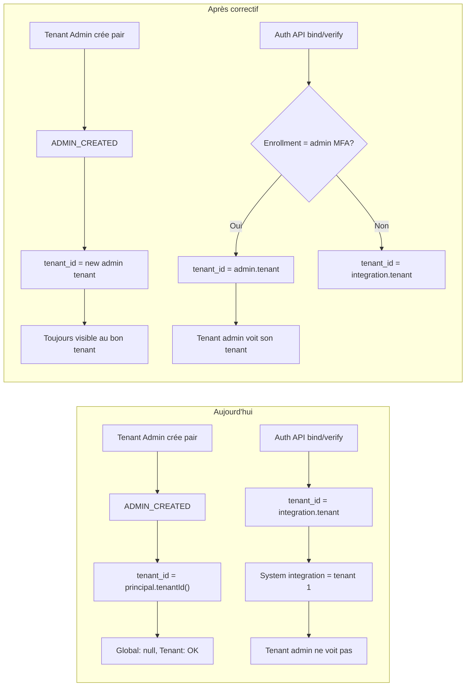

# Tenant, enrolment et audit logs — analyse conceptuelle et correctif

## Contexte

- **Origine:** Pas de notion de tenant au départ; l’enrollment a toujours été lié à une **intégration**. Chaque enrollment a donc une intégration (obligatoire).
- **Intégration système (id=1):** Créée pour que les admins (global et tenant) aient une intégration à laquelle lier leur MFA. Elle appartient au **system tenant** (tenant_id=1). Tous les admins (global et tenant) ont leur enrollment sur cette même intégration.
- **Effet de bord:** En tant que tenant admin, lorsqu’on consulte les audit logs, on ne voit pas la création d’un pair (autre tenant admin) ni les activités d’onboarding (bind/verify) et d’auth (pending/respond) liées à ces enrollments, car ces événements sont soit en `tenant_id = null`, soit en `tenant_id = 1` (intégration système → system tenant), alors que le filtre tenant ne garde que `tenant_id = <leur tenant>`.

## Modèle actuel (résumé)

- **Audit:** `ezkey_audit_log` a un champ `tenant_id`. La visibilité est :
  - **Global Admin:** tous les logs (optionnel filtre par `tenantId`).
  - **Tenant Admin:** uniquement les lignes où `tenant_id` = leur tenant ([AuditLogService.findByFilters](ezkey-core/src/main/java/org/ezkey/audit/service/AuditLogService.java) lignes 182–186).
- **Création de tenant admin (pair):**
  - Admin API logue `ADMIN_CREATED` avec `tenant_id = principal.tenantId()` ([AdminProvisioningController](ezkey-admin-api/src/main/java/org/ezkey/admin/controller/AdminProvisioningController.java) lignes 316–332).
  - Si un **Global Admin** crée le tenant admin, `principal.tenantId()` est `null` → l’entrée a `tenant_id = null` → invisible au tenant admin.
  - Si un **Tenant Admin** crée le pair, `principal.tenantId()` est leur tenant → visible.
- **Auth API (bind/verify, pending/respond):**
  - Le `tenant_id` d’audit est résolu par **enrollment → integration → tenant** ([EnrollmentController.resolveTenantId](ezkey-auth-api/src/main/java/org/ezkey/auth/controller/EnrollmentController.java) lignes 441–450), idem [AuthAttemptController.resolveTenantIdFromAuthAttempt](ezkey-auth-api/src/main/java/org/ezkey/auth/controller/AuthAttemptController.java) (auth attempt → enrollment → integration → tenant).
  - Pour l’intégration système, l’integration appartient au system tenant (id=1) → tous ces événements ont `tenant_id = 1`. Un tenant admin (ex. tenant 2) ne les voit donc jamais.

## Option A (recommandée): Corriger l’attribution du `tenant_id` dans l’audit

Rester avec **une seule intégration système**. Ne pas toucher au modèle Integration/Enrollment. Uniquement:

1. **Admin API – `ADMIN_CREATED`**
  Pour la création d’un **tenant admin**, utiliser comme `tenant_id` d’audit le **tenant cible** (celui du nouvel admin), pas `principal.tenantId()`. Ainsi :
  - Global Admin crée un tenant admin pour le tenant 2 → audit avec `tenant_id = 2` → visible par le tenant admin du tenant 2.
  - Tenant Admin du tenant 2 crée un pair → audit avec `tenant_id = 2` (déjà le cas si on passe le tenant cible) → visible.
   Fichier: [AdminProvisioningController](ezkey-admin-api/src/main/java/org/ezkey/admin/controller/AdminProvisioningController.java). Lors du log `ADMIN_CREATED` pour `createTenantAdmin`, passer `effectiveTenantId` (tenant du nouvel admin) au lieu de `principal.tenantId()` pour le builder d’audit.
2. *Auth API – ENROLLMENT_ et AUTH_ATTEMPT_***
  Pour les enrollments sur l’**intégration système**, le `tenant_id` d’audit doit refléter le **tenant de l’admin** qui possède l’enrollment (ou null pour global admin), et non le tenant de l’integration (toujours system tenant = 1).
  - Le core expose déjà [EzkeyAdminRepository.findTenantInfoByAdminMfaEnrollmentId(enrollmentId)](ezkey-core/src/main/java/org/ezkey/integration/domain/repository/EzkeyAdminRepository.java) (lignes 272–280), qui renvoie `[tenantId, tenantName, tenantDescription]` pour l’admin dont le MFA enrollment est cet enrollment (vide si pas un enrollment admin ou si global admin).
  - **EnrollmentController** et **AuthAttemptController** (auth-api) utilisent aujourd’hui uniquement `enrollment → integration → tenant`. Il faut introduire une résolution “tenant pour l’audit” :
    - Si `findTenantInfoByAdminMfaEnrollmentId(enrollmentId)` retourne un résultat, utiliser ce `tenant_id` (peut être null pour global admin).
    - Sinon, garder le comportement actuel (tenant de l’integration).
  - Ainsi, bind/verify et pending/respond pour un **tenant admin** (enrollment sur intégration système) auront le `tenant_id` de leur tenant et apparaîtront dans la vue audit de ce tenant. Les événements des global admins restent sans tenant (ou system tenant) et ne sont vus que par les global admins.
   Fichiers: [EnrollmentController](ezkey-auth-api/src/main/java/org/ezkey/auth/controller/EnrollmentController.java) (bind/verify), [AuthAttemptController](ezkey-auth-api/src/main/java/org/ezkey/auth/controller/AuthAttemptController.java) (pending/respond). Auth-api devra injecter `EzkeyAdminRepository` et utiliser cette résolution pour le `tenantId` passé à l’audit (remplacer ou compléter l’appel actuel à `resolveTenantId` / `resolveTenantIdFromAuthAttempt` par une méthode qui tente d’abord l’admin par MFA enrollment).

Aucun changement de schéma, pas de nouvelle intégration, pas de duplication de concept. Les requêtes et APIs existantes (une seule intégration système, exclusions listing, gardes de révocation) restent valides.

## Option B: Une intégration “système” par tenant (rejetée)

- **Idée:** À la création d’un tenant, créer une intégration de type “système” associée à ce tenant; les tenant admins de ce tenant auraient leur enrollment sur cette intégration. Les audit logs hériteraient du tenant via l’integration.
- **Problèmes:**
  - **Recouvrement avec Tenant:** L’integration “système” par tenant ne porte pas plus d’information utile que le tenant lui‑même; on duplique la notion de périmètre.
  - **Invariant cassé:** Le code suppose **une seule** intégration système ([IntegrationRepository.findByIsSystemIntegrationAndActiveTrue](ezkey-core/src/main/java/org/ezkey/integration/domain/repository/IntegrationRepository.java), bootstrap, gardes de bulk revoke/deactivate, exclusions dans les listes). Passer à N intégrations “système” oblige à revoir tous ces usages (SQL, APIs, listing, danger zones).
  - **Régressions et cas particuliers:** Identification “quelle est l’intégration système globale vs par tenant”, migration des enrollments existants, comportement du system tenant (id=1), etc.
- **Conclusion:** Complexité et risque élevés pour un gain déjà obtenu par l’option A (visibilité audit correcte sans changer le modèle).

## Recommandation

- **Adopter l’option A:** garder une seule intégration système, et corriger uniquement l’attribution du `tenant_id` dans l’audit (Admin API pour `ADMIN_CREATED`, Auth API pour ENROLLMENT_* et AUTH_ATTEMPT_* via résolution par admin MFA enrollment).
- **Ne pas introduire** une intégration système par tenant (option B).

## Résultat attendu

- Un tenant admin qui consulte les audit logs voit **toutes** les activités pertinentes pour son tenant, notamment :
  - Création d’un pair (autre tenant admin) dans son tenant, que le créateur soit un Global Admin ou lui‑même.
  - Onboarding (bind/verify) des admins de son tenant.
  - Authentifications (pending/respond) des admins de son tenant.
- Pas de changement de modèle de données (tenants, enrollments, intégrations), pas de nouvelle intégration système, pas de modification des règles de listing ou de révocation.

## Diagramme de flux actuel vs corrigé (résumé)

## Fichiers à modifier (option A)

| Fichier                                                                                                                       | Modification                                                                                                                                                                                                                            |
| ----------------------------------------------------------------------------------------------------------------------------- | --------------------------------------------------------------------------------------------------------------------------------------------------------------------------------------------------------------------------------------- |
| [AdminProvisioningController.java](ezkey-admin-api/src/main/java/org/ezkey/admin/controller/AdminProvisioningController.java) | Lors du log `ADMIN_CREATED` pour createTenantAdmin, passer `effectiveTenantId` (tenant du nouvel admin) au lieu de `principal.tenantId()` dans `AuditHelper.createAdminAudit(..., principal.tenantId())`.                               |
| [EnrollmentController.java](ezkey-auth-api/src/main/java/org/ezkey/auth/controller/EnrollmentController.java)                 | Injecter `EzkeyAdminRepository`. Pour bind/verify, calculer `tenantId` d’audit en priorité via `findTenantInfoByAdminMfaEnrollmentId(enrollmentId)`; si vide, garder `resolveTenantId(enrollmentId)` (integration → tenant).            |
| [AuthAttemptController.java](ezkey-auth-api/src/main/java/org/ezkey/auth/controller/AuthAttemptController.java)               | Injecter `EzkeyAdminRepository`. Pour pending/respond, résoudre enrollment à partir de l’auth attempt, puis appliquer la même règle: si l’enrollment est un MFA admin, utiliser le tenant de l’admin; sinon le tenant de l’integration. |

Aucune migration Flyway, aucun changement d’API publique, aucun changement sous `specs/`. Les tests existants (audit, multi-tenant) devraient être étendus pour vérifier que les entrées d’audit ont le bon `tenant_id` lorsque un Global Admin crée un tenant admin et lorsque des bind/verify/auth attempt concernent un tenant admin.
