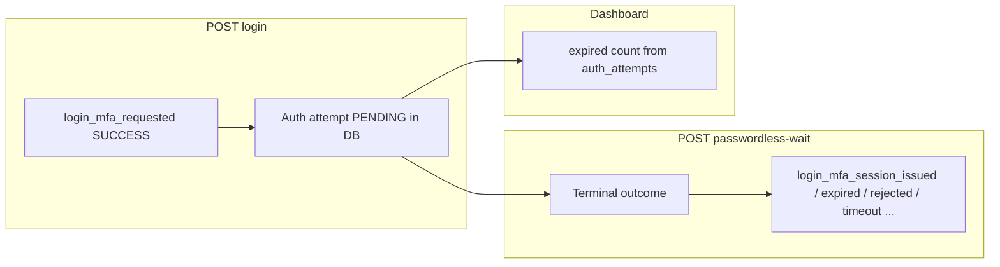

# Audit logs vs expired passwordless authentication

## Decisions (product) — updated

| Item                                    | Decision                                                                                                                                                                                                                                                                                                                                                                                                                                                                                                                                                             |
| --------------------------------------- | -------------------------------------------------------------------------------------------------------------------------------------------------------------------------------------------------------------------------------------------------------------------------------------------------------------------------------------------------------------------------------------------------------------------------------------------------------------------------------------------------------------------------------------------------------------------- |
| **Information model**                   | **Frozen** — **Event type** = nature of the operation (“what happened?”). **Event status** = outcome of that step: **SUCCESS** (completed as intended for that step), **FAILURE** (expected rule / validation / terminal auth outcome), **ERROR** (unexpected exception). No change to this three-value model.                                                                                                                                                                                                                                                       |
| **Backend — `/passwordless-wait`**      | **To implement** — Persist an audit row for **each terminal outcome** of the passwordless wait step, using **Option B**: **distinct `event_action` strings** per outcome (see [Proposed `event_action` constants](#proposed-event_action-constants-mfa--admin-login)), with `**EventStatus`** mapped per `[AuditHelper](ezkey-admin-api/src/main/java/org/ezkey/admin/util/AuditHelper.java)` semantics (`FAILURE` for expected outcomes such as expired / rejected / timeout; `ERROR` only for unexpected exceptions). **SUCCESS** when a bearer session is issued. |
| **Backend — `/login` (pending branch)** | **To implement** — Align with Option B: replace generic `login_pending` with a clearer action name for **new** rows (e.g. `login_mfa_requested`); keep historical rows unchanged.                                                                                                                                                                                                                                                                                                                                                                                    |
| **Admin UI — exploitability**           | **In scope** — Make audit logs easier to use: **explain** event type vs status (drawer + optional column hints); **contextual help topic** for `/audit-logs` (FR + EN), drafted in [Contextual help draft](#contextual-help-draft-audit-logs-en--fr). **Global vs Tenant role does not change how to read Event type / Status / Action** — only *which rows* appear; no separate help branch by role for column semantics.                                                                                                                                           |
| **Option C / D**                        | **Not pursued** for EventType split / fourth `EventStatus` unless evidence shows need after MFA audits + help ship.                                                                                                                                                                                                                                                                                                                                                                                                                                                  |

---

## Proposed `event_action` constants (MFA / admin login)

Names are indicative for implementation; final naming should stay snake_case and match `[AdminAuditConstants](ezkey-admin-api/src/main/java/org/ezkey/admin/constants/AdminAuditConstants.java)` style.

| When                                                                | Suggested `event_action`                           | `EventStatus` |
| ------------------------------------------------------------------- | -------------------------------------------------- | ------------- |
| `POST /login` returns pending MFA (challenge / non-blocking)        | `login_mfa_requested`                              | SUCCESS       |
| `POST /login` returns immediate success (blocking path, rare)       | keep `login_success` or align naming in same PR    | SUCCESS       |
| `POST /passwordless-wait` issues session                            | `login_mfa_session_issued`                         | SUCCESS       |
| `POST /passwordless-wait` → expired                                 | `login_mfa_expired`                                | FAILURE       |
| `POST /passwordless-wait` → rejected                                | `login_mfa_rejected`                               | FAILURE       |
| `POST /passwordless-wait` → wait window timeout (no resolution)     | `login_mfa_timeout`                                | FAILURE       |
| `POST /passwordless-wait` → invalid signature                       | `login_mfa_invalid_signature`                      | FAILURE       |
| `POST /passwordless-wait` → unexpected exception in handler/service | `login_mfa_error` (or reuse pattern from recovery) | ERROR         |

**i18n:** Add `eventAction.*` entries in `[audit-logs.json](ezkey-admin-ui/src/locales/en/audit-logs.json)` (en + fr) for each new action.

**SIEM:** Document new action strings and cutover for `login_mfa_requested` vs legacy `login_pending`.

---

## Technical baseline (historical)

- Today, audit for admin login is written on `**POST /login`** only; pending branch used `LOGIN_PENDING` with **SUCCESS**.
- `**POST /passwordless-wait`** does not emit audit logs; exceptions return RFC 9457 without audit rows.
- Dashboard “expired” counts use **auth attempt** stats, not audit.

---

## Research: when is `eventStatus` not SUCCESS? (codebase map)

Non-SUCCESS appears only where code **explicitly** logs `FAILURE` or `ERROR` (see grep inventory in earlier revision: admin-api, auth-api, integration-api, core security/audit schedulers).

**Implication:** After MFA wait audits ship, exercising expiry/reject/timeout will produce **FAILURE** rows—making DB and UI distributions more representative of real outcomes.

---

## Consistency tweak — Options A–D (reference)

- **Option A** — UI-only explanations (superseded by full **audit-logs** help topic + MFA action names).
- **Option B** — **Adopted** for new `event_action` values (first step + wait outcomes).
- **Option C / D** — Deferred (see decisions table).

---

## Admin UI — implementation notes (exploitability)

1. **Help drawer topic for `/audit-logs`**
  Today `[resolveHelpTopicId](ezkey-admin-ui/src/lib/help-topics.ts)` falls through to `**default**` on `/audit-logs`. **Add** `HelpTopicId` value `audit-logs` and map `path === '/audit-logs'` → `audit-logs`.
2. **Help drawer content structure**
  Prefer **several focused keys** (`eventTypeVsStatus` including the SIEM line, `statusLegend`, `mfaAndLogin`, `integrityNote`) rendered sequentially—**not** a Global/Tenant conditional. Optional separate `developerContext` only if feedback asks for it after v1 ([see](#contextual-help--audience-split-clarification)).
3. **Table / filters**
  Optional: short **tooltips** on column headers “Event type”, “Status”, “Action” pointing to the same concepts (reuse translation keys to avoid drift).
4. **Existing page**
  `[audit-logs.tsx](ezkey-admin-ui/src/pages/audit-logs.tsx)` already uses `[ContextHelp](ezkey-admin-ui/src/pages/audit-logs.tsx)` for integrity subsections; the **drawer** topic gives the **overview** of audit logs and complements inline widgets.

---

## Contextual help — audience split (clarification)

### Global Admin vs Tenant Admin — **not** relevant for column interpretation

**How to read** Event type, Status, and Action is the **same** for every admin role. **Role only affects which events are listed** (visibility), which stays a **single short paragraph** in `body`—not a second help branch keyed on `isGlobalAdmin`.

### Operator vs “technical” depth — keep it light

The useful axis is **depth** (everyday operator vs SIEM/automation), **not** a second persona in the product.

**Recommendation (product):** Avoid multiplying blocks. The **Failure vs Error** distinction is already partially covered in `**eventTypeVsStatus`**. Options, from lean to richer:

1. **Preferred default:** One coherent drawer: `summary` + `body` (with visibility) + `eventTypeVsStatus` + `statusLegend` + `mfaAndLogin` + `integrityNote` — and **fold** the SIEM/automation sentence into `eventTypeVsStatus` (one line: Failure ≈ expected outcomes including terminal MFA; Error ≈ unexpected processing failure; `event action` is stable for filters). **No separate `developerContext`.**
2. **Optional later:** If the drawer feels crowded, add a **short** `developerContext` with muted styling (encryption-keys style) — **only** if operators report confusion after v1.

**Why not over-split:** Extra tiers add translation surface and drift risk for modest gain; technical readers can use the same copy if Failure/Error is explained once, clearly, in the main column section.

### What “like the dashboard” meant (implementation only)

That referred to **HelpDrawer mechanics** (multiple i18n keys), **not** to copying the dashboard’s Global/Tenant **conditional** paragraphs for audit logs.

### Encryption-keys pattern (`developerContext`)

Reserved as an **optional** pattern if a separate muted paragraph is needed later—not a requirement for the first ship.

---

## Contextual help draft — Audit logs (EN + FR)

Copy is for implementation under `help:topics.audit-logs.`*. Adjust keys to match `HelpDrawer` implementation (single `body` vs split keys).

### English (`help.json`)

- `**topics.audit-logs.title`:** `Audit logs`
- `**topics.audit-logs.summary`:** `A read-only trail of security-relevant actions and outcomes across Ezkey. Use it to see who did what, whether the step succeeded, and to support investigations.`
- `**topics.audit-logs.body`:**
`Each row is an immutable record: Ezkey does not rewrite history after the fact. Events come from the Admin API and related services (the API column shows the source).\n\nUse filters—event type, status, API name, and date range—to narrow the list. Open a row for identifiers (admin, integration, enrollment, auth attempt) when present, and for extra detail or error text.\n\nYour role determines which events you can see: Global Admins have broader visibility; Tenant Admins see activity tied to their tenant where policies allow.`
- `**topics.audit-logs.eventTypeVsStatus`:**
`Two columns work together:\n\n• Event type — the category of operation (for example admin login, enrollment created, API key revoked). It answers “what kind of event is this?”\n\n• Status — how that operation finished for the audited step. Success means the step completed as intended. Failure means an expected outcome stopped the flow (validation, policy, or a normal terminal result such as an expired or rejected MFA attempt). Error means something unexpected went wrong while processing the request and may warrant investigation.\n\nFor automation and exports: Failure is the usual status for “expected” denials and terminal MFA outcomes; Error points to unexpected processing failures—correlate with server logs if needed. The event action value is the stable field for filters and SIEM rules.`
- `**topics.audit-logs.statusLegend`:**
`Success — the audited step completed successfully.\nFailure — the step did not complete in the expected success path; details often appear in the row or error message.\nError — unexpected failure; treat as worth reviewing in logs or support.`
- `**topics.audit-logs.mfaAndLogin`:**
`Passwordless admin sign-in can take two steps. The first step may only create an MFA request on your enrolled device: a Success status there means the request was accepted by the server, not that you already hold a session. A separate entry shows when a session is issued or when the attempt ended without a session (for example expired, rejected, or timed out), once those outcomes are recorded for the wait step.`
- `**topics.audit-logs.integrityNote`:**
`Chain checkpoints, seal archive, and declare gap are advanced integrity operations. Use the inline help (?) next to each section on this page for how and when to use them.`
- `**topics.audit-logs.developerContext`:** *(optional — omit v1 if using the merged paragraph in `eventTypeVsStatus` above)*
- `**topics.audit-logs.demoExtra`:** `""` (empty unless demo-specific text is needed later)

### French (`help.json`)

- `**topics.audit-logs.title`:** `Journaux d’audit`
- `**topics.audit-logs.summary`:** `Piste en lecture seule des actions et des résultats pertinents pour la sécurité dans Ezkey. Permet de voir qui a fait quoi, si l’étape a réussi, et d’appuyer les investigations.`
- `**topics.audit-logs.body`:**
`Chaque ligne est un enregistrement immuable : Ezkey ne réécrit pas l’historique a posteriori. Les événements proviennent de l’API admin et des services associés (la colonne API indique la source).\n\nUtilisez les filtres — type d’événement, statut, nom d’API et plage de dates — pour restreindre la liste. Ouvrez une ligne pour les identifiants (admin, intégration, inscription, tentative d’authentification) lorsqu’ils sont présents, ainsi que le détail ou le message d’erreur.\n\nVotre rôle détermine les événements visibles : les administrateurs globaux ont une visibilité plus large ; les administrateurs de locataire voient l’activité rattachée à leur locataire lorsque les règles le permettent.`
- `**topics.audit-logs.eventTypeVsStatus`:**
`Deux colonnes se complètent :\n\n• Type d’événement — la catégorie d’opération (par exemple connexion admin, inscription créée, clé API révoquée). Répond à « de quel type d’événement s’agit-il ? »\n\n• Statut — la façon dont l’opération s’est terminée pour l’étape auditée. Réussite signifie que l’étape s’est déroulée comme prévu. Échec signifie un résultat attendu qui a interrompu le flux (validation, règle, ou résultat terminal normal comme une tentative MFA expirée ou refusée). Erreur signifie un problème inattendu pendant le traitement ; il peut être utile de creuser les journaux ou le support.\n\nPour l’automatisation et les exports : l’échec est en général le statut des refus attendus et des fins MFA normales ; l’erreur pointe vers des défaillances de traitement inattendues — corréler avec les journaux serveur si besoin. La valeur d’action d’événement (event action) est le champ stable pour les filtres et les règles SIEM.`
- `**topics.audit-logs.statusLegend`:**
`Réussite — l’étape auditée s’est terminée avec succès.\nÉchec — l’étape ne s’est pas terminée sur le chemin de réussite attendu ; le détail figure souvent dans la ligne ou le message d’erreur.\nErreur — échec inattendu ; à examiner dans les journaux ou avec le support.`
- `**topics.audit-logs.mfaAndLogin`:**
`La connexion admin sans mot de passe peut comporter deux étapes. La première peut seulement créer une demande MFA sur l’appareil inscrit : un statut Réussite à cette étape signifie que le serveur a accepté la demande, pas que vous détenez déjà une session. Une entrée distincte indique quand une session est délivrée ou quand la tentative se termine sans session (par exemple expirée, refusée ou délai dépassé), une fois ces résultats enregistrés pour l’étape d’attente.`
- `**topics.audit-logs.integrityNote`:**
`Les points de contrôle de chaîne, le scellage d’archive et la déclaration d’écart sont des opérations d’intégrité avancées. Utilisez l’aide inline (?) à côté de chaque section sur cette page pour savoir quand et comment les utiliser.`
- `**topics.audit-logs.developerContext`:** *(optionnel — à omettre en v1 si le paragraphe fusionné dans `eventTypeVsStatus` suffit)*
- `**topics.audit-logs.demoExtra`:** `""`

---

## Implementation todos (reference)

- **Backend:** `AdminAuthService` / `AdminAuthController` — audit on `/passwordless-wait` for all terminal outcomes; new constants in `AdminAuditConstants`; add `HttpServletRequest` to `passwordlessWait` if client context needed for audit (IP/UA).
- **Backend:** `/login` pending branch — emit `login_mfa_requested` (or chosen name) instead of `login_pending` for **new** rows only.
- **i18n (audit-logs):** `eventAction.`* for every new action (en + fr).
- **Admin UI:** `help-topics.ts` — `audit-logs` id + route; `help.json` en + fr — paste [draft](#contextual-help-draft-audit-logs-en--fr); `HelpDrawer` — render extra keys for `audit-logs` as needed (**no** Global/Tenant conditional for column help); **v1:** no separate `developerContext` if SIEM line is merged into `eventTypeVsStatus`.
- **Admin UI (optional):** Column header tooltips for Event / Status / Action.
- **Docs / ops:** SIEM note for new `event_action` values and `login_pending` legacy.
- **Tests:** Controller or service tests verifying audit emission per outcome; optional SQL check on `event_status` distribution.

---

## Summary diagram

