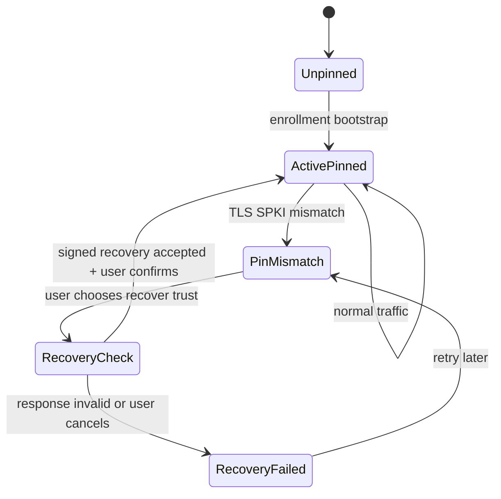
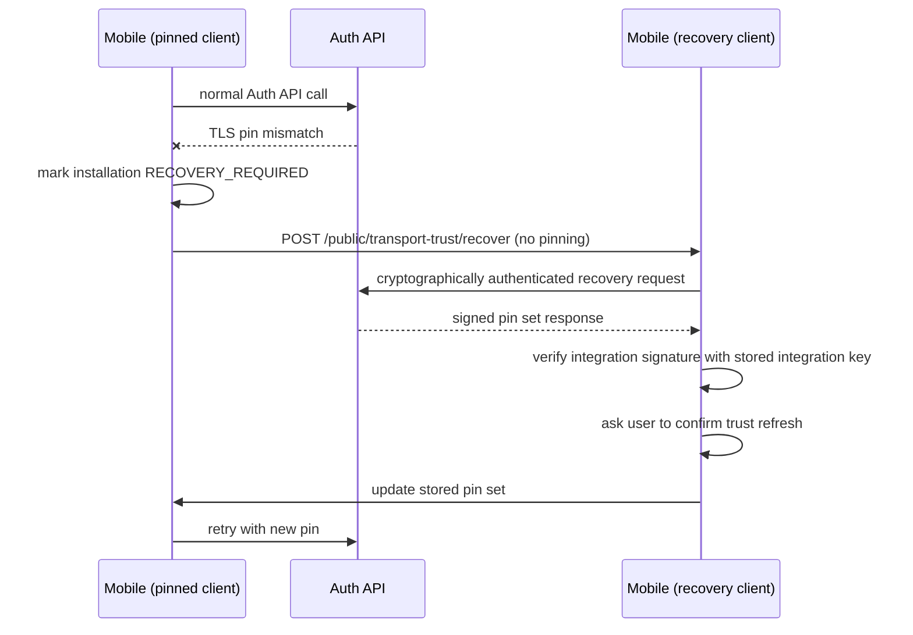

# Auth API certificate pinning for Ezkey mobile

## Executive summary

**Exact term:** the practical target is **SPKI pinning**: pin the **SHA-256 hash of the DER-encoded `SubjectPublicKeyInfo`** of the server TLS public key, not the full leaf certificate bytes.

That distinction matters because certificate renewal can keep the same key pair and therefore keep the same SPKI hash, while the certificate itself changes.

For **Ezkey on Cloudflare free**, pure static certificate pinning is operationally weak because the mobile client sees the **Cloudflare edge certificate**, not the origin certificate you control behind Cloudflare. Cloudflare-managed edge certificates may rotate without the app having a reliable pre-announcement path for the next SPKI on the free path.

**Recommended Ezkey posture:**

1. **Bootstrap trust at enrollment**: accept the first SPKI pin as part of the existing enrollment TOFU moment.
2. **Enforce pinning natively on mobile** during normal operation.
3. **Add a narrow Auth API recovery endpoint** that is reachable without pinning but authenticated by the existing Ezkey device/enrollment cryptography.
4. **Require explicit user confirmation** before replacing a stored pin after mismatch.
5. **Treat recovery as a controlled risk window**, not as a magically MITM-proof ceremony.

This gives Ezkey the middle path:

- stronger than ordinary TLS-only mobile traffic,
- materially more practical than a full PKI ceremony,
- honest about the residual risk concentrated in the trust-refresh moment.

---

## Why the Cloudflare detail changes the design

In the current experimental deployment model:

- the mobile app talks to a **Cloudflare-proxied public API hostname**,
- Cloudflare presents the **public edge certificate** to the client,
- Caddy presents a **Cloudflare Origin Certificate** only to **Cloudflare**, not to the mobile client.

So if the mobile app pins the TLS material it actually sees:

- it is pinning **Cloudflare edge TLS**, not the origin TLS you operate,
- the free-tier rotation behavior can break the app unexpectedly,
- seamless dual-pin rollout may be unavailable if you cannot know the next edge key in advance.

This creates a hard product reality:

- **static public-key pinning alone is too brittle** for the default Cloudflare-free path,
- **some form of trust refresh protocol is required** if pinning is to remain usable.

---

## Current Ezkey protocol assets we can reuse

Ezkey already has the right building blocks:

- **Enrollment TOFU moment**
  - `bind` + `verify`
  - explicit user action
  - six-digit enrollment challenge
  - durable device key pair creation
- **Long-lived enrollment secret**
  - `enrollmentProofToken`
- **Device possession proof**
  - device ECDSA signature
- **Backend-origin authenticity inside the Ezkey protocol**
  - integration-signed payloads verified by the mobile client
- **Installation identity concept already present on mobile**
  - local `installation` object derived from `authUrl`

This means we do **not** need a large new trust framework. We can attach transport trust to the existing installation/enrollment model.

---

## What should be pinned

**Pin target:** `sha256(SPKI DER)`

Do **not** pin:

- the whole certificate,
- certificate serial number,
- certificate expiration,
- origin certificate behind Cloudflare when the client never sees it.

**Why SPKI hash is the right unit:**

- survives ordinary certificate renewal when the same key pair is reused,
- aligns with industry public-key pinning practice,
- is stable enough to be meaningful,
- is easy to compare on-device.

---

## Security goal and honest boundary

### Goal

Protect the **steady-state mobile → Auth API channel** against:

- hostile Wi-Fi,
- local TLS interception,
- malicious enterprise TLS proxying,
- silent backend impersonation after enrollment.

### Honest boundary

The proposed recovery ceremony **does not fully defeat an active relay MITM** at the exact unpinned recovery moment.

It **does** give meaningful value because:

- most of the time, the app is pinned,
- mismatch becomes an explicit exceptional state,
- trust refresh becomes cryptographically authenticated inside the Ezkey protocol,
- silent unnoticed rotation is replaced with a visible controlled ceremony.

That is compatible with Ezkey's product values: good security value without pretending to be a giant ecosystem protocol.

---

## Options considered

## Option A — No pinning

### Summary

Keep the current model: ordinary TLS plus Ezkey protocol signatures.

### Pros

- simplest operationally,
- no rotation ceremony,
- no mobile platform-specific transport work.

### Cons

- no additional protection against transport MITM,
- weaker security story for a security-sensitive mobile app,
- leaves value on the table when the app already has stronger local trust state.

### Verdict

Too weak if certificate pinning is considered a meaningful product posture.

---

## Option B — Pure static SPKI pinning

### Summary

Bootstrap one pin at enrollment and fail hard forever until app update or local reset.

### Pros

- strongest simple runtime posture,
- very small protocol surface,
- no special recovery endpoint.

### Cons

- bad fit for Cloudflare-managed edge cert rotation,
- high operational brittleness,
- pushes certificate lifecycle pain directly into support and app resets.

### Verdict

Too brittle for the default Cloudflare-free model.

---

## Option C — Separate direct-origin mobile hostname

### Summary

Expose a dedicated mobile Auth API hostname outside Cloudflare proxying or under a certificate/key lifecycle you control, then use ordinary SPKI pinning there.

### Pros

- clean transport model,
- avoids special unpinned recovery endpoint,
- can support normal dual-pin rollout if you control the certificate key lifecycle.

### Cons

- extra DNS / ops / exposure decisions,
- weak alignment with the desire to stay on the simple Cloudflare-free public path,
- introduces infrastructure divergence between browser/admin and mobile.

### Verdict

Technically strong, operationally cleaner than protocol recovery, but not the default 80/20 answer for the current deployment goal.

Keep as a **future higher-assurance or premium ops path**.

---

## Option D — Ezkey-managed SPKI pinning with signed recovery

### Summary

Bootstrap trust at enrollment, pin in steady state, and recover trust through a narrow Auth API endpoint authenticated by the existing Ezkey protocol if a pin mismatch occurs.

### Pros

- works with current backend-first Ezkey philosophy,
- reuses enrollment and device-proof material,
- tolerates Cloudflare free rotation,
- keeps the risky ceremony narrow and explicit.

### Cons

- more protocol complexity than pure static pinning,
- does not eliminate risk at the unpinned recovery instant,
- requires native mobile transport work plus new Auth API endpoint.

### Verdict

**Recommended.**

This is the best match for Ezkey's "middle path" identity.

---

## Recommended design

## Design principles

1. **Installation-scoped trust**
   - Pin state belongs to the mobile `installation`, not only to a single auth attempt.
2. **Enrollment-time TOFU**
   - First trust bootstrap happens only where the user already accepts the backend relationship.
3. **Native enforcement**
   - Pinning lives below Axios.
4. **Recovery is narrow**
   - Only one small endpoint may bypass pinning.
5. **Recovery is explicit**
   - No silent automatic replacement after mismatch.
6. **Prefer existing Ezkey proofs**
   - Reuse `enrollmentProofToken`, `enrollmentId`, device key, and stored integration verification key.

---

## Trust state to store on mobile

Add an installation-level trust object conceptually like:

```text
installation.tlsTrust = {
  mode: "spki-sha256",
  pins: ["base64-sha256-spki", "...optional backup..."],
  pinSetVersion: 3,
  bootstrappedAt: "...",
  lastVerifiedAt: "...",
  lastRecoveryAt: "...",
  status: "ACTIVE" | "MISMATCH" | "RECOVERY_REQUIRED"
}
```

### Notes

- `pins` should support **one or two values** even if Cloudflare free often gives you only one active value.
- The object belongs under `installation`, which already represents the local Ezkey trust zone.
- `pinSetVersion` makes change history and audit/debugging easier.

---

## Enrollment bootstrap

During `bind` / `verify`, the mobile app stores the first SPKI pin for the effective `authUrl`.

### Bootstrap source

There are two pragmatic variants:

1. **Client-observed SPKI**
   - after a successful HTTPS call in the enrollment flow, extract the peer certificate SPKI and store its hash locally.
2. **Backend-declared SPKI**
   - the bind response includes a server-declared pin set, covered by the existing integration-signed bind payload.

### Recommendation

Use **both**:

- the client observes the actual peer certificate it saw,
- the backend can also return the declared current pin set for explicit protocol continuity,
- if they differ during enrollment, fail closed and surface an error.

This keeps the bootstrap honest: transport-observed fact plus protocol-declared fact.

---

## Steady-state runtime

After enrollment:

- all Auth API requests use the **pinned native client**,
- `instance-info`, `pending`, and `respond` remain ordinary Auth API flows,
- no extra ceremony is needed when the pin matches.

### Mobile implementation note

This must live in the native networking stack:

- **Android**: `OkHttp CertificatePinner` or equivalent native trust path
- **iOS**: `URLSession` / `SecTrust`-based public-key pin validation

`axios` and the current `httpClient.ts` remain the orchestration layer, not the trust anchor.

---

## Rotation and mismatch flow

### State machine



### Sequence



---

## Recovery endpoint design

## Why a dedicated endpoint is needed

If pin validation fails, the main pinned HTTP client cannot reach `pending` or `respond`.

So the mobile app needs a **single narrow recovery path** that intentionally does **not** enforce pinning.

This should stay on the **Auth API**, because the mobile app already treats Auth API as its backend surface.

---

## Endpoint shape

Suggested endpoint:

```text
POST /api/v1/public/transport-trust/recover
```

### Why `public`

It is HTTP-public in the same sense as `pending`: no bearer token, but still **cryptographically authenticated** in the request body.

### Suggested request fields

```json
{
  "enrollmentId": 456,
  "enrollmentProofToken": "EZK-...",
  "deviceProofToken": "random.salt",
  "deviceProofTokenSigned": "Base64DER...",
  "trustReason": "PIN_MISMATCH",
  "observedSpkiPins": [
    "sha256/...."
  ]
}
```

### Suggested response fields

```json
{
  "pinAlgorithm": "SPKI_SHA256",
  "pinSetVersion": 4,
  "pins": [
    "sha256/...."
  ],
  "recoveryDecision": "ROTATED",
  "message": "The server certificate changed and the new trust set is ready.",
  "transportTrustPayloadSignedByIntegration": "Base64Url..."
}
```

### Authentication model

The request should reuse the current Ezkey pattern:

- identify the enrollment with `enrollmentProofToken`,
- prove device possession with a device signature,
- sign a **canonical recovery payload**, not arbitrary JSON.

### Suggested canonical request payload

```text
{enrollmentProofToken}|{enrollmentId}|{deviceProofToken}|{trustReason}
```

This stays close to the existing protocol style and keeps the request easy to explain.

### Suggested canonical response payload

```text
{pinAlgorithm}|{pinSetVersion}|{pinsJoined}|{recoveryDecision}|{message}
```

Where `pinsJoined` is a deterministic comma-separated list in stable order.

The response is verified with the **stored integration public key** for the enrollment used in the recovery request.

---

## Why not a shared secret from enrollment

A recovery secret stored on device and backend sounds attractive, but it is **not the best 80/20 choice**.

### Problems

1. It adds secret lifecycle complexity.
2. It creates new sensitive storage on both sides.
3. It does **not** truly solve an active relay MITM during recovery if the attacker can forward traffic to the real backend.
4. It adds ceremony without proportionate risk reduction.

### Recommendation

Do **not** make an enrollment-time shared secret the default recovery mechanism.

If a future high-assurance mode is needed, it should be framed as:

- an **optional hardening tier**,
- likely combined with operator-visible out-of-band confirmation,
- not the baseline Ezkey default.

---

## What the backend must know

The server needs a trustworthy source for the current live pin set.

For the Cloudflare-backed path this likely means:

1. detect or fetch the **current edge certificate/SPKI** for the public Auth API hostname,
2. publish that as the authoritative current pin set,
3. increment `pinSetVersion` when it changes,
4. expose it through the signed recovery endpoint.

### Important product reality

If Cloudflare free cannot reliably expose the **next** edge key before activation, then seamless "old pin + next pin" pre-rollout may be unavailable.

So the plan should assume:

- **post-rotation recovery is the normal free-tier path**,
- not seamless pre-announced dual-pin rollover.

That is acceptable as long as the app and docs present it honestly.

---

## User experience posture

### Normal case

- no extra UI,
- pinning is invisible.

### Rotation case

Show a sober recovery message:

- the server identity changed,
- this may be a legitimate certificate rotation or an attack,
- the app can ask the server for an updated trust set,
- the user must explicitly confirm the update.

### Message tone

This should sound like Ezkey:

- serious,
- pragmatic,
- not theatrical,
- explicit about uncertainty.

---

## Recommended implementation phases

## Phase 1 — Protocol and model

- Define the installation TLS trust model in docs.
- Specify canonical request/response payloads for trust recovery.
- Decide whether bind includes backend-declared pin metadata in addition to client-observed SPKI.

## Phase 2 — Android first

- Add installation `tlsTrust` storage.
- Add native pin enforcement on Android.
- Add one recovery client path that bypasses pinning only for the recovery endpoint.
- Add mismatch UI and explicit confirmation.

## Phase 3 — Auth API support

- Implement `POST /api/v1/public/transport-trust/recover`.
- Add server-side pin-set discovery and versioning.
- Add audit logging for trust recovery attempts and accepted updates.

## Phase 4 — Validation

- Test against a real Cloudflare-backed hostname.
- Force a cert/key rotation scenario.
- Validate both:
  - legitimate rotation recovery,
  - recovery failure on malformed signed response.

## Phase 5 — iOS

- Mirror the same model in native iOS trust validation.

---

## Risks and accepted trade-offs

## Accepted

- Recovery is a controlled weaker moment than steady-state pinned traffic.
- Cloudflare free may force reactive recovery rather than proactive dual-pin rotation.
- The first enrollment bootstrap remains TOFU.

## Rejected

- pretending this is as strong as WebAuthn/FIDO transport guarantees,
- adding a heavyweight shared-secret recovery ceremony by default,
- static pinning with no recovery path for the Cloudflare-free default model.

---

## Final recommendation

Adopt **Option D** as the default Ezkey design:

- **SPKI hash pinning**
- **installation-scoped trust state**
- **enrollment bootstrap**
- **native pin enforcement**
- **cryptographically authenticated Auth API recovery endpoint**
- **explicit user-confirmed trust refresh on mismatch**

Also keep **Option C** documented as the stronger future path for deployments that can justify a dedicated mobile hostname or a certificate lifecycle fully under operator control.

That gives Ezkey a credible, pragmatic, backend-first certificate pinning model that fits the product's values instead of fighting them.
