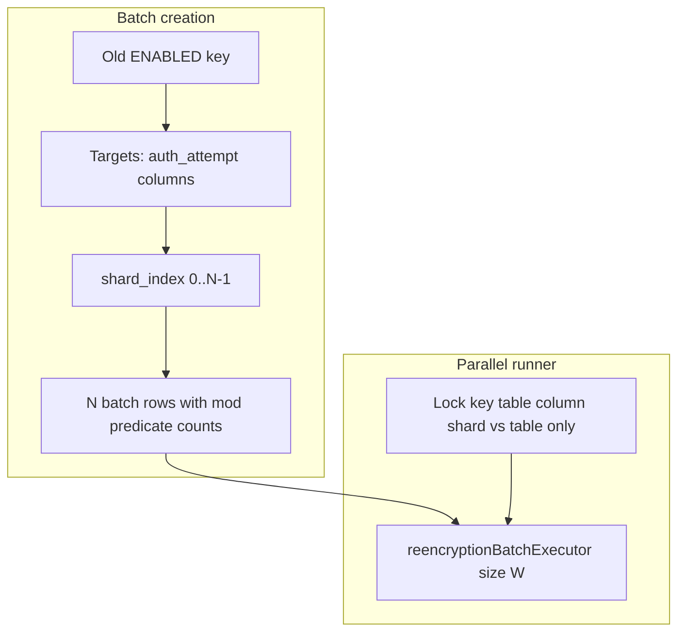

# Phase 1 — Sharded re-encryption for `ezkey_auth_attempt` (performance)

## Scope boundary

| In scope (this delivery) | Out of scope — **Phase 2** (separate plan; see [Appendix: Phase 2 handoff](#appendix-phase-2--re-encryption-resilience--ops-future-plan-for-a-coding-assistant-session)) |
|--------------------------|------------------------------------------------------------------------------------------------------------------------------------------------------------------------|
| Shard batches + `mod(auth_attempt_id, N)` SQL, creation, mutex, config | Hardening **resilience** (scheduler `IN_PROGRESS`, `autoRetryFailed`, transactional progress commits, watchdogs, extended ops docs) |
| Minimal **shard** fields on API + Admin UI (identify shard in batch list/detail) | **Per-section Refresh** on encryption-keys page, **polling** improvements when active batches are off-page |
| `REENCRYPTION_OPERATIONS.md` for sharding + tuning + memory estimate | Deep-dive **crash recovery** product work beyond documenting current behavior |

**Rationale:** Keep this plan focused on the **original goal — performance** (parallel shard work on the large auth-attempt table). Resilience and observability refinements are **documented below as Phase 2** so a future session can pick them up with full context without blocking sharding.

---

## Context (current behavior)

- **Batch creation**: [`ReencryptionBatchCreationService.createBatchesForOldKeys()`](c:/github/ezkey/ezkey-core/src/main/java/org/ezkey/security/ReencryptionBatchCreationService.java) creates **one** `ReencryptionBatch` per `(oldKey, target table, target column)` when no active batch exists and count &gt; 0.
- **Fetch/count**: [`ReencryptionTargetQueryService`](c:/github/ezkey/ezkey-core/src/main/java/org/ezkey/security/ReencryptionTargetQueryService.java) delegates to native queries on [`AuthAttemptRepository`](c:/github/ezkey/ezkey-core/src/main/java/org/ezkey/authattempt/domain/repository/AuthAttemptRepository.java) — `LIKE ENC:{keyId}:%` plus `auth_attempt_id > :lastId` for resumable scans.
- **Parallelism**: [`ReencryptionBatchParallelRunner`](c:/github/ezkey/ezkey-core/src/main/java/org/ezkey/security/ReencryptionBatchParallelRunner.java) uses [`reencryptionBatchExecutor`](c:/github/ezkey/ezkey-core/src/main/java/org/ezkey/security/config/ReencryptionExecutorConfiguration.java) sized to `parallelBatchWorkers`, but **synchronizes on `target_table` only**, so **at most one batch touches `ezkey_auth_attempt` at a time** (including the two encrypted columns). That avoids cross-column row contention (notably for enrollment) but **caps throughput** on the large auth-attempt table.
- **Docs / prior plans**: Service split and table mutex are documented in [`.cursor/plans/archived/2026-04/lifecycle_after_reencrypt_refactor_7721f359.plan.md`](c:/github/ezkey/.cursor/plans/archived/2026-04/lifecycle_after_reencrypt_refactor_7721f359.plan.md) and [`docs/REENCRYPTION_OPERATIONS.md`](c:/github/ezkey/docs/REENCRYPTION_OPERATIONS.md).

## Design choice: persisted shard batches vs in-thread split

| Approach | Pros | Cons |
|---------|------|------|
| **A. Multiple `ReencryptionBatch` rows (one per shard)** | Reuses existing resume/progress/Admin UI; each shard has its own `last_record_id`; natural fit for existing `parallelBatchWorkers` + executor queue; clear ops visibility | Flyway migration; creation logic must split counts; more rows in batch table |
| **B. Single batch + internal multi-threaded slice processing** | One batch row | Multiple cursors, harder resume semantics, more complex failure handling, poorer observability |

**Recommendation: A** — aligns with simplicity, minimal new moving parts, and matches how work is already parallelized (distinct batch IDs).

**Explicitly out of scope for Phase 1:** a second thread pool dedicated to auth-attempt only. **Reuse** the existing `reencryptionBatchExecutor`; scale **pool size** via existing `parallelBatchWorkers` (and queue capacity).

## Shard criterion

Use **integer modulus on the primary key**:

`mod(auth_attempt_id, shard_count) = shard_index`

- **Even/odd** is the special case `shard_count = 2`.
- **Partition**: disjoint row sets; **no double work** and **full coverage** if `shard_index ∈ [0, shard_count)`.
- **Stability**: independent of time or tenant; safe for resume.

Add the same predicate to **count** and **fetch** native SQL for both auth-attempt columns in `AuthAttemptRepository`, and thread `shardIndex` / `shardCount` from the batch into `ReencryptionTargetQueryService.fetchRecords` / `countRecordsEncryptedWithKey` when the batch is sharded.

## Schema and batch identity

- Add nullable columns on `ezkey_reencryption_batch`, e.g. `shard_index` (nullable `SMALLINT`) and `shard_count` (nullable `SMALLINT`), with **`NULL` = non-sharded batch** (enrollment targets and any single-stream auth-attempt batch).
- **Uniqueness for “active batch”**: extend the concept used by `findActiveBatchesByTargetAndOldKey` so that for sharded auth-attempt batches, **only one** `PENDING`/`IN_PROGRESS` row exists per `(target_table, target_column, old_key_id, shard_index)` when `shard_count` is set.

## Flyway and schema evolution (development-first, no production carryover)

**Context:** The project is in **development**; there is **no production database** that must be upgraded in place. Migrations should stay **clean and readable** as if the schema were designed from day one.

**Approach:**

- **Retrofit** the new columns into the **existing** migration that already creates `ezkey_reencryption_batch`: [`V3__encryption_keyset_and_audit_jsonb_indexes.sql`](c:/github/ezkey/ezkey-core/src/main/resources/db/migration/V3__encryption_keyset_and_audit_jsonb_indexes.sql) (see `CREATE TABLE ezkey_reencryption_batch` and related indexes/comments). Add `shard_index` and `shard_count` there, plus `COMMENT ON COLUMN` and any index needed for “active batch by target + old key + shard” next to the current batch indexes.
- **Do not** add a **new** versioned file (e.g. `V8__...`) solely for these nullable columns unless the team later chooses a strict “never edit applied migrations” policy for other reasons.
- **No data migration**: do **not** author `UPDATE` / backfill steps for pre-existing batch rows. Empty `NULL`s for new columns are the natural default for non-sharded batches.
- **Local / CI databases:** Editing `V3` **changes the Flyway checksum** of an already-applied script. Developers (and CI) should **recreate the database** from scratch (e.g. clean Docker volume, `clean-start`, or `flyway clean` + migrate) after pulling this change — acceptable and expected for dev.

This keeps the migration chain **short, coherent, and organized** without additive “patch” migrations for a schema that has not shipped to production.

## Creation rules (`ReencryptionBatchCreationService`)

- New config: when `target_table == ezkey_auth_attempt` and `shard_count > 1`:
  - For each `(oldKey, column)`, **create `shard_count` batches** with `shard_index = 0..shard_count-1`.
  - **`records_total`** per batch = **exact** count with `LIKE` prefix **and** `mod` predicate.
- When `shard_count == 1` (default): **unchanged** single batch per target.
- **Enrollment**: never shard in Phase 1.

## Parallel runner mutex (critical)

- **Enrollment** (`ezkey_enrollment`): **keep** locking on **`target_table` only**.
- **`ezkey_auth_attempt` with sharding** (`shard_count > 1`): lock key = **`target_table + "|" + target_column + "|" + shard_index`** so **shards of the same column** run concurrently.
- **`ezkey_auth_attempt` without sharding** (`shard_count` null or 1): **keep** **`target_table` only** so **both columns** remain mutually exclusive (same as today).

**Cross-column safety when sharding is on**: different columns may touch the **same row**; rely on **`PESSIMISTIC_WRITE`** in [`ReencryptionRowPersistenceService`](c:/github/ezkey/ezkey-core/src/main/java/org/ezkey/security/ReencryptionRowPersistenceService.java) (`AuthAttempt` has no `@Version`).

### ShedLock vs JVM mutex (unchanged; no extra work in Phase 1)

**ShedLock** (`@SchedulerLock(name = "REENCRYPTION")` on [`processReencryptionBatches`](c:/github/ezkey/ezkey-core/src/main/java/org/ezkey/security/ReencryptionService.java)) ensures **one scheduler tick cluster-wide**. **Do not** add ShedLock per shard. **In-process** mutex in [`ReencryptionBatchParallelRunner`](c:/github/ezkey/ezkey-core/src/main/java/org/ezkey/security/ReencryptionBatchParallelRunner.java) coordinates parallel batch tasks on a node — update lock keys per § above when sharding.

### Resilience / crash recovery — **Phase 2 only**

Behavior today (batch transaction boundaries, `IN_PROGRESS` vs scheduler pickup, `autoRetryFailed` unused, etc.) is **analyzed in the appendix** for a **future plan**. **This Phase 1 delivery does not** change resilience semantics beyond what sharding inherently adds (more batch rows).

## Configuration (externalized)

Extend [`TinkProperties.Reencryption`](c:/github/ezkey/ezkey-core/src/main/java/org/ezkey/config/TinkProperties.java):

- **`authAttemptShardCount`** (int, default **1**).
- **`parallelBatchWorkers`**: often **≥** concurrent shard batches; two columns doubles eligible batches.
- **`maxBatchesPerRun`**: may need raising when many shard rows exist.

## Memory estimate (per worker thread)

Peak ≈ **`effectiveBatchSize × size_of_loaded_row`** (native `SELECT *`). Document in [`REENCRYPTION_OPERATIONS.md`](c:/github/ezkey/docs/REENCRYPTION_OPERATIONS.md).

---

## Admin UI (Phase 1 — minimal)

- **In scope:** Expose **`shardIndex`** / **`shardCount`** on `ReencryptionBatchResponse` and show them in the batches table and batch detail (so operators can distinguish shard rows). i18n EN/FR.
- **Out of scope (Phase 2):** second **Refresh** control scoped to batches only; **refetchInterval** behavior when active work is on another page — see appendix.

---

## Testing and documentation (Phase 1)

- Unit/integration tests for shard creation, SQL, locks; Admin API DTO tests if added.
- [`docs/REENCRYPTION_OPERATIONS.md`](c:/github/ezkey/docs/REENCRYPTION_OPERATIONS.md): sharding, tuning, memory; **brief** note pointing to Phase 2 for deep resilience ops if desired.
- OpenAPI: maintainer runs `update-specs` after Java changes; agent does not hand-edit `specs/`.

---

## Appendix: Phase 2 — Re-encryption resilience & ops (future plan for a coding assistant session)

**Purpose:** When you open a **new** plan or session for “re-encryption resilience”, use this block as **context** so the assistant does not need to rediscover behavior from scratch. **Not in scope for Phase 1 (sharding)** above.

**Suggested future plan title (file):** e.g. `.cursor/plans/reencryption_resilience_and_ops.plan.md` — create when starting Phase 2.

### Problem statement

Operators need **clear recovery** under **DB pressure, JVM OOM, or hard kill**: no silent corruption, predictable **batch status**, and **automatic** pickup where possible. The product already has **per-row** `REQUIRES_NEW` commits and **prefix-based** idempotency; **gaps** are mostly **scheduling**, **configuration wiring**, and **visibility**.

### Current behavior (reference code)

| Topic | Location / fact |
|-------|------------------|
| Batch processing TX | [`ReencryptionBatchProcessingService.processBatchInternal`](c:/github/ezkey/ezkey-core/src/main/java/org/ezkey/security/ReencryptionBatchProcessingService.java) — `@Transactional(REQUIRES_NEW)` wraps the **whole** loop; batch row updates **commit** at method end. |
| Row commits | [`ReencryptionRowPersistenceService`](c:/github/ezkey/ezkey-core/src/main/java/org/ezkey/security/ReencryptionRowPersistenceService.java) — `REQUIRES_NEW` per row. |
| Idempotency | [`ReencryptionRecordCipher.isCandidateForReencryption`](c:/github/ezkey/ezkey-core/src/main/java/org/ezkey/security/ReencryptionRecordCipher.java) — old key prefix; fetch uses `LIKE ENC:{oldKeyId}:%`. |
| Scheduler batch list | [`ReencryptionService.processReencryptionBatches`](c:/github/ezkey/ezkey-core/src/main/java/org/ezkey/security/ReencryptionService.java) — `findBatchesEligibleForResume()` (**FAILED**, **PAUSED**) + `findByStatus(PENDING)` — **`IN_PROGRESS` not included**. |
| Failed marking | [`markBatchFailed`](c:/github/ezkey/ezkey-core/src/main/java/org/ezkey/security/ReencryptionBatchProcessingService.java). |
| Unused config | `TinkProperties.Reencryption.autoRetryFailed` — **not referenced** in codebase; retries rely on **FAILED** being in eligible query. |
| Dead repository API | `findMostRecentResumableBatch` in [`ReencryptionBatchRepository`](c:/github/ezkey/ezkey-core/src/main/java/org/ezkey/security/domain/repository/ReencryptionBatchRepository.java) — **unused** (optional cleanup). |

### Candidate deliverables (Phase 2 — pick with product)

1. **Scheduler:** Include **`IN_PROGRESS`** in the work queue **or** document that **`resume`** is required; optionally a **watchdog** for stale `IN_PROGRESS`.
2. **`autoRetryFailed`:** Wire the property to **gate** retry of **FAILED** batches **or** remove/document as dead config.
3. **Progress visibility:** Optional **chunk commits** or **document** that progress in DB updates **only** when the outer `processBatchInternal` transaction commits (operator-facing docs).
4. **Admin UI:** **Batches-only Refresh**; improve **`refetchInterval`** when active batches are **off the current page** ([`encryption-keys.tsx`](c:/github/ezkey/ezkey-admin-ui/src/pages/encryption-keys.tsx) `ReencryptionBatchesSection`).
5. **Docs:** Extend [`REENCRYPTION_OPERATIONS.md`](c:/github/ezkey/docs/REENCRYPTION_OPERATIONS.md) for crash recovery and monitoring.

### Non-goals unless explicitly chosen

- Replacing **ShedLock** or adding **per-shard** distributed locks (see Phase 1 ShedLock note).
- Changing **ciphertext** format or rotation protocol.

### Dependency

- **Phase 2 is independent** of sharding completion but **builds on** the same batch model; run after Phase 1 or in parallel **only** if teams coordinate.
