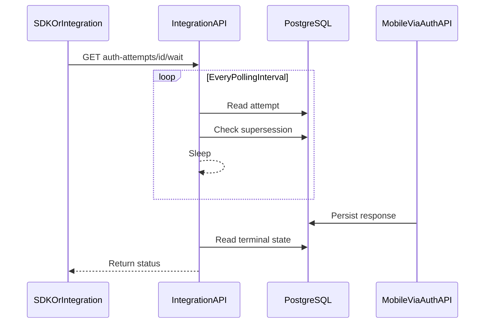

# Authentication Wait Evolution — Retained Brainstorm

> **Status:** Materialized into canonical `product-docs` on 2026-07-18. This file preserves the
> original brainstorming option space. The linked vision and backlog artifacts own current
> orientation and progression; no implementation direction has been selected.

## Canonical materialization

- **Materialization lane:** `Lane B` — plan incubation → canonical `product-docs`.
- **Status:** materialized on `2026-07-18`.
- **Vision:** [`product-docs/global/vision/V-2026-07-18-authentication-wait-evolution.md`](../../product-docs/global/vision/V-2026-07-18-authentication-wait-evolution.md)
- **Backlog idea:** [`product-docs/global/backlog/ideas/I-2026-07-18-authentication-wait-evolution.md`](../../product-docs/global/backlog/ideas/I-2026-07-18-authentication-wait-evolution.md)
- **Tracer bullet:** not created; the work remains exploratory and is not execution-ready.
- **GitHub issue / branch:** not created; implementation has not started.
- **Methodology gate:** retained-plan bidirectional traceability completed.
- **Plan role after materialization:** retained source and option-space record; canonical direction
  and progression live in the linked artifacts above.

## Purpose and posture

This is a research-only brainstorm for realistic evolutions of the authentication-attempt wait
protocol. It compares alternatives on network traffic, threads, memory, database load, proxy
compatibility, stack fit, market fit, and gains versus complexity.

The current mechanism remains an intentionally acceptable simplicity trade-off for Ezkey's target
market. The alternatives below are hypotheses to investigate, not accepted architecture decisions.
Technical claims must be revalidated against the current code, deployment posture, and measured
load before any option is promoted.

## 1. Current state

Implementation and contract anchors:

- [`AuthAttemptWaitService.java`](../../ezkey-core/src/main/java/org/ezkey/authattempt/service/AuthAttemptWaitService.java)
  uses `@Transactional(propagation = NOT_SUPPORTED)`, repeatedly loads current attempt state and
  supersession state, and sleeps for the configured polling interval.
- [`IntegrationApiAuthAttemptController.java`](../../ezkey-integration-api/src/main/java/org/ezkey/integration/api/controller/IntegrationApiAuthAttemptController.java)
  exposes `GET /api/v1/auth-attempts/{id}/wait?timeout=30&polling=2`.
- [`AuthAttemptController.java`](../../ezkey-admin-api/src/main/java/org/ezkey/admin/controller/AuthAttemptController.java)
  exposes the corresponding Admin API auth-attempt wait surface.
- [`AdminAuthAttemptTxHelper.java`](../../ezkey-admin-api/src/main/java/org/ezkey/admin/service/AdminAuthAttemptTxHelper.java)
  uses `REQUIRES_NEW` so passwordless-login attempt creation commits before waiting begins.
- [`docs/ENDPOINT.md`](../../docs/ENDPOINT.md) documents the public wait contract.

Operational facts that constrain the design space:

- Integration API enables Java virtual threads, so a blocking long-poll parks a virtual thread.
- Admin API does not currently enable virtual threads and sizes Tomcat platform-thread pools by
  profile, making its wait posture asymmetric with Integration API.
- PostgreSQL is the authoritative shared store, so PostgreSQL notification mechanisms are
  technically available but would increase database-specific coupling.
- Each polling cycle performs short database work rather than holding one transaction across the
  entire wait.
- Keep three wait surfaces distinct unless analysis widens scope:
  1. Mobile Auth API `POST /pending` — user-initiated pull ([ADR-0002](../../product-docs/global/architecture-decisions.md#adr-0002-user-initiated-mobile-polling)).
  2. Admin login `POST /admin/auth/passwordless-wait`.
  3. Integration/Admin `GET /auth-attempts/{id}/wait` (primary focus of this brainstorm).
- ADR-0002 rejects automatic mobile polling and platform push for the mobile path; it does not by
  itself forbid backend wait optimization. Mobile push ideas in older plans must not be treated as
  canon for this slice.
- Optional PostgreSQL `LISTEN/NOTIFY` already appears as a non-canonical optimization sketch in
  [`docs/features/ADMIN_PASSWORDLESS_LOGIN.md`](../../docs/features/ADMIN_PASSWORDLESS_LOGIN.md).
- `I-2026-0004` / `V-2026-0003` concern API-key acceptance and Admin vs Integration placement, not
  wait transport.
- Admin API already runs auth-attempt expiry scheduling, so background state progression exists.

## 2. Evaluation axes

Every alternative should be evaluated against the same axes:

- network bytes and request rate per pending attempt;
- server thread and memory cost per pending attempt;
- Tomcat and connection-pool sizing implications;
- database query and connection cost;
- reverse-proxy compatibility, including idle and read timeouts;
- single-instance and multi-instance behavior;
- Java and TypeScript SDK surface changes;
- backward compatibility for Postman, Admin UI, demo applications, and other consumers;
- authorization, rate limiting, auditability, and cancellation semantics;
- operational simplicity and debuggability;
- fit with Ezkey's simplicity-first, backend-first, self-hosted market posture.

## 3. Candidate evolutions

### Idea 1 — Keep the contract and tune the current mechanism

- Preserve the current endpoint and synchronous-like SDK experience.
- Consider a longer default polling interval, subject to measured latency expectations.
- Consider enabling virtual threads on Admin API to remove the current thread-model asymmetry.
- Document realistic concurrency and timeout envelopes.

**Potential value:** minimal contract churn and the lowest implementation risk.

**Limits:** database polling remains; the improvement is quantitative rather than architectural.
Virtual-thread adoption also requires pinning and library-behavior validation rather than being
treated as a free capacity multiplier.

### Idea 2 — PostgreSQL `LISTEN/NOTIFY` with the existing external contract

- Keep the public wait endpoint unchanged.
- Replace most sleep-and-query cycles with an internal waiter registry and a database notification
  listener.
- Publish an attempt identifier after terminal transitions such as respond, cancel, supersession,
  or scheduled expiry.
- Retain a coarse database recheck as a safety net for missed notifications, listener reconnects,
  and timeout calculation.

**Potential value:** near-immediate wake-up, much lower idle query load, and cross-process signal
delivery without introducing a separate broker.

**Costs and risks:** dedicated listener-connection lifecycle, reconnect behavior, commit-ordering
correctness, payload limits, and stronger PostgreSQL coupling. Notifications must only accelerate
observation; PostgreSQL rows remain authoritative.

### Idea 3 — In-process publication with database-poll fallback

- Register local waiters by auth-attempt identifier.
- Publish an in-process Spring event when a local process performs a terminal transition.
- Keep a coarse database poll for transitions performed by other processes.

**Potential value:** very small implementation surface and fast same-process wake-up.

**Limits:** Admin API, Auth API, and Integration API are separate processes, so local events do not
solve the principal cross-process path. The fallback would remain essential, making this mostly a
local optimization.

### Idea 4 — Decoupled wait-ticket protocol

Possible additive endpoint shape:

- `POST /api/v1/auth-attempts/{id}/wait/start`
  → `201 { waitId, expiresAt }`
- `GET /api/v1/auth-attempt-waits/{waitId}`
  → current or terminal wait state

The start call returns immediately. Server-side work may continue on a virtual thread or another
waiting primitive without keeping the initiating HTTP request open. The SDK polls the ticket at a
cadence suitable for its environment.

**Potential value:**

- avoids a long-lived client-to-server HTTP request;
- behaves predictably through proxies and infrastructure with strict request timeouts;
- stays within ordinary HTTP request/response semantics;
- allows client-controlled cadence and can pair with an internal notification mechanism.

**Costs and risks:**

- introduces a second lifecycle and two endpoints;
- requires credential-bound authorization and unguessable ticket identifiers;
- needs explicit cleanup, cancellation, expiry, rate limiting, and audit rules;
- in-memory tickets require affinity or fail on instance change;
- durable tickets add database schema and contention without necessarily reducing database load;
- background threads are not free simply because the initiating HTTP request ended.

An important challenge for later analysis is whether the existing auth-attempt identifier already
provides enough status-addressability. A new wait identifier must earn its separate lifecycle.

### Idea 5 — Server-Sent Events

- Add an additive `text/event-stream` endpoint for attempt-state changes.
- Use Spring MVC async support such as `SseEmitter`, with an internal signal source and
  authoritative database reread.

**Potential value:** one-way server push matches the actual requirement better than a bidirectional
socket and remains based on HTTP.

**Costs and risks:** long-lived connections still exist; proxy buffering and timeout behavior must
be validated; Java and TypeScript SDKs need streaming support; reconnection and `Last-Event-ID`
semantics need a deliberate contract. SSE is simpler than WebSockets but not operationally free.

### Idea 6 — WebSockets

- Introduce an upgraded bidirectional connection and subscriptions scoped to attempts or
  integrations.
- Optionally use a messaging subprotocol such as STOMP.

**Potential value:** efficient bidirectional communication and multiplexing if Ezkey later needs
many live event types over one channel.

**Costs and risks:** a parallel authentication and authorization surface, connection lifecycle,
proxy and load-balancer behavior, reconnect and replay rules, per-subscription access control,
SDK complexity, rate limiting, and harder request-level auditability.

**Current fit hypothesis:** disproportionate for a one-shot terminal-status notification and the
expected concurrency of Ezkey's current market. SSE or an improved HTTP wait can capture most of
the relevant value with less protocol surface.

### Idea 7 — Signed webhook callback

- Let an integration optionally register a callback target for a specific attempt or integration.
- Deliver a signed terminal-state payload with bounded retries and idempotency metadata.

**Potential value:** no wait or polling for backend integrations and natural scalability for
systems that already accept callbacks.

**Costs and risks:** outbound-network policy, SSRF protection, target allowlisting, signature-key
management, retries, idempotency, dead-letter visibility, callback rotation, and customer-operated
receiver availability.

**Current fit hypothesis:** a separate optional integration capability, not a general replacement
for Admin UI or SDK wait behavior.

### Idea 8 — Client short-polling with conditional status reads

- Remove server-side long waiting for clients that prefer stateless polling.
- Expose a lightweight status read and support conditional requests using `ETag` or a version
  token.
- Return server hints such as `Retry-After` where useful.

**Potential value:** stateless server handling, ordinary HTTP semantics, straightforward
multi-instance behavior, and client-controlled cadence.

**Costs and risks:** moves request frequency to every client, may increase network and
authentication overhead, and needs careful cache-control so security-sensitive state is never
shared or stale beyond policy.

This could be an additive low-complexity SDK mode even if the existing long-poll remains the
default.

### Idea 9 — Hybrid direction to investigate

A plausible staged direction, not an accepted decision:

1. Measure and tune the current mechanism.
2. Validate virtual threads on Admin API as an isolated operational improvement.
3. Investigate PostgreSQL notification-assisted wake-up while keeping database state authoritative
   and retaining a coarse polling fallback.
4. Keep the existing wait contract as the compatibility default.
5. Consider one additive HTTP alternative only if a concrete deployment problem justifies it:
   conditional short-polling, a wait ticket, or SSE.
6. Defer WebSockets until Ezkey has a real multiplexed bidirectional requirement.
7. Treat webhooks as a separate backend-integration capability.

## 4. Initial comparison

| Option | Contract churn | Idle DB load | Long-lived HTTP | Multi-instance posture | Relative complexity |
| --- | --- | --- | --- | --- | --- |
| Tune current wait | None | Unchanged or reduced | Yes | Strong | Low |
| PostgreSQL notification assist | None | Low with fallback | Yes | Strong if listener lifecycle is sound | Medium |
| In-process publication | None | Reduced only locally | Yes | Weak without fallback | Low to medium |
| Wait ticket | Additive | Depends on implementation | No for start/status calls | Weak in-memory; stronger if durable | Medium |
| SSE | Additive | Low with signal source | Yes | Requires distributed signal source | Medium |
| WebSocket | Additive parallel protocol | Low with signal source | Persistent upgraded connection | Requires deliberate routing/state design | High |
| Signed webhook | Additive | Low | No inbound wait connection | Strong with durable delivery | High operational surface |
| Conditional short-poll | Additive or substitutive | Query-driven | No | Strong | Low to medium |

The table is qualitative. A later analysis should replace assumptions with workload measurements
and explicit deployment scenarios.

## 5. Questions before convergence

- What concurrent wait envelope should Ezkey support for its September 2026 operable-release
  posture and for a plausible larger self-hosted installation?
- Where is the measured bottleneck: platform threads, virtual-thread memory, Tomcat connections,
  reverse-proxy timeouts, Hikari pressure, database queries, or client connection budgets?
- Should Admin API virtual-thread adoption be an independent experiment?
- Which state transitions must wake a waiter, and how is a wake-up ordered after transaction commit?
- Is multi-instance operation a current requirement or a future constraint that must only avoid
  architectural dead ends?
- Is PostgreSQL `LISTEN/NOTIFY` acceptable across the managed and self-hosted PostgreSQL profiles
  Ezkey intends to support?
- Does a wait ticket add meaningful semantics beyond polling by `authAttemptId`?
- Which external mode gives the best SDK ergonomics under realistic proxy and timeout policies?
- Should the mobile `pending` pull path remain explicitly separate, or should a later program
  evaluate both polling directions together?
- What failure mode is acceptable when the acceleration mechanism is unavailable: fall back to
  polling, or fail the wait?

## 6. Evidence expected from follow-up analysis

- A small workload model covering pending-attempt duration, concurrency, polling interval, query
  count, and connection cost.
- Runtime measurements for the current Integration API and Admin API paths.
- A proxy-timeout compatibility check through the production-like Caddy route.
- A virtual-thread pinning and cancellation check on the actual Java/Spring/JDBC stack.
- A cross-process proof for any notification design.
- Security review of authorization, identifier disclosure, replay, cancellation, and rate limits
  for any new endpoint.
- SDK ergonomics comparison for Java and TypeScript.
- A documented first-slice recommendation with explicit non-goals and rollback posture.

## 7. Deliberate exclusions

- No architecture decision is recorded by this plan.
- No endpoint, DTO, OpenAPI specification, SDK, Postman collection, or configuration changes are
  authorized by this plan.
- No tracer bullet should be created until the analysis converges on a bounded first slice.
