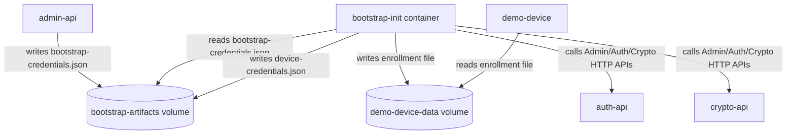

# Docker-only bootstrap init (1A) + artifacts in named volume (2B)

## Goals

- Make the **base** Docker stack (`docker/docker-compose.yml`) fully runnable for demos and manual testing with **Docker as the only dependency**.
- After `docker/start.*`, have:
- **Bootstrap enrollment credentials available** (for automation) without log scraping.
- **Demo-device pre-seeded** so it is immediately usable.
- Keep security/DX simple now; add a small **Future considerations** section for SOC2/on-prem nuance.

## Current situation (confirmed)

- `ezkey-tests/clean-start.sh` currently requires host Maven/JDK because it runs:
- `mvn test -pl ezkey-tests -Dtest=BootstrapCredentialsExtractionTest`
- `mvn test -pl ezkey-tests -Dtest=AdminTokenCreationTest`
- The base Docker stack already builds/runs the services entirely inside Docker using BuildKit cache (`docker/Dockerfile`), so the remaining host dependency comes from the **tests-as-bootstrap-scripts** pattern.

## Proposed Phase 1 architecture (1A)

### Key design decisions

- **No Docker socket mounts** (no `docker logs`, no `docker exec` from the init container).
- **Recovery codes**: **not exported to file** (remain logs-only for now).
- **Artifacts location**: **named volume** only (2B).

## Implementation plan (Phase 1)

### 1) Admin API: add Docker-only bootstrap credentials file export (no recovery codes)

- Add a small, opt-in writer that persists a JSON file after the global admin enrollment is created.
- The file must include only what the init container needs:
- `enrollmentId`
- `enrollmentProofToken`
- `enrollmentChallengeCode`
- (optional) `username` (e.g., `admin.docker`) for clarity
- **exclude** recovery codes
- Make it **idempotent**:
- If file already exists, do not overwrite (or overwrite only if content matches) to avoid churn.
- Guardrails:
- Enabled only via Docker profile/property (default **false**).
- Path configurable, default to something like `/var/lib/ezkey/bootstrap/bootstrap-credentials.json`.

**Primary files**:

- [`ezkey-admin-api/src/main/java/org/ezkey/admin/service/AdminBootstrapService.java`](ezkey-admin-api/src/main/java/org/ezkey/admin/service/AdminBootstrapService.java)
- (new) `org.ezkey.admin.service.BootstrapCredentialsFileExporter` (or similar)
- Admin API config props:
- likely in `ezkey-admin-api/src/main/java/org/ezkey/admin/config/` (new `@ConfigurationProperties`)
- Docker profile properties:
- `ezkey-admin-api/config/application-docker.properties` (or equivalent under `config/`)

### 2) Docker Compose: add a `bootstrap-init` one-shot service

- Add a new service in [`docker/docker-compose.yml`](docker/docker-compose.yml) that:
- `depends_on` health of `admin-api`, `auth-api`, `crypto-api`, and `demo-device` (or at least the first three).
- Mounts two volumes:
    - `bootstrap-artifacts:/bootstrap`
    - `demo-device-data:/demo-device-data`
- Runs a script that:

    1. Waits until `/bootstrap/bootstrap-credentials.json` exists.
    2. Reads `enrollmentId`, `enrollmentProofToken`, `enrollmentChallengeCode`.
    3. Calls Crypto API to generate a device keypair.
    4. Calls Auth API `/enrollments/bind` then `/enrollments/verify` (sign via Crypto API `/sign`).
    5. Writes `/bootstrap/device-credentials.json`.
    6. Seeds demo-device by writing a record file to `/demo-device-data/enrollments/{enrollmentId}.json`, matching `EnrollmentStoreService.Record` structure.

**New files**:

- (new) [`docker/bootstrap-init/Dockerfile`](docker/bootstrap-init/Dockerfile)
- (new) [`docker/bootstrap-init/bootstrap-init.sh`](docker/bootstrap-init/bootstrap-init.sh)

### 3) Wire the new `bootstrap-artifacts` named volume

- Add a volume `bootstrap-artifacts:` in `docker/docker-compose.yml`.
- Mount it into `admin-api` (read/write) at the chosen export directory.

### 4) Update scripts and docs to reflect Docker-only flow

- Update:
- [`docker/start.sh`](docker/start.sh)
- [`docker/README.md`](docker/README.md)
- Windows scripts equivalents (`docker/start.ps1`, `docker/start.bat`) if they mention “Next steps required: mvn test …”.
- Add a short “How to retrieve artifacts from volume” section, with commands like:
- Print bootstrap creds: same pattern.

### 5) Phase 1: disable the two Maven-based bootstrap tests and stop using them in startup paths

- Temporarily disable/quarantine:
- `ezkey-tests/src/test/java/org/ezkey/tests/security/bootstrap/BootstrapCredentialsExtractionTest.java`
- `ezkey-tests/src/test/java/org/ezkey/tests/security/admin/AdminTokenCreationTest.java`
- Minimal mechanism (Phase 1): annotate with `@Disabled("Replaced by Docker bootstrap-init in Phase 1; revisit in Phase 2")`.
- Remove their usage from the Docker onboarding path (not required for Docker start):
- Adjust `ezkey-tests/clean-start.sh` to skip steps 5-7 that require Maven/JDK, or provide a flag (e.g., `--no-mvn`) defaulting to Docker-only.
- Update any docs that currently instruct “Required: run mvn test …” after docker startup.

## Phase 2 (explicit follow-up)

- Reintroduce/refactor the two tests as **pure functional validations**, not bootstrap drivers:
- Validate the **log banner** still contains required fields.
- Validate the **file export** exists (docker profile) and matches DB state.
- Decide whether recovery codes should be handled differently (opt-in export or a secure retrieval mechanism).

## Future considerations (keep brief)

- **SOC2 / cloud logging reality**: keeping recovery codes logs-only is acceptable for now; later we can make recovery codes logging configurable (e.g., redact by default in prod) and support “export to secure store” patterns.
- **On-prem nuance**: file export can be a net positive if it enables controlled rotation/deletion vs log retention; revisit once production deployment patterns are clearer.
- **HA**: base stack first; once Phase 1 is stable, port the same pattern to `docker/docker-compose.ha.yml` using the shared volume + existing distributed lock (`ADMIN_STARTUP_BOOTSTRAP`).

## Implementation todos