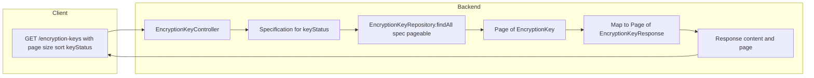

# Encryption Keys List: Paginated Backend (Priority 3)

Scope: **Backend only** for the encryption keys list endpoint. After execution, you run tests and the maintainer runs `scripts/update-specs.sh` (or `.bat`); UI migration to `usePaginatedFromOrval` is a separate plan. **Re-encryption batches list** (`GET /api/v1/encryption-keys/reencryption-batches`) is out of scope for this plan.

---

## 1. Target contract (align with existing paginated endpoints)

- **Request:** `GET /api/v1/encryption-keys?page=0&size=20&sort=introducedAt,DESC` plus optional filter.
- **Response:** Same shape as other Admin list endpoints: `{ "content": [ ... EncryptionKeyResponse ... ], "page": { "size", "number", "totalElements", "totalPages" } }`. The project uses `PageSerializationMode.VIA_DTO` in [AdminJpaConfig](ezkey-admin-api/src/main/java/org/ezkey/admin/AdminJpaConfig.java), so returning `ResponseEntity<Page<EncryptionKeyResponse>>` produces this format automatically.
- **Sort:** Spring `Pageable` with `sort=property,direction`. Use JPA property names from [EncryptionKey](ezkey-core/src/main/java/org/ezkey/security/domain/entity/EncryptionKey.java): `keyId`, `keyStatus`, `algorithm`, `introducedAt`, `promotedPrimaryAt`, `disabledAt`, `recordsEncrypted`, `recordsReencrypted`, `createdBy`, `createdAt` so they match the UI table columns and future `sortKey` values.

---

## 2. UI criteria to support (conformity with Admin UI)

From [encryption-keys.tsx](ezkey-admin-ui/src/pages/encryption-keys.tsx):

| UI feature                                                                                                | Backend support                                                                         |
| --------------------------------------------------------------------------------------------------------- | --------------------------------------------------------------------------------------- |
| Table columns (keyId, keyStatus, algorithm, recordsEncrypted, introducedAt, promotedPrimaryAt, createdBy) | Sortable via `sort=` on those entity properties                                         |
| Page size (10/20/50/100)                                                                                  | `page`, `size` (default e.g. 20)                                                        |
| Pagination (prev/next, total count)                                                                       | Response `content` + `page` metadata                                                    |
| Optional status filter (future: All / Primary / Enabled / Disabled)                                       | Optional query param `keyStatus` (e.g. PRIMARY, ENABLED, DISABLED, PENDING); omit = all |

The keys table currently has **no search box and no status filter**; it only shows all keys. To align with the Tenant/Integration pattern and allow a future UI filter (e.g. dropdown by status), the backend will accept an optional `keyStatus` filter. The UI will not change in this plan; it will be ready for a follow-up that switches to `usePaginatedFromOrval` and optionally adds a status filter.

---

## 3. Backend implementation

### 3.1 Repository

- **File:** [EncryptionKeyRepository](ezkey-core/src/main/java/org/ezkey/security/domain/repository/EncryptionKeyRepository.java)
- Extend `JpaSpecificationExecutor<EncryptionKey>` (same pattern as [TenantRepository](ezkey-core/src/main/java/org/ezkey/integration/domain/repository/TenantRepository.java), [IntegrationRepository](ezkey-core/src/main/java/org/ezkey/integration/domain/repository/IntegrationRepository.java)).
- No new method signatures needed; use `findAll(Specification, Pageable)` from the interface.

### 3.2 Controller

- **File:** [EncryptionKeyController](ezkey-admin-api/src/main/java/org/ezkey/admin/controller/EncryptionKeyController.java)
- **List endpoint:** Replace `listKeys()` (currently returning `ResponseEntity<List<EncryptionKeyResponse>>`) with a method that:
  - Accepts `@RequestParam(required = false) String keyStatus` (or `EncryptionKey.KeyStatus` with conversion) and `@ParameterObject @PageableDefault(size = 20, sort = "introducedAt", direction = Sort.Direction.DESC) Pageable pageable`.
  - Keeps current permission: `@PreAuthorize("hasRole('ADMIN')")`.
  - Builds a `Specification<EncryptionKey>` that applies an optional filter: when `keyStatus` is present and valid, add `cb.equal(root.get("keyStatus"), KeyStatus.valueOf(keyStatus))` (handle invalid enum gracefully, e.g. return 400 or ignore).
  - Calls `keyRepository.findAll(spec, pageable)`, maps each entity with existing `toResponse(EncryptionKey)`, and returns `ResponseEntity<Page<EncryptionKeyResponse>>` via `page.map(this::toResponse)`.
- **OpenAPI:** Document query params in `@Operation` / `@Parameter`: `page`, `size`, `sort`, `keyStatus` (optional; values PRIMARY, ENABLED, DISABLED, PENDING). Do not edit `specs/admin-api/openapi-spec.json` by hand; the maintainer runs update-specs after a clean Docker start.
- **Imports:** Add `Page`, `Pageable`, `Sort`, `PageableDefault`, `ParameterObject`, `Specification`, `Predicate`, and criteria imports; use `org.springframework.data.domain.Page` and map with `Page.map(this::toResponse)`.

### 3.3 Specification

- Build the specification in the controller (same style as [TenantController.listTenants](ezkey-admin-api/src/main/java/org/ezkey/admin/controller/TenantController.java) lines 228–240): single optional predicate for `keyStatus`. If `keyStatus` is blank or invalid, omit the predicate (return all keys). Use `EncryptionKey.KeyStatus` enum for type-safe comparison.

---

## 4. Documentation

- **File:** [docs/ENDPOINT.md](docs/ENDPOINT.md) — Section “Encryption Key Management” / “Encryption Key Endpoints”
  - Update the line for **GET /api/v1/encryption-keys** to describe it as a **paginated** list.
  - Add a short subsection “List encryption keys” with:
    - Query parameters: `page` (optional, default 0), `size` (optional, default 20), `sort` (optional, default `introducedAt,DESC`), `keyStatus` (optional: PRIMARY, ENABLED, DISABLED, PENDING).
    - Response: paginated — `content` (array of encryption key objects) and `page` (size, number, totalElements, totalPages).

---

## 5. Postman collection

- **File:** [postman/collections/v2.1/EZ Key Encryption Keys admin.postman_collection.json](postman/collections/v2.1/EZ Key Encryption Keys admin.postman_collection.json)
- **Request “list keys”:**
  - Add query params: `page`, `size`, `sort` (e.g. default `page=0`, `size=20`, `sort=introducedAt,desc`). Optionally add `keyStatus` for filter examples.
  - Update description to state that the response is paginated (`content` + `page`).
- **Test script:**
  - Replace “Response is an array” with assertions on the paginated shape: e.g. `pm.expect(jsonData).to.have.property('content'); pm.expect(jsonData).to.have.property('page'); pm.expect(jsonData.content).to.be.an('array');` and assert `page` has `totalElements`, `totalPages`, etc.
  - Where the script stores `encryptionKeyId` or finds the primary key, get the first item from `jsonData.content[0]` (and check `jsonData.content.length > 0`).

---

## 6. Tests

### 6.1 Unit tests (ezkey-admin-api)

- **File:** Tests that exercise [EncryptionKeyController](ezkey-admin-api/src/main/java/org/ezkey/admin/controller/EncryptionKeyController.java) (e.g. [AuditReasonPropagationTest](ezkey-admin-api/src/test/java/org/ezkey/admin/controller/AuditReasonPropagationTest.java) or a dedicated `EncryptionKeyControllerTest`):
  - Add or extend tests for the list endpoint: call with `Pageable` (e.g. first page, size 20); assert status 200, response body has `content` and `page` (or assert on `Page`/`PageImpl` if testing at service level); optionally assert with `keyStatus` filter (e.g. PRIMARY) and verify filtered result.
  - If existing tests call `listKeys()` with no args, update them to pass `Pageable` (e.g. `PageRequest.of(0, 100)`) and assert on the new response shape (content + page).

### 6.2 Functional tests (ezkey-tests)

- No functional test was found that parses the **list** encryption-keys response (KeyRotationSyncWindowTest uses rotate only). If any test later calls `GET /api/v1/encryption-keys` and expects a root array, it must be updated to use `content` and `page` (e.g. parse keys from `response.jsonPath().getList("content.keyId", Long.class)`). Add a note in the plan checklist to run the full test suite and fix any such references.

---

## 7. Order of work and checklist

1. **Repository:** Add `JpaSpecificationExecutor<EncryptionKey>` to `EncryptionKeyRepository`.
2. **Controller:** Implement paginated list with `Pageable`, optional `keyStatus`, build `Specification`, return `Page<EncryptionKeyResponse>`.
3. **ENDPOINT.md:** Update “List encryption keys” with query params and paginated response shape.
4. **Postman:** Update “list keys” request (query params + description) and test script (content + page, read first key from `content[0]`).
5. **Unit tests:** Add or extend controller tests for paginated list and optional `keyStatus` filter.
6. **Functional tests:** Run suite; if any test hits list encryption-keys and expects array root, update to content + page.
7. Run unit tests and functional tests; fix any failures.
8. **Maintainer:** After a clean Docker start, run `scripts/update-specs.sh` (or `.bat`) to regenerate `specs/admin-api/openapi-spec.json`. No manual spec edits. Then regenerate Orval client so the UI gets the new list API signature (e.g. `listKeys(params)` with `page`, `size`, `sort`, `keyStatus`) and the same `PagedModel`* response type for use with `usePaginatedFromOrval`.

---

## 8. Out of scope (this plan)

- **UI:** Switching the encryption keys page to `usePaginatedFromOrval`, removing client-side handling, and wiring sort/page/filter to the new API — separate plan.
- **OpenAPI spec:** Agents do not run update-specs; the maintainer does after validation.
- **Re-encryption batches list** (`GET /api/v1/encryption-keys/reencryption-batches`): remains `List<ReencryptionBatchResponse>` for now; can be paginated in a later plan.

---

## 9. Flow (mermaid)

