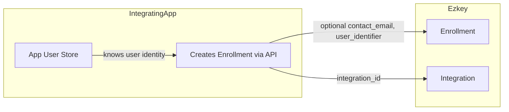

# Enrollment Information Enhancement - Contact, Normative, and Operational Analysis

## Context: Current State

### What We Have Today (Enrollment Schema)

From [V1__initial_schema.sql](ezkey-core/src/main/resources/db/migration/V1__initial_schema.sql) and [Enrollment.java](ezkey-core/src/main/java/org/ezkey/enrollment/domain/entity/Enrollment.java):


| Field                                                                    | Purpose                                      |
| ------------------------------------------------------------------------ | -------------------------------------------- |
| `enrollment_id`                                                          | Primary key                                  |
| `integration_id`                                                         | Links to protected application               |
| `enrollment_name`                                                        | Human-readable label (e.g., "John's iPhone") |
| `enrollment_status`                                                      | CREATED, BOUND, VERIFIED, INVALID            |
| `enrollment_active`                                                      | Operational flag                             |
| `enrollment_challenge`                                                   | Optional security challenge                  |
| `enrollment_proof_token`                                                 | Cryptographic token (encrypted at rest)      |
| `auth_attempt_challenge_required`                                        | Auth policy                                  |
| `integration_private_key`, `integration_public_key`, `device_public_key` | Cryptographic keys                           |
| `device_public_key_hash`                                                 | Uniqueness validation                        |
| `created_at`                                                             | Audit timestamp                              |


### The Enrollment Represents

Per [PRD.md](PRD.md): **"The association between an integration, a user, and their mobile device."**

- **Admin enrollment**: Admin's device for passwordless login (admin has email/firstName/lastName in `ezkey_admin`)
- **Application enrollment**: End-user's device for MFA on a protected app (created by integrating app via API)

### Parallel with Tenant Analysis

For Tenant, the question was: beyond `tenant_name` and `tenant_description`, what is needed for SOC 2, operations, and contact?

For Enrollment: beyond `enrollment_name` and `created_at`, what is needed?

---

## Gap Analysis

### 1. Normative Gaps (SOC 2 / Audit)


| Gap                 | Impact                                                                 | SOC 2 Reference |
| ------------------- | ---------------------------------------------------------------------- | --------------- |
| **No verified_at**  | Cannot prove when device was verified; lifecycle audit incomplete      | CC7.2           |
| **No created_by**   | Cannot trace who created the enrollment (admin vs API key)             | CC6.1, CC7.2    |
| **No last_used_at** | Cannot audit last activity; hard to detect stale/abandoned enrollments | CC7.2           |


### 2. Contact Gaps (Operational)


| Gap                                | Impact                                                                             | Use Case                              |
| ---------------------------------- | ---------------------------------------------------------------------------------- | ------------------------------------- |
| **No contact for end-user**        | Cannot reach the device owner in case of security incident, revocation, or support | Incident response, revocation notices |
| **No link to app's user identity** | Support cannot correlate enrollment with the integrating app's user record         | Troubleshooting                       |


### 3. Operational Gaps


| Gap                      | Impact                                                    |
| ------------------------ | --------------------------------------------------------- |
| No `verified_at`         | Cannot measure enrollment latency, lifecycle metrics      |
| No `last_used_at`        | Cannot clean up stale enrollments, detect dormant devices |
| No `created_by_admin_id` | Hard to audit who provisioned which enrollments           |


---

## Recommendations (80/20, Pragmatic)

### Tier 1: Essential (Normative + Operational)

**1. `verified_at` (TIMESTAMPTZ, nullable)**

- **Purpose**: When the enrollment transitioned to VERIFIED (device completed binding).
- **Rationale**: Audit trail, lifecycle tracking, metrics. Aligns with Admin's `last_login_at` pattern.
- **Implementation**: Set when status transitions to VERIFIED.

**2. `created_by_admin_id` (INT, nullable, FK to ezkey_admin)**

- **Purpose**: Which admin created the enrollment (for admin enrollments). For application enrollments, nullable (created via API key).
- **Rationale**: CC6.1, CC7.2 - individual accountability.
- **Implementation**: Populate when Admin API is used; leave null when created via API key.

**3. `last_used_at` (TIMESTAMPTZ, nullable)**

- **Purpose**: Last successful authentication using this enrollment.
- **Rationale**: Operational hygiene (stale enrollment cleanup), security monitoring, support.
- **Implementation**: Update on each successful auth attempt response.

### Tier 2: Contact (Optional, Operational)

**4. `contact_email` (VARCHAR(255), nullable)**

- **Purpose**: Optional contact for the end-user (device owner).
- **Rationale**: Incident response, revocation notices, support escalation. The integrating app may already have this; storing it in Ezkey avoids lookups during incidents.
- **Scope**: Optional. Provided by the integrating app when creating enrollment via `EnrollmentCreateRequest`.
- **Privacy**: Document purpose; ensure GDPR/retention alignment if used.
- **80/20**: Optional field; apps that need it can supply it.

**5. `user_identifier` (VARCHAR(255), nullable)**

- **Purpose**: Optional reference to the integrating app's user (username, user_id, or external id).
- **Rationale**: Support and audit correlation with the app's user store. Enables future API evolution (see section below).
- **Scope**: Optional, free-form. No FK; app-defined format.
- **Uniqueness**: No DB constraint — `user_identifier` is a non-unique index for lookup. In the common case (single device), one enrollment per user; multi-device (edge case) allows same `user_identifier` with different `enrollment_name`.
- **80/20**: Optional; `enrollment_name` often suffices for display, but `user_identifier` enables cleaner integration DX.

### Tier 3: Defer (Keep It Simple)

- Phone number
- First/last name (end-user PII)
- Multiple contact methods
- `updated_at` (only add if explicitly needed for other features)

---

## Architecture Consideration: Who Owns User Identity?




**Principle**: The integrating application owns end-user identity. Ezkey stores optional contact metadata for operational convenience. This keeps Ezkey simple and avoids duplicating user directories.

---

## Future Phase: user_identifier as Integration Key and API Evolution

### Problem: Domain Pollution for Integrating Applications

Today, the integrating application must store `enrollmentId` in its user registry to create auth attempts. Example (Demo Acme: `app/data/acme-users.json`):

```json
{ "username": "john.doe", "enrollmentId": 456, "displayName": "John Doe" }
```

The app's natural key is `username`. Forcing it to maintain Ezkey's internal `enrollmentId` pollutes its domain and adds unnecessary coupling.

### Solution: user_identifier as Alternative Lookup Key

With `user_identifier` on enrollment (populated at creation with the app's username), the auth attempt creation API can evolve to accept either:

- `enrollmentId` (current — backward compatible)
- `userIdentifier` + `integrationId` (future — cleaner DX)

The app then passes its natural key (`username`) when creating auth attempts, and Ezkey resolves it to the enrollment internally. No need for the app to store `enrollmentId` in its user registry for the common case.

### Future API: Auth Attempt Creation

```
POST /api/v1/auth-attempts
{
  // Option 1 (current — always supported)
  "enrollmentId": 456,

  // Option 2 (future — preferred when available)
  "userIdentifier": "john.doe",
  "integrationId": 123   // or derived from API key context

  // Option 3 (future — if contact_email is unique per integration)
  "contactEmail": "john@acme.com"
}
```

**Resolution order**: `userIdentifier` (or `contactEmail`) when provided; fallback to `enrollmentId`.

### Multi-Device: Edge Case Handling

**Note**: For a project like Ezkey, multiple devices per user is a **relatively distant future** and an **edge case** — not the norm. It is possible to have multiple devices enrolled for the same user (e.g., iPhone + iPad), but most users will have a single device per integration.

When `user_identifier` resolves to multiple enrollments:

1. **Single match** (common case): Use that enrollment. API behaves transparently.
2. **Multiple matches** (edge case): Require disambiguation. Options:
  - Return `400` with message: `"Multiple enrollments for this user. Please specify enrollmentId or deviceHint."`
  - Support optional **device hint** (`enrollmentName` or similar) to target a specific device: `userIdentifier` + `deviceHint` → single enrollment.

**80/20**: Optimize for single-device; multi-device remains supported via `enrollmentId` or `deviceHint` when needed.

### Lookup and Uniqueness

- **Lookup**: `(integration_id, user_identifier)` — non-unique index; supports both single- and multi-device.
- **Common case** (single device): Lookup returns one enrollment; API resolves transparently.
- **Edge case** (multi-device): Same `user_identifier` can have multiple enrollments (different `enrollment_name` per device). API requires `enrollmentId` or `deviceHint` to disambiguate. Existing V28 constraint `(integration_id, enrollment_name)` unique for VERIFIED ensures each device is distinct.

### Alignment with Demo Acme

The `username` in `acme-users.json` is exactly what becomes `user_identifier` on enrollment. Implementing this plan allows the demo (and real integrations) to drop `enrollmentId` from their user registry for the single-device case, improving developer experience and separation of concerns.

---

## Implementation Order

1. **Phase 1 (Normative)**: `verified_at`, `created_by_admin_id`, `last_used_at`
2. **Phase 2 (Contact, optional)**: `contact_email`, `user_identifier` in create request and entity
3. **Phase 3 (Future — API evolution)**: Auth attempt creation API supports `userIdentifier` (+ `integrationId`) as alternative to `enrollmentId`; optional `deviceHint` for multi-device disambiguation (edge case)

---

## Summary


| Recommendation                             | Type                              | Priority | Effort |
| ------------------------------------------ | --------------------------------- | -------- | ------ |
| `verified_at`                              | Audit/lifecycle                   | Tier 1   | Low    |
| `created_by_admin_id`                      | Audit (CC6.1, CC7.2)              | Tier 1   | Low    |
| `last_used_at`                             | Operational                       | Tier 1   | Medium |
| `contact_email`                            | Contact                           | Tier 2   | Low    |
| `user_identifier`                          | Operational link + future API key | Tier 2   | Low    |
| Auth attempt by `userIdentifier` (Phase 3) | API evolution                     | Future   | Medium |


These additions align with the Tenant analysis (contact, normative, operational), respect the 80/20 rule, and keep Ezkey pragmatic for MFA security projects. The `user_identifier` field also unlocks future API evolution to reduce domain pollution for integrating applications (see Future Phase section).
