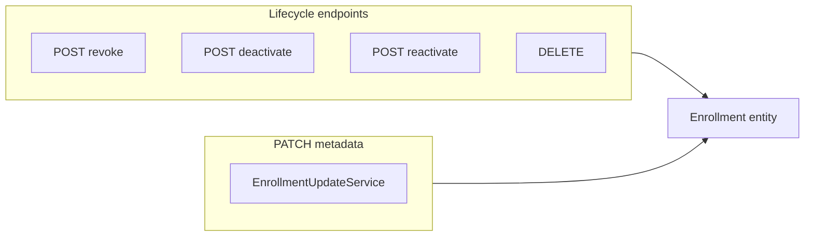

# Enrollment table: modifiable fields inventory and proposals

## Data model reference

Authoritative mapping is `[Enrollment.java](ezkey-core/src/main/java/org/ezkey/enrollment/domain/entity/Enrollment.java)` and initial schema `[V1__initial_schema.sql](ezkey-core/src/main/resources/db/migration/V1__initial_schema.sql)` plus migrations (e.g. `[V31__enrollment_contact_and_audit_columns.sql](ezkey-core/src/main/resources/db/migration/V31__enrollment_contact_and_audit_columns.sql)`, `[V40__add_enrollment_revocation_fields.sql](ezkey-core/src/main/resources/db/migration/V40__add_enrollment_revocation_fields.sql)`, `[V41__add_enrollment_expires_at.sql](ezkey-core/src/main/resources/db/migration/V41__add_enrollment_expires_at.sql)`, `[V44__add_optimistic_lock_version.sql](ezkey-core/src/main/resources/db/migration/V44__add_optimistic_lock_version.sql)`).



---

## Column inventory (by modification mechanism)

| Column / concern                                     | Purpose                           | Modifiable today?            | Notes                                                                                                                                                                                                                                                                                                                                                                                                                                                                                                                                                      |
| ---------------------------------------------------- | --------------------------------- | ---------------------------- | ---------------------------------------------------------------------------------------------------------------------------------------------------------------------------------------------------------------------------------------------------------------------------------------------------------------------------------------------------------------------------------------------------------------------------------------------------------------------------------------------------------------------------------------------------------- |
| `enrollment_id`                                      | PK                                | No                           | Immutable                                                                                                                                                                                                                                                                                                                                                                                                                                                                                                                                                  |
| `version`                                            | Optimistic lock                   | Not “business data”          | Sent on PATCH for concurrency; clients must re-fetch after 409                                                                                                                                                                                                                                                                                                                                                                                                                                                                                             |
| `integration_id`                                     | FK                                | No                           | Moving an enrollment would break cryptographic and tenant context                                                                                                                                                                                                                                                                                                                                                                                                                                                                                          |
| `enrollment_name`                                    | Display / uniqueness              | **Yes — PATCH**              | `[EnrollmentUpdateService](ezkey-admin-api/src/main/java/org/ezkey/admin/service/EnrollmentUpdateService.java)`: uniqueness vs other VERIFIED rows on same integration                                                                                                                                                                                                                                                                                                                                                                                     |
| `enrollment_status`                                  | Lifecycle                         | Process only                 | Transitions via bind/verify (auth-api), revoke, deactivate, expiry jobs — not arbitrary PATCH                                                                                                                                                                                                                                                                                                                                                                                                                                                              |
| `enrollment_active`                                  | Operational enablement            | Process only                 | `deactivate` / `reactivate` (and related bulk/integration actions)                                                                                                                                                                                                                                                                                                                                                                                                                                                                                         |
| `enrollment_challenge`                               | Bind/verify PIN                   | **Not via PATCH**            | Set at creation; used during verify. Changing after the fact risks inconsistency with a device that already learned the code; **not recommended** for generic admin edit                                                                                                                                                                                                                                                                                                                                                                                   |
| `enrollment_proof_token` (+ hash)                    | Binding secret                    | **Not via PATCH**            | Sensitive; rotation would be a dedicated flow if ever needed                                                                                                                                                                                                                                                                                                                                                                                                                                                                                               |
| `auth_attempt_challenge_required`                    | Require numeric challenge on auth | **Yes — PATCH**              | `[EnrollmentUpdateRequestDto](ezkey-admin-api/src/main/java/org/ezkey/admin/dto/request/EnrollmentUpdateRequestDto.java)` + `[EnrollmentUpdateService](ezkey-admin-api/src/main/java/org/ezkey/admin/service/EnrollmentUpdateService.java)` lines 140–142. **Your example is already implemented in the API** for active, non-revoked **VERIFIED** enrollments                                                                                                                                                                                             |
| `integration_private_key` / `integration_public_key` | Crypto                            | No                           | Key rotation is out of scope for PATCH; would need a dedicated protocol                                                                                                                                                                                                                                                                                                                                                                                                                                                                                    |
| `device_public_key` (+ hash)                         | Bound device                      | No                           | Established at verify; uniqueness enforced                                                                                                                                                                                                                                                                                                                                                                                                                                                                                                                 |
| `created_at`                                         | Audit                             | No                           | Immutable                                                                                                                                                                                                                                                                                                                                                                                                                                                                                                                                                  |
| `expires_at`                                         | Pending invitation window         | **Yes — PATCH** (set future) | Semantics today: **bind/verify invitation expiry** only (`isExpired` in bind/verify paths). After `VERIFIED`, this column is **not** cleared and is **not** enforced for ongoing auth. The name is easy to misread as “enrollment lifetime.” **See [Future considerations — two expiry concepts](#future-considerations--two-expiry-concepts-invitation-vs-post-verify-lifetime)** for the intended longer-term model (separate column), not overloading one field by status. |
| `verified_at`                                        | Audit                             | No                           | Set by verify flow                                                                                                                                                                                                                                                                                                                                                                                                                                                                                                                                         |
| `created_by_admin_id`                                | Audit                             | No                           | Immutable                                                                                                                                                                                                                                                                                                                                                                                                                                                                                                                                                  |
| `last_used_at`                                       | Operational                       | No                           | Updated by auth success path                                                                                                                                                                                                                                                                                                                                                                                                                                                                                                                               |
| `deactivated_at` / `deactivated_by_admin_id`         | Audit                             | Process only                 | Deactivate/reactivate                                                                                                                                                                                                                                                                                                                                                                                                                                                                                                                                      |
| `revoked_at` / `revoked_by_admin_id`                 | Audit                             | Process only                 | Revoke                                                                                                                                                                                                                                                                                                                                                                                                                                                                                                                                                     |
| `contact_email`                                      | Contact                           | **Yes — PATCH**              | Can set; **clearing** (null) is awkward with current “only non-null fields apply” semantics (same as `expiresAt`)                                                                                                                                                                                                                                                                                                                                                                                                                                          |
| `user_identifier`                                    | App user reference                | **Create only today**        | Present on `[EnrollmentCreateRequestDto](ezkey-admin-api/src/main/java/org/ezkey/enrollment/dto/EnrollmentCreateRequestDto.java)`; **not** in `EnrollmentUpdateRequestDto` — **strong candidate** for PATCH (typos, HR ID changes), with uniqueness validation per `(integration_id, user_identifier)` where applicable                                                                                                                                                                                                                                    |

---

## What is already “done” vs. gaps

**Backend (PATCH)** — Implemented: `enrollmentName`, `contactEmail`, `expiresAt`, `authAttemptChallengeRequired`, plus `version` for locking. Constraints: `[EnrollmentUpdateService](ezkey-admin-api/src/main/java/org/ezkey/admin/service/EnrollmentUpdateService.java)` (VERIFIED + active + not revoked).

**Postman** — `[postman/collections/v2.1/EZ Key Enrollments admin.postman_collection.json](postman/collections/v2.1/EZ Key Enrollments admin.postman_collection.json)` describes search/create/get/qrcode/delete; **no PATCH request** in the collection description/items reviewed — **gap**.

**Admin UI** — Orval exposes `[update](ezkey-admin-ui/src/generated/admin-api/enrollments/enrollments.ts)` with `EnrollmentUpdateRequestDto`, but `[enrollment-detail.tsx](ezkey-admin-ui/src/pages/enrollments.tsx)` uses revoke/deactivate/reactivate/delete flows — **no edit form / PATCH** — **gap**. The “Test auth” dialog toggles `challengeRequested` only for **that test attempt**, not for persisting `authAttemptChallengeRequired` on the enrollment.

**Docs** — `[docs/ENDPOINT.md](docs/ENDPOINT.md)` should mention PATCH enrollments if not already; align with maintainer’s spec update workflow (Java + annotations → `update-specs.sh` by maintainer).

---

## SOC 2 — critical review (normative lens, proportionate)

This section answers: **should `userIdentifier` be editable**, and **what audit bar** matches how Ezkey already treats compliance-oriented APIs?

### Mapping to common SOC 2 Trust Services Criteria (high level)

- **CC6.1 (Logical and physical access)** — `userIdentifier` is a **correlation / directory attribute**: it ties an enrollment to the integrating application’s notion of a user. Changing it does **not** grant cryptographic access by itself (keys and device binding are unchanged), but it **does** change how operators and integrations reconcile “which app user owns this MFA enrollment.” Allowing edits is **reasonable for operations** (typo, IdP migration, corrected HR id), provided **access to perform the change** remains admin-gated (already: `canAccessEnrollment` + `ADMIN` role) and **the change is auditable**.
- **CC7.2 (System monitoring)** — Security-relevant configuration includes **`authAttemptChallengeRequired`** (stronger step-up). Any change should be **visible in monitoring and review**, not buried in a generic string.
- **CC7.3 (Evaluation of system operations)** — For investigations, you need **who** did **what** to **which object**. That implies **structured** `event_details`, not only a free-text fragment.

### Position on `userIdentifier` modification

**Recommendation: allow PATCH**, with the same preconditions as other metadata (VERIFIED, active, not revoked), plus **uniqueness** per integration where the schema requires it. **Do not** treat this as “dangerous” as key rotation; treat it as **identity/correlation data** that must be **traceable**.

### Audit consistency gap (today)

On successful PATCH, [`EnrollmentController.update`](ezkey-admin-api/src/main/java/org/ezkey/admin/controller/EnrollmentController.java) logs:

```text
eventDetails("Enrollment name: " + updated.getEnrollmentName())
```

That **does not record** which fields were actually sent in the request: e.g. `contactEmail`, `expiresAt`, or `authAttemptChallengeRequired` changes are **not** reflected in `event_details`. Failures log `errorMessage` (better for forensics on the failure path).

For SOC 2 alignment **without** over-engineering:

1. **Structured JSON** for success (and optionally failure) using existing [`AuditDetailsBuilder`](ezkey-core/src/main/java/org/ezkey/audit/util/AuditDetailsBuilder.java) — consistent with other admin APIs (e.g. encryption key flows) and with the project rule that `event_details` must remain **valid JSON** where JSONB indexes apply.
2. **For identifier-like fields** (`userIdentifier` when added, and arguably `contactEmail`): log **previous → new** (or `null` → value / value → `null` when clear semantics exist). Redact or hash only if product policy requires it; usually opaque business IDs are logged in full for support.
3. **For security toggles** (`authAttemptChallengeRequired`): log **old and new boolean** — enough for reviewers and SIEM rules.

This is **one** audit enhancement that benefits **all** current PATCH fields and any future `userIdentifier` support; it avoids a special-case policy only for one column.

### What we are *not* proposing

- Separate **EventType** per field (e.g. `ENROLLMENT_USER_IDENTIFIER_CHANGED`) — unnecessary unless compliance or SIEM filtering explicitly requires it; `ENROLLMENT_UPDATED` with rich JSON is enough for typical SOC 2 evidence packs.
- **Dual-control** approval workflow for identifier edits — out of scope unless the organization’s control matrix requires it; keep parity with other admin metadata updates.

---

## Future considerations — two expiry concepts (invitation vs post-verify lifetime)

These notes capture product direction for a **dedicated future plan** (schema/API/jobs), not for immediate implementation in this enrollment-fields tranche.

### Problem statement

- Today, **`expires_at`** reflects the **initial enrollment establishment window**: from creation through **bind** and **verify** (pending phases). Bind/verify reject when that invitation is past due; that notion remains **valid and necessary**.
- An enrollment’s **longest-lived phase** is **after** verification: ongoing authentication for months or years.
- The **same column name** (`expires_at`) is therefore **misleading** if operators assume it means “this enrollment is valid until date X” for the **whole** lifecycle. After `VERIFIED`, the field is **not** the same conceptual “expiry” for day-to-day MFA use (and is not cleared on verify today).

### Product need (second notion)

Operators may want: **“this verified enrollment is acceptable for authentication only until a given calendar date”** — i.e. a **time-bounded credential** after bind/verify completes. That is a **different** requirement from **invitation expiry**.

### Design principle: do not overload one column

Using **`expires_at` with two meanings depending on status** (e.g. “before VERIFIED = A, after VERIFIED = B”) is **rejected** as error-prone for operators, APIs, audits, and queries.

### Preferred direction (to be designed in a follow-on plan)

- **Two distinct persisted concepts**, with **clear names**, for example (illustrative only — final names TBD):
  - **Invitation / establishment expiry** — current role of `expires_at` (or a renamed column so API/DB names match behavior), scoped to CREATED/BOUND (and verify gate).
  - **Post-verify enrollment lifetime / sunset** — a **separate** nullable timestamp (and enforcement in auth paths, scheduled jobs, admin PATCH, audit events) meaning “after this instant, the enrollment must not be used for new auth” unless renewed or revoked by other means.
- **Analysis work** in the future plan: migration of existing rows, whether to **null invitation expiry** on successful verify for clarity, admin UX copy, SOC 2 audit events for changes to the post-verify date, interaction with **deactivate/revoke** (orthogonal but related).

This section supersedes the vague “clarify `expires_at` after VERIFIED” bullet as the **strategic** answer; near-term work in *this* plan remains **documentation honesty** about current behavior until the two-field model exists.

---

## Proposals (prioritized)

1. **Audit hardening for PATCH (SOC 2, prerequisite)** — Replace success `eventDetails` with `AuditDetailsBuilder` JSON documenting **changed fields** and **before/after** where meaningful (name, contact email, user identifier, challenge flag, expires at). Implemented in **Java first** (admin-api / core as needed).
2. **Postman (same phase as backend)** — Add folder/request “partial update (PATCH)” to `[EZ Key Enrollments admin](postman/collections/v2.1/EZ Key Enrollments admin.postman_collection.json)` with body including `version` from GET, and fields: `authAttemptChallengeRequired`, `enrollmentName`, `contactEmail`, `expiresAt` (and `userIdentifier` when that API ships). Update collection description if needed.
3. **Extend PATCH with `userIdentifier`** — Add to `EnrollmentUpdateRequestDto` and `EnrollmentUpdateService`: validate format/length, enforce uniqueness for **VERIFIED** enrollments per integration (mirror name uniqueness pattern). **Rely on structured ENROLLMENT_UPDATED audit** (old/new). Unit tests in admin-api / ezkey-tests as appropriate. Postman request updated in **Phase 1**.
4. **Admin UI (Phase 2 only)** — After OpenAPI + Orval refresh: enrollment detail edit form using generated `update` + `EnrollmentUpdateRequestDto`, version handling, i18n (`en`/`fr`). **First UI step: regenerate Orval clients** from updated specs.
5. **Explicit null / clear semantics (optional)** — If operators must **clear** `contactEmail`, `userIdentifier`, or `expiresAt`, standard JSON PATCH with “omit null” is insufficient. Options: `JsonNullable` fields on the DTO, or a small set of boolean flags (`clearContactEmail`, etc.). Decide product-wise whether clearing is required. If implemented, audit must show **cleared** explicitly (e.g. `previousContactEmail` + `newContactEmail: null`). **Backend-first** if pursued.
6. **Do not expose via generic PATCH** — `enrollment_challenge`, keys, `integration_id`, status/active (except via existing lifecycle endpoints), audit timestamps.
7. **Near-term `expiresAt` in UI/docs** — Until the [two-field model](#future-considerations--two-expiry-concepts-invitation-vs-post-verify-lifetime) exists, label PATCH/GET copy so operators understand **invitation window** vs any future **lifetime** field; avoid implying post-verify “valid until” unless/until enforced. `ENDPOINT.md` updates can ship with **Phase 1** (backend/docs); UI copy with **Phase 2**.

---

## Execution workflow (agreed order)

### Phase 1 — Backend + Postman (implement first)

- Java: audit hardening for `ENROLLMENT_UPDATED`, optional `userIdentifier` PATCH + service validation + tests, any DTO/controller annotation updates.
- Docs in repo: `[docs/ENDPOINT.md](docs/ENDPOINT.md)` for PATCH enrollment as needed (English).
- Postman: `[EZ Key Enrollments admin](postman/collections/v2.1/EZ Key Enrollments admin.postman_collection.json)` updated in the **same** change set as the API behavior.
- **Do not** edit generated `specs/**/*.json` by hand — OpenAPI is produced from running services ([`.cursor/rules/openapi-specs.mdc`](.cursor/rules/openapi-specs.mdc)).

### Phase 1b — Maintainer pipeline (you run; not the agent default)

1. From repo root: `mvn spotless:apply`, then unit tests (`mvn test` excluding functional module per project conventions).
2. Clean start Docker stack so Admin API reflects changes.
3. Run `scripts/update-specs.sh` to refresh OpenAPI JSON from live `/api-docs`.

### Phase 2 — Admin UI (only after Phase 1b)

1. **Regenerate Orval clients** from the updated Admin API spec (first UI task).
2. Implement enrollment detail editing (and any i18n) using the generated hooks/types.

### Optional later

- JsonNullable / clear semantics for nullable PATCH fields (backend-first if done).

---

## Suggested technical order within Phase 1 (reference)

1. Structured audit for `ENROLLMENT_UPDATED` (success).
2. `userIdentifier` on PATCH + tests + structured audit fields (if in scope).
3. Postman PATCH request + collection description.
4. `ENDPOINT.md` (PATCH).
5. Product note: current `expires_at` = invitation window only ([Future considerations](#future-considerations--two-expiry-concepts-invitation-vs-post-verify-lifetime)).
