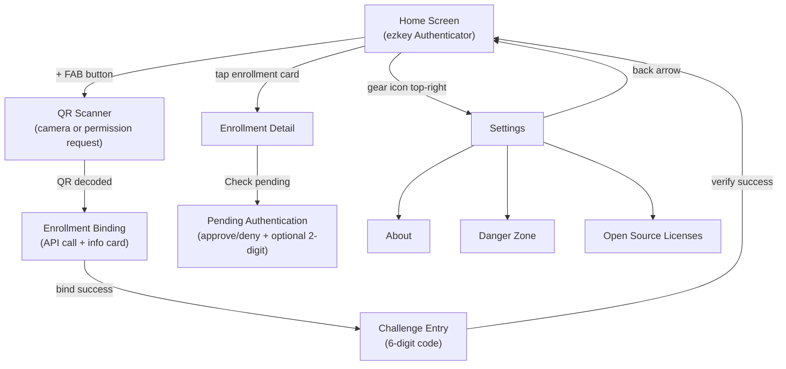

# ezkey_mobile_app -- New Mobile Application

## Context

The existing [ezkey_mobile/](ezkey_mobile/) is functional but uses a wizard-based UI paradigm that does not meet Play Store standards. We create a new `ezkey_mobile_app/` subproject in the same repo that:

- Reproduces the crypto and Auth API protocol **verbatim** (no reinvention)
- Delivers a standard mobile UX suitable for Google Play
- Keeps the same React Native tech stack and Android SDK targets

---

## Architecture: What stays identical, what changes

### Verbatim copy (Phase 2)

These files will be copied and adapted only for package name changes (`com.ezkeymobile` -> `com.ezkeymobileapp`):

- **Kotlin crypto**: [EzkeyCryptoModule.kt](ezkey_mobile/android/app/src/main/java/com/ezkeymobile/crypto/EzkeyCryptoModule.kt) -- EC P-256, Android Keystore, StrongBox, ECDSA-SHA256
- **Kotlin QR plugin**: [EzkeyQrFrameProcessorPlugin.kt](ezkey_mobile/android/app/src/main/java/com/ezkeymobile/qr/EzkeyQrFrameProcessorPlugin.kt) -- ML Kit barcode scanning
- **Kotlin registration**: [EzkeyCryptoPackage.kt](ezkey_mobile/android/app/src/main/java/com/ezkeymobile/crypto/EzkeyCryptoPackage.kt), MainApplication.kt adaptations
- **TS bridge**: [nativeCrypto.ts](ezkey_mobile/app/services/crypto/nativeCrypto.ts), [cryptoService.ts](ezkey_mobile/app/services/crypto/cryptoService.ts)
- **API layer**: [enrollments.ts](ezkey_mobile/app/services/api/enrollments.ts), [authAttempts.ts](ezkey_mobile/app/services/api/authAttempts.ts), [httpClient.ts](ezkey_mobile/app/services/api/httpClient.ts), [types.ts](ezkey_mobile/app/services/api/types.ts)
- **Storage**: [enrollmentStorage.ts](ezkey_mobile/app/services/storage/enrollmentStorage.ts), [secureStorage.ts](ezkey_mobile/app/services/storage/secureStorage.ts)
- **QR parsing logic**: `parseQrPayload` function from EnrollmentWizardScreen

### Redesigned (Phase 1)

- All screens and navigation
- Visual identity (theme, logo, colors)
- Settings infrastructure
- Open-source licenses screen

---

## Tech Stack (same base, minor additions)


| Layer          | Library                                    | Version          | Rationale                   |
| -------------- | ------------------------------------------ | ---------------- | --------------------------- |
| Framework      | React Native                               | 0.76.x           | Same as original            |
| Navigation     | @react-navigation/native-stack             | ^7.x             | Same                        |
| State          | zustand + @tanstack/react-query v5         | Same             | Same                        |
| HTTP           | axios                                      | Same             | Same                        |
| Camera/QR      | react-native-vision-camera ^4.2.3 + ML Kit | Same             | Same frame processor plugin |
| Secure storage | react-native-keychain                      | Same             | Same                        |
| Crypto         | Native EzkeyCryptoModule                   | Same Kotlin code | Verbatim copy               |
| Config         | react-native-config                        | Same             | Same                        |
| SVG            | react-native-svg                           | New              | For Ezkey logo rendering    |
| Licenses       | react-native-oss-license                   | New (Phase 1)    | Open-source license listing |


Android targets: minSdk 24, compileSdk 35, targetSdk 34 (identical to original).

---

## Visual Identity

### Color Palette (dark theme, blue family)

Derived from existing mobile palette and the Ezkey logo blue `#3076DF`:

- **Background**: `#0b0d11` (main), `#151923` (cards/surfaces)
- **Primary**: `#3076DF` (buttons, accents), `#5a9cf7` (links, secondary accents)
- **Text**: `#f4f7ff` (primary), `#c2c8d5` (secondary), `#9aa3b6` (muted)
- **Success**: `#61d095`
- **Error**: `#ff6666` / `#ff7878`
- **Warning**: `#f5a623`
- **Subtle borders**: `rgba(54, 115, 223, 0.15-0.2)`

Colors will be centralized in a `theme.ts` file (unlike the original which inline-defines them per screen).

### Logo

The [logo.svg](logo.svg) (primary fill `#3076DF`) will be embedded via `react-native-svg`. Displayed on the Home screen.

---

## Screen Map and Navigation




### Home Screen

- **Top bar**: "ezkey Authenticator" (left), gear icon (right, -> Settings)
- **Center area**:
  - When **no enrollments**: Ezkey logo, "No enrollments yet" message, subtle guidance text
  - When **has enrollments**: Scrollable list of enrollment cards grouped by tenant (reuse `tenantGrouping.ts` logic)
- **Bottom**: Floating action button (FAB) with "+" icon to add enrollment. Tapping it:
  1. If camera permission already granted -> open QR scanner directly
  2. If not -> system permission prompt, then scanner on grant

### QR Scanner Screen

- Full-screen camera viewfinder with overlay frame
- Same `react-native-vision-camera` + `scanEzkey` frame processor plugin
- On successful scan: auto-trigger `bind` API call, show binding progress, transition to info card + challenge entry
- No separate "wizard steps" -- it is a continuous flow within a single screen

### Enrollment Binding + Challenge (combined screen)

- After QR scan, show enrollment info card (integration name, organization, device name)
- Below: 6-digit challenge code input (same box-style UI, proven UX)
- "Complete Enrollment" button
- On success: navigate back to Home with the new enrollment visible
- On error: show error banner, allow retry

### Enrollment Detail Screen

- Shows enrollment info (integration, tenant, device, creation date)
- Primary action: "Check for pending request" button
- Tapping it navigates to PendingAuth screen

### Pending Authentication Screen

- Same flow as existing: poll pending -> show approval card -> approve/deny
- Optional 2-digit challenge input
- Context title/message display when present
- Result state (approved/rejected) with "Check again" option

### Settings Screen

- List-style navigation:
  - **About** -- App version, description, Ezkey project link
  - **Appearance** -- Dark theme (default, future: light theme toggle)
  - **Danger Zone** -- Delete enrollments (with confirmation)
  - **Open Source Licenses** -- Third-party license listing

---

## Project Structure

```
ezkey_mobile_app/
  app/
    components/           # Reusable UI: EnrollmentCard, ScannerOverlay, ChallengeInput, FAB
    config/
      env.ts              # Environment config (same pattern)
      theme.ts            # Centralized color palette, spacing, typography
    hooks/                # useEnrollments, useSecureEnrollmentInfo (same logic)
    navigation/
      AppNavigator.tsx    # Stack navigator
      types.ts            # Route params
    providers/
      AppProviders.tsx    # QueryClient, etc.
    screens/
      Home/               # Main screen with enrollment list + FAB
      EnrollmentFlow/     # QR scan -> bind -> challenge (single flow, not wizard)
      EnrollmentDetail/   # Enrollment info + check pending
      PendingAuth/        # Approve/deny flow
      Settings/           # Settings hub
      About/              # App info
      DangerZone/         # Delete enrollments
      Licenses/           # OSS licenses
    services/
      api/                # Verbatim from original (Phase 2)
      crypto/             # Verbatim from original (Phase 2)
      storage/            # Verbatim from original (Phase 2)
    state/
      enrollmentStore.ts  # Zustand store
    utils/                # tenantGrouping, urlValidation (same)
  android/                # React Native Android project
    app/src/main/java/com/ezkeymobileapp/
      crypto/             # Verbatim Kotlin modules (Phase 2)
      qr/                 # Verbatim QR plugin (Phase 2)
  ios/                    # React Native iOS project
  package.json
  tsconfig.json
  app.json
  ...
```

---

## Phase 1: Structure, Visual Identity, and Mocked Navigation

**Goal**: Fully navigable app with polished visuals and mock data at every screen. Allows rapid visual iteration before wiring real APIs.

### Tasks

1. **Initialize project** -- `npx @react-native-community/cli init EzkeyMobileApp` in `ezkey_mobile_app/` with same RN 0.76, same Android SDK targets, same `package.json` dependency versions
2. **Create `theme.ts`** -- Centralized color palette, typography scale, spacing constants
3. **Embed SVG logo** -- Add `react-native-svg` + `react-native-svg-transformer`, create `EzkeyLogo` component from `logo.svg`
4. **Build navigation skeleton** -- Stack navigator with all routes: Home, EnrollmentFlow, EnrollmentDetail, PendingAuth, Settings, About, DangerZone, Licenses
5. **Home Screen** -- Header bar ("ezkey Authenticator" + gear icon), empty state with logo + message, enrollment list (mocked 2-3 enrollments), FAB button
6. **EnrollmentFlow Screen** -- Mock scanner view (static overlay), mock bind result info card, challenge code input component, "Complete" button with mock success
7. **EnrollmentDetail Screen** -- Mock enrollment data display, "Check pending" button
8. **PendingAuth Screen** -- Mock pending attempt card with context, approve/deny buttons, 2-digit challenge input, result states (approved/rejected)
9. **Settings Screen** -- List items: About, Appearance, Danger Zone, Open Source Licenses
10. **About Screen** -- App version, Ezkey description, links
11. **DangerZone Screen** -- Mock enrollment delete with confirmation dialog
12. **Licenses Screen** -- Placeholder or auto-generated OSS license list
13. **Polish** -- Consistent theme application, transitions, safe area handling, Android status bar styling

### Mock Strategy

Mock data will be provided via a `services/mock/` directory with static enrollment and auth attempt objects. The mock layer will have the same interface as the real API layer, allowing a clean swap in Phase 2.

---

## Phase 2: Crypto Integration and Real API Wiring

**Goal**: Copy verbatim Kotlin/native code, wire real API calls, test against running backend.

### Tasks

1. **Copy Kotlin native modules** -- `EzkeyCryptoModule.kt`, `EzkeyCryptoPackage.kt`, `EzkeyQrFrameProcessorPlugin.kt` with package rename to `com.ezkeymobileapp`
2. **Copy TypeScript services** -- `nativeCrypto.ts`, `cryptoService.ts`, API clients, storage layer
3. **Wire real camera + QR** -- Replace mock scanner with real `react-native-vision-camera` + `scanEzkey` plugin
4. **Wire enrollment flow** -- Real bind -> verify with crypto signing
5. **Wire pending auth flow** -- Real pending -> respond with crypto signing
6. **Wire storage** -- Real `react-native-keychain` + `AsyncStorage`
7. **Integration test** -- End-to-end test against Docker backend (enroll, approve, deny)
8. **iOS crypto alignment** -- Address the RSA vs EC P-256 mismatch noted in the original project (optional, Android-first)

---

## Milestone: Phase 1 + Phase 2 Completion & Lessons Learned

### What was accomplished

Phase 1 and Phase 2 are functionally complete. The `ezkey_mobile_app` project:

- Builds and runs on a physical Android device (Pixel 7 Pro, Android 15).
- Full navigation is operational: Home, EnrollmentFlow (with live camera/QR scanning), EnrollmentDetail, PendingAuth, Settings, About, DangerZone, Licenses.
- Kotlin crypto modules (`EzkeyCryptoModule`, `EzkeyQrFrameProcessorPlugin`) are copied and registered.
- TypeScript API, crypto bridge, and storage services are wired.
- VisionCamera frame processor with the `scanEzkey` worklet plugin functions correctly.
- Dark theme with Ezkey blue palette renders consistently across screens.

The app has not yet been tested end-to-end against the Docker backend (enrollment bind/verify, auth approve/deny). This is the remaining validation before the app is fully production-wired.

### Lessons learned

**The original `ezkey_mobile/` was indispensable as a reference.** Despite a promising initial code generation, the new project required extensive cross-referencing with the original codebase to converge on a working build. Without this reference point, the version incompatibilities and configuration gaps documented below would have been extremely difficult to diagnose.

Key issues resolved by comparing against the original project:

1. **Gradle version (8.10.2 vs 8.13)** — The default Gradle 8.10.2 shipped with RN 0.76 has a `Files.move()` bug on Windows that causes `Could not move temporary workspace` errors. The original project had already upgraded to 8.13 which includes retry logic for this Windows file-locking issue.

2. **Android Gradle Plugin must be pinned** — The RN 0.76 template omits the AGP version in `build.gradle` (`classpath("com.android.tools.build:gradle")`), causing resolution to an untested latest version. The original project pins AGP to `8.6.0`.

3. **`react-native-config` v1.6.x broke Android autolinking** — The `^1.5.9` semver range resolved to 1.6.1, which dropped traditional Android autolinking support (`"android": null` in RN config output). Must be pinned to `1.5.9`.

4. **`react-native-screens` 3.30.1 Kotlin nullability bug** — `ScreenViewManager.kt` line 47 passes a nullable `StateWrapper?` to a non-nullable parameter. The original project had a manual fix; the new project uses `patch-package` for durability. Patch: `stateWrapper?.let { view.fabricViewStateManager?.setStateWrapper(it) }`.

5. **`@react-navigation/native-stack` 7.x requires `react-native-screens >= 4.0`** — The `createNativeStackNavigator` imports `ScreenStackItem` which doesn't exist in screens 3.x. The original project uses `createStackNavigator` from `@react-navigation/stack` (JS-based), which is compatible with screens 3.x. Navigation packages pinned to `native@7.1.19`, `native-stack@7.6.2`, `stack@7.6.2`.

6. **`import 'react-native-gesture-handler'` must be first in `index.js`** — Required by `@react-navigation/stack` for card animations to initialize. Without it, screens render but remain invisible (black screen).

7. **Babel worklets plugin required for VisionCamera frame processors** — `babel.config.js` must include `'react-native-worklets-core/plugin'`. Without it, the native worklet runtime receives un-transformed JS and crashes with `Compiling JS failed: invalid empty parentheses '( )'`. After adding the plugin, Metro must be restarted with `--reset-cache`.

8. **JDK 17 encapsulation for Windows** — The Ezkey backend uses JDK 25, but React Native 0.76 requires JDK 17 (Android Studio's bundled JBR). The `scripts/android-with-jdk17.sh` script sets `JAVA_HOME` using Windows short paths (`PROGRA~1`, `ANDROI~1`) to avoid spaces in path that break `gradlew.bat`. The `gradle.properties` also sets `org.gradle.java.home` as a fallback.

### Key takeaway

When version convergence issues arise in `ezkey_mobile_app`, the first reflex should be to compare against `ezkey_mobile/` — check `package.json` versions, `node_modules/*/package.json` installed versions, `gradle.properties`, `build.gradle`, and `babel.config.js`. The original project represents a proven, working configuration that took multiple iterations to stabilize.

---

## Next Steps

### Immediate (before next plan)

1. **End-to-end backend test** — Start the Docker backend, perform a real enrollment (QR scan → bind → challenge → verify) and a real auth flow (pending → approve/deny). Validate the crypto signing roundtrip.
2. **Emulator black screen investigation** — The app works on physical devices but shows a black screen on the Android emulator (Pixel 7 Pro AVD, API 35). Low priority since physical device works, but should be investigated (likely GPU rendering or `react-native-screens` ScreenContainer issue with emulator).
3. **Commit and baseline** — Commit the current state as the Phase 2 baseline. Include `patches/`, `AGENTS.md`, and all build scripts.

### Future plan scope (Phase 3)

1. **Push notification integration** — Replace polling-based pending auth with Firebase Cloud Messaging for instant auth request delivery.
2. **Biometric gate** — Add fingerprint/face unlock before approving authentication requests (Android BiometricPrompt).
3. **Multi-enrollment management** — Swipe-to-delete, reorder, favorites, per-tenant grouping improvements.
4. **Light theme** — Add light theme option in Settings (infrastructure already exists in `theme.ts`).
5. **Play Store preparation** — App icons, splash screen, signing config, ProGuard rules, release build pipeline.
6. **iOS support** — Address the RSA vs EC P-256 crypto alignment, test on iOS simulator and device.
7. **Automated testing** — Jest unit tests for services/utils, Detox or Maestro E2E tests for critical flows.
8. **Dependency upgrade strategy** — Plan migration to `react-native-screens@4.x` and `@react-navigation/native-stack` (native performance) once the ecosystem stabilizes.

