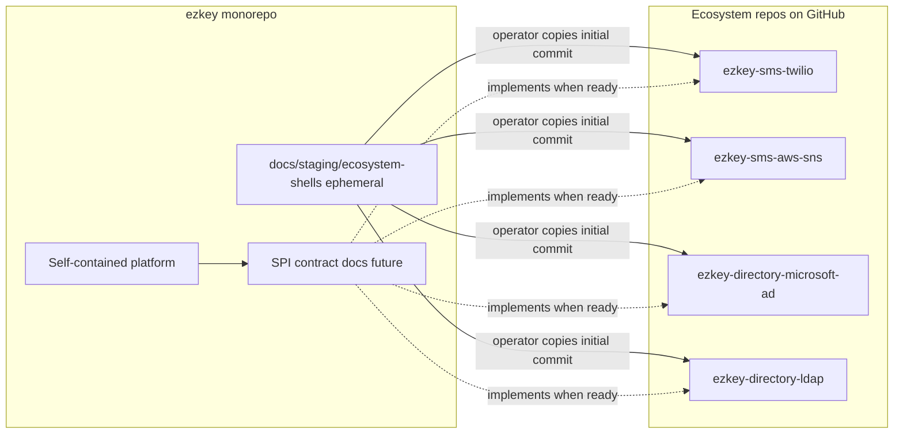

# GitHub high-level structure: integration ecosystem and shell repos

## Context already in the repo

- The main monorepo stays the **self-contained platform** ([`README.md`](c:\github\ezkey\README.md)): Admin UI/API, Auth API, Integration API, mobile, CLI, Docker stack.
- Peripheral **SMS** integrations are already framed as **separate small repos** wired through an SPI-style contract, with the concrete example **`ezkey-sms-twilio`** in [`product-docs/global/vision/product-orientation-notes.md`](c:\github\ezkey\product-docs\global\vision\product-orientation-notes.md) (`V-2026-0007`) and in [`product-docs/global/backlog/blitz-archive/blitz-2026-05-08-2.md`](c:\github\ezkey\product-docs\global\backlog\blitz-archive\blitz-2026-05-08-2.md) (D5).
- **Email** is currently positioned as **in-core** (Java Mail + configuration), not a separate GitHub project—important to avoid contradicting that story unless you later promote a specific “operator-branded transactional API” path to a shell.
- Methodology for capturing this class of work remains **Blitz → `V-*` / `I-*`** ([`product-docs/methodology/nomenclature.md`](c:\github\ezkey\product-docs\methodology\nomenclature.md)); there is no separate “BLIT” artifact type.

**Terminology:** Prefer **“integration repository”** or **“ecosystem repository”** in new docs for GitHub shells, to avoid collision with **“peripheral”** as used for audit-chain heartbeat behavior in [`docs/AUDIT_LOG_INTEGRITY.md`](c:\github\ezkey\docs\AUDIT_LOG_INTEGRITY.md).

---

## Recommended naming pattern (repos)

**Shape:** `ezkey-<integration-family>-<vendor-or-tech>-[<qualifier>]`

| Segment | Role | Examples |
|--------|------|------------|
| `ezkey-` | Stable org-level prefix | (fixed) |
| `<integration-family>` | **What Ezkey capability** this repo extends (searchable, product-language) | `sms`, `email`, `directory` (or `identity-sync` if you want longer clarity) |
| `<vendor-or-tech>` | **Who or what** implements it | `twilio`, `aws-sns`, `aws-ses`, `microsoft-graph`, `ldap` |
| `<qualifier>` | Only when needed to disambiguate | e.g. same vendor, two protocols |

**Rules (pragmatic):**

1. **Do not put `spi` in the repository name.** SPI is the *mechanism*; the repo is an *implementation*. SPI contracts belong in core docs/ADRs and in each repo’s README “Contract” section.
2. **Prefer one capability per repo** over a mega-vendor repo. For AWS covering both SMS and email, use **`ezkey-sms-aws-sns`** (or `pinpoint` if you standardize there) **and** **`ezkey-email-aws-ses`** rather than a vague `ezkey-aws`. This matches how operators shop for problems (“SMS”, “email”, “directory”) and avoids an opaque grab-bag.
3. **Directory / enrollment propagation** is a different *family* from messaging: use a dedicated family token so AD/Duo-style stories do not look like “another SMS plugin”. Recommended: **`ezkey-directory-*`** for “sync or provision identities / enrollment rows from an external directory or IdP”, e.g. `ezkey-directory-microsoft-active-directory`, shortened if needed to `ezkey-directory-microsoft-ad` (still recognizable).
4. **`ezkey-contrib` (optional later):** Reserve for **community-maintained or non-official samples**, not for first-party vendor shells. Keeps the “business card” line clean: official-pattern names under the org, samples under `contrib` or personal forks.

**Spelling / discovery:** Use **vendor canonical spelling** in repo names (`twilio`, not phonetic variants) so GitHub search and links stay professional.

---

## Integration families (brochure taxonomy)

Use a **small matrix** in canonical docs (not 75 repos):

- **Messaging — SMS:** Twilio (already in vision), optional second shell for AWS SNS / Pinpoint to show multi-cloud without duplicating Twilio.
- **Messaging — email:** Only if you deliberately want **out-of-core** API providers; otherwise document “in-core Java Mail” in the ecosystem index and **omit** email shells or add **one** representative shell (e.g. SendGrid) with README stating it is **contingent** on a future decision to support external transactional APIs alongside Java Mail.
- **Directory / lifecycle propagation:** One **Microsoft Active Directory** shell as the “corporate business card” you described; optionally one **SCIM**-oriented name later (`ezkey-directory-scim-server` or similar) if you want standards-first messaging without locking to LDAP.
- **Optional third lane (later):** Webhooks / event sinks (`ezkey-events-*`) only once the core event story exists—omit from v1 brochure unless you already have a vision note.

---

## Curated representative shell set (target ~6–8 repos)

Illustrative list balancing **recognizability** and **honesty** (each README states **shell / no SPI contract yet** until `V-2026-0007` and follow-on `I-*` graduate):

| Repo name (proposed) | Role |
|------------------------|------|
| `ezkey-sms-twilio` | Canonical example already in `V-2026-0007` |
| `ezkey-sms-aws-sns` | Second SMS path, AWS-shaped market |
| `ezkey-directory-microsoft-ad` | AD → Ezkey enrollment / lifecycle propagation (your Duo analogy) |
| `ezkey-directory-ldap` | Broader LDAP/OUD story without Microsoft-only lock-in |
| `ezkey-email-sendgrid` | **Only if** you accept an out-of-core email narrative; else replace with doc-only “email stays in core” |

Optional swap-ins for market keywords: `ezkey-sms-messagebird`, `ezkey-directory-okta-scim`—add only if you want explicit vendor logos without claiming implementation.

---

## Standard content for each shell repo

Single **English** [`README.md`](c:\github\ezkey\README.md) (per your project language rule), structured roughly:

- **Status:** `Shell — no implementation yet; SPI contract not finalized` (link to `V-2026-0007` and future ADR).
- **Purpose:** One paragraph—what corporate problem this addresses.
- **Relationship to core:** Link to main `ezkey` repo; clarify self-contained core vs this add-on.
- **Planned responsibilities:** Credentials, vendor API/SDK, Ezkey-facing adapter boundary (once defined).
- **Non-goals / honesty:** No fake roadmap dates; no implied certification.
- **Security:** Never commit secrets; high-level secret-handling expectations.

Optional: repo **Topics** on GitHub: `ezkey`, `ezkey-ecosystem`, `shell`, plus vendor and capability tags.

---

## Canonical documentation in this monorepo (traceability)

Add a **durable, English** ecosystem index (suggested path: [`docs/ECOSYSTEM_REPOSITORIES.md`](c:\github\ezkey\docs\ECOSYSTEM_REPOSITORIES.md) or a subsection of [`docs/PROJECT_POSITIONING.md`](c:\github\ezkey\docs\PROJECT_POSITIONING.md)) that:

- States the **naming rules** above.
- Lists **approved shell names** and links to GitHub (once created).
- Cross-links **`V-2026-0007`** and future **`I-*`** for SPI design.
- Distinguishes **integration repos** from **operational “peripheral”** language in audit docs.

Update root [`README.md`](c:\github\ezkey\README.md) with a short **“Ecosystem repositories”** paragraph pointing to that index so newcomers see the story from the primary repo first.

Backlog hygiene: add or extend an **`I-*`** (e.g. “ecosystem shell catalog and README template”) so this work is traceable; optionally extend **`V-2026-0007`** with one paragraph on **directory-family** repos when you are ready to fold AD sync into the same SPI discussion or spawn a sibling **`V-*`** if scope diverges.

---

## Execution model: durable docs + ephemeral scratch pad

**Durable (stays in git):**

- `docs/ECOSYSTEM_REPOSITORIES.md` (or chosen path), root `README.md` pointer, and optional `I-*` / vision cross-links as above.

**Ephemeral scratch pad (generation aid for the operator):**

- Under **`docs/staging/ecosystem-shells/`**, create **one subdirectory per future GitHub repo**, named exactly as the repo will be named on GitHub (e.g. `ezkey-sms-twilio/`). Each subdirectory holds the **initial-commit payload** (at minimum `README.md`; optionally `LICENSE` aligned with the main project if you want parity).
- Add **`docs/staging/ecosystem-shells/README.md`** at the scratch root explaining: purpose, that trees are copy-paste templates for new repos, and that **the operator removes `docs/staging/ecosystem-shells/` after publishing** to GitHub (manual delete + commit), so the monorepo does not permanently carry duplicate README sources.

**Operator-owned step (not automated by the agent in your workflow):**

- Create each empty repo on GitHub, push the contents of the matching scratch subfolder as the **initial commit**, set topics, link URLs back into `docs/ECOSYSTEM_REPOSITORIES.md`, then delete the scratch tree locally and commit.

This matches the intent: **all design and naming live versioned in the main repo**; **shell file trees are prepared in one place** for you to publish under your own GitHub org controls; **no long-lived duplication** once staging is removed.

---

## Plan lifecycle and methodology (alignment)

- **Working plan:** This file under [`c:\github\ezkey\.cursor\plans\`](c:\github\ezkey\.cursor\plans\) is the brainstorm / execution checklist; it is versioned with the monorepo when committed.
- **Two methodology lanes (reminder):** historical material is mined via **retrofit** (`R-*`); **new** plans like this one support brainstorming and concrete actions first; **later blitz intake** can batch-capture any follow-up items verbatim and materialize `V-*` / `I-*` as needed ([`product-docs/methodology/blitz-intake-pattern.md`](c:\github\ezkey\product-docs\methodology\blitz-intake-pattern.md)).
- **Retrofit / promotion target (agreed):** When you retrofit this work, the **residual durable value** should land in:
  - **[`product-docs/global/vision/product-orientation-notes.md`](c:\github\ezkey\product-docs\global\vision\product-orientation-notes.md)** (or successor vision corpus)—explicitly connecting **ecosystem integration repos**, **prepared shells**, and **SPI direction** (`V-2026-0007` and directory-family extensions as appropriate).
  - **Future SPI / integration guidelines** (e.g. a small `docs/` or `product-docs` guideline once SPI shape exists)—stating that **named shells were introduced ahead of implementation** as a deliberate adoption signal, without claiming delivery dates.

The agent’s **execution scope** for this plan is: **docs + scratch content + optional backlog links**—not creating GitHub repos in your account unless you later ask for automation with credentials.

---

## Execution order (when you leave Plan mode)

1. Freeze the **naming convention** and **curated list** in `docs/ECOSYSTEM_REPOSITORIES.md`.
2. Generate **`docs/staging/ecosystem-shells/<repo>/README.md`** (and optional `LICENSE`) for each curated shell; add scratch-root `README.md` with ephemeral instructions.
3. Open PR in the monorepo: ecosystem doc + README pointer + optional `I-*` / vision stubs.
4. **You:** create GitHub repos, initial push from each folder, topics, update ecosystem doc with URLs, **delete** `docs/staging/ecosystem-shells/`, commit.
5. **Later:** blitz intake + retrofit into vision / SPI guidelines as above.

