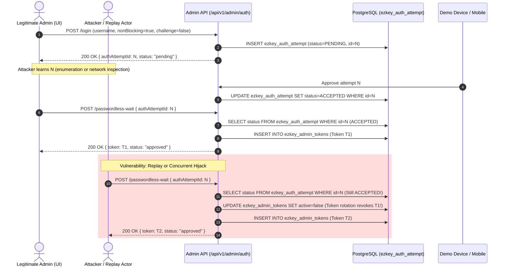

# Passwordless-Wait Session Hijack Mitigation & Hardening Plan

## 1. Executive Summary & Verdict

The automation finding is **confirmed High severity** on the **default Admin UI path**.
It is the residual vulnerability **S3** (*"Replay wait after ACCEPTED - same attempt"*) originally identified and cataloged as out-of-scope in [`I-2026-06-23-admin-auth-passwordless-wait-challenge-enforcement.md`](product-docs/global/backlog/ideas/I-2026-06-23-admin-auth-passwordless-wait-challenge-enforcement.md) (PR #255 / SEC-001).

While PR #255 enforced the presence of a challenge code when a challenge is requested, the **default Admin UI authentication flow requests no challenge** (`challengeRequested: false`, `challengeRequired: false`). Consequently, waiting for an admin session binds strictly to an unauthenticated, publicly callable endpoint (`POST /api/v1/admin/auth/passwordless-wait`) parameterized only by an integer `authAttemptId`. Because `authAttemptId` values are sequential database identities, an attacker can hijack sessions or cause denial-of-service via automatic token rotation.

### Design Compass (Fail-Closed, 80/20 Rule)
Per Design Principle §17 (`product-docs/global/design-principles.md`):
- **Fail-Closed:** An unauthenticated wait endpoint must never issue an administrator session unless the caller demonstrates possession of a secret capability issued exclusively to the client initiating that specific login flow, **and** that attempt has not already issued a session.
- **80/20 Pragmatism:** We do not re-architect the entire authentication transport (e.g., SSE, WebSockets, or UUID migration). Instead, we apply a compact, dual-layer cryptographic and transactional guard:
  1. **Waiter Secret (Capability Token):** A CSPRNG secret returned only to the caller of `POST /login` and verified via constant-time SHA-256 hash comparison on `POST /passwordless-wait`.
  2. **Atomic CAS Consume (`session_issued_at`):** An atomic database CAS (`UPDATE ... WHERE session_issued_at IS NULL`) ensuring an auth attempt row can mint an admin session exactly once.

---

## 2. Vulnerability Mechanism & Sequence



### Blast Radius

| Variant | Conditions | Impact Today | Mitigated Behavior |
|---|---|---|---|
| **Replay after ACCEPTED (S3)** | Attacker knows `authAttemptId` of an already approved login. | Mints new session token `T2`. If token rotation is on (default), **revokes legitimate session `T1`**. | **HTTP 401 Unauthorized**. No token issued, `T1` remains active. |
| **Concurrent Wait on PENDING** | Attacker knows or guesses `authAttemptId` while login is in progress. | Race condition: attacker can poll concurrently and steal session upon approval. | **HTTP 401 Unauthorized**. Attacker lacks the waiter secret capability. |
| **Sequential ID Guessing** | Sequential PostgreSQL sequence IDs. | Easy to guess recent or adjacent attempt IDs. | Unusable without the 256-bit entropy waiter secret. |

---

## 3. Two-Layer Architecture & Technical Design

### Layer 1: One-Time Waiter Secret (Capability Token)
1. When `POST /api/v1/admin/auth/login` creates a pending passwordless attempt (non-blocking):
   - Generate a 32-byte cryptographically secure random token (CSPRNG, URL-safe Base64 or 64-char hex).
   - Compute its SHA-256 hex digest using `SensitiveDataHasher.sha256Hex(secret)`.
   - Store the hash in `ezkey_auth_attempt.waiter_secret_hash`. The plaintext secret is **never** stored in the database.
   - Return the plaintext `waiterSecret` in `AdminLoginResponseDto.pendingPasswordless(...)`.
2. When calling `POST /api/v1/admin/auth/passwordless-wait`:
   - `AdminPasswordlessWaitRequestDto` requires `waiterSecret`.
   - `AdminAuthService.waitForPasswordlessAuth` verifies:
     - `authAttempt.getWaiterSecretHash()` must not be null.
     - `request.waiterSecret()` must not be blank.
     - `MessageDigest.isEqual(computedHashBytes, storedHashBytes)` must return `true`.
   - On mismatch, missing secret, or non-admin attempt: immediately fail-closed with generic `AdminAuthenticationException` (HTTP 401).

### Layer 2: Atomic CAS Consume (`session_issued_at`)
1. Add column `session_issued_at TIMESTAMPTZ NULL` to `ezkey_auth_attempt`.
2. Upon `ACCEPTED` completion in `AdminAuthService` (both in `/passwordless-wait` and blocking `/login`):
   - Execute an atomic conditional update:
     ```sql
     UPDATE ezkey_auth_attempt
     SET session_issued_at = :now
     WHERE auth_attempt_id = :id AND session_issued_at IS NULL
     ```
   - If rows updated == 0:
     - The attempt has already been consumed for session issuance.
     - Reject immediately with `AdminAuthenticationException` (HTTP 401).
     - **Crucial:** Do NOT call `rotateTokensIfEnabled(admin)` and do NOT issue any new token.
   - If rows updated == 1:
     - First and only valid consumer: proceed to rotate tokens, mint new token, and return 200 OK.

---

## 4. Autonomous Implementation Steps (For Cold Agent)

### Phase 1: Characterization & Proof (RED Baseline)
**Goal:** Prove the vulnerability exists in automated code before touching implementation.

1. Create a characterization test in `ezkey-admin-api`:
   - Location: `ezkey-admin-api/src/test/java/org/ezkey/admin/service/AdminAuthServiceWaitReplayHijackTest.java`
   - Setup:
     - Mock an admin with an active enrollment.
     - Mock `authAttemptRepository.findById(authAttemptId)` returning an attempt with status `ACCEPTED` (or wait response returning `ACCEPTED`) and no challenge code.
     - Enable token rotation (`adminProperties.getToken().isRotateOnLogin() = true`).
   - Execution:
     - Call `authService.waitForPasswordlessAuth(attemptId, null)`. First call returns `token1`.
     - Call `authService.waitForPasswordlessAuth(attemptId, null)` a second time.
   - Assertion (Current Vulnerable State):
     - Second call returns `token2` (`token2 != token1`).
     - Token rotation service is invoked a second time (revoking `token1`).
   - Run via Git Bash:
     ```bash
     & "C:\Program Files\Git\bin\bash.exe" -lc 'mvn test -pl ezkey-admin-api -Dtest=AdminAuthServiceWaitReplayHijackTest'
     ```
   - Confirm test passes and establishes the RED baseline evidence.

---

### Phase 2: Database Schema & Core Domain (`ezkey-core`)
**Goal:** Add persistence fields and repository CAS query without altering Integration API wait semantics.

1. **Flyway Migration:**
   - File: `ezkey-core/src/main/resources/db/migration/V20__admin_passwordless_waiter_secret_and_session_issued.sql`
   - Content:
     ```sql
     -- V20: Add waiter secret hash and session issued timestamp to ezkey_auth_attempt
     -- Supports one-time waiter capability token and CAS replay protection for Admin API passwordless login.

     ALTER TABLE ezkey_auth_attempt
         ADD COLUMN waiter_secret_hash VARCHAR(64),
         ADD COLUMN session_issued_at TIMESTAMPTZ;

     COMMENT ON COLUMN ezkey_auth_attempt.waiter_secret_hash IS 'SHA-256 hex digest of the client waiter secret capability minted at login. NULL for Integration API attempts.';
     COMMENT ON COLUMN ezkey_auth_attempt.session_issued_at IS 'Timestamp when an admin session token was first minted for this attempt. Used for atomic CAS consume to prevent replay/hijack.';
     ```
   - *Note:* In PostgreSQL, `ALTER TABLE ... ADD COLUMN` on partitioned table `ezkey_auth_attempt` propagates cleanly to all partitions.

2. **JPA Entity `AuthAttempt.java`:**
   - Add fields:
     ```java
     @Column(name = "waiter_secret_hash", length = 64)
     private String waiterSecretHash;

     @Column(name = "session_issued_at")
     private OffsetDateTime sessionIssuedAt;
     ```
   - Add standard getters and setters.

3. **Domain Request `AuthAttemptCreateRequest.java` & Service `AuthAttemptService.java`:**
   - In `AuthAttemptCreateRequest.java`: add `private String waiterSecretHash;` + getter/setter.
   - In `AuthAttemptService.java` (`create` method around line 430):
     ```java
     authAttempt.setWaiterSecretHash(authRequest.getWaiterSecretHash());
     ```

4. **Repository CAS Query `AuthAttemptRepository.java`:**
   - Add atomic update method:
     ```java
     /**
      * Atomically marks the auth attempt as consumed for admin session issuance.
      *
      * @param id the auth attempt ID
      * @param now the timestamp when the session is being issued
      * @return 1 if successfully marked, 0 if already consumed
      */
     @Modifying(clearAutomatically = true, flushAutomatically = true)
     @Query("UPDATE AuthAttempt a SET a.sessionIssuedAt = :now WHERE a.authAttemptId = :id AND a.sessionIssuedAt IS NULL")
     int markSessionIssued(@Param("id") Integer id, @Param("now") OffsetDateTime now);
     ```

---

### Phase 3: Admin API Backend (`ezkey-admin-api`)
**Goal:** Implement capability generation, validation, and atomic session consume.

1. **DTOs:**
   - `AdminLoginResponseDto.java`:
     - Add `String waiterSecret` to record component list:
       ```java
       @Schema(
           description = "One-time waiter secret capability required for /passwordless-wait. Present only when status is pending.",
           example = "a1b2c3d4e5...",
           requiredMode = RequiredMode.NOT_REQUIRED)
       String waiterSecret
       ```
     - **Checkstyle Mandatory:** Add `@param waiterSecret ...` on the type-level Javadoc of `AdminLoginResponseDto` (Checkstyle 13.9+ requires `@param` on record types for all components).
     - Update constructor calls and factory method `pendingPasswordless(...)` to accept `String waiterSecret`.
   - `AdminPasswordlessWaitRequestDto.java`:
     - Add `waiterSecret` component:
       ```java
       public record AdminPasswordlessWaitRequestDto(
           @NotNull(message = "Auth attempt ID is required") Integer authAttemptId,
           Integer challengeCode,
           @NotBlank(message = "Waiter secret is required") String waiterSecret)
       ```
     - Add `@param waiterSecret ...` on the type-level Javadoc.
     - Fix outdated Javadoc comments mentioning "6 digits / 1,000,000 probability" (actual challenge is 2 digits).

2. **Service `AdminAuthService.java`:**
   - **Secret Generation Helper:**
     ```java
     private String generateWaiterSecret() {
       byte[] bytes = new byte[32];
       SECURE_RANDOM.nextBytes(bytes);
       return Base64.getUrlEncoder().withoutPadding().encodeToString(bytes);
     }
     ```
   - **In `authenticatePasswordless`:**
     - For non-blocking flows (`challengeRequested` or `nonBlocking: true`), generate `waiterSecret`:
       ```java
       String waiterSecret = generateWaiterSecret();
       String waiterSecretHash = SensitiveDataHasher.sha256Hex(waiterSecret);
       attemptReq.setWaiterSecretHash(waiterSecretHash);
       ```
     - Pass `waiterSecret` to `AdminLoginResponseDto.pendingPasswordless(...)`.
     - In blocking mode (`ACCEPTED` branch around line 270):
       ```java
       int updated = authAttemptRepository.markSessionIssued(attemptResponse.getAuthAttemptId(), OffsetDateTime.now());
       if (updated == 0) {
         logger.warn("❌ Auth attempt {} session already issued or claimed", attemptResponse.getAuthAttemptId());
         throw new AdminAuthenticationException("Authentication failed");
       }
       ```
   - **In `waitForPasswordlessAuth(Integer authAttemptId, Integer challengeCode, String waiterSecret)`:**
     1. Retrieve `AuthAttempt`. Throw generic `AdminAuthenticationException("Authentication failed")` if not found.
     2. Pre-check CAS:
        ```java
        if (authAttempt.getSessionIssuedAt() != null) {
          logger.warn("❌ Auth attempt {} already consumed for session issuance", authAttemptId);
          throw new AdminAuthenticationException("Authentication failed");
        }
        ```
     3. Check `waiterSecret`:
        ```java
        if (authAttempt.getWaiterSecretHash() == null || waiterSecret == null || waiterSecret.isBlank()) {
          logger.warn("❌ Missing waiter secret for authAttemptId: {}", authAttemptId);
          throw new AdminAuthenticationException("Authentication failed");
        }
        String incomingHash = SensitiveDataHasher.sha256Hex(waiterSecret.trim());
        if (!MessageDigest.isEqual(incomingHash.getBytes(StandardCharsets.UTF_8),
                                  authAttempt.getWaiterSecretHash().getBytes(StandardCharsets.UTF_8))) {
          logger.warn("❌ Invalid waiter secret for authAttemptId: {}", authAttemptId);
          throw new AdminAuthenticationException("Authentication failed");
        }
        ```
     4. Existing challenge enforcement logic.
     5. Retrieve `EzkeyAdmin` and call `waitForResponse`.
     6. On `ACCEPTED`:
        ```java
        int updated = authAttemptRepository.markSessionIssued(authAttemptId, OffsetDateTime.now());
        if (updated == 0) {
          logger.warn("❌ Auth attempt {} session already issued (concurrent wait or replay)", authAttemptId);
          throw new AdminAuthenticationException("Authentication failed");
        }
        rotateTokensIfEnabled(admin);
        TokenIssueResult result = generateAndPersistToken(admin);
        updateLastLogin(admin);
        return buildSuccessResponse(admin, result.token(), result.plainToken());
        ```

3. **Controller `AdminAuthController.java`:**
   - Update `passwordlessWait` method to pass `request.waiterSecret()` to `authService.waitForPasswordlessAuth(...)`.
   - Update OpenAPI/Springdoc annotations to reflect HTTP 401 on invalid/missing waiter secret or already consumed attempt.

---

### Phase 4: Automated Testing & Build Validation (GREEN)
1. **Update `AdminAuthServiceWaitReplayHijackTest.java`:**
   - Modify the second call to provide the same valid `waiterSecret`.
   - Assert that the second call throws `AdminAuthenticationException` (HTTP 401).
   - Assert `rotateTokensIfEnabled` is called only once.
   - Assert `generateAndPersistToken` is called only once.
   - Assert the initial token remains active.
2. **Add Unit/Service Test Scenarios in `AdminAuthServiceTest` or dedicated test classes:**
   - `waitFailsWhenWaiterSecretMissing`: Null or empty `waiterSecret` -> 401.
   - `waitFailsWhenWaiterSecretMismatched`: Tampered `waiterSecret` -> 401.
   - `waitSucceedsWithValidSecretAndChallenge`: Both challenge and waiter secret provided -> 200 OK.
   - `concurrentWaitCASCollision`: Mock `markSessionIssued` returning 0 -> 401, no rotation.
   - `blockingLoginConsumesAttempt`: Subsequent wait on attempt approved via blocking login -> 401.
3. **Execute Full Reactor Build Baseline (Mandatory):**
   ```text
   & "C:\Program Files\Git\bin\bash.exe" -lc './scripts/build.sh'
   ```
   Must pass spotless, checkstyle, reactor install, and unit tests without error.

---

### Phase 5: Contracts, Admin UI, Bruno & Documentation Refresh

1. **Clean-Start Stack:**
   - From `ezkey-tests/`:
     ```bash
     & "C:\Program Files\Git\bin\bash.exe" -lc 'cd ezkey-tests && ./clean-start.sh'
     ```
   - Verify health: `http://localhost:9080/actuator/health`.

2. **OpenAPI Spec & Client Regeneration (Canonical Workflow):**
   - **Crucial Rule:** Do NOT edit `specs/**/openapi-spec.json` or `ezkey-admin-ui/openapi-spec.json` by hand.
   - Run spec updater:
     ```bash
     & "C:\Program Files\Git\bin\bash.exe" -lc './scripts/update-specs.sh --admin-only'
     ```
   - Regenerate Orval client in `ezkey-admin-ui`:
     ```bash
     & "C:\Program Files\Git\bin\bash.exe" -lc 'cd ezkey-admin-ui && npm run generate:api'
     ```

3. **Admin UI Updates (`ezkey-admin-ui/src/pages/login.tsx`):**
   - Extend `WaitingData` interface:
     ```typescript
     interface WaitingData {
       authAttemptId: number;
       challengeCode: number | null;
       expiresAt: string;
       waiterSecret?: string;
     }
     ```
   - In `handlePasswordlessSubmit`:
     ```typescript
     setWaitingData({
       authAttemptId: result.authAttemptId,
       challengeCode: result.challengeCode ?? null,
       expiresAt: result.expiresAt,
       waiterSecret: result.waiterSecret,
     });
     ```
   - In `useEffect` wait loop:
     ```typescript
     const response = await passwordlessWait(
       {
         authAttemptId: waitingData.authAttemptId,
         waiterSecret: waitingData.waiterSecret ?? '',
         ...(waitingData.challengeCode != null && { challengeCode: waitingData.challengeCode }),
       },
       waitOptions,
     );
     ```

4. **Bruno Collection Updates:**
   - File: `bruno/authentication-login-admin/login.bru`:
     - In `script:post-response`:
       ```javascript
       if (jsonData.waiterSecret) {
           bru.setEnvVar("waiterSecret", jsonData.waiterSecret);
       }
       ```
   - File: `bruno/authentication-login-admin/passwordless-wait.bru`:
     - Update JSON body:
       ```json
       {
         "authAttemptId": {{authAttemptId}},
         "challengeCode": {{challengeCode}},
         "waiterSecret": "{{waiterSecret}}"
       }
       ```
   - File: `bruno/authentication-login-admin/passwordless-wait-non-blocking.bru`:
     - Update JSON body:
       ```json
       {
         "authAttemptId": {{authAttemptId}},
         "waiterSecret": "{{waiterSecret}}"
       }
       ```

5. **Documentation Updates:**
   - `docs/ENDPOINT.md`: Update `POST /api/v1/admin/auth/passwordless-wait` specification to document `waiterSecret` requirement and generic 401 error responses.
   - `docs/SECURITY_POSTURE.md`: Record the waiter secret capability and CAS single-consumption guarantee.

---

### Phase 6: Live End-to-End Functional Proof Ladder

An autonomous agent must run this explicit verification sequence against the live stack and capture evidence.

```text
       [Clean Stack Baseline: Docker running, DB initialized]
                                |
        +-----------------------+-----------------------+
        |                                               |
  [Positive Test]                               [Negative Test]
  Legitimate Admin Login                        Replay / Hijack Attack
  (UI / API + Demo Device)                      (Bruno / curl)
        |                                               |
  Obtain token T_legit                          POST /passwordless-wait
  and attempt ID N                              (same N, no secret / wrong / replay)
        |                                               |
        |                                       Assert: HTTP 401 Unauthorized
        |                                       Assert: T_legit NOT revoked
        |                                               |
        +-----------------------+-----------------------+
                                |
                     [Survivor Session Proof]
             Call POST /api/v1/integrations with T_legit
             Assert: HTTP 201 Created (Token 100% alive)
                                |
                     [Database & Audit Proof]
             Check: session_issued_at IS NOT NULL
             Check: single LOGIN_MFA_SESSION_ISSUED audit entry
```

#### Step-by-Step Execution Protocol:

1. **Step 6.1: Legitimate Login (Positive Test)**
   - Initiate login for `admin.docker` on `POST /api/v1/admin/auth/login` (or via Admin UI).
   - Observe response: status `pending`, `authAttemptId = N`, `waiterSecret = S`.
   - On Demo Device (`http://localhost:8083/phone/ezkey`), approve the pending attempt for `admin.docker`.
   - Submit `POST /api/v1/admin/auth/passwordless-wait` with `{ "authAttemptId": N, "waiterSecret": S }`.
   - Expect: **HTTP 200 OK**, response contains bearer token `T_legit`.

2. **Step 6.2: Replay & Hijack Attacks (Negative Tests)**
   - **Case A (No Secret):** Call `POST /passwordless-wait` with `{ "authAttemptId": N }`.
     - Expect: **HTTP 401 Unauthorized** (RFC 9457 ProblemDetail).
   - **Case B (Invalid Secret):** Call `POST /passwordless-wait` with `{ "authAttemptId": N, "waiterSecret": "malicious_fake_secret" }`.
     - Expect: **HTTP 401 Unauthorized**.
   - **Case C (Replay with Original Secret):** Call `POST /passwordless-wait` with `{ "authAttemptId": N, "waiterSecret": S }`.
     - Expect: **HTTP 401 Unauthorized** (Attempt already consumed by CAS `session_issued_at`).

3. **Step 6.3: Survivor Session Operational Verification**
   - Execute an administrative mutation using `T_legit` as bearer token:
     ```bash
     curl -s -X POST http://localhost:9080/api/v1/integrations \
       -H "Authorization: Bearer $T_legit" \
       -H "Content-Type: application/json" \
       -d '{"code":"test-hijack-proof","name":"Hijack Proof Integration"}'
     ```
   - Expect: **HTTP 201 Created**.
   - *Proof:* This formally proves that the replay attempts did not trigger token rotation or invalidate the legitimate session.

4. **Step 6.4: Database & Audit Verification**
   - Query PostgreSQL:
     ```sql
     SELECT auth_attempt_id, auth_attempt_status, waiter_secret_hash IS NOT NULL AS has_secret, session_issued_at
     FROM ezkey_auth_attempt WHERE auth_attempt_id = N;
     ```
     - Confirm `session_issued_at` is populated.
   - Inspect audit log:
     ```sql
     SELECT event_type, action, event_status FROM ezkey_audit_log WHERE event_details::text LIKE '%admin.docker%' ORDER BY created_at DESC LIMIT 5;
     ```
     - Confirm exactly one `LOGIN_MFA_SESSION_ISSUED` with `eventStatus = SUCCESS`.

---

## 5. Review & Acceptance Criteria

- [x] Automated characterization test in `ezkey-admin-api` proves S3 vulnerability prior to fix and passes post-fix.
- [x] Flyway migration `V20` applies cleanly on clean-start.
- [x] `POST /login` issues non-stored CSPRNG waiter secret capability; SHA-256 stored in DB.
- [x] `POST /passwordless-wait` enforces constant-time validation of waiter secret and rejects missing/invalid with generic 401.
- [x] Atomic CAS on `session_issued_at` stops replay and concurrent hijacking without rotating tokens.
- [x] Maven baseline `./scripts/build.sh` passes cleanly (Spotless, Checkstyle, full reactor compile, unit tests).
- [x] OpenAPI specs refreshed via `./scripts/update-specs.sh --admin-only` (no manual spec edits).
- [x] Orval client regenerated in `ezkey-admin-ui` and `login.tsx` updated.
- [x] Bruno collections updated and working.
- [x] Live functional validation ladder completed with explicit positive, negative (401), and survivor session proofs.
