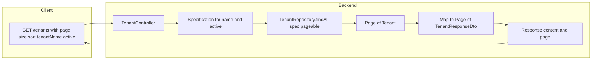

# Tenants list: paginated backend (priority 1)

Scope: **Backend only** for the tenants list. After execution, you will run tests and `scripts/update-specs.sh` (or `.bat`); UI migration to `usePaginatedFromOrval` is a separate plan.

---

## 1. Target contract (align with existing paginated endpoints)

- **Request:** `GET /api/v1/tenants?page=0&size=20&sort=createdAt,DESC` plus optional filters.
- **Response:** Same shape as other Admin list endpoints: `{ "content": [ ... TenantResponseDto ... ], "page": { "size", "number", "totalElements", "totalPages" } }`. The project uses `PageSerializationMode.VIA_DTO` in [AdminJpaConfig](ezkey-admin-api/src/main/java/org/ezkey/admin/AdminJpaConfig.java), so returning `ResponseEntity<Page<TenantResponseDto>>` produces this format automatically.
- **Sort:** Spring `Pageable` with `sort=property,direction` (e.g. `tenantId,asc`, `tenantName,desc`, `active,asc`, `createdAt,desc`). Use JPA property names from [Tenant](ezkey-core/src/main/java/org/ezkey/integration/domain/entity/Tenant.java) so they match the UI `sortKey` values: `tenantId`, `tenantName`, `active`, `createdAt`.

---

## 2. UI criteria to support (conformity)

From [tenants.tsx](ezkey-admin-ui/src/pages/tenants.tsx):

| UI feature                             | Backend support                                                 |
| -------------------------------------- | --------------------------------------------------------------- |
| Search by name (debounced)             | Optional query param `tenantName` (substring, case-insensitive) |
| Status filter: All / Active / Inactive | Optional query param `active` (boolean; omit = all)             |
| Sortable columns                       | `sort=tenantId`, `tenantName`, `active`, `createdAt` (asc/desc) |
| Page size (10/20/50/100)               | `page`, `size` (default e.g. 20)                                |
| Pagination (prev/next, total count)    | Response `content` + `page` metadata                            |

No UI code changes in this plan; the backend will be ready so a future UI plan can switch to `usePaginatedFromOrval` and pass `tenantName` and `active` in `baseParams`, and use the same `sort` and pagination as [integrations.tsx](ezkey-admin-ui/src/pages/integrations.tsx).

---

## 3. Backend implementation

### 3.1 Repository

- **File:** [TenantRepository](ezkey-core/src/main/java/org/ezkey/integration/domain/repository/TenantRepository.java)
- Extend `JpaSpecificationExecutor<Tenant>` (same pattern as [IntegrationRepository](ezkey-core/src/main/java/org/ezkey/integration/domain/repository/IntegrationRepository.java), [EnrollmentRepository](ezkey-core/src/main/java/org/ezkey/enrollment/domain/repository/EnrollmentRepository.java)).
- Add no new method signatures if using `findAll(Specification, Pageable)` from the interface.

### 3.2 Controller

- **File:** [TenantController](ezkey-admin-api/src/main/java/org/ezkey/admin/controller/TenantController.java)
- **List endpoint:** Replace `listTenants(Authentication)` with a method that:
  - Accepts `@RequestParam(required = false) String tenantName`, `@RequestParam(required = false) Boolean active`, and `@ParameterObject @PageableDefault(size = 20, sort = "createdAt", direction = Sort.Direction.DESC) Pageable pageable`.
  - Keeps current permission: only GlobalAdmin can list (current `@PreAuthorize("hasRole('ROLE_GLOBAL_ADMIN')")`). TenantAdmin continues to receive 403 (no change in who can call the endpoint).
  - For GlobalAdmin: build a `Specification<Tenant>` that applies optional filters (tenantName ILIKE, active eq), then call `tenantRepository.findAll(spec, pageable)`. Map result to `Page<TenantResponseDto>` with `page.map(tenantMapper::toResponseDto)` (same pattern as [IntegrationController.search](ezkey-admin-api/src/main/java/org/ezkey/admin/controller/IntegrationController.java)).
  - Return `ResponseEntity<Page<TenantResponseDto>>`.
- **Specification:** Build in the controller or in a small helper/service in admin-api (Tenant entity lives in ezkey-core; Specification can live in admin-api or in core next to repository). Use JPA criteria: `tenantName` → `cb.like(cb.lower(root.get("tenantName")), "%" + lower + "%")`, `active` → `cb.equal(root.get("active"), value)`.
- **OpenAPI:** Document query params in `@Operation` / `@Parameter`: `page`, `size`, `sort`, `tenantName`, `active`. Do not edit `specs/admin-api/openapi-spec.json` by hand; the maintainer runs update-specs after a clean Docker start.

### 3.3 TenantAdmin and single-tenant case

Current behavior: list is GlobalAdmin-only (TenantAdmin gets 403). The plan keeps this. If product later wants TenantAdmin to “list” their single tenant via the same endpoint, that would be a separate change (e.g. allow `ADMIN` and scope by `principal.tenantId()` in the Specification).

---

## 4. Documentation

- **File:** [docs/ENDPOINT.md](docs/ENDPOINT.md) — Section “List tenants”
  - Describe `GET /api/v1/tenants` with query params: `page`, `size`, `sort` (and optional `tenantName`, `active`).
  - State that the response is paginated: `content` (array of tenant objects) and `page` (size, number, totalElements, totalPages).

---

## 5. Postman collection

- **File:** [postman/collections/v2.1/EZ Key Tenants admin.postman_collection.json](postman/collections/v2.1/EZ Key Tenants admin.postman_collection.json)
- **Request “list”:**
  - Add query params: `page`, `size`, `sort` (e.g. default `page=0`, `size=20`, `sort=createdAt,desc`). Optionally add `tenantName` and `active` for filter examples.
  - Update description to state that the response is paginated (`content` + `page`).
- **Test script:**
  - Replace “Response is an array” with assertions on the paginated shape: e.g. `pm.expect(jsonData).to.have.property('content'); pm.expect(jsonData).to.have.property('page'); pm.expect(jsonData.content).to.be.an('array');` and assert `page` has `totalElements`, `totalPages`, etc.
  - If the script stores `tenantId`/`tenantName` from the first item, get it from `jsonData.content[0]` instead of `jsonData[0]`.

---

## 6. Tests

### 6.1 Unit tests (ezkey-admin-api)

- Add or extend tests for the list endpoint in a dedicated test class (e.g. `TenantControllerTest`) or add a nested class in an existing controller test:
  - GlobalAdmin: call with `Pageable` (e.g. first page, size 20); assert status 200, response body is `Page` with `content` and metadata; optionally assert with `tenantName` and `active` filters.
  - Mock or use in-memory repository as appropriate; follow the style of [AdminProvisioningControllerTest](ezkey-admin-api/src/test/java/org/ezkey/admin/controller/AdminProvisioningControllerTest.java) (PageImpl, ResponseEntity body checks).

### 6.2 Functional tests (ezkey-tests)

- **MultiTenantGlobalAdminTest** ([ezkey-tests/.../MultiTenantGlobalAdminTest.java](ezkey-tests/src/test/java/org/ezkey/tests/security/tenant/MultiTenantGlobalAdminTest.java)):
  - `listTenants()` already sends `size=100`; keep it and add `page=0` (and optionally `sort=tenantId,asc` for stability).
  - In `globalAdmin_can_list_all_tenants()`: parse tenant IDs from the paginated response, e.g. `response.jsonPath().getList("content.tenantId", Integer.class)` (and handle null/empty as today). Assert the list contains the expected tenant IDs.
- **TenantBasicOperationsTest** ([ezkey-tests/.../TenantBasicOperationsTest.java](ezkey-tests/src/test/java/org/ezkey/tests/security/tenant/TenantBasicOperationsTest.java)):
  - In `test03_list_all_tenants()`: change from asserting root array to asserting paginated structure: e.g. `response.jsonPath().getList("content")` not null; optionally assert `response.jsonPath().getObject("page", ...)`. Verify created tenant appears in `content` (e.g. by checking `content[*].tenantId` or iterating `content`).
- **TenantBoundaryPermissionsSecurityTest** ([ezkey-tests/.../TenantBoundaryPermissionsSecurityTest.java](ezkey-tests/src/test/java/org/ezkey/tests/security/multitenant/TenantBoundaryPermissionsSecurityTest.java)):
  - `testGlobalAdminCanListAllTenants()` already asserts `response.jsonPath().getList("content")` and size >= 2; ensure the list request does not require changes except possibly adding `page`/`size`/`sort` if the test expects a large result.
- **TestDataFactory** ([ezkey-tests/.../TestDataFactory.java](ezkey-tests/src/test/java/org/ezkey/tests/util/TestDataFactory.java)):
  - `getTenantIdByName` already uses `getList("content")` and iterates by `tenantName`. If the first page might not contain the tenant (many tenants), add query params to request a larger page (e.g. `size=100`) or multiple pages until found; document the assumption.

---

## 7. Order of work and checklist

1. **Repository:** Add `JpaSpecificationExecutor<Tenant>` to `TenantRepository`.
2. **Controller + spec logic:** Implement paginated list with `Pageable`, optional `tenantName` and `active`, build `Specification`, return `Page<TenantResponseDto>`.
3. **ENDPOINT.md:** Update “List tenants” with query params and response shape.
4. **Postman:** Update list request (query params + description) and test script (content + page).
5. **Unit tests:** Add or extend controller tests for paginated list and filters.
6. **Functional tests:** Adjust MultiTenantGlobalAdminTest, TenantBasicOperationsTest, and optionally TenantBoundaryPermissionsSecurityTest and TestDataFactory as above.
7. Run unit tests and functional tests; fix any failures.
8. **Maintainer:** After a clean Docker start, run `scripts/update-specs.sh` (or `.bat`) to regenerate `specs/admin-api/openapi-spec.json`. No manual spec edits.

---

## 8. Out of scope (future plans)

- **UI:** Switching tenants page to `usePaginatedFromOrval`, removing client-side filter/pagination/sort, and wiring `tenantName`/`active` and sort to the new API — separate plan.
- **OpenAPI spec:** Agents do not run update-specs; the maintainer does after validation.
- **Other list endpoints:** API keys, encryption keys, re-encryption batches (priorities 2–3 in the original plan).

---

## 9. Diagram (flow)

