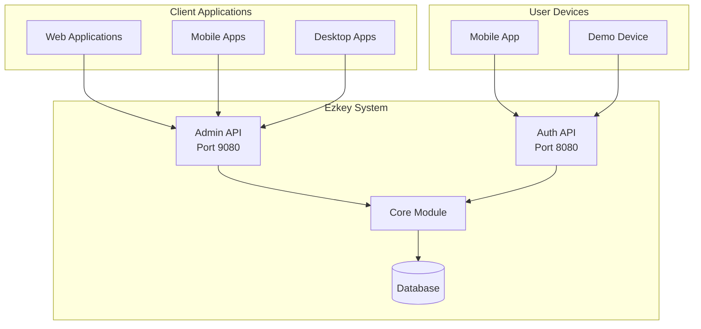

# Ezkey – Product Requirements Document (PRD)

## Table of Contents

1. [Context and Vision](#1-context-and-vision)
2. [Target Audience](#2-target-audience)
3. [Core Concepts](#3-core-concepts)
4. [Product Principles](#4-product-principles)
5. [High-Level Architecture](#5-high-level-architecture)
6. [Project Phases](#6-project-phases)
7. [Success Criteria](#7-success-criteria)
8. [Technical Specifications](#8-technical-specifications)
9. [Security Considerations](#9-security-considerations)
10. [Future Roadmap](#10-future-roadmap)

---

## 1. Context and Vision

### Background

Passkeys have been promoted for years by major tech players (Google, Microsoft, Amazon, Meta, etc.) as the future of passwordless authentication. However, integrating passkey-based MFA remains surprisingly complex for most organizations, especially small and medium businesses (SMBs).

### Vision Statement

**Ezkey aims to be the pragmatic, open-source, and developer-friendly alternative: a solution so simple and effective that it becomes the obvious choice for implementing secure MFA with minimal effort.**

### Problem Statement

- **Complexity**: Existing MFA solutions are overly complex for most use cases
- **Vendor Lock-in**: Proprietary solutions create dependency and cost concerns
- **Integration Overhead**: Current passkey implementations require significant development effort
- **Limited Control**: Organizations lack control over their authentication infrastructure

### Solution Overview

Ezkey provides a **synchronous, cryptographic MFA solution** that offers:
- **Simple REST APIs** for easy integration
- **Self-hosted deployment** for full control
- **Open-source transparency** for trust and customization
- **Developer-first design** for rapid adoption

---

## 2. Target Audience

### Primary Audience
- **Fullstack and backend developers**, especially those working in Java
- **DevOps engineers** responsible for authentication infrastructure
- **Technical decision makers** in small to medium organizations

### Secondary Audience
- **Any developer or team**, regardless of technology stack, thanks to the simplicity and RESTful nature of Ezkey's APIs
- **Security-conscious organizations** seeking transparent, auditable solutions

### Future Audience
- **Broader adoption** via language-agnostic integration and self-hosting options (e.g., Docker)
- **Enterprise customers** requiring customizable authentication solutions

---

## 3. Core Concepts

### Integration
Represents an application or system to be protected by MFA (e.g., admin portal, transactional site, internal tools).

**Key Attributes:**
- Unique identifier and configuration
- Integration metadata (name, description, logo)
- Cryptographic keys for secure communication

### Enrollment
The association between an integration, a user, and their mobile device. A user can have multiple enrollments for different integrations.

**Enrollment Process:**
1. **Binding**: Device establishes secure connection with integration
2. **Verification**: Cryptographic proof of device ownership
3. **Activation**: Enrollment becomes active for authentication

### Authentication Attempt
An MFA authentication flow, validated via cryptographic signature. Each attempt includes:
- Unique proof token for security
- User decision (approve/deny)
- Challenge response (if required)
- Cryptographic validation

### Administration & Tenancy

#### Tenant
Represents an organization or isolated workspace within the Ezkey instance.

**Tenant Types:**
- **System Tenant**: The organization hosting this Ezkey instance (e.g., "Acme Corp")
- **Application Tenants**: Departments or divisions within the organization (e.g., "HR", "IT")

**Key Attributes:**
- Unique identifier and name
- Organization description
- Created by admin reference
- Active/inactive status

#### Administrator
User with elevated privileges to manage the Ezkey instance.

**Administrator Types:**
- **Global Admin**: Instance-wide access, linked to system tenant
- **Tenant Admin**: Manages a specific tenant and its integrations
- **Integration Admin**: Manages a single integration within a tenant

**Key Features:**
- Secure authentication (password + optional MFA)
- Rate limiting protection against brute force
- Token-based API access (Bearer tokens)
- Audit trail (login history, actions)

**Bootstrap Process:**
On first startup, Ezkey automatically creates:
1. **System Tenant** - Representing the hosting organization (configurable name)
2. **Initial Global Administrator** - First global administrator with passwordless authentication (SOC 2 compliant)
3. **Secure Initialization** - Enrollment credentials and 10 recovery codes logged once (must be saved immediately)

**SOC 2 Compliance:**
- Initial global admin must be configured with identifiable username (not generic "admin")
- Email address required for audit trail and accountability (CC6.1, CC7.2)
- Configuration via `ezkey.admin.initial.username` and `ezkey.admin.initial.email`

---

## 4. Product Principles

### 🎯 Simplicity
- **Minimalist APIs**: Easy-to-understand REST endpoints
- **Clear Documentation**: Comprehensive guides and examples
- **Intuitive Flows**: Logical authentication processes

### ⚡ Pragmatism
- **80/20 Rule**: Solves 90% of the problem with 10% of the effort
- **Real-world Focus**: Addresses actual developer needs, not theoretical perfection
- **Rapid Deployment**: Get MFA working in hours, not weeks

### 🔓 Open Source
- **Full Transparency**: All components, including the mobile app, are open source
- **Community Driven**: Developer contributions and feedback welcome
- **No Vendor Lock-in**: Complete control over your authentication infrastructure

### 👨‍💻 Developer-first
- **Bottom-up Adoption**: Designed to be adopted by developers, not imposed by management
- **RESTful Design**: Familiar patterns and technologies
- **Comprehensive Tooling**: CLI tools, SDKs, and demo applications

### 🔐 Security by Design
- **Cryptographic Validation**: Strong cryptographic signatures for all operations
- **One-time Tokens**: Prevents replay attacks and ensures uniqueness
- **Secure by Default**: Security features enabled without additional configuration

### 🚀 Proprietary Protocol
- **Not FIDO2/WebAuthn**: Proprietary protocol optimized for simplicity
- **Compensated by Openness**: Full source code and documentation available
- **Optimized for Synchronous Flows**: Designed for real-time authentication

---

## 5. High-Level Architecture

### System Components



### Technology Stack

- **Backend**: Spring Boot 3.x with Java 21
- **Database**: PostgreSQL with Flyway migrations
- **APIs**: RESTful with OpenAPI documentation
- **Mobile**: Cross-platform mobile development
- **Deployment**: Docker support for self-hosting
- **Security**: Ed25519 cryptographic signatures

### Core Entities

- **Integration**: Application or system to be protected
- **Enrollment**: User-device association for an integration
- **Authentication Attempt**: MFA request and response flow

---

## 6. Project Phases

### Phase 1 – MVP ✅ **COMPLETED**
**Status**: Fully implemented and operational

**Scope:**
- ✅ Spring Boot application with Integration, Enrollment, and Authentication Attempt entities
- ✅ REST APIs for all core flows
- ✅ Basic error handling and minimal documentation (README, entity diagrams)
- ✅ Multi-module architecture (core, admin-api, auth-api)
- ✅ Database migrations with Flyway
- ✅ Wait API for synchronous authentication

**Acceptance Criteria:**
- ✅ End-to-end happy path can be demonstrated via API calls and demo applications
- ✅ Entities and relationships are clearly documented
- ✅ Project can be run locally with minimal setup

---

### Phase 2 – Quality & Best Practices ✅ **COMPLETED**
**Status**: Fully implemented and operational

**Scope:**
- ✅ Refactor package structure and database schema (naming, documentation)
- ✅ Adopt REST best practices: OpenAPI (code-first, annotations), DTOs for requests/responses, validation, standardized error responses
- ✅ Comprehensive Javadoc and OpenAPI documentation
- ✅ Automated tests for all core flows
- ✅ Define and document mapping strategy (MapStruct)
- ✅ Review and secure MFA logic
- ✅ Add Docker support for self-hosting

**Acceptance Criteria:**
- ✅ Codebase adheres to modern Java and REST best practices
- ✅ OpenAPI documentation is complete and accurate
- ✅ All endpoints have request/response DTOs and validation
- ✅ Automated tests cover all main flows
- ✅ Project can be built and run via Docker

---

### Phase 3 – Demonstrators ✅ **COMPLETED**
**Status**: Fully implemented and operational

**Scope:**
- ✅ Spring Boot demo app simulating a typical client application (ACME Inc. admin console)
- ✅ Spring Boot demo app simulating a mobile device for enrollment and authentication flows
- ✅ End-to-end integration scenarios, fully documented
- ✅ CLI tool for API interaction and management

**Acceptance Criteria:**
- ✅ Demo apps can be run locally and interact with Ezkey APIs
- ✅ Documentation allows a developer to reproduce the full integration scenario
- ✅ All flows can be demonstrated without manual database manipulation

---

### Phase 4 – Industrialization & Mobile 🔄 **IN PROGRESS**
**Status**: Partially implemented

**Scope:**
- ✅ Modularize and secure the REST APIs
- 🔄 Develop an open-source mobile app (React Native + Native Modules) for iOS and Android
- 🔄 Mobile app features: scan QR code for enrollment, manage multiple enrollments, display integration info (name, logo, description)
- 🔄 Publish Ezkey to Maven Central (build, CI/CD)

**Acceptance Criteria:**
- ✅ REST APIs are modular and follow security best practices
- 🔄 Mobile app is open source, cross-platform, and covers all core flows
- 🔄 Project is published to Maven Central and can be easily integrated into other projects

---

## 7. Success Criteria

### Phase 1 ✅ **ACHIEVED**
- ✅ MVP functional, happy path demonstrable, clear documentation
- ✅ Multi-module architecture operational
- ✅ Core authentication flows working end-to-end

### Phase 2 ✅ **ACHIEVED**
- ✅ Codebase refactored, documented, tested, and Dockerized
- ✅ OpenAPI documentation complete and accurate
- ✅ Comprehensive test coverage

### Phase 3 ✅ **ACHIEVED**
- ✅ Demo apps operational, full integration scenario reproducible
- ✅ CLI tool for API management
- ✅ Complete documentation suite

### Phase 4 🔄 **IN PROGRESS**
- ✅ Modular APIs with security best practices
- 🔄 Open-source mobile app development
- 🔄 Maven Central publication

---

## 8. Technical Specifications

### API Architecture

#### Admin API (Port 9080)
- **Integration Management**: CRUD operations for integrations
- **Enrollment Administration**: Manage device enrollments
- **Auth Attempt Creation**: Initialize authentication requests
- **Wait API**: Synchronous polling for authentication completion
- **System Monitoring**: View statistics and system health

#### Auth API (Port 8080)
- **Device Enrollment**: Bind devices to user accounts
- **Enrollment Verification**: Complete enrollment process
- **Authentication Flow**: Handle pending auth attempts and responses
- **Mobile Integration**: Optimized for mobile app consumption

### Security Model

#### One-Time Proof Token System
- **Unique Tokens**: Each authentication attempt gets a unique `authAttemptProofToken`
- **One-Time Use**: Tokens can only be read once (during PENDING request)
- **Cryptographic Proof**: Device must prove it received the original token
- **Anti-Replay**: Prevents replay of authentication attempts

#### Cryptographic Implementation
- **Ed25519**: Production-grade cryptographic signatures for all operations (32-byte keys, 64-byte signatures)
- **Device Keys**: Each device generates unique Ed25519 key pairs (mobile: derived via HKDF from root key)
- **Integration Keys**: Each integration has its own Ed25519 key pair (backend: direct generation)
- **Mutual Authentication**: Both backend and mobile cryptographically verify each other's authenticity
- **Signature Validation**: All requests validated cryptographically

### Database Schema

```sql
-- Core entities with proper relationships
Integration (id, name, description, logo, active, created_at)
Enrollment (id, integration_id, device_public_key, enrollment_proof_token, active, created_at)
AuthAttempt (id, enrollment_id, auth_proof_token, accepted, responded, valid, created_at)
```

---

## 9. Security Considerations

### Security Principles

- **Secure by Default**: Security features enabled without additional configuration
- **Cryptographic Validation**: All operations validated with strong cryptography
- **One-Time Tokens**: Prevents replay attacks and ensures uniqueness
- **Anti-Enumeration**: Secure enrollment identification prevents attacks

### Threat Model

- **Replay Attacks**: Prevented by one-time proof tokens
- **Man-in-the-Middle**: Prevented by cryptographic signatures
- **Enumeration Attacks**: Prevented by secure token-based identification
- **Token Reuse**: Prevented by one-time use token system

### Compliance

- **Not FIDO2/WebAuthn**: Proprietary protocol optimized for simplicity
- **Open Source**: Full transparency and auditability
- **Self-Hosted**: Complete control over data and infrastructure

---

## 10. Future Roadmap

### Short Term (Next 3 months)
- 🔄 Complete mobile app development (React Native + Native Modules)
- 🔄 Maven Central publication with CI/CD pipeline
- 🔄 Enhanced monitoring and observability

### Medium Term (3-6 months)
- 📋 Kubernetes deployment manifests
- 📋 Advanced security features (rate limiting, IP restrictions)
- 📋 Multi-tenant support for enterprise customers
- 📋 Performance optimization and benchmarking

### Long Term (6+ months)
- 📋 Microservices deployment architecture
- 📋 Third-party integrations (Active Directory, LDAP)
- 📋 Advanced mobile features (biometrics, hardware tokens)
- 📋 Enterprise support and SLA options

---

## Annexes

### A. Glossary of Terms

- **Integration**: Application or system protected by Ezkey MFA
- **Enrollment**: Secure association between user device and integration
- **Authentication Attempt**: MFA request-response flow with cryptographic validation
- **Proof Token**: One-time cryptographic token for secure authentication
- **Wait API**: Synchronous polling mechanism for authentication completion

### B. References

- **Security Best Practices**: Industry standards for cryptographic authentication
- **REST API Design**: RESTful API design principles and patterns
- **Open Source Licensing**: MIT License for maximum adoption flexibility

### C. Contact Information

- **Repository**: [GitHub Repository URL]
- **Documentation**: [Documentation Site URL]
- **Issues**: [GitHub Issues URL]
- **Discussions**: [GitHub Discussions URL]

---

## Document Information

- **Version**: 2.0
- **Last Updated**: September 2025
- **Status**: Active
- **Next Review**: December 2025

---

*This document serves as the authoritative source for Ezkey product requirements and development roadmap. All stakeholders should refer to this document for project scope, technical specifications, and success criteria.*
