# Ezkey - Open Source MFA/Passkey Alternative


## Overview

Ezkey is a pragmatic, open-source alternative to complex passkey implementations. It provides a simple and secure MFA solution that can be easily integrated into any application through a modern multi-module architecture.

### Why Ezkey?

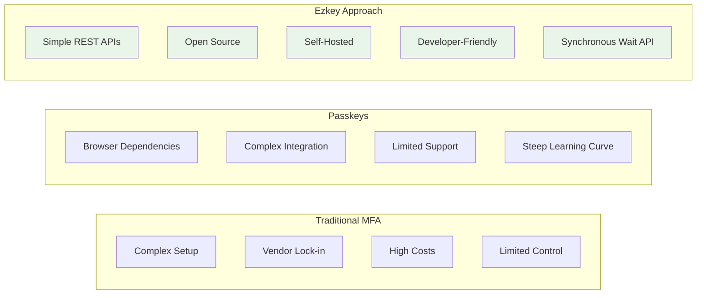

### Comparison Matrix

| Feature | Traditional MFA | Passkeys | Ezkey |
|---------|----------------|----------|-------|
| **Setup Complexity** | High | High | Low |
| **Integration Effort** | Medium | High | Low |
| **Cost** | High | Free (but complex) | Free + Self-hosted |
| **Control** | Limited | Limited | Full |
| **Mobile Support** | Good | Excellent | Excellent |
| **Developer Experience** | Varies | Complex | Simple |
| **Open Source** | Rarely | Partially | Yes |
| **Self-Hosting** | Rarely | No | Yes |
| **Synchronous Integration** | Limited | No | Yes (Wait API) |

## Features

- **Multi-Module Architecture**: Separated APIs for different use cases
- **Admin API**: Passwordless-only management interface ("eating our own dogfood"), with cryptographic authentication, recovery codes, rate limiting, and multi-tenant administration
- **Authentication API**: Mobile-focused API for device authentication
- **Wait API**: Synchronous polling for authentication completion
- **Mobile Application**: Cross-platform mobile app for end users
- **Secure**: Cryptographic key-based authentication with signature validation
- **Open Source**: MIT licensed with comprehensive documentation
- **Developer-Friendly**: REST APIs, OpenAPI documentation, and extensive examples
- **Cross-Platform**: Works with any technology stack

## 🔐 Security Design

### **One-Time Proof Token System**

Ezkey implements a **one-time proof token** security model that prevents replay attacks and ensures authentication integrity.

#### **Key Security Principles**

1. **Unique Tokens**: Each authentication attempt gets a unique `authAttemptProofToken`
2. **One-Time Use**: Tokens can only be read once (during PENDING request)
3. **Cryptographic Proof**: Device must prove it received the original token
4. **Anti-Replay**: Prevents replay of authentication attempts

#### **Security Flow**

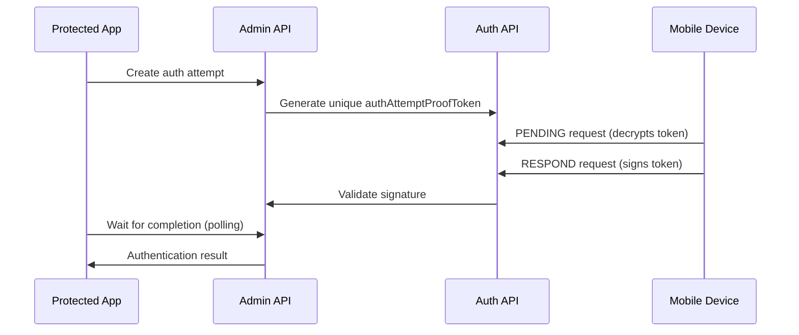

#### **Developer Security Checklist**

- ✅ Always use `authAttemptProofToken` for RESPOND (never `enrollmentProofToken`)
- ✅ Implement proper signature validation
- ✅ Store tokens securely on device
- ✅ Never reuse tokens across attempts
- ✅ Validate all cryptographic signatures

#### **Why This Matters**

This design ensures that:
- **Only legitimate devices** can respond to authentication requests
- **Each attempt is unique** and cannot be replayed
- **Cryptographic proof** prevents man-in-the-middle attacks
- **Zero-trust architecture** with end-to-end verification

## Architecture

Ezkey is built with a modern multi-module architecture:

```
ezkey/
├── ezkey-core/              # Shared core library (entities, services, repositories)
├── ezkey-migration/         # Database migration application (Flyway)
├── ezkey-admin-api/         # Administration API (port 9080)
├── ezkey-auth-api/          # Authentication API (port 8080) 
├── ezkey-crypto-api/        # Crypto API for testing and integration (port 8080)
├── ezkey-cli/               # Command Line Interface tool
├── ezkey_mobile/            # Mobile application
├── ezkey-demo-app-acme/     # Demo integration application
├── ezkey-demo-device/       # Demo device application
└── ezkey-docs/              # Project documentation
```

### System Overview

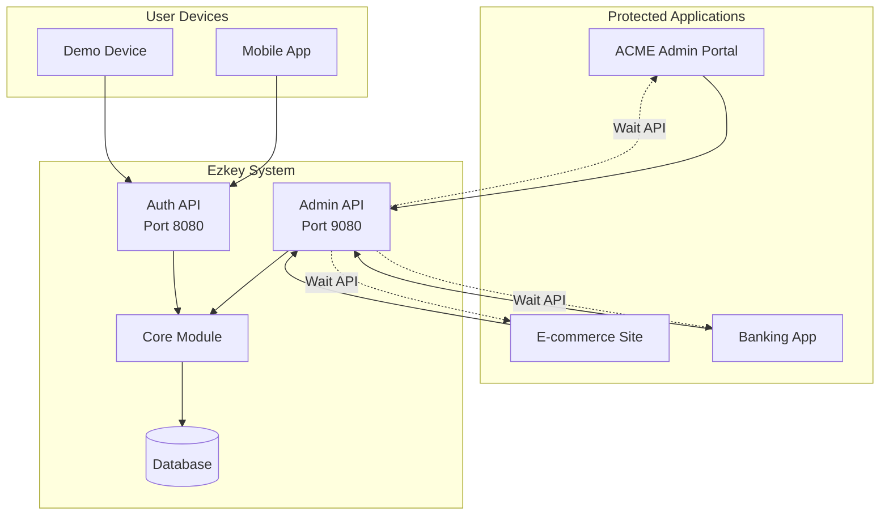

### Core Entities and Relationships

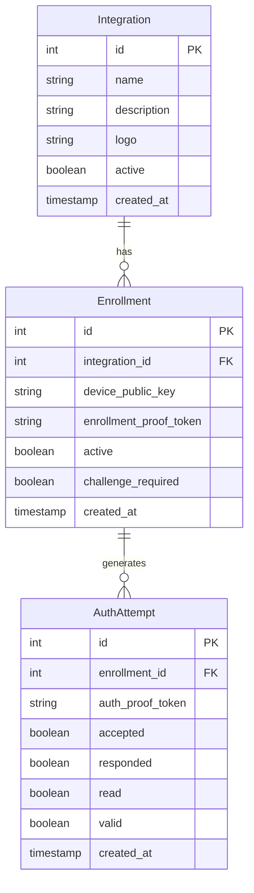

### Authentication Flow Overview

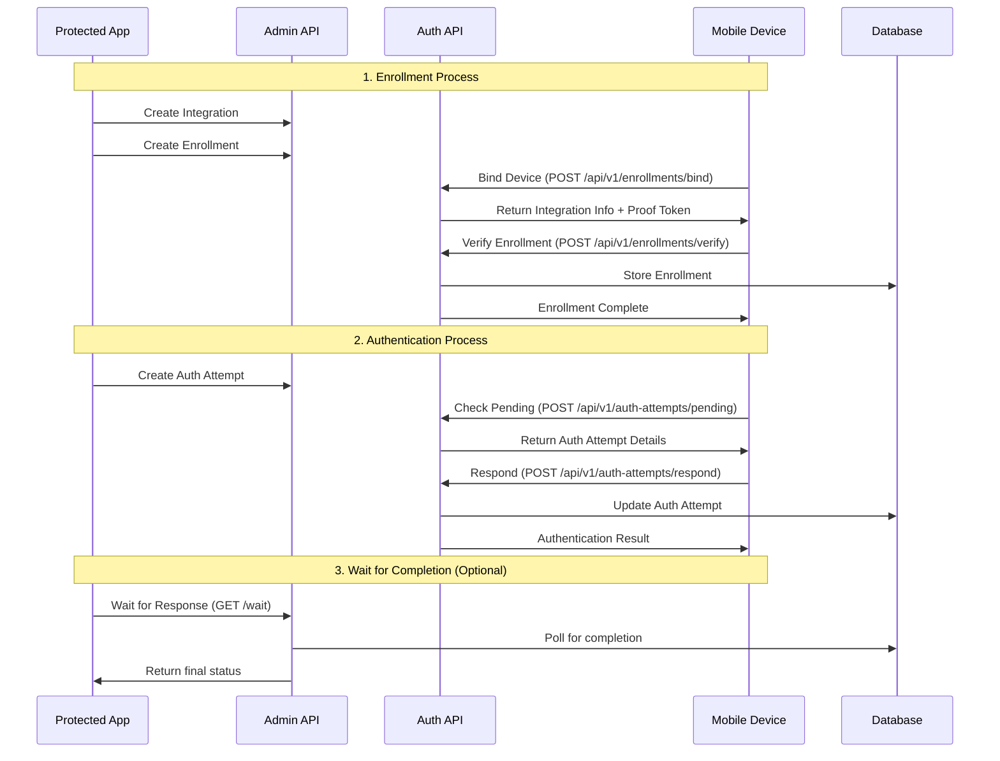

### User Journey: Application Owner

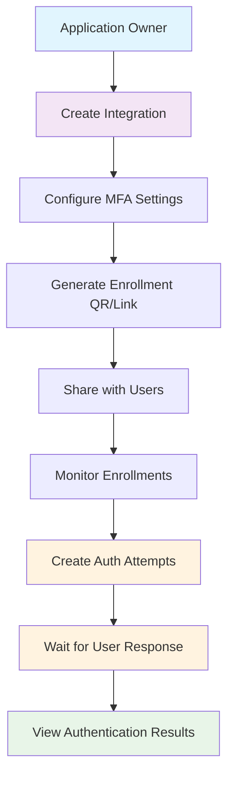

### User Journey: End User

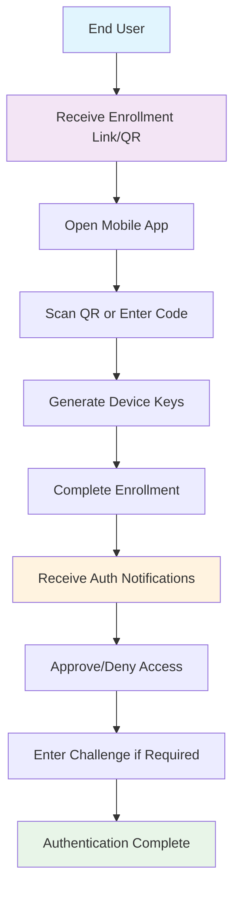

### Technical Integration Flow

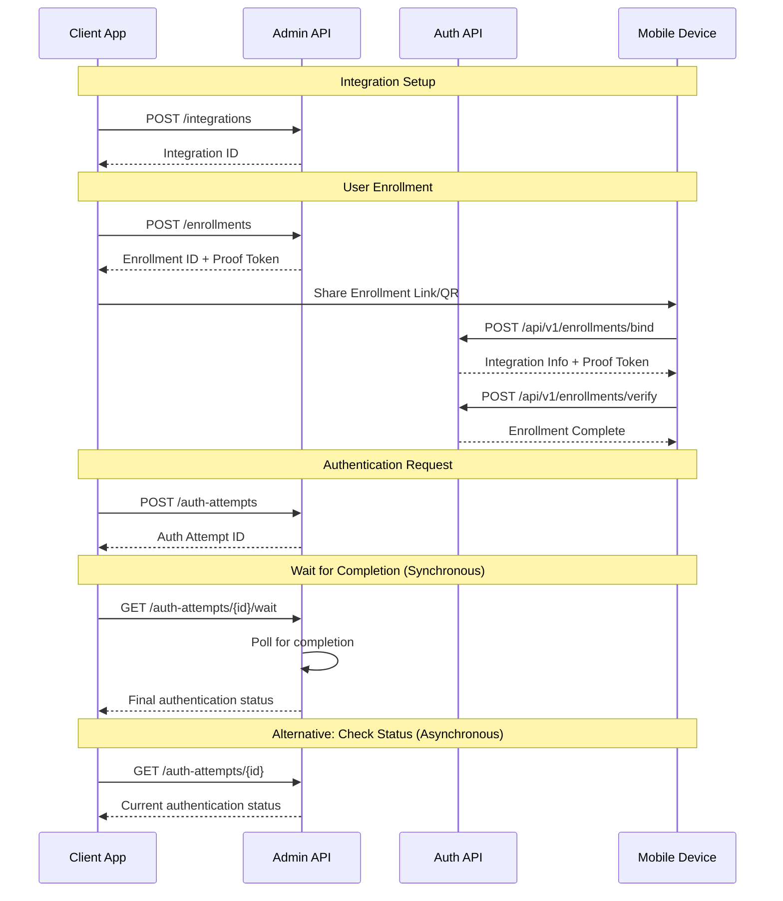

### Deployment Architecture

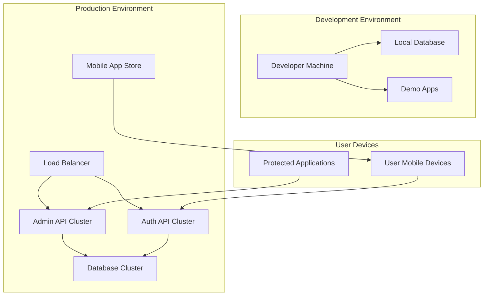

### Core Components

#### 🏗️ **ezkey-core**
Pure library module containing:
- **JPA Entities**: Integration, Enrollment, AuthAttempt
- **Business Services**: Authentication logic, signature validation, polling
- **Repositories**: Spring Data JPA repositories
- **Shared DTOs and Mappers**: Cross-module data structures
- **Exception Classes**: Common exception definitions

#### 🗄️ **ezkey-migration**
Dedicated migration application:
- **Flyway Integration**: Database schema management
- **Standalone JAR**: Independent migration execution
- **Spring Boot App**: Easy deployment and configuration
- **Migration Scripts**: Automated database updates

#### 🔧 **ezkey-admin-api** (Port 9080)
Administration interface for:
- **Integration Management**: Create, update, delete integrations
- **Enrollment Administration**: Manage device enrollments
- **Auth Attempt Creation**: Initialize authentication requests
- **Wait API**: Synchronous polling for authentication completion
- **System Monitoring**: View statistics and system health

#### 🔐 **ezkey-auth-api** (Port 8080)
Mobile-focused authentication API for:
- **Device Enrollment**: Bind devices to user accounts
- **Enrollment Verification**: Complete enrollment process
- **Authentication Flow**: Handle pending auth attempts and responses
- **Mobile Integration**: Optimized for mobile app consumption

#### 📱 **ezkey_mobile**
Cross-platform mobile application featuring:
- **QR Code Scanning**: Easy enrollment via QR codes
- **Push Notifications**: Real-time authentication requests
- **Secure Storage**: Encrypted key management
- **Biometric Support**: Local device authentication
- **Deep Links**: SMS and URL-based enrollment

### Security and Cryptography Flow

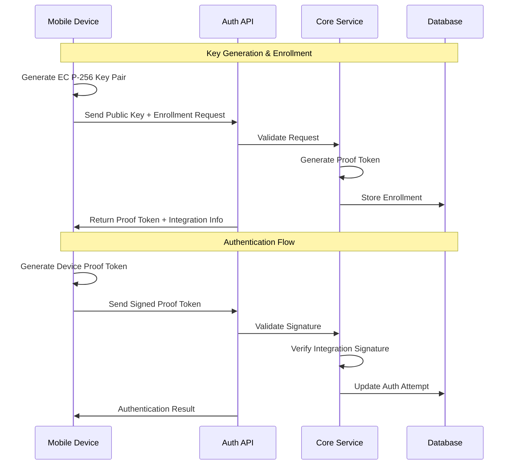

### Data Flow and Security

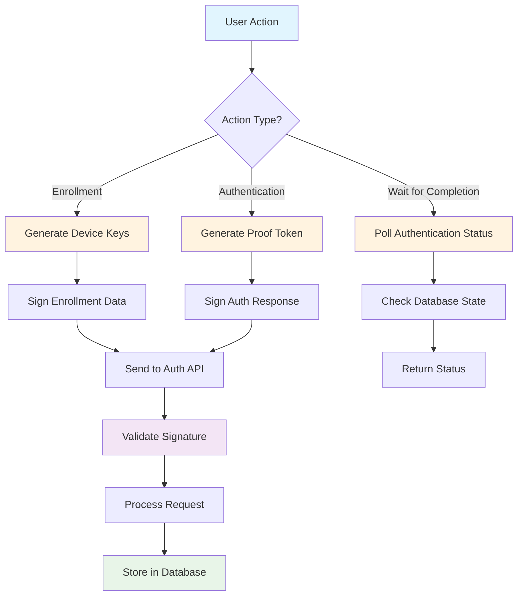

## Quick Start

### Option 1: Docker (Recommended - 5 Minutes)

The fastest way to get started is using Docker:

```bash
# Linux/Mac
./docker/start.sh

# Windows
docker\start.bat
```

This will start the complete EZ Key stack including PostgreSQL, all APIs, and the demo device.

**See [Docker Documentation](docker/README.md) for complete details.**

### Option 2: Manual Setup

### Prerequisites

- **Java 21** or higher
- **Maven 3.6+**
- **PostgreSQL** (or H2 for development)
- **Mobile development tools** (for mobile development)

### Database Setup

1. **Start PostgreSQL**:
```bash
docker run --name ezkey-postgres \
  -e POSTGRES_PASSWORD=ezkey \
  -e POSTGRES_DB=ezkey_db \
  -p 5432:5432 -d postgres:17
```

2. **Run Database Migrations**:
```bash
# Using the dedicated migration application
./scripts/ezkey-flyway.sh

# Or run directly with Maven
cd ezkey-migration
mvn spring-boot:run

# Or build and run the standalone JAR
cd ezkey-migration
mvn clean package -Pmigration-jar
java -jar target/ezkey-migration.jar
```

### Running the APIs

1. **Clone and Build**:
```bash
git clone https://github.com/your-org/ezkey.git
cd ezkey
mvn clean install
```

2. **Start Admin API** (Port 9080):
```bash
cd ezkey-admin-api
mvn spring-boot:run
```

3. **Start Auth API** (Port 8080):
```bash
cd ezkey-auth-api
mvn spring-boot:run
```

4. **Launch Mobile App**:
```bash
cd ezkey_mobile
# Follow mobile app setup instructions
```

### Access Points

- **Admin API**: http://localhost:9080/api/v1/
- **Auth API**: http://localhost:8080/api/v1/
- **API Documentation**: 
  - Admin: http://localhost:9080/swagger-ui.html
  - Auth: http://localhost:8080/swagger-ui.html

## 📚 Documentation

### 📖 Core Documentation
- **[Project Requirements Document](PRD.txt)** - Complete project specification
- **[Architecture & Security](docs/ARCHITECTURE.md)** - System architecture, security design, and cryptographic implementation
- **[Development Guide](docs/DEVELOPMENT.md)** - Development workflow, OpenAPI documentation, and testing strategy
- **[API Endpoints](docs/ENDPOINT.md)** - Detailed API reference and specifications
- **[API Keys Guide](docs/API_KEYS_GUIDE.md)** - Complete guide for machine-to-machine authentication
- **[API Keys - How It Works](docs/API_KEYS_HOW_IT_WORKS.md)** - Visual explanation with 15 Mermaid diagrams
- **[Cryptographic Implementation](docs/CRYPTO.md)** - Security and crypto details

### 📊 Monitoring & Operations
- **[Grafana Monitoring Setup](docs/monitoring/README.md)** - Production monitoring guide
- **[Quick Setup Guide](docs/monitoring/QUICK_SETUP.md)** - 5-minute monitoring setup
- **[Example Queries](docs/monitoring/example-queries.sql)** - SQL queries for monitoring

### 🔧 Development Tools
- **[Documentation Templates](docs/dev-tools/README_TEMPLATE.md)** - Standardized README template
- **[Code Style Configuration](docs/dev-tools/README.md)** - Eclipse formatter and Checkstyle configuration files with import instructions

### 📱 Module Documentation
- **[Core Module](ezkey-core/README.md)** - Business logic and shared library
- **[Migration Module](ezkey-migration/)** - Database migration application
- **[CLI Tool](ezkey-cli/README.md)** - Command-line interface documentation
- **[SDK Documentation](ezkey-sdk/README.md)** - Multi-language SDK guides

## API Overview

> **📅 Datetime Format**: All API responses return datetime fields in UTC with Z suffix (e.g., `"createdAt": "2025-10-16T15:52:52.764912Z"`). See [ENDPOINT.md](docs/ENDPOINT.md) for details.

### Admin API Endpoints (`localhost:9080`)

#### Integrations
- `GET /api/v1/integrations` - List all integrations
- `POST /api/v1/integrations` - Create new integration
- `GET /api/v1/integrations/{id}` - Get integration details
- `DELETE /api/v1/integrations/{id}` - Delete integration

#### Enrollments (Admin)
- `GET /api/v1/enrollments` - List all enrollments
- `POST /api/v1/enrollments` - Create enrollment
- `DELETE /api/v1/enrollments/{id}` - Delete enrollment

#### Auth Attempts (Admin)
- `GET /api/v1/auth-attempts` - List auth attempts
- `POST /api/v1/auth-attempts` - Create auth attempt
- `GET /api/v1/auth-attempts/{id}` - Get auth attempt status
- `GET /api/v1/auth-attempts/{id}/wait` - **Wait for authentication completion**

#### API Keys (M2M Authentication)
- `POST /api/v1/api-keys` - Create new API key pair
- `GET /api/v1/api-keys/integration/{id}` - List keys for integration
- `GET /api/v1/api-keys/{id}` - Get API key details
- `DELETE /api/v1/api-keys/{id}` - Revoke API key

### Auth API Endpoints (`localhost:8080`)

#### Enrollments (Mobile)
- `POST /api/v1/enrollments/bind` - Bind device to enrollment using proof token payload
- `POST /api/v1/enrollments/verify` - Verify and complete enrollment

#### Auth Attempts (Mobile)
- `POST /api/v1/auth-attempts/pending` - Get pending authentication for enrollment using proof payload
- `POST /api/v1/auth-attempts/respond` - Respond to auth attempt

### Wait API Usage

The Wait API provides synchronous behavior for authentication requests:

```bash
# Wait for authentication completion (default: 30s timeout, 2s polling)
GET /api/v1/auth-attempts/123/wait

# Custom timeout and polling interval
GET /api/v1/auth-attempts/123/wait?timeout=60&polling=5
```

**Response includes:**
- Authentication status (PENDING, READ, INVALID, REJECTED, ACCEPTED)
- Completion status and metadata
- Wait duration and timeout information

## Command Line Interface

Ezkey includes a comprehensive CLI tool for interacting with all APIs and managing the system:

```bash
# Install CLI dependencies
cd ezkey-cli
npm install
npm run build

# Configure the CLI
./bin/ezkey configure interactive

# Example usage
./bin/ezkey admin integration list
./bin/ezkey auth enrollment bind --enrollment-id 123 --proof-token EZK-ABC123-DEF456
./bin/ezkey sim keypair
./bin/ezkey database migrate
```

### CLI Features

- **Unified API Access**: Commands for all admin, auth, and crypto APIs
- **Configuration Management**: Hierarchical config with CLI > current dir > home dir precedence
- **JSON File Support**: Use `@filename` syntax for complex data input
- **Database Migrations**: Integrated Flyway migration management
- **OpenAPI Management**: Refresh demo application specifications
- **Help System**: Comprehensive help for all commands and subcommands

See `ezkey-cli/README.md` for complete documentation and examples.

## Development

### Technology Stack

- **Backend**: Java 21, Spring Boot 3.4.10, Spring Data JPA
- **Database**: PostgreSQL with Flyway migrations
- **Mapping**: MapStruct for DTO conversions
- **Documentation**: SpringDoc OpenAPI
- **Testing**: JUnit 5, Spring Boot Test
- **Mobile**: Cross-platform mobile development
- **Build**: Maven multi-module setup

### Code Standards

This project follows strict formatting and quality standards:

#### Formatting Rules
- **Indentation**: 2 spaces (no tabs) - Google Java Style Guide standard
- **Line Length**: Maximum 100 characters (Google Style Guide standard)
- **Encoding**: UTF-8 without BOM
- **Line Endings**: LF (Unix style)

#### Development Tools
- **Spotless**: Google Java Format 1.32.0 with strict 100-character line limit (covers `src/main/java` and `src/test/java`)
- **Checkstyle**: Google Java Style Guide (`docs/dev-tools/google_checks.xml`) - validates formatting rules
- **Eclipse Formatter**: Import `docs/dev-tools/eclipse_format.xml` in Eclipse/IDE for consistent formatting
- **EditorConfig**: Consistent formatting (`.editorconfig`)
- **MapStruct**: Object mapping between DTOs and entities
- **JaCoCo**: Code coverage reporting

### Project Structure

#### Java Modules
```
src/main/java/org/ezkey/
├── {domain}/
│   ├── domain/
│   │   ├── entity/          # JPA entities
│   │   └── repository/      # Spring Data repositories
│   ├── service/             # Business logic
│   ├── controller/          # REST endpoints (API modules)
│   ├── dto/
│   │   ├── request/         # Request DTOs  
│   │   ├── response/        # Response DTOs
│   │   └── common/          # Shared DTOs
│   ├── mapper/              # MapStruct mappers
│   └── exception/           # Custom exceptions
```

#### Mobile App Structure
```
src/
├── components/              # UI components
├── services/                # API services
├── hooks/                   # Custom hooks
├── screens/                 # UI screens
├── utils/                   # Utilities
└── native/                  # Native modules
    ├── android/             # Android native code
    └── ios/                 # iOS native code
```

### Development Commands

#### Backend
```bash
# Build all modules
mvn clean install

# Run quality checks
mvn spotless:apply
mvn checkstyle:check
mvn clean verify

# Database migrations (ezkey-core)
cd ezkey-core
mvn spring-boot:run                    # Run migrations
mvn spring-boot:run -Dspring-boot.run.arguments="--info"  # Show migration info
mvn spring-boot:run -Dspring-boot.run.arguments="--repair" # Repair migrations

# Build executable migration JAR
mvn clean package -Pmigration-jar      # Creates ezkey-migration.jar
java -jar target/ezkey-migration.jar   # Run migrations
java -jar target/ezkey-migration.jar --info  # Show info
java -jar target/ezkey-migration.jar --repair # Repair

# Run specific module
cd ezkey-admin-api
mvn spring-boot:run

# Database migrations
./scripts/ezkey-flyway.sh --info
./scripts/ezkey-flyway.sh --migrate
```

#### Mobile
```bash
# Install dependencies
npm install

# Run application
# Follow mobile app specific instructions

# Run tests
npm test

# Build release
# Follow mobile app specific build instructions
```

### Testing Strategy

- **Unit Tests**: Business logic and service layers
- **Integration Tests**: API endpoints and database operations
- **Mobile Tests**: Widget and integration testing
- **API Testing**: Comprehensive endpoint validation

## Deployment

### Docker Deployment

EZ Key provides a complete Docker setup for easy deployment, testing, and demonstrations.

**Quick Start:**
```bash
# Linux/Mac
./docker/start.sh

# Windows
docker\start.bat
```

**Complete Documentation:** See [docker/README.md](docker/README.md) for:
- Complete setup instructions
- Architecture overview
- Management commands
- Troubleshooting guide
- Production considerations

**Services:**
- Admin API: http://localhost:9080
- Auth API: http://localhost:8080
- Crypto API: http://localhost:9090
- Demo Device: http://localhost:8083

### Manual Deployment

For manual deployment without Docker, configure each module with environment-specific properties:

```properties
# Database
spring.datasource.url=jdbc:postgresql://localhost:5432/ezkey_db
spring.datasource.username=postgres
spring.datasource.password=ezkey

# API Ports
server.port=9080  # Admin API
server.port=8080  # Auth API

# Security
# All security-related configurations handled in API-specific property files
```

## Contributing

1. **Fork the Repository**
2. **Create Feature Branch**: `git checkout -b feature/amazing-feature`
3. **Follow Code Standards**: Use provided checkstyle and editorconfig
4. **Add Tests**: Ensure comprehensive test coverage
5. **Update Documentation**: Include API and code documentation
6. **Submit Pull Request**: Use conventional commit messages

### Commit Message Format

Use conventional commit messages:
```
feat(admin-api): add integration export endpoint
fix(auth-api): resolve enrollment binding issue
docs(mobile): update mobile app setup instructions
style(core): format according to Google style guide
test(admin-api): add integration controller tests
```

## Monitoring and Operations

### Database Migrations

Use the dedicated Flyway tool for production deployments:

```bash
# Windows
scripts\ezkey-flyway.bat --info

# Linux/Mac  
./scripts/ezkey-flyway.sh --migrate
```

### Health Checks

- **Admin API**: `GET /actuator/health`
- **Auth API**: `GET /actuator/health`

### Logging

Structured logging with configurable levels:
```properties
logging.level.org.ezkey=INFO
logging.level.org.springframework.web=WARN
```

## License

This project is licensed under the MIT License - see the [LICENSE](LICENSE) file for details.

## Security

Ezkey takes security seriously. We are committed to providing a secure authentication solution.

### Reporting Security Issues

**Please DO NOT report security vulnerabilities through public GitHub issues.**

Instead, please report security vulnerabilities to:
- **Email**: security@ezkey.org

See our [Security Policy](SECURITY.md) for full details on:
- Vulnerability reporting process and response timelines
- Disclosure policy and coordination
- Security researcher recognition
- Secure development practices

### Security Features

- **EC P-256** cryptographic authentication (production-grade, native mobile hardware support)
- **One-time proof tokens** to prevent replay attacks
- **Signature validation** on all authentication attempts
- **API Keys** for secure machine-to-machine authentication
- **Rate limiting** and abuse prevention
- **IP whitelisting** for API keys (CIDR support)
- **Comprehensive audit logging** for security events
- **Regular security updates** and dependency scanning

### Compliance

Ezkey is working towards SOC2 compliance. See our [SOC2 Preparation Roadmap](docs/SOC2_PREPARATION.md) for details on:
- SOC2 overview for open source projects
- Three paths to compliance (Preparation, Self-hosting, SaaS)
- Tool assessment and selection
- 12-18 month implementation roadmap
- Quick wins for first 30 days

For security best practices when deploying Ezkey, see [docs/OPERATIONAL.md](docs/OPERATIONAL.md).

## Support and Community

- **Issues**: [GitHub Issues](https://github.com/your-org/ezkey/issues)
- **Documentation**: [Project Wiki](https://github.com/your-org/ezkey/wiki)
- **Discussions**: [GitHub Discussions](https://github.com/your-org/ezkey/discussions)
- **Security**: Report security issues privately to security@ezkey.org

## Roadmap

### Phase 1 ✅ (Completed)
- [x] Multi-module architecture
- [x] Core entities and services
- [x] Admin and Auth APIs
- [x] **Wait API for synchronous authentication**
- [x] Mobile application
- [x] Database migrations
- [x] Development tooling

### Phase 2 🔄 (In Progress)
- [ ] Docker containerization
- [ ] Kubernetes deployment manifests
- [ ] API performance optimization
- [ ] Enhanced mobile features
- [ ] Comprehensive monitoring

### Phase 3 📋 (Planned)
- [ ] Microservices deployment
- [ ] Advanced security features
- [ ] Multi-tenant support
- [ ] Performance benchmarking
- [ ] Third-party integrations
