# How API Keys Work in Ezkey

**Canon (2026-08-29):** Integration API is the only backend that authenticates API keys
for auth-attempt M2M traffic. Admin API authenticates administrators (Bearer / session)
and hosts API-key **lifecycle** (create / list / get / revoke) only. HTTP Basic API-key
credentials on Admin API return **401 Unauthorized**. Older diagrams in this file that
still say “Admin API” for `POST /auth-attempts` with Basic auth are historical — treat
Integration API (`7080`) as the live path.

## Overview

This document explains the technical implementation and architecture of the API Keys authentication system in Ezkey, using visual diagrams and detailed explanations.

---

## Table of Contents

1. [Architecture Overview](#architecture-overview)
2. [Authentication Flow](#authentication-flow)
3. [Key Generation Process](#key-generation-process)
4. [Validation Process](#validation-process)
5. [Security Layers](#security-layers)
6. [Key Rotation Flow](#key-rotation-flow)
7. [Comparison with Bearer Tokens](#comparison-with-bearer-tokens)

---

## Architecture Overview

### System Components

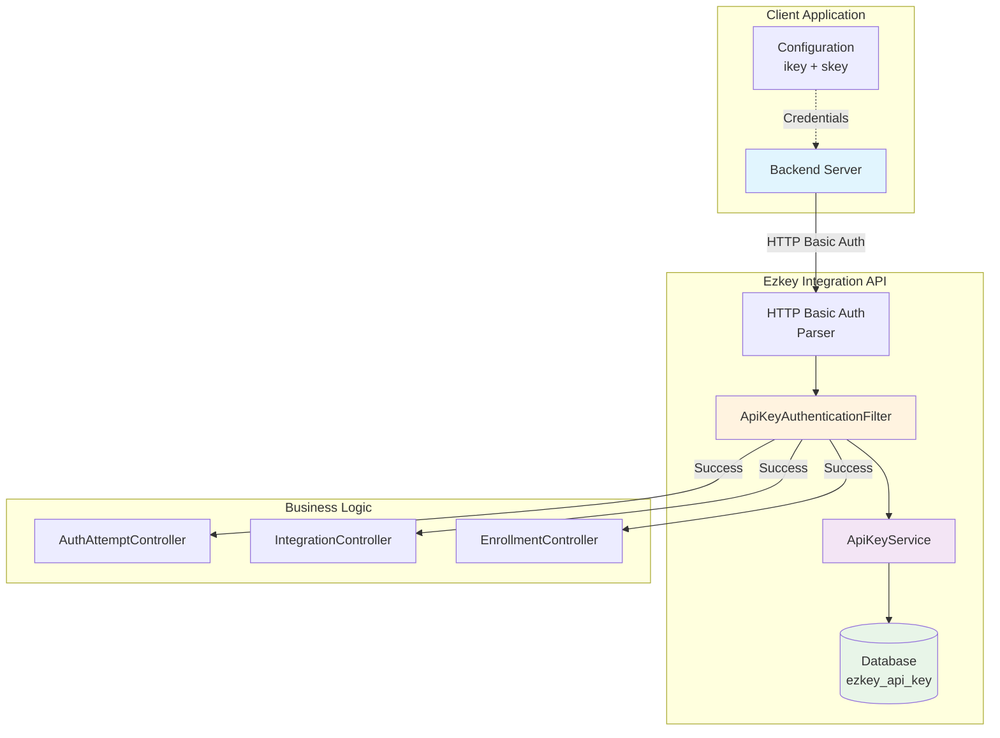
```mermaid
graph TB
    subgraph "Client Application"
        A[Backend Server]
        B[Configuration<br/>ikey + skey]
    end
    
    subgraph "Ezkey Integration API"
        C[HTTP Basic Auth<br/>Parser]
        D[ApiKeyAuthenticationFilter]
        E[ApiKeyService]
        F[(Database<br/>ezkey_api_key)]
    end
    
    subgraph "Business Logic"
        G[AuthAttemptController]
        H[IntegrationController]
        I[EnrollmentController]
    end
    
    A -->|HTTP Basic Auth| C
    B -.->|Credentials| A
    C --> D
    D --> E
    E --> F
    D -->|Success| G
    D -->|Success| H
    D -->|Success| I
    
    style A fill:#e1f5fe
    style D fill:#fff3e0
    style E fill:#f3e5f5
    style F fill:#e8f5e8
```

### Dual Authentication System

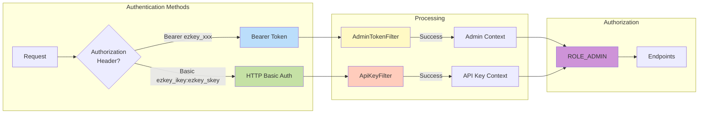
```mermaid
graph LR
    subgraph "Authentication Methods"
        A[Request]
        B{Authorization<br/>Header?}
        C[Bearer Token]
        D[HTTP Basic Auth]
    end
    
    subgraph "Processing"
        E[AdminTokenFilter]
        F[ApiKeyFilter]
        G[Admin Context]
        H[API Key Context]
    end
    
    subgraph "Authorization"
        I[ROLE_ADMIN]
        J[Endpoints]
    end
    
    A --> B
    B -->|Bearer ezkey_xxx| C
    B -->|Basic ezkey_ikey:ezkey_skey| D
    
    C --> E
    D --> F
    
    E -->|Success| G
    F -->|Success| H
    
    G --> I
    H --> I
    
    I --> J
    
    style C fill:#bbdefb
    style D fill:#c5e1a5
    style E fill:#fff9c4
    style F fill:#ffccbc
    style I fill:#ce93d8
```

---

## Authentication Flow

### Complete Request Flow

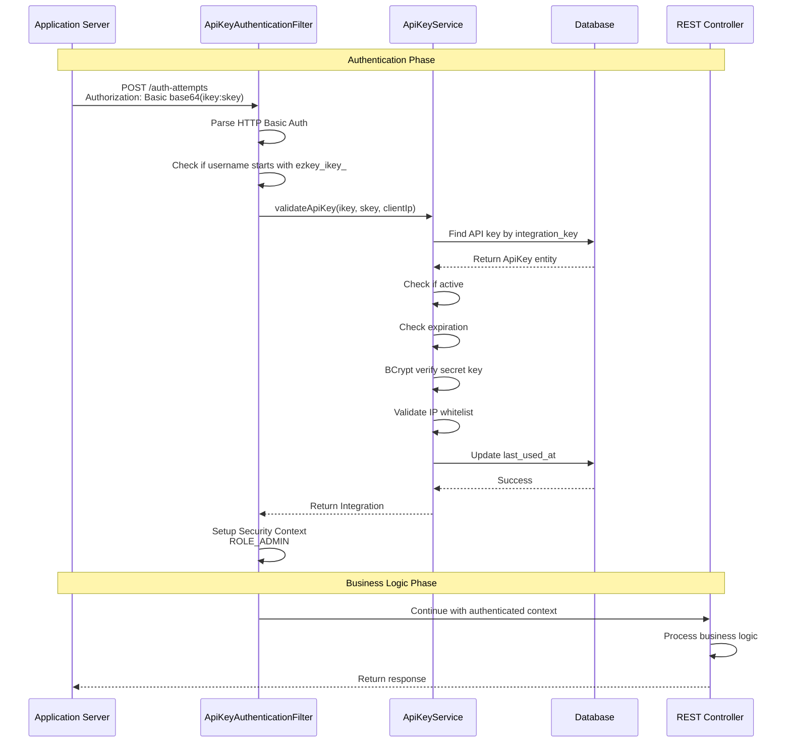
```mermaid
sequenceDiagram
    participant App as Application Server
    participant Filter as ApiKeyAuthenticationFilter
    participant Service as ApiKeyService
    participant DB as Database
    participant Controller as REST Controller
    
    Note over App,Controller: Authentication Phase
    App->>Filter: POST /auth-attempts<br/>Authorization: Basic base64(ikey:skey)
    
    Filter->>Filter: Parse HTTP Basic Auth
    Filter->>Filter: Check if username starts with ezkey_ikey_
    
    Filter->>Service: validateApiKey(ikey, skey, clientIp)
    
    Service->>DB: Find API key by integration_key
    DB-->>Service: Return ApiKey entity
    
    Service->>Service: Check if active
    Service->>Service: Check expiration
    Service->>Service: BCrypt verify secret key
    Service->>Service: Validate IP whitelist
    
    Service->>DB: Update last_used_at
    DB-->>Service: Success
    
    Service-->>Filter: Return Integration
    
    Filter->>Filter: Setup Security Context<br/>ROLE_ADMIN
    
    Note over App,Controller: Business Logic Phase
    Filter->>Controller: Continue with authenticated context
    
    Controller->>Controller: Process business logic
    Controller-->>App: Return response
```

### Failed Authentication Flow

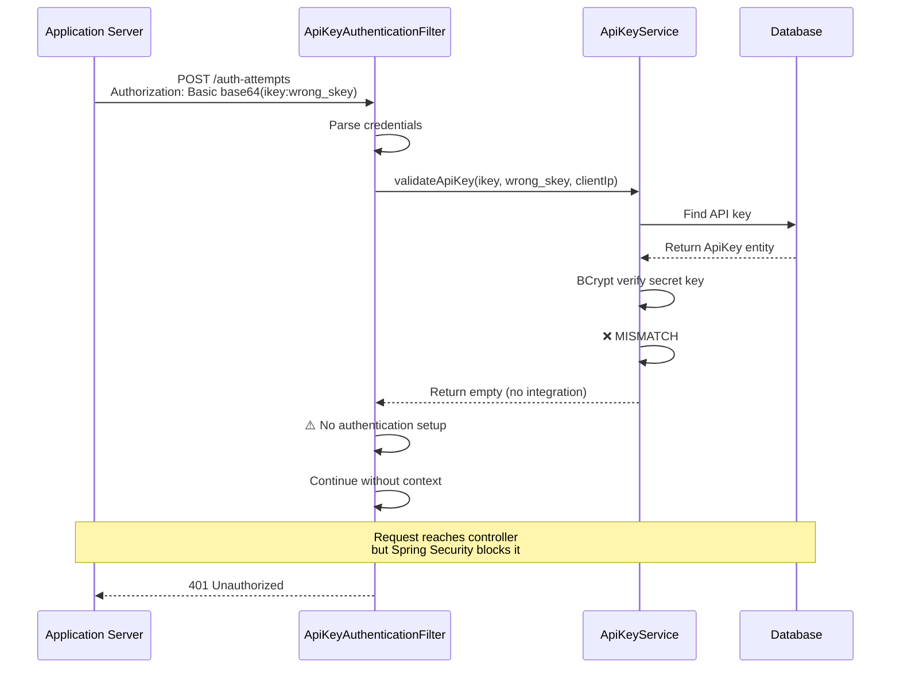
```mermaid
sequenceDiagram
    participant App as Application Server
    participant Filter as ApiKeyAuthenticationFilter
    participant Service as ApiKeyService
    participant DB as Database
    
    App->>Filter: POST /auth-attempts<br/>Authorization: Basic base64(ikey:wrong_skey)
    
    Filter->>Filter: Parse credentials
    
    Filter->>Service: validateApiKey(ikey, wrong_skey, clientIp)
    
    Service->>DB: Find API key
    DB-->>Service: Return ApiKey entity
    
    Service->>Service: BCrypt verify secret key
    Service->>Service: ❌ MISMATCH
    
    Service-->>Filter: Return empty (no integration)
    
    Filter->>Filter: ⚠️ No authentication setup
    Filter->>Filter: Continue without context
    
    Note over App,DB: Request reaches controller<br/>but Spring Security blocks it
    
    Filter-->>App: 401 Unauthorized
```

---

## Key Generation Process

### Creation Flow

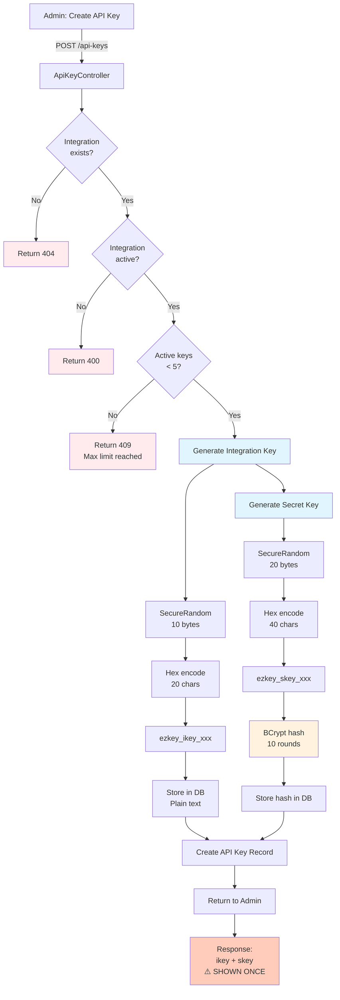
```mermaid
graph TD
    A[Admin: Create API Key] -->|POST /api-keys| B[ApiKeyController]
    B --> C{Integration<br/>exists?}
    C -->|No| D[Return 404]
    C -->|Yes| E{Integration<br/>active?}
    E -->|No| F[Return 400]
    E -->|Yes| G{Active keys<br/>< 5?}
    G -->|No| H[Return 409<br/>Max limit reached]
    G -->|Yes| I[Generate Integration Key]
    
    I --> J[SecureRandom<br/>10 bytes]
    J --> K[Hex encode<br/>20 chars]
    K --> L[ezkey_ikey_xxx]
    
    I --> M[Generate Secret Key]
    M --> N[SecureRandom<br/>20 bytes]
    N --> O[Hex encode<br/>40 chars]
    O --> P[ezkey_skey_xxx]
    
    L --> Q[Store in DB<br/>Plain text]
    P --> R[BCrypt hash<br/>10 rounds]
    R --> S[Store hash in DB]
    
    Q --> T[Create API Key Record]
    S --> T
    T --> U[Return to Admin]
    
    U --> V[Response:<br/>ikey + skey<br/>⚠️ SHOWN ONCE]
    
    style D fill:#ffebee
    style F fill:#ffebee
    style H fill:#ffebee
    style I fill:#e1f5fe
    style M fill:#e1f5fe
    style R fill:#fff3e0
    style V fill:#ffccbc
```

### Key Format

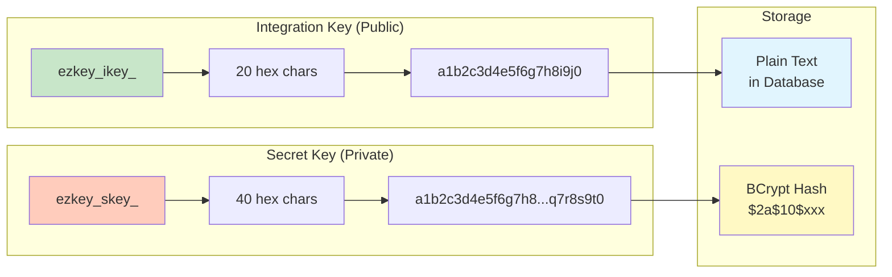
```mermaid
graph LR
    subgraph "Integration Key (Public)"
        A[ezkey_ikey_] --> B[20 hex chars]
        B --> C[a1b2c3d4e5f6g7h8i9j0]
    end
    
    subgraph "Secret Key (Private)"
        D[ezkey_skey_] --> E[40 hex chars]
        E --> F[a1b2c3d4e5f6g7h8...q7r8s9t0]
    end
    
    subgraph "Storage"
        G[Plain Text<br/>in Database]
        H[BCrypt Hash<br/>$2a$10$xxx]
    end
    
    C --> G
    F --> H
    
    style A fill:#c8e6c9
    style D fill:#ffccbc
    style G fill:#e1f5fe
    style H fill:#fff9c4
```

---

## Validation Process

### Security Checks Sequence

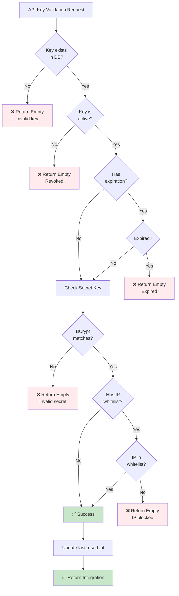
```mermaid
graph TD
    A[API Key Validation Request] --> B{Key exists<br/>in DB?}
    B -->|No| C[❌ Return Empty<br/>Invalid key]
    B -->|Yes| D{Key is<br/>active?}
    
    D -->|No| E[❌ Return Empty<br/>Revoked]
    D -->|Yes| F{Has<br/>expiration?}
    
    F -->|Yes| G{Expired?}
    F -->|No| H[Check Secret Key]
    
    G -->|Yes| I[❌ Return Empty<br/>Expired]
    G -->|No| H
    
    H --> J{BCrypt<br/>matches?}
    J -->|No| K[❌ Return Empty<br/>Invalid secret]
    J -->|Yes| L{Has IP<br/>whitelist?}
    
    L -->|No| M[✅ Success]
    L -->|Yes| N{IP in<br/>whitelist?}
    
    N -->|No| O[❌ Return Empty<br/>IP blocked]
    N -->|Yes| M
    
    M --> P[Update last_used_at]
    P --> Q[✅ Return Integration]
    
    style C fill:#ffebee
    style E fill:#ffebee
    style I fill:#ffebee
    style K fill:#ffebee
    style O fill:#ffebee
    style M fill:#c8e6c9
    style Q fill:#c8e6c9
```

### BCrypt Validation Detail

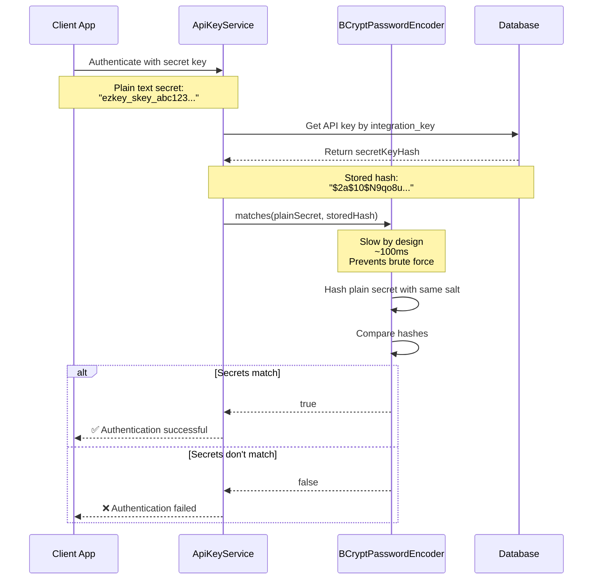
```mermaid
sequenceDiagram
    participant Client as Client App
    participant Service as ApiKeyService
    participant BCrypt as BCryptPasswordEncoder
    participant DB as Database
    
    Client->>Service: Authenticate with secret key
    Note over Client,Service: Plain text secret:<br/>"ezkey_skey_abc123..."
    
    Service->>DB: Get API key by integration_key
    DB-->>Service: Return secretKeyHash
    Note over DB,Service: Stored hash:<br/>"$2a$10$N9qo8u..."
    
    Service->>BCrypt: matches(plainSecret, storedHash)
    
    Note over BCrypt: Slow by design<br/>~100ms<br/>Prevents brute force
    
    BCrypt->>BCrypt: Hash plain secret with same salt
    BCrypt->>BCrypt: Compare hashes
    
    alt Secrets match
        BCrypt-->>Service: true
        Service-->>Client: ✅ Authentication successful
    else Secrets don't match
        BCrypt-->>Service: false
        Service-->>Client: ❌ Authentication failed
    end
```

---

## Security Layers

### Defense in Depth

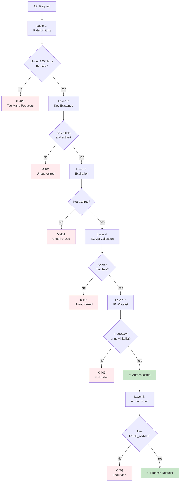
```mermaid
graph TD
    A[API Request] --> B[Layer 1:<br/>Rate Limiting]
    B --> C{"Under 1000/hour<br/>per key?"}
    C -->|No| D[❌ 429<br/>Too Many Requests]
    C -->|Yes| E[Layer 2:<br/>Key Existence]
    
    E --> F{Key exists<br/>and active?}
    F -->|No| G[❌ 401<br/>Unauthorized]
    F -->|Yes| H[Layer 3:<br/>Expiration]
    
    H --> I{Not expired?}
    I -->|No| J[❌ 401<br/>Unauthorized]
    I -->|Yes| K[Layer 4:<br/>BCrypt Validation]
    
    K --> L{Secret<br/>matches?}
    L -->|No| M[❌ 401<br/>Unauthorized]
    L -->|Yes| N[Layer 5:<br/>IP Whitelist]
    
    N --> O{IP allowed<br/>or no whitelist?}
    O -->|No| P[❌ 403<br/>Forbidden]
    O -->|Yes| Q[✅ Authenticated]
    
    Q --> R[Layer 6:<br/>Authorization]
    R --> S{Has<br/>ROLE_ADMIN?}
    S -->|No| T[❌ 403<br/>Forbidden]
    S -->|Yes| U[✅ Process Request]
    
    style D fill:#ffebee
    style G fill:#ffebee
    style J fill:#ffebee
    style M fill:#ffebee
    style P fill:#ffebee
    style T fill:#ffebee
    style Q fill:#c8e6c9
    style U fill:#c8e6c9
```

### Security Features Matrix

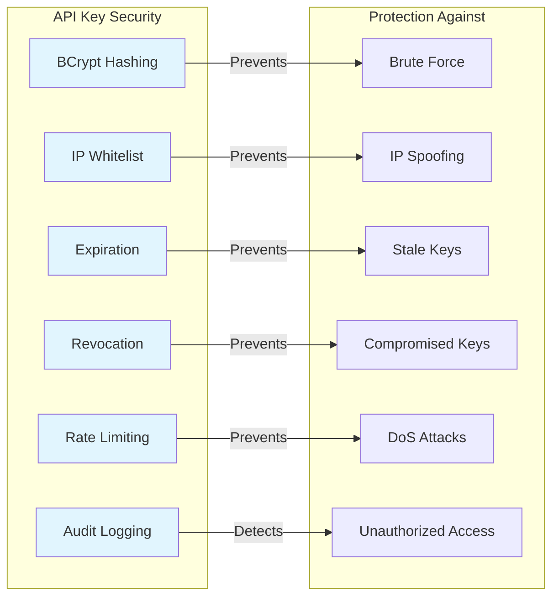
```mermaid
graph LR
    subgraph "API Key Security"
        A[BCrypt Hashing]
        B[IP Whitelist]
        C[Expiration]
        D[Revocation]
        E[Rate Limiting]
        F[Audit Logging]
    end
    
    subgraph "Protection Against"
        G[Brute Force]
        H[IP Spoofing]
        I[Stale Keys]
        J[Compromised Keys]
        K[DoS Attacks]
        L[Unauthorized Access]
    end
    
    A -->|Prevents| G
    B -->|Prevents| H
    C -->|Prevents| I
    D -->|Prevents| J
    E -->|Prevents| K
    F -->|Detects| L
    
    style A fill:#e1f5fe
    style B fill:#e1f5fe
    style C fill:#e1f5fe
    style D fill:#e1f5fe
    style E fill:#e1f5fe
    style F fill:#e1f5fe
```

---

## Key Rotation Flow

### Zero-Downtime Rotation

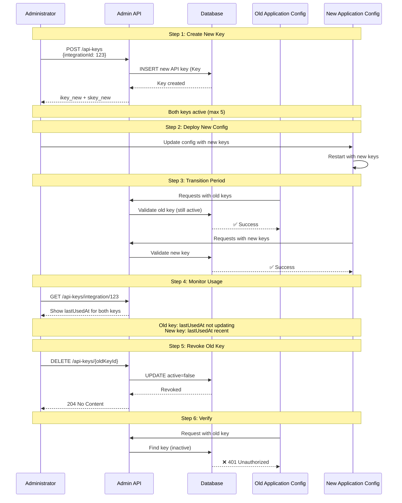
```mermaid
sequenceDiagram
    participant Admin as Administrator
    participant API as Admin API
    participant DB as Database
    participant App1 as Old Application Config
    participant App2 as New Application Config
    
    Note over Admin,App2: Step 1: Create New Key
    Admin->>API: POST /api-keys<br/>{integrationId: 123}
    API->>DB: INSERT new API key (Key #2)
    DB-->>API: Key created
    API-->>Admin: ikey_new + skey_new
    
    Note over Admin,App2: Both keys active (max 5)
    
    Note over Admin,App2: Step 2: Deploy New Config
    Admin->>App2: Update config with new keys
    App2->>App2: Restart with new keys
    
    Note over Admin,App2: Step 3: Transition Period
    App1->>API: Requests with old keys
    API->>DB: Validate old key (still active)
    DB-->>App1: ✅ Success
    
    App2->>API: Requests with new keys
    API->>DB: Validate new key
    DB-->>App2: ✅ Success
    
    Note over Admin,App2: Step 4: Monitor Usage
    Admin->>API: GET /api-keys/integration/123
    API-->>Admin: Show lastUsedAt for both keys
    
    Note over Admin,App2: Old key: lastUsedAt not updating<br/>New key: lastUsedAt recent
    
    Note over Admin,App2: Step 5: Revoke Old Key
    Admin->>API: DELETE /api-keys/{oldKeyId}
    API->>DB: UPDATE active=false
    DB-->>API: Revoked
    API-->>Admin: 204 No Content
    
    Note over Admin,App2: Step 6: Verify
    App1->>API: Request with old key
    API->>DB: Find key (inactive)
    DB-->>App1: ❌ 401 Unauthorized
```

### Rotation Timeline

```mermaid
gantt
    title API Key Rotation Timeline (Zero Downtime)
    dateFormat HH:mm
    axisFormat %H:%M
    
    section Key Lifecycle
    Old Key Active           :active, oldkey, 00:00, 168h
    New Key Created          :milestone, create, 168h, 0h
    New Key Active           :active, newkey, 168h, 336h
    Transition Period        :crit, transition, 168h, 168h
    Old Key Revoked          :milestone, revoke, 336h, 0h
    
    section Deployment
    Old Config Running       :oldconfig, 00:00, 169h
    Deploy New Config        :milestone, deploy, 169h, 0h
    New Config Running       :newconfig, 169h, 336h
    
    section Monitoring
    Monitor Both Keys        :monitor, 168h, 168h
    Verify Old Key Unused    :verify, 330h, 6h
```

---

## Key Generation Process

### Entropy and Randomness

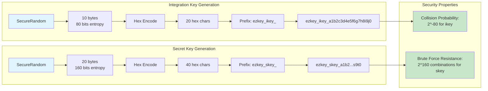
```mermaid
graph LR
    subgraph "Integration Key Generation"
        A[SecureRandom] --> B[10 bytes<br/>80 bits entropy]
        B --> C[Hex Encode]
        C --> D[20 hex chars]
        D --> E[Prefix: ezkey_ikey_]
        E --> F[ezkey_ikey_a1b2c3d4e5f6g7h8i9j0]
    end
    
    subgraph "Secret Key Generation"
        G[SecureRandom] --> H[20 bytes<br/>160 bits entropy]
        H --> I[Hex Encode]
        I --> J[40 hex chars]
        J --> K[Prefix: ezkey_skey_]
        K --> L[ezkey_skey_a1b2...s9t0]
    end
    
    subgraph "Security Properties"
        M[Collision Probability:<br/>2^-80 for ikey]
        N[Brute Force Resistance:<br/>2^160 combinations for skey]
    end
    
    F --> M
    L --> N
    
    style A fill:#e1f5fe
    style G fill:#e1f5fe
    style M fill:#c8e6c9
    style N fill:#c8e6c9
```

### BCrypt Hashing

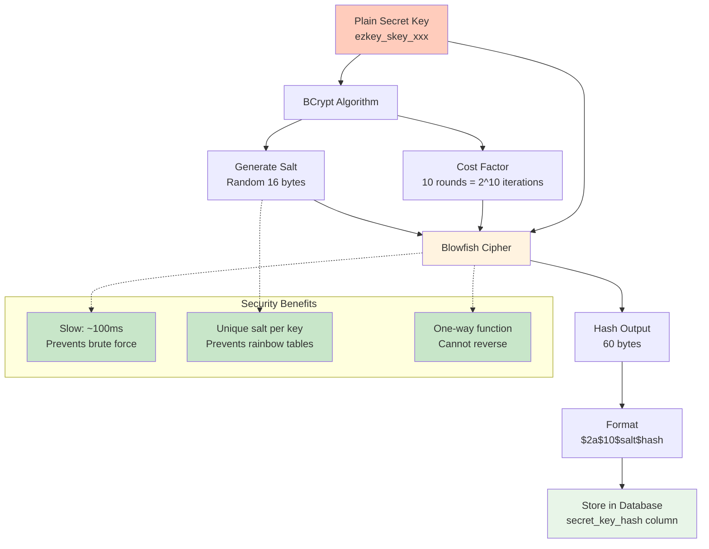
```mermaid
graph TD
    A[Plain Secret Key<br/>ezkey_skey_xxx] --> B[BCrypt Algorithm]
    
    B --> C[Generate Salt<br/>Random 16 bytes]
    B --> D[Cost Factor<br/>10 rounds = 2^10 iterations]
    
    C --> E[Blowfish Cipher]
    D --> E
    A --> E
    
    E --> F[Hash Output<br/>60 bytes]
    
    F --> G[Format<br/>$2a$10$salt$hash]
    
    G --> H[Store in Database<br/>secret_key_hash column]
    
    subgraph "Security Benefits"
        I[Slow: ~100ms<br/>Prevents brute force]
        J[Unique salt per key<br/>Prevents rainbow tables]
        K[One-way function<br/>Cannot reverse]
    end
    
    E -.-> I
    C -.-> J
    E -.-> K
    
    style A fill:#ffccbc
    style E fill:#fff3e0
    style H fill:#e8f5e8
    style I fill:#c8e6c9
    style J fill:#c8e6c9
    style K fill:#c8e6c9
```

---

## Validation Process

### IP Whitelist Validation

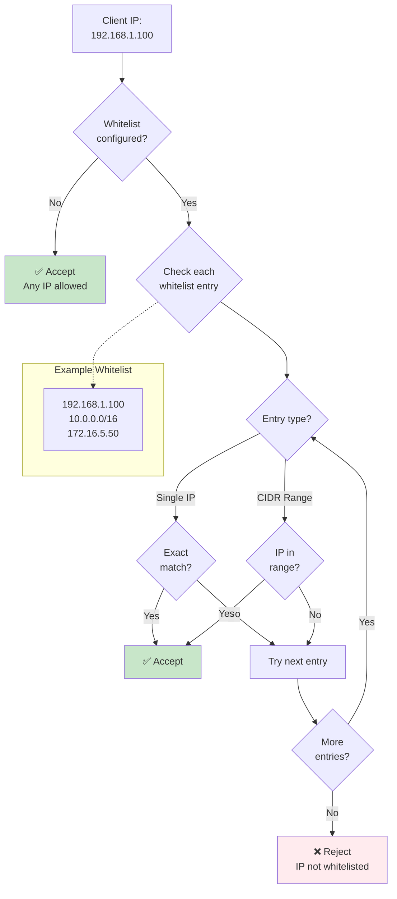
```mermaid
graph TD
    A[Client IP:<br/>192.168.1.100] --> B{Whitelist<br/>configured?}
    
    B -->|No| C[✅ Accept<br/>Any IP allowed]
    B -->|Yes| D{Check each<br/>whitelist entry}
    
    D --> E{Entry type?}
    
    E -->|Single IP| F{Exact<br/>match?}
    E -->|CIDR Range| G{IP in<br/>range?}
    
    F -->|Yes| H[✅ Accept]
    F -->|No| I[Try next entry]
    
    G -->|Yes| H
    G -->|No| I
    
    I --> J{More<br/>entries?}
    J -->|Yes| E
    J -->|No| K[❌ Reject<br/>IP not whitelisted]
    
    subgraph "Example Whitelist"
        L[192.168.1.100<br/>10.0.0.0/16<br/>172.16.5.50]
    end
    
    D -.-> L
    
    style C fill:#c8e6c9
    style H fill:#c8e6c9
    style K fill:#ffebee
```

### CIDR Range Matching

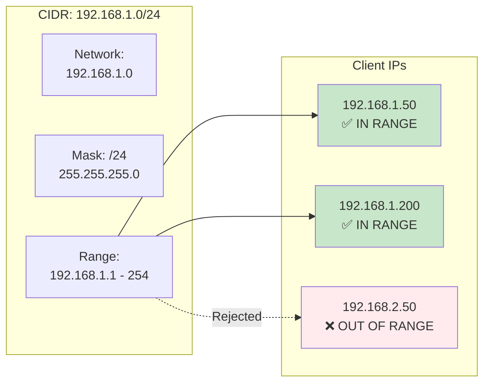
```mermaid
graph LR
    subgraph "CIDR: 192.168.1.0/24"
        A[Network:<br/>192.168.1.0]
        B[Mask: /24<br/>255.255.255.0]
        C[Range:<br/>192.168.1.1 - 254]
    end
    
    subgraph "Client IPs"
        D[192.168.1.50<br/>✅ IN RANGE]
        E[192.168.1.200<br/>✅ IN RANGE]
        F[192.168.2.50<br/>❌ OUT OF RANGE]
    end
    
    C --> D
    C --> E
    C -.->|Rejected| F
    
    style D fill:#c8e6c9
    style E fill:#c8e6c9
    style F fill:#ffebee
```

---

## Comparison with Bearer Tokens

### Authentication Methods

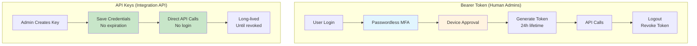
```mermaid
graph TB
    subgraph "Bearer Token (Human Admins)"
        A1[User Login] --> A2[Passwordless MFA]
        A2 --> A3[Device Approval]
        A3 --> A4[Generate Token<br/>24h lifetime]
        A4 --> A5[API Calls]
        A5 --> A6[Logout<br/>Revoke Token]
    end
    
    subgraph "API Keys (Integration API)"
        B1[Admin Creates Key] --> B2[Save Credentials<br/>No expiration]
        B2 --> B3[Direct API Calls<br/>No login]
        B3 --> B4[Long-lived<br/>Until revoked]
    end
    
    style A2 fill:#e1f5fe
    style A3 fill:#fff3e0
    style B2 fill:#c8e6c9
    style B3 fill:#c8e6c9
```

### Feature Comparison

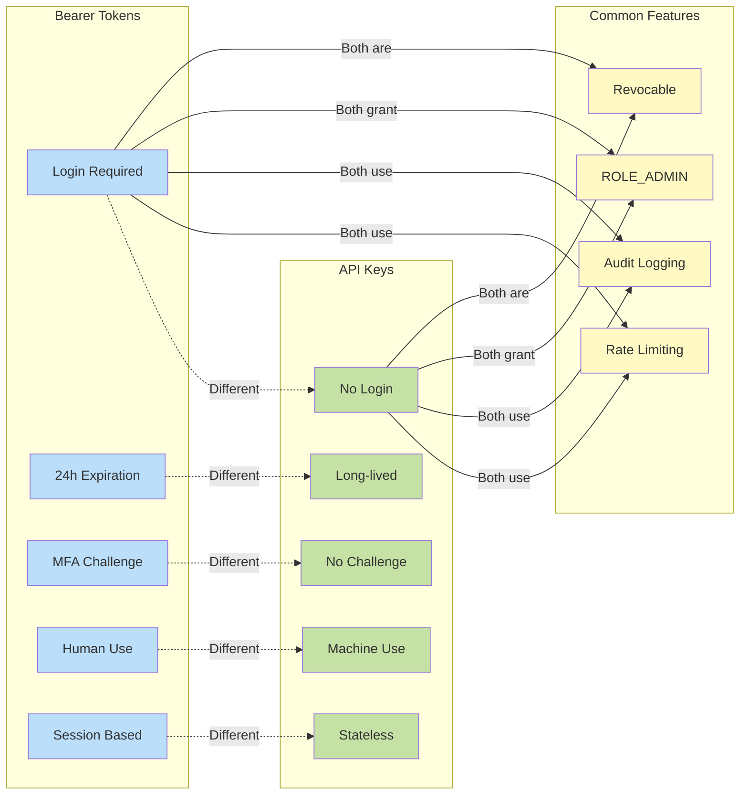
```mermaid
graph LR
    subgraph "Bearer Tokens"
        A1[Login Required]
        A2[24h Expiration]
        A3[MFA Challenge]
        A4[Human Use]
        A5[Session Based]
    end
    
    subgraph "API Keys"
        B1[No Login]
        B2[Long-lived]
        B3[No Challenge]
        B4[Machine Use]
        B5[Stateless]
    end
    
    subgraph "Common Features"
        C1[Rate Limiting]
        C2[Audit Logging]
        C3[ROLE_ADMIN]
        C4[Revocable]
    end
    
    A1 -.->|Different| B1
    A2 -.->|Different| B2
    A3 -.->|Different| B3
    A4 -.->|Different| B4
    A5 -.->|Different| B5
    
    A1 -->|Both use| C1
    A1 -->|Both use| C2
    A1 -->|Both grant| C3
    A1 -->|Both are| C4
    
    B1 -->|Both use| C1
    B1 -->|Both use| C2
    B1 -->|Both grant| C3
    B1 -->|Both are| C4
    
    style A1 fill:#bbdefb
    style A2 fill:#bbdefb
    style A3 fill:#bbdefb
    style A4 fill:#bbdefb
    style A5 fill:#bbdefb
    style B1 fill:#c5e1a5
    style B2 fill:#c5e1a5
    style B3 fill:#c5e1a5
    style B4 fill:#c5e1a5
    style B5 fill:#c5e1a5
    style C1 fill:#fff9c4
    style C2 fill:#fff9c4
    style C3 fill:#fff9c4
    style C4 fill:#fff9c4
```

---

## Database Schema

### Entity Relationship

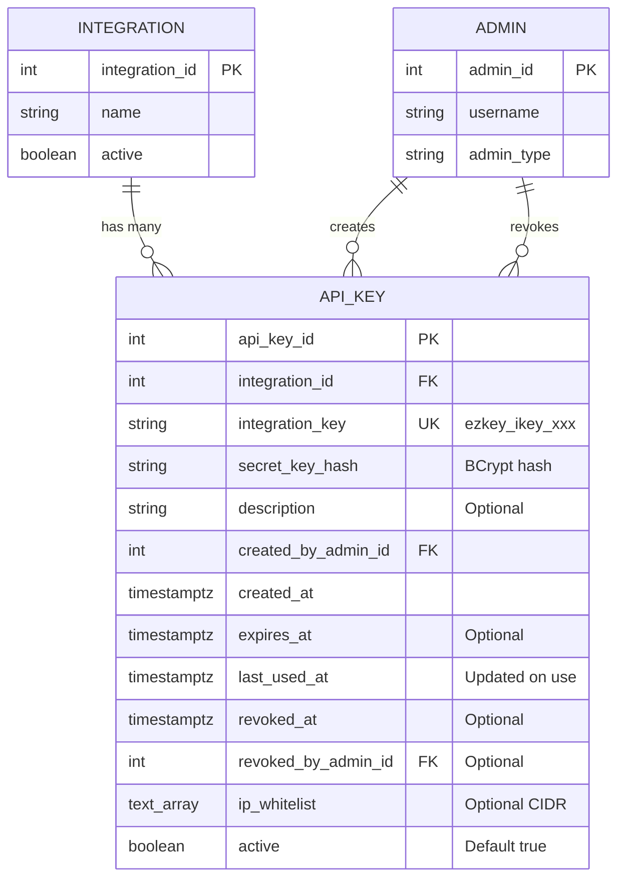
```mermaid
erDiagram
    INTEGRATION ||--o{ API_KEY : "has many"
    ADMIN ||--o{ API_KEY : "creates"
    ADMIN ||--o{ API_KEY : "revokes"
    
    API_KEY {
        int api_key_id PK
        int integration_id FK
        string integration_key UK "ezkey_ikey_xxx"
        string secret_key_hash "BCrypt hash"
        string description "Optional"
        int created_by_admin_id FK
        timestamptz created_at
        timestamptz expires_at "Optional"
        timestamptz last_used_at "Updated on use"
        timestamptz revoked_at "Optional"
        int revoked_by_admin_id FK "Optional"
        text_array ip_whitelist "Optional CIDR"
        boolean active "Default true"
    }
    
    INTEGRATION {
        int integration_id PK
        string name
        boolean active
    }
    
    ADMIN {
        int admin_id PK
        string username
        string admin_type
    }
```

### Indexes for Performance

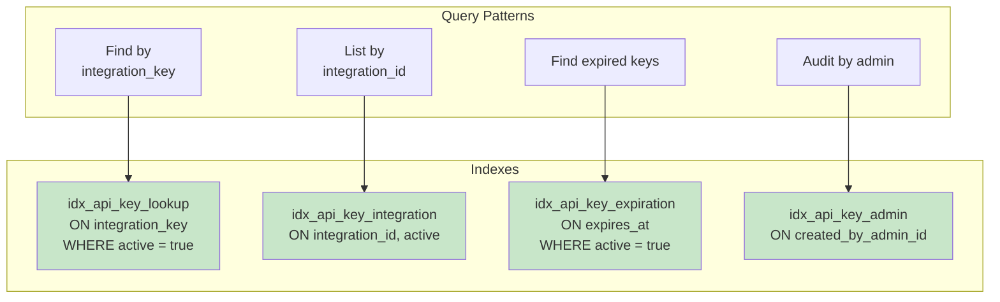
```mermaid
graph TD
    subgraph "Query Patterns"
        A[Find by<br/>integration_key]
        B[List by<br/>integration_id]
        C[Find expired keys]
        D[Audit by admin]
    end
    
    subgraph "Indexes"
        E[idx_api_key_lookup<br/>ON integration_key<br/>WHERE active = true]
        F[idx_api_key_integration<br/>ON integration_id, active]
        G[idx_api_key_expiration<br/>ON expires_at<br/>WHERE active = true]
        H[idx_api_key_admin<br/>ON created_by_admin_id]
    end
    
    A --> E
    B --> F
    C --> G
    D --> H
    
    style E fill:#c8e6c9
    style F fill:#c8e6c9
    style G fill:#c8e6c9
    style H fill:#c8e6c9
```

---

## Integration Example

### Java Application Integration

```mermaid
sequenceDiagram
    participant Config as Configuration
    participant App as Application Code
    participant Ezkey as Ezkey Admin API
    participant User as End User
    
    Note over Config,User: Setup Phase (Once)
    Config->>Config: Load API Keys<br/>from environment
    
    Note over Config,User: Runtime: Create Auth Attempt
    User->>App: Login to application
    App->>App: User provides enrollmentId
    
    App->>Ezkey: POST /auth-attempts<br/>Basic Auth: ikey:skey
    Note over App,Ezkey: Authorization: Basic<br/>base64(ezkey_ikey_xxx:ezkey_skey_xxx)
    
    Ezkey->>Ezkey: Validate API key
    Ezkey->>Ezkey: Create auth attempt
    Ezkey-->>App: 201 Created<br/>{authAttemptId: 789}
    
    Note over Config,User: Wait for User Response
    App->>Ezkey: GET /auth-attempts/789/wait<br/>Basic Auth: ikey:skey
    
    Note over Ezkey: Poll every 2s<br/>Max 30s timeout
    
    Ezkey->>Ezkey: Check attempt status
    Ezkey->>Ezkey: User approves on mobile
    
    Ezkey-->>App: 200 OK<br/>{status: "ACCEPTED"}
    
    App-->>User: ✅ Login successful
```

---

## Security Considerations

### Threat Model

```mermaid
graph TB
    subgraph "Threats"
        T1[Key Theft]
        T2[Brute Force]
        T3[Replay Attack]
        T4[IP Spoofing]
        T5[DoS Attack]
    end
    
    subgraph "Mitigations"
        M1[Secure Storage<br/>Environment vars]
        M2[BCrypt Slow Hash<br/>~100ms per attempt]
        M3[Stateless Auth<br/>No session to replay]
        M4[IP Whitelist<br/>CIDR validation]
        M5[Rate Limiting<br/>1000/hour per key]
    end
    
    subgraph "Detection"
        D1[Audit Logging]
        D2[lastUsedAt Tracking]
        D3[Failed Auth Alerts]
    end
    
    T1 -->|Prevented by| M1
    T2 -->|Prevented by| M2
    T3 -->|Prevented by| M3
    T4 -->|Prevented by| M4
    T5 -->|Prevented by| M5
    
    T1 -.->|Detected by| D1
    T1 -.->|Detected by| D2
    T2 -.->|Detected by| D3
    
    style M1 fill:#c8e6c9
    style M2 fill:#c8e6c9
    style M3 fill:#c8e6c9
    style M4 fill:#c8e6c9
    style M5 fill:#c8e6c9
```

### Attack Surface

```mermaid
graph TD
    A[Attacker] --> B{Attack Vector?}
    
    B -->|Stolen Keys| C[Mitigation:<br/>IP Whitelist]
    B -->|Brute Force| D[Mitigation:<br/>BCrypt + Rate Limit]
    B -->|Network Sniff| E[Mitigation:<br/>HTTPS Required]
    B -->|Insider Threat| F[Mitigation:<br/>Audit Logging]
    
    C --> G{IP Matches<br/>Whitelist?}
    G -->|No| H[❌ 403 Forbidden]
    G -->|Yes| I[⚠️ Compromised<br/>Revoke key]
    
    D --> J{Rate Limit<br/>Exceeded?}
    J -->|Yes| K[❌ 429 Too Many<br/>Requests]
    J -->|No| L[BCrypt Slow<br/>~10 attempts/sec max]
    
    E --> M[TLS Encryption<br/>Keys in headers]
    
    F --> N[Complete Audit Trail<br/>Who, When, What, IP]
    
    style H fill:#ffebee
    style K fill:#ffebee
    style I fill:#fff3e0
    style M fill:#c8e6c9
    style N fill:#c8e6c9
```

---

## Best Practices Workflow

### Recommended Implementation

```mermaid
graph TD
    A[Start] --> B[Create Integration]
    B --> C[Admin Creates API Key<br/>with IP whitelist + expiration]
    
    C --> D[Save Keys Securely<br/>Secret Manager]
    
    D --> E[Configure Application<br/>Environment Variables]
    
    E --> F[Test in Staging<br/>Verify authentication works]
    
    F --> G{Tests Pass?}
    G -->|No| H[Check Logs<br/>Debug Issues]
    H --> F
    
    G -->|Yes| I[Deploy to Production]
    
    I --> J[Monitor Usage<br/>lastUsedAt, audit logs]
    
    J --> K{90 days<br/>elapsed?}
    K -->|No| J
    K -->|Yes| L[Rotate Key<br/>Zero-downtime process]
    
    L --> M[Create New Key]
    M --> N[Deploy New Config]
    N --> O[Monitor Both Keys]
    O --> P[Revoke Old Key]
    P --> J
    
    style C fill:#e1f5fe
    style D fill:#fff3e0
    style I fill:#c8e6c9
    style L fill:#ffccbc
```

---

## Error Handling

### Error Response Flow

```mermaid
graph TD
    A[API Request] --> B{Authentication<br/>Result?}
    
    B -->|Invalid Key| C[401 Unauthorized<br/>No error details]
    B -->|Invalid Secret| C
    B -->|Expired| C
    
    B -->|IP Blocked| D[403 Forbidden<br/>IP not whitelisted]
    
    B -->|Rate Limited| E[429 Too Many Requests<br/>Retry-After: 3600]
    
    B -->|Success| F{Authorization<br/>Check?}
    
    F -->|Forbidden| G[403 Forbidden<br/>Insufficient permissions]
    F -->|Allowed| H[Process Request]
    
    H --> I{Business<br/>Logic Result?}
    
    I -->|Success| J[200/201/204<br/>Success response]
    I -->|Not Found| K[404 Not Found]
    I -->|Validation Error| L[400 Bad Request]
    I -->|Conflict| M[409 Conflict]
    
    style C fill:#ffebee
    style D fill:#ffebee
    style E fill:#fff3e0
    style G fill:#ffebee
    style J fill:#c8e6c9
```

---

## Monitoring and Observability

### Key Metrics

```mermaid
graph LR
    subgraph "Usage Metrics"
        A[Total Active Keys]
        B[Auth Success Rate]
        C[Auth Failure Rate]
        D[Avg Response Time]
    end
    
    subgraph "Security Metrics"
        E[Failed Attempts/Hour]
        F[IP Blocks/Day]
        G[Keys Expiring Soon]
        H[Unused Keys]
    end
    
    subgraph "Operational Metrics"
        I[lastUsedAt Age]
        J[Keys per Integration]
        K[Rotation Frequency]
        L[Cleanup Rate]
    end
    
    subgraph "Alerting"
        M[⚠️ High Failure Rate]
        N[⚠️ Expiring Keys]
        O[⚠️ Unused Keys > 30d]
        P[⚠️ Max Keys Reached]
    end
    
    C --> M
    G --> N
    H --> O
    J --> P
    
    style M fill:#ffccbc
    style N fill:#fff3e0
    style O fill:#fff3e0
    style P fill:#fff3e0
```

---

## Summary

### Key Points

1. **Dual Key System**: Public integration key + private secret key (Duo-style)
2. **HTTP Basic Auth**: Standard authentication method, widely supported
3. **BCrypt Security**: Secret keys hashed with 10 rounds, ~100ms validation
4. **IP Whitelisting**: Optional CIDR support for production security
5. **Zero-Downtime Rotation**: Up to 5 active keys per integration
6. **Comprehensive Audit**: All operations logged with full context

### Architecture Principles

- **Defense in Depth**: Multiple security layers (rate limiting, BCrypt, IP whitelist, expiration)
- **Fail Secure**: All validation failures return generic 401/403
- **Performance**: Indexed queries, BCrypt intentionally slow
- **Observability**: Complete audit trail, usage tracking
- **Simplicity**: Standard HTTP Basic Auth, familiar to developers

---

**Document Version:** 1.0  
**Last Updated:** October 17, 2025  
**Maintained By:** Ezkey Contributors

---

*This document provides a visual explanation of the API Keys authentication system architecture and implementation in Ezkey.*

