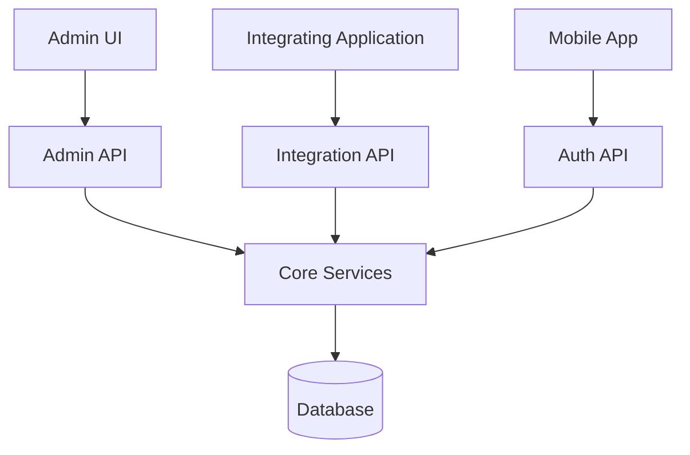

# Ezkey Architecture

## Purpose

This document gives a high-level view of how Ezkey is organized and where trust is placed in the system.

Ezkey is a backend-first cryptographic MFA platform. Its architecture should be understood as a distinct server-to-mobile trust model rather than as a browser-centric authentication stack.

## Architectural View

Ezkey is organized around a small set of explicit responsibilities:

- a web-based admin UI for human administration,
- a backend that owns durable state and verification,
- a mobile client that holds device credentials and participates in signed flows,
- integrating applications that create and consume authentication decisions through APIs.

At a high level:

## Main Components

### `ezkey-admin-ui`

Primary web surface for human administration. It supports both Global Admin and Tenant Admin workflows while delegating trust, authorization, and state transitions to the backend.

### `ezkey-core`

Shared business logic, persistence, and security-sensitive state handling.

### `ezkey-admin-api`

Administrative surface for integrations, enrollments, authentication management, and operator workflows.

### `ezkey-auth-api`

Mobile-facing surface for enrollment and authentication actions performed by the device.

### `ezkey-integration-api`

Machine-to-machine surface for integrated backends that need auth attempt lifecycle operations through API credentials.

### `ezkey-migration`

Database migration component used to manage schema evolution.

### `ezkey_mobile`

Mobile application that binds to enrollments, receives pending requests, and submits signed responses.

## Trust Model

Ezkey's architecture is built around explicit trust boundaries.

- The backend is authoritative for verification and state transitions.
- The mobile device is trusted to hold device credentials and produce cryptographic proofs.
- Integrating applications interact with Ezkey through explicit API calls rather than hidden browser flows.
- The Admin UI is the primary operator surface for both platform-wide and tenant-scoped administration.
- The UI is an integration surface, not the root of trust.

## Cryptographic Architecture

Ezkey's security model is based on cryptographic continuity across lifecycle steps.

- During enrollment, `bind` and `verify` are cryptographically linked.
- During authentication, `pending` and `respond` are cryptographically linked.
- One-time proof material and signatures protect against replay and tampering.
- Backend verification remains central even when secure device storage is used on mobile.

For implementation-level cryptographic details, use [`CRYPTO.md`](CRYPTO.md).

## Data and State

The database is not a passive storage layer. It is part of the security model because it preserves:

- enrollment state,
- authentication attempt state,
- proof-token lifecycle,
- administrative and operational records.

This backend ownership of state is one of the reasons Ezkey remains understandable and operable for backend teams.

## Design Principles

- **Backend-first integrity**: verification and durable state belong on the server side.
- **Explicit trust boundaries**: each component has a clear role.
- **Pragmatic API separation**: the system exposes different surfaces for operators, mobile devices, and integrations.
- **Operational clarity**: the architecture should stay understandable to the teams deploying and integrating it.

## Related Documentation

- [`../README.md`](../README.md) - Short project overview and quick start.
- [`../PRD.md`](../PRD.md) - Product requirements and product framing.
- [`PROJECT_POSITIONING.md`](PROJECT_POSITIONING.md) - Strategic positioning and project philosophy.
- [`ENDPOINT.md`](ENDPOINT.md) - API reference.
- [`CRYPTO.md`](CRYPTO.md) - Cryptographic implementation details.
- [`DEVELOPMENT.md`](DEVELOPMENT.md) - Development workflow.
