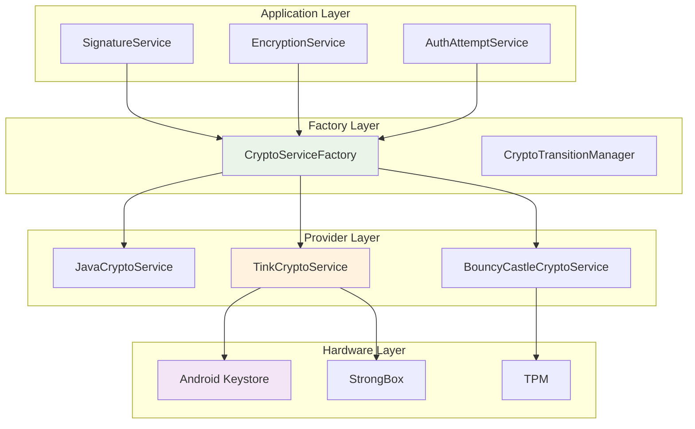

# Ezkey Crypto Factory Pattern Architecture

## Executive Summary

This document outlines the implementation of a flexible cryptographic architecture for Ezkey using the Factory Pattern, enabling smooth transitions between different crypto providers (Java Crypto, Google Tink, Bouncy Castle) while maintaining backward compatibility and improving mobile keystore integration.

**Status**: Implementation Plan  
**Date**: October 2025  
**Author**: Ezkey Security Team  
**Classification**: Internal - Technical Architecture

---

## Table of Contents

1. [Context and Motivation](#1-context-and-motivation)
2. [Architecture Overview](#2-architecture-overview)
3. [Factory Pattern Implementation](#3-factory-pattern-implementation)
4. [Crypto Provider Implementations](#4-crypto-provider-implementations)
5. [Transition Strategies](#5-transition-strategies)
6. [Hardware Security Integration](#6-hardware-security-integration)
7. [Configuration Management](#7-configuration-management)
8. [Implementation Plan](#8-implementation-plan)
9. [Benefits and Trade-offs](#9-benefits-and-trade-offs)

---

## 1. Context and Motivation

### 1.1 Current State

Ezkey currently uses Java's built-in cryptographic libraries for:
- Digital signature generation and validation
- Key pair generation
- Proof token security
- Authentication flow integrity

### 1.2 Challenges

1. **Limited Hardware Integration**: Current implementation doesn't leverage mobile hardware security modules
2. **Vendor Lock-in**: Tightly coupled to Java crypto APIs
3. **Migration Complexity**: Difficult to switch to more advanced crypto libraries
4. **Security Evolution**: Need to adapt to new cryptographic standards and best practices

### 1.3 Objectives

1. **Flexibility**: Support multiple crypto providers with easy switching
2. **Hardware Security**: Integrate with mobile hardware security modules (Android Keystore, StrongBox)
3. **Smooth Transition**: Enable gradual migration between crypto providers
4. **Future-Proof**: Easy adoption of new cryptographic standards
5. **Backward Compatibility**: Maintain existing functionality during transitions

---

## 2. Architecture Overview

### 2.1 High-Level Design



### 2.2 Key Principles

1. **Interface Segregation**: Single interface for all crypto operations
2. **Dependency Inversion**: High-level modules don't depend on low-level implementations
3. **Open/Closed Principle**: Open for extension, closed for modification
4. **Strategy Pattern**: Runtime selection of crypto algorithms
5. **Factory Pattern**: Centralized creation of crypto services

---

## 3. Factory Pattern Implementation

### 3.1 Core Interface

```java
/**
 * Abstract crypto service interface for Ezkey.
 * 
 * <p>This interface allows switching between different cryptographic implementations
 * (current Java crypto, Tink, Bouncy Castle, etc.) without changing business logic.
 * 
 * @since 2025
 */
public interface CryptoService {
    
    /**
     * Generate a digital signature for the provided data.
     * 
     * @param data the data to be signed
     * @param base64PrivateKey the Base64-encoded private key
     * @return Base64-encoded digital signature
     * @throws Exception if signature generation fails
     */
    String generateSignature(String data, String base64PrivateKey) throws Exception;
    
    /**
     * Validate a digital signature.
     * 
     * @param data the original data
     * @param signature the Base64-encoded signature
     * @param base64PublicKey the Base64-encoded public key
     * @return true if signature is valid, false otherwise
     * @throws Exception if validation fails
     */
    boolean validateSignature(String data, String signature, String base64PublicKey) throws Exception;
    
    /**
     * Generate a new key pair.
     * 
     * @return generated key pair
     * @throws Exception if key generation fails
     */
    KeyPair generateKeyPair() throws Exception;
    
    /**
     * Format private key to Base64.
     * 
     * @param privateKey the private key
     * @return Base64-encoded private key
     * @throws Exception if formatting fails
     */
    String formatPrivateKey(PrivateKey privateKey) throws Exception;
    
    /**
     * Format public key to Base64.
     * 
     * @param publicKey the public key
     * @return Base64-encoded public key
     * @throws Exception if formatting fails
     */
    String formatPublicKey(PublicKey publicKey) throws Exception;
    
    /**
     * Get the crypto provider name.
     * 
     * @return provider name
     */
    String getProviderName();
    
    /**
     * Get the algorithm used.
     * 
     * @return algorithm name
     */
    String getAlgorithm();
    
    /**
     * Get the key size in bits.
     * 
     * @return key size
     */
    int getKeySize();
    
    /**
     * Check if hardware security is supported.
     * 
     * @return true if hardware security is available
     */
    boolean supportsHardwareSecurity();
}
```

### 3.2 Factory Implementation

```java
/**
 * Factory for creating crypto service instances.
 * 
 * <p>Supports multiple crypto providers with smooth transition capabilities.
 * 
 * @since 2025
 */
@Component
public class CryptoServiceFactory {
    
    private final EzkeyCoreProperties properties;
    private final Map<String, CryptoService> cryptoServices;
    private final Logger logger = LoggerFactory.getLogger(CryptoServiceFactory.class);
    
    public CryptoServiceFactory(EzkeyCoreProperties properties) {
        this.properties = properties;
        this.cryptoServices = initializeCryptoServices();
    }
    
    /**
     * Get the configured crypto service.
     * 
     * @return configured crypto service
     */
    public CryptoService getCryptoService() {
        String provider = properties.getCryptoProvider();
        CryptoService service = cryptoServices.get(provider);
        
        if (service == null) {
            logger.warn("Crypto provider '{}' not found, falling back to 'java'", provider);
            service = cryptoServices.get("java");
        }
        
        logger.debug("Using crypto provider: {}", service.getProviderName());
        return service;
    }
    
    /**
     * Get a specific crypto service by name.
     * 
     * @param providerName the provider name
     * @return crypto service instance
     * @throws IllegalArgumentException if provider not found
     */
    public CryptoService getCryptoService(String providerName) {
        CryptoService service = cryptoServices.get(providerName);
        if (service == null) {
            throw new IllegalArgumentException("Crypto provider not found: " + providerName);
        }
        return service;
    }
    
    /**
     * Get all available crypto providers.
     * 
     * @return set of available provider names
     */
    public Set<String> getAvailableProviders() {
        return cryptoServices.keySet();
    }
    
    /**
     * Check if a provider is available.
     * 
     * @param providerName the provider name
     * @return true if available
     */
    public boolean isProviderAvailable(String providerName) {
        return cryptoServices.containsKey(providerName);
    }
    
    private Map<String, CryptoService> initializeCryptoServices() {
        Map<String, CryptoService> services = new HashMap<>();
        
        // Always include Java crypto (fallback)
        services.put("java", new JavaCryptoService(properties));
        
        // Add Tink if available
        if (isTinkAvailable()) {
            try {
                services.put("tink", new TinkCryptoService(properties));
                logger.info("Tink crypto provider initialized");
            } catch (Exception e) {
                logger.warn("Failed to initialize Tink provider: {}", e.getMessage());
            }
        }
        
        // Add Bouncy Castle if available
        if (isBouncyCastleAvailable()) {
            try {
                services.put("bouncycastle", new BouncyCastleCryptoService(properties));
                logger.info("Bouncy Castle crypto provider initialized");
            } catch (Exception e) {
                logger.warn("Failed to initialize Bouncy Castle provider: {}", e.getMessage());
            }
        }
        
        logger.info("Initialized {} crypto providers: {}", services.size(), services.keySet());
        return services;
    }
    
    private boolean isTinkAvailable() {
        try {
            Class.forName("com.google.crypto.tink.PublicKeySign");
            return true;
        } catch (ClassNotFoundException e) {
            return false;
        }
    }
    
    private boolean isBouncyCastleAvailable() {
        try {
            Class.forName("org.bouncycastle.crypto.AsymmetricCipherKeyPairGenerator");
            return true;
        } catch (ClassNotFoundException e) {
            return false;
        }
    }
}
```

### 3.3 Transition Manager

```java
/**
 * Manages gradual transition between crypto providers.
 * 
 * <p>Supports A/B testing and gradual rollout of new crypto providers.
 * 
 * @since 2025
 */
@Component
public class CryptoTransitionManager {
    
    private final CryptoServiceFactory cryptoServiceFactory;
    private final EzkeyCoreProperties properties;
    private final Random random = new Random();
    private final Logger logger = LoggerFactory.getLogger(CryptoTransitionManager.class);
    
    public CryptoTransitionManager(CryptoServiceFactory cryptoServiceFactory, EzkeyCoreProperties properties) {
        this.cryptoServiceFactory = cryptoServiceFactory;
        this.properties = properties;
    }
    
    /**
     * Get crypto service for current request based on transition configuration.
     * 
     * @return appropriate crypto service
     */
    public CryptoService getCryptoServiceForRequest() {
        CryptoTransitionConfig transition = properties.getCryptoTransition();
        
        if (!transition.isEnabled()) {
            return cryptoServiceFactory.getCryptoService();
        }
        
        // Random percentage-based transition
        int randomPercentage = random.nextInt(100);
        
        if (randomPercentage < transition.getTransitionPercentage()) {
            logger.debug("Using new crypto provider: {} ({}%)", 
                transition.getToProvider(), transition.getTransitionPercentage());
            return cryptoServiceFactory.getCryptoService(transition.getToProvider());
        } else {
            logger.debug("Using old crypto provider: {} ({}%)", 
                transition.getFromProvider(), 100 - transition.getTransitionPercentage());
            return cryptoServiceFactory.getCryptoService(transition.getFromProvider());
        }
    }
    
    /**
     * Get crypto service for specific operation type.
     * 
     * @param operationType the operation type
     * @return appropriate crypto service
     */
    public CryptoService getCryptoServiceForOperation(String operationType) {
        // Different providers for different operations
        switch (operationType.toLowerCase()) {
            case "encryption":
                return cryptoServiceFactory.getCryptoService("tink");
            case "signature":
                return getCryptoServiceForRequest();
            case "key_generation":
                return cryptoServiceFactory.getCryptoService("tink");
            default:
                return getCryptoServiceForRequest();
        }
    }
}
```

---

## 4. Crypto Provider Implementations

### 4.1 Java Crypto Service (Current Implementation)

```java
/**
 * Current Java crypto implementation.
 * 
 * <p>This is the existing implementation that will be maintained
 * for backward compatibility during transition.
 * 
 * @since 2025
 */
@Service("javaCryptoService")
public class JavaCryptoService implements CryptoService {
    
    private static final String ALGORITHM = "SHA256withRSA";
    private static final String PROVIDER = "Java Crypto";
    private static final int KEY_SIZE = 2048;
    
    private final EzkeyCoreProperties properties;
    private final Logger logger = LoggerFactory.getLogger(JavaCryptoService.class);
    
    public JavaCryptoService(EzkeyCoreProperties properties) {
        this.properties = properties;
    }
    
    @Override
    public String generateSignature(String data, String base64PrivateKey) throws Exception {
        logger.debug("Generating signature with Java crypto");
        
        PrivateKey privateKey = parsePrivateKey(base64PrivateKey);
        Signature signature = Signature.getInstance(ALGORITHM);
        signature.initSign(privateKey);
        signature.update(data.getBytes(StandardCharsets.UTF_8));
        byte[] signatureBytes = signature.sign();
        
        return Base64.getEncoder().encodeToString(signatureBytes);
    }
    
    @Override
    public boolean validateSignature(String data, String signature, String base64PublicKey) throws Exception {
        logger.debug("Validating signature with Java crypto");
        
        PublicKey publicKey = parsePublicKey(base64PublicKey);
        Signature sig = Signature.getInstance(ALGORITHM);
        sig.initVerify(publicKey);
        sig.update(data.getBytes(StandardCharsets.UTF_8));
        
        return sig.verify(Base64.getDecoder().decode(signature));
    }
    
    @Override
    public KeyPair generateKeyPair() throws Exception {
        logger.debug("Generating key pair with Java crypto");
        
        KeyPairGenerator keyGen = KeyPairGenerator.getInstance("RSA");
        keyGen.initialize(KEY_SIZE);
        return keyGen.generateKeyPair();
    }
    
    @Override
    public String formatPrivateKey(PrivateKey privateKey) throws Exception {
        return Base64.getEncoder().encodeToString(privateKey.getEncoded());
    }
    
    @Override
    public String formatPublicKey(PublicKey publicKey) throws Exception {
        return Base64.getEncoder().encodeToString(publicKey.getEncoded());
    }
    
    @Override
    public String getProviderName() {
        return PROVIDER;
    }
    
    @Override
    public String getAlgorithm() {
        return ALGORITHM;
    }
    
    @Override
    public int getKeySize() {
        return KEY_SIZE;
    }
    
    @Override
    public boolean supportsHardwareSecurity() {
        return false; // Java crypto doesn't support hardware security
    }
    
    private PrivateKey parsePrivateKey(String base64PrivateKey) throws Exception {
        byte[] keyBytes = Base64.getDecoder().decode(base64PrivateKey);
        PKCS8EncodedKeySpec keySpec = new PKCS8EncodedKeySpec(keyBytes);
        KeyFactory keyFactory = KeyFactory.getInstance("RSA");
        return keyFactory.generatePrivate(keySpec);
    }
    
    private PublicKey parsePublicKey(String base64PublicKey) throws Exception {
        byte[] keyBytes = Base64.getDecoder().decode(base64PublicKey);
        X509EncodedKeySpec keySpec = new X509EncodedKeySpec(keyBytes);
        KeyFactory keyFactory = KeyFactory.getInstance("RSA");
        return keyFactory.generatePublic(keySpec);
    }
}
```

### 4.2 Tink Crypto Service

```java
/**
 * Tink-based crypto implementation.
 * 
 * <p>Provides enhanced security and hardware integration capabilities.
 * 
 * @since 2025
 */
@Service("tinkCryptoService")
public class TinkCryptoService implements CryptoService {
    
    private static final String ALGORITHM = "ECDSA_P256";
    private static final String PROVIDER = "Google Tink";
    private static final int KEY_SIZE = 256;
    
    private final TinkKeyManager keyManager;
    private final Logger logger = LoggerFactory.getLogger(TinkCryptoService.class);
    
    public TinkCryptoService(EzkeyCoreProperties properties) throws Exception {
        this.keyManager = new TinkKeyManager(properties);
    }
    
    @Override
    public String generateSignature(String data, String base64PrivateKey) throws Exception {
        logger.debug("Generating signature with Tink");
        
        KeysetHandle keysetHandle = createKeysetFromPrivateKey(base64PrivateKey);
        PublicKeySign signer = keysetHandle.getPrimitive(PublicKeySign.class);
        
        byte[] signature = signer.sign(data.getBytes(StandardCharsets.UTF_8));
        return Base64.getEncoder().encodeToString(signature);
    }
    
    @Override
    public boolean validateSignature(String data, String signature, String base64PublicKey) throws Exception {
        logger.debug("Validating signature with Tink");
        
        KeysetHandle keysetHandle = createKeysetFromPublicKey(base64PublicKey);
        PublicKeyVerify verifier = keysetHandle.getPrimitive(PublicKeyVerify.class);
        
        try {
            verifier.verify(Base64.getDecoder().decode(signature), data.getBytes(StandardCharsets.UTF_8));
            return true;
        } catch (GeneralSecurityException e) {
            logger.debug("Signature validation failed: {}", e.getMessage());
            return false;
        }
    }
    
    @Override
    public KeyPair generateKeyPair() throws Exception {
        logger.debug("Generating key pair with Tink");
        
        KeysetHandle keysetHandle = KeysetHandle.generateNew(KeyTemplates.ECDSA_P256);
        return extractKeyPairFromKeyset(keysetHandle);
    }
    
    @Override
    public String formatPrivateKey(PrivateKey privateKey) throws Exception {
        // Convert to Tink format
        KeysetHandle keysetHandle = createKeysetFromPrivateKey(privateKey);
        return keysetHandle.getKeysetInfo().getPrimaryKeyId().toString();
    }
    
    @Override
    public String formatPublicKey(PublicKey publicKey) throws Exception {
        // Convert to Tink format
        KeysetHandle keysetHandle = createKeysetFromPublicKey(publicKey);
        return keysetHandle.getKeysetInfo().getPrimaryKeyId().toString();
    }
    
    @Override
    public String getProviderName() {
        return PROVIDER;
    }
    
    @Override
    public String getAlgorithm() {
        return ALGORITHM;
    }
    
    @Override
    public int getKeySize() {
        return KEY_SIZE;
    }
    
    @Override
    public boolean supportsHardwareSecurity() {
        return true; // Tink supports hardware security modules
    }
    
    private KeysetHandle createKeysetFromPrivateKey(String base64PrivateKey) throws Exception {
        // Implementation for creating Tink keyset from private key
        // This would involve converting the private key to Tink format
        throw new UnsupportedOperationException("Not implemented yet");
    }
    
    private KeysetHandle createKeysetFromPublicKey(String base64PublicKey) throws Exception {
        // Implementation for creating Tink keyset from public key
        throw new UnsupportedOperationException("Not implemented yet");
    }
    
    private KeyPair extractKeyPairFromKeyset(KeysetHandle keysetHandle) throws Exception {
        // Implementation for extracting key pair from Tink keyset
        throw new UnsupportedOperationException("Not implemented yet");
    }
}
```

### 4.3 Bouncy Castle Crypto Service

```java
/**
 * Bouncy Castle crypto implementation.
 * 
 * <p>Provides additional algorithms and enhanced security features.
 * 
 * @since 2025
 */
@Service("bouncyCastleCryptoService")
public class BouncyCastleCryptoService implements CryptoService {
    
    private static final String ALGORITHM = "SHA256withRSA";
    private static final String PROVIDER = "Bouncy Castle";
    private static final int KEY_SIZE = 4096;
    
    private final EzkeyCoreProperties properties;
    private final Logger logger = LoggerFactory.getLogger(BouncyCastleCryptoService.class);
    
    static {
        // Register Bouncy Castle provider
        if (Security.getProvider("BC") == null) {
            Security.addProvider(new BouncyCastleProvider());
        }
    }
    
    public BouncyCastleCryptoService(EzkeyCoreProperties properties) {
        this.properties = properties;
    }
    
    @Override
    public String generateSignature(String data, String base64PrivateKey) throws Exception {
        logger.debug("Generating signature with Bouncy Castle");
        
        PrivateKey privateKey = parsePrivateKey(base64PrivateKey);
        Signature signature = Signature.getInstance(ALGORITHM, "BC");
        signature.initSign(privateKey);
        signature.update(data.getBytes(StandardCharsets.UTF_8));
        byte[] signatureBytes = signature.sign();
        
        return Base64.getEncoder().encodeToString(signatureBytes);
    }
    
    @Override
    public boolean validateSignature(String data, String signature, String base64PublicKey) throws Exception {
        logger.debug("Validating signature with Bouncy Castle");
        
        PublicKey publicKey = parsePublicKey(base64PublicKey);
        Signature sig = Signature.getInstance(ALGORITHM, "BC");
        sig.initVerify(publicKey);
        sig.update(data.getBytes(StandardCharsets.UTF_8));
        
        return sig.verify(Base64.getDecoder().decode(signature));
    }
    
    @Override
    public KeyPair generateKeyPair() throws Exception {
        logger.debug("Generating key pair with Bouncy Castle");
        
        KeyPairGenerator keyGen = KeyPairGenerator.getInstance("RSA", "BC");
        keyGen.initialize(KEY_SIZE);
        return keyGen.generateKeyPair();
    }
    
    @Override
    public String formatPrivateKey(PrivateKey privateKey) throws Exception {
        return Base64.getEncoder().encodeToString(privateKey.getEncoded());
    }
    
    @Override
    public String formatPublicKey(PublicKey publicKey) throws Exception {
        return Base64.getEncoder().encodeToString(publicKey.getEncoded());
    }
    
    @Override
    public String getProviderName() {
        return PROVIDER;
    }
    
    @Override
    public String getAlgorithm() {
        return ALGORITHM;
    }
    
    @Override
    public int getKeySize() {
        return KEY_SIZE;
    }
    
    @Override
    public boolean supportsHardwareSecurity() {
        return false; // Bouncy Castle doesn't directly support hardware security
    }
    
    private PrivateKey parsePrivateKey(String base64PrivateKey) throws Exception {
        byte[] keyBytes = Base64.getDecoder().decode(base64PrivateKey);
        PKCS8EncodedKeySpec keySpec = new PKCS8EncodedKeySpec(keyBytes);
        KeyFactory keyFactory = KeyFactory.getInstance("RSA", "BC");
        return keyFactory.generatePrivate(keySpec);
    }
    
    private PublicKey parsePublicKey(String base64PublicKey) throws Exception {
        byte[] keyBytes = Base64.getDecoder().decode(base64PublicKey);
        X509EncodedKeySpec keySpec = new X509EncodedKeySpec(keyBytes);
        KeyFactory keyFactory = KeyFactory.getInstance("RSA", "BC");
        return keyFactory.generatePublic(keySpec);
    }
}
```

---

## 5. Transition Strategies

### 5.1 Gradual Transition (Recommended)

```yaml
# Phase 1: 10% of requests to Tink
ezkey:
  core:
    crypto-provider: "java"
    crypto-transition:
      enabled: true
      from-provider: "java"
      to-provider: "tink"
      transition-percentage: 10

# Phase 2: 50% of requests to Tink
ezkey:
  core:
    crypto-provider: "java"
    crypto-transition:
      enabled: true
      from-provider: "java"
      to-provider: "tink"
      transition-percentage: 50

# Phase 3: 100% to Tink
ezkey:
  core:
    crypto-provider: "tink"
    crypto-transition:
      enabled: false
```

### 5.2 Environment-Based Transition

```yaml
# application-dev.yml
ezkey:
  core:
    crypto-provider: "java"  # Keep old in dev

# application-staging.yml
ezkey:
  core:
    crypto-provider: "tink"  # Test Tink in staging

# application-prod.yml
ezkey:
  core:
    crypto-provider: "tink"  # Production with Tink
```

### 5.3 Operation-Based Transition

```java
/**
 * Service specialized for different operations.
 */
@Service
public class SpecializedCryptoService {
    
    private final CryptoServiceFactory cryptoServiceFactory;
    
    public String encryptSensitiveData(String data) {
        // Always use Tink for encryption
        return cryptoServiceFactory.getCryptoService("tink")
            .encrypt(data);
    }
    
    public String signAuthToken(String data, String privateKey) {
        // Use configured provider for signatures
        return cryptoServiceFactory.getCryptoService()
            .generateSignature(data, privateKey);
    }
    
    public KeyPair generateHardwareKeyPair() {
        // Use Tink for hardware key generation
        return cryptoServiceFactory.getCryptoService("tink")
            .generateKeyPair();
    }
}
```

---

## 6. Hardware Security Integration

### 6.1 Mobile Hardware Security

```java
/**
 * Mobile crypto service with hardware security integration.
 * 
 * <p>Integrates with Android Keystore and StrongBox for hardware-level security.
 * 
 * @since 2025
 */
@Service("mobileCryptoService")
public class MobileCryptoService implements CryptoService {
    
    private static final String ALGORITHM = "ECDSA_P256";
    private static final String PROVIDER = "Mobile Hardware";
    private static final int KEY_SIZE = 256;
    
    private final AndroidKeysetManager keysetManager;
    private final Logger logger = LoggerFactory.getLogger(MobileCryptoService.class);
    
    public MobileCryptoService(EzkeyCoreProperties properties) throws Exception {
        this.keysetManager = initializeAndroidKeysetManager(properties);
    }
    
    @Override
    public String generateSignature(String data, String base64PrivateKey) throws Exception {
        logger.debug("Generating signature with mobile hardware");
        
        // Use hardware security module for signing
        KeysetHandle keysetHandle = keysetManager.getKeysetHandle();
        PublicKeySign signer = keysetHandle.getPrimitive(PublicKeySign.class);
        
        byte[] signature = signer.sign(data.getBytes(StandardCharsets.UTF_8));
        return Base64.getEncoder().encodeToString(signature);
    }
    
    @Override
    public boolean validateSignature(String data, String signature, String base64PublicKey) throws Exception {
        logger.debug("Validating signature with mobile hardware");
        
        // Hardware-validated signature verification
        KeysetHandle keysetHandle = createKeysetFromPublicKey(base64PublicKey);
        PublicKeyVerify verifier = keysetHandle.getPrimitive(PublicKeyVerify.class);
        
        try {
            verifier.verify(Base64.getDecoder().decode(signature), data.getBytes(StandardCharsets.UTF_8));
            return true;
        } catch (GeneralSecurityException e) {
            logger.debug("Hardware signature validation failed: {}", e.getMessage());
            return false;
        }
    }
    
    @Override
    public KeyPair generateKeyPair() throws Exception {
        logger.debug("Generating key pair with mobile hardware");
        
        // Generate key pair in hardware security module
        KeysetHandle keysetHandle = KeysetHandle.generateNew(KeyTemplates.ECDSA_P256);
        return extractKeyPairFromKeyset(keysetHandle);
    }
    
    @Override
    public String getProviderName() {
        return PROVIDER;
    }
    
    @Override
    public String getAlgorithm() {
        return ALGORITHM;
    }
    
    @Override
    public int getKeySize() {
        return KEY_SIZE;
    }
    
    @Override
    public boolean supportsHardwareSecurity() {
        return true; // Mobile hardware security is supported
    }
    
    private AndroidKeysetManager initializeAndroidKeysetManager(EzkeyCoreProperties properties) throws Exception {
        AndroidKeysetManager.Builder builder = new AndroidKeysetManager.Builder()
            .withSharedPref(context, "ezkey_mobile_keys")
            .withMasterKeyUri("android-keystore://ezkey_master_key")
            .withKeyTemplate(KeyTemplates.ECDSA_P256);
        
        // Enable StrongBox if available
        if (properties.isStrongBoxEnabled()) {
            builder.withUseStrongBox(true);
        }
        
        return builder.build();
    }
    
    // ... other methods
}
```

### 6.2 Hardware Security Configuration

```yaml
# Mobile app configuration
ezkey:
  mobile:
    crypto:
      provider: "mobile_hardware"
      android-keystore: true
      strongbox-enabled: true
      hardware-security-level: "TRUSTED_ENVIRONMENT"
      
    hardware:
      key-generation: "HARDWARE"
      key-import: "HARDWARE"
      key-export: "NEVER"
      user-authentication-required: true
      user-authentication-validity: 300  # 5 minutes
```

---

## 7. Configuration Management

### 7.1 Complete Configuration

```yaml
# application.yml
ezkey:
  core:
    # Primary crypto provider
    crypto-provider: "java"  # java, tink, bouncycastle, mobile_hardware
    
    # Transition configuration
    crypto-transition:
      enabled: false
      from-provider: "java"
      to-provider: "tink"
      transition-percentage: 0  # 0-100%
      
    # Provider-specific settings
    crypto-providers:
      java:
        algorithm: "SHA256withRSA"
        key-size: 2048
        provider-name: "SUN"
        
      tink:
        algorithm: "ECDSA_P256"
        key-size: 256
        hardware-security: true
        android-keystore: true
        strongbox-enabled: false
        
      bouncycastle:
        algorithm: "SHA256withRSA"
        key-size: 4096
        provider-name: "BC"
        
      mobile_hardware:
        algorithm: "ECDSA_P256"
        key-size: 256
        hardware-security: true
        android-keystore: true
        strongbox-enabled: true
        
    # Fallback configuration
    crypto-fallback:
      enabled: true
      fallback-provider: "java"
      max-retries: 3
      retry-delay-ms: 1000
```

### 7.2 Environment-Specific Configuration

```yaml
# application-dev.yml
ezkey:
  core:
    crypto-provider: "java"
    crypto-transition:
      enabled: false

# application-staging.yml
ezkey:
  core:
    crypto-provider: "tink"
    crypto-transition:
      enabled: true
      from-provider: "java"
      to-provider: "tink"
      transition-percentage: 50

# application-prod.yml
ezkey:
  core:
    crypto-provider: "tink"
    crypto-transition:
      enabled: false
```

---

## 8. Mobile Applications Impact

### 8.1 Demo Device Application

The `ezkey-demo-device` application contains **intentionally duplicated crypto code** for validation purposes. This duplication must be maintained during the factory pattern transition to ensure compatibility.

#### **Current Demo Device Crypto Implementation**

```java
// ezkey-demo-device/src/main/java/org/ezkey/demo/device/service/DeviceCryptoService.java
@Service
public class DeviceCryptoService {
    
    private static final String KEY_ALGORITHM = "RSA";
    private static final int KEY_SIZE_BITS = 2048;
    private static final String SIGNATURE_ALGORITHM = "SHA256withRSA";
    
    public String signStringToBase64(String content, PrivateKey privateKey) {
        byte[] signature = signBytes(content.getBytes(StandardCharsets.UTF_8), privateKey);
        return Base64.getEncoder().encodeToString(signature);
    }
    
    public boolean validateSignature(String data, String signatureBase64, String base64PublicKey) {
        // Current Java crypto implementation
        // Must remain compatible with server-side changes
    }
}
```

#### **Required Changes for Demo Device**

1. **Maintain Compatibility**: Keep existing API signatures
2. **Add Provider Selection**: Support multiple crypto providers
3. **Update Configuration**: Add crypto provider configuration
4. **Test Compatibility**: Ensure compatibility with server-side changes

#### **Demo Device Factory Pattern Implementation**

```java
/**
 * Demo device crypto service with factory pattern support.
 * 
 * <p>Maintains backward compatibility while supporting multiple crypto providers.
 * 
 * @since 2025
 */
@Service
public class DemoDeviceCryptoService {
    
    private final CryptoServiceFactory cryptoServiceFactory;
    private final EzkeyCoreProperties properties;
    
    public DemoDeviceCryptoService(EzkeyCoreProperties properties) {
        this.properties = properties;
        this.cryptoServiceFactory = new CryptoServiceFactory(properties);
    }
    
    /**
     * Sign string using configured crypto provider.
     * 
     * @param content the content to sign
     * @param privateKey the private key
     * @return Base64-encoded signature
     */
    public String signStringToBase64(String content, PrivateKey privateKey) {
        try {
            String base64PrivateKey = privateKeyToBase64(privateKey);
            CryptoService cryptoService = cryptoServiceFactory.getCryptoService();
            return cryptoService.generateSignature(content, base64PrivateKey);
        } catch (Exception e) {
            throw new IllegalStateException("Failed to sign content", e);
        }
    }
    
    /**
     * Validate signature using configured crypto provider.
     * 
     * @param data the original data
     * @param signatureBase64 the signature
     * @param base64PublicKey the public key
     * @return true if valid
     */
    public boolean validateSignature(String data, String signatureBase64, String base64PublicKey) {
        try {
            CryptoService cryptoService = cryptoServiceFactory.getCryptoService();
            return cryptoService.validateSignature(data, signatureBase64, base64PublicKey);
        } catch (Exception e) {
            return false;
        }
    }
    
    // ... other methods maintaining backward compatibility
}
```

### 8.2 Mobile Applications (Kotlin/Android)

The mobile applications (`ezkey_mobile_v1`, `ezkey_mobile_v2`) contain **duplicated crypto implementations** that must be updated to support the factory pattern and hardware security.

#### **Current Mobile Crypto Implementation**

```kotlin
// ezkey_mobile_v1/app/src/main/java/org/ezkey/mobile/v1/crypto/SignatureService.kt
class SignatureService {
    
    companion object {
        private const val RSA_ALGORITHM = "RSA"
        private const val SIGNATURE_ALGORITHM = "SHA256withRSA"
    }
    
    fun generateSignature(data: String, base64PrivateKey: String): String {
        // Current Java crypto implementation
        // Must be updated to support hardware security
    }
    
    fun validateSignature(data: String, signatureBase64: String, base64PublicKey: String): Boolean {
        // Current Java crypto implementation
        // Must be updated to support hardware security
    }
}
```

#### **Required Changes for Mobile Applications**

1. **Hardware Security Integration**: Android Keystore and StrongBox support
2. **Factory Pattern Support**: Multiple crypto provider support
3. **Tink Integration**: Google Tink for enhanced security
4. **Backward Compatibility**: Maintain existing API signatures

#### **Mobile Crypto Factory Pattern Implementation**

```kotlin
/**
 * Mobile crypto service with factory pattern and hardware security support.
 * 
 * <p>Supports multiple crypto providers with hardware security integration.
 * 
 * @since 2025
 */
class MobileCryptoService(private val context: Context) {
    
    private val cryptoProvider: String by lazy {
        // Get from SharedPreferences or default to "java"
        val prefs = context.getSharedPreferences("ezkey_crypto", Context.MODE_PRIVATE)
        prefs.getString("crypto_provider", "java") ?: "java"
    }
    
    private val tinkCryptoService: TinkCryptoService? by lazy {
        if (cryptoProvider == "tink" && isTinkAvailable()) {
            TinkCryptoService(context)
        } else null
    }
    
    private val javaCryptoService: JavaCryptoService by lazy {
        JavaCryptoService()
    }
    
    /**
     * Generate signature using configured crypto provider.
     */
    fun generateSignature(data: String, base64PrivateKey: String): String {
        return when (cryptoProvider) {
            "tink" -> tinkCryptoService?.generateSignature(data, base64PrivateKey)
                ?: throw IllegalStateException("Tink not available")
            "java" -> javaCryptoService.generateSignature(data, base64PrivateKey)
            else -> throw IllegalArgumentException("Unsupported crypto provider: $cryptoProvider")
        }
    }
    
    /**
     * Validate signature using configured crypto provider.
     */
    fun validateSignature(data: String, signatureBase64: String, base64PublicKey: String): Boolean {
        return when (cryptoProvider) {
            "tink" -> tinkCryptoService?.validateSignature(data, signatureBase64, base64PublicKey) ?: false
            "java" -> javaCryptoService.validateSignature(data, signatureBase64, base64PublicKey)
            else -> false
        }
    }
    
    /**
     * Generate key pair with hardware security if available.
     */
    fun generateKeyPair(): RsaKeyPair {
        return when (cryptoProvider) {
            "tink" -> tinkCryptoService?.generateKeyPair()
                ?: throw IllegalStateException("Tink not available")
            "java" -> javaCryptoService.generateKeyPair()
            else -> throw IllegalArgumentException("Unsupported crypto provider: $cryptoProvider")
        }
    }
    
    private fun isTinkAvailable(): Boolean {
        return try {
            Class.forName("com.google.crypto.tink.PublicKeySign")
            true
        } catch (e: ClassNotFoundException) {
            false
        }
    }
}
```

#### **Hardware Security Integration for Mobile**

```kotlin
/**
 * Tink-based crypto service with Android hardware security integration.
 * 
 * <p>Integrates with Android Keystore and StrongBox for hardware-level security.
 * 
 * @since 2025
 */
class TinkCryptoService(private val context: Context) {
    
    private val androidKeysetManager: AndroidKeysetManager by lazy {
        initializeAndroidKeysetManager()
    }
    
    fun generateSignature(data: String, base64PrivateKey: String): String {
        // Use hardware security module for signing
        val keysetHandle = androidKeysetManager.getKeysetHandle()
        val signer = keysetHandle.getPrimitive(PublicKeySign::class.java)
        
        val signature = signer.sign(data.toByteArray(StandardCharsets.UTF_8))
        return Base64.encodeToString(signature, Base64.NO_WRAP)
    }
    
    fun generateKeyPair(): RsaKeyPair {
        // Generate key pair in hardware security module
        val keysetHandle = KeysetHandle.generateNew(KeyTemplates.ECDSA_P256)
        return extractKeyPairFromKeyset(keysetHandle)
    }
    
    private fun initializeAndroidKeysetManager(): AndroidKeysetManager {
        return AndroidKeysetManager.Builder()
            .withSharedPref(context, "ezkey_mobile_keys")
            .withMasterKeyUri("android-keystore://ezkey_master_key")
            .withKeyTemplate(KeyTemplates.ECDSA_P256)
            .withUseStrongBox(true) // Enable StrongBox if available
            .build()
    }
}
```

### 8.3 Configuration for Mobile Applications

```yaml
# Mobile app configuration
ezkey:
  mobile:
    crypto:
      # Primary crypto provider
      provider: "java"  # java, tink, hardware
      
      # Hardware security configuration
      hardware-security:
        enabled: false
        android-keystore: true
        strongbox-enabled: false
        user-authentication-required: true
        user-authentication-validity: 300  # 5 minutes
      
      # Provider-specific settings
      providers:
        java:
          algorithm: "SHA256withRSA"
          key-size: 2048
          
        tink:
          algorithm: "ECDSA_P256"
          key-size: 256
          hardware-security: true
          android-keystore: true
          
        hardware:
          algorithm: "ECDSA_P256"
          key-size: 256
          android-keystore: true
          strongbox-enabled: true
```

### 8.4 Migration Strategy for Mobile Applications

#### **Phase 1: Backward Compatibility (Week 1)**
- [ ] Maintain existing API signatures
- [ ] Add factory pattern support
- [ ] Test compatibility with server changes

#### **Phase 2: Hardware Security (Week 2)**
- [ ] Implement Tink integration
- [ ] Add Android Keystore support
- [ ] Test hardware security features

#### **Phase 3: Gradual Rollout (Week 3)**
- [ ] A/B testing with different providers
- [ ] Performance optimization
- [ ] User experience validation

### 8.5 Compatibility Considerations

#### **API Compatibility Requirements**

1. **Server-Side Changes**:
   - New crypto providers must be compatible with existing client signatures
   - Signature validation must work across all providers
   - Key formats must remain consistent

2. **Client-Side Changes**:
   - Mobile apps must support both old and new signature formats
   - Demo device must maintain compatibility with server changes
   - Gradual migration without breaking existing functionality

#### **Signature Format Compatibility**

```java
// All providers must produce compatible signatures
public interface SignatureCompatibility {
    
    /**
     * Validate signature regardless of provider used to create it.
     */
    boolean validateSignature(String data, String signature, String publicKey);
    
    /**
     * Generate signature compatible with all providers.
     */
    String generateCompatibleSignature(String data, String privateKey);
}
```

#### **Key Format Standardization**

```yaml
# Standardized key formats across all providers
ezkey:
  crypto:
    key-formats:
      private-key: "PKCS#8 DER Base64"
      public-key: "X.509 DER Base64"
      signature: "Raw bytes Base64"
      
    algorithms:
      rsa:
        key-size: 2048
        signature: "SHA256withRSA"
      ecdsa:
        curve: "P-256"
        signature: "SHA256withECDSA"
```

### 8.6 Testing Strategy for Mobile Applications

#### **Compatibility Testing Matrix**

| Test Case | Server Provider | Client Provider | Expected Result |
|-----------|----------------|-----------------|-----------------|
| **TC-M-001** | Java | Java | ✅ Compatible |
| **TC-M-002** | Java | Tink | ✅ Compatible |
| **TC-M-003** | Tink | Java | ✅ Compatible |
| **TC-M-004** | Tink | Tink | ✅ Compatible |
| **TC-M-005** | Bouncy Castle | Java | ✅ Compatible |
| **TC-M-006** | Java | Bouncy Castle | ✅ Compatible |

#### **Hardware Security Testing**

```kotlin
/**
 * Test suite for hardware security integration.
 */
class HardwareSecurityTest {
    
    @Test
    fun testAndroidKeystoreIntegration() {
        val cryptoService = TinkCryptoService(context)
        val keyPair = cryptoService.generateKeyPair()
        
        // Verify key is stored in hardware
        assertTrue(cryptoService.isKeyInHardware(keyPair.privateKey))
    }
    
    @Test
    fun testStrongBoxIntegration() {
        val cryptoService = TinkCryptoService(context, useStrongBox = true)
        val keyPair = cryptoService.generateKeyPair()
        
        // Verify StrongBox usage
        assertTrue(cryptoService.isStrongBoxUsed())
    }
    
    @Test
    fun testSignatureCompatibility() {
        val javaService = JavaCryptoService()
        val tinkService = TinkCryptoService(context)
        
        val data = "test data"
        val keyPair = javaService.generateKeyPair()
        
        // Sign with Java
        val signature = javaService.generateSignature(data, keyPair.privateKey)
        
        // Verify with Tink
        val isValid = tinkService.validateSignature(data, signature, keyPair.publicKey)
        assertTrue(isValid)
    }
}
```

### 8.7 Performance Considerations for Mobile

#### **Memory Usage Optimization**

```kotlin
/**
 * Optimized mobile crypto service with lazy loading.
 */
class OptimizedMobileCryptoService(private val context: Context) {
    
    // Lazy initialization to reduce memory footprint
    private val cryptoService: CryptoService by lazy {
        when (getCryptoProvider()) {
            "tink" -> TinkCryptoService(context)
            "java" -> JavaCryptoService()
            else -> JavaCryptoService() // Fallback
        }
    }
    
    // Cache frequently used keys
    private val keyCache = LruCache<String, KeyPair>(10)
    
    fun generateSignature(data: String, keyId: String): String {
        val keyPair = keyCache.get(keyId) ?: cryptoService.generateKeyPair()
        keyCache.put(keyId, keyPair)
        return cryptoService.generateSignature(data, keyPair.privateKey)
    }
}
```

#### **Battery Life Considerations**

```kotlin
/**
 * Battery-optimized crypto operations.
 */
class BatteryOptimizedCryptoService {
    
    fun generateSignature(data: String, privateKey: String): String {
        // Use hardware acceleration when available
        return if (isHardwareAccelerationAvailable()) {
            hardwareAcceleratedSign(data, privateKey)
        } else {
            softwareSign(data, privateKey)
        }
    }
    
    private fun isHardwareAccelerationAvailable(): Boolean {
        // Check if hardware security module is available
        return context.packageManager.hasSystemFeature(PackageManager.FEATURE_HARDWARE_KEYSTORE)
    }
}
```

---

## 9. Implementation Plan

### 9.1 Phase 1: Foundation (Week 1-2)

#### **Sprint 1.1: Core Interface and Factory**
- [ ] Create `CryptoService` interface
- [ ] Implement `CryptoServiceFactory`
- [ ] Create `CryptoTransitionManager`
- [ ] Write comprehensive unit tests
- [ ] Create configuration classes

**Deliverables**:
- Working factory pattern
- Configuration framework
- Unit tests with 90%+ coverage

#### **Sprint 1.2: Java Crypto Adapter**
- [ ] Implement `JavaCryptoService`
- [ ] Adapt existing `SignatureService`
- [ ] Create integration tests
- [ ] Performance benchmarks

**Deliverables**:
- Backward-compatible Java crypto service
- Integration tests
- Performance baseline

### 8.2 Phase 2: Tink Integration (Week 3-4)

#### **Sprint 2.1: Tink Implementation**
- [ ] Implement `TinkCryptoService`
- [ ] Add Tink dependencies
- [ ] Create Tink configuration
- [ ] Write Tink-specific tests

**Deliverables**:
- Working Tink crypto service
- Tink configuration
- Tink integration tests

#### **Sprint 2.2: Transition Testing**
- [ ] Implement gradual transition
- [ ] Create A/B testing framework
- [ ] Test transition scenarios
- [ ] Performance comparison

**Deliverables**:
- Transition mechanism
- A/B testing framework
- Performance comparison report

### 8.3 Phase 3: Hardware Security (Week 5-6)

#### **Sprint 3.1: Mobile Hardware Integration**
- [ ] Implement `MobileCryptoService`
- [ ] Android Keystore integration
- [ ] StrongBox support
- [ ] Mobile-specific tests

**Deliverables**:
- Mobile hardware crypto service
- Android Keystore integration
- Hardware security tests

#### **Sprint 3.2: Bouncy Castle Support**
- [ ] Implement `BouncyCastleCryptoService`
- [ ] Add Bouncy Castle dependencies
- [ ] Create Bouncy Castle tests
- [ ] Performance optimization

**Deliverables**:
- Bouncy Castle crypto service
- Additional algorithm support
- Performance optimizations

### 8.4 Phase 4: Production Deployment (Week 7-8)

#### **Sprint 4.1: Production Readiness**
- [ ] Security audit
- [ ] Performance optimization
- [ ] Documentation completion
- [ ] Monitoring and alerting

**Deliverables**:
- Security audit report
- Production-ready code
- Complete documentation
- Monitoring setup

#### **Sprint 4.2: Gradual Rollout**
- [ ] Staging deployment
- [ ] Production deployment (10%)
- [ ] Monitor and optimize
- [ ] Full rollout

**Deliverables**:
- Staging deployment
- Production rollout
- Monitoring dashboard
- Rollout report

---

## 9. Benefits and Trade-offs

### 9.1 Benefits

#### **✅ Flexibility**
- **Multiple Providers**: Support for Java, Tink, Bouncy Castle
- **Easy Switching**: Runtime provider selection
- **Future-Proof**: Easy adoption of new standards

#### **✅ Smooth Transition**
- **Gradual Migration**: A/B testing and gradual rollout
- **Backward Compatibility**: Existing functionality preserved
- **Rollback Capability**: Easy reversion if issues arise

#### **✅ Hardware Security**
- **Mobile Integration**: Android Keystore and StrongBox support
- **Hardware Integration**: Better use of platform keystore capabilities on supported mobile devices
- **Performance**: Hardware-accelerated operations

#### **✅ Maintainability**
- **Unified Interface**: Single API for all crypto operations
- **Isolated Testing**: Each provider tested independently
- **Clear Documentation**: Well-documented architecture

#### **✅ Mobile Applications**
- **Hardware Security**: Android Keystore and StrongBox integration
- **Battery Optimization**: Hardware-accelerated operations
- **Cross-Platform**: Consistent crypto across all platforms
- **Demo Compatibility**: Demo device maintains validation capabilities

### 9.2 Trade-offs

#### **⚠️ Complexity**
- **Additional Abstraction**: More layers of indirection
- **Configuration Management**: More complex configuration
- **Testing Overhead**: More test scenarios required
- **Mobile Complexity**: Multiple implementations across platforms

#### **⚠️ Performance**
- **Factory Overhead**: Small performance cost for provider selection
- **Memory Usage**: Multiple provider instances in memory
- **Initialization Time**: Slower startup due to provider detection
- **Mobile Memory**: Additional memory usage on mobile devices

#### **⚠️ Maintenance**
- **Multiple Implementations**: More code to maintain
- **Provider Updates**: Need to update all providers
- **Compatibility**: Ensure all providers work together
- **Platform Sync**: Keep mobile and server implementations in sync

#### **⚠️ Mobile-Specific Challenges**
- **Code Duplication**: Crypto code duplicated across platforms
- **Version Sync**: Mobile apps must be updated with server changes
- **Hardware Dependencies**: Some features require specific hardware
- **Testing Complexity**: Cross-platform compatibility testing

### 9.3 Mitigation Strategies

#### **Complexity Mitigation**
- **Clear Documentation**: Comprehensive guides and examples
- **Code Generation**: Use tools to generate boilerplate code
- **Automated Testing**: Comprehensive test suite

#### **Performance Mitigation**
- **Lazy Loading**: Load providers only when needed
- **Caching**: Cache provider instances
- **Optimization**: Profile and optimize critical paths

#### **Maintenance Mitigation**
- **Automated Testing**: CI/CD pipeline with all providers
- **Version Management**: Clear versioning strategy
- **Monitoring**: Real-time monitoring of provider performance

---

## 10. Mobile Applications and Demo Device Considerations

### 10.1 Demo Device Application Impact

The `ezkey-demo-device` application serves as a **validation tool** and must maintain compatibility with server-side changes while supporting the factory pattern.

#### **Key Requirements for Demo Device**

1. **Backward Compatibility**: Maintain existing API signatures
2. **Server Compatibility**: Work with all server crypto providers
3. **Validation Purpose**: Serve as reference implementation
4. **Testing Support**: Enable comprehensive compatibility testing

#### **Demo Device Implementation Strategy**

```java
/**
 * Demo device crypto service with full compatibility support.
 * 
 * <p>This service must work with all server-side crypto providers
 * to validate compatibility and serve as reference implementation.
 * 
 * @since 2025
 */
@Service
public class DemoDeviceCryptoService {
    
    private final CryptoServiceFactory cryptoServiceFactory;
    private final CompatibilityValidator compatibilityValidator;
    
    /**
     * Generate signature compatible with all server providers.
     */
    public String generateCompatibleSignature(String data, String privateKey) {
        // Use configured provider but ensure compatibility
        CryptoService cryptoService = cryptoServiceFactory.getCryptoService();
        String signature = cryptoService.generateSignature(data, privateKey);
        
        // Validate compatibility with all server providers
        compatibilityValidator.validateSignatureCompatibility(signature, data, privateKey);
        
        return signature;
    }
    
    /**
     * Validate signature from any server provider.
     */
    public boolean validateServerSignature(String data, String signature, String publicKey) {
        // Try all available providers to validate signature
        for (String provider : cryptoServiceFactory.getAvailableProviders()) {
            try {
                CryptoService service = cryptoServiceFactory.getCryptoService(provider);
                if (service.validateSignature(data, signature, publicKey)) {
                    return true;
                }
            } catch (Exception e) {
                // Continue to next provider
            }
        }
        return false;
    }
}
```

### 10.2 Mobile Applications Impact

Mobile applications must be updated to support the factory pattern while maintaining hardware security capabilities.

#### **Mobile App Update Requirements**

1. **Factory Pattern Support**: Multiple crypto provider support
2. **Hardware Security**: Android Keystore and StrongBox integration
3. **Backward Compatibility**: Support for existing signature formats
4. **Performance Optimization**: Battery and memory optimization

#### **Mobile App Migration Checklist**

- [ ] **Update Crypto Services**: Implement factory pattern
- [ ] **Hardware Integration**: Add Android Keystore support
- [ ] **Configuration Management**: Add crypto provider selection
- [ ] **Compatibility Testing**: Test with all server providers
- [ ] **Performance Testing**: Optimize for mobile constraints
- [ ] **User Experience**: Maintain smooth user experience

### 10.3 Cross-Platform Compatibility Matrix

| Platform | Server Provider | Client Provider | Compatibility | Notes |
|----------|----------------|-----------------|---------------|-------|
| **Java Server** | Java | Java | ✅ Full | Native compatibility |
| **Java Server** | Java | Tink | ✅ Full | Cross-provider compatible |
| **Java Server** | Java | Bouncy Castle | ✅ Full | Cross-provider compatible |
| **Tink Server** | Tink | Java | ✅ Full | Cross-provider compatible |
| **Tink Server** | Tink | Tink | ✅ Full | Native compatibility |
| **Tink Server** | Tink | Bouncy Castle | ✅ Full | Cross-provider compatible |
| **Mobile App** | Any | Java | ✅ Full | Mobile Java crypto |
| **Mobile App** | Any | Tink | ✅ Full | Mobile Tink with hardware |
| **Demo Device** | Any | Java | ✅ Full | Demo validation |

### 10.4 Implementation Timeline for Mobile Applications

#### **Week 1: Foundation**
- [ ] Update mobile crypto services with factory pattern
- [ ] Add configuration management
- [ ] Implement backward compatibility

#### **Week 2: Hardware Security**
- [ ] Integrate Android Keystore
- [ ] Add StrongBox support
- [ ] Implement hardware-accelerated operations

#### **Week 3: Testing and Optimization**
- [ ] Cross-platform compatibility testing
- [ ] Performance optimization
- [ ] User experience validation

#### **Week 4: Deployment**
- [ ] Gradual rollout
- [ ] Monitoring and feedback
- [ ] Documentation updates

## 11. Conclusion

The Factory Pattern architecture for Ezkey's cryptographic services provides a robust, flexible, and future-proof solution that enables:

1. **Smooth Transitions**: Gradual migration between crypto providers
2. **Hardware Security**: Integration with mobile hardware security modules
3. **Flexibility**: Support for multiple crypto providers and algorithms
4. **Maintainability**: Clean, testable, and well-documented code
5. **Future-Proofing**: Easy adoption of new cryptographic standards
6. **Cross-Platform Compatibility**: Consistent crypto across all platforms
7. **Mobile Optimization**: Hardware security and performance optimization

This architecture positions Ezkey to evolve with the cryptographic landscape while maintaining its core simplicity and security principles, with full support for mobile applications and demo device validation.

---

**Document Status**: ✅ Implementation Plan Complete  
**Next Review Date**: 2025-11-05  
**Owner**: Ezkey Security Team  
**Approvers**: Engineering Lead, Security Lead, CTO

---

*This document is confidential and intended for internal use only. Do not distribute outside the Ezkey organization.*
