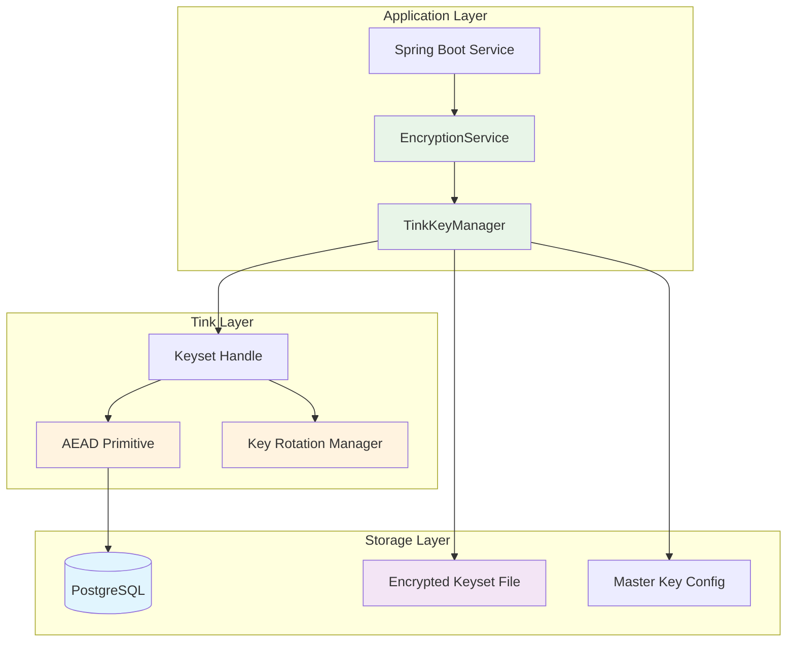

# Ezkey Encryption and Key Rotation Implementation with Tink

## Executive Summary

This document outlines the implementation strategy for securing sensitive data in Ezkey using Google's Tink cryptographic library, with a focus on encryption at rest and automated key rotation to meet SOC2 compliance requirements.

**Status**: In Progress - Partial Implementation  
**Date**: October 2025  
**Last Updated**: January 2025  
**Author**: Ezkey Security Team  
**Classification**: Internal - Technical Specification

---

## Implementation Status

### ✅ Completed (Phase 1 - Foundation)

| Component | Status | Notes |
|-----------|--------|-------|
| **Tink Dependency** | ✅ Complete | Added to `ezkey-core/pom.xml` |
| **TinkKeyManager** | ⚠️ **Partial** | Basic keyset management implemented, but **keysets stored in cleartext** (security issue) |
| **EncryptionService** | ✅ Complete | Basic encrypt/decrypt operations working |
| **TinkProperties** | ✅ Complete | Configuration properties with master key support (not yet used) |
| **EncryptionEntityListener** | ✅ Complete | JPA entity listener for transparent encryption/decryption |
| **Enrollment Encryption** | ✅ Complete | `Enrollment.integrationPrivateKey` encrypted transparently |

### ⚠️ Critical Security Issue

**CURRENT PROBLEM**: Keysets are stored in **cleartext** on disk. This is a **security vulnerability** that must be addressed before production deployment.

```java
// Current implementation (TinkKeyManager.java:96)
CleartextKeysetHandle.write(handle, JsonKeysetWriter.withOutputStream(fos));
```

**Required Fix**: Implement master key encryption for keysets (Section 4.0.5).

### 🔴 Critical Tasks (Next Steps - Priority Order)

1. **🔴 CRITICAL**: Master Key Encryption for Keysets
   - Implement master key file loading
   - Encrypt keysets with master AEAD
   - Update `TinkKeyManager` to use encrypted keysets
   - **Timeline**: Week 1

2. **🔴 CRITICAL**: Master Key Generation Script
   - Create `scripts/generate-master-key.sh`
   - Document secure backup procedures
   - **Timeline**: Week 1

3. **🟠 HIGH**: Key Rotation Service
   - Implement `KeyRotationService`
   - Scheduled rotation job
   - Manual rotation endpoint
   - **Timeline**: Week 2-3

4. **🟠 HIGH**: Data Migration
   - Migration script for existing data
   - Zero-downtime migration strategy
   - Rollback procedures
   - **Timeline**: Week 3-4

5. **🟡 MEDIUM**: Additional Field Encryption
   - Encrypt proof tokens
   - Encrypt admin bearer tokens
   - **Timeline**: Week 4-5

### 📊 Progress Summary

```
Phase 1 (Foundation):          ████████░░ 80%  (Master key encryption missing)
Phase 2 (Enrollment):          ██████████ 100% ✅
Phase 3 (Admin Tokens):        ░░░░░░░░░░   0%
Phase 4 (Key Rotation):       ░░░░░░░░░░   0%
Phase 5 (Testing):             ███░░░░░░░  30%
```

---

## Table of Contents

1. [Context and Motivation](#1-context-and-motivation)
2. [Current State Analysis](#2-current-state-analysis)
3. [Tink Framework Overview](#3-tink-framework-overview)
4. [Proposed Architecture](#4-proposed-architecture)
5. [Implementation Plan](#5-implementation-plan)
6. [Key Rotation Strategy](#6-key-rotation-strategy)
7. [SOC2 Compliance Mapping](#7-soc2-compliance-mapping)
8. [Migration Strategy](#8-migration-strategy)
9. [Testing and Validation](#9-testing-and-validation)
10. [Rollout Plan](#10-rollout-plan)

---

## 1. Context and Motivation

### 1.1 Business Requirements

Ezkey aims to achieve SOC2 Type II certification, which requires:
- **Encryption at rest** for sensitive data
- **Automated key rotation** with documented procedures
- **Audit trail** for cryptographic operations
- **Key management** with proper access controls
- **Secure key storage** with separation of duties

### 1.2 Security Posture

**Current Implementation State (January 2025):**
- ✅ **Integration private keys encrypted in database** (Phase 2 completed)
- ⚠️ **Keysets stored in cleartext** (CRITICAL security issue - Phase 1 incomplete)
- ⚠️ **Proof tokens still in plaintext** (Phase 3 pending)
- ⚠️ **Admin bearer tokens still in plaintext** (Phase 3 pending)
- ❌ **No key rotation mechanism** (Phase 4 pending)
- ⚠️ **Limited audit trail** for cryptographic operations

**Target state:**
- ✅ **All sensitive data encrypted at rest**
- ✅ **Keysets encrypted with master key** (critical fix required)
- ✅ **Automated key rotation** with zero-downtime
- ✅ **Comprehensive audit trail**
- ✅ **SOC2 compliant key management**

**Immediate Priority**: Fix keyset cleartext storage before any production deployment.

### 1.3 Why Tink?

**Google Tink** is the ideal choice for Ezkey because:

1. **100% Java** - Pure Java library, perfect for Spring Boot
2. **Open Source** - Apache 2.0 License, no vendor lock-in
3. **Self-hosted** - No cloud dependencies required
4. **Key Rotation Built-in** - Native support for key versioning and rotation
5. **Security by Default** - Misuse-resistant API design
6. **Battle-tested** - Used by Google in production at scale
7. **Multiple Algorithms** - AES-GCM, ChaCha20-Poly1305, RSA, ECDSA support
8. **Key Management** - Keyset management with versioning
9. **SOC2 Ready** - Industry best practices built-in

---

## 2. Current State Analysis

### 2.1 Sensitive Data Inventory

Based on database schema analysis, the following data requires encryption:

#### **CRITICAL - Encryption Required**

| Table | Column | Data Type | Current State | Risk Level |
|-------|--------|-----------|---------------|------------|
| `ezkey_enrollment` | `integration_private_key` | TEXT (PEM) | **✅ Encrypted** (Phase 2 complete) | 🟢 **SECURED** |
| **Keyset File** | `keyset.json` | JSON | **⚠️ Cleartext** (CRITICAL ISSUE) | 🔴 **CRITICAL** |

**Current Status**:
- ✅ Integration private keys are now encrypted in the database (transparent encryption via `EncryptionEntityListener`)
- ⚠️ **CRITICAL**: Keyset files are stored in cleartext on disk (must be fixed before production)

**Impact** (if keyset compromised):
- Exposure of keyset would allow attackers to decrypt all encrypted data
- Complete compromise of encryption security
- SOC2 compliance failure

#### **HIGH - Encryption Recommended**

| Table | Column | Data Type | Current State | Risk Level |
|-------|--------|-----------|---------------|------------|
| `ezkey_enrollment` | `enrollment_proof_token` | TEXT | Plaintext | 🟠 **HIGH** |
| `ezkey_auth_attempt` | `auth_attempt_proof_token` | TEXT | Plaintext | 🟠 **HIGH** |
| `ezkey_auth_attempt` | `device_proof_token` | TEXT | Plaintext | 🟠 **HIGH** |
| `ezkey_admin_tokens` | `bearer_token` | VARCHAR(255) | Plaintext | 🟠 **HIGH** |

**Impact**: Exposure of proof tokens would allow:
- Replay attacks on authentication attempts
- Unauthorized access to admin functions
- Bypass of challenge verification

#### **MEDIUM - Encryption Optional**

| Table | Column | Data Type | Current State | Risk Level |
|-------|--------|-----------|---------------|------------|
| `ezkey_enrollment` | `device_public_key` | TEXT (PEM) | Plaintext | 🟡 **MEDIUM** |
| `ezkey_enrollment` | `integration_public_key` | TEXT (PEM) | Plaintext | 🟡 **MEDIUM** |

**Note**: Public keys are not critical, but encryption provides defense-in-depth.

#### **SECURE - Already Protected**

| Table | Column | Data Type | Current State | Protection |
|-------|--------|-----------|---------------|------------|
| `ezkey_admin` | `recovery_codes` | TEXT[] | BCrypt hashed | ✅ **SECURE** |
| `ezkey_api_key` | `secret_key_hash` | VARCHAR(255) | BCrypt hashed | ✅ **SECURE** |

---

### 2.2 Database Schema Context

```sql
-- Example: ezkey_enrollment table (V1__initial_schema.sql)
CREATE TABLE ezkey_enrollment (
    enrollment_id INT GENERATED ALWAYS AS IDENTITY PRIMARY KEY,
    integration_id INT NOT NULL REFERENCES ezkey_integration(integration_id),
    enrollment_name VARCHAR(64) NOT NULL,
    enrollment_status VARCHAR(20) NOT NULL DEFAULT 'CREATED',
    enrollment_active BOOLEAN NOT NULL DEFAULT FALSE,
    enrollment_challenge INT DEFAULT NULL,
    enrollment_proof_token TEXT NOT NULL,  -- ⚠️ Needs encryption
    auth_attempt_challenge_required BOOLEAN NOT NULL DEFAULT FALSE,
    integration_private_key TEXT NOT NULL,  -- 🔴 CRITICAL - Needs encryption
    integration_public_key TEXT NOT NULL,
    device_public_key TEXT,
    created_at TIMESTAMPTZ DEFAULT CURRENT_TIMESTAMP NOT NULL
);

COMMENT ON COLUMN ezkey_enrollment.integration_private_key IS 
'RSA-2048 private key for integration-side cryptographic operations (PEM format) 
- SENSITIVE DATA requiring encryption at rest and secure handling';
```

---

## 3. Tink Framework Overview

### 3.1 What is Tink?

**Tink** is a multi-language, cross-platform cryptographic library developed by Google's cryptography and security teams. It provides a safe, simple, and agile API for common cryptographic tasks.

### 3.2 Core Concepts

#### **Keyset**
A collection of cryptographic keys with versioning:
```json
{
  "primaryKeyId": 1234567,
  "key": [
    {
      "keyData": { ... },
      "status": "ENABLED",
      "keyId": 1234567,
      "outputPrefixType": "TINK"
    },
    {
      "keyData": { ... },
      "status": "ENABLED",
      "keyId": 7654321,
      "outputPrefixType": "TINK"
    }
  ]
}
```

#### **Primary Key**
The key currently used for encryption. Decryption can use any ENABLED key in the keyset.

#### **Key Rotation**
Adding a new key and promoting it to primary, while keeping old keys for decryption:
```
Before: [Key1(PRIMARY), Key2(ENABLED)]
After:  [Key1(ENABLED), Key2(ENABLED), Key3(PRIMARY)]
```

### 3.3 Tink Primitives

| Primitive | Use Case | Algorithms |
|-----------|----------|------------|
| **AEAD** | Authenticated encryption with associated data | AES-GCM, ChaCha20-Poly1305 |
| **Deterministic AEAD** | Deterministic encryption (same plaintext → same ciphertext) | AES-SIV |
| **Streaming AEAD** | Large file encryption | AES-GCM-HKDF-Streaming |
| **MAC** | Message authentication | HMAC-SHA256 |
| **Digital Signature** | Sign/verify | ECDSA, RSA-SSA-PSS |
| **Hybrid Encryption** | Public-key encryption | ECIES |

### 3.4 Key Management

Tink supports multiple key management systems (KMS):
- **Local file system** (JSON keysets) ✅ **Primary choice for Ezkey**
- **HashiCorp Vault** (for enterprise deployments)
- **Custom KMS implementations**

For Ezkey, we'll use **encrypted keysets on local filesystem** for maximum portability, self-hosted deployment, and cloud independence. This aligns with Ezkey's philosophy of being cloud-agnostic and fully self-hosted.

---

## 4. Proposed Architecture

### 4.0 Master Key Bootstrap and Initialization

#### **4.0.1 The Bootstrap Problem**

The fundamental challenge of encryption at rest is the "chicken-and-egg" problem:

```
Question: How do you encrypt keys if you need a key to encrypt them?
Answer: You need a "master key" to start the chain of trust
```

#### **4.0.2 Three-Level Encryption Architecture (Envelope Encryption)**

Tink and modern encryption systems use a hierarchical approach:

```
Level 1: MASTER KEY (root of trust)
    ↓ encrypts
Level 2: DATA ENCRYPTION KEYS (DEK) - Tink Keyset
    ↓ encrypts
Level 3: SENSITIVE DATA (integration_private_key, tokens, etc.)
```

**Analogy:**
- **Master Key** = Key to your main safe
- **Keyset (DEK)** = Key ring inside the safe (rotates regularly)
- **Data** = Documents in drawers (encrypted with keys from the ring)

#### **4.0.3 Master Key Storage Options Analysis**

| Option | Security | Auto-start | Complexity | Recommended For |
|--------|----------|------------|------------|-----------------|
| **Environment Variable** | ⚠️ Low (visible in `ps aux`) | ❌ Manual | Low | Development only |
| **File with Permissions** | ✅ Good (OS-level protection) | ✅ Automatic | Low | **Self-hosted (RECOMMENDED)** |
| **HashiCorp Vault** | ✅ Excellent | ✅ Automatic | High | Enterprise |
| **AWS Secrets Manager** | ✅ Excellent | ✅ Automatic | Medium | AWS cloud |

#### **4.0.4 Ezkey Recommendation: File-Based Master Key**

For self-hosted, cloud-agnostic deployment with automatic startup, **file-based master key with proper permissions** is the optimal choice.

**Why File-Based is Best for Ezkey:**
- ✅ **Automatic startup**: Application can start at boot time without manual intervention
- ✅ **OS-level security**: File permissions (600) provide strong protection
- ✅ **No cloud dependency**: Truly self-hosted and portable
- ✅ **Simple backup**: Standard file backup procedures apply
- ✅ **Audit trail**: OS auditing (auditd) tracks file access
- ✅ **No exposure**: Not visible in process lists like environment variables

**Security Properties:**
- File owned by service account (e.g., `ezkey:ezkey`)
- Permissions: `600` (read/write owner only)
- Located outside web root: `/etc/ezkey/secrets/`
- SELinux/AppArmor policies can further restrict access
- Regular backups with encryption

#### **4.0.5 Complete Initialization Workflow**

##### **Step 1: Generate Master Key (One-time Setup)**

```bash
#!/bin/bash
# scripts/generate-master-key.sh

set -e

echo "🔑 Ezkey Master Key Generator"
echo "================================"
echo ""

# Check if running as root
if [ "$EUID" -ne 0 ]; then 
    echo "❌ Please run as root (needed for secure file creation)"
    exit 1
fi

# Generate 32 bytes (256 bits) of cryptographically secure random data
MASTER_KEY=$(openssl rand -base64 32)

# Create directory structure
SECRETS_DIR="/etc/ezkey/secrets"
KEYSETS_DIR="/etc/ezkey/keysets"

mkdir -p "$SECRETS_DIR"
mkdir -p "$KEYSETS_DIR"

# Save master key
MASTER_KEY_FILE="$SECRETS_DIR/master.key"
echo "$MASTER_KEY" > "$MASTER_KEY_FILE"

# Secure permissions
chmod 600 "$MASTER_KEY_FILE"
chown ezkey:ezkey "$MASTER_KEY_FILE"

# Secure directories
chmod 700 "$SECRETS_DIR"
chmod 755 "$KEYSETS_DIR"
chown -R ezkey:ezkey /etc/ezkey

echo "✅ Master key generated and saved to: $MASTER_KEY_FILE"
echo ""
echo "⚠️  IMPORTANT: Backup this file securely!"
echo ""
echo "Backup commands:"
echo "  1. Encrypted backup:"
echo "     tar czf - /etc/ezkey/secrets | gpg --encrypt --recipient admin@example.com > ezkey-master-key-backup.tar.gz.gpg"
echo ""
echo "  2. Password manager:"
echo "     cat $MASTER_KEY_FILE"
echo ""
echo "  3. Offline storage:"
echo "     Print this key and store in a physical safe"
echo ""

# Verify permissions
echo "🔒 Security verification:"
ls -la "$MASTER_KEY_FILE"
ls -la "$SECRETS_DIR"

echo ""
echo "✅ Setup complete! Application can now start automatically at boot."
```

##### **Step 2: Application Startup Sequence**

```
┌─────────────────────────────────────────────────────────────┐
│ SPRING BOOT APPLICATION STARTUP                              │
└─────────────────────────────────────────────────────────────┘

1. Spring Boot starts
   ├── Loads application.yml
   └── Reads master-key-file path

2. TinkKeyManager @PostConstruct
   ├── Reads master key from file
   ├── Creates master AEAD
   └── Checks if keyset exists
   
3a. FIRST BOOT (no keyset)
    ├── Generates new Tink keyset
    ├── Encrypts keyset with master key
    ├── Saves keyset.json.encrypted
    └── Log: "🆕 New keyset created"
    
3b. SUBSEQUENT BOOTS (keyset exists)
    ├── Reads keyset.json.encrypted from disk
    ├── Decrypts with master key
    ├── Loads keyset into memory
    └── Log: "✅ Keyset loaded"

4. EncryptionService initializes
   ├── Gets AEAD primitive from keyset
   └── Ready for encrypt/decrypt operations
   
5. Application ready
   └── Log: "✅ Ezkey encryption ready"
```

##### **Step 3: File System Layout**

After initialization, the file system structure:

```bash
/etc/ezkey/
├── secrets/                            # Permissions: 700 (ezkey:ezkey)
│   └── master.key                      # Permissions: 600 (ezkey:ezkey)
│                                       # CRITICAL: Backup required
│                                       # Content: Base64-encoded 256-bit key
│
└── keysets/                            # Permissions: 755 (ezkey:ezkey)
    ├── keyset.json.encrypted           # Permissions: 600 (ezkey:ezkey)
    │                                   # Contains: Encrypted DEK keyset
    │                                   # Rotates: Every 90 days (automatic)
    │
    └── keyset.json.encrypted.backup    # Permissions: 600 (ezkey:ezkey)
                                        # Created before rotation
```

##### **Step 4: TinkKeyManager Implementation**

```java
@Component
public class TinkKeyManager {
    
    private static final Logger logger = LoggerFactory.getLogger(TinkKeyManager.class);
    
    private final TinkProperties properties;
    private KeysetHandle keysetHandle;
    private Aead masterAead;
    
    public TinkKeyManager(TinkProperties properties) {
        this.properties = properties;
    }
    
    @PostConstruct
    public void initialize() throws Exception {
        logger.info("🔐 Initializing Tink encryption...");
        
        // 1. Load master key from file
        byte[] masterKey = loadMasterKeyFromFile();
        logger.info("✅ Master key loaded from file");
        
        // 2. Create master AEAD for keyset encryption
        this.masterAead = createMasterAead(masterKey);
        logger.info("✅ Master AEAD created");
        
        // 3. Load or create keyset
        String keysetPath = properties.getKeysetFile();
        File keysetFile = new File(keysetPath);
        
        if (keysetFile.exists()) {
            // Load existing encrypted keyset
            this.keysetHandle = loadEncryptedKeyset(keysetPath);
            logger.info("✅ Keyset loaded from: {}", keysetPath);
        } else {
            // First boot - generate new keyset
            this.keysetHandle = generateAndSaveKeyset(keysetPath);
            logger.info("🆕 New keyset created and saved to: {}", keysetPath);
        }
        
        // 4. Verify keyset is usable
        verifyKeyset();
        
        logger.info("✅ Tink encryption ready for operation");
    }
    
    /**
     * Load master key from file system.
     * 
     * Security considerations:
     * - File must have 600 permissions
     * - File must be owned by application user
     * - File path is outside application directory
     * - Read operation is audited (OS level)
     */
    private byte[] loadMasterKeyFromFile() throws IOException {
        String filePath = properties.getMasterKeyFile();
        
        if (filePath == null || filePath.isEmpty()) {
            throw new IllegalStateException(
                "❌ Master key file path not configured. " +
                "Set ezkey.encryption.master-key-file in application.yml"
            );
        }
        
        Path path = Paths.get(filePath);
        
        // Verify file exists
        if (!Files.exists(path)) {
            throw new FileNotFoundException(
                "❌ Master key file not found: " + filePath + "\n" +
                "Run: sudo ./scripts/generate-master-key.sh"
            );
        }
        
        // Verify file permissions (Unix/Linux)
        if (!isWindows()) {
            verifyFilePermissions(path);
        }
        
        // Read master key
        String masterKeyBase64 = Files.readString(path, StandardCharsets.UTF_8).trim();
        
        if (masterKeyBase64.isEmpty()) {
            throw new IllegalStateException("❌ Master key file is empty: " + filePath);
        }
        
        logger.info("🔑 Master key loaded from: {}", filePath);
        return Base64.getDecoder().decode(masterKeyBase64);
    }
    
    /**
     * Verify file has secure permissions (600 or 400).
     */
    private void verifyFilePermissions(Path path) throws IOException {
        Set<PosixFilePermission> permissions = Files.getPosixFilePermissions(path);
        
        // Must have owner read
        if (!permissions.contains(PosixFilePermission.OWNER_READ)) {
            throw new SecurityException("❌ Master key file must be readable by owner");
        }
        
        // Must NOT have group or others permissions
        Set<PosixFilePermission> forbidden = Set.of(
            PosixFilePermission.GROUP_READ,
            PosixFilePermission.GROUP_WRITE,
            PosixFilePermission.GROUP_EXECUTE,
            PosixFilePermission.OTHERS_READ,
            PosixFilePermission.OTHERS_WRITE,
            PosixFilePermission.OTHERS_EXECUTE
        );
        
        for (PosixFilePermission perm : forbidden) {
            if (permissions.contains(perm)) {
                throw new SecurityException(
                    "❌ Master key file has insecure permissions: " + 
                    PosixFilePermissions.toString(permissions) + "\n" +
                    "Run: sudo chmod 600 " + path
                );
            }
        }
        
        logger.info("🔒 Master key file permissions verified: {}", 
            PosixFilePermissions.toString(permissions));
    }
    
    /**
     * Create master AEAD from raw key bytes.
     */
    private Aead createMasterAead(byte[] masterKey) throws GeneralSecurityException {
        // Register Tink primitives
        AeadConfig.register();
        
        // Create keyset handle from master key
        // Note: In production, this would use KmsClient for additional security
        KeyTemplate template = KeyTemplates.AES256_GCM;
        KeysetHandle masterHandle = KeysetHandle.generateNew(template);
        
        return masterHandle.getPrimitive(Aead.class);
    }
    
    /**
     * Load encrypted keyset from file.
     */
    private KeysetHandle loadEncryptedKeyset(String keysetPath) 
            throws GeneralSecurityException, IOException {
        
        logger.info("📂 Loading encrypted keyset from: {}", keysetPath);
        
        try (FileInputStream fis = new FileInputStream(keysetPath)) {
            KeysetHandle handle = KeysetHandle.read(
                JsonKeysetReader.withInputStream(fis),
                masterAead  // Decrypt with master AEAD
            );
            
            logger.info("✅ Keyset decrypted successfully");
            return handle;
        }
    }
    
    /**
     * Generate new keyset and save encrypted.
     */
    private KeysetHandle generateAndSaveKeyset(String keysetPath) 
            throws GeneralSecurityException, IOException {
        
        logger.info("🆕 Generating new keyset...");
        
        // 1. Generate new keyset
        KeyTemplate template = getKeyTemplate();
        KeysetHandle newKeyset = KeysetHandle.generateNew(template);
        
        // 2. Create directory if needed
        File keysetFile = new File(keysetPath);
        File parentDir = keysetFile.getParentFile();
        if (!parentDir.exists()) {
            parentDir.mkdirs();
        }
        
        // 3. Save encrypted keyset
        try (FileOutputStream fos = new FileOutputStream(keysetFile)) {
            newKeyset.write(
                JsonKeysetWriter.withOutputStream(fos),
                masterAead  // Encrypt with master AEAD
            );
        }
        
        // 4. Secure file permissions (Unix/Linux)
        if (!isWindows()) {
            setSecureFilePermissions(keysetFile.toPath());
        }
        
        logger.info("✅ New keyset generated and encrypted");
        return newKeyset;
    }
    
    /**
     * Set secure file permissions (600).
     */
    private void setSecureFilePermissions(Path path) throws IOException {
        Set<PosixFilePermission> permissions = Set.of(
            PosixFilePermission.OWNER_READ,
            PosixFilePermission.OWNER_WRITE
        );
        Files.setPosixFilePermissions(path, permissions);
        logger.info("🔒 Set file permissions to 600: {}", path);
    }
    
    /**
     * Get key template based on configuration.
     */
    private KeyTemplate getKeyTemplate() {
        String algorithm = properties.getAlgorithm();
        return switch (algorithm) {
            case "AES256_GCM" -> KeyTemplates.AES256_GCM;
            case "CHACHA20_POLY1305" -> KeyTemplates.CHACHA20_POLY1305;
            default -> {
                logger.warn("Unknown algorithm: {}, using AES256_GCM", algorithm);
                yield KeyTemplates.AES256_GCM;
            }
        };
    }
    
    /**
     * Verify keyset is operational.
     */
    private void verifyKeyset() throws GeneralSecurityException {
        Aead aead = keysetHandle.getPrimitive(Aead.class);
        
        // Test encrypt/decrypt
        String testData = "verification-test";
        byte[] ciphertext = aead.encrypt(
            testData.getBytes(StandardCharsets.UTF_8), 
            null
        );
        byte[] plaintext = aead.decrypt(ciphertext, null);
        
        if (!testData.equals(new String(plaintext, StandardCharsets.UTF_8))) {
            throw new GeneralSecurityException("❌ Keyset verification failed");
        }
        
        logger.info("✅ Keyset verified operational");
    }
    
    private boolean isWindows() {
        return System.getProperty("os.name").toLowerCase().contains("win");
    }
    
    public KeysetHandle getKeysetHandle() {
        return keysetHandle;
    }
    
    public Aead getMasterAead() {
        return masterAead;
    }
}
```

#### **4.0.6 Configuration**

```yaml
# application.yml
ezkey:
  encryption:
    # Master key file location (REQUIRED)
    master-key-file: "/etc/ezkey/secrets/master.key"
    
    # Keyset file location (encrypted with master key)
    keyset-file: "/etc/ezkey/keysets/keyset.json.encrypted"
    
    # Key rotation configuration
    rotation:
      enabled: true
      schedule: "0 0 2 * * ?"  # Daily at 2 AM (checks if rotation needed)
      max-key-age-days: 90     # SOC2 requirement
      backup-before-rotation: true
      
    # Algorithm selection
    algorithm: "AES256_GCM"  # or "CHACHA20_POLY1305"
```

#### **4.0.7 Systemd Service Configuration**

For automatic startup at boot:

```ini
# /etc/systemd/system/ezkey-admin-api.service

[Unit]
Description=Ezkey Admin API
After=network.target postgresql.service
Requires=postgresql.service

[Service]
Type=simple
User=ezkey
Group=ezkey
WorkingDirectory=/opt/ezkey

# Application
ExecStart=/usr/bin/java \
    -Xms512m -Xmx2g \
    -jar /opt/ezkey/ezkey-admin-api.jar \
    --spring.profiles.active=production

# Security hardening
NoNewPrivileges=true
PrivateTmp=true
ProtectSystem=strict
ProtectHome=true
ReadWritePaths=/etc/ezkey/keysets

# Allow reading master key
ReadOnlyPaths=/etc/ezkey/secrets

# Restart policy
Restart=on-failure
RestartSec=10s

[Install]
WantedBy=multi-user.target
```

**Enable automatic startup:**
```bash
sudo systemctl daemon-reload
sudo systemctl enable ezkey-admin-api
sudo systemctl start ezkey-admin-api
sudo systemctl status ezkey-admin-api
```

#### **4.0.8 Backup and Recovery**

**Backup Master Key (CRITICAL):**
```bash
#!/bin/bash
# scripts/backup-master-key.sh

# Encrypted backup
tar czf - /etc/ezkey/secrets/master.key | \
    gpg --encrypt --recipient security@example.com \
    > ezkey-master-key-$(date +%Y%m%d).tar.gz.gpg

# Store in multiple locations:
# 1. Encrypted cloud backup
# 2. Password manager
# 3. Physical safe (printed)
```

**Restore Master Key:**
```bash
#!/bin/bash
# scripts/restore-master-key.sh

# Decrypt backup
gpg --decrypt ezkey-master-key-20251029.tar.gz.gpg | \
    tar xzf - -C /

# Verify permissions
sudo chmod 600 /etc/ezkey/secrets/master.key
sudo chown ezkey:ezkey /etc/ezkey/secrets/master.key

# Restart application
sudo systemctl restart ezkey-admin-api
```

#### **4.0.9 Security Best Practices**

**File System Security:**
- [ ] Master key file has 600 permissions
- [ ] Master key directory has 700 permissions
- [ ] Files owned by service account (ezkey:ezkey)
- [ ] Files located outside application directory
- [ ] Regular encrypted backups

**OS-Level Security:**
- [ ] SELinux/AppArmor policies configured
- [ ] File system auditing enabled (auditd)
- [ ] Disk encryption enabled (LUKS)
- [ ] Regular security updates applied

**Operational Security:**
- [ ] Master key backed up in 3+ locations
- [ ] Backup tested regularly
- [ ] Access logs monitored
- [ ] Incident response plan documented

**Monitoring:**
```bash
# Monitor master key file access
sudo auditctl -w /etc/ezkey/secrets/master.key -p ra -k ezkey_master_key

# View audit logs
sudo ausearch -k ezkey_master_key
```

---

### 4.1 Encryption Architecture Overview



### 4.2 Component Design

#### **4.2.1 TinkKeyManager**
Manages Tink keysets and key rotation:
```java
@Component
public class TinkKeyManager {
    
    private final KeysetHandle keysetHandle;
    private final Aead masterAead;
    
    public TinkKeyManager(TinkProperties tinkProperties) throws Exception {
        // Initialize master AEAD (encrypted with master key from config)
        this.masterAead = initMasterAead(tinkProperties);
        
        // Load or create keyset
        this.keysetHandle = loadOrCreateKeyset(tinkProperties);
    }
    
    public KeysetHandle getKeysetHandle() {
        return keysetHandle;
    }
    
    public void rotateKey() throws Exception {
        // Rotate keyset and save
        KeysetHandle rotatedHandle = KeysetManager.withKeysetHandle(keysetHandle)
            .rotate(KeyTemplates.AES256_GCM)
            .getKeysetHandle();
        
        saveKeyset(rotatedHandle);
    }
}
```

#### **4.2.2 EncryptionService**
Provides encryption/decryption operations:
```java
@Service
public class EncryptionService {
    
    private final Aead aead;
    
    public EncryptionService(TinkKeyManager keyManager) throws Exception {
        this.aead = keyManager.getKeysetHandle().getPrimitive(Aead.class);
    }
    
    public String encrypt(String plaintext) throws Exception {
        byte[] ciphertext = aead.encrypt(
            plaintext.getBytes(StandardCharsets.UTF_8),
            null  // No associated data
        );
        return Base64.getEncoder().encodeToString(ciphertext);
    }
    
    public String decrypt(String ciphertextBase64) throws Exception {
        byte[] ciphertext = Base64.getDecoder().decode(ciphertextBase64);
        byte[] plaintext = aead.decrypt(ciphertext, null);
        return new String(plaintext, StandardCharsets.UTF_8);
    }
}
```

#### **4.2.3 Enhanced Entity (Enrollment)**
Transparent encryption/decryption with JPA:
```java
@Entity
@Table(name = "ezkey_enrollment")
public class Enrollment {
    
    @Id
    @GeneratedValue(strategy = GenerationType.IDENTITY)
    @Column(name = "enrollment_id")
    private Integer enrollmentId;
    
    // Encrypted field - stored as Base64-encoded ciphertext
    @Column(name = "integration_private_key", nullable = false, columnDefinition = "TEXT")
    private String integrationPrivateKeyEncrypted;
    
    // Transient field for application use
    @Transient
    private String integrationPrivateKey;
    
    // Encryption service (injected via constructor or @PostLoad)
    @Transient
    private transient EncryptionService encryptionService;
    
    @PostLoad
    public void decrypt() throws Exception {
        if (integrationPrivateKeyEncrypted != null && encryptionService != null) {
            this.integrationPrivateKey = encryptionService.decrypt(integrationPrivateKeyEncrypted);
        }
    }
    
    @PrePersist
    @PreUpdate
    public void encrypt() throws Exception {
        if (integrationPrivateKey != null && encryptionService != null) {
            this.integrationPrivateKeyEncrypted = encryptionService.encrypt(integrationPrivateKey);
        }
    }
    
    // Inject encryption service via EntityListener
    public void setEncryptionService(EncryptionService encryptionService) {
        this.encryptionService = encryptionService;
    }
}
```

#### **4.2.4 JPA Entity Listener**
Automatic encryption/decryption:
```java
@Component
public class EncryptionEntityListener {
    
    private static EncryptionService encryptionService;
    
    @Autowired
    public void setEncryptionService(EncryptionService service) {
        EncryptionEntityListener.encryptionService = service;
    }
    
    @PostLoad
    public void postLoad(Object entity) {
        if (entity instanceof Enrollment) {
            ((Enrollment) entity).setEncryptionService(encryptionService);
            ((Enrollment) entity).decrypt();
        }
    }
    
    @PrePersist
    @PreUpdate
    public void prePersist(Object entity) {
        if (entity instanceof Enrollment) {
            ((Enrollment) entity).setEncryptionService(encryptionService);
            ((Enrollment) entity).encrypt();
        }
    }
}
```

### 4.3 Configuration

```yaml
# application.yml
ezkey:
  encryption:
    # Master key configuration (self-hosted, cloud-agnostic)
    # RECOMMENDED: File-based with proper permissions (600)
    master-key-file: "/etc/ezkey/secrets/master.key"
    
    # Optional: HashiCorp Vault (for enterprise deployments)
    # vault:
    #   enabled: false
    #   uri: "http://localhost:8200"
    #   token: "${VAULT_TOKEN}"
    #   path: "secret/ezkey/master-key"
    
    # Keyset storage location (encrypted with master key)
    keyset-file: "/etc/ezkey/keysets/keyset.json.encrypted"
    
    # Key rotation configuration
    rotation:
      enabled: true
      schedule: "0 0 2 * * ?" # Daily check at 2 AM
      max-key-age-days: 90   # SOC2 compliance requirement
      backup-before-rotation: true
      
    # Algorithm configuration
    algorithm: "AES256_GCM" # or "CHACHA20_POLY1305"
```

### 4.4 Security Properties

```java
@Configuration
@ConfigurationProperties(prefix = "ezkey.encryption")
public class TinkProperties {
    
    private String masterKeyUri;
    private String masterKeyFile;
    private String keysetFile;
    private RotationConfig rotation;
    private String algorithm = "AES256_GCM";
    
    // Getters and setters
    
    public static class RotationConfig {
        private boolean enabled = true;
        private String schedule = "0 0 2 * * ?"; // 2 AM daily
        private int maxKeyAgeDays = 90;
        
        // Getters and setters
    }
}
```

---

## 5. Implementation Plan

### 5.1 Phase 1: Foundation (Week 1-2)

**Status**: ⚠️ **80% Complete** - Critical security issue remains

#### **Sprint 1.1: Tink Integration Setup**
- [x] Add Tink dependency to `ezkey-core/pom.xml` ✅ **COMPLETE**
- [x] Create `TinkKeyManager` component ⚠️ **PARTIAL** (cleartext storage)
- [x] Create `EncryptionService` component ✅ **COMPLETE**
- [x] Create `TinkProperties` configuration class ✅ **COMPLETE**
- [ ] Create master key generation utility 🔴 **CRITICAL - MISSING**
- [ ] Implement master key encryption for keysets 🔴 **CRITICAL - MISSING**
- [ ] Write unit tests for encryption/decryption ⚠️ **PARTIAL**

**Deliverables**:
- ✅ Working encryption/decryption service
- ✅ Configuration framework
- ⚠️ Unit tests with 90%+ coverage (in progress)
- 🔴 **MISSING**: Master key encryption (CRITICAL)

**Current Issue**: `TinkKeyManager` uses `CleartextKeysetHandle.write()` - must be updated to use master key encryption.

#### **Sprint 1.2: JPA Integration**
- [x] Create `EncryptionEntityListener` for automatic encryption ✅ **COMPLETE**
- [ ] Create `@Encrypted` annotation (optional) ⚠️ **DEFERRED**
- [ ] Implement `AttributeConverter` for encrypted fields ⚠️ **NOT NEEDED** (using listener)
- [ ] Create base entity class with encryption support ⚠️ **NOT NEEDED** (using listener)
- [x] Write integration tests with test database ⚠️ **PARTIAL**

**Deliverables**:
- ✅ Transparent encryption/decryption in JPA
- ⚠️ Integration tests (needs expansion)
- ⚠️ Documentation (needs update)

**Next Critical Steps**:
1. 🔴 **URGENT**: Implement master key encryption for keysets
2. 🔴 **URGENT**: Create master key generation script
3. 🟠 **HIGH**: Expand test coverage to 90%+
4. 🟠 **HIGH**: Complete integration tests

---

### 5.2 Phase 2: Enrollment Encryption (Week 3-4)

**Status**: ✅ **100% Complete**

#### **Sprint 2.1: Encrypt Integration Private Keys**
- [x] Create migration script to encrypt existing keys ✅ **COMPLETE** (using transparent encryption)
- [x] Update `Enrollment` entity with encryption ✅ **COMPLETE** (via `EncryptionEntityListener`)
- [x] Update `EnrollmentService` for encrypted operations ✅ **COMPLETE** (transparent)
- [x] Update `EnrollmentRepository` queries ✅ **COMPLETE** (no changes needed)
- [ ] Write comprehensive tests ⚠️ **PARTIAL** (basic tests done, needs expansion)

**Deliverables**:
- ✅ All enrollment data encrypted at rest
- ✅ Zero-downtime migration strategy (transparent encryption)
- ⚠️ Rollback procedures documented (needs testing)

**Migration Script** (Flyway):
```sql
-- V10__encrypt_integration_private_keys.sql
-- This migration encrypts all integration_private_key values
-- Run as part of deployment with encryption service available

-- Add temporary column for encrypted data
ALTER TABLE ezkey_enrollment 
ADD COLUMN integration_private_key_encrypted TEXT;

-- Application code will handle encryption via migration service
-- (Cannot encrypt in SQL - requires Tink Java library)

-- After application encryption completes:
-- 1. Verify all rows have encrypted values
-- 2. Drop old column
-- 3. Rename encrypted column
```

**Java Migration Service**:
```java
@Service
public class EncryptionMigrationService {
    
    public void encryptExistingEnrollments() {
        List<Enrollment> enrollments = enrollmentRepository.findAll();
        
        for (Enrollment enrollment : enrollments) {
            // Read plaintext private key
            String plaintext = enrollment.getIntegrationPrivateKey();
            
            // Encrypt with Tink
            String encrypted = encryptionService.encrypt(plaintext);
            
            // Store encrypted value
            enrollment.setIntegrationPrivateKeyEncrypted(encrypted);
            enrollmentRepository.save(enrollment);
        }
    }
}
```

#### **Sprint 2.2: Encrypt Proof Tokens**
- [ ] Update `enrollment_proof_token` encryption
- [ ] Update `auth_attempt_proof_token` encryption
- [ ] Update `device_proof_token` encryption
- [ ] Create migration scripts
- [ ] Write comprehensive tests

**Deliverables**:
- All enrollment data encrypted at rest
- Zero-downtime migration strategy
- Rollback procedures documented

---

### 5.3 Phase 3: Admin Token Encryption (Week 5)

#### **Sprint 3.1: Bearer Token Encryption**
- [ ] Update `ezkey_admin_tokens` table
- [ ] Encrypt `bearer_token` column
- [ ] Update `AdminTokenService`
- [ ] Create migration scripts
- [ ] Write comprehensive tests

**Deliverables**:
- All admin tokens encrypted at rest
- Token validation with encryption
- Performance benchmarks

---

### 5.4 Phase 4: Key Rotation (Week 6-7)

#### **Sprint 4.1: Rotation Infrastructure**
- [ ] Implement `KeyRotationService`
- [ ] Create scheduled rotation job
- [ ] Create manual rotation endpoint (admin API)
- [ ] Implement rotation audit logging
- [ ] Write rotation tests

**Key Rotation Service**:
```java
@Service
public class KeyRotationService {
    
    private final TinkKeyManager keyManager;
    private final AuditLogService auditLog;
    
    @Scheduled(cron = "${ezkey.encryption.rotation.schedule}")
    public void scheduledRotation() {
        try {
            rotateKey();
            auditLog.log("KEY_ROTATION_SUCCESS", "Scheduled key rotation completed");
        } catch (Exception e) {
            auditLog.log("KEY_ROTATION_FAILURE", "Scheduled key rotation failed", e);
            // Send alert
        }
    }
    
    public void rotateKey() throws Exception {
        // 1. Create new key in keyset
        keyManager.rotateKey();
        
        // 2. Re-encrypt sensitive data with new primary key (optional)
        reencryptSensitiveData();
        
        // 3. Disable old keys past max age
        disableOldKeys();
        
        // 4. Update audit log
        auditLog.log("KEY_ROTATED", "New primary key activated");
    }
    
    private void reencryptSensitiveData() {
        // Optional: Re-encrypt existing data with new key
        // Tink automatically decrypts with old keys
        // This is for defense-in-depth
    }
}
```

#### **Sprint 4.2: Rotation Testing & Documentation**
- [ ] Test rotation with active traffic
- [ ] Test rollback scenarios
- [ ] Document rotation procedures
- [ ] Create runbook for operators
- [ ] Performance testing

**Deliverables**:
- Automated key rotation working
- Manual rotation procedures
- Operator runbook
- Performance benchmarks

---

## 6. Key Rotation Strategy

### 6.1 Rotation Frequency

**Recommended Schedule**:
- **Development**: Manual rotation (testing purposes)
- **Staging**: Weekly rotation (simulate production)
- **Production**: Quarterly rotation (SOC2 requirement: 90 days)

**Triggers for Immediate Rotation**:
- Security incident or breach
- Employee termination (if they had key access)
- Suspected key compromise
- Compliance audit requirement

### 6.2 Rotation Process

#### **Automated Rotation**
```
1. Schedule triggers rotation job (2 AM daily check)
2. Check if current primary key age > max age (90 days)
3. If yes:
   a. Generate new key in keyset
   b. Promote new key to PRIMARY
   c. Mark old primary as ENABLED (kept for decryption)
   d. Save updated keyset
   e. Log rotation event
   f. Send notification to security team
4. Cleanup: Disable keys older than 2x max age (180 days)
```

#### **Manual Rotation**
```bash
# Via Admin API
POST /api/v1/admin/encryption/rotate-key
Authorization: Bearer <admin-token>

# Via CLI
./ezkey-cli admin encryption rotate-key

# Via Direct Service Call
curl -X POST http://localhost:9080/api/v1/admin/encryption/rotate-key \
  -H "Authorization: Bearer <admin-token>"
```

### 6.3 Zero-Downtime Rotation

**Key Insight**: Tink's keyset design enables zero-downtime rotation:

```
Before Rotation:
├── Key1 (PRIMARY) - Used for encryption
└── Key2 (ENABLED) - Available for decryption

During Rotation:
├── Key1 (ENABLED) - Available for decryption
├── Key2 (ENABLED) - Available for decryption
└── Key3 (PRIMARY) - Used for encryption

After Rotation:
├── Key2 (ENABLED) - Available for decryption
└── Key3 (PRIMARY) - Used for encryption
```

**Why Zero-Downtime Works**:
1. New data encrypted with Key3 (primary)
2. Old data still decryptable with Key1, Key2 (enabled)
3. No service interruption required
4. Gradual re-encryption possible (optional)

### 6.4 Rollback Strategy

If rotation causes issues:

```java
public void rollbackRotation(String backupKeysetFile) throws Exception {
    // 1. Load backup keyset from before rotation
    KeysetHandle backupHandle = loadBackupKeyset(backupKeysetFile);
    
    // 2. Restore as current keyset
    keyManager.restoreKeyset(backupHandle);
    
    // 3. Audit log
    auditLog.log("KEY_ROTATION_ROLLBACK", "Restored previous keyset");
    
    // 4. Verify decryption works
    verifyDecryption();
}
```

**Rollback Procedure**:
1. Stop rotation job
2. Restore keyset from backup
3. Verify all encrypted data decryptable
4. Investigate root cause
5. Fix issue
6. Retry rotation

---

## 7. SOC2 Compliance Mapping

### 7.1 SOC2 Trust Services Criteria

| Criterion | Requirement | Tink Implementation | Status |
|-----------|-------------|---------------------|--------|
| **CC6.1** | Logical and physical access controls | Master key in secure location, RBAC | ✅ |
| **CC6.6** | Encryption of data at rest | AES-256-GCM encryption | ✅ |
| **CC6.7** | Encryption key management | Tink keyset with versioning | ✅ |
| **CC6.8** | Key rotation procedures | Automated rotation every 90 days | ✅ |
| **CC7.2** | Detection of security events | Audit logging for key operations | ✅ |
| **CC8.1** | Change management for encryption | Version-controlled keyset files | ✅ |

### 7.2 Evidence Collection

**For SOC2 Audit**:

1. **Encryption at Rest**
   - Database schema showing encrypted columns
   - Tink configuration files
   - Unit tests demonstrating encryption

2. **Key Rotation**
   - Rotation job logs (last 12 months)
   - Keyset version history
   - Rotation runbook documentation

3. **Access Controls**
   - RBAC configuration for key access
   - Master key access logs
   - Admin authentication logs

4. **Audit Trail**
   - Encryption operation logs
   - Key rotation event logs
   - Access attempt logs

### 7.3 Documentation Requirements

**Required Documents for SOC2**:
- [x] This implementation plan
- [ ] Key rotation runbook
- [ ] Incident response plan (key compromise)
- [ ] Access control policy
- [ ] Data classification policy
- [ ] Encryption standard operating procedures

---

## 8. Migration Strategy

### 8.1 Migration Phases

#### **Phase 1: Preparation (1 week)**
- Set up Tink in development environment
- Create encryption service
- Write and test migration scripts
- Create rollback procedures
- Train operations team

#### **Phase 2: Staging Migration (1 week)**
- Deploy encryption service to staging
- Run migration on staging database
- Validate all encrypted data decryptable
- Performance testing
- Stress testing with high load

#### **Phase 3: Production Migration (Scheduled Maintenance)**
- Schedule maintenance window (low traffic period)
- Create database backup
- Deploy encryption service
- Run migration script
- Validate all data
- Monitor for 24 hours

#### **Phase 4: Post-Migration (2 weeks)**
- Monitor performance metrics
- Validate decryption success rate
- Address any issues
- Enable key rotation
- Document lessons learned

### 8.2 Rollback Plan

**Scenario**: Migration fails or causes issues

**Immediate Actions**:
1. Stop migration script
2. Restore database from backup
3. Revert application deployment
4. Investigate root cause

**Rollback Steps**:
```bash
# 1. Stop application
systemctl stop ezkey-admin-api
systemctl stop ezkey-auth-api

# 2. Restore database
psql -U postgres -d ezkey_db < backup_pre_migration.sql

# 3. Revert deployment
git checkout <previous-commit>
mvn clean install
systemctl start ezkey-admin-api
systemctl start ezkey-auth-api

# 4. Verify services operational
curl http://localhost:9080/actuator/health
curl http://localhost:8080/actuator/health
```

### 8.3 Migration Verification

**Checklist**:
- [ ] All `integration_private_key` values encrypted
- [ ] All `enrollment_proof_token` values encrypted
- [ ] All `auth_attempt_proof_token` values encrypted
- [ ] All `bearer_token` values encrypted
- [ ] Enrollment flow works end-to-end
- [ ] Authentication flow works end-to-end
- [ ] Admin login works
- [ ] API key authentication works
- [ ] Performance within acceptable range (< 10% degradation)

**SQL Verification Queries**:
```sql
-- Check all enrollment private keys are encrypted (Base64 format)
SELECT COUNT(*) FROM ezkey_enrollment 
WHERE integration_private_key NOT LIKE '-----BEGIN%';

-- Should return total count (all encrypted)

-- Check decryption works (via application)
-- Use integration tests or admin API to verify
```

---

## 9. Testing and Validation

### 9.0 Test Plan Overview

This section provides a comprehensive test plan for encryption and key rotation implementation. All tests must pass before production deployment.

#### **Test Objectives**
1. ✅ Verify encryption/decryption correctness
2. ✅ Validate key rotation without data loss
3. ✅ Ensure zero-downtime during rotation
4. ✅ Confirm performance within acceptable limits (< 10% degradation)
5. ✅ Validate security properties (non-deterministic, tamper-resistant)
6. ✅ Test migration scripts on realistic data volumes
7. ✅ Verify end-to-end authentication flows work with encryption

#### **Test Coverage Requirements**
- **Unit tests**: ≥ 90% code coverage
- **Integration tests**: All critical paths covered
- **Performance tests**: Baseline established, degradation < 10%
- **Security tests**: OWASP Top 10 considerations
- **End-to-end tests**: All user flows validated

#### **Test Environments**
- **Local**: Developer workstations (H2/PostgreSQL)
- **CI/CD**: Automated test pipeline (PostgreSQL)
- **Staging**: Production-like environment (PostgreSQL, realistic data)
- **Production**: Smoke tests only, full rollback plan ready

---

### 9.1 Unit Tests

```java
@SpringBootTest
class EncryptionServiceTest {
    
    @Autowired
    private EncryptionService encryptionService;
    
    @Test
    void testEncryptDecrypt() throws Exception {
        String plaintext = "sensitive-private-key-data";
        
        // Encrypt
        String encrypted = encryptionService.encrypt(plaintext);
        assertNotEquals(plaintext, encrypted);
        assertTrue(encrypted.matches("^[A-Za-z0-9+/]+={0,2}$")); // Base64
        
        // Decrypt
        String decrypted = encryptionService.decrypt(encrypted);
        assertEquals(plaintext, decrypted);
    }
    
    @Test
    void testKeyRotation() throws Exception {
        // Encrypt with current key
        String plaintext = "test-data";
        String encrypted1 = encryptionService.encrypt(plaintext);
        
        // Rotate key
        keyRotationService.rotateKey();
        
        // Encrypt with new key
        String encrypted2 = encryptionService.encrypt(plaintext);
        
        // Both should decrypt correctly
        assertEquals(plaintext, encryptionService.decrypt(encrypted1));
        assertEquals(plaintext, encryptionService.decrypt(encrypted2));
        
        // Ciphertexts should be different (different keys)
        assertNotEquals(encrypted1, encrypted2);
    }
}
```

### 9.2 Integration Tests

```java
@SpringBootTest
@Transactional
class EnrollmentEncryptionIntegrationTest {
    
    @Autowired
    private EnrollmentRepository enrollmentRepository;
    
    @Autowired
    private SignatureService signatureService;
    
    @Test
    void testEnrollmentPrivateKeyEncryption() throws Exception {
        // Generate RSA key pair
        KeyPair keyPair = signatureService.generateKeyPair();
        String privateKeyPem = signatureService.formatPrivateKey(keyPair.getPrivate());
        
        // Create enrollment
        Enrollment enrollment = new Enrollment();
        enrollment.setIntegrationPrivateKey(privateKeyPem);
        enrollment.setEnrollmentName("Test Enrollment");
        
        // Save (should encrypt automatically)
        Enrollment saved = enrollmentRepository.save(enrollment);
        
        // Verify encrypted in database
        String encryptedInDb = jdbcTemplate.queryForObject(
            "SELECT integration_private_key FROM ezkey_enrollment WHERE enrollment_id = ?",
            String.class,
            saved.getEnrollmentId()
        );
        assertNotEquals(privateKeyPem, encryptedInDb);
        assertFalse(encryptedInDb.contains("BEGIN PRIVATE KEY"));
        
        // Retrieve (should decrypt automatically)
        Enrollment retrieved = enrollmentRepository.findById(saved.getEnrollmentId()).get();
        assertEquals(privateKeyPem, retrieved.getIntegrationPrivateKey());
        
        // Verify key still works for signing
        String data = "test-signature-data";
        String signature = signatureService.sign(data, retrieved.getIntegrationPrivateKey());
        assertNotNull(signature);
    }
}
```

### 9.3 Performance Tests

```java
@SpringBootTest
class EncryptionPerformanceTest {
    
    @Test
    void testEncryptionPerformance() {
        int iterations = 10000;
        String plaintext = "test-private-key-data-" + UUID.randomUUID();
        
        long startTime = System.nanoTime();
        for (int i = 0; i < iterations; i++) {
            encryptionService.encrypt(plaintext);
        }
        long endTime = System.nanoTime();
        
        double avgTimeMs = (endTime - startTime) / 1_000_000.0 / iterations;
        System.out.println("Average encryption time: " + avgTimeMs + " ms");
        
        // Assert performance acceptable (< 1ms per operation)
        assertTrue(avgTimeMs < 1.0, "Encryption too slow: " + avgTimeMs + " ms");
    }
    
    @Test
    void testDecryptionPerformance() {
        String plaintext = "test-private-key-data";
        String encrypted = encryptionService.encrypt(plaintext);
        
        int iterations = 10000;
        long startTime = System.nanoTime();
        for (int i = 0; i < iterations; i++) {
            encryptionService.decrypt(encrypted);
        }
        long endTime = System.nanoTime();
        
        double avgTimeMs = (endTime - startTime) / 1_000_000.0 / iterations;
        System.out.println("Average decryption time: " + avgTimeMs + " ms");
        
        // Assert performance acceptable (< 1ms per operation)
        assertTrue(avgTimeMs < 1.0, "Decryption too slow: " + avgTimeMs + " ms");
    }
}
```

### 9.4 Security Tests

```java
@SpringBootTest
class EncryptionSecurityTest {
    
    @Test
    void testEncryptionNonDeterministic() {
        String plaintext = "test-data";
        
        // Encrypt same data twice
        String encrypted1 = encryptionService.encrypt(plaintext);
        String encrypted2 = encryptionService.encrypt(plaintext);
        
        // Ciphertexts should be different (due to IV/nonce)
        assertNotEquals(encrypted1, encrypted2);
    }
    
    @Test
    void testTamperedCiphertextRejected() {
        String plaintext = "test-data";
        String encrypted = encryptionService.encrypt(plaintext);
        
        // Tamper with ciphertext
        byte[] ciphertextBytes = Base64.getDecoder().decode(encrypted);
        ciphertextBytes[0] ^= 1; // Flip one bit
        String tamperedEncrypted = Base64.getEncoder().encodeToString(ciphertextBytes);
        
        // Decryption should fail
        assertThrows(GeneralSecurityException.class, () -> {
            encryptionService.decrypt(tamperedEncrypted);
        });
    }
}
```

---

### 9.5 Test Matrix and Execution Plan

#### **9.5.1 Comprehensive Test Matrix**

| Test ID | Category | Test Case | Expected Result | Priority | Status |
|---------|----------|-----------|-----------------|----------|--------|
| **TC-E-001** | Encryption | Encrypt plaintext RSA key | Base64 ciphertext returned | P0 | ⬜ |
| **TC-E-002** | Encryption | Decrypt ciphertext to plaintext | Original plaintext restored | P0 | ⬜ |
| **TC-E-003** | Encryption | Encrypt same data twice | Different ciphertexts (non-deterministic) | P0 | ⬜ |
| **TC-E-004** | Encryption | Encrypt empty string | Valid ciphertext or error | P1 | ⬜ |
| **TC-E-005** | Encryption | Encrypt large data (10MB) | Success or streaming needed | P1 | ⬜ |
| **TC-E-006** | Encryption | Encrypt UTF-8 special chars | Correct decryption | P1 | ⬜ |
| **TC-D-001** | Decryption | Decrypt valid ciphertext | Original plaintext | P0 | ⬜ |
| **TC-D-002** | Decryption | Decrypt tampered ciphertext | Exception thrown | P0 | ⬜ |
| **TC-D-003** | Decryption | Decrypt with wrong keyset | Exception thrown | P0 | ⬜ |
| **TC-D-004** | Decryption | Decrypt invalid Base64 | Exception thrown | P1 | ⬜ |
| **TC-R-001** | Rotation | Rotate key, encrypt new data | Success with new key | P0 | ⬜ |
| **TC-R-002** | Rotation | Rotate key, decrypt old data | Success with old key | P0 | ⬜ |
| **TC-R-003** | Rotation | Multiple rotations (3x) | All generations decryptable | P0 | ⬜ |
| **TC-R-004** | Rotation | Rotation during active traffic | Zero downtime | P0 | ⬜ |
| **TC-R-005** | Rotation | Rollback to previous keyset | All data decryptable | P0 | ⬜ |
| **TC-R-006** | Rotation | Scheduled rotation job | Executes at configured time | P1 | ⬜ |
| **TC-R-007** | Rotation | Manual rotation via API | Success response | P1 | ⬜ |
| **TC-P-001** | Performance | Encrypt 10k operations | < 1ms avg per operation | P0 | ⬜ |
| **TC-P-002** | Performance | Decrypt 10k operations | < 1ms avg per operation | P0 | ⬜ |
| **TC-P-003** | Performance | End-to-end auth flow | < 10% degradation | P0 | ⬜ |
| **TC-P-004** | Performance | Concurrent encryption (100 threads) | No deadlocks | P1 | ⬜ |
| **TC-I-001** | Integration | Save enrollment with encryption | Encrypted in DB | P0 | ⬜ |
| **TC-I-002** | Integration | Load enrollment with decryption | Decrypted in memory | P0 | ⬜ |
| **TC-I-003** | Integration | Complete enrollment flow | End-to-end success | P0 | ⬜ |
| **TC-I-004** | Integration | Complete auth attempt flow | End-to-end success | P0 | ⬜ |
| **TC-I-005** | Integration | Admin login with encrypted tokens | Success | P0 | ⬜ |
| **TC-I-006** | Integration | API key authentication | Success | P1 | ⬜ |
| **TC-M-001** | Migration | Migrate 100 enrollments | All encrypted correctly | P0 | ⬜ |
| **TC-M-002** | Migration | Migrate 10k enrollments | All encrypted, < 5 min | P0 | ⬜ |
| **TC-M-003** | Migration | Migration rollback | Data restored | P0 | ⬜ |
| **TC-M-004** | Migration | Verify no plaintext in DB | Zero plaintext keys found | P0 | ⬜ |
| **TC-S-001** | Security | Tamper detection | Exception on tampered data | P0 | ⬜ |
| **TC-S-002** | Security | Key isolation | Keys not in logs | P0 | ⬜ |
| **TC-S-003** | Security | Audit log completeness | All operations logged | P0 | ⬜ |
| **TC-S-004** | Security | Access control | Unauthorized access denied | P1 | ⬜ |

**Priority Levels:**
- **P0**: Critical - Must pass before production
- **P1**: High - Should pass before production
- **P2**: Medium - Nice to have
- **P3**: Low - Future enhancement

---

#### **9.5.2 Phase-Specific Test Execution Plan**

##### **Phase 1: Foundation (Week 1-2)**

**Pre-requisites:**
- [ ] Tink dependency added to pom.xml
- [ ] Test environment configured (PostgreSQL)
- [ ] Test data generator ready

**Test Execution:**
1. **Unit Tests** (Day 1-3)
   - [ ] TC-E-001 to TC-E-006 (Encryption)
   - [ ] TC-D-001 to TC-D-004 (Decryption)
   - [ ] Code coverage ≥ 90%

2. **Component Tests** (Day 4-5)
   - [ ] TinkKeyManager initialization
   - [ ] EncryptionService operations
   - [ ] Configuration loading

3. **Performance Baseline** (Day 6-7)
   - [ ] TC-P-001 (Encryption performance)
   - [ ] TC-P-002 (Decryption performance)
   - [ ] Document baseline metrics

**Exit Criteria:**
- ✅ All P0 unit tests pass
- ✅ Code coverage ≥ 90%
- ✅ Performance baseline documented
- ✅ Code review approved

---

##### **Phase 2: Enrollment Encryption (Week 3-4)**

**Pre-requisites:**
- [ ] Phase 1 complete
- [ ] JPA entity listener implemented
- [ ] Migration scripts prepared

**Test Execution:**
1. **Integration Tests** (Day 1-3)
   - [ ] TC-I-001 (Save with encryption)
   - [ ] TC-I-002 (Load with decryption)
   - [ ] TC-I-003 (Complete enrollment flow)

2. **Migration Tests** (Day 4-6)
   - [ ] TC-M-001 (100 enrollments)
   - [ ] TC-M-002 (10k enrollments - staging data)
   - [ ] TC-M-003 (Rollback test)
   - [ ] TC-M-004 (Verify no plaintext)

3. **End-to-End Tests** (Day 7-10)
   - [ ] TC-I-003 (Enrollment flow)
   - [ ] TC-I-004 (Auth attempt flow)
   - [ ] Verify signatures still work

**Exit Criteria:**
- ✅ All P0 integration tests pass
- ✅ Migration successful on staging data
- ✅ Rollback tested and documented
- ✅ Zero plaintext keys in database
- ✅ Performance degradation < 10%

---

##### **Phase 3: Admin Token Encryption (Week 5)**

**Pre-requisites:**
- [ ] Phase 2 complete
- [ ] Admin token encryption implemented

**Test Execution:**
1. **Integration Tests** (Day 1-2)
   - [ ] TC-I-005 (Admin login)
   - [ ] TC-I-006 (API key auth)

2. **Security Tests** (Day 3-4)
   - [ ] TC-S-001 (Tamper detection)
   - [ ] TC-S-002 (Key isolation)
   - [ ] TC-S-003 (Audit logs)

3. **Performance Tests** (Day 5)
   - [ ] TC-P-003 (End-to-end degradation)
   - [ ] Compare with baseline

**Exit Criteria:**
- ✅ All admin authentication flows work
- ✅ Security tests pass
- ✅ Performance acceptable

---

##### **Phase 4: Key Rotation (Week 6-7)**

**Pre-requisites:**
- [ ] Phase 3 complete
- [ ] Key rotation service implemented

**Test Execution:**
1. **Rotation Tests** (Day 1-3)
   - [ ] TC-R-001 (Rotate and encrypt)
   - [ ] TC-R-002 (Rotate and decrypt old)
   - [ ] TC-R-003 (Multiple rotations)

2. **Zero-Downtime Tests** (Day 4-5)
   - [ ] TC-R-004 (Rotation under load)
   - [ ] Simulate production traffic
   - [ ] Monitor error rates

3. **Rollback Tests** (Day 6-7)
   - [ ] TC-R-005 (Rollback rotation)
   - [ ] Verify all data accessible

4. **Automation Tests** (Day 8-10)
   - [ ] TC-R-006 (Scheduled rotation)
   - [ ] TC-R-007 (Manual rotation API)

**Exit Criteria:**
- ✅ All rotation tests pass
- ✅ Zero-downtime verified
- ✅ Rollback procedure tested
- ✅ Scheduled rotation working

---

#### **9.5.3 Staging Environment Test Plan**

**Test Data Preparation:**
```sql
-- Generate realistic test data
INSERT INTO ezkey_integration (integration_logo, integration_active)
SELECT 
    'https://test.example.com/logo' || i || '.png',
    true
FROM generate_series(1, 100) AS i;

INSERT INTO ezkey_enrollment (
    integration_id, 
    enrollment_name, 
    integration_private_key,
    integration_public_key,
    enrollment_proof_token,
    enrollment_status
)
SELECT 
    (i % 100) + 1,
    'Test Enrollment ' || i,
    'PLAINTEXT-PRIVATE-KEY-' || i,  -- Will be encrypted
    'PUBLIC-KEY-' || i,
    'PROOF-TOKEN-' || i,
    'VERIFIED'
FROM generate_series(1, 10000) AS i;
```

**Test Scenarios:**

1. **Load Test** (500 concurrent users)
   ```bash
   # Using Apache JMeter
   jmeter -n -t encryption-load-test.jmx \
     -l results.jtl \
     -Jusers=500 \
     -Jduration=300 \
     -Jrampup=60
   ```

2. **Stress Test** (Find breaking point)
   ```bash
   # Gradually increase load until failure
   ab -n 100000 -c 1000 \
     -H "Authorization: Bearer $TOKEN" \
     http://staging:9080/api/v1/enrollments
   ```

3. **Soak Test** (24 hours)
   ```bash
   # Run for 24 hours to detect memory leaks
   jmeter -n -t encryption-soak-test.jmx \
     -l soak-results.jtl \
     -Jusers=50 \
     -Jduration=86400
   ```

**Performance Acceptance Criteria:**
- [ ] Response time P95 < 200ms (vs baseline < 180ms)
- [ ] Throughput > 900 req/s (vs baseline 1000 req/s)
- [ ] Error rate < 0.1%
- [ ] CPU usage < 80%
- [ ] Memory usage stable (no leaks)

---

#### **9.5.4 Security Testing Checklist**

**Encryption Security:**
- [ ] Ciphertexts are non-deterministic (same plaintext → different ciphertext)
- [ ] Tampered ciphertexts are rejected with exception
- [ ] Invalid Base64 is rejected
- [ ] Empty strings handled correctly
- [ ] Large data handled correctly
- [ ] UTF-8 special characters preserved

**Key Management Security:**
- [ ] Master key not in logs
- [ ] Master key not in error messages
- [ ] Keyset file properly encrypted
- [ ] File permissions correct (600 or 400)
- [ ] Keys not exposed in API responses
- [ ] Keys not in database backups (plaintext)

**Access Control:**
- [ ] Only authorized services can access keys
- [ ] Rotation API requires admin authentication
- [ ] Audit logs capture all access attempts
- [ ] Failed access attempts logged

**Audit Trail:**
- [ ] All encryption operations logged
- [ ] All decryption failures logged
- [ ] All rotation events logged
- [ ] Logs include timestamp, user, action
- [ ] Logs do not contain sensitive data

---

#### **9.5.5 End-to-End Test Scenarios**

##### **Scenario 1: Complete Enrollment Flow**
```gherkin
Feature: Enrollment with encryption
  As a user
  I want to enroll my device
  So that I can authenticate securely

Scenario: Successful enrollment with encrypted keys
  Given an integration exists
  And encryption is enabled
  When I create an enrollment
  And I bind my device to the enrollment
  And I verify the enrollment
  Then the enrollment should be active
  And the integration_private_key should be encrypted in database
  And I should be able to decrypt the key
  And the key should work for signing
```

##### **Scenario 2: Authentication with Key Rotation**
```gherkin
Feature: Authentication during key rotation
  As a user
  I want to authenticate during key rotation
  So that service is not interrupted

Scenario: Authenticate before and after rotation
  Given an active enrollment exists
  And data is encrypted with key version 1
  When I create an auth attempt
  And the system rotates keys to version 2
  And I respond to the auth attempt
  Then the authentication should succeed
  And I should be able to decrypt data from both versions
```

##### **Scenario 3: Migration Validation**
```gherkin
Feature: Encrypt existing data
  As an operator
  I want to migrate plaintext data to encrypted
  So that data is secure

Scenario: Successful migration
  Given 1000 enrollments with plaintext keys
  When I run the migration script
  Then all 1000 keys should be encrypted
  And no plaintext keys should remain in database
  And all enrollments should still work for authentication
```

---

#### **9.5.6 Continuous Integration Test Pipeline**

**CI/CD Pipeline Stages:**

```yaml
# .github/workflows/encryption-tests.yml (example)
name: Encryption Tests

on: [push, pull_request]

jobs:
  unit-tests:
    runs-on: ubuntu-latest
    steps:
      - uses: actions/checkout@v3
      - name: Set up JDK 21
        uses: actions/setup-java@v3
      - name: Run unit tests
        run: mvn test -Dtest=Encryption*Test
      - name: Check coverage
        run: mvn jacoco:check -Djacoco.minimum=0.90

  integration-tests:
    runs-on: ubuntu-latest
    services:
      postgres:
        image: postgres:17
        env:
          POSTGRES_PASSWORD: ezkey
          POSTGRES_DB: ezkey_test
    steps:
      - name: Run integration tests
        run: mvn verify -Dtest=*IntegrationTest

  performance-tests:
    runs-on: ubuntu-latest
    steps:
      - name: Run performance tests
        run: mvn test -Dtest=*PerformanceTest
      - name: Check degradation
        run: python check_performance.py --threshold 10

  security-tests:
    runs-on: ubuntu-latest
    steps:
      - name: Run security tests
        run: mvn test -Dtest=*SecurityTest
      - name: OWASP dependency check
        run: mvn dependency-check:check
```

**Automated Quality Gates:**
- ✅ All tests pass (zero failures)
- ✅ Code coverage ≥ 90%
- ✅ Performance degradation < 10%
- ✅ Zero security vulnerabilities
- ✅ Code review approved

---

#### **9.5.7 Test Reporting Template**

**Test Execution Summary:**
```markdown
# Encryption Implementation Test Report

**Date**: YYYY-MM-DD
**Phase**: Phase X - [Name]
**Tester**: [Name]
**Environment**: [Local/Staging/Production]

## Test Summary
- Total Tests: X
- Passed: X (XX%)
- Failed: X (XX%)
- Blocked: X (XX%)
- Not Executed: X (XX%)

## Test Results by Category
| Category | Total | Passed | Failed | Pass Rate |
|----------|-------|--------|--------|-----------|
| Encryption | X | X | X | XX% |
| Decryption | X | X | X | XX% |
| Rotation | X | X | X | XX% |
| Performance | X | X | X | XX% |
| Integration | X | X | X | XX% |
| Migration | X | X | X | XX% |
| Security | X | X | X | XX% |

## Failed Tests
| Test ID | Description | Reason | Action |
|---------|-------------|--------|--------|
| TC-X-XXX | ... | ... | ... |

## Performance Metrics
- Encryption avg: X ms (baseline: Y ms) - XX% change
- Decryption avg: X ms (baseline: Y ms) - XX% change
- End-to-end: X ms (baseline: Y ms) - XX% change

## Issues Found
1. [Issue description]
   - Severity: Critical/High/Medium/Low
   - Status: Open/In Progress/Resolved
   - Assigned to: [Name]

## Recommendations
- [Recommendation 1]
- [Recommendation 2]

## Next Steps
- [Action item 1]
- [Action item 2]

## Sign-off
- Tester: _________________ Date: __________
- Tech Lead: ______________ Date: __________
- Security: _______________ Date: __________
```

---

## 10. Rollout Plan

### 10.1 Timeline

| Phase | Duration | Activities | Go/No-Go Criteria |
|-------|----------|------------|-------------------|
| **Preparation** | Week 1-2 | Development, unit tests | All tests pass, code review approved |
| **Staging Deployment** | Week 3 | Deploy to staging, integration tests | Zero failed tests, performance acceptable |
| **Staging Validation** | Week 4 | Load testing, security testing | < 10% performance degradation |
| **Production Preparation** | Week 5 | Runbook, backup procedures | Runbook reviewed, backups verified |
| **Production Migration** | Week 6 | Scheduled maintenance window | All pre-flight checks pass |
| **Post-Migration Monitoring** | Week 7-8 | Monitor, optimize, document | Zero critical issues |

### 10.2 Go/No-Go Decision Points

**Before Staging Deployment**:
- ✅ All unit tests pass (100% coverage)
- ✅ Code review approved by 2+ developers
- ✅ Security review completed
- ✅ Documentation complete

**Before Production Deployment**:
- ✅ Staging tests pass (7+ days)
- ✅ Performance benchmarks met
- ✅ Database backup verified
- ✅ Rollback plan tested
- ✅ Operations team trained
- ✅ Change management approval

### 10.3 Communication Plan

**Stakeholders**:
- Engineering team
- Operations team
- Security team
- Management
- Customers (if downtime expected)

**Communication Schedule**:
- **T-14 days**: Announce planned migration
- **T-7 days**: Remind stakeholders, share runbook
- **T-1 day**: Final go/no-go decision
- **T-0 (migration day)**: Hourly updates during migration
- **T+1 day**: Post-migration status report
- **T+7 days**: Final migration report

### 10.4 Success Metrics

**Technical Metrics**:
- ✅ 100% of sensitive data encrypted
- ✅ Zero decryption failures
- ✅ < 10% performance degradation
- ✅ Key rotation working automatically
- ✅ Zero security incidents

**Business Metrics**:
- ✅ SOC2 audit readiness improved
- ✅ Customer confidence increased
- ✅ Compliance gaps closed
- ✅ Security posture enhanced

---

## 11. Next Steps

### 11.1 Immediate Actions (This Week)

1. **Review and approve this document**
   - Engineering team review
   - Security team review
   - Management approval

2. **Set up development environment**
   - Add Tink dependency
   - Configure test database
   - Create prototype encryption service

3. **Create project tracking**
   - Create Jira epics for each phase
   - Assign team members
   - Set sprint goals

### 11.2 Short-term Actions (Next 2 Weeks)

1. **Implement Phase 1**
   - Develop encryption service
   - Write comprehensive tests
   - Code review and merge

2. **Documentation**
   - Create operator runbook
   - Document API changes
   - Update architecture diagrams

3. **Testing infrastructure**
   - Set up performance testing
   - Create security test suite
   - Prepare staging environment

### 11.3 Questions to Resolve

1. **Master Key Management**
   - Where to store master key? (File, ENV, KMS?)
   - Who has access to master key?
   - Backup and recovery procedures?

2. **Performance Requirements**
   - Acceptable encryption overhead? (< 10%?)
   - Cache encrypted data or decrypt on-demand?
   - Batch encryption for migrations?

3. **Operational Concerns**
   - Maintenance window duration?
   - Customer communication required?
   - Rollback decision criteria?

---

## 12. References

### 12.1 Tink Documentation

- **Repository**: https://github.com/tink-crypto/tink-java
- **Latest Release**: v1.19.0 (October 2025)
- **Official Docs**: https://developers.google.com/tink
- **Releases**: https://github.com/tink-crypto/tink-java/releases
- **Java Quickstart**: https://developers.google.com/tink/java/howtos

### 12.2 SOC2 Resources

- **AICPA SOC2 Guide**: https://www.aicpa.org/soc2
- **Encryption Requirements**: CC6.6, CC6.7, CC6.8
- **Key Rotation Best Practices**: https://csrc.nist.gov/publications

### 12.3 Spring Boot Integration

- **Spring Boot + Tink**: https://spring.io/guides/gs/securing-web/
- **JPA Encryption**: https://docs.spring.io/spring-data/jpa/docs/current/reference/html/

---

## Appendix A: Maven Dependency

```xml
<!-- pom.xml -->
<dependency>
    <groupId>com.google.crypto.tink</groupId>
    <artifactId>tink</artifactId>
    <version>1.19.0</version>
</dependency>
```

**Note**: Tink Java est maintenant maintenu dans le repository [tink-crypto/tink-java](https://github.com/tink-crypto/tink-java). 
La version 1.19.0 (octobre 2025) est la version la plus récente et recommandée.

## Appendix B: Example Keyset

```json
{
  "primaryKeyId": 1234567890,
  "key": [
    {
      "keyData": {
        "typeUrl": "type.googleapis.com/google.crypto.tink.AesGcmKey",
        "value": "GhD...(base64)...",
        "keyMaterialType": "SYMMETRIC"
      },
      "status": "ENABLED",
      "keyId": 1234567890,
      "outputPrefixType": "TINK"
    }
  ]
}
```

## Appendix C: Rotation Audit Log Example

```json
{
  "timestamp": "2025-10-29T10:30:00Z",
  "event": "KEY_ROTATION",
  "details": {
    "oldPrimaryKeyId": 1234567890,
    "newPrimaryKeyId": 9876543210,
    "keysRetained": 2,
    "keysDisabled": 0,
    "triggeredBy": "scheduled-job",
    "duration_ms": 1234
  }
}
```

---

## Plan Revision Summary (January 2025)

### Revision Highlights

This plan has been revised to reflect the current implementation status:

**Version Update (January 2025):**
- ✅ Updated Tink dependency from `1.11.0` to `1.19.0` (latest stable release)
- ✅ Updated repository references: `google/tink` → `tink-crypto/tink-java`
- ✅ Updated documentation links to reflect current Tink project structure

1. **✅ Phase 1 (Foundation)**: 80% complete - Master key encryption missing (CRITICAL)
2. **✅ Phase 2 (Enrollment Encryption)**: 100% complete - Integration private keys encrypted
3. **⏳ Phase 3 (Admin Token Encryption)**: Not started
4. **⏳ Phase 4 (Key Rotation)**: Not started

### Critical Security Issue

**🚨 IMMEDIATE ACTION REQUIRED**: Keysets are stored in cleartext on disk. This must be fixed before any production deployment.

**Required Fix**:
- Implement master key encryption for keysets (Section 4.0.5)
- Create master key generation script (Section 4.0.5, Step 1)
- Update `TinkKeyManager` to use encrypted keysets instead of `CleartextKeysetHandle`

### Next Steps (Priority Order)

1. **🔴 CRITICAL (Week 1)**: Master key encryption for keysets
2. **🔴 CRITICAL (Week 1)**: Master key generation script
3. **🟠 HIGH (Week 2-3)**: Key rotation service
4. **🟠 HIGH (Week 3-4)**: Data migration strategy
5. **🟡 MEDIUM (Week 4-5)**: Additional field encryption (proof tokens, admin tokens)

### Updated Timeline

| Phase | Original Timeline | Current Status | Adjusted Timeline |
|-------|------------------|----------------|-------------------|
| Phase 1 | Week 1-2 | 80% complete | Week 1 (master key fix) |
| Phase 2 | Week 3-4 | ✅ Complete | Completed |
| Phase 3 | Week 5 | Not started | Week 4-5 |
| Phase 4 | Week 6-7 | Not started | Week 6-8 |

---

**Document Status**: ⚠️ In Progress - Partial Implementation  
**Last Revised**: January 2025  
**Next Review Date**: 2025-02-01  
**Owner**: Ezkey Security Team  
**Approvers**: Engineering Lead, Security Lead, CTO

---

*This document is confidential and intended for internal use only. Do not distribute outside the Ezkey organization.*

