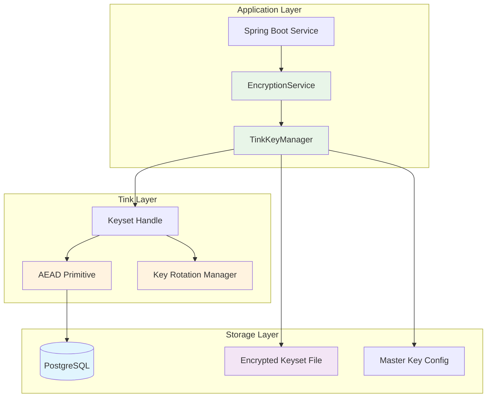

# Ezkey Encryption and Key Rotation Implementation with Tink

## Executive Summary

This document outlines the implementation strategy for securing sensitive data in Ezkey using Google's Tink cryptographic library, with a focus on encryption at rest and automated key rotation to meet SOC2 compliance requirements.

**Status**: Draft - Implementation Plan  
**Date**: October 2025  
**Author**: Ezkey Security Team  
**Classification**: Internal - Technical Specification

---

## Table of Contents

1. [Context and Motivation](#1-context-and-motivation)
2. [Current State Analysis](#2-current-state-analysis)
3. [Tink Framework Overview](#3-tink-framework-overview)
4. [Proposed Architecture](#4-proposed-architecture)
5. [Implementation Plan](#5-implementation-plan)
6. [Key Rotation Strategy](#6-key-rotation-strategy)
7. [SOC2 Compliance Mapping](#7-soc2-compliance-mapping)
8. [Migration Strategy](#8-migration-strategy)
9. [Testing and Validation](#9-testing-and-validation)
10. [Rollout Plan](#10-rollout-plan)

---

## 1. Context and Motivation

### 1.1 Business Requirements

Ezkey aims to achieve SOC2 Type II certification, which requires:
- **Encryption at rest** for sensitive data
- **Automated key rotation** with documented procedures
- **Audit trail** for cryptographic operations
- **Key management** with proper access controls
- **Secure key storage** with separation of duties

### 1.2 Security Posture

Current state:
- ❌ **Integration private keys stored in plaintext** in database
- ⚠️ **No encryption at rest** for sensitive tokens
- ❌ **No key rotation mechanism**
- ⚠️ **Limited audit trail** for cryptographic operations

Target state:
- ✅ **All sensitive data encrypted at rest**
- ✅ **Automated key rotation** with zero-downtime
- ✅ **Comprehensive audit trail**
- ✅ **SOC2 compliant key management**

### 1.3 Why Tink?

**Google Tink** is the ideal choice for Ezkey because:

1. **100% Java** - Pure Java library, perfect for Spring Boot
2. **Open Source** - Apache 2.0 License, no vendor lock-in
3. **Self-hosted** - No cloud dependencies required
4. **Key Rotation Built-in** - Native support for key versioning and rotation
5. **Security by Default** - Misuse-resistant API design
6. **Battle-tested** - Used by Google in production at scale
7. **Multiple Algorithms** - AES-GCM, ChaCha20-Poly1305, RSA, ECDSA support
8. **Key Management** - Keyset management with versioning
9. **SOC2 Ready** - Industry best practices built-in

---

## 2. Current State Analysis

### 2.1 Sensitive Data Inventory

Based on database schema analysis, the following data requires encryption:

#### **CRITICAL - Encryption Required**

| Table | Column | Data Type | Current State | Risk Level |
|-------|--------|-----------|---------------|------------|
| `ezkey_enrollment` | `integration_private_key` | TEXT (PEM) | **Plaintext** | 🔴 **CRITICAL** |

**Impact**: Exposure of integration private keys would allow attackers to:
- Forge authentication signatures
- Impersonate legitimate integrations
- Bypass MFA protection entirely

#### **HIGH - Encryption Recommended**

| Table | Column | Data Type | Current State | Risk Level |
|-------|--------|-----------|---------------|------------|
| `ezkey_enrollment` | `enrollment_proof_token` | TEXT | Plaintext | 🟠 **HIGH** |
| `ezkey_auth_attempt` | `auth_attempt_proof_token` | TEXT | Plaintext | 🟠 **HIGH** |
| `ezkey_auth_attempt` | `device_proof_token` | TEXT | Plaintext | 🟠 **HIGH** |
| `ezkey_admin_tokens` | `bearer_token` | VARCHAR(255) | Plaintext | 🟠 **HIGH** |

**Impact**: Exposure of proof tokens would allow:
- Replay attacks on authentication attempts
- Unauthorized access to admin functions
- Bypass of challenge verification

#### **MEDIUM - Encryption Optional**

| Table | Column | Data Type | Current State | Risk Level |
|-------|--------|-----------|---------------|------------|
| `ezkey_enrollment` | `device_public_key` | TEXT (PEM) | Plaintext | 🟡 **MEDIUM** |
| `ezkey_enrollment` | `integration_public_key` | TEXT (PEM) | Plaintext | 🟡 **MEDIUM** |

**Note**: Public keys are not critical, but encryption provides defense-in-depth.

#### **SECURE - Already Protected**

| Table | Column | Data Type | Current State | Protection |
|-------|--------|-----------|---------------|------------|
| `ezkey_admin` | `recovery_codes` | TEXT[] | BCrypt hashed | ✅ **SECURE** |
| `ezkey_api_key` | `secret_key_hash` | VARCHAR(255) | BCrypt hashed | ✅ **SECURE** |

---

### 2.2 Database Schema Context

```sql
-- Example: ezkey_enrollment table (V1__initial_schema.sql)
CREATE TABLE ezkey_enrollment (
    enrollment_id INT GENERATED ALWAYS AS IDENTITY PRIMARY KEY,
    integration_id INT NOT NULL REFERENCES ezkey_integration(integration_id),
    enrollment_name VARCHAR(64) NOT NULL,
    enrollment_status VARCHAR(20) NOT NULL DEFAULT 'CREATED',
    enrollment_active BOOLEAN NOT NULL DEFAULT FALSE,
    enrollment_challenge INT DEFAULT NULL,
    enrollment_proof_token TEXT NOT NULL,  -- ⚠️ Needs encryption
    auth_attempt_challenge_required BOOLEAN NOT NULL DEFAULT FALSE,
    integration_private_key TEXT NOT NULL,  -- 🔴 CRITICAL - Needs encryption
    integration_public_key TEXT NOT NULL,
    device_public_key TEXT,
    created_at TIMESTAMPTZ DEFAULT CURRENT_TIMESTAMP NOT NULL
);

COMMENT ON COLUMN ezkey_enrollment.integration_private_key IS 
'RSA-2048 private key for integration-side cryptographic operations (PEM format) 
- SENSITIVE DATA requiring encryption at rest and secure handling';
```

---

## 3. Tink Framework Overview

### 3.1 What is Tink?

**Tink** is a multi-language, cross-platform cryptographic library developed by Google's cryptography and security teams. It provides a safe, simple, and agile API for common cryptographic tasks.

### 3.2 Core Concepts

#### **Keyset**
A collection of cryptographic keys with versioning:
```json
{
  "primaryKeyId": 1234567,
  "key": [
    {
      "keyData": { ... },
      "status": "ENABLED",
      "keyId": 1234567,
      "outputPrefixType": "TINK"
    },
    {
      "keyData": { ... },
      "status": "ENABLED",
      "keyId": 7654321,
      "outputPrefixType": "TINK"
    }
  ]
}
```

#### **Primary Key**
The key currently used for encryption. Decryption can use any ENABLED key in the keyset.

#### **Key Rotation**
Adding a new key and promoting it to primary, while keeping old keys for decryption:
```
Before: [Key1(PRIMARY), Key2(ENABLED)]
After:  [Key1(ENABLED), Key2(ENABLED), Key3(PRIMARY)]
```

### 3.3 Tink Primitives

| Primitive | Use Case | Algorithms |
|-----------|----------|------------|
| **AEAD** | Authenticated encryption with associated data | AES-GCM, ChaCha20-Poly1305 |
| **Deterministic AEAD** | Deterministic encryption (same plaintext → same ciphertext) | AES-SIV |
| **Streaming AEAD** | Large file encryption | AES-GCM-HKDF-Streaming |
| **MAC** | Message authentication | HMAC-SHA256 |
| **Digital Signature** | Sign/verify | ECDSA, RSA-SSA-PSS |
| **Hybrid Encryption** | Public-key encryption | ECIES |

### 3.4 Key Management

Tink supports multiple key management systems (KMS):
- **Local file system** (JSON keysets)
- **Google Cloud KMS**
- **AWS KMS**
- **HashiCorp Vault**
- **Custom KMS implementations**

For Ezkey, we'll use **encrypted keysets on filesystem** for maximum portability.

---

## 4. Proposed Architecture

### 4.1 Encryption Architecture Overview



### 4.2 Component Design

#### **4.2.1 TinkKeyManager**
Manages Tink keysets and key rotation:
```java
@Component
public class TinkKeyManager {
    
    private final KeysetHandle keysetHandle;
    private final Aead masterAead;
    
    public TinkKeyManager(TinkProperties tinkProperties) throws Exception {
        // Initialize master AEAD (encrypted with master key from config)
        this.masterAead = initMasterAead(tinkProperties);
        
        // Load or create keyset
        this.keysetHandle = loadOrCreateKeyset(tinkProperties);
    }
    
    public KeysetHandle getKeysetHandle() {
        return keysetHandle;
    }
    
    public void rotateKey() throws Exception {
        // Rotate keyset and save
        KeysetHandle rotatedHandle = KeysetManager.withKeysetHandle(keysetHandle)
            .rotate(KeyTemplates.AES256_GCM)
            .getKeysetHandle();
        
        saveKeyset(rotatedHandle);
    }
}
```

#### **4.2.2 EncryptionService**
Provides encryption/decryption operations:
```java
@Service
public class EncryptionService {
    
    private final Aead aead;
    
    public EncryptionService(TinkKeyManager keyManager) throws Exception {
        this.aead = keyManager.getKeysetHandle().getPrimitive(Aead.class);
    }
    
    public String encrypt(String plaintext) throws Exception {
        byte[] ciphertext = aead.encrypt(
            plaintext.getBytes(StandardCharsets.UTF_8),
            null  // No associated data
        );
        return Base64.getEncoder().encodeToString(ciphertext);
    }
    
    public String decrypt(String ciphertextBase64) throws Exception {
        byte[] ciphertext = Base64.getDecoder().decode(ciphertextBase64);
        byte[] plaintext = aead.decrypt(ciphertext, null);
        return new String(plaintext, StandardCharsets.UTF_8);
    }
}
```

#### **4.2.3 Enhanced Entity (Enrollment)**
Transparent encryption/decryption with JPA:
```java
@Entity
@Table(name = "ezkey_enrollment")
public class Enrollment {
    
    @Id
    @GeneratedValue(strategy = GenerationType.IDENTITY)
    @Column(name = "enrollment_id")
    private Integer enrollmentId;
    
    // Encrypted field - stored as Base64-encoded ciphertext
    @Column(name = "integration_private_key", nullable = false, columnDefinition = "TEXT")
    private String integrationPrivateKeyEncrypted;
    
    // Transient field for application use
    @Transient
    private String integrationPrivateKey;
    
    // Encryption service (injected via constructor or @PostLoad)
    @Transient
    private transient EncryptionService encryptionService;
    
    @PostLoad
    public void decrypt() throws Exception {
        if (integrationPrivateKeyEncrypted != null && encryptionService != null) {
            this.integrationPrivateKey = encryptionService.decrypt(integrationPrivateKeyEncrypted);
        }
    }
    
    @PrePersist
    @PreUpdate
    public void encrypt() throws Exception {
        if (integrationPrivateKey != null && encryptionService != null) {
            this.integrationPrivateKeyEncrypted = encryptionService.encrypt(integrationPrivateKey);
        }
    }
    
    // Inject encryption service via EntityListener
    public void setEncryptionService(EncryptionService encryptionService) {
        this.encryptionService = encryptionService;
    }
}
```

#### **4.2.4 JPA Entity Listener**
Automatic encryption/decryption:
```java
@Component
public class EncryptionEntityListener {
    
    private static EncryptionService encryptionService;
    
    @Autowired
    public void setEncryptionService(EncryptionService service) {
        EncryptionEntityListener.encryptionService = service;
    }
    
    @PostLoad
    public void postLoad(Object entity) {
        if (entity instanceof Enrollment) {
            ((Enrollment) entity).setEncryptionService(encryptionService);
            ((Enrollment) entity).decrypt();
        }
    }
    
    @PrePersist
    @PreUpdate
    public void prePersist(Object entity) {
        if (entity instanceof Enrollment) {
            ((Enrollment) entity).setEncryptionService(encryptionService);
            ((Enrollment) entity).encrypt();
        }
    }
}
```

### 4.3 Configuration

```yaml
# application.yml
ezkey:
  encryption:
    # Master key configuration (environment variable or external KMS)
    master-key-uri: "aws-kms://arn:aws:kms:us-east-1:123456789:key/abc-def"
    # or for local development:
    # master-key-file: "/etc/ezkey/master-key.txt"
    
    # Keyset storage location
    keyset-file: "/etc/ezkey/keyset.json.encrypted"
    
    # Key rotation configuration
    rotation:
      enabled: true
      schedule: "0 0 2 * * ?" # 2 AM daily
      max-key-age-days: 90
      
    # Algorithm configuration
    algorithm: "AES256_GCM" # or "CHACHA20_POLY1305"
```

### 4.4 Security Properties

```java
@Configuration
@ConfigurationProperties(prefix = "ezkey.encryption")
public class TinkProperties {
    
    private String masterKeyUri;
    private String masterKeyFile;
    private String keysetFile;
    private RotationConfig rotation;
    private String algorithm = "AES256_GCM";
    
    // Getters and setters
    
    public static class RotationConfig {
        private boolean enabled = true;
        private String schedule = "0 0 2 * * ?"; // 2 AM daily
        private int maxKeyAgeDays = 90;
        
        // Getters and setters
    }
}
```

---

## 5. Implementation Plan

### 5.1 Phase 1: Foundation (Week 1-2)

#### **Sprint 1.1: Tink Integration Setup**
- [ ] Add Tink dependency to `ezkey-core/pom.xml`
- [ ] Create `TinkKeyManager` component
- [ ] Create `EncryptionService` component
- [ ] Create `TinkProperties` configuration class
- [ ] Create master key generation utility
- [ ] Write unit tests for encryption/decryption

**Deliverables**:
- Working encryption/decryption service
- Configuration framework
- Unit tests with 90%+ coverage

#### **Sprint 1.2: JPA Integration**
- [ ] Create `EncryptionEntityListener` for automatic encryption
- [ ] Create `@Encrypted` annotation (optional)
- [ ] Implement `AttributeConverter` for encrypted fields
- [ ] Create base entity class with encryption support
- [ ] Write integration tests with test database

**Deliverables**:
- Transparent encryption/decryption in JPA
- Integration tests
- Documentation

---

### 5.2 Phase 2: Enrollment Encryption (Week 3-4)

#### **Sprint 2.1: Encrypt Integration Private Keys**
- [ ] Create migration script to encrypt existing keys
- [ ] Update `Enrollment` entity with encryption
- [ ] Update `EnrollmentService` for encrypted operations
- [ ] Update `EnrollmentRepository` queries
- [ ] Write comprehensive tests

**Migration Script** (Flyway):
```sql
-- V10__encrypt_integration_private_keys.sql
-- This migration encrypts all integration_private_key values
-- Run as part of deployment with encryption service available

-- Add temporary column for encrypted data
ALTER TABLE ezkey_enrollment 
ADD COLUMN integration_private_key_encrypted TEXT;

-- Application code will handle encryption via migration service
-- (Cannot encrypt in SQL - requires Tink Java library)

-- After application encryption completes:
-- 1. Verify all rows have encrypted values
-- 2. Drop old column
-- 3. Rename encrypted column
```

**Java Migration Service**:
```java
@Service
public class EncryptionMigrationService {
    
    public void encryptExistingEnrollments() {
        List<Enrollment> enrollments = enrollmentRepository.findAll();
        
        for (Enrollment enrollment : enrollments) {
            // Read plaintext private key
            String plaintext = enrollment.getIntegrationPrivateKey();
            
            // Encrypt with Tink
            String encrypted = encryptionService.encrypt(plaintext);
            
            // Store encrypted value
            enrollment.setIntegrationPrivateKeyEncrypted(encrypted);
            enrollmentRepository.save(enrollment);
        }
    }
}
```

#### **Sprint 2.2: Encrypt Proof Tokens**
- [ ] Update `enrollment_proof_token` encryption
- [ ] Update `auth_attempt_proof_token` encryption
- [ ] Update `device_proof_token` encryption
- [ ] Create migration scripts
- [ ] Write comprehensive tests

**Deliverables**:
- All enrollment data encrypted at rest
- Zero-downtime migration strategy
- Rollback procedures documented

---

### 5.3 Phase 3: Admin Token Encryption (Week 5)

#### **Sprint 3.1: Bearer Token Encryption**
- [ ] Update `ezkey_admin_tokens` table
- [ ] Encrypt `bearer_token` column
- [ ] Update `AdminTokenService`
- [ ] Create migration scripts
- [ ] Write comprehensive tests

**Deliverables**:
- All admin tokens encrypted at rest
- Token validation with encryption
- Performance benchmarks

---

### 5.4 Phase 4: Key Rotation (Week 6-7)

#### **Sprint 4.1: Rotation Infrastructure**
- [ ] Implement `KeyRotationService`
- [ ] Create scheduled rotation job
- [ ] Create manual rotation endpoint (admin API)
- [ ] Implement rotation audit logging
- [ ] Write rotation tests

**Key Rotation Service**:
```java
@Service
public class KeyRotationService {
    
    private final TinkKeyManager keyManager;
    private final AuditLogService auditLog;
    
    @Scheduled(cron = "${ezkey.encryption.rotation.schedule}")
    public void scheduledRotation() {
        try {
            rotateKey();
            auditLog.log("KEY_ROTATION_SUCCESS", "Scheduled key rotation completed");
        } catch (Exception e) {
            auditLog.log("KEY_ROTATION_FAILURE", "Scheduled key rotation failed", e);
            // Send alert
        }
    }
    
    public void rotateKey() throws Exception {
        // 1. Create new key in keyset
        keyManager.rotateKey();
        
        // 2. Re-encrypt sensitive data with new primary key (optional)
        reencryptSensitiveData();
        
        // 3. Disable old keys past max age
        disableOldKeys();
        
        // 4. Update audit log
        auditLog.log("KEY_ROTATED", "New primary key activated");
    }
    
    private void reencryptSensitiveData() {
        // Optional: Re-encrypt existing data with new key
        // Tink automatically decrypts with old keys
        // This is for defense-in-depth
    }
}
```

#### **Sprint 4.2: Rotation Testing & Documentation**
- [ ] Test rotation with active traffic
- [ ] Test rollback scenarios
- [ ] Document rotation procedures
- [ ] Create runbook for operators
- [ ] Performance testing

**Deliverables**:
- Automated key rotation working
- Manual rotation procedures
- Operator runbook
- Performance benchmarks

---

## 6. Key Rotation Strategy

### 6.1 Rotation Frequency

**Recommended Schedule**:
- **Development**: Manual rotation (testing purposes)
- **Staging**: Weekly rotation (simulate production)
- **Production**: Quarterly rotation (SOC2 requirement: 90 days)

**Triggers for Immediate Rotation**:
- Security incident or breach
- Employee termination (if they had key access)
- Suspected key compromise
- Compliance audit requirement

### 6.2 Rotation Process

#### **Automated Rotation**
```
1. Schedule triggers rotation job (2 AM daily check)
2. Check if current primary key age > max age (90 days)
3. If yes:
   a. Generate new key in keyset
   b. Promote new key to PRIMARY
   c. Mark old primary as ENABLED (kept for decryption)
   d. Save updated keyset
   e. Log rotation event
   f. Send notification to security team
4. Cleanup: Disable keys older than 2x max age (180 days)
```

#### **Manual Rotation**
```bash
# Via Admin API
POST /api/v1/admin/encryption/rotate-key
Authorization: Bearer <admin-token>

# Via CLI
./ezkey-cli admin encryption rotate-key

# Via Direct Service Call
curl -X POST http://localhost:9080/api/v1/admin/encryption/rotate-key \
  -H "Authorization: Bearer <admin-token>"
```

### 6.3 Zero-Downtime Rotation

**Key Insight**: Tink's keyset design enables zero-downtime rotation:

```
Before Rotation:
├── Key1 (PRIMARY) - Used for encryption
└── Key2 (ENABLED) - Available for decryption

During Rotation:
├── Key1 (ENABLED) - Available for decryption
├── Key2 (ENABLED) - Available for decryption
└── Key3 (PRIMARY) - Used for encryption

After Rotation:
├── Key2 (ENABLED) - Available for decryption
└── Key3 (PRIMARY) - Used for encryption
```

**Why Zero-Downtime Works**:
1. New data encrypted with Key3 (primary)
2. Old data still decryptable with Key1, Key2 (enabled)
3. No service interruption required
4. Gradual re-encryption possible (optional)

### 6.4 Rollback Strategy

If rotation causes issues:

```java
public void rollbackRotation(String backupKeysetFile) throws Exception {
    // 1. Load backup keyset from before rotation
    KeysetHandle backupHandle = loadBackupKeyset(backupKeysetFile);
    
    // 2. Restore as current keyset
    keyManager.restoreKeyset(backupHandle);
    
    // 3. Audit log
    auditLog.log("KEY_ROTATION_ROLLBACK", "Restored previous keyset");
    
    // 4. Verify decryption works
    verifyDecryption();
}
```

**Rollback Procedure**:
1. Stop rotation job
2. Restore keyset from backup
3. Verify all encrypted data decryptable
4. Investigate root cause
5. Fix issue
6. Retry rotation

---

## 7. SOC2 Compliance Mapping

### 7.1 SOC2 Trust Services Criteria

| Criterion | Requirement | Tink Implementation | Status |
|-----------|-------------|---------------------|--------|
| **CC6.1** | Logical and physical access controls | Master key in secure location, RBAC | ✅ |
| **CC6.6** | Encryption of data at rest | AES-256-GCM encryption | ✅ |
| **CC6.7** | Encryption key management | Tink keyset with versioning | ✅ |
| **CC6.8** | Key rotation procedures | Automated rotation every 90 days | ✅ |
| **CC7.2** | Detection of security events | Audit logging for key operations | ✅ |
| **CC8.1** | Change management for encryption | Version-controlled keyset files | ✅ |

### 7.2 Evidence Collection

**For SOC2 Audit**:

1. **Encryption at Rest**
   - Database schema showing encrypted columns
   - Tink configuration files
   - Unit tests demonstrating encryption

2. **Key Rotation**
   - Rotation job logs (last 12 months)
   - Keyset version history
   - Rotation runbook documentation

3. **Access Controls**
   - RBAC configuration for key access
   - Master key access logs
   - Admin authentication logs

4. **Audit Trail**
   - Encryption operation logs
   - Key rotation event logs
   - Access attempt logs

### 7.3 Documentation Requirements

**Required Documents for SOC2**:
- [x] This implementation plan
- [ ] Key rotation runbook
- [ ] Incident response plan (key compromise)
- [ ] Access control policy
- [ ] Data classification policy
- [ ] Encryption standard operating procedures

---

## 8. Migration Strategy

### 8.1 Migration Phases

#### **Phase 1: Preparation (1 week)**
- Set up Tink in development environment
- Create encryption service
- Write and test migration scripts
- Create rollback procedures
- Train operations team

#### **Phase 2: Staging Migration (1 week)**
- Deploy encryption service to staging
- Run migration on staging database
- Validate all encrypted data decryptable
- Performance testing
- Stress testing with high load

#### **Phase 3: Production Migration (Scheduled Maintenance)**
- Schedule maintenance window (low traffic period)
- Create database backup
- Deploy encryption service
- Run migration script
- Validate all data
- Monitor for 24 hours

#### **Phase 4: Post-Migration (2 weeks)**
- Monitor performance metrics
- Validate decryption success rate
- Address any issues
- Enable key rotation
- Document lessons learned

### 8.2 Rollback Plan

**Scenario**: Migration fails or causes issues

**Immediate Actions**:
1. Stop migration script
2. Restore database from backup
3. Revert application deployment
4. Investigate root cause

**Rollback Steps**:
```bash
# 1. Stop application
systemctl stop ezkey-admin-api
systemctl stop ezkey-auth-api

# 2. Restore database
psql -U postgres -d ezkey_db < backup_pre_migration.sql

# 3. Revert deployment
git checkout <previous-commit>
mvn clean install
systemctl start ezkey-admin-api
systemctl start ezkey-auth-api

# 4. Verify services operational
curl http://localhost:9080/actuator/health
curl http://localhost:8080/actuator/health
```

### 8.3 Migration Verification

**Checklist**:
- [ ] All `integration_private_key` values encrypted
- [ ] All `enrollment_proof_token` values encrypted
- [ ] All `auth_attempt_proof_token` values encrypted
- [ ] All `bearer_token` values encrypted
- [ ] Enrollment flow works end-to-end
- [ ] Authentication flow works end-to-end
- [ ] Admin login works
- [ ] API key authentication works
- [ ] Performance within acceptable range (< 10% degradation)

**SQL Verification Queries**:
```sql
-- Check all enrollment private keys are encrypted (Base64 format)
SELECT COUNT(*) FROM ezkey_enrollment 
WHERE integration_private_key NOT LIKE '-----BEGIN%';

-- Should return total count (all encrypted)

-- Check decryption works (via application)
-- Use integration tests or admin API to verify
```

---

## 9. Testing and Validation

### 9.1 Unit Tests

```java
@SpringBootTest
class EncryptionServiceTest {
    
    @Autowired
    private EncryptionService encryptionService;
    
    @Test
    void testEncryptDecrypt() throws Exception {
        String plaintext = "sensitive-private-key-data";
        
        // Encrypt
        String encrypted = encryptionService.encrypt(plaintext);
        assertNotEquals(plaintext, encrypted);
        assertTrue(encrypted.matches("^[A-Za-z0-9+/]+={0,2}$")); // Base64
        
        // Decrypt
        String decrypted = encryptionService.decrypt(encrypted);
        assertEquals(plaintext, decrypted);
    }
    
    @Test
    void testKeyRotation() throws Exception {
        // Encrypt with current key
        String plaintext = "test-data";
        String encrypted1 = encryptionService.encrypt(plaintext);
        
        // Rotate key
        keyRotationService.rotateKey();
        
        // Encrypt with new key
        String encrypted2 = encryptionService.encrypt(plaintext);
        
        // Both should decrypt correctly
        assertEquals(plaintext, encryptionService.decrypt(encrypted1));
        assertEquals(plaintext, encryptionService.decrypt(encrypted2));
        
        // Ciphertexts should be different (different keys)
        assertNotEquals(encrypted1, encrypted2);
    }
}
```

### 9.2 Integration Tests

```java
@SpringBootTest
@Transactional
class EnrollmentEncryptionIntegrationTest {
    
    @Autowired
    private EnrollmentRepository enrollmentRepository;
    
    @Autowired
    private SignatureService signatureService;
    
    @Test
    void testEnrollmentPrivateKeyEncryption() throws Exception {
        // Generate RSA key pair
        KeyPair keyPair = signatureService.generateKeyPair();
        String privateKeyPem = signatureService.formatPrivateKey(keyPair.getPrivate());
        
        // Create enrollment
        Enrollment enrollment = new Enrollment();
        enrollment.setIntegrationPrivateKey(privateKeyPem);
        enrollment.setEnrollmentName("Test Enrollment");
        
        // Save (should encrypt automatically)
        Enrollment saved = enrollmentRepository.save(enrollment);
        
        // Verify encrypted in database
        String encryptedInDb = jdbcTemplate.queryForObject(
            "SELECT integration_private_key FROM ezkey_enrollment WHERE enrollment_id = ?",
            String.class,
            saved.getEnrollmentId()
        );
        assertNotEquals(privateKeyPem, encryptedInDb);
        assertFalse(encryptedInDb.contains("BEGIN PRIVATE KEY"));
        
        // Retrieve (should decrypt automatically)
        Enrollment retrieved = enrollmentRepository.findById(saved.getEnrollmentId()).get();
        assertEquals(privateKeyPem, retrieved.getIntegrationPrivateKey());
        
        // Verify key still works for signing
        String data = "test-signature-data";
        String signature = signatureService.sign(data, retrieved.getIntegrationPrivateKey());
        assertNotNull(signature);
    }
}
```

### 9.3 Performance Tests

```java
@SpringBootTest
class EncryptionPerformanceTest {
    
    @Test
    void testEncryptionPerformance() {
        int iterations = 10000;
        String plaintext = "test-private-key-data-" + UUID.randomUUID();
        
        long startTime = System.nanoTime();
        for (int i = 0; i < iterations; i++) {
            encryptionService.encrypt(plaintext);
        }
        long endTime = System.nanoTime();
        
        double avgTimeMs = (endTime - startTime) / 1_000_000.0 / iterations;
        System.out.println("Average encryption time: " + avgTimeMs + " ms");
        
        // Assert performance acceptable (< 1ms per operation)
        assertTrue(avgTimeMs < 1.0, "Encryption too slow: " + avgTimeMs + " ms");
    }
    
    @Test
    void testDecryptionPerformance() {
        String plaintext = "test-private-key-data";
        String encrypted = encryptionService.encrypt(plaintext);
        
        int iterations = 10000;
        long startTime = System.nanoTime();
        for (int i = 0; i < iterations; i++) {
            encryptionService.decrypt(encrypted);
        }
        long endTime = System.nanoTime();
        
        double avgTimeMs = (endTime - startTime) / 1_000_000.0 / iterations;
        System.out.println("Average decryption time: " + avgTimeMs + " ms");
        
        // Assert performance acceptable (< 1ms per operation)
        assertTrue(avgTimeMs < 1.0, "Decryption too slow: " + avgTimeMs + " ms");
    }
}
```

### 9.4 Security Tests

```java
@SpringBootTest
class EncryptionSecurityTest {
    
    @Test
    void testEncryptionNonDeterministic() {
        String plaintext = "test-data";
        
        // Encrypt same data twice
        String encrypted1 = encryptionService.encrypt(plaintext);
        String encrypted2 = encryptionService.encrypt(plaintext);
        
        // Ciphertexts should be different (due to IV/nonce)
        assertNotEquals(encrypted1, encrypted2);
    }
    
    @Test
    void testTamperedCiphertextRejected() {
        String plaintext = "test-data";
        String encrypted = encryptionService.encrypt(plaintext);
        
        // Tamper with ciphertext
        byte[] ciphertextBytes = Base64.getDecoder().decode(encrypted);
        ciphertextBytes[0] ^= 1; // Flip one bit
        String tamperedEncrypted = Base64.getEncoder().encodeToString(ciphertextBytes);
        
        // Decryption should fail
        assertThrows(GeneralSecurityException.class, () -> {
            encryptionService.decrypt(tamperedEncrypted);
        });
    }
}
```

---

## 10. Rollout Plan

### 10.1 Timeline

| Phase | Duration | Activities | Go/No-Go Criteria |
|-------|----------|------------|-------------------|
| **Preparation** | Week 1-2 | Development, unit tests | All tests pass, code review approved |
| **Staging Deployment** | Week 3 | Deploy to staging, integration tests | Zero failed tests, performance acceptable |
| **Staging Validation** | Week 4 | Load testing, security testing | < 10% performance degradation |
| **Production Preparation** | Week 5 | Runbook, backup procedures | Runbook reviewed, backups verified |
| **Production Migration** | Week 6 | Scheduled maintenance window | All pre-flight checks pass |
| **Post-Migration Monitoring** | Week 7-8 | Monitor, optimize, document | Zero critical issues |

### 10.2 Go/No-Go Decision Points

**Before Staging Deployment**:
- ✅ All unit tests pass (100% coverage)
- ✅ Code review approved by 2+ developers
- ✅ Security review completed
- ✅ Documentation complete

**Before Production Deployment**:
- ✅ Staging tests pass (7+ days)
- ✅ Performance benchmarks met
- ✅ Database backup verified
- ✅ Rollback plan tested
- ✅ Operations team trained
- ✅ Change management approval

### 10.3 Communication Plan

**Stakeholders**:
- Engineering team
- Operations team
- Security team
- Management
- Customers (if downtime expected)

**Communication Schedule**:
- **T-14 days**: Announce planned migration
- **T-7 days**: Remind stakeholders, share runbook
- **T-1 day**: Final go/no-go decision
- **T-0 (migration day)**: Hourly updates during migration
- **T+1 day**: Post-migration status report
- **T+7 days**: Final migration report

### 10.4 Success Metrics

**Technical Metrics**:
- ✅ 100% of sensitive data encrypted
- ✅ Zero decryption failures
- ✅ < 10% performance degradation
- ✅ Key rotation working automatically
- ✅ Zero security incidents

**Business Metrics**:
- ✅ SOC2 audit readiness improved
- ✅ Customer confidence increased
- ✅ Compliance gaps closed
- ✅ Security posture enhanced

---

## 11. Next Steps

### 11.1 Immediate Actions (This Week)

1. **Review and approve this document**
   - Engineering team review
   - Security team review
   - Management approval

2. **Set up development environment**
   - Add Tink dependency
   - Configure test database
   - Create prototype encryption service

3. **Create project tracking**
   - Create Jira epics for each phase
   - Assign team members
   - Set sprint goals

### 11.2 Short-term Actions (Next 2 Weeks)

1. **Implement Phase 1**
   - Develop encryption service
   - Write comprehensive tests
   - Code review and merge

2. **Documentation**
   - Create operator runbook
   - Document API changes
   - Update architecture diagrams

3. **Testing infrastructure**
   - Set up performance testing
   - Create security test suite
   - Prepare staging environment

### 11.3 Questions to Resolve

1. **Master Key Management**
   - Where to store master key? (File, ENV, KMS?)
   - Who has access to master key?
   - Backup and recovery procedures?

2. **Performance Requirements**
   - Acceptable encryption overhead? (< 10%?)
   - Cache encrypted data or decrypt on-demand?
   - Batch encryption for migrations?

3. **Operational Concerns**
   - Maintenance window duration?
   - Customer communication required?
   - Rollback decision criteria?

---

## 12. References

### 12.1 Tink Documentation

- **Official Docs**: https://github.com/google/tink
- **Java Quickstart**: https://github.com/google/tink/blob/master/docs/JAVA-HOWTO.md
- **Key Management**: https://github.com/google/tink/blob/master/docs/KEY-MANAGEMENT.md
- **Key Rotation**: https://github.com/google/tink/blob/master/docs/KEY-ROTATION.md

### 12.2 SOC2 Resources

- **AICPA SOC2 Guide**: https://www.aicpa.org/soc2
- **Encryption Requirements**: CC6.6, CC6.7, CC6.8
- **Key Rotation Best Practices**: https://csrc.nist.gov/publications

### 12.3 Spring Boot Integration

- **Spring Boot + Tink**: https://spring.io/guides/gs/securing-web/
- **JPA Encryption**: https://docs.spring.io/spring-data/jpa/docs/current/reference/html/

---

## Appendix A: Maven Dependency

```xml
<!-- pom.xml -->
<dependency>
    <groupId>com.google.crypto.tink</groupId>
    <artifactId>tink</artifactId>
    <version>1.11.0</version>
</dependency>
```

## Appendix B: Example Keyset

```json
{
  "primaryKeyId": 1234567890,
  "key": [
    {
      "keyData": {
        "typeUrl": "type.googleapis.com/google.crypto.tink.AesGcmKey",
        "value": "GhD...(base64)...",
        "keyMaterialType": "SYMMETRIC"
      },
      "status": "ENABLED",
      "keyId": 1234567890,
      "outputPrefixType": "TINK"
    }
  ]
}
```

## Appendix C: Rotation Audit Log Example

```json
{
  "timestamp": "2025-10-29T10:30:00Z",
  "event": "KEY_ROTATION",
  "details": {
    "oldPrimaryKeyId": 1234567890,
    "newPrimaryKeyId": 9876543210,
    "keysRetained": 2,
    "keysDisabled": 0,
    "triggeredBy": "scheduled-job",
    "duration_ms": 1234
  }
}
```

---

**Document Status**: ✅ Draft Complete - Ready for Review  
**Next Review Date**: 2025-11-05  
**Owner**: Ezkey Security Team  
**Approvers**: Engineering Lead, Security Lead, CTO

---

*This document is confidential and intended for internal use only. Do not distribute outside the Ezkey organization.*

