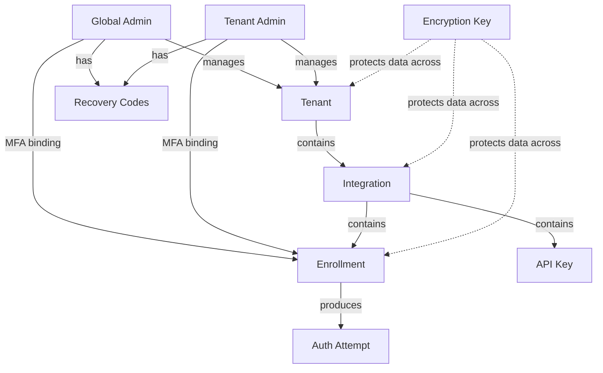
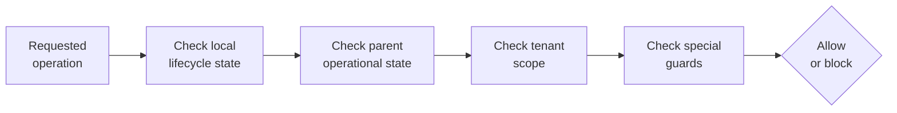
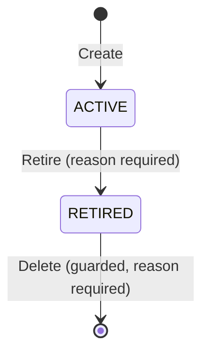
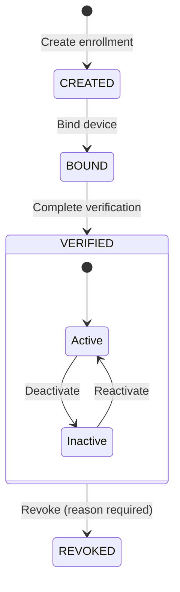

# Ezkey Lifecycle Governance

This document describes the mental model behind Ezkey's domain entities, explains how they relate to each other, and defines the lifecycle rules that govern what operators can and cannot do with each entity. It is written for anyone who operates an Ezkey instance in production — whether you are setting up your first tenant or handling a credential compromise three months in.

The document is structured in two parts. The first part (sections 1–3) builds the conceptual model: what the entities are, how operational status propagates, and which principles drive the lifecycle rules. The second part (sections 4–6) is a reference you can come back to: entity-by-entity actions, guardrails, real-world scenarios, and quick-lookup tables.

---

## 1. The Ezkey Domain at a Glance

Ezkey is a cryptographic MFA platform. Its domain model is a hierarchy of organizational and security entities, each with a clear business role:

| Entity | What it is |
|--------|-----------|
| **Tenant** | An organizational boundary — a company, a business unit, or any distinct operational scope. Everything lives under a tenant. |
| **Integration** | An application or service that uses Ezkey for authentication. Each integration belongs to one tenant. |
| **Enrollment** | A cryptographic credential binding a user (or an admin) to an integration. This is the core security object — it represents the trust relationship between a person's device and the system. |
| **API Key** | A machine credential that allows an integration's backend to call Ezkey APIs. Scoped to one integration. |
| **Admin** | A human operator who manages the Ezkey instance. **Global Admins** manage platform-wide concerns (encryption keys, system configuration). **Tenant Admins** manage their tenant's day-to-day operations (integrations, enrollments, API keys). |
| **Authentication Attempt** | A transient event representing a single authentication request. Not operator-managed — it is created and resolved automatically based on parent state. |
| **Encryption Key** | A platform protection asset that secures data at rest. Managed through a specialized two-layer lifecycle (cryptographic role + operator lifecycle). |
| **Recovery Codes** | Emergency one-time-use codes for account recovery. Consumable artifacts with a simple generate-and-replace lifecycle. |

### Entity hierarchy

The diagram below shows how entities relate to each other. The hierarchy flows top-down: a tenant contains integrations, an integration contains enrollments and API keys. Admins are attached to tenants (or operate globally). Encryption keys protect data across the hierarchy.

**Key relationships to remember:**

- A **tenant** is the master organizational switch. When a tenant is inactive, everything underneath it is effectively blocked.
- An **integration** is the application container. Enrollments and API keys cannot function if their integration is no longer active.
- An **enrollment** is the security anchor. It is the entity that gets revoked when a credential is compromised.
- An **API key** is a machine credential with an intentionally asymmetric lifecycle: once revoked, it is gone forever.
- An **admin** has an identity lifecycle (active/inactive) that is separate from their MFA credential (enrollment). Deactivating an admin does not revoke their enrollment, and revoking their enrollment does not delete their admin identity.

---

## 2. Core Concepts

### 2.1 Operational Status and the Eligibility Chain

Every entity in Ezkey has a local state (active, retired, revoked, etc.) and an **operational status** that reflects whether the entity can actually be used right now. The operational status is computed at runtime by evaluating the entire parent chain — not just the entity itself.

An enrollment might be verified and active, but if its parent integration is retired or its grandparent tenant is deactivated, the enrollment is **not operational**. Authentication will be blocked.

This is a deliberate design choice: **Ezkey does not cascade state changes down the hierarchy.** When you deactivate a tenant, the tenant's child integrations, enrollments, and API keys keep their own local state unchanged. What changes is their effective operational capability — it is blocked at runtime until the tenant is reactivated. This means:

- **Reversibility is clean.** Reactivating the tenant immediately restores everything that was locally healthy.
- **Audit history is truthful.** Each entity's state reflects only the actions taken directly on it.
- **There is no cascade to undo.** You never have to remember which children were individually active before the parent was suspended.

The eligibility evaluation follows a consistent order:

1. **Local state** — Is the entity itself in a usable state? (active, verified, not revoked, not expired)
2. **Parent state** — Is the immediate parent operational? (integration active, not retired)
3. **Tenant scope** — Is the tenant active?
4. **Special guards** — System-tenant protections, minimum-admin rules, admin-MFA enrollment guards.

If any check fails, the operation is blocked. The Admin UI surfaces this as a warning when an entity looks locally healthy but is not operational due to its parent chain.

### 2.2 Reversible vs. Irreversible Actions

Ezkey draws a clear line between actions you can undo and actions you cannot. This distinction is the operator's most important decision framework.

**Reversible actions** — used for investigation, temporary holds, and operational pauses:

- **Deactivate / Reactivate** — Turns an entity off and back on. The entity keeps its identity and history. Use this when you are not sure yet: a suspicious enrollment, a tenant under investigation, an admin on leave.

**Irreversible actions** — used when the situation is confirmed and final:

- **Revoke** — Permanently invalidates a credential. The enrollment or API key can never be used again. Use this for confirmed compromise, permanent credential withdrawal, or end-of-life for a machine credential.
- **Retire** — Removes an integration from operational use while preserving its history. The integration cannot be "un-retired." Use this when an application is being decommissioned.
- **Delete** — Physical removal of an entity. Only allowed under strict preconditions and only for entities where cleanup makes operational sense (integrations and enrollments). Use this for housekeeping — removing test records or mistaken entries that never became operationally meaningful.

**The operating principle is simple:** when in doubt, deactivate first. You can always escalate to revoke later, but you cannot un-revoke.

### 2.3 Reason Policy

Some lifecycle actions require a written reason. The policy is anchored in a straightforward principle: **if an action is irreversible and has security implications, the reason must be recorded for auditability.** Reasons help reconstruct the real-world story behind an action — not for compliance theater, but so that a colleague reviewing the audit log six months later can understand why a credential was revoked or an integration was deleted.

| Action type | Reason policy |
|------------|--------------|
| Irreversible credential invalidation (revoke) | **Required** |
| Physical deletion (delete) | **Required** |
| Integration retirement (retire) | **Required** |
| Reversible toggle (deactivate, reactivate, activate) | **Optional** — encouraged for sensitive actions |
| Automatic expiration | No reason needed — policy-driven |

---

## 3. Entity Reference

### 3.1 Tenant

**Purpose.** A tenant is an organizational boundary. It represents a company, a department, or any distinct scope of operations. All integrations, enrollments, API keys, and tenant admins exist within a tenant.

**Lifecycle.** Tenants have a simple active/inactive toggle. There is no retirement or deletion in the current model — deactivation covers all operational needs including offboarding and crisis response.

**Available actions:**

| Action | Allowed | Reversible | Reason | Effect on children |
|--------|---------|------------|--------|--------------------|
| Create | Yes | — | — | Creates new organizational scope |
| Deactivate | Yes ¹ | Yes | Optional | All children blocked at runtime — no persistent cascade |
| Reactivate | Yes | Yes | Optional | All locally healthy children resume normal operation |
| Delete | No ² | — | — | — |

¹ The **system tenant** cannot be deactivated — it is a protected root entity.
² Tenant deletion is not supported. Deactivation covers temporary suspension; permanent offboarding and data retention are deferred to a future phase.

**Guardrails and rationale:**

- **System tenant protection.** The system tenant is the platform's root organizational entity. Deactivating it would take down the entire instance — this is prevented by a hard guard.
- **No persistent cascade on deactivation.** When you deactivate a tenant, integrations, enrollments, and API keys keep their own state. The runtime eligibility chain blocks their use until the tenant is reactivated. This means reactivation is instant and clean — nothing to reconcile.
- **No delete.** Deleting a tenant would orphan all its children, destroy audit history, and raise data retention questions. Deactivation is the operationally complete answer for all current scenarios.

**Downstream impact.** A deactivated tenant blocks:
- All authentication through any of its enrollments
- All API key validation for any of its integrations
- All administrative actions by its tenant admins
- Creation of new integrations, enrollments, or API keys under it

Reactivation reverses all of the above immediately.

---

### 3.2 Integration

**Purpose.** An integration represents an application or service that uses Ezkey for authentication. It is the container for enrollments (user credentials) and API keys (machine credentials).

**Lifecycle.** Integrations have two states: **Active** and **Retired**. There is no intermediate "inactive" state — this was deliberately removed to avoid ambiguity. An integration is either in service or it is decommissioned.

**Available actions:**

| Action | Allowed | Reversible | Reason | Effect on children |
|--------|---------|------------|--------|--------------------|
| Create | Yes | — | — | Enables enrollments and API keys |
| Retire | Yes | No | Required | Blocks new enrollments and auth; existing enrollments and API keys keep their state but become non-operational |
| Delete | Conditional ¹ | No | Required | Removes the integration and its remaining data |
| Deactivate | No ² | — | — | — |

¹ Delete requires: integration is RETIRED **and** zero enrollments remain.
² There is no reversible deactivation for integrations. Operators manage individual child entities (enrollments, API keys) directly.

**Why there is no "Inactive" state.** An earlier version of the model had three states: Active, Inactive, and Retired. In practice, "Inactive" created confusion — it was unclear how it differed from "Retired" for the operator, and it introduced a reversible middle ground that did not map to a real-world scenario for integrations. Applications are either running or being decommissioned. If an operator needs to temporarily block access, they deactivate individual enrollments or revoke specific API keys — which is more precise and leaves a clearer audit trail.

**Guardrails and rationale:**

- **No delete with active enrollments.** Enrollments represent real user credentials. Deleting their parent integration would orphan them. The guard ensures you explicitly deal with all credentials before cleanup.
- **Retire is the primary decommissioning action.** It preserves the integration's identity, its enrollment history, and its audit trail. Delete is for housekeeping after the fact.
- **Reason required for retire and delete.** Both are irreversible and affect downstream entities. The reason documents why the application was decommissioned or its record removed.

**Downstream impact.** A retired integration blocks:
- New enrollment creation under it
- Authentication through any of its enrollments (via eligibility chain)
- API key validation for any of its keys

Existing enrollments and API keys retain their local state — if the design ever evolves to support un-retiring an integration, everything would resume cleanly. But currently, retirement is terminal.

---

### 3.3 Enrollment

**Purpose.** An enrollment is a cryptographic credential binding a user's device (or an admin's MFA device) to an integration. It is the core security object — the thing that gets deactivated during investigation and revoked during confirmed compromise.

**Lifecycle.** Enrollments have the most structured lifecycle in Ezkey, modeled as a finite-state machine with two independent dimensions: a **status** enum (the credential's lifecycle stage) and an **active** flag (the operator's on/off switch for verified enrollments).

Living status enum values also include terminal / failure paths such as `EXPIRED` and `INVALID`
(not shown above). Do not use a fictional `PENDING` status — the invitation window is `CREATED` /
`BOUND` before `VERIFIED`. Omitted create `expiresAt` uses `ezkey.enrollment.pending-expiration-days`
(default 7 days); that clock is the pending invitation window only, not a post-`VERIFIED` lifetime.

- **CREATED** → Enrollment invitation exists; device has not bound yet.
- **BOUND** → Device claimed the invitation; cryptographic verify not finished.
- **VERIFIED + Active** → The enrollment is fully operational. Authentication attempts are allowed.
- **VERIFIED + Inactive** → The enrollment is temporarily suspended. Authentication is blocked, but the credential can be reactivated.
- **REVOKED** → The enrollment is permanently invalidated. It cannot be reactivated or used again.

**Available actions:**

| Action | Allowed | Reversible | Reason | Effect |
|--------|---------|------------|--------|--------|
| Create | Yes | — | — | Initiates credential binding |
| Deactivate | Yes (VERIFIED + active only) | Yes | Optional | Blocks authentication |
| Reactivate | Yes (VERIFIED + inactive only) | Yes | Optional | Restores authentication |
| Revoke | Yes (VERIFIED only) | No | Required | Permanently invalidates credential |
| Delete | Conditional ¹ | No | Required | Physically removes enrollment record |

¹ Delete requires: zero authentication history **and** enrollment is not linked as any admin's MFA enrollment.

**Deactivate vs. Revoke — when to use which.**

This is the most important operational distinction in Ezkey:

- **Deactivate** when you are not sure. A user reports a lost device. A security alert flags suspicious activity. You want to stop authentication immediately while you investigate. If the situation resolves — the device is found, the alert is a false positive — you reactivate. No credential is destroyed, no re-enrollment is needed.
- **Revoke** when you are sure. The device is confirmed compromised. The user has left the organization. The credential must never be used again. Revocation is permanent — the user will need a new enrollment.

**Guardrails and rationale:**

- **No delete with authentication history.** If an enrollment was ever used for authentication, its record is part of the audit trail. Deleting it would create gaps in the security log. Delete is reserved for cleanup of test, mistaken, or never-used enrollments.
- **No delete of admin MFA enrollments.** An admin's MFA enrollment is a critical security binding. Deleting it directly would bypass the admin lifecycle — if an admin's credential needs to be invalidated, revoke it through the normal revocation flow.
- **Reason required for revoke and delete.** Both are irreversible and security-significant. The reason documents the real-world event that triggered the action.
- **Dual model (status + active flag) is intentional.** The `status` enum tracks the credential's lifecycle stage (`CREATED` / `BOUND` → `VERIFIED` → `REVOKED`, plus failure/expiry terminals). The `active` flag is the operator's independent on/off switch within the verified stage. Collapsing these into a single enum would lose expressiveness: you would not be able to distinguish "temporarily suspended for investigation" from "permanently invalidated."
- **Name uniqueness is status-based, not active-based.** At most one `VERIFIED` enrollment may exist per `(integration_id, enrollment_name)` (partial unique index `idx_enrollment_unique_verified_name`). Multiple non-`VERIFIED` rows with the same name are allowed (retry). Create rejects when an **active** `VERIFIED` enrollment already exists for that name; create may proceed when a `VERIFIED` row exists but is **inactive**. Verify rejects when **any** `VERIFIED` row already exists for that name (including inactive). There is **no** auth-attempt-style supersession: replacing an active verified credential goes through the explicit recovery / reset path (`POST /api/v1/admin/auth/recover` then `POST /api/v1/admin/enrollments/reset` for admins; operators re-enroll end users after deactivate/revoke as appropriate). Enforcement: DB index plus `EnrollmentService` / `EnrollmentVerifyService`.

**Downstream impact.** A deactivated or revoked enrollment blocks:
- All authentication attempts using that credential
- If this is an admin's MFA enrollment: the admin's ability to log in (even if the admin identity is still active)

---

### 3.4 API Key

**Purpose.** An API key is a machine credential that allows an integration's backend server to authenticate against Ezkey's APIs. It is scoped to one integration.

**Lifecycle.** API keys have an intentionally asymmetric lifecycle: they can be created and revoked, but never reactivated, deactivated, or deleted. This reflects the nature of machine credentials — they are either valid or they are not. There is no "temporarily suspend an API key" scenario that would not be better served by simply revoking and issuing a new one.

**Available actions:**

| Action | Allowed | Reversible | Reason | Effect |
|--------|---------|------------|--------|--------|
| Create | Yes | — | — | Issues new machine credential |
| Revoke | Yes | No | Required | Permanently invalidates the key |
| Deactivate | No ¹ | — | — | — |
| Delete | No ² | — | — | — |

¹ No reversible deactivation. If you need to stop a key temporarily, revoke it and create a new one when ready. This is cleaner for machine credentials — there is no ambiguity about whether an old key might still be valid somewhere.
² Revoked keys are preserved permanently for audit traceability. A deleted key would create a gap in the audit log for any API call that was authenticated with it.

**Additionally,** API keys can **expire** automatically based on a configured time-to-live. Expiration is policy-driven and requires no operator action or reason — it is part of the credential rotation discipline.

**Guardrails and rationale:**

- **No reactivation.** A revoked machine credential should never come back to life. Machine credentials are cheap to create; the security risk of a "re-enabled" key that may have been exposed during its revocation period is not worth the convenience.
- **No delete.** Every API call authenticated with this key is traceable to it. Deleting the key would break that audit chain.
- **Reason required for revoke.** Documents why the key was invalidated — was it a routine rotation, a suspected leak, or a decommissioning step?

**Downstream impact.** A revoked or expired API key blocks:
- All M2M (machine-to-machine) API calls authenticated with that key
- This takes effect immediately

---

### 3.5 Admin (Global Admin & Tenant Admin)

**Purpose.** An admin is a human operator who manages the Ezkey instance. There are two types:

- **Global Admin** — Manages platform-wide concerns: encryption keys, system configuration, global admin provisioning. Not scoped to any single tenant.
- **Tenant Admin** — Manages day-to-day operations for a specific tenant: integrations, enrollments, API keys, tenant-level admin provisioning.

**Lifecycle.** Admins now have an explicit lifecycle with three operationally meaningful states:

- **PENDING_ACTIVATION** — The admin identity exists, but first-time setup is not complete yet.
- **ACTIVE** — The admin identity is operational and may use the normal passwordless flow.
- **DEACTIVATED** — The admin identity is suspended by an operator.

The critical distinction is that **admin identity lifecycle and admin MFA enrollment lifecycle are separate concerns:**

- A pending admin identity may exist before any real MFA enrollment exists.
- Deactivating an admin suspends their ability to perform administrative actions. Their MFA enrollment remains intact.
- Revoking an admin's MFA enrollment invalidates their login credential. Their admin identity remains in the system.
- To fully lock out an already active admin, you deactivate their identity **and** revoke their MFA enrollment. This two-step approach is intentional — it lets you investigate (deactivate the identity) before making a final decision (revoke the credential).

**Single system integration for admin MFA.** All administrator MFA enrollments bind to the **one**
system integration (system tenant). Do **not** create per-tenant “system” integrations for audit
visibility. Audit `tenant_id` for admin MFA bind/verify/pending/respond and for Tenant Admin
`ADMIN_CREATED` uses the **admin’s tenant** (not the system-integration tenant) so Tenant Admins
see peer onboarding and MFA auth in their audit view — see Auth API `resolveTenantIdForAudit` and
`docs/ENDPOINT.md` § Audit log.

**Activation vs. recovery.** Ezkey treats first activation and recovery as separate concepts:

- **Activation** establishes the first normal enrollment for an admin who does not yet have one.
- **Recovery** re-establishes access for an admin who already had a normal enrollment path.

The UI may reuse related onboarding shells, but the domain semantics, tokens, and audit events remain distinct.

**Available actions:**

| Action | Allowed | Reversible | Reason | Effect |
|--------|---------|------------|--------|--------|
| Create / Provision | Yes | — | — | Creates admin identity |
| Create / Provision in activation mode | Yes | — | — | Creates admin identity in `PENDING_ACTIVATION` without creating the first enrollment yet |
| Reissue activation code | Yes ³ | No (previous unused code invalidated) | — | Global Admin only; pending + no enrollment; identity unchanged |
| Deactivate | Yes ¹ | Yes | Optional | Suspends admin access; revokes active sessions |
| Activate / Reactivate | Yes | Yes | Optional | Restores admin access |
| Delete | No ² | — | — | — |

¹ Safety guards apply: you cannot deactivate yourself, and the system enforces minimum-admin rules to prevent complete administrative lockout.
² Admin deletion is not supported. Deactivation covers suspension and investigation; credential revocation covers security invalidation. Deleting an admin would destroy audit history of their actions.
³ `POST /api/v1/admins/{id}/activation-code/regenerate`. Tenant must be active when the admin is tenant-scoped.

**Guardrails and rationale:**

- **Cannot deactivate yourself.** An admin accidentally locking themselves out would require external intervention. This guard prevents it.
- **Minimum-admin rules.** The system ensures at least one active global admin exists at all times. You cannot deactivate the last global admin.
- **Identity and credential separation.** This is a deliberate design choice. In a real investigation, you may want to suspend an admin's access immediately (deactivate) while preserving their credential for forensic purposes. Or you may want to revoke a compromised device credential without removing the person's admin identity. Coupling these would force all-or-nothing decisions.
- **Pending activation is not deactivation.** A pending admin is not yet operational because first-time setup has not been completed. This is distinct from an already-active admin being later deactivated.
- **No delete.** Admin identities are attached to audit trails — every action they performed is logged under their identity. Deleting the admin would orphan those audit records.

**Operational status for admins.** An admin is operational only when:

- their lifecycle state is `ACTIVE`;
- their local active flag is true;
- and, for tenant-scoped admins, their tenant is also active.

If the admin is `PENDING_ACTIVATION`, they are not operational. If the tenant is inactive, a tenant admin is not operational even if their own admin identity is active.

**Admin-linked enrollment guard.** When an enrollment is the MFA enrollment of an admin, the platform should not allow bind or verify to proceed if that admin is not operational. This prevents a suspended or not-yet-activated admin identity from progressing its MFA credential toward operational use.

---

### 3.6 Authentication Attempt

**Purpose.** An authentication attempt is a transient event representing a single authentication request against an enrollment. It is not an operator-managed lifecycle entity — it is created automatically when an authentication is initiated and resolved based on parent entity state.

**Lifecycle.** Event-driven only. Authentication attempts are created, completed or expired — they are never deactivated, reactivated, or revoked by an operator. Their eligibility to proceed is governed entirely by the enrollment, integration, and tenant eligibility chain.

An authentication attempt can only be created when the full parent chain is operational: the enrollment is verified and active, the integration is active, and the tenant is active.

---

### 3.7 Encryption Key

**Purpose.** Encryption keys protect data at rest across the Ezkey instance. They are platform-level protection assets, not tenant-scoped entities in the traditional hierarchy sense.

**Lifecycle.** Encryption keys follow a specialized two-layer model:

- **Cryptographic role** — Whether the key is the primary (active writer), a secondary (reader-only for historical data), or disabled.
- **Operator lifecycle** — Creation, activation, promotion, disablement, and eventual decommissioning.

Key rotation involves promoting a new key to primary while the previous key retains a reader role for existing encrypted data. Decommissioning is only safe when evidence confirms that no remaining data depends on the key.

This lifecycle is intentionally more complex than other entities because encryption keys intersect with data integrity concerns that other entities do not have. The details of key management operations are covered in the encryption key documentation.

---

### 3.8 Recovery Codes

**Purpose.** Recovery codes are emergency one-time-use codes that allow an admin to regain access when their primary MFA device is unavailable. They are a break-glass mechanism attached directly to the admin account — not to the enrollment.

**Scope.** Recovery codes exist only for admins (Global Admin and Tenant Admin). Regular user enrollments do not have recovery codes. This is a deliberate asymmetry: admins need a self-service fallback because being locked out of the admin console has operational consequences for the entire instance. End-user recovery follows a different path — an admin can deactivate and re-enroll the user.

**Lifecycle.** Recovery codes follow a simple generate-and-replace model. They are consumable artifacts — each code can be used once. When a new set is generated (regeneration), all remaining codes from the previous set are invalidated. There is no individual code deactivation or reactivation — the entire set is replaced.

**Relationship to enrollment.** An admin has an MFA enrollment (their login credential) and recovery codes as two independent properties. Revoking the admin's enrollment does not invalidate their recovery codes, and regenerating recovery codes does not affect the enrollment. They are parallel branches of the admin's security profile, not a parent-child chain.

---

## 4. Operational Scenarios

These scenarios illustrate how the lifecycle rules work together in real-world situations.

### Scenario 1: Suspected credential compromise

**Situation.** A user reports that their device may have been compromised, but the investigation is ongoing.

**Recommended action sequence:**

1. **Deactivate** the enrollment immediately. Authentication is blocked within seconds.
2. **Investigate.** Check the audit log for suspicious authentication attempts. Contact the user.
3. **If the compromise is confirmed:** **Revoke** the enrollment (reason required — e.g., "Device confirmed compromised per incident #1234"). The user will need a new enrollment.
4. **If the alert is a false positive:** **Reactivate** the enrollment. No re-enrollment needed, no credential destroyed.

**Why this works.** Deactivation gives you time without burning bridges. The enrollment's cryptographic material remains intact, so if the situation resolves, you are right back where you started.

### Scenario 2: API key leak

**Situation.** An API key appears in a public repository or is suspected of being exposed.

**Recommended action sequence:**

1. **Revoke** the exposed key immediately (reason required — e.g., "Key exposed in public Git repository").
2. **Create** a new API key for the same integration.
3. **Deploy** the new key to the integration's backend.

**Why this is revoke, not deactivate.** Machine credentials do not benefit from a "temporarily suspended" state. If a key has been exposed, it must be permanently invalidated. Creating a new key is trivial — there is no cost to the revoke-and-replace pattern.

### Scenario 3: Decommissioning an application

**Situation.** A business application that was using Ezkey for authentication is being sunset.

**Recommended action sequence:**

1. **Deactivate** enrollments that should no longer authenticate (or communicate to users that the service is ending).
2. **Revoke** API keys that the application was using.
3. **Retire** the integration (reason required — e.g., "Application sunset per project closure Q2 2026"). All remaining enrollments become non-operational through the eligibility chain.
4. **Optionally, delete** the integration later for housekeeping — but only after all enrollments have been individually dealt with (revoked, deleted, or migrated). The delete guard requires zero remaining enrollments.

**Why retire before delete.** Retirement preserves the integration's identity and audit trail. This matters for post-mortems, compliance reviews, and simply understanding what happened when someone looks at the history six months later. Delete is only for final cleanup of records that have no remaining value.

### Scenario 4: Emergency tenant suspension

**Situation.** A security incident or contractual issue requires immediately blocking all activity for an entire tenant.

**Recommended action sequence:**

1. **Deactivate** the tenant. Every integration, enrollment, API key, and tenant admin under it is immediately blocked at runtime.
2. **Investigate** the situation.
3. **When resolved:** **Reactivate** the tenant. Everything that was locally healthy before the suspension resumes immediately — no child entity was modified.

**Why this is the fastest and safest response.** A single action blocks everything. No cascading state changes to manage, no list of children to individually process. And when the situation resolves, a single reactivation restores the exact pre-incident state.

### Scenario 5: Admin departure or investigation

**Situation.** A tenant admin leaves the organization or is under investigation.

**Recommended action sequence:**

1. **Deactivate** the admin identity. Their active sessions are revoked, and they can no longer perform admin operations.
2. **If departure is confirmed:** **Revoke** their MFA enrollment (reason required — e.g., "Admin departed organization, off-boarding"). This permanently invalidates their login credential.
3. **If the investigation clears them:** **Reactivate** the admin identity. Their MFA enrollment was never touched, so they can log back in normally.

**Why identity and credential are handled separately.** In step 1, you want to block access immediately. But you may not want to destroy the credential yet — perhaps forensics needs to verify the enrollment's authentication history, or perhaps the person is coming back. Separating these steps gives the operator maximum control.

---

## 5. Quick Reference

### Action Matrix

| Entity | Create | Deactivate | Reactivate | Revoke | Retire | Delete |
|--------|--------|------------|------------|--------|--------|--------|
| **Tenant** | ✓ | ✓ ¹ | ✓ | — | — | ✗ |
| **Integration** | ✓ | ✗ | ✗ | — | ✓ | Conditional ² |
| **Enrollment** | ✓ | ✓ ³ | ✓ ⁴ | ✓ ⁵ | — | Conditional ⁶ |
| **API Key** | ✓ | ✗ | ✗ | ✓ | — | ✗ |
| **Admin** | ✓ | ✓ ⁷ | ✓ | — ⁸ | — | ✗ |

¹ System tenant cannot be deactivated.
² Requires RETIRED + zero enrollments + reason.
³ VERIFIED + active enrollments only.
⁴ VERIFIED + inactive enrollments only.
⁵ VERIFIED enrollments only. Reason required.
⁶ Requires zero auth history + not an admin MFA enrollment + reason.
⁷ Cannot deactivate self. Minimum-admin rules enforced.
⁸ Admin credentials are revoked via enrollment revocation, not via the admin entity itself.

### Reason Policy Matrix

| Entity | Create | Deactivate | Reactivate | Revoke | Retire | Delete |
|--------|--------|------------|------------|--------|--------|--------|
| **Tenant** | — | Optional | Optional | — | — | — |
| **Integration** | — | — | — | — | **Required** | **Required** |
| **Enrollment** | — | Optional | Optional | **Required** | — | **Required** |
| **API Key** | — | — | — | **Required** | — | — |
| **Admin** | — | Optional | Optional | — | — | — |

**Reading the matrix:** "Required" means the system enforces a written reason (minimum 10 characters). "Optional" means the UI encourages a reason but does not block the action without one. "—" means the action is not available or reasons do not apply.
