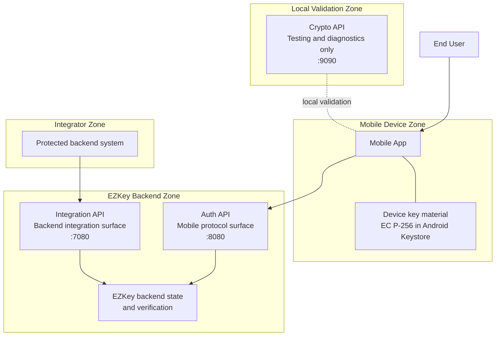
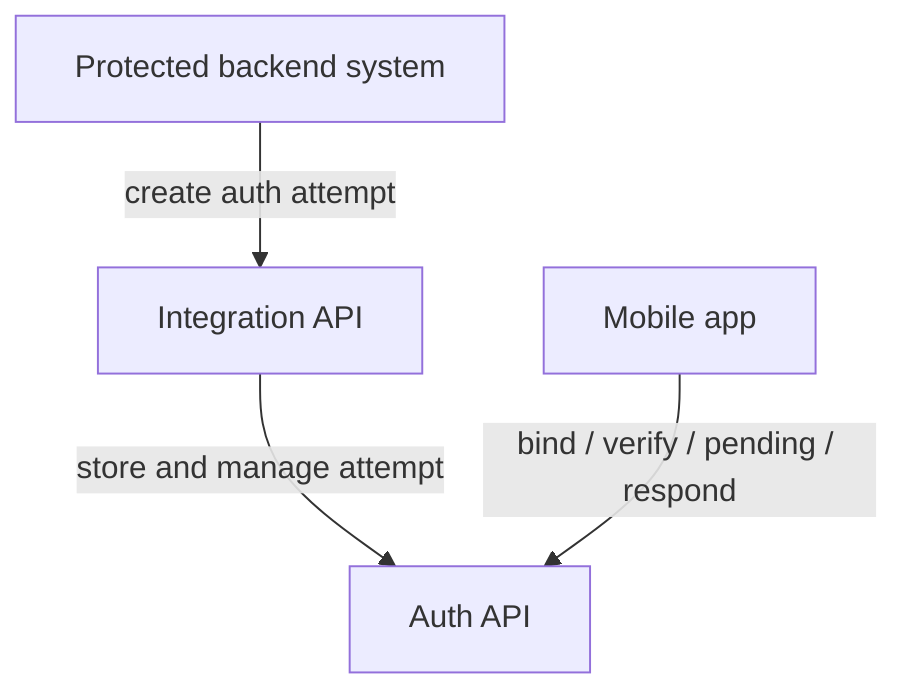
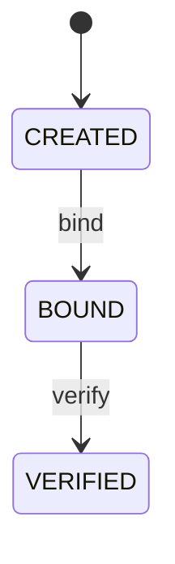
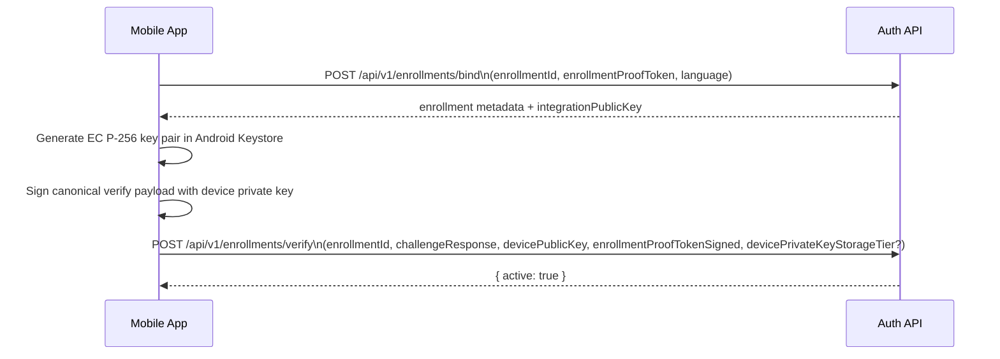
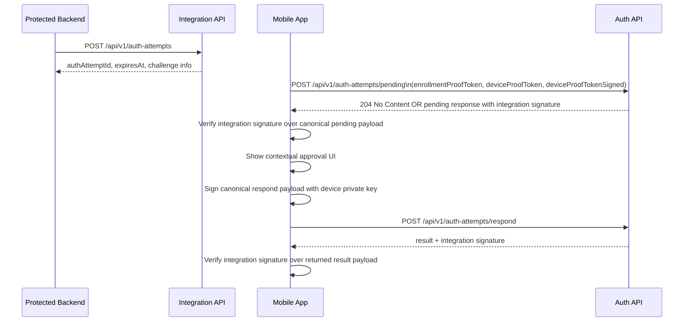
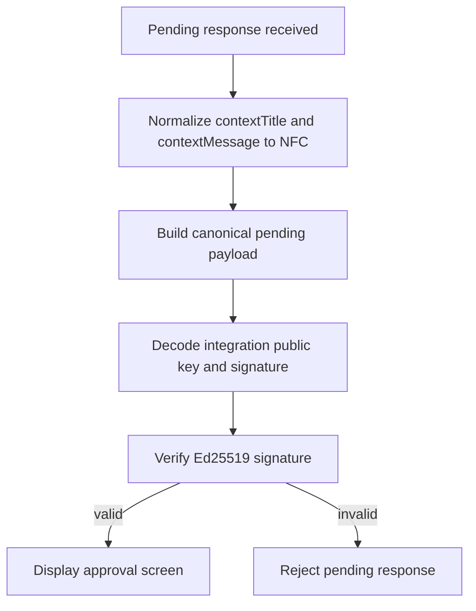

# EZKey Protocol - Mobile Developer Implementation Guide

## Executive Summary

EZKey is a self-hosted, backend-first cryptographic MFA platform. It is not FIDO2, not WebAuthn,
and not a passkey compatibility layer. It uses its own protocol, its own trust boundaries, and a
deliberately explicit backend verification model.

This guide is for developers who want to add EZKey protocol support to a mobile MFA application,
especially an Android application that can protect device private keys with Android Keystore.
The intended audience is not a casual integrator. It is a developer who wants to implement the
protocol correctly, validate the cryptographic chain end to end, and understand what must be
verified locally on the device.

The EZKey model is opinionated:

- The backend remains authoritative for state and verification.
- The mobile app participates as a cryptographic device, not as an opaque push client.
- Enrollment and authentication are both cryptographic processes, not just API exchanges.
- One-time proof material and explicit signature validation protect the flow against replay,
  tampering, and accidental protocol drift.

If you are building support for EZKey in an existing open-source authenticator application, the
main outcome of this document is simple: you should be able to implement `bind`, `verify`,
`pending`, and `respond` correctly, store the right material securely, and validate your work
against a local Docker stack.

## Audience And Scope

This guide targets:

- Developers of mobile MFA applications who want to support the EZKey protocol.
- Android-first implementations that can rely on Android Keystore.
- Implementers who need a concrete protocol guide rather than a product overview.

This guide does not focus on:

- Admin API provisioning workflows.
- iOS secure enclave implementation details.
- Browser-centric or WebAuthn-style models.

## Product Positioning In One Page

EZKey exists for teams that want strong MFA with direct backend control, explicit cryptographic
verification, and self-hosted operational visibility. Its trust anchor is the trusted backend
installation. Its protocol strength comes from cryptographic continuity across enrollment and
authentication.

That continuity matters:

- During enrollment, the device proves possession of the private key corresponding to the public
  key it is binding.
- During authentication, the device does not sign an arbitrary decision. It signs a one-time proof
  token that was delivered in a prior signed pending response.
- The mobile app must verify server-originated integration signatures before trusting what it shows
  to the user.

This is one of the core distinctions from looser push-MFA patterns. The device is not just asked
to approve. It is asked to approve a specific cryptographic flow.

## System Context

This section is intentionally split into two views.

- The first view shows the functional zones of the EZKey system.
- The second view shows only the primary interaction paths relevant to a mobile implementer.

### View 1 - Functional Zones



What this view is meant to clarify:

- The mobile app and its device key material belong to the same functional zone, but they should
  be thought of separately.
- The mobile implementer talks to the Auth API, not directly to the Integration API.
- The integrating backend system talks to the Integration API, which is how auth attempts enter the
  flow.
- The EZKey backend remains the authoritative holder of state and verification.
- The Crypto API is outside the production trust path and exists only to help local testing and
  diagnostics.

### View 2 - Primary Interaction Paths



What this second view is meant to clarify:

- `bind`, `verify`, `pending`, and `respond` are all implemented against the Auth API.
- The Integration API matters because it creates the authentication attempt consumed later by the
  mobile app.
- The mobile app is not a peer of the integrating backend. Each side uses a different EZKey API
  surface.

### Roles And Trust Boundaries

- The protected backend system creates authentication attempts through the Integration API.
- The mobile app talks to the Auth API for enrollment and authentication.
- The Auth API is the protocol surface the mobile client must implement.
- The Integration API is conceptually important because it is where the protected backend injects
  the business request that later appears in `pending`.
- The Crypto API is a local validation aid. It is useful for testing and debugging, not as a
  production dependency.

## Protocol Model At A Glance

There are two cryptographic actors in the protocol:

| Actor | Algorithm | Public Key Format | Signature Format | Usage |
|---|---|---|---|---|
| Device | EC P-256 + ECDSA-SHA256 | X.509 SPKI, standard Base64 | ASN.1 DER, standard Base64 | Enrollment verify, authentication respond |
| Integration | Ed25519 | Raw 32 bytes, Base64URL without padding | Raw 64 bytes, Base64URL without padding | Pending signature, respond-result signature |

There are three proof token concepts you must distinguish clearly:

| Token | Lifetime | Produced By | Used In | Purpose |
|---|---|---|---|---|
| `enrollmentProofToken` | Stable for the enrollment flow | Backend | `bind`, enrollment association | Secure enrollment identification, anti-enumeration |
| `deviceProofToken` | Client-generated per poll cycle | Mobile app | `pending` request | Proves freshness and device participation on poll |
| `authAttemptProofToken` | One-time per auth attempt | Backend | `pending` response, `respond` request | Cryptographically binds pending to respond |

## Cryptographic Foundation

### Device-Side Cryptography

The device uses EC P-256 (`secp256r1`) and signs with `SHA256withECDSA`.

- Private key storage: platform keystore.
- Public key wire format: X.509 SubjectPublicKeyInfo, standard Base64.
- Signature wire format: ASN.1 DER, standard Base64.

On Android, the reference implementation uses Android Keystore and requests StrongBox when the
device supports it.

Reference behavior from the EZKey mobile implementation:

```kotlin
val builder = KeyGenParameterSpec.Builder(
    alias,
    KeyProperties.PURPOSE_SIGN or KeyProperties.PURPOSE_VERIFY
)
  .setAlgorithmParameterSpec(ECGenParameterSpec("secp256r1"))
  .setDigests(KeyProperties.DIGEST_SHA256)
  .setUserAuthenticationRequired(false)

if (Build.VERSION.SDK_INT >= Build.VERSION_CODES.R) {
  builder.setUnlockedDeviceRequired(true)
}

if (Build.VERSION.SDK_INT >= Build.VERSION_CODES.P) {
  builder.setIsStrongBoxBacked(true)
}
```

Important properties:

- The private key is never exported to JavaScript or application storage.
- The mobile app signs UTF-8 payload bytes.
- The public key exported during enrollment verify is the Base64-encoded SPKI representation.

#### Device private key storage tier — trust model and proof boundary

The optional `devicePrivateKeyStorageTier` field on `POST /api/v1/enrollments/verify` exists so operators can see a **coarse, client-reported** label (`NONE`, `STANDARD`, `STRONG`) in Admin tooling. **The current protocol does not give the backend any independent way to prove that label.**

| Layer | What is true today |
| --- | --- |
| **Server** | Persists and exposes exactly the string the client sends. There is **no** Key Attestation chain validation, no challenge–response attestation, and no cryptographic binding between the tier value and hardware. |
| **Honest mobile client** | Should derive the tier from platform APIs (see below) and send a value consistent with local key creation. |
| **Malicious or compromised client** | Could send an arbitrary `NONE` / `STANDARD` / `STRONG` string; the server would still store it. |

So **`STRONG` means “the client asserted StrongBox-class storage according to its own implementation,” not “the Ezkey backend cryptographically verified StrongBox.”** Align documentation, sales, and pilot expectations with that boundary until a future protocol adds verifiable attestation.

**Reference Android behavior (honest client):** At key generation, the app requests StrongBox when the API allows (`setIsStrongBoxBacked(true)`), catching `StrongBoxUnavailableException` and continuing without StrongBox when the device cannot satisfy the request. For reporting, the tier is derived from `KeyInfo` after the key exists: treat as StrongBox-tier when Android reports StrongBox via `isStrongBoxBacked` **or** (API 31+) `getSecurityLevel()` equals `SECURITY_LEVEL_STRONG_BOX`; otherwise map secure hardware to `STANDARD`, else `NONE`. That follows the platform’s own descriptors; it still does not create server-side proof.

**Future hardening (not implemented):** [Android Key Attestation](https://developer.android.com/privacy-and-security/security-key-attestation) (or an equivalent verified signal) could allow the backend to validate hardware claims. Until then, treat tier as **informational client telemetry**, not a server-audited security property.

**Signature scope (verify):** `devicePrivateKeyStorageTier` is **not** included in the ECDSA payload. The server validates `enrollmentProofTokenSigned` against the **canonical verify device payload** (UTF-8 bytes): `{enrollmentProofToken}|{enrollmentId}|{challengeResponse}|{devicePublicKey}`. The tier is sent in the same JSON body but is **outside** that signed message, so its integrity is **not** cryptographically bound to the device signature. See [ENROLLMENT_SIGNATURE_PAYLOAD.md](ENROLLMENT_SIGNATURE_PAYLOAD.md).

### Integration-Side Cryptography

The integration side uses Ed25519.

- Public key wire format: raw 32 bytes, Base64URL without padding.
- Signature wire format: raw 64 bytes, Base64URL without padding.
- Payload signing uses exact UTF-8 bytes.

The Android reference implementation reconstructs an RFC 8410-style SPKI wrapper from the raw
32-byte public key before verifying with JCA Ed25519.

Reference behavior:

```kotlin
val pubRaw = decodeFlexibleBase64ToBytes(publicKeyBase64) ?: return false
val sigRaw = decodeFlexibleBase64ToBytes(signatureBase64) ?: return false
if (pubRaw.size != 32 || sigRaw.size != 64) {
  return false
}
val spki = rawPublicKeyToSpki(pubRaw)
val publicKey = KeyFactory.getInstance("Ed25519").generatePublic(X509EncodedKeySpec(spki))
val signature = Signature.getInstance("Ed25519")
signature.initVerify(publicKey)
signature.update(data.toByteArray(StandardCharsets.UTF_8))
return signature.verify(sigRaw)
```

### Canonical Payload Rules

EZKey depends on exact payload construction. If your payload builder differs from the server, your
signatures will not verify.

General rules:

- Use UTF-8 for all payload bytes.
- Use the separator `|` exactly, with no surrounding spaces.
- Use lowercase literals `true` and `false`.
- Apply Unicode NFC normalization only to user-facing text fields that can contain accents:
  `contextTitle` and `contextMessage`.
- Do not normalize proof tokens.

## Enrollment Workflow

Enrollment is a two-phase flow:

1. `bind`
2. `verify`

State model:



### Sequence Overview



### Phase 1 - Bind

Endpoint:

```http
POST /api/v1/enrollments/bind
```

Request body:

```json
{
  "enrollmentId": 456,
  "enrollmentProofToken": "abc123-def456-ghi789",
  "language": "en"
}
```

Primary request fields:

| Field | Type | Required | Meaning |
|---|---|---|---|
| `enrollmentId` | number | Yes | Enrollment identifier |
| `enrollmentProofToken` | string | Yes | Permanent proof token associated with the enrollment |
| `language` | string | Partial support only | Client-supplied language hint; current ecosystem support is not yet fully aligned and should not be treated as a stable protocol guarantee |

Implementation note:

The current EZKey ecosystem still has work in progress around language handling for enrollment
binding. Some clients already carry a `language` hint, but support is partial and should be
understood as provisional until a future protocol/documentation pass stabilizes that behavior.

Successful response:

```json
{
  "enrollmentId": 456,
  "enrollmentProofToken": "abc123-def456-ghi789",
  "integrationPublicKey": "AAAAAAAAAAAAAAAAAAAAAAAAAAAAAAAAAAAAAAAAAAA",
  "integrationKeyAlgorithm": "ed25519",
  "integrationName": "Acme Bank",
  "integrationDescription": "Acme Bank provides secure online banking services.",
  "enrollmentName": "John's Android",
  "enrollmentBindPayloadSignedByIntegration": "AAAAAAAAAAAAAAAAAAAAAAAAAAAAAAAAAAAAAAAAAAAAAAAAAAAAAAAAAAAAAAAAAAAAAAAAAAAAAAAAAAAAAAA="
}
```

The integration signs `enrollmentBindPayloadSignedByIntegration` over the canonical bind payload (see [ENROLLMENT_SIGNATURE_PAYLOAD.md](ENROLLMENT_SIGNATURE_PAYLOAD.md)). The mobile app **must** verify this Ed25519 signature with `integrationPublicKey` before trusting the bind response or storing the integration key for pending/respond verification.

Critical response fields:

| Field | Meaning | Device handling |
|---|---|---|
| `integrationPublicKey` | Ed25519 public key, raw 32 bytes, Base64URL without padding | Store for later verification of pending and result signatures; verify `enrollmentBindPayloadSignedByIntegration` against this key first |
| `integrationKeyAlgorithm` | Cryptographic algorithm descriptor for the integration key material | Preserve and inspect when your client contract exposes it; stricter validation behavior is being hardened in ongoing work |
| `enrollmentProofToken` | Enrollment proof token | Store in secure storage |
| `enrollmentName` | Human label for the enrollment | Optional display metadata |

Implementation note:

The backend bind response includes `integrationKeyAlgorithm`, but client-side handling is not yet
uniformly strict across all EZKey implementations. For now, treat it as useful descriptive
metadata and as a forward-compatible validation hook, without overstating the strength of current
client-side enforcement.

What the mobile app should store after `bind`:

- `enrollmentId`
- `enrollmentProofToken`
- `integrationPublicKey`
- integration display metadata if useful in UI

After `verify`, also persist the `devicePrivateKeyStorageTier` value you sent (if any) so the app can show consistent local posture and support future UX.

Recommended storage split:

- Secure storage: `enrollmentProofToken`, integration verification material if your threat model
  treats it as sensitive, device-local aliases.
- App metadata storage: `enrollmentName`, `integrationName`, non-sensitive labels.

### Phase 2 - Verify

Endpoint:

```http
POST /api/v1/enrollments/verify
```

Before this call, the mobile app must:

1. Generate a device key pair in Android Keystore.
2. Export the device public key as SPKI Base64.
3. Build the canonical verify device payload (see [ENROLLMENT_SIGNATURE_PAYLOAD.md](ENROLLMENT_SIGNATURE_PAYLOAD.md)): `{enrollmentProofToken}|{enrollmentId}|{challengeResponse}|{devicePublicKey}` (UTF-8), then sign that string with the device private key. Optional `devicePrivateKeyStorageTier` is **not** part of the signed message — see **Device private key storage tier — trust model and proof boundary**.

Request body:

```json
{
  "enrollmentId": 456,
  "challengeResponse": 987654,
  "devicePublicKey": "AAAAAAAAAAAAAAAAAAAAAAAAAAAAAAAAAAAAAAAAAAA=",
  "enrollmentProofTokenSigned": "AAAAAAAAAAAAAAAAAAAAAAAAAAAAAAAAAAAAAAAAAAAAAAAAAAAAAAAAAAAAAAAAAAAAAAAAAAAAAAAAAAAAAAA=",
  "devicePrivateKeyStorageTier": "STANDARD"
}
```

`devicePrivateKeyStorageTier` is optional. When sent, it must be exactly `NONE`, `STANDARD`, or `STRONG`. The server persists it and exposes it in the Admin API for operators. **The backend relies entirely on the mobile client for this value** — there is no Key Attestation or other server-side verification in the current protocol; see **Device private key storage tier — trust model and proof boundary** above. Typical mapping on Android (honest client): `NONE` when the key is not in hardware-backed Keystore (e.g. emulators or software-only paths); `STANDARD` for Android Keystore secure hardware without StrongBox-tier classification; `STRONG` when the platform reports StrongBox via `KeyInfo` as described there. Future iOS clients can map Keychain and Secure Enclave into `STANDARD` / `STRONG` without renaming the wire values.

Field semantics:

| Field | Type | Required | Notes |
|---|---|---|---|
| `enrollmentId` | number | Yes | Enrollment identifier |
| `challengeResponse` | number | Yes | Mandatory six-digit numeric challenge shown during enrollment setup |
| `devicePublicKey` | string | Yes | SPKI Base64 for the generated EC P-256 public key |
| `enrollmentProofTokenSigned` | string | Yes | ECDSA DER Base64 signature over the canonical verify payload (UTF-8): `{enrollmentProofToken}\|{enrollmentId}\|{challengeResponse}\|{devicePublicKey}`; does **not** cover `devicePrivateKeyStorageTier` or other JSON fields |
| `devicePrivateKeyStorageTier` | string | No | `NONE`, `STANDARD`, or `STRONG` — client-reported tier; **not** included in the proof-token signature; omit for legacy clients |

Successful response:

```json
{
  "active": true,
  "enrollmentVerifyMessage": "Enrollment verified successfully",
  "enrollmentVerifyPayloadSignedByIntegration": "AAAAAAAAAAAAAAAAAAAAAAAAAAAAAAAAAAAAAAAAAAAAAAAAAAAAAAAAAAAAAAAAAAAAAAAAAAAAAAAAAAAAAAA="
}
```

The integration signs `enrollmentVerifyPayloadSignedByIntegration` over the canonical verify-result payload (see [ENROLLMENT_SIGNATURE_PAYLOAD.md](ENROLLMENT_SIGNATURE_PAYLOAD.md)). The mobile app **must** verify this Ed25519 signature with the integration public key from bind before treating enrollment as complete.

At this point, the enrollment is cryptographically bound to the device key pair.

The `challengeResponse` is not optional in the current EZKey enrollment protocol. A correct mobile
implementation must collect the six-digit challenge shown during setup and send it on every
`verify` request.

### Enrollment Implementation Notes

- Do not invent your own key format for `devicePublicKey`. It must be the standard Base64-encoded
  X.509 SPKI bytes of the EC P-256 public key.
- Do not sign JSON. Sign the canonical verify device UTF-8 string (see [ENROLLMENT_SIGNATURE_PAYLOAD.md](ENROLLMENT_SIGNATURE_PAYLOAD.md)), not the HTTP body.
- Do not assume `devicePrivateKeyStorageTier` is integrity-protected by `enrollmentProofTokenSigned`; it is a separate JSON field. To bind tier to the device key cryptographically would require a protocol change (e.g. extended signed payload).
- Treat a verify failure as terminal for that enrollment flow unless the server explicitly supports
  recovery for the specific error.

## Authentication Workflow

Authentication is a chained flow across two backend surfaces:

1. The protected backend creates an auth attempt through the Integration API.
2. The mobile app retrieves the pending attempt through the Auth API.
3. The mobile app responds through the Auth API.

The mobile client implements only steps 2 and 3 directly, but must understand step 1 because the
pending response originates from that backend-created attempt.

### High-Level Sequence



### User-Initiated Polling Model

EZKey's `pending` flow is intentionally user-initiated.

- The mobile app should poll when the user deliberately asks to check pending requests.
- The mobile app should not background-poll every few seconds as a default behavior.
- This is not just a UX preference. It is part of the product posture against blind push-approval
  patterns and push fatigue.

### Step 1 - Pending

Endpoint:

```http
POST /api/v1/auth-attempts/pending
```

Request body:

```json
{
  "enrollmentId": 456,
  "enrollmentProofToken": "EZK-ABC123-DEF456",
  "deviceProofToken": "abc123-def456-ghi789",
  "deviceProofTokenSigned": "eyJhbGciOiJSUzI1NiJ9..."
}
```

Field semantics:

| Field | Type | Required | Notes |
|---|---|---|---|
| `enrollmentId` | number | Yes in current API contract | Enrollment identifier |
| `enrollmentProofToken` | string | Yes | Permanent token for secure enrollment association |
| `deviceProofToken` | string | Yes | Client-generated proof token for this poll cycle, using the same wire format as the backend proof-token generator |
| `deviceProofTokenSigned` | string | Yes | Device signature over the raw device proof token |

#### Generating `deviceProofToken`

The current reference mobile implementation now aligns with the backend proof-token generator.
Build `deviceProofToken` as:

- 32 random bytes for the main token body
- 16 random bytes for the salt
- URL-safe Base64 without padding for each part
- final wire format: `randomPart.saltPart`

This matches the backend proof-token structure and is generated from the platform CSPRNG in the
native mobile layer. Sign the exact token string with the device private key.

You may reuse the same `deviceProofToken` on subsequent polls if the server returned `204 No
Content`. Once a pending request is claimed with `200 OK`, treat that proof token as consumed and
generate a new one for future polls.

Possible responses:

- `204 No Content`: no pending attempt exists.
- `200 OK`: a pending attempt exists and must be processed.

Example `200 OK` response:

```json
{
  "authAttemptId": 123,
  "authAttemptProofToken": "abc123-def456-ghi789",
  "authAttemptProofTokenSignedByIntegration": "AAAAAAAAAAAAAAAAAAAAAAAAAAAAAAAAAAAAAAAAAAAAAAAAAAAAAAAAAAAAAAAAAAAAAAAAAAAAAAAAAAAAAAA=",
  "authAttemptChallengeRequired": true,
  "contextTitle": "Payment Authorization",
  "contextMessage": "Authorize payment of $5,000 to Suppliers Ltd. for invoice INV-2025-042."
}
```

Critical response fields:

| Field | Meaning | Mandatory client action |
|---|---|---|
| `authAttemptId` | Attempt identifier | Persist until respond completes |
| `authAttemptProofToken` | One-time attempt token | Use later when building the respond payload |
| `authAttemptProofTokenSignedByIntegration` | Integration signature over the pending payload | Verify before trusting the response |
| `authAttemptChallengeRequired` | Whether user must enter a challenge code | Drive UI and respond payload |
| `contextTitle` / `contextMessage` | Context shown to the user | Normalize only for signature building, not for display rewrite |

### Canonical Pending Payload

The mobile app must verify this exact payload:

```text
{proofToken}|{challengeRequired}|{contextTitle}|{contextMessage}
```

Rules:

- `challengeRequired` must be `true` or `false` in lowercase.
- `contextTitle` becomes an empty string if null.
- `contextMessage` becomes an empty string if null.
- `contextTitle` and `contextMessage` must be NFC-normalized before concatenation.

Example:

```text
abc123token|true|Payment Authorization|Authorize payment of $5,000 to Suppliers Ltd.
```

Pending verification flow:



If verification fails, reject the pending response. Do not show it as trustworthy approval content.

### Contextual Authentication

EZKey supports plain-text business context on auth attempts.

| Field | Type | Max Length | Meaning |
|---|---|---|---|
| `contextTitle` | string | 200 chars | Short card header |
| `contextMessage` | string | 2000 chars | Detailed approval text |

These fields are optional and nullable. They do not change the cryptographic model, but they are
part of the canonical pending payload signed by the integration, so the mobile app must use their
exact values when verifying.

### Step 2 - Respond

Endpoint:

```http
POST /api/v1/auth-attempts/respond
```

The device does not sign the enrollment proof token here. It signs the one-time
`authAttemptProofToken` received during `pending`.

Canonical respond payload:

```text
{proofToken}|{accepted}
```

Examples:

```text
abc123token|true
abc123token|false
```

Request body:

```json
{
  "authAttemptId": 123,
  "authAttemptAccepted": true,
  "authAttemptProofTokenSignedByDevice": "AAAAAAAAAAAAAAAAAAAAAAAAAAAAAAAAAAAAAAAAAAAAAAAAAAAAAAAAAAAAAAAAAAAAAAAAAAAAAAAAAAAAAAA=",
  "authAttemptChallengeResponse": 123456
}
```

Field semantics:

| Field | Type | Required | Notes |
|---|---|---|---|
| `authAttemptId` | number | Yes | Attempt being answered |
| `authAttemptAccepted` | boolean | Yes | User decision |
| `authAttemptProofTokenSignedByDevice` | string | Yes | Device ECDSA signature over `{proofToken}|{accepted}` |
| `authAttemptChallengeResponse` | number | Conditionally | Required when challenge mode is in force |

Successful response:

```json
{
  "authAttemptId": 123,
  "authAttemptResult": "APPROVED",
  "authAttemptMessage": "Auth attempt completed",
  "authAttemptProofTokenResultSignedByIntegration": "AAAAAAAAAAAAAAAAAAAAAAAAAAAAAAAAAAAAAAAAAAAAAAAAAAAAAAAAAAAAAAAAAAAAAAAAAAAAAAAAAAAAAAA="
}
```

### Canonical Respond-Result Payload

The Auth API signs the result so the mobile app can detect tampering of the displayed outcome.

Canonical result payload:

```text
{proofToken}|{authAttemptId}|{result}|{message}
```

Example:

```text
abc123token|456|APPROVED|Auth attempt completed
```

Rules:

- `proofToken` is the same `authAttemptProofToken` obtained during `pending`.
- `authAttemptId` is the decimal attempt identifier.
- `result` is one of `APPROVED`, `DENIED`, `FAILED`, `EXPIRED`.
- `message` becomes an empty string if null and is NFC-normalized.

This verification is mandatory for a correct high-security EZKey client.

### Failure Semantics

EZKey treats failed validation strictly.

- If the device signature is invalid, the backend may invalidate the attempt immediately.
- If the challenge response is wrong, the attempt may become invalid.
- There is no optimistic retry assumption for the same attempt.

Client implication:

- Do not build UX that assumes the user can retry a failed `respond` on the same attempt.
- Surface the failure clearly and let the integrating system initiate a new auth attempt.

## Request And Response Canonicalization Checklist

Use this checklist during implementation:

- UTF-8 everywhere for signed payload bytes.
- `|` as the only separator.
- Lowercase `true` and `false`.
- NFC normalization only for `contextTitle`, `contextMessage`, and result `message`.
- ECDSA signatures are DER + standard Base64.
- Ed25519 signatures are raw 64-byte values + Base64URL without padding on the wire.
- Integration public keys are raw 32-byte values + Base64URL without padding on the wire.

## Android Implementation Guidance

### Key Alias Strategy

Use a stable per-enrollment alias, for example:

```text
ezkey_enrollment_{enrollmentId}
```

This matches the reference implementation and keeps the device keystore model easy to reason about.

### Minimal Android Signing Flow

```kotlin
val signature = Signature.getInstance("SHA256withECDSA")
signature.initSign(privateKey)
signature.update(payload.toByteArray(StandardCharsets.UTF_8))
val signatureBytes = signature.sign()
val base64Der = Base64.encodeToString(signatureBytes, Base64.NO_WRAP)
```

### Storage Guidance

Recommended secure storage split for Android:

| Material | Recommended Storage |
|---|---|
| Device private key | Android Keystore only |
| `enrollmentProofToken` | Secure storage |
| `integrationPublicKey` | Secure or app storage depending on threat model |
| Enrollment metadata | App storage |
| Temporary `authAttemptProofToken` | In-memory or encrypted local state until respond completes |

## Error Handling Expectations

Auth API error responses use RFC 9457 Problem Details for HTTP `4xx` and `5xx` failures.

Client guidance:

- Treat `204 No Content` from `pending` as a success case with no pending attempt.
- Treat `200 OK` from `respond` as transport success, then inspect `authAttemptResult` and verify
  `authAttemptProofTokenResultSignedByIntegration`.
- Branch primarily on HTTP status and stable problem `type`, not on free-form human message text.

## Local Validation With Docker

### Recommended Local Setup

Start the standard local stack from the repository root:

```bash
./ezkey-tests/clean-start.sh
```

Recommended direct ports for protocol validation:

| Surface | Direct Local URL |
|---|---|
| Auth API | `http://localhost:8080` |
| Integration API | `http://localhost:7080` |
| Admin API | `http://localhost:9080` |
| Crypto API | `http://localhost:9090` |

Swagger and OpenAPI references:

- Auth API: `http://localhost:8080/swagger-ui/index.html`
- Integration API: `http://localhost:7080/swagger-ui/index.html`
- Admin API: `http://localhost:9080/swagger-ui/index.html`
- Crypto API: `http://localhost:9090/swagger-ui/index.html`

The stack may also expose Caddy proxy ports (`18080`, `17080`, `19080`), but direct ports are the
default choice for day-to-day protocol testing.

### Crypto API Usage For Validation

The Crypto API is useful for fixture generation and debugging.

Helpful endpoints:

| Endpoint | Purpose |
|---|---|
| `GET /api/v1/crypto/prooftoken` | Generate test proof tokens |
| `GET /api/v1/crypto/keypair` | Generate EC P-256 test key pairs |
| `GET /api/v1/crypto/integration-keypair` | Generate Ed25519 integration test keys |
| `POST /api/v1/crypto/sign` | Sign a payload for diagnostics |
| `POST /api/v1/crypto/validate` | Validate a signature |

### Step-By-Step Manual Validation

Use the existing Postman collections under `postman/collections/v2.1/`.

Minimum useful sequence:

1. Create or retrieve an enrollment through the admin flow so you have `enrollmentId` and
   `enrollmentProofToken`.
2. Call `POST /api/v1/enrollments/bind`.
3. Generate a device key pair and sign the canonical enrollment verify device payload (see [ENROLLMENT_SIGNATURE_PAYLOAD.md](ENROLLMENT_SIGNATURE_PAYLOAD.md)).
4. Call `POST /api/v1/enrollments/verify`.
5. Create an auth attempt from the backend side through the Integration API.
6. Call `POST /api/v1/auth-attempts/pending` from the mobile side.
7. Verify the returned Ed25519 integration signature locally.
8. Call `POST /api/v1/auth-attempts/respond` using the device signature over the one-time auth
   attempt proof token.
9. Verify the integration signature in the response result payload.

Relevant Postman collections:

- `EZ Key Enrollments auth.postman_collection.json`
- `EZ Key Auth Attempts auth.postman_collection.json`
- `EZ Key Auth Attempts integration-api.postman_collection.json`
- `EZ Key crypto.postman_collection.json`

## Reference Implementation Pointers

Use these repository files as the normative implementation references alongside this guide:

- `docs/CRYPTO.md`
- `docs/AUTH_ATTEMPT_SIGNATURE_PAYLOAD.md`
- `docs/CONTEXTUAL_AUTH.md`
- `docs/ENDPOINT.md`
- `ezkey_mobile/android/app/src/main/java/com/ezkeymobile/crypto/EzkeyCryptoModule.kt`
- `ezkey_mobile/android/app/src/main/java/com/ezkeymobile/crypto/IntegrationKeyVerifier.kt`
- `ezkey-demo-device/src/main/java/org/ezkey/demo/device/service/DeviceCryptoService.java`

## Common Implementation Mistakes

Avoid these mistakes:

- Signing `enrollmentProofToken` during `respond`. The correct token is `authAttemptProofToken`.
- Treating the integration public key as an EC public key. It is Ed25519 raw 32-byte material.
- Treating the integration signature as DER. It is raw 64-byte Ed25519 output.
- Forgetting NFC normalization on context fields before verifying pending signatures.
- Normalizing proof tokens. Do not normalize them.
- Assuming `pending` should run as aggressive background polling.
- Displaying the result of `respond` without verifying the returned integration signature.

## Implementation Checklist

Before calling your implementation complete, verify all of the following:

- You generate and store the device private key in Android Keystore.
- You export the device public key as SPKI Base64.
- You sign the canonical enrollment verify device payload for enrollment verify (not the raw proof token alone).
- You generate and sign a `deviceProofToken` for pending.
- You verify `authAttemptProofTokenSignedByIntegration` before trusting pending content.
- You build the canonical respond payload as `{proofToken}|{accepted}`.
- You verify `authAttemptProofTokenResultSignedByIntegration` before trusting the returned result.
- You handle `204 No Content` on pending as a valid no-work state.
- You do not assume retries on the same failed auth attempt.

## Final Notes

EZKey is intentionally narrow and explicit. That is a feature, not a limitation. A correct client
implementation should favor protocol fidelity over clever abstraction.

If you are implementing EZKey support in an existing mobile authenticator, the fastest route to
confidence is:

1. Implement the canonical payload builders first.
2. Implement Ed25519 verification and ECDSA signing exactly once and test them thoroughly.
3. Validate the whole flow against the local Docker stack before optimizing UX.

That order keeps the protocol correct before it becomes polished.