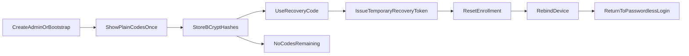

# Recovery codes lifecycle analysis

**Status:** Historical analysis (pre–regenerate / issue-initial shipping)  
**Audience:** Product, Engineering, Security, Operations  
**Scope:** Admin recovery-code lifecycle for Global Admin and Tenant Admin accounts

> **Living canon (2026):** Peer/admin **regenerate** and **issue-initial** recovery-code APIs and
> Admin UI surfaces are shipped. Prefer [`docs/ENDPOINT.md`](ENDPOINT.md) (recovery-codes endpoints),
> [`docs/ADMIN_UI_RECOVERY.md`](ADMIN_UI_RECOVERY.md), and Admin UI admins detail over the “gaps”
> narrative in §1–§2.6 below. Keep this file only as design history; do not re-open regenerate as
> unimplemented work without checking those docs first.

---

## 1. Executive summary

Ezkey already implements the core break-glass recovery flow correctly:

- recovery codes are generated at administrator creation,
- they are shown once,
- they are stored only as BCrypt hashes,
- each code is single-use,
- a successful recovery code grants only a temporary recovery token,
- that token is limited to MFA enrollment reset and rebind.

**Historical note:** When this analysis was written, the main product gap was **lifecycle
management after provisioning** (regenerate / peer replenishment). That gap is **closed** in the
living product — see the banner above. Sections below retain the original recommendation framing
for traceability.

---

## 2. Current state

### 2.1 What exists today

The current implementation is split across:

- `ezkey-admin-api/src/main/java/org/ezkey/admin/service/AdminRecoveryService.java`
- `ezkey-admin-api/src/main/java/org/ezkey/admin/service/AdminProvisioningService.java`
- `ezkey-admin-api/src/main/java/org/ezkey/admin/service/AdminBootstrapService.java`
- `docs/ENDPOINT.md`
- `docs/ADMIN_UI_RECOVERY.md`
- `ezkey-admin-ui/src/pages/admins.tsx`
- `ezkey-admin-ui/src/components/feature/login-recovery-section.tsx`

The configured defaults are:

- `ezkey.admin.recovery.codes-count=10`
- `ezkey.admin.recovery.temp-token-duration-minutes=30`

Recovery codes are 32 digits formatted as 8 groups of 4 digits.

This document now recommends changing the default recovery-code count from `10` to `5`, while
keeping the property configurable.

### 2.2 Current lifecycle



### 2.3 Generation and storage

- Recovery codes are generated during bootstrap for the initial Global Admin.
- Recovery codes are generated during peer-admin creation for Global Admin and Tenant Admin accounts.
- Plain codes are returned once at creation time or logged once during bootstrap.
- At rest, only BCrypt hashes are retained.
- `GET /api/v1/admins/{id}/onboarding` does not return plain recovery codes later.

This is the right baseline. Ezkey should keep the "shown once" rule.

### 2.4 Consumption flow

The current flow is:

1. `POST /api/v1/admin/auth/recover`
2. If the recovery code matches one stored hash, that hash is removed.
3. A temporary `ezkey_recovery_*` token is issued.
4. `POST /api/v1/admin/enrollments/reset` uses that token.
5. The old device is unbound and new enrollment credentials are generated.
6. The administrator rebinds a device and returns to normal passwordless login.

Important behavior:

- Recovery is not a full admin session.
- Recovery codes are one-time only.
- Each successful use reduces the stored set.
- When the set is empty, recovery fails with the equivalent of `no_codes_remaining`.

### 2.5 Audit behavior today

Current audit coverage is already good for the existing funnel:

- recovery code validated,
- recovery code rejected,
- no codes remaining,
- enrollment reset completed,
- enrollment reset failed.

The structured audit payload is built in `ezkey-admin-api/src/main/java/org/ezkey/admin/audit/RecoveryAuditDetails.java`.

This means Ezkey already captures the sensitive break-glass events that matter during consumption.

### 2.6 Product gaps (historical — superseded)

The five “gaps” listed when this note was drafted (no regenerate endpoint/UI, no peer replenishment,
no intentional invalidation of unused codes, no steady-state lifecycle surface, internal-only
`rotateRecoveryCodes`) are **superseded**. Living product: `POST …/recovery-codes/regenerate`,
`POST …/recovery-codes/issue-initial`, Admin UI dialogs, and audits
(`ADMIN_RECOVERY_CODES_REGENERATED` / `ADMIN_RECOVERY_CODES_ISSUED`). See ENDPOINT +
`ADMIN_UI_RECOVERY.md`.

---

## 3. Problem statement

Recovery codes are intentionally rare-use credentials. In normal operations, many administrators may never use even one code.

That does **not** eliminate the need for a lifecycle policy.

Without a regeneration mechanism, Ezkey has an awkward dead-end:

- an administrator who loses a device and has no recovery codes left cannot use the existing break-glass flow,
- a peer administrator has no supported in-product way to issue a fresh set,
- operators are forced into manual or ad hoc handling outside the designed lifecycle.

The product therefore needs a simple answer to three questions:

1. Can a new set be generated?
2. What happens to unused codes from the previous set?
3. Who is allowed to initiate the action, and through which API?

---

## 4. Option analysis

### 4.1 Option A: No lifecycle change

**Description:** Keep the current model. Recovery codes are generated once. If exhausted, operators rely on exceptional manual handling outside the normal product flow.

**Advantages:**

- zero new API surface,
- zero new UI work,
- simplest technical scope.

**Disadvantages:**

- leaves a known dead-end in the product,
- weak operational story for peer-admin support,
- inconsistent with a serious administrative platform,
- pushes a foreseeable case into undocumented operator improvisation.

**Assessment:** Rejected. Too fragile for a product that already takes admin recovery seriously.

### 4.2 Option B: Regenerate a full new set and invalidate the old set

**Description:** Add an explicit action that creates a new full set of recovery codes and invalidates every remaining unused code from the prior set.

**Advantages:**

- simple mental model,
- easy to explain in UI and docs,
- easy to audit,
- aligns with GitHub, Google, and Microsoft backup-code behavior,
- fits the existing internal `rotateRecoveryCodes(...)` service concept,
- avoids ambiguous mixed inventories.

**Disadvantages:**

- operators must understand that old unused codes stop working immediately,
- requires one narrow new endpoint and a one-time display screen.

**Assessment:** Recommended.

### 4.3 Option C: Top up the remaining set

**Description:** Preserve unused codes and add more until the configured stock returns to the
configured target count.

**Advantages:**

- feels conservative because it preserves still-valid codes,
- may look appealing if operators want continuity.

**Disadvantages:**

- more confusing to explain and verify,
- increases audit complexity,
- encourages sloppy handling of old printed copies,
- creates partial-set ambiguity for the target administrator,
- offers little real operator value compared with full replacement.

**Assessment:** Rejected. This adds accidental complexity without enough benefit.

### 4.4 Comparison summary

| Option | Simplicity | Security clarity | Operator clarity | Auditability | Recommendation |
|--------|------------|------------------|------------------|--------------|----------------|
| No change | High | Low | Low | Medium | Reject |
| Full regenerate and invalidate old set | High | High | High | High | Recommend |
| Top up remaining codes | Low | Medium | Low | Low | Reject |

---

## 5. Comparable product patterns

Comparable mainstream products converge on the same policy:

- **GitHub:** generating a new set invalidates previously generated recovery codes.
- **Google:** creating a new set makes the previous set inactive automatically.
- **Microsoft:** generating a new recovery code invalidates the prior one.

Ezkey should adopt the same principle for three reasons:

1. It is easy for operators to understand.
2. It avoids parallel valid sets.
3. It matches user expectations shaped by known products.

Ezkey should **not** copy other products' broader recovery ecosystems right now, such as email, SMS, TOTP backup sync, or other side channels. Those are out of scope for the current product posture and would enlarge the platform unnecessarily.

### 5.1 Quantity comparison

Comparable products also show that `10` is common, but not mandatory:

- **Google:** 10 backup codes.
- **Login.gov:** 10 backup codes.
- **Authy:** 10 backup codes.
- **GitHub:** 16 recovery codes.

That means Ezkey's current default of `10` is defensible, but it is oriented toward a broader
consumer-style safety margin than Ezkey likely needs for an administrative B2B workflow.

In Ezkey, recovery codes are expected to be:

- rare-use break-glass credentials,
- backed by peer-admin operational support,
- replaceable through explicit regeneration once lifecycle management is added.

Because of that, Ezkey does not need to over-provision the initial set.

### 5.2 Recommended default quantity

Recommended new default:

- `ezkey.admin.recovery.codes-count=5`

Rationale:

- `5` is still comfortably above the expected real-world usage frequency.
- `5` reduces the number of secrets operators must store and protect.
- `5` remains durable over a long operational period for a mechanism that may never be used.
- `5` is a better match for Ezkey's planned peer-admin regeneration model than `10`.

This document therefore recommends:

- **keep the count configurable,**
- **change the default from `10` to `5`,**
- **preserve regeneration as the answer when more codes are needed.**

---

## 6. Recommended lifecycle policy

### 6.1 Core policy

The recommended policy is:

- recovery codes remain one-time and shown once,
- the configured set size should default to 5,
- a new set may be generated on demand,
- generating a new set invalidates every unused code from the prior set,
- regeneration is an explicit operator action, not an automatic background rule.

### 6.2 When regeneration should be allowed

Regeneration should be allowed:

- proactively, while the administrator is still healthy and logged in,
- reactively, by a peer administrator for another administrator,
- after partial use,
- after complete exhaustion,
- after suspected compromise of stored or printed recovery codes.

Regeneration should **not** be restricted to "only when zero remain." That rule creates unnecessary operator friction and gives no security benefit.

### 6.3 What should happen to remaining codes

Remaining codes from the previous set should be **invalidated immediately**.

This is the right choice because:

- operators should never have to reason about two concurrently valid paper lists,
- the product warning can be explicit,
- the audit event is simple and authoritative,
- the implementation already has a natural replace-all service shape.

---

## 7. API recommendation

### 7.1 Reuse existing APIs or add a new one

Ezkey should **not** reuse existing provisioning or onboarding APIs for this lifecycle action.

Why not reuse them:

- `POST /api/v1/admins/global` and `POST /api/v1/admins/tenant` are creation APIs, not lifecycle APIs.
- `GET /api/v1/admins/{id}/onboarding` is for enrollment onboarding credentials, not recovery-code replacement.
- Overloading those routes would blur product meaning and make future maintenance harder.

The correct approach is one narrow, explicit endpoint.

### 7.2 Recommended endpoint

Recommended shape:

`POST /api/v1/admins/{id}/recovery-codes/regenerate`

Recommended response:

```json
{
  "adminId": 42,
  "username": "tenant.admin",
  "recoveryCodes": [
    "1234-5678-9012-3456-7890-1234-5678-9012"
  ],
  "codesCount": 5,
  "invalidatedPreviousCodes": true,
  "message": "New recovery codes generated. Previous unused codes are no longer valid."
}
```

Recommended semantics:

- returns plain codes once,
- stores only BCrypt hashes,
- replaces the full prior set,
- never allows later retrieval of the plain codes,
- uses the existing internal rotation behavior in `AdminRecoveryService`.

### 7.3 Permissions

Recommended access rules:

- **Global Admin:** may regenerate recovery codes for any administrator.
- **Tenant Admin:** may regenerate recovery codes for administrators in their own tenant.
- **Self-service:** allowed when the authenticated administrator is within the same scope rules.

Operationally, the important rule is that **peer-admin regeneration must be supported**. That is the key fallback when the target administrator has lost the device and exhausted their codes.

### 7.4 Why this is still minimal API surface

This recommendation adds exactly one narrow lifecycle endpoint rather than stretching old endpoints beyond their intended meaning.

That is a good 80/20 design:

- minimal expansion,
- clear semantics,
- low implementation risk,
- no hidden coupling to provisioning flows.

---

## 8. Recommended operator workflow

### 8.1 Normal proactive workflow

1. Authenticated administrator opens their own admin detail or security area.
2. Chooses **Generate new recovery codes**.
3. UI warns that all existing unused recovery codes will stop working immediately.
4. UI shows the new codes once.
5. Administrator stores them securely and closes the dialog.

### 8.2 Peer-admin recovery support workflow

1. Authorized peer administrator opens the target administrator's detail screen.
2. Chooses **Generate new recovery codes** for that administrator.
3. UI warns that the previous unused codes are revoked.
4. UI shows the new codes once.
5. Peer administrator shares them through an approved operational channel.
6. Target administrator uses one code with the existing recovery flow.
7. Target administrator resets MFA enrollment and rebinds a new device.

This is the most important operational scenario to support.

### 8.3 Exhausted-codes scenario

If an administrator has:

- lost the device, and
- exhausted all recovery codes,

the product path should be:

1. a peer administrator regenerates a new set,
2. the target administrator receives the new codes securely,
3. the target administrator uses the existing `recover -> reset -> rebind` funnel.

This keeps the existing break-glass flow intact and avoids inventing a second emergency path.

### 8.4 Lone-admin edge case

If an environment has only one administrator and that administrator loses the device with no recovery codes left, Ezkey still has an operational dead-end.

This document does **not** recommend solving that edge case with new side-channel recovery methods. The pragmatic product answer is:

- document the operational expectation that environments should maintain peer-admin coverage,
- continue enforcing minimum active Global Admin counts where applicable,
- treat single-admin lockout as an operational anti-pattern rather than as a reason to enlarge the feature set.

---

## 9. UI and copy guidance

### 9.1 Recommended UI entry point

The best V1 placement is the administrator-management surface already used for onboarding credentials:

- target admin detail dialog,
- dedicated action button for recovery-code regeneration,
- modal confirmation,
- one-time display panel with copy action.

This is consistent with current admin-management flows and avoids inventing a separate security dashboard.

### 9.2 Required warning text

The UI should make the replacement semantics impossible to miss.

Recommended warning text:

> Generate a new set of recovery codes for this administrator?  
> All existing unused recovery codes will stop working immediately.  
> Save the new codes now. They will not be shown again.

### 9.3 Recommended success framing

Recommended success text:

> New recovery codes generated successfully.  
> Previous unused codes have been revoked.  
> Store these codes securely before closing this dialog.

### 9.4 What not to add in V1

Do not add in V1:

- low-stock banners,
- countdown-style warnings,
- passive audit alerts for few remaining codes,
- email or SMS notifications,
- background reminders.

These add noise and complexity disproportionate to the actual operational frequency of recovery-code depletion.

---

## 10. Audit recommendation

### 10.1 Add a dedicated regeneration audit event

Ezkey should add one dedicated audit event for the new lifecycle action.

Recommended payload fields:

- actor admin id,
- target admin id,
- target tenant id,
- self-service boolean,
- previous codes count,
- new codes count,
- optional reason,
- timestamp.

Recommended behavior:

- successful regeneration is always audited,
- rejected regeneration is audited when authorization fails or validation fails,
- no passive low-stock audit events are generated.

### 10.2 Why not alert on low stock

Low stock is not equivalent to a security incident.

It is an inventory state, not an active threat condition. Treating it as an alert would:

- create noise,
- dilute the meaning of true alert-grade audit signals,
- add operator burden without much value.

Ezkey should reserve stronger audit emphasis for actual recovery use and actual recovery-code regeneration.

---

## 11. Implementation notes

If product implementation follows this analysis later, the most likely touch points are:

- `ezkey-admin-api/src/main/java/org/ezkey/admin/service/AdminRecoveryService.java`
- `ezkey-admin-api/src/main/java/org/ezkey/admin/controller/...` for the new endpoint
- `ezkey-admin-api/src/main/java/org/ezkey/admin/audit/RecoveryAuditDetails.java`
- `ezkey-admin-ui/src/pages/admins.tsx`
- `docs/ENDPOINT.md`
- `docs/ADMIN_UI_RECOVERY.md`

The important design constraint is to preserve these existing truths:

- recovery codes remain shown once,
- recovery does not become a normal admin session,
- regeneration does not require plaintext recovery-code storage,
- onboarding credentials and recovery-code lifecycle remain separate concerns.

---

## 12. Explicit recommendations

### 12.1 Recommended decisions

1. Add one authenticated endpoint to regenerate recovery codes for an administrator.
2. Regeneration must replace the full prior set and revoke all unused previous codes.
3. Keep the existing recovery consumption flow exactly as it is.
4. Change the default recovery-code quantity from `10` to `5`, while keeping it configurable.
5. Support peer-admin regeneration for another administrator within normal tenant/global scope rules.
6. Audit regeneration actions, but do not add passive low-stock warning events.
7. Keep the feature in the existing admin-management UI instead of creating a broader recovery-management subsystem.

### 12.2 Explicitly rejected alternatives

- **Reuse provisioning APIs:** rejected because semantics are wrong.
- **Reuse onboarding API:** rejected because onboarding credentials and recovery lifecycle are different concepts.
- **Top-up model:** rejected because it complicates inventory and operator reasoning.
- **Low-stock alerting:** rejected because it creates noise for a rare operational state.
- **Email/SMS recovery expansion:** rejected because it expands scope beyond Ezkey's current pragmatic platform boundaries.

---

## 13. Final recommendation

Ezkey should treat recovery-code lifecycle management as a **small, explicit, audited rotation capability**, not as a broader recovery subsystem.

The right V1 answer is:

- one new narrow endpoint,
- full-set replacement semantics,
- peer-admin support,
- one-time display,
- no passive warnings,
- no extra side channels.

That gives Ezkey a complete and credible answer to recovery-code exhaustion while staying aligned with the project's simplicity-first design values.
