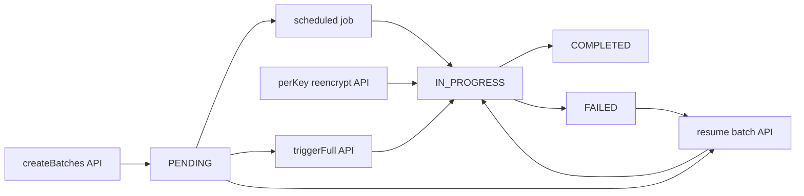

# Re-encryption operations (Global Admin)

Short reference for **encryption key rotation**, **re-encryption batches**, and the related Admin API / UI. Audience: Global Admins and QA (familiar with Ezkey; not a tutorial).

For ciphertext format and rotation mechanics, see [ENCRYPTION_KEY_ROTATION_IMPLEMENTATION.md](./ENCRYPTION_KEY_ROTATION_IMPLEMENTATION.md).

---

## 1. Concepts

- **PRIMARY** — Current key from the Tink keyset; all **new** encryption uses this key.
- **ENABLED (non-PRIMARY)** — Older keys still needed to **decrypt** existing rows until those rows are migrated.
- **Re-encryption batch** — One unit of work in table `ezkey_reencryption_batch`: migrate ciphertext for a **single target** (database table + column) from one **old** non-PRIMARY key to the **current PRIMARY** key. Batches are only created when at least one row still uses that old key for that column — an indexed equality lookup on the target's companion `*_encryption_key_id` column (see §1.2), not a `LIKE 'ENC:{keyId}:%'` scan on the ciphertext. For **`ezkey_auth_attempt`**, when **`auth-attempt-shard-count` &gt; 1**, multiple batch rows may exist per `(old key, column)` — one per **shard** — each covering rows with `mod(auth_attempt_id, shard_count) = shard_index` (shard fields are `NULL` for legacy/non-sharded batches).
- **Targets** — Discovered from `Reencryptable` entities in code (currently four `(table, column)` pairs: `ezkey_enrollment.integration_private_key`, `ezkey_enrollment.enrollment_proof_token`, `ezkey_auth_attempt.auth_attempt_proof_token`, `ezkey_api_key.secret_key_hash`). The destination key is always the **current PRIMARY** resolved from the keyset.

The batch list is a **work queue** plus **historical rows** (completed batches are retained unless archived elsewhere).

### 1.1 Service layout (refactor)

Re-encryption is split across focused services (see `ezkey-core`):

| Component | Role |
|-----------|------|
| `ReencryptionService` | Orchestration only: scheduler, manual triggers; delegates creation, processing, and the parallel runner. |
| `ReencryptionBatchCreationService` | Creates batch rows (`REQUIRES_NEW`); owns `discoverReencryptableTargets()` and primary-key resolution. |
| `ReencryptionTargetQueryService` | Single implementation of `countRecordsEncryptedWithKey` / `fetchRecords` using the indexed `*_encryption_key_id` companion column (§1.2), not a `ENC:{keyId}:%` prefix scan. |
| `ReencryptionBatchProcessingService` | Processes one batch per transaction (`REQUIRES_NEW`). |
| `ReencryptionBatchParallelRunner` | Optional parallel batch execution; mutex per **table** (enrollment and non-sharded auth attempts) or per **`table|column|shard_index`** when auth-attempt sharding is enabled (see §9). |
| `KeyUsageVerificationService` | Admin-facing **derived** lifecycle snapshot: same target list as batch creation + indexed key-id counts + non-`COMPLETED` batch detection. |

### 1.2 Indexed key-id discovery (I-2026-0029 / `TB-2026-07-26`)

Each re-encryptable ciphertext column has a companion, indexed `*_encryption_key_id BIGINT` column
(nullable — `NULL` means the value is currently stored as plaintext, e.g. encryption disabled) that
references `ezkey_encryption_key(key_id)`. It is populated by `EncryptionEntityListener` on initial
encrypt (parsed from the `ENC:{keyId}:` prefix) and kept in sync by `ReencryptionRecordCipher` on
every re-encrypt. `ReencryptionTargetQueryService.countRecordsEncryptedWithKey` /
`fetchRecords` query this column with an equality predicate (`= :keyId`) instead of a
`LIKE 'ENC:{keyId}:%'` scan on the `TEXT` ciphertext column, using a composite B-tree index
`(*_encryption_key_id, {primary_key})` for `O(log n)` lookup and stable keyset pagination. This
replaces a full-table-scan pattern that degraded as ciphertext columns grew. See
[ENCRYPTION_KEY_ROTATION_IMPLEMENTATION.md §4.4.2](./ENCRYPTION_KEY_ROTATION_IMPLEMENTATION.md#442-why-include-key-id)
for the ciphertext prefix format this column is derived from.

**Drained vs parallelism:** “Drained” (no tracked ciphertext rows and no incomplete migration batches for that old key) is **orthogonal** to parallel workers. Table-level serialization avoids same-row contention across column batches; it does not replace checking batch queue state for lifecycle eligibility.

---

## 2. Endpoint map

| Endpoint | Creates batch rows? | Processes crypto? | Scope |
|----------|--------------------|-------------------|--------|
| `POST /api/v1/encryption-keys/reencrypt/create-batches` | Yes (`createBatchesForOldKeys`) | No | All ENABLED non-PRIMARY keys × targets with data |
| `POST /api/v1/encryption-keys/reencrypt/trigger` | Yes (same helper), then processes | Yes (`processBatch` per batch) | Pending + resumable batches after creation |
| `POST /api/v1/encryption-keys/{keyId}/reencrypt` | Yes, then processes | Yes | One old key only |
| `GET /api/v1/encryption-keys/reencryption-batches` | — | — | Lists batch rows (monitoring); paginated with optional filters |
| `POST /api/v1/encryption-keys/reencryption-batches/{batchId}/resume` | — | Yes (that batch) | One batch |

---

## 3. Scheduler vs manual APIs

The scheduled job (`processReencryptionBatches`, cron + ShedLock):

1. Collects batches eligible for processing (resumable + `PENDING`) **before** creating new ones.
2. Calls `createBatchesForOldKeys()` (may insert new `PENDING` rows).
3. Processes up to configured **max batches per run** and **max duration**.

Therefore, **batches created in step 2 are not necessarily processed in the same run**; they are picked up on a **later** run unless you use **Trigger full**, **Resume**, or **per-key re-encrypt** to process sooner.

**Processing boundary:** Each `processBatch` run executes in its **own transaction** (new persistence context per batch). That limits stale JPA state when **Trigger full** or the scheduler processes many batches back-to-back, and reduces optimistic-lock conflicts with concurrent writers updating the same rows (e.g. enrollments under load).

`POST .../reencrypt/create-batches` only performs batch **creation** — useful to prepare work for the next scheduler tick or to inspect the queue without immediate load.

---

## 4. Operational scenarios

| Situation | Suggested action |
|-----------|-------------------|
| Routine migration after rotation | Wait for the scheduled job; monitor batches and key counters. |
| Need migration immediately (incident, test) | `reencrypt/trigger` or per-key `/{keyId}/reencrypt`. |
| Prepare work without processing | `reencrypt/create-batches`. |
| One old key only | `POST .../{keyId}/reencrypt`. |
| Batch stuck or failed | Inspect row; `POST .../reencryption-batches/{batchId}/resume`. |

---

## 5. Admin UI (encryption keys page)

- **Tracked** column — indexed key-id counts (§1.2) on the same targets as batches: **`PRIMARY`** = current ciphertext volume on that key (sanity check / trend); **`ENABLED`** = migration backlog. Em dash for `PENDING` / `DISABLED`. **Migration baseline** and **re-encrypted cumulative** counts appear in key detail (`recordsEncrypted` / `recordsReencrypted` semantics).
- **Re-encrypt** (per ENABLED key in the table) — maps to `POST .../{keyId}/reencrypt`.
- **Re-encryption Batches** section — **Create Batches** → `create-batches`; **Trigger Full Re-encryption** → `reencrypt/trigger`; row **Resume** → `resume` for `PENDING` or `FAILED` batches.
- **Shard numbering (display only)** — `ReencryptionBatch.shardIndex` is **0-based** in the database and API (`mod(auth_attempt_id, shard_count) = shard_index`, so the first shard is `shard_index = 0`). The Admin UI renders shard indices **1-based** (`shardIndex + 1`) in both the batches table and the batch detail dialog, so a 4-shard set reads `1/4, 2/4, 3/4, 4/4` instead of `0/4, 1/4, 2/4, 3/4`. This is a presentation choice only — no backend or API change.
- **Re-encryption wall time (estimate), key detail** — For a **`DRAINED`** key, `EncryptionKeyResponse.reencryptionWallClockSeconds` is a retrospective estimate of how long the full migration off that old key took, computed by **merging each `COMPLETED` batch's actual `[startedAt, completedAt]` time window**: overlapping (or back-to-back) windows collapse into one span; windows separated by a gap are summed. Computed in `KeyUsageVerificationService#computeWallClockSeconds`; `null` when the key is not drained or no batch has both `startedAt` and `completedAt`. Displayed in the key detail dialog alongside algorithm, introduced date, and cumulative re-encrypted count.
  - This intentionally does **not** assume sharded batches always ran fully in parallel — grouping by `target_table` + `target_column` + `new_key_id` and taking a naive `max` (an earlier version of this estimate) silently under-reports the real wall time whenever worker-pool contention leaves one shard queued behind its siblings (see §9 fix below). Merging actual time windows reports the true elapsed span regardless of how much concurrency the pool actually achieved.

---

## 6. QA checklist (minimal)

| Action | API | Expect |
|--------|-----|--------|
| Create batches only | `POST .../reencrypt/create-batches` | New `PENDING` rows possible; no ciphertext change until processing |
| Full trigger | `POST .../reencrypt/trigger` | Batches created (where needed) and processed in one request |
| Per-key | `POST .../{keyId}/reencrypt` | Batches for that key only; processed |
| Resume | `POST .../reencryption-batches/{id}/resume` | That batch runs `processBatch` |

### Response field: `batchesCreated` on full trigger

`ReencryptionTriggerResponse.batchesCreated` is the **count of batches in the processing set** after `createBatchesForOldKeys()` (pending + resumable), **not** strictly “rows inserted in this call only.” Use [`ReencryptionService.triggerFullReencryption()`](../ezkey-core/src/main/java/org/ezkey/security/ReencryptionService.java) when interpreting counts.

---

## 7. Batch list size and pagination

- **Active work** (pending / in-progress / failed) stays bounded by **targets × old keys with remaining data**, multiplied by **shard count** when `auth-attempt-shard-count` &gt; 1 for `ezkey_auth_attempt` (each shard is a separate batch row).
- **Total rows** in `ezkey_reencryption_batch` can **grow over time** because completed batches are not deleted by default; growth tracks **rotation history**, not tenant or user volume.
- **`GET .../reencryption-batches`** returns a **paged** body (`content` + `page`) with standard `page`, `size`, `sort`, plus optional filters: `status`, `targetTable`, `targetColumn`, `oldKeyId`, `newKeyId`, and **inclusive** `createdAfter` / `createdBefore` on `createdAt` (ISO-8601). The Admin UI encryption keys page uses the same contract (filters, sort, total count in the section header).
- **Completion note (initiative):** Re-encryption batch list pagination and filters shipped; no further action unless archival or purge of old batch rows is required later.

---

## 8. State flow (Mermaid)

**Legend:** **create-batches** only enqueues. **Trigger full**, **scheduler**, and **resume** drive `processBatch`. **Per-key re-encrypt** creates and processes batches for one old key.

---

## 9. Configuration (`ezkey.encryption.reencryption.*`)

Values below marked **Admin config** come from `ezkey-admin-api/config/application.properties` (used with clean-start Docker). The Java POJO still defines its own defaults if a property is omitted.

| Property | Default | Purpose |
|----------|---------|---------|
| `batch-size` | `500` (Admin config) / `500` (Java) | Max rows per fetch slice (`LIMIT`). Larger slices reduce loop iterations and throttle overhead; each slice loads that many entities into the persistence context before processing. |
| `throttle-ms` | `10` (Admin config) | Pause after each slice to limit DB load. Use `0` only for short, controlled throughput experiments. |
| `max-batches-per-run` | `100` (Admin config) | Scheduler: maximum batches processed in one scheduled run. With sharding, keep this high enough to cover shard fan-out in one tick (4–8 shards × few old keys is still well under 100). |
| `max-duration-minutes` | `180` (Admin config) | Scheduler: wall-clock cap per run so large queues are not stopped after a few minutes. |
| `parallel-batch-workers` | `4` (Admin config) / `1` (Java) | Thread pool size for parallel submission. **Enrollment:** mutex is **per table** (both encrypted columns on the same row). **Auth attempt without sharding:** same — **per table** (one encrypted column: `auth_attempt_proof_token`). **Auth attempt with sharding** (`auth-attempt-shard-count` &gt; 1): mutex is **per `(table, column, shard_index)`**, so different shards of the same column can run in parallel. Set `parallel-batch-workers` **≥** `auth-attempt-shard-count` so shard batches are not stuck behind a narrow pool. `1` keeps fully sequential behaviour. |
| `parallel-batch-queue-capacity` | `100` | Bounded queue for the dedicated re-encryption executor when `parallel-batch-workers` &gt; 1. May need a higher value when many shard batches are queued. |
| `auth-attempt-shard-count` | `4` (Admin config) / `1` (Java) | `1` = disabled (single batch per auth-attempt column). Values **4 / 8 / 16** are the **configured ceiling**. At batch creation, the service uses an **effective** shard count `N = min(configured, totalRecords)` and creates one batch per **non-empty** residue class `mod(auth_attempt_id, N) = shard_index`. If at most one residue class has rows, it falls back to a **single non-sharded** batch so operators do not see incomplete labels such as `2/4` after a tiny clean-start backlog. **Enrollment** is never sharded. Admin Docker defaults pair **4 workers with 4 shards**. |
| `temporal-batch-sizing-enabled` | `false` | When `true`, use two chunk sizes: first slice uses `recent-data-chunk-size`, later slices use `stale-data-chunk-size` (heuristic for “hot” leading rows vs throughput). |
| `recent-data-chunk-size` | `250` | First fetch slice size when temporal sizing is enabled. |
| `stale-data-chunk-size` | `1000` | Subsequent slices when temporal sizing is enabled. |

**Volume model (why auth-attempt sharding matters):** Integrations, API keys, and enrollments stay modest relative to authentications. Auth attempts accumulate at thousands/day; after ~3 months the migration backlog is dominated by `ezkey_auth_attempt`. With sharding off (`shard-count=1`), that table is mutex-serialized (~400–500 rows/s observed on a typical Docker host). With Admin defaults **4/4**, expect roughly **2–4×** wall-clock improvement on an auth-dominant queue when CPU and DB keep up — e.g. ~270k rows (~3k/day × 90) moves from ~10 min serial toward ~2–3 min. Upper ops band is **8** shards/workers; tens or hundreds of workers add connection pressure without proportional gain.

**Java POJO vs Admin config:** When properties are omitted, `TinkProperties.Reencryption` keeps conservative Java defaults (`parallel-batch-workers=1`, `auth-attempt-shard-count=1`) so Auth/Integration (re-encryption disabled) and partial configs stay sequential. Admin API `application.properties` / docker-test override to the calibrated **4/4** pairing.

**Parallelism:** Creation avoids duplicate active work for the same `(target_table, target_column, old_key_id)` (any shard slot). For auth-attempt sharding, batch creation picks an **effective** `N = min(configured shard count, total remaining rows)`, probes residue classes, and either creates one batch per non-empty class with `shard_count = N` or falls back to a single non-sharded batch when parallelism would not help. At execution time, `ReencryptionBatchParallelRunner` uses a mutex key **per table** for enrollment and non-sharded auth attempts, or **per shard** (`table|column|shard_index`) when a batch has `shard_count` &gt; 1, so different shards can run concurrently. Row updates use **pessimistic** (`FOR UPDATE`) locking in `ReencryptionRowPersistenceService`, so the database serializes conflicting writes. A bounded pool still limits task submission. At Admin startup, if `parallel-batch-workers` &lt; `auth-attempt-shard-count` (and shards &gt; 1), a WARN is logged.

**Fixed defect — async trigger self-consuming a worker thread:** the HTTP-triggered paths (`POST .../reencrypt/trigger`, `POST .../{keyId}/reencrypt`, batch resume) go through `ReencryptionService.enqueueFullReencryption()` / `enqueueReencryptionForKey()` → `ReencryptionBatchParallelRunner.runBatchesAsync()`, which must return immediately (HTTP callers do not block on row crypto). An earlier version wrapped the whole dispatch-and-wait loop from `runBatches()` (submit each batch, then block on `Future.get()`) inside a **single task submitted to the same bounded `reencryptionBatchExecutor`**. That dispatcher task occupied one pool thread for the entire run, leaving only `parallel-batch-workers - 1` threads actually available to process batches — observed in production as **3 of 4 configured shard workers** running a shard concurrently while the 4th queued and ran only after one of the first 3 finished (roughly doubling the real wall time vs. what a naive `max(shard durations)` estimate would report). `runBatchesAsync()` now submits **each batch as its own top-level task** directly on `reencryptionBatchExecutor` (no dispatcher task, no `Future.get()` blocking a pool thread), so all `parallel-batch-workers` threads are available for actual batch work. The **scheduled** path (`ReencryptionService.processReencryptionBatches()`) and the deprecated synchronous trigger methods call the blocking `runBatches()` directly from a caller thread that is *not* a pool worker (scheduler thread, Tomcat request thread), so they were never affected. See `ReencryptionBatchParallelRunnerTest#runBatchesAsync_submitsOneTaskPerBatch_notASingleDispatcherTask` for the regression guard.

**Sharding and `max-batches-per-run`:** With `auth-attempt-shard-count` &gt; 1, the scheduler sees **more** batch rows (one per shard for the auth-attempt proof-token column). Keep `max-batches-per-run` high enough that one scheduled run can cover the shard set for each old key if you rely on the cron job for throughput.

**Memory (heuristic):** Each active batch slice holds roughly **`batch-size` × (loaded row size)** in the heap (native queries fetch **full `AuthAttempt` rows**). For `batch-size` 500–1000 and large TEXT ciphertext columns, expect **single-digit MB per worker thread** per slice, plus ORM overhead — total pressure scales roughly with **`parallel-batch-workers`** × slice footprint (throttle sleep reduces sustained load). Throughput is typically **CPU + DB round-trip** bound, not heap.

**Temporal sizing:** Optional. Enable only after baseline metrics show benefit; two tiers keep behaviour testable. Trade-off: smaller first chunks reduce contention on recently touched rows; larger follow-up chunks improve throughput on cold segments.

---

## 10. Observability

- **Micrometer (core):** `ezkey.reencryption.batch.duration` (timer, tags `target_table`, `target_column`), `ezkey.reencryption.rows.processed` (counter), `ezkey.reencryption.batch.failures` (counter on failure). Exposed when a `MeterRegistry` bean is present (e.g. Admin API with Actuator metrics).
- **Actuator:** With `management.endpoints.web.exposure.include` including `metrics` (see `config/application-windows.properties` / `application-docker-dev.properties`), scrape `GET http://<host>:<management-port>/actuator/metrics` (e.g. port **9081** in local dev). Docker “production-like” profiles may expose only `health`; use dev or a profile that includes `metrics` for operator dashboards.
- **Admin UI:** The **Re-encryption Batches** table **polls every 4 seconds** while the **current page** shows at least one batch in `PENDING`, `IN_PROGRESS`, or `PROCESSING`; otherwise polling is off. Use filters or pagination to remember that batches on other pages do not drive this heuristic.

---

## 11. OpenAPI

REST DTOs for encryption keys and re-encryption are generated from the running Admin API (`./scripts/update-specs.sh` after a clean Docker start). Do not hand-edit files under `specs/`.
