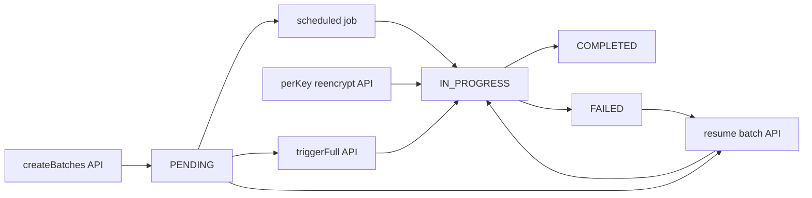

# Re-encryption operations (Global Admin)

Short reference for **encryption key rotation**, **re-encryption batches**, and the related Admin API / UI. Audience: Global Admins and QA (familiar with Ezkey; not a tutorial).

For ciphertext format and rotation mechanics, see [ENCRYPTION_KEY_ROTATION_IMPLEMENTATION.md](./ENCRYPTION_KEY_ROTATION_IMPLEMENTATION.md).

---

## 1. Concepts

- **PRIMARY** — Current key from the Tink keyset; all **new** encryption uses this key.
- **ENABLED (non-PRIMARY)** — Older keys still needed to **decrypt** existing rows until those rows are migrated.
- **Re-encryption batch** — One unit of work in table `ezkey_reencryption_batch`: migrate ciphertext for a **single target** (database table + column) from one **old** non-PRIMARY key to the **current PRIMARY** key. Batches are only created when at least one row still uses that old key for that column (see `ENC:{keyId}:%` prefix in code). For **`ezkey_auth_attempt`**, when **`auth-attempt-shard-count` &gt; 1**, multiple batch rows may exist per `(old key, column)` — one per **shard** — each covering rows with `mod(auth_attempt_id, shard_count) = shard_index` (shard fields are `NULL` for legacy/non-sharded batches).
- **Targets** — Discovered from `Reencryptable` entities in code (currently four `(table, column)` pairs across `ezkey_enrollment` and `ezkey_auth_attempt`). The destination key is always the **current PRIMARY** resolved from the keyset.

The batch list is a **work queue** plus **historical rows** (completed batches are retained unless archived elsewhere).

### 1.1 Service layout (refactor)

Re-encryption is split across focused services (see `ezkey-core`):

| Component | Role |
|-----------|------|
| `ReencryptionService` | Orchestration only: scheduler, manual triggers; delegates creation, processing, and the parallel runner. |
| `ReencryptionBatchCreationService` | Creates batch rows (`REQUIRES_NEW`); owns `discoverReencryptableTargets()` and primary-key resolution. |
| `ReencryptionTargetQueryService` | Single implementation of `countRecordsEncryptedWithKey` / `fetchRecords` using the `ENC:{keyId}:%` prefix. |
| `ReencryptionBatchProcessingService` | Processes one batch per transaction (`REQUIRES_NEW`). |
| `ReencryptionBatchParallelRunner` | Optional parallel batch execution; mutex per **table** (enrollment and non-sharded auth attempts) or per **`table|column|shard_index`** when auth-attempt sharding is enabled (see §9). |
| `KeyUsageVerificationService` | Admin-facing **derived** lifecycle snapshot: same target list as batch creation + prefix counts + non-`COMPLETED` batch detection. |

**Drained vs parallelism:** “Drained” (no tracked ciphertext rows and no incomplete migration batches for that old key) is **orthogonal** to parallel workers. Table-level serialization avoids same-row contention across column batches; it does not replace checking batch queue state for lifecycle eligibility.

---

## 2. Endpoint map

| Endpoint | Creates batch rows? | Processes crypto? | Scope |
|----------|--------------------|-------------------|--------|
| `POST /api/v1/encryption-keys/reencrypt/create-batches` | Yes (`createBatchesForOldKeys`) | No | All ENABLED non-PRIMARY keys × targets with data |
| `POST /api/v1/encryption-keys/reencrypt/trigger` | Yes (same helper), then processes | Yes (`processBatch` per batch) | Pending + resumable batches after creation |
| `POST /api/v1/encryption-keys/{keyId}/reencrypt` | Yes, then processes | Yes | One old key only |
| `GET /api/v1/encryption-keys/reencryption-batches` | — | — | Lists batch rows (monitoring); paginated with optional filters |
| `POST /api/v1/encryption-keys/reencryption-batches/{batchId}/resume` | — | Yes (that batch) | One batch |

---

## 3. Scheduler vs manual APIs

The scheduled job (`processReencryptionBatches`, cron + ShedLock):

1. Collects batches eligible for processing (resumable + `PENDING`) **before** creating new ones.
2. Calls `createBatchesForOldKeys()` (may insert new `PENDING` rows).
3. Processes up to configured **max batches per run** and **max duration**.

Therefore, **batches created in step 2 are not necessarily processed in the same run**; they are picked up on a **later** run unless you use **Trigger full**, **Resume**, or **per-key re-encrypt** to process sooner.

**Processing boundary:** Each `processBatch` run executes in its **own transaction** (new persistence context per batch). That limits stale JPA state when **Trigger full** or the scheduler processes many batches back-to-back, and reduces optimistic-lock conflicts with concurrent writers updating the same rows (e.g. enrollments under load).

`POST .../reencrypt/create-batches` only performs batch **creation** — useful to prepare work for the next scheduler tick or to inspect the queue without immediate load.

---

## 4. Operational scenarios

| Situation | Suggested action |
|-----------|-------------------|
| Routine migration after rotation | Wait for the scheduled job; monitor batches and key counters. |
| Need migration immediately (incident, test) | `reencrypt/trigger` or per-key `/{keyId}/reencrypt`. |
| Prepare work without processing | `reencrypt/create-batches`. |
| One old key only | `POST .../{keyId}/reencrypt`. |
| Batch stuck or failed | Inspect row; `POST .../reencryption-batches/{batchId}/resume`. |

---

## 5. Admin UI (encryption keys page)

- **Tracked** column — prefix-based counts on the same targets as batches: **`PRIMARY`** = current ciphertext volume on that key (sanity check / trend); **`ENABLED`** = migration backlog. Em dash for `PENDING` / `DISABLED`. **Migration baseline** and **re-encrypted cumulative** counts appear in key detail (`recordsEncrypted` / `recordsReencrypted` semantics).
- **Re-encrypt** (per ENABLED key in the table) — maps to `POST .../{keyId}/reencrypt`.
- **Re-encryption Batches** section — **Create Batches** → `create-batches`; **Trigger Full Re-encryption** → `reencrypt/trigger`; row **Resume** → `resume` for `PENDING` or `FAILED` batches.

---

## 6. QA checklist (minimal)

| Action | API | Expect |
|--------|-----|--------|
| Create batches only | `POST .../reencrypt/create-batches` | New `PENDING` rows possible; no ciphertext change until processing |
| Full trigger | `POST .../reencrypt/trigger` | Batches created (where needed) and processed in one request |
| Per-key | `POST .../{keyId}/reencrypt` | Batches for that key only; processed |
| Resume | `POST .../reencryption-batches/{id}/resume` | That batch runs `processBatch` |

### Response field: `batchesCreated` on full trigger

`ReencryptionTriggerResponse.batchesCreated` is the **count of batches in the processing set** after `createBatchesForOldKeys()` (pending + resumable), **not** strictly “rows inserted in this call only.” Use [`ReencryptionService.triggerFullReencryption()`](../ezkey-core/src/main/java/org/ezkey/security/ReencryptionService.java) when interpreting counts.

---

## 7. Batch list size and pagination

- **Active work** (pending / in-progress / failed) stays bounded by **targets × old keys with remaining data**, multiplied by **shard count** when `auth-attempt-shard-count` &gt; 1 for `ezkey_auth_attempt` (each shard is a separate batch row).
- **Total rows** in `ezkey_reencryption_batch` can **grow over time** because completed batches are not deleted by default; growth tracks **rotation history**, not tenant or user volume.
- **`GET .../reencryption-batches`** returns a **paged** body (`content` + `page`) with standard `page`, `size`, `sort`, plus optional filters: `status`, `targetTable`, `targetColumn`, `oldKeyId`, `newKeyId`, and **inclusive** `createdAfter` / `createdBefore` on `createdAt` (ISO-8601). The Admin UI encryption keys page uses the same contract (filters, sort, total count in the section header).
- **Completion note (initiative):** Re-encryption batch list pagination and filters shipped; no further action unless archival or purge of old batch rows is required later.

---

## 8. State flow (Mermaid)

**Legend:** **create-batches** only enqueues. **Trigger full**, **scheduler**, and **resume** drive `processBatch`. **Per-key re-encrypt** creates and processes batches for one old key.

---

## 9. Configuration (`ezkey.encryption.reencryption.*`)

Values below marked **Admin config** come from `ezkey-admin-api/config/application.properties` (used with clean-start Docker). The Java POJO still defines its own defaults if a property is omitted.

| Property | Default | Purpose |
|----------|---------|---------|
| `batch-size` | `500` (Admin config) / `500` (Java) | Max rows per fetch slice (`LIMIT`). Larger slices reduce loop iterations and throttle overhead; each slice loads that many entities into the persistence context before processing. |
| `throttle-ms` | `10` (Admin config) | Pause after each slice to limit DB load. Use `0` only for short, controlled throughput experiments. |
| `max-batches-per-run` | `100` (Admin config) | Scheduler: maximum batches processed in one scheduled run. |
| `max-duration-minutes` | `180` (Admin config) | Scheduler: wall-clock cap per run so large queues are not stopped after a few minutes. |
| `parallel-batch-workers` | `2` (Admin config) / `1` (Java) | Thread pool size for parallel submission. **Enrollment:** mutex is **per table** (both encrypted columns on the same row). **Auth attempt without sharding:** same — **per table** so the two columns do not run concurrently. **Auth attempt with sharding** (`auth-attempt-shard-count` &gt; 1): mutex is **per `(table, column, shard_index)`**, so different shards of the same column can run in parallel. Set `parallel-batch-workers` **≥** the number of concurrent shard batches you want (remember **two** columns ⇒ up to **2 × shard_count** eligible batches). `1` keeps fully sequential behaviour. |
| `parallel-batch-queue-capacity` | `100` | Bounded queue for the dedicated re-encryption executor when `parallel-batch-workers` &gt; 1. May need a higher value when many shard batches are queued. |
| `auth-attempt-shard-count` | `1` | `1` = disabled (single batch per auth-attempt column, same as today). Values **4 / 8 / 16** split `ezkey_auth_attempt` work into that many shards using `mod(auth_attempt_id, N) = shard_index`. **Enrollment** is never sharded. |
| `temporal-batch-sizing-enabled` | `false` | When `true`, use two chunk sizes: first slice uses `recent-data-chunk-size`, later slices use `stale-data-chunk-size` (heuristic for “hot” leading rows vs throughput). |
| `recent-data-chunk-size` | `250` | First fetch slice size when temporal sizing is enabled. |
| `stale-data-chunk-size` | `1000` | Subsequent slices when temporal sizing is enabled. |

**Parallelism:** Creation avoids duplicate active work for the same `(target_table, target_column, old_key_id)` and, when sharding is on, the same **shard slot** `(shard_index, shard_count)`. At execution time, `ReencryptionBatchParallelRunner` uses a mutex key **per table** for enrollment and non-sharded auth attempts, or **per shard** (`table|column|shard_index`) when `auth-attempt-shard-count` &gt; 1 for `ezkey_auth_attempt`, so different shards can run concurrently. **Cross-column:** two batches for different columns on the same row may run in parallel when sharding is enabled; row updates use **pessimistic** (`FOR UPDATE`) locking in `ReencryptionRowPersistenceService`, so the database serializes conflicting writes. A bounded pool still limits task submission.

**Sharding and `max-batches-per-run`:** With `auth-attempt-shard-count` &gt; 1, the scheduler sees **more** batch rows. Increase `max-batches-per-run` so a single run can cover multiple shards (and both columns) if you rely on the scheduled job for throughput.

**Memory (heuristic):** Each active batch slice holds roughly **`batch-size` × (loaded row size)** in the heap (native queries fetch **full `AuthAttempt` rows**). For `batch-size` 500–1000 and large TEXT ciphertext columns, expect **single-digit MB per worker thread** per slice, plus ORM overhead — total pressure scales roughly with **`parallel-batch-workers`** × slice footprint (throttle sleep reduces sustained load).

**Temporal sizing:** Optional. Enable only after baseline metrics show benefit; two tiers keep behaviour testable. Trade-off: smaller first chunks reduce contention on recently touched rows; larger follow-up chunks improve throughput on cold segments.

---

## 10. Observability

- **Micrometer (core):** `ezkey.reencryption.batch.duration` (timer, tags `target_table`, `target_column`), `ezkey.reencryption.rows.processed` (counter), `ezkey.reencryption.batch.failures` (counter on failure). Exposed when a `MeterRegistry` bean is present (e.g. Admin API with Actuator metrics).
- **Actuator:** With `management.endpoints.web.exposure.include` including `metrics` (see `config/application-windows.properties` / `application-docker-dev.properties`), scrape `GET http://<host>:<management-port>/actuator/metrics` (e.g. port **9081** in local dev). Docker “production-like” profiles may expose only `health`; use dev or a profile that includes `metrics` for operator dashboards.
- **Admin UI:** The **Re-encryption Batches** table **polls every 4 seconds** while the **current page** shows at least one batch in `PENDING`, `IN_PROGRESS`, or `PROCESSING`; otherwise polling is off. Use filters or pagination to remember that batches on other pages do not drive this heuristic.

---

## 11. OpenAPI

REST DTOs for encryption keys and re-encryption are generated from the running Admin API (`./scripts/update-specs.sh` / `scripts\update-specs.bat` after a clean Docker start). Do not hand-edit files under `specs/`.
