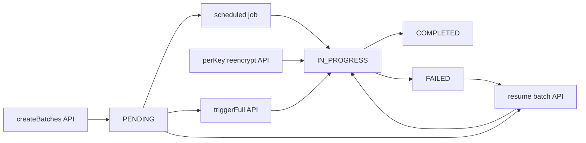

# Re-encryption operations (Global Admin)

Short reference for **encryption key rotation**, **re-encryption batches**, and the related Admin API / UI. Audience: Global Admins and QA (familiar with Ezkey; not a tutorial).

For ciphertext format and rotation mechanics, see [ENCRYPTION_KEY_ROTATION_IMPLEMENTATION.md](./ENCRYPTION_KEY_ROTATION_IMPLEMENTATION.md).

---

## 1. Concepts

- **PRIMARY** — Current key from the Tink keyset; all **new** encryption uses this key.
- **ENABLED (non-PRIMARY)** — Older keys still needed to **decrypt** existing rows until those rows are migrated.
- **Re-encryption batch** — One unit of work in table `ezkey_reencryption_batch`: migrate ciphertext for a **single target** (database table + column) from one **old** non-PRIMARY key to the **current PRIMARY** key. Batches are only created when at least one row still uses that old key for that column (see `ENC:{keyId}:%` prefix in code).
- **Targets** — Discovered from `Reencryptable` entities in code (currently four `(table, column)` pairs across `ezkey_enrollment` and `ezkey_auth_attempt`). The destination key is always the **current PRIMARY** resolved from the keyset.

The batch list is a **work queue** plus **historical rows** (completed batches are retained unless archived elsewhere).

---

## 2. Endpoint map

| Endpoint | Creates batch rows? | Processes crypto? | Scope |
|----------|--------------------|-------------------|--------|
| `POST /api/v1/encryption-keys/reencrypt/create-batches` | Yes (`createBatchesForOldKeys`) | No | All ENABLED non-PRIMARY keys × targets with data |
| `POST /api/v1/encryption-keys/reencrypt/trigger` | Yes (same helper), then processes | Yes (`processBatch` per batch) | Pending + resumable batches after creation |
| `POST /api/v1/encryption-keys/{keyId}/reencrypt` | Yes, then processes | Yes | One old key only |
| `GET /api/v1/encryption-keys/reencryption-batches` | — | — | Lists batch rows (monitoring); paginated with optional filters |
| `POST /api/v1/encryption-keys/reencryption-batches/{batchId}/resume` | — | Yes (that batch) | One batch |

---

## 3. Scheduler vs manual APIs

The scheduled job (`processReencryptionBatches`, cron + ShedLock):

1. Collects batches eligible for processing (resumable + `PENDING`) **before** creating new ones.
2. Calls `createBatchesForOldKeys()` (may insert new `PENDING` rows).
3. Processes up to configured **max batches per run** and **max duration**.

Therefore, **batches created in step 2 are not necessarily processed in the same run**; they are picked up on a **later** run unless you use **Trigger full**, **Resume**, or **per-key re-encrypt** to process sooner.

**Processing boundary:** Each `processBatch` run executes in its **own transaction** (new persistence context per batch). That limits stale JPA state when **Trigger full** or the scheduler processes many batches back-to-back, and reduces optimistic-lock conflicts with concurrent writers updating the same rows (e.g. enrollments under load).

`POST .../reencrypt/create-batches` only performs batch **creation** — useful to prepare work for the next scheduler tick or to inspect the queue without immediate load.

---

## 4. Operational scenarios

| Situation | Suggested action |
|-----------|-------------------|
| Routine migration after rotation | Wait for the scheduled job; monitor batches and key counters. |
| Need migration immediately (incident, test) | `reencrypt/trigger` or per-key `/{keyId}/reencrypt`. |
| Prepare work without processing | `reencrypt/create-batches`. |
| One old key only | `POST .../{keyId}/reencrypt`. |
| Batch stuck or failed | Inspect row; `POST .../reencryption-batches/{batchId}/resume`. |

---

## 5. Admin UI (encryption keys page)

- **Re-encrypt** (per ENABLED key in the table) — maps to `POST .../{keyId}/reencrypt`.
- **Re-encryption Batches** section — **Create Batches** → `create-batches`; **Trigger Full Re-encryption** → `reencrypt/trigger`; row **Resume** → `resume` for `PENDING` or `FAILED` batches.

---

## 6. QA checklist (minimal)

| Action | API | Expect |
|--------|-----|--------|
| Create batches only | `POST .../reencrypt/create-batches` | New `PENDING` rows possible; no ciphertext change until processing |
| Full trigger | `POST .../reencrypt/trigger` | Batches created (where needed) and processed in one request |
| Per-key | `POST .../{keyId}/reencrypt` | Batches for that key only; processed |
| Resume | `POST .../reencryption-batches/{id}/resume` | That batch runs `processBatch` |

### Response field: `batchesCreated` on full trigger

`ReencryptionTriggerResponse.batchesCreated` is the **count of batches in the processing set** after `createBatchesForOldKeys()` (pending + resumable), **not** strictly “rows inserted in this call only.” Use [`ReencryptionService.triggerFullReencryption()`](../ezkey-core/src/main/java/org/ezkey/security/ReencryptionService.java) when interpreting counts.

---

## 7. Batch list size and pagination

- **Active work** (pending / in-progress / failed) stays a **small** number: bounded by **targets × old keys with remaining data** (today: four targets).
- **Total rows** in `ezkey_reencryption_batch` can **grow over time** because completed batches are not deleted by default; growth tracks **rotation history**, not tenant or user volume.
- **`GET .../reencryption-batches`** returns a **paged** body (`content` + `page`) with standard `page`, `size`, `sort`, plus optional filters: `status`, `targetTable`, `targetColumn`, `oldKeyId`, `newKeyId`, and **inclusive** `createdAfter` / `createdBefore` on `createdAt` (ISO-8601). The Admin UI encryption keys page uses the same contract (filters, sort, total count in the section header).
- **Completion note (initiative):** Re-encryption batch list pagination and filters shipped; no further action unless archival or purge of old batch rows is required later.

---

## 8. State flow (Mermaid)

**Legend:** **create-batches** only enqueues. **Trigger full**, **scheduler**, and **resume** drive `processBatch`. **Per-key re-encrypt** creates and processes batches for one old key.
