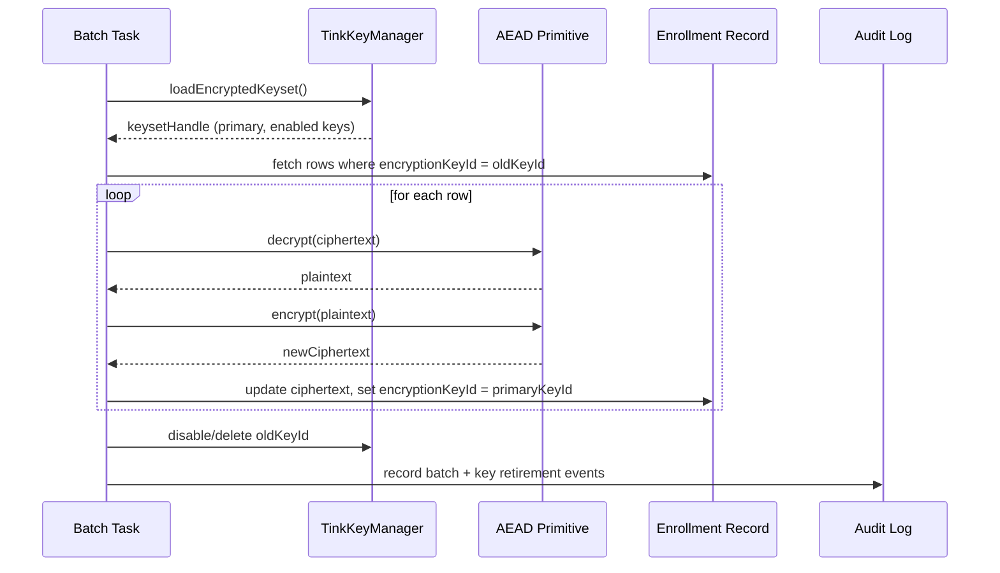

# Key Rotation Batch Strategy Overview

## Context

This note summarizes the recent design discussion about Ezkey's Tink-based envelope encryption, the selective data re-encryption batch we plan to implement, and how these choices support SOC 2 compliance. It captures the rationale so future implementation work has the full context.

## Envelope Encryption Recap

- **Master Key (Level 1)**: Stored outside the app directory (e.g., `/etc/ezkey/secrets/master.key`), used to derive the master AEAD.
- **Keyset / DEK (Level 2)**: Encrypted with the master AEAD using Tink's encrypted-keyset JSON envelope. The file keyset (`/etc/ezkey/keysets/keyset.json.encrypted`) and the database synchronization row (`ezkey_keyset_blob.keyset_data`) use the same Tink envelope concept. Multiple key versions may coexist; keyset metadata such as key IDs and primary-key status is operational metadata, not key material.
- **Sensitive Data (Level 3)**: Database values such as `integrationPrivateKey`, proof tokens, etc., encrypted via the AEAD returned by the keyset handle.


## Rotation Behaviour

1. **Standard rotation** (every 90 days) mutates only the keyset:
   - Add a new key, promote it to PRIMARY.
   - Keep previous keys ENABLED so legacy ciphertext continues to decrypt.
   - No immediate database writes required.
2. **Optional data re-encryption** is only needed when we want to drop an old key (e.g., for SOC 2 hygiene or if a key is suspected).

This matches SOC 2 expectations: demonstrate regular key rotation, maintain audit trails, and have a documented plan to respond to incidents.

## Selective Re-Encryption Strategy

Different data classes imply different handling:

- **Persistent secrets (e.g., integration private keys)**: Keep an `encryptionKeyId` alongside the ciphertext. When a key is scheduled for retirement, the batch will re-encrypt only records still tied to that key.
- **Ephemeral artifacts (e.g., auth attempt tokens)**: Prefer aggressive TTL/purge over re-encryption.
- **Archival/audit stores**: Either re-encrypt on demand or export to a separate encrypted store.

This approach limits batch size while allowing us to retire old keys promptly.

### Batch Workflow (Pseudo-Code)

```pseudo
function reencryptKeyGeneration(oldKeyId):
    masterKey    = readBytes("/etc/ezkey/secrets/master.key")
    masterAead   = initMasterAead(masterKey)
    keyset       = loadEncryptedKeyset("/etc/ezkey/keysets/keyset.json.encrypted", masterAead)
    currentAead  = keyset.getPrimitive(AEAD)
    primaryKeyId = keyset.getPrimaryKeyId()

    for chunk in enrollmentRepository.streamByKeyId(oldKeyId, batchSize):
        transaction {
            for enrollment in chunk:
                plaintext  = currentAead.decrypt(enrollment.ciphertext, null)
                ciphertext = currentAead.encrypt(plaintext, null)
                enrollment.ciphertext        = ciphertext
                enrollment.encryptionKeyId   = primaryKeyId
                enrollment.lastReencryptedAt = now()
            enrollmentRepository.saveAll(chunk)
            auditLog.record("REENCRYPT_CHUNK", size=chunk.size, keyId=primaryKeyId)
        } onFailure {
            retryQueue.enqueue(chunk, reason)
        }

    keyset.disable(oldKeyId)
    keyset.delete(oldKeyId)
    persistKeyset(keyset, masterAead)
    auditLog.record("KEY_RETIREMENT", keyId=oldKeyId, status="SUCCESS")
```

### Record-Level Interaction



## SOC 2 Alignment

- **CC6.6 / CC6.7**: Encryption at rest with versioned key management and secure storage of secrets.
- **CC6.8**: Automated rotations (schedule + manual override) plus a documented process to retire keys.
- **Incident Response**: If compromise is suspected, run the batch immediately for the affected keys prior to disabling them.
- **Evidence**: Maintain rotation logs, keyset histories, runbooks, and batch execution reports for the last 12 months.

## Next Steps

1. Implement an `encryptionKeyId` metadata column for persistent records.
2. Build the selective batch job plus supporting repository queries.
3. Add operational runbooks (rotation schedule, manual trigger, incident response).
4. Extend audit logging and monitoring to capture batch activity and key retirement.

With this blueprint, the implementation can proceed while staying aligned with SOC 2 expectations and keeping operational overhead minimal.


