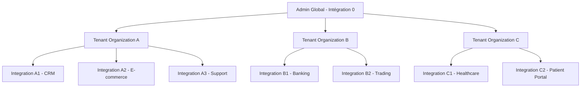
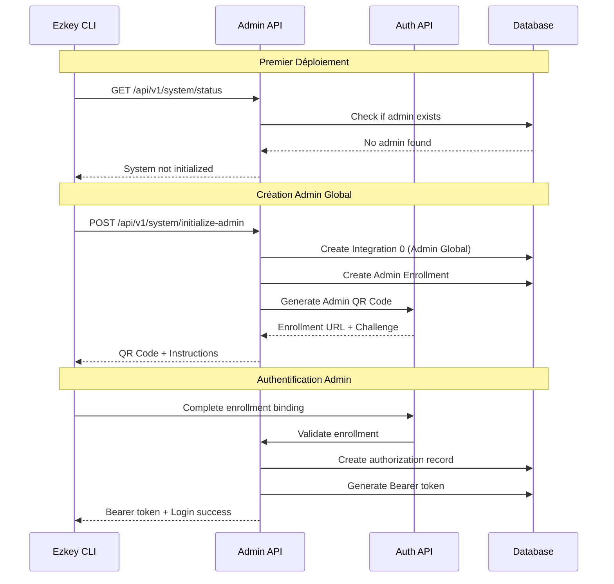
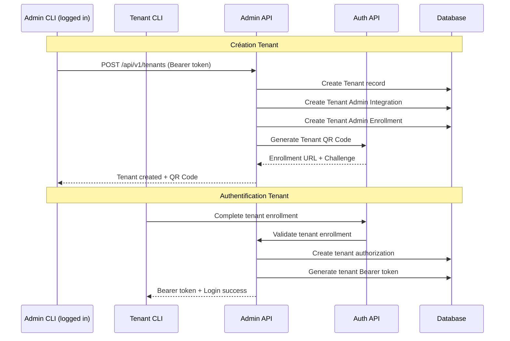

# Ezkey Admin API Security & Multi-Tenant Architecture

## Preambule - Contexte et Vision

Ce document analyse la sécurisation complète de l'admin-api et l'implémentation d'une architecture multi-tenant pour Ezkey. Le concept central est l'application du principe **"Eat Your Own Dog Food"** : Ezkey utilisera sa propre solution MFA pour sécuriser ses propres APIs administratives.

### Vision Architecturale

- **Admin Global (Intégration 0)** : Premier utilisateur système avec privilèges complets
- **Tenants Organisés** : Organisations créées par l'admin avec leurs propres intégrations
- **Authentification Ezkey** : Spring Security intégré avec Ezkey comme méthode d'authentification
- **CLI-First Design** : Interface privilégiée via CLI, exception pour demo-acme-app
- **Bearer Token Management** : Système de jetons sécurisés avec expiration

---

## 1. Architecture de Sécurité

### 1.1 Principe "Eat Your Own Dog Food"

**Concept Fondamental :**
- L'admin-api sera sécurisée en utilisant Ezkey lui-même comme méthode d'authentification
- Spring Security sera configuré pour valider les Bearer tokens générés par Ezkey
- Chaque utilisateur (admin global ou tenant) aura son propre enrollment pour s'authentifier

**Avantages :**
- Démonstration concrète de la solution
- Sécurité cryptographique forte (RSA-2048)
- Cohérence architecturale
- Validation continue de la solution

### 1.2 Hiérarchie des Utilisateurs



**Niveaux d'Accès :**
1. **Admin Global** : Contrôle total, création de tenants
2. **Tenant Admin** : Contrôle de ses intégrations uniquement
3. **Integration Users** : Accès via les intégrations du tenant

---

## 2. Modèle de Données Multi-Tenant

### 2.1 Nouvelles Entités (à ajouter dans V1__initial_schema.sql)

#### A. Table `ezkey_authorization`
```sql
CREATE TABLE ezkey_authorization (
    authorization_id INT GENERATED ALWAYS AS IDENTITY PRIMARY KEY,
    user_type VARCHAR(20) NOT NULL CHECK (user_type IN ('ADMIN_GLOBAL', 'TENANT_ADMIN')),
    integration_id INT NOT NULL REFERENCES ezkey_integration(integration_id),
    enrollment_id INT NOT NULL REFERENCES ezkey_enrollment(enrollment_id),
    bearer_token TEXT NOT NULL UNIQUE,
    token_expires_at TIMESTAMP NOT NULL,
    created_at TIMESTAMP DEFAULT CURRENT_TIMESTAMP NOT NULL,
    last_used_at TIMESTAMP,
    active BOOLEAN DEFAULT TRUE NOT NULL
);
```

#### B. Table `ezkey_tenant`
```sql
CREATE TABLE ezkey_tenant (
    tenant_id INT GENERATED ALWAYS AS IDENTITY PRIMARY KEY,
    tenant_name VARCHAR(100) NOT NULL UNIQUE,
    admin_integration_id INT NOT NULL REFERENCES ezkey_integration(integration_id),
    admin_enrollment_id INT NOT NULL REFERENCES ezkey_enrollment(enrollment_id),
    created_by_authorization_id INT NOT NULL REFERENCES ezkey_authorization(authorization_id),
    created_at TIMESTAMP DEFAULT CURRENT_TIMESTAMP NOT NULL,
    active BOOLEAN DEFAULT TRUE NOT NULL
);
```

### 2.2 Modifications des Entités Existantes (dans V1__initial_schema.sql)

#### A. Table `ezkey_integration` - Ajout des Colonnes Tenant
```sql
-- Ajouter ces colonnes dans la définition initiale de ezkey_integration
tenant_id INT REFERENCES ezkey_tenant(tenant_id),
is_admin_integration BOOLEAN DEFAULT FALSE,
created_by_authorization_id INT REFERENCES ezkey_authorization(authorization_id)
```

**Logique des Flags :**
- `is_admin_integration = TRUE` : Intégration système (Admin Global ou Tenant Admin)
- `tenant_id = NULL` : Intégration Admin Global (ID 0)
- `tenant_id = X` : Intégration appartenant au tenant X

---

## 3. Flux d'Authentification et Autorisation

### 3.1 Premier Déploiement - Initialisation Admin Global



### 3.2 Création de Tenant



---

## 4. Spring Security Configuration

### 4.1 Architecture de Sécurité

```java
@Configuration
@EnableWebSecurity
public class EzkeySecurityConfig {
    
    @Bean
    public SecurityFilterChain adminApiFilterChain(HttpSecurity http) throws Exception {
        return http
            .securityMatcher("/api/v1/**")
            .authorizeHttpRequests(auth -> auth
                .requestMatchers("/api/v1/system/status", "/api/v1/system/initialize-admin")
                    .permitAll()
                .requestMatchers("/api/v1/tenants/**")
                    .hasRole("ADMIN_GLOBAL")
                .anyRequest()
                    .authenticated()
            )
            .oauth2ResourceServer(oauth2 -> oauth2
                .jwt(jwt -> jwt
                    .decoder(ezkeyJwtDecoder())
                    .jwtAuthenticationConverter(ezkeyJwtConverter())
                )
            )
            .build();
    }
}
```

### 4.2 Validation des Bearer Tokens

```java
@Component
public class EzkeyTokenValidator {
    
    public EzkeyAuthentication validateBearerToken(String bearerToken) {
        // 1. Vérifier que le token existe dans ezkey_authorization
        // 2. Vérifier que le token n'est pas expiré
        // 3. Vérifier que l'enrollment est toujours actif
        // 4. Mettre à jour last_used_at
        // 5. Retourner les informations d'authentification
    }
}
```

---

## 5. CLI Integration

### 5.1 Nouvelles Commandes CLI

```bash
# Authentification
ezkey login admin                    # Login as global admin
ezkey login garage-du-coin           # Login as tenant
ezkey logout                         # Clear session

# Gestion des sessions
ezkey session status                 # Show current session
ezkey session refresh                # Refresh token if needed

# Gestion des tenants (Admin Global uniquement)
ezkey tenant create --name "Garage du Coin"
ezkey tenant list
ezkey tenant delete --id 123
```

### 5.2 Gestion des Sessions CLI

**Fichier de Session :** `~/.ezkey/session.json`
```json
{
  "userType": "ADMIN_GLOBAL",
  "tenantId": null,
  "bearerToken": "eyJhbGciOiJSUzI1NiJ9...",
  "expiresAt": "2025-01-21T15:30:00Z",
  "integrationId": 0,
  "enrollmentId": 1
}
```

---

## 6. Impacts sur les APIs Existantes

### 6.1 Admin API - Endpoints Sécurisés

**Tous les endpoints existants seront sécurisés :**

| Endpoint | Admin Global | Tenant Admin | Notes |
|----------|-------------|--------------|-------|
| `GET /integrations` | ✅ Toutes | ✅ Ses intégrations | Filtrage par tenant |
| `POST /integrations` | ✅ Partout | ✅ Son tenant | Auto-assignation tenant |
| `GET /enrollments` | ✅ Toutes | ✅ Ses enrollments | Filtrage par intégrations |
| `POST /enrollments` | ✅ Partout | ✅ Ses intégrations | Validation ownership |
| `GET /auth-attempts` | ✅ Toutes | ✅ Ses tentatives | Filtrage par enrollments |

### 6.2 Auth API - Aucun Impact

**L'auth-api reste inchangée :**
- Pas de sécurisation nécessaire (mobile-focused)
- Les endpoints existants fonctionnent identiquement
- Pas d'impact sur les flows d'enrollment et d'authentification

### 6.3 Nouveaux Endpoints Admin API

```bash
# Gestion système
GET  /api/v1/system/status                    # Statut d'initialisation
POST /api/v1/system/initialize-admin          # Premier setup

# Gestion des tenants (Admin Global)
GET    /api/v1/tenants                        # Liste des tenants
POST   /api/v1/tenants                        # Créer un tenant
GET    /api/v1/tenants/{id}                   # Détails d'un tenant
DELETE /api/v1/tenants/{id}                   # Supprimer un tenant

# Authentification
POST /api/v1/auth/login                       # Login avec enrollment
POST /api/v1/auth/logout                      # Logout et invalidation token
POST /api/v1/auth/refresh                     # Renouveler token
```

---

## 7. Intégration avec les Applications Demo

### 7.1 Demo ACME App - Exception UI

**Modifications nécessaires :**
- Ajout d'un système de login/logout
- Interface de sélection de tenant
- Gestion des sessions utilisateur
- Adaptation des appels API avec Bearer tokens

**Nouveau Flow :**
1. Page de login avec sélection tenant
2. Authentification via Ezkey (QR code)
3. Session utilisateur avec token
4. Interface admin adaptée au tenant

### 7.2 Demo Device App - Support Multi-Tenant

**Modifications minimales :**
- Dropdown initial pour sélection du tenant
- Persistance du choix de tenant
- Adaptation des flows existants

**Interface proposée :**
```
┌─────────────────────────────┐
│     EZKEY DEMO DEVICE       │
├─────────────────────────────┤
│ Select Tenant:              │
│ ┌─────────────────────────┐ │
│ │ [Admin Global]     ▼   │ │
│ └─────────────────────────┘ │
│                             │
│  [📱 Mobile App Simulator]  │
│                             │
│  [🔧 Admin Panel Access]    │
└─────────────────────────────┘
```

---

## 8. Migration et Déploiement

### 8.1 Stratégie de Migration (Pre-Release)

**Contraintes Pre-Release :**
- Modification directe de la migration Flyway V1 existante
- Aucune donnée de production à préserver
- Seules des données de test existent actuellement

**Approche Simplifiée :**
1. **Modification V1__initial_schema.sql** - Ajout des nouvelles tables et colonnes
2. **Reset complet** - Suppression et recréation de la base de données
3. **Pas de migration progressive** - Implémentation directe du nouveau modèle

### 8.2 Procédure de Déploiement

**Étapes de Migration :**
```sql
-- 1. Suppression complète de la base (données test uniquement)
DROP DATABASE ezkey_db;
CREATE DATABASE ezkey_db;

-- 2. Exécution de la migration V1 modifiée
-- Toutes les nouvelles tables et colonnes sont créées d'un coup

-- 3. Aucune migration de données nécessaire
-- Les données test seront recréées via les APIs
```

---

## 9. Sécurité et Considérations

### 9.1 Gestion des Tokens

**Expiration des Tokens :**
- Durée de vie configurable (défaut : 24h)
- Refresh automatique possible
- Invalidation immédiate lors du logout

**Sécurité des Tokens :**
- Génération cryptographiquement sécurisée
- Stockage sécurisé côté client
- Rotation automatique des tokens

### 9.2 Isolation des Données

**Principe de Séparation :**
- Filtrage strict par tenant au niveau service
- Validation d'ownership sur toutes les opérations
- Isolation complète des données entre tenants

### 9.3 Audit et Monitoring

**Traçabilité :**
- Logs de toutes les opérations admin
- Traçage des créations de tenants
- Monitoring des tentatives d'accès non autorisées

---

## 10. Roadmap d'Implémentation

### Phase 1 - Fondations (2-3 semaines)
- [ ] Modification de la migration Flyway V1__initial_schema.sql
- [ ] Création des nouvelles entités JPA
- [ ] Reset et recréation de la base de données
- [ ] Configuration Spring Security de base

### Phase 2 - Authentification (2-3 semaines)
- [ ] Implémentation du système de tokens
- [ ] Création des endpoints d'authentification
- [ ] Validation des Bearer tokens

### Phase 3 - Multi-Tenant (3-4 semaines)
- [ ] Logique de filtrage par tenant
- [ ] Création et gestion des tenants
- [ ] Adaptation des services existants

### Phase 4 - CLI Integration (2-3 semaines)
- [ ] Nouvelles commandes CLI
- [ ] Gestion des sessions
- [ ] Support multi-tenant CLI

### Phase 5 - Demo Apps (2-3 semaines)
- [ ] Adaptation demo-acme-app
- [ ] Support multi-tenant demo-device
- [ ] Tests end-to-end

---

## 11. Conclusion

Cette architecture propose une sécurisation complète de l'admin-api tout en introduisant un modèle multi-tenant robuste. Le principe "Eat Your Own Dog Food" assure la cohérence architecturale et la validation continue de la solution Ezkey.

**Avantages clés :**
- Sécurité cryptographique forte
- Isolation complète des tenants
- Interface CLI-first avec exception UI
- Migration progressive possible
- Maintenabilité et extensibilité

**Prochaines étapes :**
1. Validation de ce document
2. Définition détaillée du plan d'implémentation
3. Début du développement Phase 1

---

*Document créé le 21 janvier 2025 - Version 1.0*
