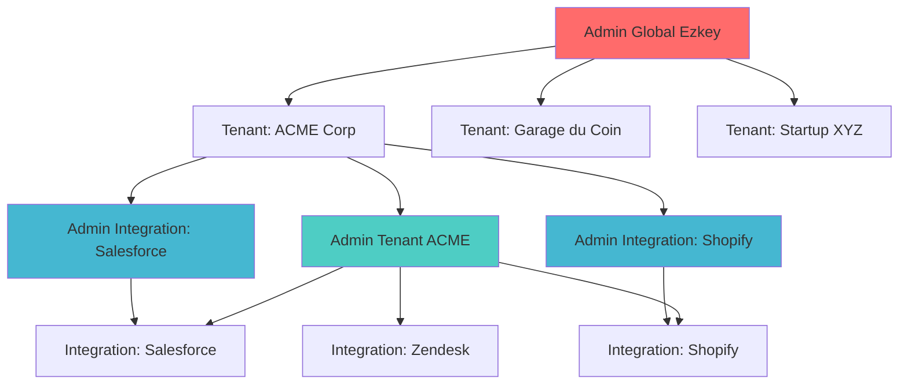
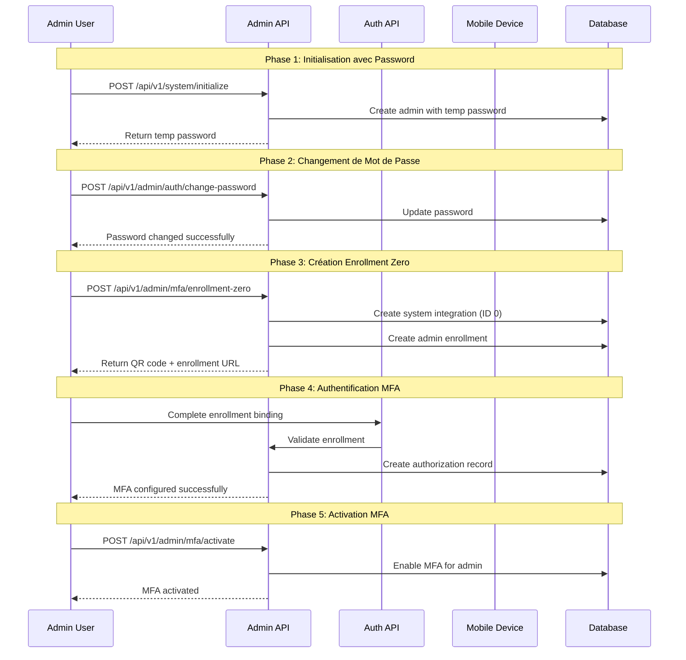
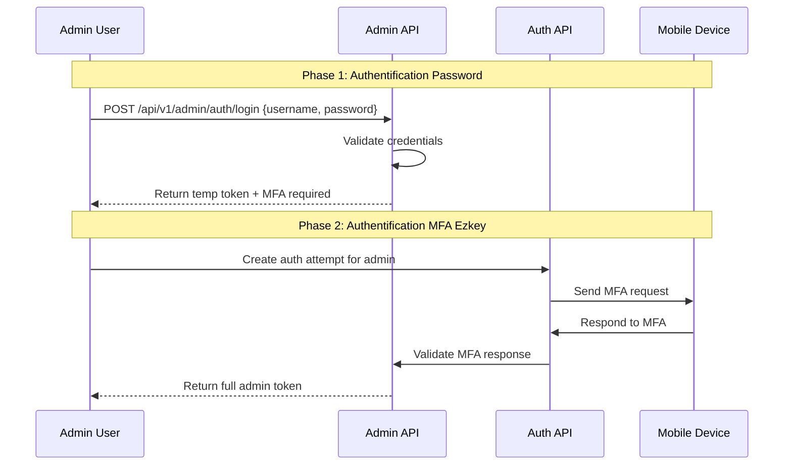
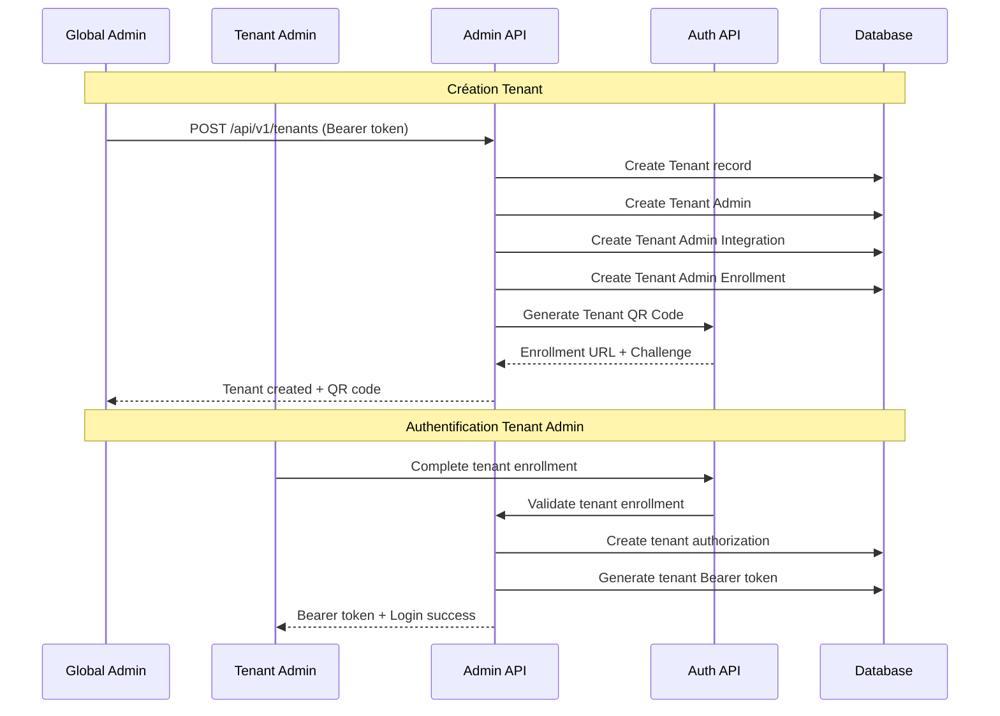

# Ezkey Admin API Security & Multi-Tenant Architecture

## Préambule - Contexte et Vision

Ce document définit la stratégie complète de sécurisation de l'admin-api et l'implémentation d'une architecture multi-tenant pour Ezkey. Le concept central est l'application du principe **"Eat Your Own Dog Food"** : Ezkey utilise sa propre solution MFA pour sécuriser ses propres APIs administratives.

### Vision Architecturale

- **Hiérarchie d'Administrateurs** : Admin Global, Admin Tenant, Admin d'Intégration
- **Authentification Hybride** : Password + MFA Ezkey pour une sécurité maximale
- **Migration Progressive** : Démarrage sécurisé avec passage graduel vers MFA
- **Isolation Multi-Tenant** : Séparation complète des données par organisation
- **Démonstration de Valeur** : Ezkey sécurise ses propres APIs

---

## 1. Architecture de Sécurité

### 1.1 Principe "Eat Your Own Dog Food"

**Concept Fondamental :**
- L'admin-api est sécurisée en utilisant Ezkey lui-même comme méthode d'authentification MFA
- Spring Security est configuré pour valider les Bearer tokens avec authentification hybride
- Chaque administrateur a son propre enrollment pour s'authentifier via Ezkey
- Démonstration concrète de la valeur et de la fiabilité de la solution

**Avantages :**
- Démonstration concrète de la solution
- Sécurité cryptographique forte (RSA-2048)
- Cohérence architecturale
- Validation continue de la solution
- Confiance renforcée des utilisateurs

### 1.2 Hiérarchie des Administrateurs



**Niveaux d'Accès :**

1. **Admin Global Ezkey** : Contrôle total du système, création de tenants
2. **Admin Tenant** : Contrôle des intégrations de son organisation
3. **Admin d'Intégration** : Contrôle spécifique d'une intégration

### 1.3 Types d'Administrateurs

#### A. Admin Global Ezkey
```java
/**
 * Administrateur global du système Ezkey.
 * <p>
 * Responsabilités :
 * - Gestion du système Ezkey
 * - Création et gestion des tenants
 * - Accès à toutes les données système
 * - Gestion des autres administrateurs globaux
 * </p>
 */
public class GlobalAdminPermissions {
    
    // ✅ Peut créer des tenants
    public void createTenant(String tenantName) { }
    
    // ✅ Peut gérer tous les tenants
    public void manageAllTenants() { }
    
    // ✅ Peut voir toutes les données système
    public void accessSystemData() { }
    
    // ✅ Peut créer d'autres admins globaux
    public void createGlobalAdmins() { }
    
    // ❌ Ne peut pas créer d'intégrations directement
    // ❌ Ne peut pas créer d'enrollments directement
}
```

#### B. Admin Tenant
```java
/**
 * Administrateur d'un tenant spécifique.
 * <p>
 * Responsabilités :
 * - Gestion des intégrations de son tenant
 * - Création d'admins d'intégration
 * - Gestion des enrollments pour toutes ses intégrations
 * - Gestion des auth attempts pour toutes ses intégrations
 * </p>
 */
public class TenantAdminPermissions {
    
    // ✅ Peut créer des intégrations pour son tenant
    public void createIntegrationsForTenant(Integer tenantId) { }
    
    // ✅ Peut créer des admins d'intégration
    public void createIntegrationAdmins(Integer integrationId) { }
    
    // ✅ Peut gérer les enrollments de toutes ses intégrations
    public void manageEnrollmentsForAllIntegrations(Integer tenantId) { }
    
    // ✅ Peut gérer les auth attempts de toutes ses intégrations
    public void manageAuthAttemptsForAllIntegrations(Integer tenantId) { }
    
    // ❌ Ne peut pas accéder aux données d'autres tenants
    // ❌ Ne peut pas créer de tenants
}
```

#### C. Admin d'Intégration
```java
/**
 * Administrateur d'une intégration spécifique.
 * <p>
 * Responsabilités :
 * - Gestion des enrollments pour son intégration
 * - Gestion des auth attempts pour son intégration
 * - Accès limité aux données de son intégration uniquement
 * </p>
 */
public class IntegrationAdminPermissions {
    
    // ✅ Peut créer des enrollments pour son intégration
    public void createEnrollmentsForIntegration(Integer integrationId) { }
    
    // ✅ Peut gérer les auth attempts pour son intégration
    public void manageAuthAttemptsForIntegration(Integer integrationId) { }
    
    // ✅ Peut voir les données de son intégration
    public void viewIntegrationData(Integer integrationId) { }
    
    // ❌ Ne peut pas créer d'intégrations
    // ❌ Ne peut pas accéder aux autres intégrations du tenant
    // ❌ Ne peut pas créer d'admins
}
```

---

## 2. Modèle de Données Multi-Tenant

### 2.1 Tables Principales

#### A. Table `ezkey_admin`
```sql
CREATE TABLE ezkey_admin (
    admin_id INT GENERATED ALWAYS AS IDENTITY PRIMARY KEY,
    username VARCHAR(50) NOT NULL UNIQUE,
    password_hash VARCHAR(255) NOT NULL,
    admin_type VARCHAR(20) NOT NULL CHECK (admin_type IN ('GLOBAL_ADMIN', 'TENANT_ADMIN', 'INTEGRATION_ADMIN')),
    tenant_id INT REFERENCES ezkey_tenant(tenant_id),
    integration_id INT REFERENCES ezkey_integration(integration_id),
    mfa_enabled BOOLEAN DEFAULT TRUE NOT NULL,
    mfa_required BOOLEAN DEFAULT TRUE NOT NULL,
    enrollment_id INT REFERENCES ezkey_enrollment(enrollment_id),
    password_change_required BOOLEAN DEFAULT FALSE NOT NULL,
    created_by_admin_id INT REFERENCES ezkey_admin(admin_id),
    created_at TIMESTAMP DEFAULT CURRENT_TIMESTAMP NOT NULL,
    last_login_at TIMESTAMP,
    last_password_change TIMESTAMP,
    active BOOLEAN DEFAULT TRUE NOT NULL,
    
    -- Contraintes de hiérarchie
    CONSTRAINT check_admin_hierarchy CHECK (
        (admin_type = 'GLOBAL_ADMIN' AND tenant_id IS NULL AND integration_id IS NULL) OR
        (admin_type = 'TENANT_ADMIN' AND tenant_id IS NOT NULL AND integration_id IS NULL) OR
        (admin_type = 'INTEGRATION_ADMIN' AND tenant_id IS NOT NULL AND integration_id IS NOT NULL)
    )
);
```

#### B. Table `ezkey_tenant`
```sql
CREATE TABLE ezkey_tenant (
    tenant_id INT GENERATED ALWAYS AS IDENTITY PRIMARY KEY,
    tenant_name VARCHAR(100) NOT NULL UNIQUE,
    tenant_description TEXT,
    created_by_admin_id INT NOT NULL REFERENCES ezkey_admin(admin_id),
    created_at TIMESTAMP DEFAULT CURRENT_TIMESTAMP NOT NULL,
    active BOOLEAN DEFAULT TRUE NOT NULL
);
```

#### C. Table `ezkey_admin_tokens`
```sql
CREATE TABLE ezkey_admin_tokens (
    token_id INT GENERATED ALWAYS AS IDENTITY PRIMARY KEY,
    bearer_token VARCHAR(255) NOT NULL UNIQUE,
    admin_id INT NOT NULL REFERENCES ezkey_admin(admin_id),
    admin_type VARCHAR(20) NOT NULL,
    tenant_id INT REFERENCES ezkey_tenant(tenant_id),
    integration_id INT REFERENCES ezkey_integration(integration_id),
    created_at TIMESTAMP DEFAULT CURRENT_TIMESTAMP NOT NULL,
    expires_at TIMESTAMP NOT NULL,
    last_used_at TIMESTAMP,
    ip_address INET,
    user_agent TEXT,
    active BOOLEAN DEFAULT TRUE NOT NULL
);
```

#### D. Table `ezkey_admin_temp_tokens`
```sql
CREATE TABLE ezkey_admin_temp_tokens (
    temp_token_id INT GENERATED ALWAYS AS IDENTITY PRIMARY KEY,
    temp_token VARCHAR(255) NOT NULL UNIQUE,
    admin_id INT NOT NULL REFERENCES ezkey_admin(admin_id),
    created_at TIMESTAMP DEFAULT CURRENT_TIMESTAMP NOT NULL,
    expires_at TIMESTAMP NOT NULL,
    mfa_required BOOLEAN DEFAULT TRUE NOT NULL,
    active BOOLEAN DEFAULT TRUE NOT NULL
);
```

### 2.2 Modifications des Entités Existantes

#### A. Table `ezkey_integration` - Ajout des Colonnes Tenant
```sql
-- Ajouter ces colonnes dans la définition initiale de ezkey_integration
tenant_id INT REFERENCES ezkey_tenant(tenant_id),
is_system_integration BOOLEAN DEFAULT FALSE,
created_by_admin_id INT REFERENCES ezkey_admin(admin_id)
```

**Logique des Flags :**
- `is_system_integration = TRUE` : Intégration système (Admin Global ou Tenant Admin)
- `tenant_id = NULL` : Intégration Admin Global (ID 0)
- `tenant_id = X` : Intégration appartenant au tenant X

---

## 3. Flux d'Authentification Hybride

### 3.1 Stratégie de Déploiement Progressive



### 3.2 Authentification Hybride (Password + MFA)



### 3.3 Création de Tenant



---

## 4. Spring Security Configuration

### 4.1 Configuration de Sécurité Hybride

```java
/**
 * Configuration Spring Security pour l'approche hybride.
 * <p>
 * Combine l'authentification par mot de passe avec
 * l'authentification MFA Ezkey pour une sécurité maximale.
 * </p>
 */
@Configuration
@EnableWebSecurity
@EnableMethodSecurity(prePostEnabled = true)
public class EzkeyHybridSecurityConfig {
    
    @Bean
    public SecurityFilterChain adminApiFilterChain(HttpSecurity http) throws Exception {
        return http
            .securityMatcher("/api/v1/**")
            .authorizeHttpRequests(auth -> auth
                // Endpoints publics (système)
                .requestMatchers("/api/v1/system/status", "/api/v1/system/initialize")
                    .permitAll()
                // Endpoints de santé
                .requestMatchers("/actuator/health", "/actuator/info")
                    .permitAll()
                // Documentation API
                .requestMatchers("/api-docs/**", "/swagger-ui/**", "/swagger-ui/index.html")
                    .permitAll()
                // Gestion des tenants (Admin Global uniquement)
                .requestMatchers("/api/v1/tenants/**")
                    .hasRole("GLOBAL_ADMIN")
                // Tous les autres endpoints nécessitent une authentification
                .anyRequest()
                    .authenticated()
            )
            .oauth2ResourceServer(oauth2 -> oauth2
                .opaqueToken(opaque -> opaque
                    .introspector(adminTokenIntrospector())
                )
            )
            .sessionManagement(session -> session
                .sessionCreationPolicy(SessionCreationPolicy.STATELESS)
            )
            .csrf(csrf -> csrf.disable())
            .headers(headers -> headers
                .frameOptions().deny()
                .contentTypeOptions().and()
                .httpStrictTransportSecurity(hstsConfig -> hstsConfig
                    .maxAgeInSeconds(31536000)
                    .includeSubdomains(true)
                )
            )
            .build();
    }
    
    @Bean
    public OpaqueTokenIntrospector adminTokenIntrospector() {
        return new EzkeyAdminTokenIntrospector();
    }
}
```

### 4.2 Service d'Authentification Hybride

```java
/**
 * Service d'authentification hybride pour les admins Ezkey.
 * <p>
 * Combine l'authentification par mot de passe avec
 * l'authentification MFA Ezkey pour une sécurité renforcée.
 * </p>
 */
@Service
@Transactional
public class EzkeyHybridAuthService {
    
    /**
     * Authentification initiale avec mot de passe.
     */
    public AuthResponse authenticateWithPassword(String username, String password, 
                                               String ipAddress, String userAgent) {
        // 1. Valider les credentials
        EzkeyAdmin admin = validateCredentials(username, password);
        
        if (admin == null) {
            auditLogService.logSecurityEvent("INVALID_CREDENTIALS", username, ipAddress);
            throw new AuthenticationException("Invalid credentials");
        }
        
        // 2. Vérifier si MFA est activé
        if (!admin.isMfaEnabled()) {
            // Authentification directe (mode développement)
            return createFullAdminToken(admin, ipAddress, userAgent);
        }
        
        // 3. Créer un token temporaire (valide 5 minutes)
        String tempToken = generateSecureToken();
        Instant expiresAt = Instant.now().plus(Duration.ofMinutes(5));
        
        AdminTempToken tempTokenEntity = AdminTempToken.builder()
            .tempToken(tempToken)
            .adminId(admin.getAdminId())
            .expiresAt(expiresAt)
            .mfaRequired(true)
            .active(true)
            .build();
        
        tempTokenRepository.save(tempTokenEntity);
        
        // 4. Logger l'authentification partielle
        auditLogService.logAdminAction("PASSWORD_AUTH_SUCCESS", admin.getAdminId(), ipAddress);
        
        return AuthResponse.builder()
            .tempToken(tempToken)
            .mfaRequired(true)
            .expiresAt(expiresAt)
            .message("MFA required for full authentication")
            .build();
    }
    
    /**
     * Valider la réponse MFA et créer le token final.
     */
    public AuthResponse validateMfaResponse(String tempToken, Integer authAttemptId, 
                                          String mfaResponse, String ipAddress) {
        // 1. Valider le token temporaire
        AdminTempToken tempTokenEntity = validateTempToken(tempToken);
        if (tempTokenEntity == null) {
            throw new AuthenticationException("Invalid or expired temporary token");
        }
        
        // 2. Récupérer l'admin
        EzkeyAdmin admin = adminRepository.findById(tempTokenEntity.getAdminId()).orElseThrow();
        
        // 3. Valider la réponse MFA via l'Auth API
        boolean mfaValid = authApiService.validateMfaResponse(authAttemptId, mfaResponse);
        
        if (!mfaValid) {
            auditLogService.logSecurityEvent("MFA_VALIDATION_FAILED", tempToken, ipAddress);
            throw new AuthenticationException("Invalid MFA response");
        }
        
        // 4. Créer le token final d'administration
        String finalToken = generateSecureToken();
        Instant expiresAt = Instant.now().plus(Duration.ofHours(24));
        
        AdminToken finalTokenEntity = AdminToken.builder()
            .bearerToken(finalToken)
            .adminId(admin.getAdminId())
            .adminType(admin.getAdminType())
            .tenantId(admin.getTenantId())
            .integrationId(admin.getIntegrationId())
            .expiresAt(expiresAt)
            .ipAddress(ipAddress)
            .active(true)
            .build();
        
        tokenRepository.save(finalTokenEntity);
        
        // 5. Invalider le token temporaire
        tempTokenEntity.setActive(false);
        tempTokenRepository.save(tempTokenEntity);
        
        // 6. Logger l'authentification complète
        auditLogService.logAdminAction("FULL_AUTH_SUCCESS", admin.getAdminId(), ipAddress);
        
        return AuthResponse.builder()
            .bearerToken(finalToken)
            .mfaRequired(false)
            .expiresAt(expiresAt)
            .adminType(admin.getAdminType())
            .tenantId(admin.getTenantId())
            .integrationId(admin.getIntegrationId())
            .message("Authentication successful")
            .build();
    }
}
```

### 4.3 Contrôle d'Accès Hiérarchique

```java
/**
 * Service de contrôle d'accès hiérarchique pour Ezkey.
 * <p>
 * Implémente la logique de permissions basée sur la hiérarchie
 * des administrateurs et le contexte tenant/intégration.
 * </p>
 */
@Service
public class EzkeyHierarchicalAccessControlService {
    
    /**
     * Vérifie si un admin peut créer une intégration.
     */
    public boolean canCreateIntegration(EzkeyAdminAuthentication auth, Integer tenantId) {
        switch (auth.getAdminType()) {
            case GLOBAL_ADMIN:
                return true; // Peut créer des intégrations partout
                
            case TENANT_ADMIN:
                return auth.getTenantId().equals(tenantId); // Seulement pour son tenant
                
            case INTEGRATION_ADMIN:
                return false; // Ne peut pas créer d'intégrations
                
            default:
                return false;
        }
    }
    
    /**
     * Vérifie si un admin peut créer un enrollment.
     */
    public boolean canCreateEnrollment(EzkeyAdminAuthentication auth, Integer integrationId) {
        switch (auth.getAdminType()) {
            case GLOBAL_ADMIN:
                return true; // Peut créer des enrollments partout
                
            case TENANT_ADMIN:
                // Peut créer des enrollments pour toutes les intégrations de son tenant
                return integrationService.belongsToTenant(integrationId, auth.getTenantId());
                
            case INTEGRATION_ADMIN:
                // Peut créer des enrollments seulement pour son intégration
                return auth.getIntegrationId().equals(integrationId);
                
            default:
                return false;
        }
    }
    
    /**
     * Filtre les intégrations selon les permissions de l'admin.
     */
    public List<Integration> filterIntegrationsByAdmin(EzkeyAdminAuthentication auth, List<Integration> integrations) {
        switch (auth.getAdminType()) {
            case GLOBAL_ADMIN:
                return integrations; // Voir toutes les intégrations
                
            case TENANT_ADMIN:
                return integrations.stream()
                    .filter(integration -> integration.getTenantId().equals(auth.getTenantId()))
                    .collect(Collectors.toList());
                    
            case INTEGRATION_ADMIN:
                return integrations.stream()
                    .filter(integration -> integration.getIntegrationId().equals(auth.getIntegrationId()))
                    .collect(Collectors.toList());
                    
            default:
                return Collections.emptyList();
        }
    }
}
```

---

## 5. Endpoints d'Administration

### 5.1 Endpoints d'Authentification

```bash
# Authentification hybride
POST /api/v1/admin/auth/login                    # Login avec password
POST /api/v1/admin/auth/mfa/attempt             # Créer tentative MFA
POST /api/v1/admin/auth/mfa/validate            # Valider réponse MFA
POST /api/v1/admin/auth/logout                  # Logout et invalidation token
POST /api/v1/admin/auth/change-password         # Changer mot de passe

# Gestion MFA
POST /api/v1/admin/mfa/enrollment-zero          # Créer enrollment zero
POST /api/v1/admin/mfa/activate                 # Activer MFA
POST /api/v1/admin/mfa/deactivate               # Désactiver MFA (dev)
```

### 5.2 Endpoints de Gestion Système

```bash
# Gestion système
GET  /api/v1/system/status                      # Statut d'initialisation
POST /api/v1/system/initialize                  # Premier setup

# Gestion des tenants (Admin Global uniquement)
GET    /api/v1/tenants                          # Liste des tenants
POST   /api/v1/tenants                          # Créer un tenant
GET    /api/v1/tenants/{id}                     # Détails d'un tenant
DELETE /api/v1/tenants/{id}                     # Supprimer un tenant

# Gestion des admins
GET    /api/v1/admins                           # Liste des admins
POST   /api/v1/admins                           # Créer un admin
GET    /api/v1/admins/{id}                      # Détails d'un admin
DELETE /api/v1/admins/{id}                      # Supprimer un admin
```

### 5.3 Endpoints Sécurisés Existants

**Tous les endpoints existants seront sécurisés :**

| Endpoint | Admin Global | Admin Tenant | Admin Integration | Notes |
|----------|-------------|--------------|------------------|-------|
| `GET /integrations` | ✅ Toutes | ✅ Ses intégrations | ✅ Son intégration | Filtrage par tenant |
| `POST /integrations` | ✅ Partout | ✅ Son tenant | ❌ | Auto-assignation tenant |
| `GET /enrollments` | ✅ Toutes | ✅ Ses enrollments | ✅ Son intégration | Filtrage par intégrations |
| `POST /enrollments` | ✅ Partout | ✅ Ses intégrations | ✅ Son intégration | Validation ownership |
| `GET /auth-attempts` | ✅ Toutes | ✅ Ses tentatives | ✅ Son intégration | Filtrage par enrollments |

---

## 6. Migration et Déploiement

### 6.1 Stratégie de Migration Progressive

**Phase 1 : Initialisation avec Password**
```bash
# 1. Premier démarrage
curl -X POST http://localhost:9080/api/v1/system/initialize

# Réponse
{
  "tempPassword": "Kx9#mP2$vL8@nQ4!",
  "message": "Password must be changed on first login",
  "adminId": 1
}
```

**Phase 2 : Changement de Mot de Passe**
```bash
# 2. Changer le mot de passe
curl -X POST http://localhost:9080/api/v1/admin/auth/change-password \
  -H "Authorization: Bearer temp-token" \
  -d '{
    "currentPassword": "Kx9#mP2$vL8@nQ4!",
    "newPassword": "MySecurePassword123!"
  }'
```

**Phase 3 : Création de l'Enrollment Zero**
```bash
# 3. Créer l'enrollment zero
curl -X POST http://localhost:9080/api/v1/admin/mfa/enrollment-zero \
  -H "Authorization: Bearer admin-token"

# Réponse
{
  "enrollmentId": 1,
  "qrCodeData": "data:image/png;base64,iVBORw0KGgoAAAANSUhEUgAA...",
  "enrollmentUrl": "http://localhost:8080/api/v1/enrollments/bind",
  "challenge": 123456
}
```

**Phase 4 : Activation de MFA**
```bash
# 4. Activer MFA
curl -X POST http://localhost:9080/api/v1/admin/mfa/activate \
  -H "Authorization: Bearer admin-token"
```

### 6.2 Stratégie de Migration Progressive

**Principe :** Minimiser les perturbations du code existant et faciliter les tests

**Approche par Étapes :**
1. **Migration V2** - Ajout des nouvelles tables sans modification de V1
2. **Tests existants** - Adaptation graduelle vers la sécurité
3. **Backward compatibility** - Respect des acquis en place
4. **Conventions** - Respect de la structure, DTO, Javadoc existants

### 6.3 Migration V2 - Nouveau Schema

**Fichier :** `V2__add_multi_tenant_security.sql`

```sql
-- Migration V2: Ajout du support multi-tenant et sécurité
-- Cette migration ajoute les nouvelles tables sans modifier les existantes

-- Table des tenants
CREATE TABLE ezkey_tenant (
    tenant_id INT GENERATED ALWAYS AS IDENTITY PRIMARY KEY,
    tenant_name VARCHAR(100) NOT NULL UNIQUE,
    tenant_description TEXT,
    created_by_admin_id INT, -- Sera ajouté après création de ezkey_admin
    created_at TIMESTAMP DEFAULT CURRENT_TIMESTAMP NOT NULL,
    active BOOLEAN DEFAULT TRUE NOT NULL
);

-- Table des administrateurs
CREATE TABLE ezkey_admin (
    admin_id INT GENERATED ALWAYS AS IDENTITY PRIMARY KEY,
    username VARCHAR(50) NOT NULL UNIQUE,
    password_hash VARCHAR(255) NOT NULL,
    admin_type VARCHAR(20) NOT NULL CHECK (admin_type IN ('GLOBAL_ADMIN', 'TENANT_ADMIN', 'INTEGRATION_ADMIN')),
    tenant_id INT REFERENCES ezkey_tenant(tenant_id),
    integration_id INT REFERENCES ezkey_integration(integration_id),
    mfa_enabled BOOLEAN DEFAULT TRUE NOT NULL,
    mfa_required BOOLEAN DEFAULT TRUE NOT NULL,
    enrollment_id INT REFERENCES ezkey_enrollment(enrollment_id),
    password_change_required BOOLEAN DEFAULT FALSE NOT NULL,
    created_by_admin_id INT REFERENCES ezkey_admin(admin_id),
    created_at TIMESTAMP DEFAULT CURRENT_TIMESTAMP NOT NULL,
    last_login_at TIMESTAMP,
    last_password_change TIMESTAMP,
    active BOOLEAN DEFAULT TRUE NOT NULL,
    
    -- Contraintes de hiérarchie
    CONSTRAINT check_admin_hierarchy CHECK (
        (admin_type = 'GLOBAL_ADMIN' AND tenant_id IS NULL AND integration_id IS NULL) OR
        (admin_type = 'TENANT_ADMIN' AND tenant_id IS NOT NULL AND integration_id IS NULL) OR
        (admin_type = 'INTEGRATION_ADMIN' AND tenant_id IS NOT NULL AND integration_id IS NOT NULL)
    )
);

-- Table des tokens d'administration
CREATE TABLE ezkey_admin_tokens (
    token_id INT GENERATED ALWAYS AS IDENTITY PRIMARY KEY,
    bearer_token VARCHAR(255) NOT NULL UNIQUE,
    admin_id INT NOT NULL REFERENCES ezkey_admin(admin_id),
    admin_type VARCHAR(20) NOT NULL,
    tenant_id INT REFERENCES ezkey_tenant(tenant_id),
    integration_id INT REFERENCES ezkey_integration(integration_id),
    created_at TIMESTAMP DEFAULT CURRENT_TIMESTAMP NOT NULL,
    expires_at TIMESTAMP NOT NULL,
    last_used_at TIMESTAMP,
    ip_address INET,
    user_agent TEXT,
    active BOOLEAN DEFAULT TRUE NOT NULL
);

-- Table des tokens temporaires
CREATE TABLE ezkey_admin_temp_tokens (
    temp_token_id INT GENERATED ALWAYS AS IDENTITY PRIMARY KEY,
    temp_token VARCHAR(255) NOT NULL UNIQUE,
    admin_id INT NOT NULL REFERENCES ezkey_admin(admin_id),
    created_at TIMESTAMP DEFAULT CURRENT_TIMESTAMP NOT NULL,
    expires_at TIMESTAMP NOT NULL,
    mfa_required BOOLEAN DEFAULT TRUE NOT NULL,
    active BOOLEAN DEFAULT TRUE NOT NULL
);

-- Ajouter les colonnes tenant aux tables existantes
ALTER TABLE ezkey_integration ADD COLUMN tenant_id INT REFERENCES ezkey_tenant(tenant_id);
ALTER TABLE ezkey_integration ADD COLUMN is_system_integration BOOLEAN DEFAULT FALSE;
ALTER TABLE ezkey_integration ADD COLUMN created_by_admin_id INT REFERENCES ezkey_admin(admin_id);

-- Index pour la performance
CREATE INDEX idx_admin_tokens_active ON ezkey_admin_tokens(bearer_token, active) WHERE active = TRUE;
CREATE INDEX idx_admin_tokens_expired ON ezkey_admin_tokens(expires_at) WHERE active = TRUE;
CREATE INDEX idx_admin_temp_tokens_expired ON ezkey_admin_temp_tokens(expires_at) WHERE active = TRUE;
```

### 6.4 Stratégie des Tests

**Tests Existants - Évolution Graduelle :**

#### A. Tests Unitaires (Core) - **CONSERVER**
```java
// Ces tests restent inchangés car ils testent la logique métier
@ExtendWith(MockitoExtension.class)
class EnrollmentServiceTest {
    // Tests de logique métier - pas d'impact sécurité
}

@DataJpaTest
class AuthAttemptRepositoryTest {
    // Tests de repository - pas d'impact sécurité
}
```

#### B. Tests d'Intégration (Admin-API) - **ADAPTER**
```java
// Avant : Tests non sécurisés
@WebMvcTest(IntegrationController.class)
class IntegrationControllerTest {
    // Tests actuels - à adapter
}

// Après : Tests avec sécurité
@WebMvcTest(IntegrationController.class)
@AutoConfigureTestDatabase(replace = AutoConfigureTestDatabase.Replace.NONE)
@WithMockUser(roles = "GLOBAL_ADMIN")
class IntegrationControllerTest {
    // Tests adaptés avec authentification mockée
}
```

#### C. Nouveaux Tests de Sécurité - **AJOUTER**
```java
@SpringBootTest(webEnvironment = SpringBootTest.WebEnvironment.RANDOM_PORT)
class EzkeySecurityIntegrationTest {
    // Tests d'intégration avec sécurité réelle
}

@WebMvcTest(EzkeyHybridAuthController.class)
class EzkeyHybridAuthControllerTest {
    // Tests des nouveaux endpoints d'authentification
}
```

### 6.5 Intégration dans la Structure Existante

**Principe :** Respecter la structure existante pour permettre les jointures JPA sans problème de persistence unit

**Structure Actuelle Identifiée :**
```
ezkey-core/src/main/java/org/ezkey/
├── integration/
│   ├── domain/entity/Integration.java
│   ├── domain/repository/IntegrationRepository.java
│   └── service/IntegrationService.java
├── enrollment/
│   ├── domain/entity/Enrollment.java
│   ├── domain/repository/EnrollmentRepository.java
│   └── service/EnrollmentService.java
├── authattempt/
│   ├── domain/entity/AuthAttempt.java
│   ├── domain/repository/AuthAttemptRepository.java
│   └── service/AuthAttemptService.java
└── dto/ErrorResponseDto.java
```

**Nouvelles Entités dans ezkey-core :**
```
ezkey-core/src/main/java/org/ezkey/
├── tenant/                    # NOUVEAU
│   ├── domain/entity/Tenant.java
│   ├── domain/repository/TenantRepository.java
│   └── service/TenantService.java
├── admin/                     # NOUVEAU
│   ├── domain/entity/EzkeyAdmin.java
│   ├── domain/repository/EzkeyAdminRepository.java
│   └── service/EzkeyAdminService.java
├── adminauth/                 # NOUVEAU
│   ├── domain/entity/AdminToken.java
│   ├── domain/entity/AdminTempToken.java
│   ├── domain/repository/AdminTokenRepository.java
│   └── service/AdminAuthService.java
└── integration/               # MODIFIÉ
    └── domain/entity/Integration.java  # Ajout colonnes tenant
```

**Configuration JPA Existante à Modifier :**
```java
// ezkey-admin-api/src/main/java/org/ezkey/admin/AdminJpaConfig.java
@Configuration
@EnableJpaRepositories(
        basePackages = { 
                "org.ezkey.integration.domain.repository",
                "org.ezkey.authattempt.domain.repository", 
                "org.ezkey.enrollment.domain.repository",
                "org.ezkey.tenant.domain.repository",        // NOUVEAU
                "org.ezkey.admin.domain.repository",      // NOUVEAU
                "org.ezkey.adminauth.domain.repository",   // NOUVEAU
        })
@EntityScan(
        basePackages = { 
                "org.ezkey.integration.domain.entity",
                "org.ezkey.authattempt.domain.entity", 
                "org.ezkey.enrollment.domain.entity",
                "org.ezkey.tenant.domain.entity",         // NOUVEAU
                "org.ezkey.admin.domain.entity",          // NOUVEAU
                "org.ezkey.adminauth.domain.entity",      // NOUVEAU
        })
public class AdminJpaConfig {
    // Configuration for JPA repositories and entity scanning
}
```

**Scan Packages dans AdminApplication :**
```java
@SpringBootApplication(
        scanBasePackages = { 
                "org.ezkey.admin", 
                "org.ezkey.authattempt", 
                "org.ezkey.enrollment", 
                "org.ezkey.integration", 
                "org.ezkey.exception", 
                "org.ezkey.signature",
                "org.ezkey.tenant",        // NOUVEAU
                "org.ezkey.adminauth",     // NOUVEAU
        })
public class AdminApplication {
    // Application main class
}
```

### 6.6 Préservation du Comportement Existant

**Principe :** Le comportement actuel de admin-api reste identique, seule l'authentification est ajoutée

**Modifications Minimales :**

#### A. Entité Integration - Ajout de Colonnes
```java
// ezkey-core/src/main/java/org/ezkey/integration/domain/entity/Integration.java
@Entity
@Table(name = "ezkey_integration")
public class Integration {
    
    // Colonnes existantes - INCHANGÉES
    @Id
    @GeneratedValue(strategy = GenerationType.IDENTITY)
    @Column(name = "integration_id")
    private Integer integrationId;
    
    @Column(name = "integration_name")
    private String integrationName;
    
    @Column(name = "integration_description")
    private String integrationDescription;
    
    @Column(name = "integration_active")
    private Boolean integrationActive = true;
    
    @Column(name = "created_at")
    private LocalDateTime createdAt;
    
    // NOUVELLES COLONNES - Ajoutées
    @Column(name = "tenant_id")
    private Integer tenantId;
    
    @Column(name = "is_system_integration")
    private Boolean isSystemIntegration = false;
    
    @Column(name = "created_by_admin_id")
    private Integer createdByAdminId;
    
    // Relations JPA - NOUVELLES
    @ManyToOne(fetch = FetchType.LAZY)
    @JoinColumn(name = "tenant_id", insertable = false, updatable = false)
    private Tenant tenant;
    
    @ManyToOne(fetch = FetchType.LAZY)
    @JoinColumn(name = "created_by_admin_id", insertable = false, updatable = false)
    private EzkeyAdmin createdByAdmin;
    
    // Constructeurs, getters, setters existants - INCHANGÉS
    // + Nouveaux getters/setters pour les nouvelles colonnes
}
```

#### B. Services Existants - Pas de Modification
```java
// ezkey-core/src/main/java/org/ezkey/integration/service/IntegrationService.java
@Service
@Transactional
public class IntegrationService {
    
    // Méthodes existantes - INCHANGÉES
    public List<Integration> getAll() { ... }
    public Integration getById(Integer id) { ... }
    public Integration create(IntegrationCreateRequest request) { ... }
    public void delete(Integer id) { ... }
    
    // NOUVELLES méthodes pour le multi-tenant
    public List<Integration> getByTenantId(Integer tenantId) { ... }
    public List<Integration> getByAdminId(Integer adminId) { ... }
}
```

#### C. Controllers Existants - Adaptation Minimale
```java
// ezkey-admin-api/src/main/java/org/ezkey/admin/controller/IntegrationController.java
@RestController
@RequestMapping("/api/v1/integrations")
@Tag(name = "Integrations", description = "Integration management API")
public class IntegrationController {
    
    // Méthodes existantes - INCHANGÉES
    @GetMapping
    public ResponseEntity<List<IntegrationResponseDto>> getAll() {
        // Comportement identique - juste ajout du filtrage par tenant
        List<Integration> integrations = service.getAll();
        // Filtrage automatique par tenant de l'admin connecté
        List<IntegrationResponseDto> responses = mapper.toResponseList(integrations);
        return ResponseEntity.ok(responses);
    }
    
    // Autres méthodes existantes - INCHANGÉES
}
```

### 6.7 Migration V2 - Schema Compatible

**Fichier :** `V2__add_multi_tenant_security.sql`

```sql
-- Migration V2: Ajout du support multi-tenant et sécurité
-- Cette migration ajoute les nouvelles tables sans modifier les existantes

-- Table des tenants
CREATE TABLE ezkey_tenant (
    tenant_id INT GENERATED ALWAYS AS IDENTITY PRIMARY KEY,
    tenant_name VARCHAR(100) NOT NULL UNIQUE,
    tenant_description TEXT,
    created_by_admin_id INT, -- Sera ajouté après création de ezkey_admin
    created_at TIMESTAMP DEFAULT CURRENT_TIMESTAMP NOT NULL,
    active BOOLEAN DEFAULT TRUE NOT NULL
);

-- Table des administrateurs
CREATE TABLE ezkey_admin (
    admin_id INT GENERATED ALWAYS AS IDENTITY PRIMARY KEY,
    username VARCHAR(50) NOT NULL UNIQUE,
    password_hash VARCHAR(255) NOT NULL,
    admin_type VARCHAR(20) NOT NULL CHECK (admin_type IN ('GLOBAL_ADMIN', 'TENANT_ADMIN', 'INTEGRATION_ADMIN')),
    tenant_id INT REFERENCES ezkey_tenant(tenant_id),
    integration_id INT REFERENCES ezkey_integration(integration_id),
    mfa_enabled BOOLEAN DEFAULT TRUE NOT NULL,
    mfa_required BOOLEAN DEFAULT TRUE NOT NULL,
    enrollment_id INT REFERENCES ezkey_enrollment(enrollment_id),
    password_change_required BOOLEAN DEFAULT FALSE NOT NULL,
    created_by_admin_id INT REFERENCES ezkey_admin(admin_id),
    created_at TIMESTAMP DEFAULT CURRENT_TIMESTAMP NOT NULL,
    last_login_at TIMESTAMP,
    last_password_change TIMESTAMP,
    active BOOLEAN DEFAULT TRUE NOT NULL,
    
    -- Contraintes de hiérarchie
    CONSTRAINT check_admin_hierarchy CHECK (
        (admin_type = 'GLOBAL_ADMIN' AND tenant_id IS NULL AND integration_id IS NULL) OR
        (admin_type = 'TENANT_ADMIN' AND tenant_id IS NOT NULL AND integration_id IS NULL) OR
        (admin_type = 'INTEGRATION_ADMIN' AND tenant_id IS NOT NULL AND integration_id IS NOT NULL)
    )
);

-- Table des tokens d'administration
CREATE TABLE ezkey_admin_tokens (
    token_id INT GENERATED ALWAYS AS IDENTITY PRIMARY KEY,
    bearer_token VARCHAR(255) NOT NULL UNIQUE,
    admin_id INT NOT NULL REFERENCES ezkey_admin(admin_id),
    admin_type VARCHAR(20) NOT NULL,
    tenant_id INT REFERENCES ezkey_tenant(tenant_id),
    integration_id INT REFERENCES ezkey_integration(integration_id),
    created_at TIMESTAMP DEFAULT CURRENT_TIMESTAMP NOT NULL,
    expires_at TIMESTAMP NOT NULL,
    last_used_at TIMESTAMP,
    ip_address INET,
    user_agent TEXT,
    active BOOLEAN DEFAULT TRUE NOT NULL
);

-- Table des tokens temporaires
CREATE TABLE ezkey_admin_temp_tokens (
    temp_token_id INT GENERATED ALWAYS AS IDENTITY PRIMARY KEY,
    temp_token VARCHAR(255) NOT NULL UNIQUE,
    admin_id INT NOT NULL REFERENCES ezkey_admin(admin_id),
    created_at TIMESTAMP DEFAULT CURRENT_TIMESTAMP NOT NULL,
    expires_at TIMESTAMP NOT NULL,
    mfa_required BOOLEAN DEFAULT TRUE NOT NULL,
    active BOOLEAN DEFAULT TRUE NOT NULL
);

-- Ajouter les colonnes tenant aux tables existantes
ALTER TABLE ezkey_integration ADD COLUMN tenant_id INT REFERENCES ezkey_tenant(tenant_id);
ALTER TABLE ezkey_integration ADD COLUMN is_system_integration BOOLEAN DEFAULT FALSE;
ALTER TABLE ezkey_integration ADD COLUMN created_by_admin_id INT REFERENCES ezkey_admin(admin_id);

-- Index pour la performance
CREATE INDEX idx_admin_tokens_active ON ezkey_admin_tokens(bearer_token, active) WHERE active = TRUE;
CREATE INDEX idx_admin_tokens_expired ON ezkey_admin_tokens(expires_at) WHERE active = TRUE;
CREATE INDEX idx_admin_temp_tokens_expired ON ezkey_admin_temp_tokens(expires_at) WHERE active = TRUE;
```

### 6.8 Comportement Préservé

**Avant la Migration :**
- ✅ Tous les endpoints fonctionnent sans authentification
- ✅ Toutes les entités existantes sont préservées
- ✅ Tous les services existants fonctionnent identiquement
- ✅ Tous les tests existants passent

**Après la Migration V2 :**
- ✅ Tous les endpoints fonctionnent avec authentification
- ✅ Toutes les entités existantes sont préservées + nouvelles colonnes
- ✅ Tous les services existants fonctionnent + filtrage par tenant
- ✅ Tous les tests existants passent + nouveaux tests de sécurité

**Migration Transparente :**
- ✅ Pas de breaking changes dans les APIs existantes
- ✅ Pas de modification des DTOs existants
- ✅ Pas de modification des mappers existants
- ✅ Ajout progressif de la sécurité

### 6.11 Documentation OpenAPI des Nouvelles APIs

**Principe :** Toutes les nouvelles APIs de sécurité doivent être documentées avec des annotations OpenAPI complètes

**Configuration OpenAPI Existante Identifiée :**
- ✅ **OpenApiConfig.java** : Configuration globale avec JWT Bearer
- ✅ **Annotations existantes** : `@Operation`, `@ApiResponse`, `@Tag`, `@Parameter`
- ✅ **Sécurité** : Bearer JWT configuré globalement
- ✅ **Métadonnées** : Titre, version, description, contact, license

**Nouvelles APIs à Documenter :**

#### A. Controllers d'Authentification

**AdminAuthController.java - Documentation Complète :**
```java
@RestController
@RequestMapping("/api/v1/admin-auth")
@Tag(name = "Admin Authentication", description = "Administrator authentication and token management API")
@SecurityRequirement(name = "bearerAuth")
public class AdminAuthController {

    /**
     * Authenticate administrator with username and password.
     * <p>
     * This endpoint allows administrators to authenticate using their credentials
     * and receive a bearer token for subsequent API calls. The token is required
     * for all other admin API endpoints.
     * </p>
     *
     * @param request the login request containing username and password
     * @return ResponseEntity containing authentication response with bearer token
     */
    @Operation(
        summary = "Authenticate administrator", 
        description = "Authenticate an administrator with username and password to receive a bearer token",
        tags = {"Admin Authentication"}
    )
    @ApiResponses(value = {
        @ApiResponse(
            responseCode = "200", 
            description = "Authentication successful",
            content = @Content(
                mediaType = "application/json",
                schema = @Schema(implementation = AdminLoginResponseDto.class)
            )
        ),
        @ApiResponse(
            responseCode = "401", 
            description = "Invalid credentials",
            content = @Content(
                mediaType = "application/json",
                schema = @Schema(implementation = ErrorResponseDto.class)
            )
        ),
        @ApiResponse(
            responseCode = "400", 
            description = "Invalid request format",
            content = @Content(
                mediaType = "application/json",
                schema = @Schema(implementation = ErrorResponseDto.class)
            )
        )
    })
    @PostMapping("/login")
    public ResponseEntity<AdminLoginResponseDto> login(@RequestBody AdminLoginRequestDto request) {
        // Implementation
    }

    /**
     * Refresh administrator token.
     * <p>
     * This endpoint allows administrators to refresh their bearer token
     * without re-authenticating with username and password.
     * </p>
     *
     * @param request the token refresh request
     * @return ResponseEntity containing new bearer token
     */
    @Operation(
        summary = "Refresh administrator token", 
        description = "Refresh the bearer token for an authenticated administrator",
        tags = {"Admin Authentication"}
    )
    @ApiResponses(value = {
        @ApiResponse(
            responseCode = "200", 
            description = "Token refreshed successfully",
            content = @Content(
                mediaType = "application/json",
                schema = @Schema(implementation = AdminTokenResponseDto.class)
            )
        ),
        @ApiResponse(
            responseCode = "401", 
            description = "Invalid or expired token",
            content = @Content(
                mediaType = "application/json",
                schema = @Schema(implementation = ErrorResponseDto.class)
            )
        )
    })
    @PostMapping("/refresh")
    public ResponseEntity<AdminTokenResponseDto> refreshToken(@RequestBody AdminTokenRefreshRequestDto request) {
        // Implementation
    }

    /**
     * Logout administrator and invalidate token.
     * <p>
     * This endpoint invalidates the current bearer token, effectively
     * logging out the administrator from the system.
     * </p>
     *
     * @return ResponseEntity confirming logout
     */
    @Operation(
        summary = "Logout administrator", 
        description = "Invalidate the current bearer token and logout the administrator",
        tags = {"Admin Authentication"}
    )
    @ApiResponses(value = {
        @ApiResponse(
            responseCode = "200", 
            description = "Logout successful"
        ),
        @ApiResponse(
            responseCode = "401", 
            description = "Invalid or expired token",
            content = @Content(
                mediaType = "application/json",
                schema = @Schema(implementation = ErrorResponseDto.class)
            )
        )
    })
    @PostMapping("/logout")
    public ResponseEntity<Void> logout() {
        // Implementation
    }
}
```

#### B. Controllers de Gestion des Tenants

**TenantController.java - Documentation Complète :**
```java
@RestController
@RequestMapping("/api/v1/tenants")
@Tag(name = "Tenants", description = "Tenant management API")
@SecurityRequirement(name = "bearerAuth")
public class TenantController {

    /**
     * Create a new tenant.
     * <p>
     * This endpoint allows global administrators to create new tenants
     * in the multi-tenant system. Only global administrators can create tenants.
     * </p>
     *
     * @param request the tenant creation request
     * @return ResponseEntity containing created tenant information
     */
    @Operation(
        summary = "Create new tenant", 
        description = "Create a new tenant in the multi-tenant system (Global Admin only)",
        tags = {"Tenants"}
    )
    @ApiResponses(value = {
        @ApiResponse(
            responseCode = "201", 
            description = "Tenant created successfully",
            content = @Content(
                mediaType = "application/json",
                schema = @Schema(implementation = TenantResponseDto.class)
            )
        ),
        @ApiResponse(
            responseCode = "401", 
            description = "Unauthorized - Invalid or missing token",
            content = @Content(
                mediaType = "application/json",
                schema = @Schema(implementation = ErrorResponseDto.class)
            )
        ),
        @ApiResponse(
            responseCode = "403", 
            description = "Forbidden - Insufficient permissions",
            content = @Content(
                mediaType = "application/json",
                schema = @Schema(implementation = ErrorResponseDto.class)
            )
        ),
        @ApiResponse(
            responseCode = "400", 
            description = "Invalid request format",
            content = @Content(
                mediaType = "application/json",
                schema = @Schema(implementation = ErrorResponseDto.class)
            )
        )
    })
    @PostMapping
    public ResponseEntity<TenantResponseDto> createTenant(@RequestBody TenantCreateRequestDto request) {
        // Implementation
    }

    /**
     * Retrieve all tenants.
     * <p>
     * This endpoint returns a list of all tenants in the system.
     * Only global administrators can access this endpoint.
     * </p>
     *
     * @return ResponseEntity containing list of tenants
     */
    @Operation(
        summary = "Retrieve all tenants", 
        description = "Returns the complete list of tenants in the system (Global Admin only)",
        tags = {"Tenants"}
    )
    @ApiResponses(value = {
        @ApiResponse(
            responseCode = "200", 
            description = "List retrieved successfully",
            content = @Content(
                mediaType = "application/json",
                schema = @Schema(implementation = TenantResponseDto.class)
            )
        ),
        @ApiResponse(
            responseCode = "401", 
            description = "Unauthorized - Invalid or missing token",
            content = @Content(
                mediaType = "application/json",
                schema = @Schema(implementation = ErrorResponseDto.class)
            )
        ),
        @ApiResponse(
            responseCode = "403", 
            description = "Forbidden - Insufficient permissions",
            content = @Content(
                mediaType = "application/json",
                schema = @Schema(implementation = ErrorResponseDto.class)
            )
        )
    })
    @GetMapping
    public ResponseEntity<List<TenantResponseDto>> getAllTenants() {
        // Implementation
    }
}
```

#### C. Controllers de Gestion des Administrateurs

**EzkeyAdminController.java - Documentation Complète :**
```java
@RestController
@RequestMapping("/api/v1/admins")
@Tag(name = "Administrators", description = "Administrator management API")
@SecurityRequirement(name = "bearerAuth")
public class EzkeyAdminController {

    /**
     * Create a new administrator.
     * <p>
     * This endpoint allows administrators to create new administrators
     * within their scope of authority. Global admins can create tenant
     * and integration admins, tenant admins can create integration admins.
     * </p>
     *
     * @param request the administrator creation request
     * @return ResponseEntity containing created administrator information
     */
    @Operation(
        summary = "Create new administrator", 
        description = "Create a new administrator within the current admin's scope of authority",
        tags = {"Administrators"}
    )
    @ApiResponses(value = {
        @ApiResponse(
            responseCode = "201", 
            description = "Administrator created successfully",
            content = @Content(
                mediaType = "application/json",
                schema = @Schema(implementation = EzkeyAdminResponseDto.class)
            )
        ),
        @ApiResponse(
            responseCode = "401", 
            description = "Unauthorized - Invalid or missing token",
            content = @Content(
                mediaType = "application/json",
                schema = @Schema(implementation = ErrorResponseDto.class)
            )
        ),
        @ApiResponse(
            responseCode = "403", 
            description = "Forbidden - Insufficient permissions",
            content = @Content(
                mediaType = "application/json",
                schema = @Schema(implementation = ErrorResponseDto.class)
            )
        ),
        @ApiResponse(
            responseCode = "400", 
            description = "Invalid request format",
            content = @Content(
                mediaType = "application/json",
                schema = @Schema(implementation = ErrorResponseDto.class)
            )
        )
    })
    @PostMapping
    public ResponseEntity<EzkeyAdminResponseDto> createAdmin(@RequestBody EzkeyAdminCreateRequestDto request) {
        // Implementation
    }
}
```

#### D. Mise à Jour de la Configuration OpenAPI

**OpenApiConfig.java - Ajout des Nouvelles Sécurités :**
```java
@Configuration
@OpenAPIDefinition(
    info = @Info(
        title = "Ezkey Admin API",
        version = "1.0.0",
        description = """
            Administration API for Ezkey - Open Source Cryptographic MFA Platform
            
            This API enables administrative management of Ezkey's main entities:
            - **Integrations**: Applications or systems protected by MFA
            - **Enrollments**: Associations between users, devices and integrations
            - **Auth Attempts**: MFA authentication attempts
            - **Tenants**: Multi-tenant organization management
            - **Administrators**: User and permission management
            - **Authentication**: Admin login and token management
            
            The API follows REST conventions and uses DTOs for all requests and responses.
            All endpoints require Bearer token authentication except for the login endpoint.
            """,
        contact = @Contact(
            name = "Ezkey Team",
            email = "info@ezkey.org",
            url = "https://ezkey.org"
        ),
        license = @License(
            name = "MIT License",
            url = "https://opensource.org/licenses/MIT"
        )
    ),
    servers = {
        @Server(url = "http://localhost:9080", description = "Development server Admin API"),
        @Server(url = "https://admin-api.ezkey.org", description = "Production server Admin API")
    }
)
public class OpenApiConfig {
    
    @Bean
    public OpenAPI customOpenAPI() {
        return new OpenAPI()
            .components(new Components()
                .addSecuritySchemes("bearerAuth", 
                    new SecurityScheme()
                        .type(SecurityScheme.Type.HTTP)
                        .scheme("bearer")
                        .bearerFormat("JWT")
                        .description("Bearer token authentication for admin API")
                )
            )
            .addSecurityItem(new SecurityRequirement().addList("bearerAuth"));
    }
}
```

### 6.12 Standards de Documentation OpenAPI

**Annotations Obligatoires pour Toutes les Nouvelles APIs :**

1. **@Tag** : Grouper les endpoints par fonctionnalité
2. **@Operation** : Description détaillée de chaque endpoint
3. **@ApiResponses** : Tous les codes de réponse possibles
4. **@ApiResponse** : Description et schéma pour chaque réponse
5. **@Parameter** : Documentation des paramètres de chemin
6. **@Schema** : Référence aux DTOs pour les réponses
7. **@SecurityRequirement** : Indication des exigences de sécurité

**Exemple de Documentation Complète :**
```java
@Operation(
    summary = "Brief description", 
    description = "Detailed description of what the endpoint does",
    tags = {"Tag Name"}
)
@ApiResponses(value = {
    @ApiResponse(
        responseCode = "200", 
        description = "Success description",
        content = @Content(
            mediaType = "application/json",
            schema = @Schema(implementation = ResponseDto.class)
        )
    ),
    @ApiResponse(
        responseCode = "401", 
        description = "Unauthorized",
        content = @Content(
            mediaType = "application/json",
            schema = @Schema(implementation = ErrorResponseDto.class)
        )
    )
})
```

### 6.13 Plan de Tests et Validation

**Principe :** Tester d'abord avec Postman, puis mettre à niveau les applications clientes

**Phase 1 : Tests avec Postman (Priorité Immédiate)**
- ✅ **Collection Postman** : Création d'une collection complète pour tester toutes les nouvelles APIs
- ✅ **Tests d'authentification** : Login, refresh, logout avec différents types d'admins
- ✅ **Tests multi-tenant** : Création et gestion des tenants
- ✅ **Tests de permissions** : Vérification des restrictions par type d'admin
- ✅ **Tests de sécurité** : Validation des tokens, expiration, invalidation

**Phase 2 : Mise à Niveau des Applications Client (À Venir)**

#### A. Ezkey CLI - Mise à Niveau Prioritaire
- **Analyse requise** : Dossier d'analyse dédié pour la mise à niveau du CLI
- **Nouvelles commandes** : Authentification admin, gestion des tenants
- **Compatibilité** : Support des nouvelles APIs de sécurité
- **Migration** : Adaptation des commandes existantes

#### B. Demo App ACME - Mise à Niveau Différée
- **Priorité secondaire** : Mise à niveau après stabilisation des APIs
- **Nouvelles fonctionnalités** : Support multi-tenant, authentification admin
- **Tests d'intégration** : Validation avec les nouvelles APIs
- **Documentation** : Mise à jour de la documentation utilisateur

**Phase 3 : Tests d'Intégration Complets**
- ✅ **Tests end-to-end** : Flux complets avec toutes les applications
- ✅ **Tests de performance** : Validation des performances avec la sécurité
- ✅ **Tests de compatibilité** : Vérification de la rétrocompatibilité
- ✅ **Tests de migration** : Validation des migrations de données

**Ordre de Priorité :**
1. **Tests Postman** (Immédiat)
2. **Stabilisation des APIs** (1-2 semaines)
3. **Analyse Ezkey CLI** (Dossier dédié)
4. **Mise à niveau Ezkey CLI** (2-3 semaines)
5. **Mise à niveau Demo App ACME** (3-4 semaines)

### 6.14 Spécifications Techniques Détaillées

**Principe :** Fournir tous les détails techniques nécessaires pour la génération de code efficace

#### A. Configuration Spring Security

**SecurityConfig.java - Configuration Complète :**
```java
@Configuration
@EnableWebSecurity
@EnableMethodSecurity(prePostEnabled = true)
public class SecurityConfig {

    @Bean
    public SecurityFilterChain filterChain(HttpSecurity http) throws Exception {
        return http
            .csrf(csrf -> csrf.disable())
            .sessionManagement(session -> session.sessionCreationPolicy(SessionCreationPolicy.STATELESS))
            .authorizeHttpRequests(auth -> auth
                .requestMatchers("/api/v1/admin-auth/login").permitAll()
                .requestMatchers("/api/v1/admin-auth/refresh").permitAll()
                .requestMatchers("/actuator/health").permitAll()
                .requestMatchers("/swagger-ui/**", "/api-docs/**").permitAll()
                .anyRequest().authenticated()
            )
            .oauth2ResourceServer(oauth2 -> oauth2
                .jwt(jwt -> jwt.jwtDecoder(jwtDecoder()))
            )
            .build();
    }

    @Bean
    public JwtDecoder jwtDecoder() {
        return NimbusJwtDecoder.withJwkSetUri("http://localhost:9080/.well-known/jwks.json").build();
    }
}
```

#### B. Services d'Authentification

**AdminAuthService.java - Méthodes Détaillées :**
```java
@Service
@Transactional
public class AdminAuthService {

    /**
     * Authenticate administrator with username and password.
     * 
     * @param username the administrator username
     * @param password the administrator password
     * @return AdminLoginResponseDto with bearer token and admin info
     * @throws AuthenticationException if credentials are invalid
     */
    public AdminLoginResponseDto authenticate(String username, String password) {
        // 1. Validate credentials
        // 2. Check if MFA is required
        // 3. Generate bearer token
        // 4. Return response with token and admin details
    }

    /**
     * Refresh administrator token.
     * 
     * @param refreshToken the refresh token
     * @return AdminTokenResponseDto with new bearer token
     * @throws TokenException if refresh token is invalid
     */
    public AdminTokenResponseDto refreshToken(String refreshToken) {
        // 1. Validate refresh token
        // 2. Generate new bearer token
        // 3. Return new token
    }

    /**
     * Logout administrator and invalidate token.
     * 
     * @param bearerToken the bearer token to invalidate
     */
    public void logout(String bearerToken) {
        // 1. Extract token from bearer
        // 2. Invalidate token in database
        // 3. Clear any cached data
    }
}
```

#### C. Gestion des Permissions

**PermissionService.java - Logique de Vérification :**
```java
@Service
public class PermissionService {

    /**
     * Check if admin can access tenant data.
     * 
     * @param adminId the administrator ID
     * @param tenantId the tenant ID
     * @return true if access is allowed
     */
    public boolean canAccessTenant(Integer adminId, Integer tenantId) {
        // 1. Get admin type and tenant
        // 2. Check global admin access
        // 3. Check tenant admin access
        // 4. Return permission result
    }

    /**
     * Check if admin can manage integration.
     * 
     * @param adminId the administrator ID
     * @param integrationId the integration ID
     * @return true if management is allowed
     */
    public boolean canManageIntegration(Integer adminId, Integer integrationId) {
        // 1. Get admin type and integration
        // 2. Check global admin access
        // 3. Check tenant admin access
        // 4. Check integration admin access
        // 5. Return permission result
    }
}
```

#### D. Gestion des Tokens

**TokenService.java - Génération et Validation :**
```java
@Service
public class TokenService {

    /**
     * Generate bearer token for administrator.
     * 
     * @param adminId the administrator ID
     * @param adminType the administrator type
     * @param tenantId the tenant ID (if applicable)
     * @param integrationId the integration ID (if applicable)
     * @return generated bearer token
     */
    public String generateBearerToken(Integer adminId, String adminType, 
                                    Integer tenantId, Integer integrationId) {
        // 1. Create JWT claims
        // 2. Set expiration (24 hours)
        // 3. Sign with RSA private key
        // 4. Store in database
        // 5. Return token
    }

    /**
     * Validate bearer token.
     * 
     * @param bearerToken the bearer token to validate
     * @return AdminTokenInfo with admin details
     * @throws TokenException if token is invalid
     */
    public AdminTokenInfo validateToken(String bearerToken) {
        // 1. Extract token from bearer
        // 2. Verify JWT signature
        // 3. Check expiration
        // 4. Validate in database
        // 5. Return admin info
    }
}
```

#### E. Gestion des Erreurs

**Exceptions Personnalisées :**
```java
// AdminAuthenticationException.java
public class AdminAuthenticationException extends RuntimeException {
    public AdminAuthenticationException(String message) {
        super(message);
    }
}

// InsufficientPermissionsException.java
public class InsufficientPermissionsException extends RuntimeException {
    public InsufficientPermissionsException(String message) {
        super(message);
    }
}

// TokenExpiredException.java
public class TokenExpiredException extends RuntimeException {
    public TokenExpiredException(String message) {
        super(message);
    }
}
```

#### F. Configuration des Propriétés

**application.properties - Configuration Sécurité :**
```properties
# JWT Configuration
ezkey.jwt.secret=${JWT_SECRET:your-secret-key}
ezkey.jwt.expiration=86400
ezkey.jwt.refresh-expiration=604800

# Password Encoding
ezkey.password.encoder=bcrypt
ezkey.password.strength=12

# Token Configuration
ezkey.token.bearer-prefix=Bearer
ezkey.token.header-name=Authorization

# Security Configuration
ezkey.security.require-mfa=true
ezkey.security.token-cleanup-interval=3600
```

### 6.15 Checklist de Génération de Code

**Avant de Générer le Code, Vérifier :**

#### ✅ Contexte Complet
- [ ] Architecture multi-tenant comprise
- [ ] Hiérarchie d'administrateurs claire
- [ ] Authentification hybride définie
- [ ] Permissions et rôles spécifiés

#### ✅ Détails Techniques
- [ ] Configuration Spring Security
- [ ] Gestion des tokens JWT
- [ ] Services d'authentification
- [ ] Gestion des permissions
- [ ] Exceptions personnalisées

#### ✅ Intégration
- [ ] Structure des packages
- [ ] Conventions de code
- [ ] Configuration JPA
- [ ] Documentation OpenAPI
- [ ] Compilation native

#### ✅ Tests et Validation
- [ ] Tests unitaires
- [ ] Tests d'intégration
- [ ] Tests de sécurité
- [ ] Validation Postman

**Conventions Javadoc :**
```java
/**
 * Nouvelle entité pour la gestion des administrateurs.
 * <p>
 * Cette entité représente un administrateur dans le système Ezkey
 * avec support multi-tenant et authentification hybride.
 * </p>
 *
 * <p>
 * <b>Project:</b> Ezkey - Open Source Cryptographic MFA Platform
 * </p>
 * <p>
 * <b>License:</b> MIT
 * </p>
 *
 * @author Ezkey contributors
 * @since 2025
 */
@Entity
@Table(name = "ezkey_admin")
public class EzkeyAdmin {
    // Implémentation
}
```

**Conventions MapStruct :**
```java
@Mapper(
    componentModel = "spring",
    unmappedTargetPolicy = ReportingPolicy.WARN
)
public interface EzkeyAdminMapper {
    // Mappings
}
```

### 6.6 Plan de Migration par Phases

**Phase 1 : Infrastructure (1-2 semaines)**
- [ ] Création de la migration V2
- [ ] Nouvelles entités JPA avec conventions existantes
- [ ] Nouveaux repositories et services
- [ ] Tests unitaires pour les nouvelles entités

**Phase 2 : Authentification Hybride (2-3 semaines)**
- [ ] Configuration Spring Security
- [ ] Endpoints d'authentification
- [ ] Adaptation des tests existants avec `@WithMockUser`
- [ ] Nouveaux tests de sécurité

**Phase 3 : Multi-Tenant (2-3 semaines)**
- [ ] Logique de filtrage par tenant
- [ ] Adaptation des services existants
- [ ] Tests d'intégration multi-tenant
- [ ] Validation de l'isolation des données

**Phase 4 : MFA Ezkey (2-3 semaines)**
- [ ] Intégration avec l'Auth API
- [ ] Création de l'enrollment zero
- [ ] Tests d'authentification hybride
- [ ] Validation end-to-end

**Phase 5 : Tests et Documentation (1-2 semaines)**
- [ ] Tests d'intégration complets
- [ ] Documentation des nouvelles APIs
- [ ] Validation de la conformité
- [ ] Tests de performance

### 6.7 Considérations Spécifiques pour les Tests Existants

**Tests à CONSERVER (Pas de modification) :**
- **Tests unitaires Core** : `EnrollmentServiceTest`, `AuthAttemptRepositoryTest`, `SignatureServiceTest`
- **Tests de mappers** : `EnrollmentCoreMapperTest`, `IntegrationServiceMapperTest`
- **Tests de repositories** : `EnrollmentRepositoryTest`, `AuthAttemptRepositoryTest`

**Tests à ADAPTER (Modification minimale) :**
- **Tests de controllers Admin-API** : Ajouter `@WithMockUser(roles = "GLOBAL_ADMIN")`
- **Tests d'intégration** : Adapter avec `@AutoConfigureTestDatabase`

**Tests à SUPPRIMER (Remplacer par nouveaux) :**
- **Tests de sécurité** : Remplacer par des tests avec Spring Security
- **Tests d'authentification** : Remplacer par des tests d'authentification hybride

**Exemple d'Adaptation :**
```java
// AVANT - Test non sécurisé
@WebMvcTest(IntegrationController.class)
class IntegrationControllerTest {
    @Test
    void shouldGetAllIntegrations() throws Exception {
        mockMvc.perform(get("/api/v1/integrations"))
               .andExpect(status().isOk());
    }
}

// APRÈS - Test sécurisé
@WebMvcTest(IntegrationController.class)
@WithMockUser(roles = "GLOBAL_ADMIN")
class IntegrationControllerTest {
    @Test
    void shouldGetAllIntegrations() throws Exception {
        mockMvc.perform(get("/api/v1/integrations")
               .header("Authorization", "Bearer mock-token"))
               .andExpect(status().isOk());
    }
}
```

---

## 7. Sécurité et Considérations

### 7.1 Gestion des Tokens

**Expiration des Tokens :**
- Durée de vie configurable (défaut : 24h)
- Refresh automatique possible
- Invalidation immédiate lors du logout
- Tokens temporaires (5 minutes) pour MFA

**Sécurité des Tokens :**
- Génération cryptographiquement sécurisée
- Stockage sécurisé côté client
- Rotation automatique des tokens
- Blacklist pour révocation immédiate

### 7.2 Isolation des Données

**Principe de Séparation :**
- Filtrage strict par tenant au niveau service
- Validation d'ownership sur toutes les opérations
- Isolation complète des données entre tenants
- Contrôle d'accès granulaire par intégration

### 7.3 Audit et Monitoring

**Traçabilité :**
- Logs de toutes les opérations admin
- Traçage des créations de tenants
- Monitoring des tentatives d'accès non autorisées
- Audit trail complet pour conformité

---

## 8. Roadmap d'Implémentation

### Phase 1 - Fondations (2-3 semaines)
- [ ] Modification de la migration Flyway V1__initial_schema.sql
- [ ] Création des nouvelles entités JPA
- [ ] Reset et recréation de la base de données
- [ ] Configuration Spring Security de base
- [ ] Système d'initialisation avec password temporaire

### Phase 2 - Authentification Hybride (2-3 semaines)
- [ ] Implémentation du système de tokens temporaires
- [ ] Création des endpoints d'authentification hybride
- [ ] Validation des Bearer tokens
- [ ] Système de changement de mot de passe obligatoire

### Phase 3 - MFA Ezkey (2-3 semaines)
- [ ] Création de l'enrollment zero
- [ ] Intégration avec l'Auth API
- [ ] Activation/désactivation de MFA
- [ ] Tests d'authentification hybride

### Phase 4 - Multi-Tenant (3-4 semaines)
- [ ] Logique de filtrage par tenant
- [ ] Création et gestion des tenants
- [ ] Adaptation des services existants
- [ ] Contrôle d'accès hiérarchique

### Phase 5 - CLI Integration (2-3 semaines)
- [ ] Nouvelles commandes CLI
- [ ] Gestion des sessions
- [ ] Support multi-tenant CLI
- [ ] Tests end-to-end

---

## 9. Avantages de cette Architecture

### ✅ Sécurité Maximale
- **Double authentification** - Password + MFA Ezkey
- **Isolation des données** - Séparation complète par tenant
- **Contrôle d'accès granulaire** - Permissions par rôle
- **Audit trail complet** - Traçabilité de toutes les actions

### ✅ Démonstration de Valeur
- **"Eat Your Own Dog Food"** - Ezkey sécurise ses propres APIs
- **Validation concrète** - Test en conditions réelles
- **Confiance renforcée** - Les utilisateurs voient que ça marche
- **Cohérence architecturale** - Même solution partout

### ✅ Flexibilité Opérationnelle
- **Migration progressive** - Passage graduel vers MFA
- **Mode développement** - MFA désactivable pour les tests
- **Mode production** - MFA obligatoire pour la sécurité
- **Récupération** - Possibilité de revenir en arrière

### ✅ Scalabilité Organisationnelle
- **Grandes entreprises** - Plusieurs admins par tenant/intégration
- **Petites organisations** - Un seul admin par tenant
- **Délégation fine** - Responsabilités spécifiques par intégration
- **Conformité réglementaire** - Respect des réglementations

---

## 10. Conclusion

Cette architecture propose une sécurisation complète de l'admin-api avec une approche hybride qui combine la simplicité d'un mot de passe avec la sécurité cryptographique d'Ezkey MFA. Le principe "Eat Your Own Dog Food" assure la cohérence architecturale et la validation continue de la solution.

**Avantages clés :**
- Sécurité cryptographique forte avec authentification hybride
- Isolation complète des tenants avec contrôle d'accès granulaire
- Migration progressive permettant une adoption en douceur
- Démonstration concrète de la valeur d'Ezkey
- Maintenabilité et extensibilité pour l'avenir

**Prochaines étapes :**
1. Validation de ce document
2. Définition détaillée du plan d'implémentation
3. Début du développement Phase 1

---

*Document créé le 21 janvier 2025 - Version 2.0*
*Architecture hybride avec authentification Password + MFA Ezkey*