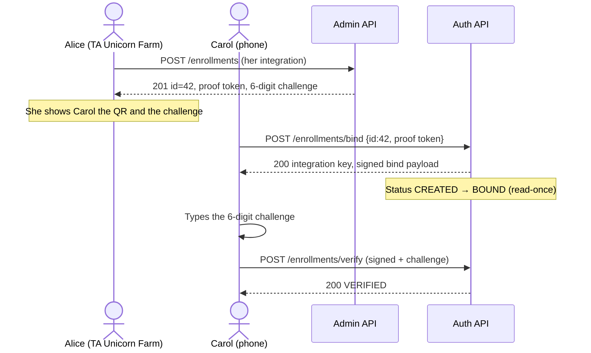

# Java Controller Role Validation Assessment (2026-08)

## Mandate

- **Surface:** Java controllers in team components — `ezkey-admin-api`, `ezkey-auth-api`,
  `ezkey-integration-api`, `ezkey-crypto-api`, `ezkey-demo-device`, `ezkey-demo-app-acme`
  (`src/main`; tests used for corroboration).
- **Attention axes:** role validation at the controller boundary; Lifecycle Governance
  (`docs/LIFECYCLE_GOVERNANCE.md`) Global Admin vs Tenant Admin split; cross-tenant isolation;
  consistency of already-established authorization rules (SEC-017 / SEC-022 / SEC-023 class and
  the 2026-08 controller dead-path pass).
- **Non-goals:** live DAST / pentest execution; Admin UI role hiding; service-layer work outside
  what controllers invoke; zero-warning campaigns; inventing `I-*` / `TB-*` per finding;
  implementing remediations in this session until HITL.

## Why this pass exists

A previous `assessment-curated` pass on controllers (`CTRL-DEAD-003`) treated an Integration API
ownership re-check as redundant and removed it. The July security challenge closed real
function-level and object-level holes (SEC-017 encryption keys; SEC-022/023 API-key
cross-tenant revoke/read). With hindsight, those events share one class of risk:

**`ROLE_ADMIN` is granted to every authenticated administrator.** Tenant isolation and the
Global vs Tenant function split are **not** implied by `@PreAuthorize("hasRole('ADMIN')")`.
They exist only when a second check is present (`ROLE_GLOBAL_ADMIN`, `AccessControlService`,
or an inline tenant comparison). When that second check is missing, the tenant boundary
**fails open**.

This pass re-audits the controller surface for remaining bleeding, and for coherence gaps that
make the next missing check likely.

## Scope and method

- Static white-box review of **25** `*Controller.java` files under `src/main` (same inventory as
  the 2026-08 dead-path assessment).
- Cross-checked against `AdminTokenAuthenticationFilter` authority assignment,
  `ezkey-admin-api` `AccessControlService`, `SecurityConfig`, and Lifecycle Governance §3.5.
- HITL lane:
  [`product-docs/global/hygiene/java-controller-role-validation/`](../product-docs/global/hygiene/java-controller-role-validation/).

## Executive summary

The established governance rules **are largely applied** on Admin API mutating and get-by-id
paths: list endpoints scope by `AdminPrincipal.tenantId()`, object endpoints call
`AccessControlService` or an equivalent tenant comparison, and Global-only surfaces
(encryption keys, tenants, alerts, audit-chain ops, admin deactivate/activate) use
`ROLE_GLOBAL_ADMIN`. Auth API and Integration API are not admin-role surfaces. SEC-017 / 022 /
023 have not regressed in the controllers reviewed.

**Auth API bind/verify/pending are not a tenant-filter hole.** The mobile wizard is
intentionally unauthenticated at the HTTP layer. Association is `(enrollmentId, proof-token
hash)`; bind is read-once (`CREATED` → `BOUND`); pending/respond additionally require the
device ECDSA signature. That is the cryptographic contract, not missing role checks.

**Admin API QR is a different layer.** `GET /api/v1/enrollments/{id}/qrcode` is gated only by
`hasRole('ADMIN')` and then loads the enrollment with an unscoped `getById`, returning the
same invite secret the JSON `GET /{id}` already protects with `canAccessEnrollment`. That is
an **invite-secret distribution bypass** on Admin API, not an Auth API protocol defect. It
matters for enrollments still in `CREATED` (whoever presents the token first wins bind). It
does **not** by itself take over a `VERIFIED` enrollment (bind 409; pending needs the device
key). Hardening the QR to match `GET /{id}` is still warranted.

Everything else in the HITL lot is **coherence / fail-open posture**, not a second confirmed
exploit path: the shared `ROLE_ADMIN` outer gate, mixed deny semantics (403 vs 404), and mixed
enforcement dialects. Those are the conditions that produced SEC-017 and that left the QR
endpoint unprotected.

**Hindsight on CTRL-DEAD-003:** removing the Integration API create re-check remains sound.
`resolveEnrollmentId` already rejected cross-integration ids. The residual risk was never
“too many ownership checks”; it was **Admin API methods that never had the first object
check**. This pass found that residual on the enrollment QR.

## Findings register (HITL lot)

| ID | Title | Severity | Confidence | Quick win | Disposition |
| --- | --- | --- | --- | --- | --- |
| CTRL-ROLE-001 | Admin enrollment QR skips object-level tenant check (invite-secret distribution) | P1 | High | Yes — same `canAccessEnrollment` as `GET /{id}` | **Implemented** ([PR #470](https://github.com/mgagp/ezkey/pull/470); HITL 2026-08-16) |
| CTRL-ROLE-002 | Shared `ROLE_ADMIN` gate makes tenant isolation opt-in | P1 | High | Document + treat missing object check as the defect class | **Implemented** (2026-08-20; HITL 2026-08-16) |
| CTRL-ROLE-003 | Cross-tenant deny is 403 on some routes, 404 on others | P2 | High | Align with the hide-existence rule already used on delete/retire | **Implemented** (2026-08-20; HITL 2026-08-16); 003b analysis separate |
| CTRL-ROLE-004 | Mixed enforcement dialects on the same controller | P2 | High | Prefer `AccessControlService` at get-by-id / mutate | **Implemented** (2026-08-20; HITL 2026-08-16); 004b analysis separate |
| CTRL-ROLE-005 | Living security matrix still describes `ROLE_ADMIN` as unrestricted | P3 | High | Correct `docs/API_SECURITY_MATRIX.md` | **Fix accepted (HITL 2026-08-16)** |

## Category 2 — noted, not in this HITL lot

| ID | Title | Why deferred |
| --- | --- | --- |
| CTRL-ROLE-006 | Tenant Admin cannot deactivate a peer Tenant Admin (Global-only) | Fail-closed vs Lifecycle “TA manages tenant admin lifecycle”. Product gap, not bleeding. |
| CTRL-ROLE-007 | Global Admin may create enrollments / API keys / auth attempts in any tenant | Intentional operator read/write across tenants. Distinct from the no-impersonation rule on **integration create** (Global Admin → system tenant only). |
| CTRL-ROLE-008 | `ApiKeyService.findAll()` / `EnrollmentService.getAll()` remain unscoped | No controller caller found. SEC-015 residual at service layer, not a live HTTP path. |
| CTRL-DEAD-003 (revisit) | Integration create ownership re-check removed 2026-08-02 | Still sound; create remains scoped inside `resolveEnrollmentId`. |
| — | Auth API, Integration API, Crypto, Demo Device, Demo ACME | No Global/Tenant admin role surface. Integration API is API-key scoped. Crypto is an unauthenticated lab tool by design. |

## Evidence

### Authority model (the previous finding, restated)

Every valid admin token receives `ROLE_ADMIN`, then a type-specific authority:

```135:143:ezkey-admin-api/src/main/java/org/ezkey/admin/security/AdminTokenAuthenticationFilter.java
        List<SimpleGrantedAuthority> authorities = new ArrayList<>();
        authorities.add(new SimpleGrantedAuthority("ROLE_ADMIN"));

        AdminType adminType = admin.getAdminType();
        if (adminType == AdminType.GLOBAL_ADMIN) {
          authorities.add(new SimpleGrantedAuthority("ROLE_GLOBAL_ADMIN"));
        } else if (adminType == AdminType.TENANT_ADMIN) {
          authorities.add(new SimpleGrantedAuthority("ROLE_TENANT_ADMIN"));
        }
```

`hasRole('ADMIN')` therefore admits **both** Global and Tenant Admins. That is why SEC-017
(encryption keys on `hasRole('ADMIN')` only) was a real function-level hole, and why object
checks are the actual tenant boundary.

Lifecycle Governance §3.5: Global Admin is platform-wide; Tenant Admin is scoped to one
tenant. Cross-tenant access by a Tenant Admin is bleeding. Cross-tenant **operator** access by
a Global Admin is the designed platform role, except where a narrower create rule applies
(integrations land in the system tenant).

### CTRL-ROLE-001 — Admin enrollment QR skips object-level tenant check

**Protocol first (do not treat Auth API as broken).**

The mobile enrollment wizard talks to Auth API `POST /api/v1/enrollments/bind` with
`enrollmentId` + `enrollmentProofToken`. There is no admin role and no tenant filter on that
controller. That is the designed capability-token contract:

1. **Association:** `EnrollmentBindService.validateEnrollment` looks up
   `findByEnrollmentIdAndEnrollmentProofTokenHash`. Enrollment id alone is not enough; a wrong
   token yields a generic bind failure (anti-enumeration).
2. **Read-once:** only `CREATED` may bind; success marks `BOUND` under
   `findAndLockUnreadById`. Already processed enrollments return already-bound (409).
3. **After bind:** verify signs `enrollmentProofToken|enrollmentId|challengeResponse|devicePublicKey`
   with the new device key. Pending looks up by proof-token hash **and** requires a valid ECDSA
   over `deviceProofToken` with the stored device public key.

So: Auth API is “open” at HTTP and **closed** by proof-token association plus, after verify,
device-key possession. Leaking an enrollment **id** (wizard with no tenant filter) is not by
itself a takeover.

**What the Admin QR actually is.** It is the operator **distribution channel** for that same
capability token (plus optional `authUrl`). Authorized JSON `GET /api/v1/enrollments/{id}`
already returns `enrollmentProofToken` after `canAccessEnrollment`. The QR encodes the same
pair. The admin-onboarding QR is scoped via `getAdminOnboarding(id, principal)`.

Sibling get-by-id **does** enforce tenant scope:

```287:297:ezkey-admin-api/src/main/java/org/ezkey/admin/controller/EnrollmentController.java
  @PreAuthorize("hasRole('ADMIN')")
  @GetMapping("/{id}")
  public ResponseEntity<EnrollmentResponseDto> getById(
      ...
      if (!accessControlService.canAccessEnrollment(auth, id)) {
        return ResponseEntity.status(HttpStatus.FORBIDDEN).build();
      }
```

The user-enrollment QR on the same controller does not:

```751:758:ezkey-admin-api/src/main/java/org/ezkey/admin/controller/EnrollmentController.java
  @PreAuthorize("hasRole('ADMIN')")
  @GetMapping("/{id}/qrcode")
  public ResponseEntity<byte[]> getQrCode(...) {
    try {
      var enrollment = enrollmentService.getById(id);
```

`EnrollmentService.getById` is an unscoped repository read.

**What is still true after the protocol read**

| Enrollment state | Cross-tenant Admin QR leak | Auth API effect |
| --- | --- | --- |
| `CREATED` (pending invite) | Attacker receives id + proof token | **Can bind first** — the token *is* the invite; crypto does not add a second gate |
| `BOUND` / `VERIFIED` | Same leak | Bind **409**; pending/respond still need the device private key |

The earlier “Tenant Admin binds bootstrap Global Admin MFA via `/enrollments/1/qrcode`” story
**overclaims** for a typical `VERIFIED` admin enrollment. The remaining issue is narrower:
Admin API must not hand the invite secret to a caller who already gets 403 on JSON GET.
That is distribution hardening, aligned with Lifecycle tenant scope, not a pentest finding
against Auth API.

**HITL:** operator accepted **fix** (2026-08-16) after protocol recast; implementation is
distribution hardening on Admin QR, not an Auth API tenant filter.

**Remediation (2026-08-18):** `getQrCode` now calls `canAccessEnrollment` before load and
denies with HTTP 404 (hide-existence, same posture as delete). Auth API bind is unchanged.
Coverage: `EnrollmentControllerQrAccessTest` plus
`TenantCrossIsolationSecurityTest` deny-404 / own-tenant-200.
Landed in [PR #470](https://github.com/mgagp/ezkey/pull/470).

#### Human walkthrough (two envelopes)

An enrollment invite is **not** a single QR. It is two pieces the product keeps apart on
purpose:

| Envelope | What it contains | Who is supposed to have it | Enough to… |
| --- | --- | --- | --- |
| **QR / bind handle** | `enrollmentId` + `enrollmentProofToken` (+ optional `authUrl`) | The invitee (via the owning tenant’s operator) | **Bind** only (`CREATED` → `BOUND`, read-once) |
| **6-digit challenge** | `enrollmentChallenge`, shown in Admin UI / JSON GET | The same invitee, typed on the phone after bind | **Verify** (attach device key). Wrong value **invalidates** the enrollment |

Auth API never checks tenant on bind: presenting the first envelope *is* the authorization.
Admin API JSON `GET /enrollments/{id}` already refuses the first envelope to a foreign Tenant
Admin (403) but still returns both envelopes to the **owning** operator. The QR endpoint
returns only the first envelope — and today it does so **without** that 403.

**Cast (same Ezkey instance, two tenants):**

- **Alice** — Tenant Admin, Unicorn Farm (tenant A). She creates a pending enrollment for
  **Carol** (end user). Status `CREATED`.
- **Mallory** — Tenant Admin, Garage du Coin (tenant B). She has a valid admin session
  (`ROLE_ADMIN` + `ROLE_TENANT_ADMIN`). She must not operate Unicorn Farm enrollments.

**Intended path (no bug):**



**Problem path (today’s QR):** Mallory never sees Carol’s detail page. She guesses or
enumerates id `42` (ids are small integers) and hits the QR URL with her own bearer token.

```mermaid
sequenceDiagram
    actor Alice as Alice (TA Unicorn Farm)
    actor Mallory as Mallory (TA Garage du Coin)
    actor Carol as Carol (phone)
    participant Admin as Admin API
    participant Auth as Auth API

    Alice->>Admin: POST /enrollments (Carol, CREATED, id=42)
    Admin-->>Alice: 201 + QR-able proof token + challenge

    Mallory->>Admin: GET /enrollments/42
    Admin-->>Mallory: 403 (canAccessEnrollment)

    Mallory->>Admin: GET /enrollments/42/qrcode
    Note over Admin: hasRole ADMIN only — no object check
    Admin-->>Mallory: 200 PNG {id, proof token}

    Mallory->>Auth: POST /enrollments/bind {id:42, proof token}
    Auth-->>Mallory: 200 (token matches; no tenant filter)
    Note over Auth: Status now BOUND — invite consumed

    Carol->>Auth: POST /enrollments/bind {id:42, proof token}
    Auth-->>Carol: 409 already bound

    Note over Mallory: QR did not contain the 6-digit challenge
    Mallory->>Auth: POST /enrollments/verify (wrong or missing challenge)
    Auth-->>Mallory: fail; wrong challenge invalidates enrollment
```

**What actually goes wrong for humans**

1. **Certain harm if Mallory binds:** Carol can no longer bind. The invitation is spent.
   Alice must recreate/reset. This is cross-tenant **consumption** of Unicorn Farm’s pending
   credential, not Mallory logging in as Carol.
2. **Not automatic MFA takeover:** the QR does not carry the 6-digit challenge. JSON GET that
   *would* include the challenge is 403 for Mallory. A wrong verify attempt **burns** the
   enrollment (`markInvalidAndClear`).
3. **Takeover only with a second envelope:** if Mallory also obtains the challenge (shoulder
   surfing Alice’s Admin UI, a screenshot, a shared ticket), she can finish verify on her
   phone. The QR hole is what gave her the bind handle she should never have had.
4. **Already `VERIFIED` rows:** bind returns 409; pending still needs Carol’s device key.
   Bootstrap Global Admin MFA is typically already verified — that story was an overclaim.

**Fail-open / fail-closed:** Admin-API tenant boundary on this one method **fails open**. Auth
API bind stays fail-closed for unknown tokens and for already-bound rows.

**Suggested fix:** call `canAccessEnrollment` before load (same as `GET /{id}`); WebMvc or
`ezkey-tests` case: Tenant Admin cannot fetch another tenant’s QR. No Admin UI Playwright.
Do not add a tenant filter to Auth API bind.

### CTRL-ROLE-002 — Shared `ROLE_ADMIN` gate makes tenant isolation opt-in

Most business controllers still use `@PreAuthorize("hasRole('ADMIN')")` as the method gate
(Enrollment, Integration, ApiKey, AuthAttempt list/create, Dashboard, Audit query, Admin
provisioning get/update/onboarding). The second check is per-method and easy to omit.

Closed precedents of this class:

| ID | What was missing | Status |
| --- | --- | --- |
| SEC-017 | Function split: encryption keys on `ROLE_ADMIN` only | Closed — class-level `GLOBAL_ADMIN` |
| SEC-022 / 023 | Object split: API-key revoke/read without tenant check | Closed — `canAccessIntegration` |
| CTRL-ROLE-001 | Object split: enrollment QR without tenant check | **Implemented** (2026-08-18) |

Surfaces that **do** use the type-specific role at the annotation (good):

- `EncryptionKeyController` — class-level `hasRole('GLOBAL_ADMIN')`
- `TenantController` — `hasRole('ROLE_GLOBAL_ADMIN')` (equivalent spelling)
- `AlertController` — `hasRole('GLOBAL_ADMIN')`
- Audit chain / integrity ops — `hasRole('GLOBAL_ADMIN')`
- Admin deactivate / activate / reset MFA — `hasRole('ROLE_GLOBAL_ADMIN')`

**Observation scenario:** a new `GET /{id}/…` helper is added next to an existing enrollment
or integration detail method, copied from QR rather than from `getById`. Reviewers see
`@PreAuthorize("hasRole('ADMIN')")` and treat the method as “already authorized.”

**Fail-open / fail-closed:** the outer gate fails closed for **anonymous** callers and API
keys (except auth-attempt dual surface). It fails **open** for Tenant Admin vs tenant and
for Tenant Admin vs Global-only functions.

**Suggested fix (hygiene, not a rewrite):** keep `ROLE_ADMIN` as “any administrator.” Treat
“object or function check missing” as the defect class in review. Optionally add a short
controller convention note; do not mass-replace every `hasRole('ADMIN')` with
`hasAnyRole('GLOBAL_ADMIN','TENANT_ADMIN')` unless a later pass wants annotation honesty
without behavior change.

**Closeout 2026-08-20:** living convention in
[`ezkey-admin-api/AGENTS.md`](../ezkey-admin-api/AGENTS.md) § Authorization at
controllers (`ROLE_ADMIN` umbrella; function split vs object split; greenfield note).
No annotation rewrite and no filter cutover. Remodeling stays
[`HANDOFF-ctrl-role-002b-role-model-remodeling-analysis.md`](../product-docs/global/backlog/handoffs/HANDOFF-ctrl-role-002b-role-model-remodeling-analysis.md).
Ephemeral 002 handoff deleted.

### CTRL-ROLE-003 — Cross-tenant deny is 403 on some routes, 404 on others

Product mapping says the API must not reveal cross-tenant existence via 404 vs 403
(`product-docs/components/admin-api/api-and-boundary-mappings.md`). Controllers do not agree:

| Endpoint | Cross-tenant / unknown id | Mechanism |
| --- | --- | --- |
| `GET /enrollments/{id}` | 403 | `canAccessEnrollment` false (also covers missing ids) |
| `DELETE /enrollments/{id}` | 404 | explicit “hide existence” comment |
| `GET /enrollments/{id}/qrcode` | **404** | `canAccessEnrollment` then hide-existence (CTRL-ROLE-001, 2026-08-18) |
| `GET /integrations/{id}` | 403 | `canAccessIntegration` false |
| `POST /integrations/{id}/retire` | 404 | inline Tenant Admin tenant-id compare |
| `DELETE /integrations/{id}` | 404 | same inline compare |
| `POST /integrations/{id}/enrollments/revoke-all` | 403 | `canAccessIntegration` |
| `GET /admins/{id}` | 403 via `IllegalArgumentException` | service tenant compare |

For Tenant Admin, `AccessControlService` returns `false` for both missing and other-tenant
ids, so 403 on GET does **not** currently distinguish those two cases. Retire/delete 404
**does** hide existence when the row exists in another tenant (load then compare). The
incoherence is real; a second confirmed enumerator beyond QR was **not** demonstrated.

**HITL:** operator accepted **fix** (2026-08-16) as convention + QR only, parallel to
002 / 002b. Intended get-by-id posture is **404 hide-existence** (apply to QR with
001). Existing JSON GET 403s stay until
[`HANDOFF-ctrl-role-003b-cross-tenant-deny-semantics-analysis.md`](../product-docs/global/backlog/handoffs/HANDOFF-ctrl-role-003b-cross-tenant-deny-semantics-analysis.md).

**Suggested fix:** pick one hide-existence policy for get-by-id and mutations (404 is the
delete/retire precedent) and apply it when touching CTRL-ROLE-001. Do not boil the ocean in
the same PR unless the operator expands scope.

**Closeout 2026-08-20:** living rule in
[`ezkey-admin-api/AGENTS.md`](../ezkey-admin-api/AGENTS.md) § Authorization at
controllers (get-by-id style reads → HTTP 404). QR already 404 from CTRL-ROLE-001
([PR #470](https://github.com/mgagp/ezkey/pull/470)). JSON GET 403s unchanged.
Unifying the rest stays
[`HANDOFF-ctrl-role-003b-cross-tenant-deny-semantics-analysis.md`](../product-docs/global/backlog/handoffs/HANDOFF-ctrl-role-003b-cross-tenant-deny-semantics-analysis.md).
Ephemeral 003 handoff deleted.

### CTRL-ROLE-004 — Mixed enforcement dialects on the same controller

Three live dialects:

1. **`AccessControlService.canAccess*`** — Enrollment get/update/delete/revoke; Integration
   get / revoke-all / lifecycle helpers; ApiKey create/get/revoke; AuthAttempt get/wait/cancel.
2. **Inline `AdminType.TENANT_ADMIN` + tenant id compare** — Integration retire and delete
   (and the controller still has a private `hasRole` helper).
3. **Service-layer principal checks** — `AdminProvisioningService.getAdminById` /
   `getAdminOnboarding` / `createTenantAdmin`.

Integration `GET /{id}` uses dialect 1 (403). `POST /{id}/retire` uses dialect 2 (404). Both
are tenant-correct today; they will drift independently.

`@PreAuthorize` spelling also mixes `hasRole('ADMIN')`, `hasRole('GLOBAL_ADMIN')`, and
`hasRole('ROLE_GLOBAL_ADMIN')`. Spring’s `hasRole` does not double-prefix when `ROLE_` is
already present, so both Global spellings work. That is not a hole; it is noise.

**HITL:** operator accepted **fix + 004b** (2026-08-16). Immediate: dialect 1 on
touch; QR is dialect 1 not a fourth style. Complementary analysis:
[`HANDOFF-ctrl-role-004b-authorization-dialect-coherence-analysis.md`](../product-docs/global/backlog/handoffs/HANDOFF-ctrl-role-004b-authorization-dialect-coherence-analysis.md).

**Suggested fix:** when a method is touched, prefer dialect 1 for resource-by-id. Do not
rewrite Integration retire/delete solely for style unless 004b (and 003b deny overlap)
says so.

**Closeout 2026-08-20:** living dialect convention in
[`ezkey-admin-api/AGENTS.md`](../ezkey-admin-api/AGENTS.md) § Authorization at
controllers (dialect 1 default on touch; 2 retire/delete legacy; 3 service
principal). QR already dialect 1 from CTRL-ROLE-001. No Java rewrite of
retire/delete. Convergence stays
[`HANDOFF-ctrl-role-004b-authorization-dialect-coherence-analysis.md`](../product-docs/global/backlog/handoffs/HANDOFF-ctrl-role-004b-authorization-dialect-coherence-analysis.md).
Ephemeral 004 handoff deleted.

### CTRL-ROLE-005 — Living security matrix still describes `ROLE_ADMIN` as unrestricted

`docs/API_SECURITY_MATRIX.md` still lists:

- `ROLE_ADMIN` — “Full administrative access / Global - all endpoints”
- For Admins: “No ownership restrictions”

That description matches the **pre-SEC-017** mental model and would instruct a cold agent to
skip object checks. The code and Lifecycle Governance no longer match it.

**HITL:** operator accepted **fix** (2026-08-16), option 1 only (no 005b). Role story
and Scenario 4; endpoint rows stay a lagging sketch.

**Suggested fix:** rewrite the role table to `ROLE_ADMIN` (any admin) + `ROLE_GLOBAL_ADMIN` /
`ROLE_TENANT_ADMIN` + object scope via `AccessControlService`. Out of scope: boiling every
endpoint row in the same PR. Handoff:
[`HANDOFF-ctrl-role-005-security-matrix-role-story.md`](../product-docs/global/backlog/handoffs/HANDOFF-ctrl-role-005-security-matrix-role-story.md).

## Checked clean (for this mandate)

- Encryption keys: class-level `GLOBAL_ADMIN` (SEC-017 still holds).
- Tenant CRUD / activate-deactivate: `ROLE_GLOBAL_ADMIN`.
- API-key get / list-by-integration / revoke: `canAccessIntegration` (SEC-022/023 still hold).
- Auth-attempt create: Tenant Admin must `canAccessEnrollment`; API keys still run ownership
  validation (Admin path 1 is live on purpose; not the Integration duplicate removed in
  CTRL-DEAD-003).
- Dashboard overview: stats take `principal.tenantId()`; instance alerts only if
  `isGlobalAdmin()`.
- Audit log query/export: Tenant Admin forced to own tenant; chain ops Global-only.
- Admin onboarding QR: scoped in `getAdminOnboarding`.
- Recovery enrollment reset: recovery-token purpose gate (SEC-021), not a session JWT.
- Integration create: Global Admin → system tenant; Tenant Admin → own tenant (no
  impersonation on that create path).
- Auth API: device signatures, no admin roles.
- Integration API: `ROLE_API_KEY` + `canAccessAuthAttempt` on get/wait.

## Fail-open / fail-closed note

| Boundary | Current posture | Comment |
| --- | --- | --- |
| Anonymous → Admin API | Fail-closed | `anyRequest().authenticated()` plus method security |
| Tenant Admin → other tenant **Admin QR** | **Fail-open** (invite secret) | CTRL-ROLE-001; Auth API bind itself is token-gated |
| Tenant Admin → other tenant **JSON GET / mutate** | Fail-closed | `AccessControlService` or inline compare |
| Tenant Admin → encryption keys / tenants / alerts | Fail-closed | `GLOBAL_ADMIN` annotation |
| Global Admin → other tenant operator actions | Fail-open **by design** | Platform role, not Tenant Admin bleeding |
| Missing object check on a new `hasRole('ADMIN')` method | Fail-open | CTRL-ROLE-002 class |

## Controllers scanned (25)

Same inventory as `docs/java-controller-dead-path-assessment-2026-08.md`.
