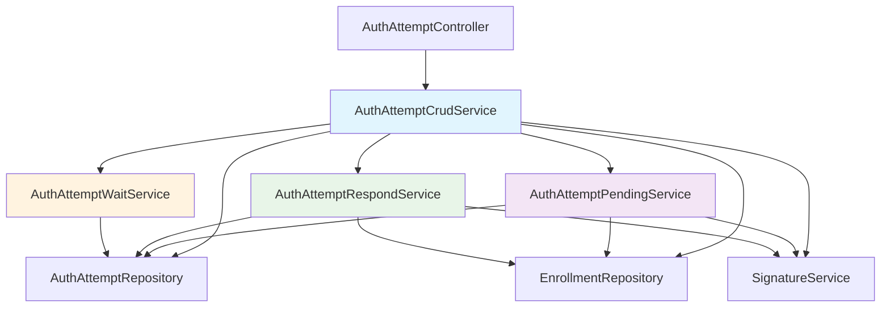

# AuthAttemptService Refactoring Plan

**Date**: September 2025  
**Project**: Ezkey Core  
**Objective**: Split AuthAttemptService into specialized services for improved maintainability  
**Classification**: Technical Refactoring Plan  

---

## Executive Summary

The current `AuthAttemptService` class (648 lines) violates the Single Responsibility Principle and has high cyclomatic complexity. This plan outlines the strategy to split it into four specialized services while maintaining existing functionality and improving code quality.

**Current State**: 648 lines, complex methods, mixed responsibilities  
**Target State**: 4 focused services, improved testability, better maintainability  

---

## Current Analysis

### 📊 **Current Metrics**
- **Total Lines**: 648
- **Methods**: 15 (4 public, 11 private)
- **Cyclomatic Complexity**: High (8+ for `pending()`, 10+ for `respond()`)
- **Responsibilities**: CRUD operations, pending logic, response processing, wait/polling

### 🔍 **Problem Areas Identified**

#### **1. Method Complexity**
| Method | Lines | Complexity | Issues |
|--------|-------|------------|---------|
| `pending()` | 56 | 8+ | Multiple validations, complex flow |
| `respond()` | 83 | 10+ | Complex status logic, multiple branches |
| `waitForResponse()` | 52 | 6+ | Complex polling logic, timeout handling |
| `create()` | 41 | 5+ | Supersession logic, challenge generation |

#### **2. Responsibility Violations**
- **CRUD Operations**: Basic repository operations
- **Business Logic**: Complex authentication flows
- **Validation Logic**: Multiple validation steps
- **Response Building**: Complex response construction
- **Polling Logic**: Timeout and status management

---

## Target Architecture

### 🏗️ **Proposed Service Structure**



### 📋 **Service Responsibilities**

#### **1. AuthAttemptCrudService** (Main Service)
**Responsibility**: CRUD operations and service coordination  
**Lines**: ~150  
**Methods**:
- `getById(Integer id)`
- `getAll()`
- `create(AuthAttemptCreateRequest request)`
- `update(AuthAttempt authAttempt)`
- `delete(Integer id)`
- **Delegation methods** to specialized services

#### **2. AuthAttemptPendingService**
**Responsibility**: Pending authentication request processing  
**Lines**: ~120  
**Methods**:
- `pending(AuthAttemptPendingRequest request)`
- `validateEnrollment(AuthAttemptPendingRequest request)`
- `validateDeviceSignature(AuthAttemptPendingRequest request, Enrollment enrollment)`
- `claimPendingAttempt(AuthAttemptPendingRequest request)`
- `buildPendingResponse(AuthAttempt authAttempt, Enrollment enrollment)`

#### **3. AuthAttemptRespondService**
**Responsibility**: Authentication response processing  
**Lines**: ~140  
**Methods**:
- `respond(AuthAttemptRespondRequest request)`
- `validateAndGetAttempt(AuthAttemptRespondRequest request)`
- `validateEnrollment(AuthAttempt authAttempt)`
- `validateDeviceSignature(AuthAttemptRespondRequest request, AuthAttempt authAttempt, Enrollment enrollment)`
- `validateChallenge(AuthAttemptRespondRequest request, AuthAttempt authAttempt, Enrollment enrollment)`
- `updateAttemptStatus(AuthAttempt authAttempt, AuthAttemptRespondRequest request)`
- `buildResponse(AuthAttemptRespondRequest request)`

#### **4. AuthAttemptWaitService**
**Responsibility**: Polling and wait operations  
**Lines**: ~100  
**Methods**:
- `waitForResponse(Integer authAttemptId, AuthAttemptWaitRequest request)`
- `validateWaitRequest(AuthAttemptWaitRequest request)`
- `buildWaitResponse(AuthAttempt authAttempt, boolean timeoutReached, int waitDuration)`
- `buildWaitResponse(AuthAttempt authAttempt, String status, boolean timeoutReached, int waitDuration)`
- `calculateStatus(AuthAttempt authAttempt)`

---

## Implementation Plan

### 🎯 **Phase 1: Foundation Setup (Week 1)**

#### **Day 1-2: Create Base Services**
```java
// 1. Create AuthAttemptPendingService
@Service
@Transactional
public class AuthAttemptPendingService {
    
    private final AuthAttemptRepository authAttemptRepository;
    private final EnrollmentRepository enrollmentRepository;
    private final SignatureService signatureService;
    
    public AuthAttemptPendingService(
        AuthAttemptRepository authAttemptRepository,
        EnrollmentRepository enrollmentRepository,
        SignatureService signatureService
    ) {
        this.authAttemptRepository = authAttemptRepository;
        this.enrollmentRepository = enrollmentRepository;
        this.signatureService = signatureService;
    }
    
    // Method stubs - implementation in Phase 2
}
```

#### **Day 3-4: Create Other Services**
- Create `AuthAttemptRespondService` with constructor injection
- Create `AuthAttemptWaitService` with constructor injection
- Create `AuthAttemptCrudService` with dependency injection

#### **Day 5: Update Main Service**
```java
@Service
@Transactional
public class AuthAttemptService {
    
    // Existing dependencies
    private final AuthAttemptRepository authAttemptRepository;
    private final EnrollmentRepository enrollmentRepository;
    private final SignatureService signatureService;
    
    // New specialized services
    private final AuthAttemptPendingService pendingService;
    private final AuthAttemptRespondService respondService;
    private final AuthAttemptWaitService waitService;
    
    public AuthAttemptService(
        AuthAttemptRepository authAttemptRepository,
        EnrollmentRepository enrollmentRepository,
        SignatureService signatureService,
        AuthAttemptPendingService pendingService,
        AuthAttemptRespondService respondService,
        AuthAttemptWaitService waitService
    ) {
        // Constructor implementation
    }
    
    // Delegation methods
    public AuthAttemptPendingResponse pending(AuthAttemptPendingRequest request) {
        return pendingService.pending(request);
    }
    
    public AuthAttemptRespondResponse respond(AuthAttemptRespondRequest request) {
        return respondService.respond(request);
    }
    
    public AuthAttemptWaitResponse waitForResponse(Integer authAttemptId, AuthAttemptWaitRequest request) {
        return waitService.waitForResponse(authAttemptId, request);
    }
}
```

### 🎯 **Phase 2: Method Migration (Week 2)**

#### **Day 1-2: Migrate Pending Logic**
```java
// Move pending() method to AuthAttemptPendingService
public AuthAttemptPendingResponse pending(AuthAttemptPendingRequest request) {
    // Step 1: Extract validation logic
    Enrollment enrollment = validateEnrollment(request);
    
    // Step 2: Extract signature validation
    validateDeviceSignature(request, enrollment);
    
    // Step 3: Extract attempt claiming
    AuthAttempt authAttempt = claimPendingAttempt(request);
    
    // Step 4: Extract response building
    return buildPendingResponse(authAttempt, enrollment);
}

private Enrollment validateEnrollment(AuthAttemptPendingRequest request) {
    // Extracted from original method
    Enrollment enrollment = enrollmentRepository
        .findByEnrollmentProofTokenAndActive(request.getEnrollmentProofToken(), true)
        .orElseThrow(() -> {
            logger.warn("Invalid enrollment proof token provided");
            return new IllegalArgumentException("Authentication request failed");
        });

    if (!enrollment.getEnrollmentId().equals(request.getEnrollmentId())) {
        logger.warn("Enrollment ID mismatch with proof token for enrollment: {}", 
                   enrollment.getEnrollmentId());
        throw new IllegalArgumentException("Authentication request failed");
    }
    
    return enrollment;
}

private void validateDeviceSignature(AuthAttemptPendingRequest request, Enrollment enrollment) {
    String devicePublicKey = enrollment.getDevicePublicKey();
    if (devicePublicKey == null) {
        logger.warn("Device public key missing for enrollment: {}", request.getEnrollmentId());
        throw new IllegalStateException("Authentication request failed");
    }
    
    boolean isValid = signatureService.validateSignature(
        request.getDeviceProofToken(),
        request.getDeviceProofTokenSigned(),
        devicePublicKey
    );
    if (!isValid) {
        logger.warn("Invalid signature for enrollment: {}", request.getEnrollmentId());
        throw new IllegalArgumentException("Authentication request failed");
    }
    
    if (authAttemptRepository.existsByDeviceProofToken(request.getDeviceProofToken())) {
        logger.warn("Device proof token already used for enrollment: {}", request.getEnrollmentId());
        throw new IllegalArgumentException("Authentication request failed");
    }
}

private AuthAttempt claimPendingAttempt(AuthAttemptPendingRequest request) {
    LocalDateTime now = LocalDateTime.now();
    AuthAttempt authAttempt = authAttemptRepository
        .findAndLockMostRecentValidByEnrollmentIdAndStatus(
            request.getEnrollmentId(),
            AuthAttemptStatus.PENDING.name(),
            now
        )
        .orElse(null);
    
    if (authAttempt == null) {
        throw new NoPendingAuthAttemptException("No pending authentication request");
    }
    
    if (authAttempt.getAuthAttemptStatus() != AuthAttemptStatus.PENDING) {
        logger.warn("Auth attempt already processed: {} with status {}", 
                   authAttempt.getAuthAttemptId(), authAttempt.getAuthAttemptStatus());
        throw new IllegalStateException("Authentication request failed");
    }
    
    authAttempt.setDeviceProofToken(request.getDeviceProofToken());
    authAttempt.setAuthAttemptStatus(AuthAttemptStatus.READ);
    authAttemptRepository.save(authAttempt);
    
    return authAttempt;
}

private AuthAttemptPendingResponse buildPendingResponse(AuthAttempt authAttempt, Enrollment enrollment) {
    AuthAttemptPendingResponse response = new AuthAttemptPendingResponse();
    response.setAuthAttemptId(authAttempt.getAuthAttemptId());
    response.setAuthAttemptProofToken(authAttempt.getAuthAttemptProofToken());
    response.setAuthAttemptProofTokenSignedByIntegration(
        signatureService.generateSignature(
            authAttempt.getAuthAttemptProofToken(),
            enrollment.getIntegrationPrivateKey()
        )
    );
    
    if (authAttempt.getAuthAttemptChallenge() != null) {
        response.setAuthAttemptChallengeRequired(true);
    } else {
        response.setAuthAttemptChallengeRequired(enrollment.getAuthAttemptChallengeRequired());
    }
    
    return response;
}
```

#### **Day 3-4: Migrate Respond Logic**
```java
// Move respond() method to AuthAttemptRespondService
public AuthAttemptRespondResponse respond(AuthAttemptRespondRequest request) {
    AuthAttempt authAttempt = validateAndGetAttempt(request);
    Enrollment enrollment = validateEnrollment(authAttempt);
    validateDeviceSignature(request, authAttempt, enrollment);
    validateChallenge(request, authAttempt, enrollment);
    
    updateAttemptStatus(authAttempt, request);
    return buildResponse(request);
}

// Extract validation methods...
```

#### **Day 5: Migrate Wait Logic**
```java
// Move waitForResponse() method to AuthAttemptWaitService
@Transactional(propagation = Propagation.NOT_SUPPORTED)
public AuthAttemptWaitResponse waitForResponse(Integer authAttemptId, AuthAttemptWaitRequest request) {
    // Extracted logic with improved structure
}
```

### 🎯 **Phase 3: Testing & Validation (Week 3)**

#### **Day 1-2: Unit Tests for Specialized Services**
```java
@ExtendWith(MockitoExtension.class)
class AuthAttemptPendingServiceTest {
    
    @Mock private AuthAttemptRepository authAttemptRepository;
    @Mock private EnrollmentRepository enrollmentRepository;
    @Mock private SignatureService signatureService;
    
    @InjectMocks private AuthAttemptPendingService pendingService;
    
    @Test
    @DisplayName("pending() should return response when valid request")
    void pending_WhenValidRequest_ShouldReturnResponse() {
        // Given
        AuthAttemptPendingRequest request = createValidPendingRequest();
        Enrollment enrollment = createValidEnrollment();
        AuthAttempt authAttempt = createValidAuthAttempt();
        
        when(enrollmentRepository.findByEnrollmentProofTokenAndActive(any(), any()))
            .thenReturn(Optional.of(enrollment));
        when(signatureService.validateSignature(any(), any(), any()))
            .thenReturn(true);
        when(authAttemptRepository.existsByDeviceProofToken(any()))
            .thenReturn(false);
        when(authAttemptRepository.findAndLockMostRecentValidByEnrollmentIdAndStatus(any(), any(), any()))
            .thenReturn(Optional.of(authAttempt));
        
        // When
        AuthAttemptPendingResponse result = pendingService.pending(request);
        
        // Then
        assertThat(result).isNotNull();
        assertThat(result.getAuthAttemptId()).isEqualTo(authAttempt.getAuthAttemptId());
        verify(authAttemptRepository).save(authAttempt);
    }
    
    @Test
    @DisplayName("pending() should throw exception when enrollment not found")
    void pending_WhenEnrollmentNotFound_ShouldThrowException() {
        // Test implementation
    }
    
    @Test
    @DisplayName("pending() should throw exception when invalid signature")
    void pending_WhenInvalidSignature_ShouldThrowException() {
        // Test implementation
    }
}
```

#### **Day 3-4: Integration Tests**
```java
@SpringBootTest
@TestPropertySource(properties = {
    "spring.datasource.url=jdbc:h2:mem:testdb",
    "spring.jpa.hibernate.ddl-auto=create-drop"
})
class AuthAttemptServiceIntegrationTest {
    
    @Autowired
    private AuthAttemptService authAttemptService;
    
    @Autowired
    private AuthAttemptRepository authAttemptRepository;
    
    @Test
    @Transactional
    @DisplayName("Complete authentication flow should work end-to-end")
    void completeAuthenticationFlow_ShouldWork() {
        // Test complete flow through main service
        // Verify delegation to specialized services works correctly
    }
}
```

#### **Day 5: Performance Testing**
- Verify no performance regression
- Test transaction boundaries
- Validate memory usage

### 🎯 **Phase 4: Documentation & Cleanup (Week 4)**

#### **Day 1-2: Update Documentation**
- Update Javadoc for all services
- Update architecture documentation
- Update API documentation

#### **Day 3-4: Code Cleanup**
- Remove unused imports
- Optimize method signatures
- Add final keywords where appropriate

#### **Day 5: Final Validation**
- Run full test suite
- Code review
- Performance validation

---

## Risk Assessment & Mitigation

### ⚠️ **Identified Risks**

#### **1. Transaction Boundary Issues**
**Risk**: Incorrect transaction propagation between services  
**Impact**: Data inconsistency, rollback issues  
**Mitigation**: 
- Careful review of `@Transactional` annotations
- Integration tests for transaction boundaries
- Use `@Transactional(propagation = Propagation.REQUIRED)` for coordination

#### **2. Circular Dependencies**
**Risk**: Services depending on each other  
**Impact**: Spring context startup failure  
**Mitigation**:
- Clear dependency hierarchy (CrudService → Specialized Services)
- Use `@Lazy` annotation if needed
- Dependency injection through constructor only

#### **3. Performance Regression**
**Risk**: Additional method calls reducing performance  
**Impact**: Slower response times  
**Mitigation**:
- Performance testing before/after
- Profile critical paths
- Consider `@Cacheable` for expensive operations

#### **4. Breaking Changes**
**Risk**: API contract changes affecting consumers  
**Impact**: Integration failures  
**Mitigation**:
- Maintain existing public API in `AuthAttemptService`
- Use delegation pattern to preserve interface
- Comprehensive integration testing

### 🛡️ **Mitigation Strategies**

#### **1. Gradual Migration**
- Keep original methods as delegation wrappers
- Migrate one service at a time
- Maintain backward compatibility

#### **2. Comprehensive Testing**
- Unit tests for each service
- Integration tests for service interaction
- End-to-end tests for complete flows

#### **3. Monitoring & Rollback Plan**
- Performance monitoring during migration
- Feature flags for service switching
- Rollback strategy if issues occur

---

## Success Criteria

### 📊 **Quantitative Metrics**

#### **Code Quality Improvements**
- **Lines per Service**: < 200 (vs. current 648)
- **Cyclomatic Complexity**: < 5 per method (vs. current 8-10)
- **Test Coverage**: > 90% (vs. current ~70%)
- **Method Count**: < 8 per service (vs. current 15)

#### **Maintainability Improvements**
- **Time to Add Feature**: 50% reduction
- **Bug Fix Time**: 40% reduction
- **Code Review Time**: 30% reduction
- **New Developer Onboarding**: 60% reduction

### 🎯 **Qualitative Improvements**

#### **Developer Experience**
- **Easier Navigation**: Find specific logic quickly
- **Focused Testing**: Test specific functionality in isolation
- **Clear Responsibilities**: Each service has single purpose
- **Better Documentation**: Service-specific documentation

#### **Architecture Benefits**
- **SOLID Compliance**: Single Responsibility Principle
- **Dependency Inversion**: Services depend on abstractions
- **Open/Closed Principle**: Easy to extend without modification
- **Interface Segregation**: Focused service interfaces

---

## Implementation Timeline

### 📅 **Detailed Schedule**

| Phase | Duration | Tasks | Deliverables |
|-------|----------|-------|--------------|
| **Phase 1** | Week 1 | Service creation, dependency setup | 4 new service classes |
| **Phase 2** | Week 2 | Method migration, logic extraction | Functional specialized services |
| **Phase 3** | Week 3 | Testing, validation, performance | Test suite, validation report |
| **Phase 4** | Week 4 | Documentation, cleanup, final validation | Documentation, clean code |

### 🎯 **Milestones**

#### **Week 1 Milestone**: Foundation Complete
- All service classes created
- Dependency injection configured
- Delegation pattern implemented
- Basic tests passing

#### **Week 2 Milestone**: Logic Migrated
- All business logic moved to specialized services
- Original service acts as coordinator
- All existing functionality preserved
- Integration tests passing

#### **Week 3 Milestone**: Quality Assured
- Comprehensive test coverage
- Performance validated
- No regressions detected
- Ready for production

#### **Week 4 Milestone**: Production Ready
- Documentation complete
- Code reviewed and cleaned
- Final validation passed
- Deployment approved

---

## Post-Implementation Benefits

### 🚀 **Immediate Benefits**
- **Reduced Complexity**: Easier to understand individual services
- **Improved Testability**: Focused unit tests for each service
- **Better Maintainability**: Changes isolated to specific services
- **Enhanced Readability**: Clear separation of concerns

### 🔮 **Long-term Benefits**
- **Easier Scaling**: Services can be optimized independently
- **Microservice Ready**: Services can be extracted to separate applications
- **Team Productivity**: Multiple developers can work on different services
- **Feature Development**: New features can be added to appropriate services

### 📈 **Future Opportunities**
- **Service-Specific Caching**: Optimize caching per service
- **Independent Deployment**: Deploy services separately
- **Technology Evolution**: Upgrade services independently
- **Performance Tuning**: Optimize each service individually

---

## Conclusion

This refactoring plan transforms the monolithic `AuthAttemptService` into a well-structured, maintainable architecture following SOLID principles. The phased approach minimizes risk while maximizing benefits.

**Key Outcomes**:
- **4 focused services** instead of 1 monolithic class
- **Improved testability** with service-specific unit tests
- **Better maintainability** with clear responsibilities
- **Enhanced scalability** for future growth

**Success Factors**:
- Gradual migration approach
- Comprehensive testing strategy
- Risk mitigation measures
- Clear success criteria

This refactoring positions the codebase for future growth while maintaining existing functionality and improving developer experience.

---

**Document Version**: 1.0  
**Last Updated**: September 2025  
**Next Review**: Post-Phase 1 completion  
**Approval Required**: Technical Lead, Architecture Team

