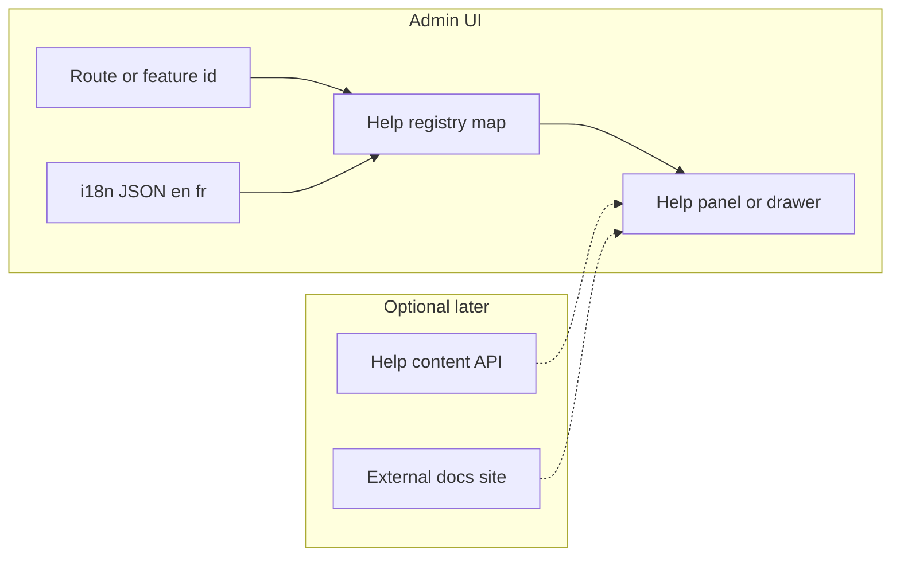

# Contextual help system — analysis and phased approach (EZKey Admin UI)

## 0. Decisions de clarification (session stakeholder)

Réponses collectées pour figer le périmètre de la **v1** et les sujets laissés au plan (recommandations ci-dessous).

| Sujet                                  | Décision                                                                                                                                                                                                                                                                                                       |
| -------------------------------------- | -------------------------------------------------------------------------------------------------------------------------------------------------------------------------------------------------------------------------------------------------------------------------------------------------------------- |
| **Surface du panneau**                 | Non tranché ici → **recommandation plan** : **drawer / panneau latéral droit** (contexte visible, pattern courant admin).                                                                                                                                                                                      |
| **Raccourci clavier global**           | Touche **?** (ouvrir l’aide depuis n’importe quelle page). **F1** non requis en v1 ; si ajout ultérieur, valider conflits navigateur/OS.                                                                                                                                                                            |
| **Source du contenu (v1)**             | Non tranché entre UI / API / hybride → **recommandation** : **contenu 100 % i18n dans l’admin UI pour la v1** ; tronc commun par **IDs de sujets** pour permettre une API ou un CMS **sans casser** les clés. Les critères pour passer au backend sont dans la section 4 et le todo `content-source-decision`. |
| **Périmètre première livraison**       | **Mixte** : base **production** pour tous les admins + **blocs ou sujets additionnels** réservés au **demo mode** (même mécanisme, métadonnées audience + garde compile-time si nécessaire).                                                                                                                   |
| **Écrans prioritaires**                | Délégué au plan / implémentation à venir → **sélectionner 1–2 écrans** selon **impact utilisateur** et **effort** (souvent dashboard + intégrations pour la démo dev, à confirmer lors de l’implémentation).                                                                                                   |
| **Recherche full-text**                | **Hors v1** (report explicite).                                                                                                                                                                                                                                                                                |
| **Présentation Global / Tenant / Dev** | Délégué au plan → **recommandation** : **filtrer** les blocs selon `adminType` quand c’est pertinent ; sections **dev/demo** optionnelles via flags (pas trois systèmes parallèles).                                                                                                                           |
| **Liens vers doc externe**             | **Optionnels** par sujet (pas d’obligation systématique).                                                                                                                                                                                                                                                      |
| **Points d’entrée UI**                 | **En-tête global** + **déclencheurs contextuels optionnels** (ex. formulaires sensibles).                                                                                                                                                                                                                      |
| **Parité i18n**                        | **FR + EN obligatoires** pour chaque sujet d’aide avant merge (pas de clé orpheline).                                                                                                                                                                                                                          |
| **Tour guidé (spotlight)**             | **Hors v1** — uniquement panneau + tooltips existants ; tours = phase ultérieure si besoin.                                                                                                                                                                                                                    |

**Non-objectifs v1 confirmés** : recherche globale dans l’aide, tour pas-à-pas, CMS, analytics, IA.

---

## 1. Goal (what “success” means)

- **Operational truth**: day-to-day value lives in the **Admin UI**; scattered README fragments and external docs drift; the product needs **reliable, discoverable, i18n-ready** guidance *where* admins work.
- **Target**: a **simple, pragmatic, evolvable** mechanism with a **reusable pattern** (screens, panels, forms) and a **modest first slice** (e.g. developer/demo-oriented), then **prioritized follow-on phases**.

This document is **positioning and architecture-of-the-solution**, not an implementation ticket list.

---

## 2. What similar products typically do

Comparable surfaces: cloud consoles (AWS, Azure, GCP), GitLab/GitHub/Stripe dashboards, Kubernetes/OpenShift admin UIs, and SaaS “command palette” / help-bar products.

**Recurring patterns (often combined):**

| Pattern                                              | Role                                                                           |
| ---------------------------------------------------- | ------------------------------------------------------------------------------ |
| **Tooltips / short inline hints**                    | Terms, column meanings, non-obvious fields — lowest friction.                  |
| **“Learn more” links**                               | Jump to canonical docs (versioned site or in-repo docs) for depth.             |
| **Slide-over / secondary panel (“Help”, “Details”)** | Longer prose without leaving the page; good for procedures and background.     |
| **Modal / drawer “What is this?”**                   | Focused explanation for a single entity or step.                               |
| **Guided tours / checklists**                        | Onboarding and “first success path” (often productized tools or custom steps). |
| **Global search / command palette (`?`, `Ctrl+K`)**  | Power users; scales when content volume grows; higher build cost.              |

**Keyboard conventions:**

- **Desktop apps**: **F1** often means “Help.”
- **Web apps**: less standardized; common choices are **?**, **Ctrl+/ / Cmd+/**, or **Ctrl+K** for a palette that *includes* help/search. **F1** can still work but may conflict with browser/OS defaults — register carefully and avoid firing inside text inputs unless intended. **EZKey v1 (decided)**: global **?** to open help.

**What users most expect (baseline):**

- **Contextual**: help matches **current route / task**, not a generic manual.
- **Skimmable**: short summary first, optional “read more.”
- **Consistent entry point**: one obvious control (header icon + optional shortcut).
- **Trust**: content matches the **actual UI** (version drift is a major failure mode).

**What is “nice later”:**

- Full-text search across all topics, AI answers, tours — valuable at scale, not required for a credible v1.

---

## 3. “Most common” vs “most expected” for your vision

You described something between **reference** (notions, procedures) and **light tutorial** (background, onboarding). In practice:

- **Most common first layer**: **tooltips + short panels** tied to screens and critical fields (you already started here).
- **Most expected for “serious” admin tools**: a **stable secondary surface** (panel or docs link) for **procedures** and **safety explanations** (what breaks if I click this).
- **Tutorial / story**: strongest for **first-run** and **demo** (Docker 5-minute path) — often implemented as **checklists** or a **dedicated “Getting started”** area, not as every screen’s primary help.

**Recommendation for EZKey’s stage (pre-market, dev-heavy):**

- Optimize for **task help on each screen** + a **single onboarding narrative** for the “five minutes with Docker” story (developer-first), rather than a heavy LMS-style tutorial system.

---

## 4. UI-bundled copy vs backend API vs hybrid

### A. UI bundles (JSON / i18n resources shipped with the SPA)

**Pros**

- **Fast**, offline-friendly, simple ops (same deploy as UI).
- Natural fit with **existing** [`ezkey-admin-ui`](ezkey-admin-ui) rule: **all user-facing text via `useTranslation`**, `en`/`fr` JSON ([`ezkey-admin-ui/AGENTS.md`](ezkey-admin-ui/AGENTS.md)).
- Version lock: help text **matches the UI build** (reduces “docs say X, UI shows Y”).

**Cons**

- **Content changes require a UI rebuild/deploy** (unless you add a separate content pipeline).

### B. Backend-served help (public or authenticated API)

**Pros**

- **Update help without UI redeploy** (useful for hotfixes to wording, compliance, or late translations).
- Central place for **non-developers** to own copy (if you add CMS or git-backed API later).

**Cons**

- **Caching, fallbacks, and versioning** become mandatory (stale help is worse than none).
- Extra API surface, auth decisions (public vs admin), and operational burden for an OSS project.

### C. Hybrid (pragmatic default for many teams)

- **Stable, structural UI strings** (labels, buttons, short hints): **in the UI** via i18n.
- **Long-form or frequently edited** articles: **docs site** or **backend/CMS** later.
- **“Link out”** to canonical docs ([`README.md`](README.md), [`docs/`](docs/), future site) for depth; keep **in-app** content to what operators need **in flow**.

**Is “avoid UI redeploy” a strong advantage?**

- For **OSS + self-hosted**, instances may not pull updates often; **correctness vs deployed UI** often matters more than frequent text hotfixes. So **UI-bundled help + semver-aligned releases** is usually enough until you have a dedicated content ops need.

---

## 5. Positioning for EZKey’s three lenses

Align content **by audience** (not only by screen):

| Lens                        | Needs                                                                            | Help tone                                  |
| --------------------------- | -------------------------------------------------------------------------------- | ------------------------------------------ |
| **Developer-first / demo**  | Concepts (integration, enrollment, wait API), “happy path,” links to API/OpenAPI | Short, example-oriented, links to dev docs |
| **Global Admin (IT)**       | Instance safety, keys, tenants, audit, recovery                                  | Precise, risk-aware, operational           |
| **Tenant Admin (business)** | Day-to-day user/integration/API key management                                   | Task-oriented, less crypto jargon          |

**Implementation implication**: help entries should carry **metadata** such as `audience: global | tenant | dev | all` and optionally **visibility** (e.g. show extra dev blocks only in demo build or for certain routes), so you do not fork the whole system per persona.

---

## 6. Proposed conceptual architecture (evolvable, UI-first)

Think in three layers:

1. **Stable IDs**: every screen (and optionally form/section) has a `helpTopicId` (string key).
2. **Registry**: maps `helpTopicId` → **title**, **summary**, optional **sections**, **links** (to `docs/...` or future site), **audience tags**.
3. **Presentation**: one **Help** entry point (header button + optional keyboard) opens a **consistent shell** (slide-over or wide drawer) rendering the topic for the **current route** (fallback: generic “About this page”).
4. **i18n**: topic copy lives under namespaces such as `help:*` in [`src/locales/en/`](ezkey-admin-ui/src/locales/en/) and [`src/locales/fr/`](ezkey-admin-ui/src/locales/fr/) — same discipline as today.
5. **Search / backend**: **defer**; if needed later, index JSON at build time or serve from API **without** changing the topic-ID contract.

This matches your **“pattern first, then scale”** requirement: new pages only register a topic and strings.

---

## 7. First implementation goal (after this analysis)

**Objective**: ship a **thin vertical slice**, not a full knowledge base.

Suggested characteristics:

- **One reusable shell component** (default UX: **right drawer**; see §0) + **one or two routes wired end-to-end** — exact screens **TBD at implementation time** with bias toward **high demo visibility** (e.g. Dashboard + Integrations list is a strong default candidate).
- **Mixed prod + demo** (see §0): base content for all admins; **additional** blocks or topics when demo mode is on (respect compile-time stripping rules in [`ezkey-admin-ui/AGENTS.md`](ezkey-admin-ui/AGENTS.md) for anything that must not ship in production).
- **Keyboard**: **`?`** opens help globally; **do not fire** when focus is in a text field unless product decision says otherwise (document in implementation).
- **Entry points**: **header** help control + **optional contextual** “Help” on sensitive forms/pages.
- **Content**: **i18n-only for v1** (recommended); **strict FR+EN** per topic before merge.
- **No backend** help API in v1 unless editorial requirements override (unlikely).

**Explicit non-goals for v1**: global search inside help, guided spotlight tours, CMS, analytics on help, AI.

---

## 8. Phased roadmap (successive priorities)

| Phase | Focus                            | Outcome                                            |
| ----- | -------------------------------- | -------------------------------------------------- |
| **0** | Align on IDs, panel UX, shortcut | Spec agreed (this plan)                            |
| **1** | Shell + registry + 1–2 screens   | Pattern proven, i18n complete                      |
| **2** | Roll across high-traffic pages   | Coverage where pain is highest                     |
| **3** | Onboarding path                  | Short “Getting started” for Docker demo (still **panel + links**, not spotlight tour unless scope changes) |
| **4** | Optional                         | Search (client-side index), or API-backed articles |

---

## 9. Risks to manage upfront

- **Content drift**: mitigate with **topic IDs**, **links to versioned docs**, and **short in-app** copy.
- **Translation cost**: structured JSON keys and **avoid duplicating** long paragraphs across screens; reuse snippets.
- **Persona clutter**: use **audience metadata** and progressive disclosure (expand/collapse), not three parallel help systems.

---

## 10. Relation to existing EZKey assets

- **i18n already required** for UI strings — the help system should **reuse** `react-i18next`, not introduce a second translation mechanism for v1.
- **Tooltips** ([`data-table.tsx`](ezkey-admin-ui/src/components/data-table/data-table.tsx), etc.) remain the **micro** layer; the panel is the **meso** layer; external docs the **macro** layer.

---

## Summary recommendation

- **Industry norm**: combine **contextual short help** + **optional deeper docs**; advanced **search** and **tours** come later.
- **EZKey v1 (stakeholder-aligned)**: **right-drawer panel** (default), **`?`**, **header + contextual triggers**, **i18n-only topics** with **strict FR+EN**, **mixed prod/demo** content, **no in-help search**, **no tour** — details in **§0**.
- **EZKey fit longer-term**: **UI-first hybrid of structure**: structured help in **i18n JSON**, **optional links** to repo/docs; **backend-served text** only when editorial or hotfix velocity justifies the complexity (see todos).
- **Delivery**: define a **help topic registry + single panel shell + route binding**, then expand screen-by-screen with **audience-aware** content; pick **1–2 first screens** at implementation time (see §7).
