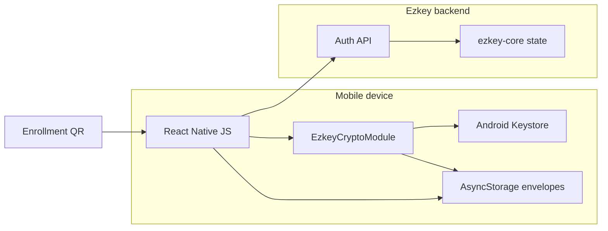

# Ezkey Mobile Protocol and Crypto Security Assessment

**Date:** 2026-07-16  
**Scope:** Android-first reference app (`ezkey_mobile`), Auth API enrollment/authentication protocol, shared crypto contracts  
**Method:** Non-intrusive white-box review (repository source, docs, existing tests). No active exploitation, no device extraction, no hostile network injection against live deployments.  
**Prior assessment:** [`mobile-security-assessment-2026-05.md`](mobile-security-assessment-2026-05.md)  
**Operator HITL lane:** [`product-docs/global/hygiene/mobile-protocol-security/`](../../product-docs/global/hygiene/mobile-protocol-security/)

## 1. Executive summary

Ezkey’s protocol design for enrollment (`bind`/`verify`) and authentication (`pending`/`respond`) remains **credible and coherent**: dual algorithms (device EC P-256, integration Ed25519), one-time proof tokens, signed contextual pending payloads, signed respond decisions, and signed result outcomes. The Android reference client largely follows that contract and now seals long-lived enrollment secrets at rest via an app-level Android Keystore AES key — closing the May 2026 P1 cleartext AsyncStorage defect for the intended write path.

The remaining gaps that most threaten **announced product quality** are not exotic crypto breaks. They are **honesty and lifecycle gaps** between Keystore/StrongBox, app-owned secrets, and local confirmation:

1. Local “protected approval” is **UX-gated**, not Keystore-enforced (`userAuthenticationRequired=false`, no `BiometricPrompt.CryptoObject`).
2. Enrollment Keystore key pairs are **orphaned** on local delete/clear (`deleteKeyPair` exists but is never called).
3. `devicePrivateKeyStorageTier` remains **client-reported and outside the signed verify payload**.
4. Transport trust remains **platform TLS only** (pinning still roadmap).
5. Native Keystore / StrongBox / biometric binding paths have **almost no automated tests**.

None of the confirmed findings, by themselves, constitute a remote authentication bypass of an honest enrolled device over ordinary TLS. Several **do** weaken resistance to compromised-app, rooted-device, or hostile-trust-store adversaries, and several create **claim risk** if marketing or Admin UI language overstates StrongBox or local confirmation.

## 2. Assessment method and standards mapping

### 2.1 Method

| Activity | Done |
| --- | --- |
| Read product/protocol docs and mobile design pack | Yes |
| Trace bind/verify and pending/respond in mobile + Auth API + ezkey-core | Yes |
| Review Android Keystore / StrongBox / seal / biometric code | Yes |
| Reconcile May 2026 mobile assessment findings | Yes |
| Inventory unit / functional / Maestro / static coverage | Yes |
| Active exploit, MITM lab, rooted-device extraction | **Out of scope** (future scenario lane) |

### 2.2 Standards used as analysis lenses (not certification claims)

| Framework | How used |
| --- | --- |
| **OWASP MASVS 2.1** | Control groups: STORAGE, CRYPTO, AUTH, NETWORK, PLATFORM, CODE, RESILIENCE |
| **OWASP MASTG / MASWE** | Testability language for storage, crypto, network, and resilience weaknesses |
| **OWASP ASVS** | Auth API input validation, rate limiting, state-machine abuse (server side) |
| **NIST SP 800-63B-4** | Comparison only: replay resistance, authentication intent, phishing resistance (channel/verifier-name binding), non-exportable keys. **Ezkey does not claim NIST AAL compliance.** |
| **Android Keystore / StrongBox / Key Attestation / BiometricPrompt** | Platform best-practice baseline for hardware-backed keys and auth-bound crypto |

### 2.3 Explicit non-claims

This assessment does **not** assert FIDO2/WebAuthn equivalence, NIST AAL2/AAL3 compliance, server-verified StrongBox, or Play Integrity / attestation-grade endpoint integrity.

## 3. Threat model

### 3.1 Assets

| Asset | Location | Sensitivity |
| --- | --- | --- |
| Per-enrollment EC P-256 private key | Android Keystore (`ezkey_enrollment_{id}`), StrongBox requested | Critical — signs verify/pending/respond |
| App-level AES seal key | Android Keystore (`ezkey_app_seal_v1`) | High — unwraps sealed local secrets |
| `enrollmentProofToken` | Sealed envelope in AsyncStorage (Android) | High — associates device with enrollment |
| `integrationPublicKey` | Sealed envelope in AsyncStorage (Android) | High integrity (trust material) |
| One-time `authAttemptProofToken` | Memory only (intended) | High — binds pending→respond |
| QR bootstrap (`enrollmentId`, proof token, `authUrl`) | Camera / logs / screenshots | High during enrollment |
| Auth API protocol surface | Network | Integrity of MFA decisions |

### 3.2 Actors

| Actor | Relevance |
| --- | --- |
| Physical thief / unlocked device user | High |
| Malware / rooted / compromised app process | High for local confirmation & seal key |
| Network attacker with hostile trusted CA / MDM | Medium (no pinning) |
| Malicious QR / enrollment issuer | Medium (bootstrap trust) |
| Compromised or hostile Auth API origin | Medium (self-hosted trust model) |
| Remote anonymous internet attacker | Lower for crypto bypass; higher for API abuse (rate limits, etc.) |

### 3.3 Trust boundaries

Critical honesty boundary: **honest-client assertions** (storage tier, local biometric prompt) are **not** server-proven properties unless attestation is added later.

### 3.4 Security invariants (expected)

1. Device private keys never leave Keystore / are never exposed to JS as material.
2. Enrollment signing keys and the app seal key are **distinct** Keystore roles.
3. Sensitive enrollment secrets are not stored cleartext in the metadata collection.
4. Bind, verify-result, pending, and respond-result payloads are verified with Ed25519 before trust/UI.
5. Respond signs `authAttemptProofToken|accepted`, not `enrollmentProofToken`.
6. User-initiated pending pull only (no background polling).
7. Backend remains authoritative for attempt/enrollment state and verification.

## 4. Claim-to-evidence matrix

| Product / docs claim | Verdict | Evidence |
| --- | --- | --- |
| Private key material not exposed to application code | **Supported** (Android) | `EzkeyCryptoModule` only exports public key + signatures |
| Android Keystore used for enrollment keys | **Supported** | `generateEnrollmentKeyPair` / `AndroidKeyStore` |
| StrongBox when available | **Conditionally supported** | Requested with fallback; tier is client-reported; silent fallback |
| Sealed local secrets for proof token / integration key | **Supported** (Android intended path) | `secureStorage` + `SealedSecretEnvelope`; May P1 largely remediated |
| Local confirmation before approve | **Conditionally supported** | BiometricPrompt UX exists; **not** Keystore-bound |
| Cryptographic continuity bind↔verify and pending↔respond | **Supported** | Payload builders + mobile verify steps + core services |
| Server-verified StrongBox / hardware tier | **Unsupported** (correctly documented as non-claim) | Tier outside signed verify payload; no attestation |
| Certificate / SPKI pinning | **Unsupported** (roadmap / Coming Soon) | Axios default trust only |
| iOS secure-hardware parity | **Out of scope** / deferred | Docs Android-first; iOS module lag expected |

## 5. Reconciliation with May 2026 assessment

| May 2026 finding | 2026-07 status | Notes |
| --- | --- | --- |
| Sensitive material in cleartext AsyncStorage collection | **Resolved (intended path)** | `enrollmentStorage` strips secrets; Android seals via Keystore AES; legacy migration on read |
| iOS deferred framing | **Still valid boundary** | Not treated as current defect |
| No certificate pinning | **Residual** | See MOB-007 |
| Debug / QR logging | **Residual** | See MOB-004 |
| EXP1 Cloudflare edge posture | **Out of this assessment** | Deployment edge, not mobile protocol |
| Minimal root/tamper resistance | **Residual / deferred** | See MOB-009 |

## 6. Findings register

Severity scale: **P0** integrity/auth bypass or secret compromise with low prerequisites; **P1** material protocol/crypto or claim integrity risk; **P2** meaningful hardening / lifecycle / maintainability risk; **P3** polish / docs / deferred resilience.

Confidence: **Confirmed** = source-evident; **Hypothesis** = needs dynamic/device evidence.

---

### MOB-001 — Local protected approval is UX-gated, not Keystore-bound

| Field | Value |
| --- | --- |
| **Severity** | P1 |
| **Confidence** | Confirmed |
| **Disposition (proposed)** | Fix or explicitly defer with claim lockdown |
| **MASVS** | AUTH, CRYPTO, PLATFORM |
| **NIST lens** | Authentication intent not cryptographically bound to key use |

**Issue.** Enrollment keys are created with `setUserAuthenticationRequired(false)`. `signWithAuthentication` shows `BiometricPrompt`, then calls ordinary `Signature.initSign` / `sign()` without `BiometricPrompt.CryptoObject`. A compromised app process that can invoke the native module’s `sign()` can approve or deny without the prompt.

**Evidence.**
- [`EzkeyCryptoModule.kt`](../../ezkey_mobile/android/app/src/main/java/org/ezkey/mobile/crypto/EzkeyCryptoModule.kt) — key gen ~L173; `signWithAuthentication` ~L336–398; plain `sign` ~L293–322
- [`cryptoService.ts`](../../ezkey_mobile/app/services/crypto/cryptoService.ts) — `signForRespond` branches to `signWithAuthentication` only in JS
- Docs already warn of declarative local confirmation: [`MOBILE_CRYPTO_REFERENCE.md`](../../ezkey_mobile/docs/MOBILE_CRYPTO_REFERENCE.md)

**Attack path.** Malware / accessibility abuse / compromised RN bridge on unlocked device → call `sign(enrollmentId, respondPayload)` → valid Auth API respond.

**Impact.** Local confirmation can be marketed stronger than the crypto guarantee. Does not break remote protocol integrity against an uncompromised device.

**Recommended action.**
1. Short term: lock product/Admin/docs wording to “app-enforced confirmation on honest clients.”
2. Medium term: generate auth-per-use (or time-bound) Keystore keys with `setUserAuthenticationRequired(true)` and sign via `CryptoObject` for protected enrollments / preference.
3. Protocol note: server still cannot attest local auth without attestation redesign.

**Verification class.** Unit/static for wording; **physical StrongBox-capable phone** for CryptoObject / auth-per-use path; instrumentation for Keystore flags.

---

### MOB-002 — Enrollment Keystore keys orphaned on local delete / clear-all

| Field | Value |
| --- | --- |
| **Severity** | P1 |
| **Confidence** | Confirmed |
| **Disposition (proposed)** | Fix |
| **MASVS** | CRYPTO (key lifecycle), STORAGE |

**Issue.** `nativeCrypto.deleteKeyPair` is implemented but never called from `enrollmentStorage.deleteEnrollment`, `clearAll`, `useDeleteEnrollment`, or Danger Zone. Local delete removes metadata + sealed secrets, leaving `ezkey_enrollment_{id}` signable if metadata/secrets were restored or another bug rehydrated identity.

**Evidence.**
- `deleteKeyPair` in `EzkeyCryptoModule.kt` / `nativeCrypto.ts`
- `enrollmentStorage.deleteEnrollment` / `clearAll` — secure remove + metadata only
- `DangerZoneScreen.tsx` — calls `clearAll` without key deletion
- `useEnrollments.ts` — delete mutation → storage only

**Attack path.** Residual key material after “delete”; forensic / malware reuse if enrollment identifiers and proof material reappear; confusing lifecycle for re-enrollment on same id.

**Impact.** Incomplete crypto lifecycle; weakens “data removed from this device” operator expectation.

**Recommended action.** Call `deleteKeyPair` on single delete and clear-all (best-effort, log failures); add unit/hook tests that assert the native delete call; optional instrumentation test that alias is gone.

**Verification class.** Unit (mock native delete called); **emulator/instrumentation** preferred; physical device optional.

---

### MOB-003 — `devicePrivateKeyStorageTier` unbound and unattested

| Field | Value |
| --- | --- |
| **Severity** | P1 (claim integrity) / P2 (protocol) |
| **Confidence** | Confirmed |
| **Disposition (proposed)** | Defer protocol change; Fix docs/Admin wording if any overclaim |
| **MASVS** | CRYPTO, AUTH |
| **Android** | Key Attestation not used |

**Issue.** Tier (`NONE`/`STANDARD`/`STRONG`) is client-chosen telemetry, not in the ECDSA verify payload, and not validated via Key Attestation. Docs already state this; residual risk is Admin UI / sales language treating `STRONG` as proven StrongBox.

**Evidence.**
- `docs/CRYPTO.md`, `docs/MOBILE_DEVELOPER_GUIDE.md` trust-boundary sections
- `EnrollmentVerifyService` stores request tier as-is
- Mobile derives tier from `KeyInfo` honestly on reference client

**Recommended action.** Audit operator-facing copy; keep tier informational; track attestation as future program (not hygiene).

**Verification class.** Static/docs review; physical device only if validating honest-client KeyInfo mapping.

---

### MOB-004 — `__DEV__` / warn paths can log QR enrollment material

| Field | Value |
| --- | --- |
| **Severity** | P2 |
| **Confidence** | Confirmed |
| **Disposition (proposed)** | Fix |
| **MASVS** | STORAGE, PRIVACY, CODE |

**Issue.** `useEnrollmentWizard.handleQrScanned` logs raw QR JSON and parsed payload under `__DEV__`. Invalid QR path `console.warn`s raw value. Pending debug panel can show payload previews when flag enabled.

**Evidence.**
- `useEnrollmentWizard.ts` ~L407–433
- `usePendingAuth.ts` debug snapshot fields
- Semgrep rules exist but do not cover guarded `__DEV__` QR dumps

**Impact.** Pilot / QA logcat and screenshots can leak `enrollmentProofToken`.

**Recommended action.** Redact tokens; require explicit extra flag for raw dumps; tighten debug panel redaction.

**Verification class.** Unit/static (Semgrep rule + test); optional `verify-android-sensitive-storage.sh` / logcat on device.

---

### MOB-005 — No certificate / SPKI pinning (TOFU still roadmap)

| Field | Value |
| --- | --- |
| **Severity** | P2 |
| **Confidence** | Confirmed |
| **Disposition (proposed)** | Defer with honest positioning (or promote program if EXP1 priority) |
| **MASVS** | NETWORK |
| **NIST lens** | Limited phishing / MITM resistance vs verifier-name binding models |

**Issue.** `httpClient` uses platform TLS trust. QR may supply `authUrl` (HTTPS required except loopback). Hostile root CA / MDM can MITM; protocol signatures still protect pending/respond content integrity, but enrollment bootstrap and metadata confidentiality suffer.

**Evidence.**
- `httpClient.ts`, `urlValidation.ts`
- Coming Soon / i18n pinning copy; retrofit `R-2026-0001-mobile-certificate-pinning-spki.md`

**Recommended action.** Keep as explicit product decision; if pursued, SPKI TOFU at bind + controlled rotation (existing design notes).

**Verification class.** Design/docs now; MITM lab later (Scenario C from May assessment).

---

### MOB-006 — Native Keystore / StrongBox / biometric path untested

| Field | Value |
| --- | --- |
| **Severity** | P2 |
| **Confidence** | Confirmed (coverage gap) |
| **Disposition (proposed)** | Fix (add instrumentation + device evidence plan) |
| **MASVS** | CRYPTO, CODE |

**Issue.** JVM tests cover `SealedSecretEnvelope` and `IntegrationKeyVerifier` only. Zero `androidTest`. Maestro pilots approve flows but do not assert StrongBox tier, Keystore delete, or CryptoObject binding. Jest mocks native crypto.

**Impact.** Regressions in the trust boundary can ship unnoticed; undermines assurance narrative.

**Recommended action.** Add focused instrumentation tests (key gen flags, delete alias, seal via module); document StrongBox-capable manual checklist; extend Maestro only where stable.

**Verification class.** Emulator for generic Keystore; **physical StrongBox phone** for STRONG tier and StrongBox fallback.

---

### MOB-007 — Duplicate pending orchestration (Detail vs hook)

| Field | Value |
| --- | --- |
| **Severity** | P2 |
| **Confidence** | Confirmed |
| **Disposition (proposed)** | Fix |
| **MASVS** | CODE (maintainability → security drift) |

**Issue.** `EnrollmentDetailScreen.handleCheckPending` reimplements pending request + Ed25519 verify already present in `usePendingAuth.loadPendingAttempt`. Future security fixes can land in one path only.

**Evidence.**
- `EnrollmentDetailScreen.tsx` ~L78–164
- `usePendingAuth.ts` `loadPendingAttempt`

**Recommended action.** Single shared pending-claim helper used by Detail navigation and Pending screen auto-load.

**Verification class.** Unit tests on shared helper; existing hook tests extended.

---

### MOB-008 — Stale crypto path / diagnostic documentation drift

| Field | Value |
| --- | --- |
| **Severity** | P3 |
| **Confidence** | Confirmed |
| **Disposition (proposed)** | Fix |
| **MASVS** | CODE |

**Issue.** Examples:
- `docs/CRYPTO.md` still cites `com/ezkeymobile/...` paths; implementation is `org.ezkey.mobile.crypto`
- Historical protocol audit plan (`.github/prompts/plan-authProtocolSecurityAudit.prompt.md`) is partially stale (e.g. respond rate limiting now exists)
- May P1 investigation doc describes pre-seal storage truth and can confuse cold agents if read without date context

**Recommended action.** Patch living docs; leave historical plans clearly marked; add “superseded by seal model” banner to May P1 note if still linked.

**Verification class.** Docs review only.

---

### MOB-009 — Minimal device integrity / tamper resistance

| Field | Value |
| --- | --- |
| **Severity** | P3 |
| **Confidence** | Confirmed (absence) |
| **Disposition (proposed)** | Defer |
| **MASVS** | RESILIENCE |

**Issue.** No rooted-device, Play Integrity, or runtime tamper controls. Acceptable if positioned honestly for current market; not acceptable if claimed.

**Recommended action.** Keep deferred; do not displace P1 lifecycle/crypto-binding work.

**Verification class.** Product positioning review.

---

### MOB-010 — QR bootstrap is trust-on-issuer (hostile enrollment host)

| Field | Value |
| --- | --- |
| **Severity** | P2 |
| **Confidence** | Confirmed (by design) |
| **Disposition (proposed)** | Defer / document; optional UX hardening |
| **MASVS** | AUTH, NETWORK |

**Issue.** A syntactically valid HTTPS QR can point the app at an attacker Auth API. Bind signature then proves that **that** host’s integration key — not organizational identity beyond TLS. Aligns with self-hosted trust model; still a phishing-adjacent enrollment risk.

**Recommended action.** Clear enrollment confirmation UI (host, instance name); future pinning/TOFU; do not pretend PKI/CA chain exists (already documented).

**Verification class.** Manual UX / hostile QR scenario (May Scenario B).

---

## 7. Protocol continuity notes (positive controls)

These are **not** findings; they are strengths that should be preserved:

| Control | Status |
| --- | --- |
| Fail-closed `integrationKeyAlgorithm == ed25519` on bind | Present in mobile |
| Ed25519 verify of bind / verify-result / pending / respond-result | Present |
| Canonical pending includes challenge + context (NFC) | Present (V4 from older audit largely addressed) |
| Respond signs `proofToken\|accepted` | Present |
| Device proof token CSPRNG via native module | Present |
| User-initiated pending only | Present |
| Auth API respond rate limiting by `authAttemptId` | Present in current `RateLimitFilter` (older audit plan partially stale) |
| One-shot INVALID on failed verify/respond crypto | Present server-side |

## 8. Evidence and verification matrix

| Finding | Static/source | Unit | Docker functional | Emulator/instrumentation | Physical StrongBox phone |
| --- | --- | --- | --- | --- | --- |
| MOB-001 | Yes | Partial (policy) | No | Useful | **Required for CryptoObject fix** |
| MOB-002 | Yes | Yes (mock delete) | No | Recommended | Optional |
| MOB-003 | Yes | Docs/UI | N/A | Optional KeyInfo | Optional honest-tier check |
| MOB-004 | Yes | Semgrep/unit | No | Logcat optional | Optional |
| MOB-005 | Yes | N/A | N/A | N/A | MITM lab later |
| MOB-006 | Coverage gap | Envelope/verify exist | N/A | **Required** | **Required for StrongBox** |
| MOB-007 | Yes | Yes | No | No | No |
| MOB-008 | Yes | N/A | N/A | N/A | No |
| MOB-009 | Yes | N/A | N/A | N/A | Optional future |
| MOB-010 | Yes | URL validation | No | No | Manual QR scenario |

## 9. Prioritized action backlog

### Lot A — recommended first hygiene/program cycle (this HITL pass)

1. **MOB-001** — Local auth binding honesty / CryptoObject direction  
2. **MOB-002** — Delete Keystore keys on enrollment wipe  
3. **MOB-004** — Redact QR / debug secret logging  
4. **MOB-007** — Deduplicate pending claim path  
5. **MOB-006** — Native instrumentation + StrongBox evidence checklist  
6. **MOB-008** — Living doc path / staleness cleanup  

### Lot B — product decisions (may become `I-*` / `TB-*`)

- **MOB-003** — Attestation / signed tier (program) vs wording-only  
- **MOB-005** — SPKI TOFU pinning program  
- **MOB-010** — Enrollment UX host confirmation  
- **MOB-009** — Integrity APIs (deferred)

## 10. Claim verdict (product-facing)

| Statement | Verdict |
| --- | --- |
| “Cryptographic continuity across enrollment and authentication” | **Supported** |
| “Device private keys in Android Keystore; StrongBox when available” | **Supported with caveats** (fallback; not server-proven) |
| “Long-lived enrollment secrets sealed at rest on Android” | **Supported** for current reference path |
| “Local biometric/device confirmation protects approvals” | **Conditionally supported** — honest-client UX only today |
| “Backend verifies StrongBox” | **Unsupported** — do not claim |
| “Pinning / phishing resistance comparable to WebAuthn” | **Unsupported** — do not claim |
| “Deleting an enrollment removes all local crypto material” | **Currently unsupported** — MOB-002 |

## 11. Methodology next steps

1. Operator HITL on Lot A via [`product-docs/global/hygiene/mobile-protocol-security/2026-07-16-pass-1.md`](../../product-docs/global/hygiene/mobile-protocol-security/2026-07-16-pass-1.md).  
2. One cold-agent [`HANDOFF-*.md`](../../product-docs/global/backlog/handoffs/) per **accepted** finding.  
3. Promote only P0/P1 protocol redesigns (e.g. attestation, pinning, CryptoObject key model) to `I-*` / `TB-*` when scope exceeds hygiene.  
4. Optional future active scenarios: May assessment Scenarios A–D (device extraction, hostile QR, MITM, replay lab).

## 12. Related documents

- [`mobile-security-assessment-2026-05.md`](mobile-security-assessment-2026-05.md)
- [`mobile-p1-sensitive-storage-investigation-2026-05.md`](mobile-p1-sensitive-storage-investigation-2026-05.md)
- [`../CRYPTO.md`](../CRYPTO.md)
- [`../MOBILE_DEVELOPER_GUIDE.md`](../MOBILE_DEVELOPER_GUIDE.md)
- [`../ENROLLMENT_SIGNATURE_PAYLOAD.md`](../ENROLLMENT_SIGNATURE_PAYLOAD.md)
- [`../AUTH_ATTEMPT_SIGNATURE_PAYLOAD.md`](../AUTH_ATTEMPT_SIGNATURE_PAYLOAD.md)
- [`../../ezkey_mobile/docs/MOBILE_CRYPTO_REFERENCE.md`](../../ezkey_mobile/docs/MOBILE_CRYPTO_REFERENCE.md)
- [`../../ezkey_mobile/docs/MOBILE_DATA_MODEL.md`](../../ezkey_mobile/docs/MOBILE_DATA_MODEL.md)
- [`../../product-docs/global/legacy-retrofit/R-2026-0001-mobile-certificate-pinning-spki.md`](../../product-docs/global/legacy-retrofit/R-2026-0001-mobile-certificate-pinning-spki.md)
