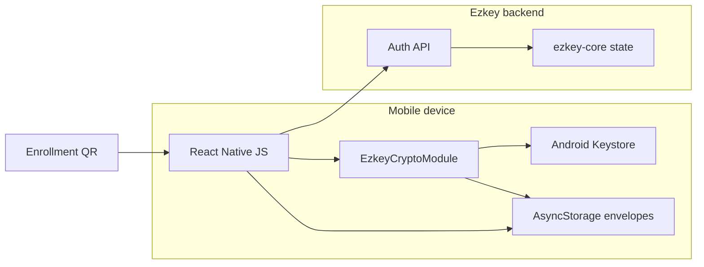

# Ezkey Mobile Protocol and Crypto Security Assessment

**Date:** 2026-07-16  
**Pass-2 re-verification:** 2026-07-19  
**Scope:** Android-first reference app (`ezkey_mobile`), Auth API enrollment/authentication protocol, shared crypto contracts  
**Method:** Non-intrusive white-box review (repository source, docs, existing tests). No active exploitation, no device extraction, no hostile network injection against live deployments.  
**Prior assessment:** [`mobile-security-assessment-2026-05.md`](mobile-security-assessment-2026-05.md)  
**Operator HITL lane:** [`product-docs/global/hygiene/mobile-protocol-security/`](../../product-docs/global/hygiene/mobile-protocol-security/)

## 1. Executive summary

Ezkey’s protocol design for enrollment (`bind`/`verify`) and authentication (`pending`/`respond`) remains **credible and coherent**: dual algorithms (device EC P-256, integration Ed25519), one-time proof tokens, signed contextual pending payloads, signed respond decisions, and signed result outcomes. The Android reference client largely follows that contract and now seals long-lived enrollment secrets at rest via an app-level Android Keystore AES key — closing the May 2026 P1 cleartext AsyncStorage defect for the intended write path.

**Lot A (2026-07 hygiene cycle) is closed** — see §9 and the campaign note. **Lot B documentary / claim-honesty checks were completed 2026-07-19** — see §13; do not reopen those as “Admin UI overclaim” or “missing positioning” defects without new evidence.

**Pass-2 (2026-07-19)** is an additive white-box delta on the same July register — see **§14**. It does **not** reopen closed Lot A remediations or Lot B documentary verdicts. It adds new lifecycle / identity / platform findings (MOB-011–MOB-016) discovered by re-reading the current tree after Lot A merged.

**Pass-3 (2026-07-26, closed)** is an additive white-box delta prompted by an operator re-read of the mobile key-architecture narrative after MOB-011 — see **§15**. It added one new finding, MOB-017 (single app-level AES seal key vs installation-scoped seal key), fixed the same day as `ADR-MOB-0006`, and does not reopen pass-1 or pass-2 closed rows.

Residual **product/protocol** gaps that remain intentional or deferred (not false positives):

1. Local “protected approval” remains **UX-gated**, not Keystore-enforced (MOB-001 Track B / CryptoObject — future program).
2. `devicePrivateKeyStorageTier` remains **client-reported and outside the signed verify payload** (MOB-003 — protocol; operator-facing honesty already verified).
3. Transport trust remains **platform TLS only** (MOB-005 pinning — roadmap / `R-2026-0001`).
4. Device integrity / tamper resistance remains minimal (MOB-009 — deferred; no overclaim found).
5. QR enrollment bootstrap remains trust-on-issuer (MOB-010 — by design; host is shown in UX).

None of the confirmed findings, by themselves, constitute a remote authentication bypass of an honest enrolled device over ordinary TLS. Pass-2 P1 items are **local multi-installation isolation** and **Android platform key-lifecycle** risks — not remote protocol breaks.

## 2. Assessment method and standards mapping

### 2.1 Method

| Activity | Done |
| --- | --- |
| Read product/protocol docs and mobile design pack | Yes |
| Trace bind/verify and pending/respond in mobile + Auth API + ezkey-core | Yes |
| Review Android Keystore / StrongBox / seal / biometric code | Yes |
| Reconcile May 2026 mobile assessment findings | Yes |
| Inventory unit / functional / Maestro / static coverage | Yes |
| Active exploit, MITM lab, rooted-device extraction | **Out of scope** (future scenario lane) |

### 2.2 Standards used as analysis lenses (not certification claims)

| Framework | How used |
| --- | --- |
| **OWASP MASVS 2.1** | Control groups: STORAGE, CRYPTO, AUTH, NETWORK, PLATFORM, CODE, RESILIENCE |
| **OWASP MASTG / MASWE** | Testability language for storage, crypto, network, and resilience weaknesses |
| **OWASP ASVS** | Auth API input validation, rate limiting, state-machine abuse (server side) |
| **NIST SP 800-63B-4** | Comparison only: replay resistance, authentication intent, phishing resistance (channel/verifier-name binding), non-exportable keys. **Ezkey does not claim NIST AAL compliance.** |
| **Android Keystore / StrongBox / Key Attestation / BiometricPrompt** | Platform best-practice baseline for hardware-backed keys and auth-bound crypto |

### 2.3 Explicit non-claims

This assessment does **not** assert FIDO2/WebAuthn equivalence, NIST AAL2/AAL3 compliance, server-verified StrongBox, or Play Integrity / attestation-grade endpoint integrity.

## 3. Threat model

### 3.1 Assets

| Asset | Location | Sensitivity |
| --- | --- | --- |
| Per-enrollment EC P-256 private key | Android Keystore (`ezkey_enrollment_{id}`), StrongBox requested | Critical — signs verify/pending/respond |
| App-level AES seal key | Android Keystore (`ezkey_app_seal_v1`) | High — unwraps sealed local secrets |
| `enrollmentProofToken` | Sealed envelope in AsyncStorage (Android) | High — associates device with enrollment |
| `integrationPublicKey` | Sealed envelope in AsyncStorage (Android) | High integrity (trust material) |
| One-time `authAttemptProofToken` | Memory only (intended) | High — binds pending→respond |
| QR bootstrap (`enrollmentId`, proof token, `authUrl`) | Camera / logs / screenshots | High during enrollment |
| Auth API protocol surface | Network | Integrity of MFA decisions |

### 3.2 Actors

| Actor | Relevance |
| --- | --- |
| Physical thief / unlocked device user | High |
| Malware / rooted / compromised app process | High for local confirmation & seal key |
| Network attacker with hostile trusted CA / MDM | Medium (no pinning) |
| Malicious QR / enrollment issuer | Medium (bootstrap trust) |
| Compromised or hostile Auth API origin | Medium (self-hosted trust model) |
| Remote anonymous internet attacker | Lower for crypto bypass; higher for API abuse (rate limits, etc.) |

### 3.3 Trust boundaries

Critical honesty boundary: **honest-client assertions** (storage tier, local biometric prompt) are **not** server-proven properties unless attestation is added later.

### 3.4 Security invariants (expected)

1. Device private keys never leave Keystore / are never exposed to JS as material.
2. Enrollment signing keys and the app seal key are **distinct** Keystore roles.
3. Sensitive enrollment secrets are not stored cleartext in the metadata collection.
4. Bind, verify-result, pending, and respond-result payloads are verified with Ed25519 before trust/UI.
5. Respond signs `authAttemptProofToken|accepted`, not `enrollmentProofToken`.
6. User-initiated pending pull only (no background polling).
7. Backend remains authoritative for attempt/enrollment state and verification.

## 4. Claim-to-evidence matrix

| Product / docs claim | Verdict | Evidence |
| --- | --- | --- |
| Private key material not exposed to application code | **Supported** (Android) | `EzkeyCryptoModule` only exports public key + signatures |
| Android Keystore used for enrollment keys | **Supported** | `generateEnrollmentKeyPair` / `AndroidKeyStore` |
| StrongBox when available | **Conditionally supported** | Requested with fallback; tier is client-reported; silent fallback |
| Sealed local secrets for proof token / integration key | **Supported** (Android intended path) | `secureStorage` + `SealedSecretEnvelope`; May P1 largely remediated |
| Local confirmation before approve | **Conditionally supported** | BiometricPrompt UX exists; **not** Keystore-bound |
| Cryptographic continuity bind↔verify and pending↔respond | **Supported** | Payload builders + mobile verify steps + core services |
| Server-verified StrongBox / hardware tier | **Unsupported** (correctly documented as non-claim) | Tier outside signed verify payload; no attestation; Admin UI tooltips state client-reported (verified 2026-07-19, §13) |
| Certificate / SPKI pinning | **Unsupported** (roadmap / Coming Soon) | Axios default trust only; Coming Soon frames as planned (verified 2026-07-19, §13) |
| iOS secure-hardware parity | **Out of scope** / deferred | Docs Android-first; iOS module lag expected |

## 5. Reconciliation with May 2026 assessment

| May 2026 finding | 2026-07 status | Notes |
| --- | --- | --- |
| Sensitive material in cleartext AsyncStorage collection | **Resolved (intended path)** | `enrollmentStorage` strips secrets; Android seals via Keystore AES; legacy migration on read |
| iOS deferred framing | **Still valid boundary** | Not treated as current defect |
| No certificate pinning | **Residual** (honest roadmap) | See MOB-005 |
| Debug / QR logging | **Resolved** (Lot A) | See MOB-004 |
| EXP1 Cloudflare edge posture | **Out of this assessment** | Deployment edge, not mobile protocol |
| Minimal root/tamper resistance | **Residual / deferred** | See MOB-009 |

## 6. Findings register

Severity scale: **P0** integrity/auth bypass or secret compromise with low prerequisites; **P1** material protocol/crypto or claim integrity risk; **P2** meaningful hardening / lifecycle / maintainability risk; **P3** polish / docs / deferred resilience.

Confidence: **Confirmed** = source-evident; **Hypothesis** = needs dynamic/device evidence.

---

### MOB-001 — Local protected approval is UX-gated, not Keystore-bound

| Field | Value |
| --- | --- |
| **Severity** | P1 |
| **Confidence** | Confirmed |
| **Disposition** | **Track A completed** (2026-07-18 wording/docs lockdown); Track B (CryptoObject) deferred to a future program; Track A honesty **re-verified 2026-07-19** |
| **MASVS** | AUTH, CRYPTO, PLATFORM |
| **NIST lens** | Authentication intent not cryptographically bound to key use |

**Issue.** Enrollment keys are created with `setUserAuthenticationRequired(false)`. `signWithAuthentication` shows `BiometricPrompt`, then calls ordinary `Signature.initSign` / `sign()` without `BiometricPrompt.CryptoObject`. A compromised app process that can invoke the native module’s `sign()` can approve or deny without the prompt.

**2026-07-19 Track A residual check.** Security screen i18n remains explicit: “This protection is enforced by the app” / signing key does not require confirmation / backend receives no cryptographic proof (`ezkey_mobile/app/i18n/resources.ts` `declarativeNote*`). Do **not** re-open Track A as a wording defect. Track B (CryptoObject) remains a deliberate program gap, not an uninvestigated hygiene miss.

**Evidence.**
- [`EzkeyCryptoModule.kt`](../../ezkey_mobile/android/app/src/main/java/org/ezkey/mobile/crypto/EzkeyCryptoModule.kt) — key gen ~L173; `signWithAuthentication` ~L336–398; plain `sign` ~L293–322
- [`cryptoService.ts`](../../ezkey_mobile/app/services/crypto/cryptoService.ts) — `signForRespond` branches to `signWithAuthentication` only in JS
- Docs already warn of declarative local confirmation: [`MOBILE_CRYPTO_REFERENCE.md`](../../ezkey_mobile/docs/MOBILE_CRYPTO_REFERENCE.md)

**Attack path.** Malware / accessibility abuse / compromised RN bridge on unlocked device → call `sign(enrollmentId, respondPayload)` → valid Auth API respond.

**Impact.** Local confirmation can be marketed stronger than the crypto guarantee. Does not break remote protocol integrity against an uncompromised device.

**Recommended action.**
1. Short term: lock product/Admin/docs wording to “app-enforced confirmation on honest clients.”
2. Medium term: generate auth-per-use (or time-bound) Keystore keys with `setUserAuthenticationRequired(true)` and sign via `CryptoObject` for protected enrollments / preference.
3. Protocol note: server still cannot attest local auth without attestation redesign.

**Verification class.** Unit/static for wording; **physical StrongBox-capable phone** for CryptoObject / auth-per-use path; instrumentation for Keystore flags.

---

### MOB-002 — Enrollment Keystore keys orphaned on local delete / clear-all

| Field | Value |
| --- | --- |
| **Severity** | P1 |
| **Confidence** | Confirmed |
| **Disposition** | **Fixed** — PR [#381](https://github.com/mgagp/ezkey/pull/381) (fail-open Keystore delete on wipe) |
| **MASVS** | CRYPTO (key lifecycle), STORAGE |

**Issue (historized — fixed in Lot A).** At assessment open, `nativeCrypto.deleteKeyPair` was implemented but never called from wipe paths. Local delete removed metadata + sealed secrets while leaving `ezkey_enrollment_{id}` in Keystore.

**Current code (post-PR #381).** `enrollmentStorage.deleteEnrollment` / `clearAll` call `deleteKeyPairBestEffort` (fail-open: storage cleanup always proceeds). Treat the Issue/Evidence bullets above as **pre-fix** narrative; do not re-open as an active defect.

**Verification class.** Unit (mock native delete called) — covered; emulator/instrumentation preferred for alias absence.

---

### MOB-003 — `devicePrivateKeyStorageTier` unbound and unattested

| Field | Value |
| --- | --- |
| **Severity** | P1 (claim integrity) / P2 (protocol) |
| **Confidence** | Confirmed |
| **Disposition** | **Claim honesty verified adequate (2026-07-19)**; protocol attestation / signed-tier binding remains **deferred program** |
| **MASVS** | CRYPTO, AUTH |
| **Android** | Key Attestation not used |

**Issue.** Tier (`NONE`/`STANDARD`/`STRONG`) is client-chosen telemetry, not in the ECDSA verify payload, and not validated via Key Attestation. Residual risk was Admin UI / sales language treating `STRONG` as proven StrongBox.

**2026-07-19 verification (documentary / operator-facing — no handoff required).**

| Surface | Result |
| --- | --- |
| Admin UI badge tooltips | Explicit **client-reported / not attested by the server** for NONE, STANDARD, and STRONG (`ezkey-admin-ui/src/locales/en/enrollments.json` `keyTier.help*`; FR equivalents present) |
| Admin UI presentation | `DevicePrivateKeyTierBadge` uses help text as tooltip on enrollment detail (`device-private-key-tier-badge.tsx`, `enrollment-detail.tsx`) — no “verified hardware” label |
| Protocol / developer docs | `docs/MOBILE_DEVELOPER_GUIDE.md` trust-model table; `docs/CRYPTO.md`; `ezkey_mobile/docs/MOBILE_CRYPTO_REFERENCE.md` — all state server does not prove tier |
| Public site / PRD | No “server-verified StrongBox” overclaim found in spot check |

**Conclusion for future campaigns:** Do **not** re-open MOB-003 as an Admin UI honesty defect unless new copy appears that claims attestation. The remaining work (Key Attestation, extend signed verify payload) is a deliberate **protocol program**, not a missed hygiene fix.

**Verification class.** Static/docs/UI review (done); physical device only for honest-client KeyInfo mapping (covered under MOB-006 evidence).

---

### MOB-004 — `__DEV__` / warn paths can log QR enrollment material

| Field | Value |
| --- | --- |
| **Severity** | P2 |
| **Confidence** | Confirmed |
| **Disposition** | **Fixed** — PR [#383](https://github.com/mgagp/ezkey/pull/383) (redacted seed logs + debug panel; opt-in raw dump flag) |
| **MASVS** | STORAGE, PRIVACY, CODE |

**Issue (historized — fixed in Lot A).** At assessment open, `__DEV__` QR ingest and some debug paths could dump enrollment proof material.

**Current code (post-PR #383).** Seed ingest uses `enrollmentSeedLogRedaction.ts`; raw dumps require explicit `EZKEY_ENROLLMENT_SEED_RAW_DUMP`. Pending debug panel keeps hashes / lengths / short prefixes only. Do not re-open as an active defect without new logging paths.

**Verification class.** Unit/static (redaction tests); optional logcat on device.

---

### MOB-005 — No certificate / SPKI pinning (TOFU still roadmap)

| Field | Value |
| --- | --- |
| **Severity** | P2 |
| **Confidence** | Confirmed |
| **Disposition** | **Honest positioning verified (2026-07-19)**; implementation remains **deferred program** (`R-2026-0001`) |
| **MASVS** | NETWORK |
| **NIST lens** | Limited phishing / MITM resistance vs verifier-name binding models |

**Issue.** `httpClient` uses platform TLS trust. QR may supply `authUrl` (HTTPS required except loopback). Hostile root CA / MDM can MITM; protocol signatures still protect pending/respond content integrity.

**2026-07-19 verification (documentary).**

| Surface | Result |
| --- | --- |
| Implementation | No pinning in `httpClient.ts` — expected |
| Product framing | Coming Soon + release notes describe pinning as **planned** TOFU-style, not as shipped |
| Design canon | `product-docs/global/legacy-retrofit/R-2026-0001-mobile-certificate-pinning-spki.md` documents intended SPKI+TOFU approach |
| Overclaim check | No living claim that mobile currently pins certificates |

**Conclusion for future campaigns:** Absence of pinning is a known deferred feature with honest UX/docs. Re-open only if product copy claims pinning is active, or when promoting the pinning program to implementation.

**Verification class.** Design/docs (done); MITM lab remains optional future Scenario C.

---

### MOB-006 — Native Keystore / StrongBox / biometric path untested

| Field | Value |
| --- | --- |
| **Severity** | P2 |
| **Confidence** | Confirmed (coverage gap) |
| **Disposition** | **Fixed** — PR [#386](https://github.com/mgagp/ezkey/pull/386) (androidTest + StrongBox evidence on Pixel 7 Pro → `STRONG`) |
| **MASVS** | CRYPTO, CODE |

**Issue (historized — fixed in Lot A).** At assessment open there was no `androidTest` coverage for Keystore paths.

**Current code (post-PR #386).** `EzkeyCryptoModuleInstrumentedTest` covers generate/sign/delete, seal/unseal via module, and tier enum membership. Physical Pixel 7 Pro evidence recorded `STRONG` (client-reported; not attestation). Emulator green ≠ StrongBox proof. Residual: no instrumented Ed25519 `verify()` via RN module; no CryptoObject path (MOB-001 Track B).

**Verification class.** Emulator for generic Keystore; **physical StrongBox phone** for STRONG tier (checklist).

---

### MOB-007 — Duplicate pending orchestration (Detail vs hook)

| Field | Value |
| --- | --- |
| **Severity** | P2 |
| **Confidence** | Confirmed |
| **Disposition** | **Fixed** — PR [#384](https://github.com/mgagp/ezkey/pull/384) (shared `claimPendingAttempt`) |
| **MASVS** | CODE (maintainability → security drift) |

**Issue (historized — fixed in Lot A).** At assessment open, Detail and Pending Auth duplicated pending-claim orchestration.

**Current code (post-PR #384).** Both paths call shared `claimPendingAttempt`. Do not re-open as an active defect; residual UI mapping duplication around fail-closed copy is maintainability-only (see §14.4).

**Verification class.** Unit tests on shared helper — present.

---

### MOB-008 — Stale crypto path / diagnostic documentation drift

| Field | Value |
| --- | --- |
| **Severity** | P3 |
| **Confidence** | Confirmed |
| **Disposition** | **Fixed** — PR [#385](https://github.com/mgagp/ezkey/pull/385) |
| **MASVS** | CODE |

**Issue (historized — fixed in Lot A).** Living crypto docs cited stale package paths; historical audit prompt was partially stale.

**Current code (post-PR #385).** `docs/CRYPTO.md` points at `org.ezkey.mobile.crypto`. Historical prompts remain marked stale where applicable. Do not re-open without new living-doc drift.

**Verification class.** Docs review only.

---

### MOB-009 — Minimal device integrity / tamper resistance

| Field | Value |
| --- | --- |
| **Severity** | P3 |
| **Confidence** | Confirmed (absence) |
| **Disposition** | **No overclaim found (2026-07-19)**; resilience controls remain **intentionally deferred** |
| **MASVS** | RESILIENCE |

**Issue.** No rooted-device, Play Integrity, or runtime tamper controls. Acceptable if positioned honestly; not acceptable if claimed.

**2026-07-19 verification (documentary).**

| Surface | Result |
| --- | --- |
| PRD / SECURITY_POSTURE / public site spot check | No Play Integrity / DeviceCheck / “tamper-proof phone” product claim |
| Mobile docs | Emphasize protocol + Keystore; May assessment already framed integrity as honest boundary |
| Code | No root/jailbreak detection layer in `ezkey_mobile` — expected for deferred scope |

**Conclusion for future campaigns:** Do not treat “missing Play Integrity” as a regression or missed Lot A fix. Re-open only if marketing claims endpoint attestation-grade integrity, or when starting a deliberate resilience program.

**Verification class.** Product positioning review (done).

---

### MOB-010 — QR bootstrap is trust-on-issuer (hostile enrollment host)

| Field | Value |
| --- | --- |
| **Severity** | P2 |
| **Confidence** | Confirmed (by design) |
| **Disposition** | **Enrollment host visibility verified (2026-07-19)**; residual trust-on-issuer is **intentional self-hosted model** |
| **MASVS** | AUTH, NETWORK |

**Issue.** A syntactically valid HTTPS QR can point the app at an attacker Auth API. Bind signature then proves that **that** host’s integration key — not organizational identity beyond TLS.

**2026-07-19 verification (UX + docs).**

| Surface | Result |
| --- | --- |
| Enrollment wizard | Shows **Server** URL after bind when available (`EnrollmentWizardScreen` `showServerUrl` / `serverUrl`) |
| Enrollment detail | Shows installation `authUrl` in technical server block |
| URL policy | `validateAuthUrl` requires HTTPS except loopback / emulator aliases |
| Protocol docs | `MOBILE_DEVELOPER_GUIDE.md` “no end-to-end PKI/CA chain” trust-model boundary explicit |
| Pinning | Not present (MOB-005) — does not silently claim host authenticity beyond TLS + bind crypto |

**Conclusion for future campaigns:** The recommended UX hardening (show host) is present. Do not re-file MOB-010 as “app hides enrollment target.” Remaining risk is inherent to QR→HTTPS self-hosted bootstrap until pinning/TOFU (MOB-005 / `R-2026-0001`) lands. Hostile-QR lab (May Scenario B) remains optional active validation, not a documentary defect.

**Verification class.** Static UX/docs (done); optional manual hostile QR scenario later.

---

## 7. Protocol continuity notes (positive controls)

These are **not** findings; they are strengths that should be preserved:

| Control | Status |
| --- | --- |
| Fail-closed `integrationKeyAlgorithm == ed25519` on bind | Present in mobile |
| Ed25519 verify of bind / verify-result / pending / respond-result | Present |
| Canonical pending includes challenge + context (NFC) | Present (V4 from older audit largely addressed) |
| Respond signs `proofToken\|accepted` | Present |
| Device proof token CSPRNG via native module | Present |
| User-initiated pending only | Present |
| Auth API respond rate limiting by `authAttemptId` | Present in current `RateLimitFilter` (older audit plan partially stale) |
| One-shot INVALID on failed verify/respond crypto | Present server-side |

## 8. Evidence and verification matrix

| Finding | Static/source | Unit | Docker functional | Emulator/instrumentation | Physical StrongBox phone |
| --- | --- | --- | --- | --- | --- |
| MOB-001 | Yes | Partial (policy) | No | Useful | **Required for CryptoObject fix** |
| MOB-002 | Yes | Yes (mock delete) | No | Recommended | Optional |
| MOB-003 | Yes | Docs/UI | N/A | Optional KeyInfo | Optional honest-tier check |
| MOB-004 | Yes | Semgrep/unit | No | Logcat optional | Optional |
| MOB-005 | Yes | N/A | N/A | N/A | MITM lab later |
| MOB-006 | Coverage gap | Envelope/verify exist | N/A | **Required** | **Required for StrongBox** |
| MOB-007 | Yes | Yes | No | No | No |
| MOB-008 | Yes | N/A | N/A | N/A | No |
| MOB-009 | Yes | N/A | N/A | N/A | Optional future |
| MOB-010 | Yes | URL validation | No | No | Manual QR scenario |

## 9. Prioritized action backlog

### Lot A — first hygiene cycle — **closed 2026-07-19**

Durable closeout (decisions, PR links, StrongBox evidence) lives in
[`product-docs/global/hygiene/mobile-protocol-security/2026-07-16-pass-1.md`](../../product-docs/global/hygiene/mobile-protocol-security/2026-07-16-pass-1.md).
Ephemeral cold-agent handoff prompts were retired after merge; do not re-create them for closed rows.

| Finding | Outcome | Evidence |
| --- | --- | --- |
| **MOB-001** | Track A completed (wording/docs); Track B deferred | Commit `4a1cd705` (2026-07-18); CryptoObject remains future program |
| **MOB-002** | Fixed | PR [#381](https://github.com/mgagp/ezkey/pull/381) |
| **MOB-004** | Fixed | PR [#383](https://github.com/mgagp/ezkey/pull/383) |
| **MOB-007** | Fixed | PR [#384](https://github.com/mgagp/ezkey/pull/384) |
| **MOB-006** | Fixed | PR [#386](https://github.com/mgagp/ezkey/pull/386); Pixel 7 Pro tier `STRONG` |
| **MOB-008** | Fixed | PR [#385](https://github.com/mgagp/ezkey/pull/385) |

### Lot B — documentary / claim-honesty verification — **closed 2026-07-19**

Operator-facing and product-positioning checks for items that never received Lot A handoffs. Full investigation notes: **§13**. Future mini-campaigns must read §13 before re-opening these as defects.

| Finding | Documentary / UX verdict | Residual product/protocol work |
| --- | --- | --- |
| **MOB-003** | Admin UI + docs honest (client-reported, not attested) | Attestation / signed-tier binding — future program |
| **MOB-005** | Pinning framed as planned, not shipped | SPKI TOFU — `R-2026-0001` / future program |
| **MOB-009** | No integrity overclaim found | Play Integrity / tamper — intentionally deferred |
| **MOB-010** | Enrollment host / auth URL shown in UX | Trust-on-issuer inherent until pinning; optional hostile-QR lab |
| **MOB-001 Track B** | Track A wording still adequate | CryptoObject — future program (phone required) |

### Pass-2 — open HITL lot (2026-07-19)

Full evidence: **§14**. Decision register:
[`product-docs/global/hygiene/mobile-protocol-security/2026-07-19-pass-2.md`](../../product-docs/global/hygiene/mobile-protocol-security/2026-07-19-pass-2.md).
No remediations authorized until operator HITL.

| Finding | Severity | Status |
| --- | --- | --- |
| **MOB-011** | P1 | **Fixed** — PR [#401](https://github.com/mgagp/ezkey/pull/401); TB closed 2026-07-23 |
| **MOB-012** | P1 | **Fixed** — gate API 35+ only (2026-07-23 HITL); forward-only for existing keys |
| **MOB-013** | P1/P2 | **Fixed** (absorbed) — same PR / TB as MOB-011 |
| **MOB-014** | P2 | **Fixed** — PR [#405](https://github.com/mgagp/ezkey/pull/405); malformed pending HTTP 200 fail-closed (2026-07-24) |
| **MOB-015** | P2 | **Fixed** — broken-enrollment list honesty + clearAll seal wipe |
| **MOB-016** | P2 | **Fixed** (absorbed) — same PR / TB as MOB-011 |

### Pass-3 — closed (2026-07-26)

Full evidence: **§15**. Decision register:
[`product-docs/global/hygiene/mobile-protocol-security/2026-07-26-pass-3.md`](../../product-docs/global/hygiene/mobile-protocol-security/2026-07-26-pass-3.md).

| Finding | Severity | Status |
| --- | --- | --- |
| **MOB-017** | P3 | **Fixed** (2026-07-26) — `I-2026-07-26-mobile-installation-scoped-seal-key` / `TB-2026-07-26-mobile-installation-scoped-seal-key`; implemented as `ADR-MOB-0006`; unit (225/225) and Android instrumented (7/7, physical device) suites green |

## 10. Claim verdict (product-facing)

| Statement | Verdict |
| --- | --- |
| “Cryptographic continuity across enrollment and authentication” | **Supported** |
| “Device private keys in Android Keystore; StrongBox when available” | **Supported with caveats** (fallback; not server-proven) |
| “Long-lived enrollment secrets sealed at rest on Android” | **Supported** for current reference path |
| “Local biometric/device confirmation protects approvals” | **Conditionally supported** — honest-client UX only today (MOB-001 Track A); Keystore-bound auth still deferred |
| “Backend verifies StrongBox” | **Unsupported** — do not claim |
| “Pinning / phishing resistance comparable to WebAuthn” | **Unsupported** — do not claim |
| “Deleting an enrollment removes local Keystore material” | **Supported** for intended wipe path (MOB-002); delete is fail-open if Keystore delete fails |
| “Multiple independent Ezkey installations coexist safely on one phone” | **Supported** for local crypto/storage isolation (installation-scoped handles — PR [#401](https://github.com/mgagp/ezkey/pull/401)); list-collapse UX fixed under MOB-015 |

## 11. Methodology next steps

1. Lot A closed — see campaign note `2026-07-16-pass-1.md` (canonical remediation register for that pass).  
2. Lot B **claim-honesty / documentary** verification closed 2026-07-19 — see §13. Do not re-investigate Admin UI tier honesty, pinning positioning, integrity non-claims, or enrollment host visibility without new evidence.  
3. **Pass-2 opened 2026-07-19** — see §14 and campaign note `2026-07-19-pass-2.md`. HITL one finding at a time; do not auto-create `I-*` / `TB-*` per MOB row.  
4. Promote only **protocol/product** redesigns (installation-scoped identity, CryptoObject, attestation, pinning implementation, integrity APIs) to `I-*` / `TB-*` when the operator chooses to fund them.  
5. Optional future active scenarios: May assessment Scenarios A–D (device extraction, hostile QR, MITM, replay lab).
6. **Pass-3 opened and closed 2026-07-26** — see §15 and campaign note `2026-07-26-pass-3.md`. Single finding (MOB-017); Grill Me HITL decided fix, implemented same day as `ADR-MOB-0006`.

## 12. Related documents

- Campaign closeout (pass-1): [`../../product-docs/global/hygiene/mobile-protocol-security/2026-07-16-pass-1.md`](../../product-docs/global/hygiene/mobile-protocol-security/2026-07-16-pass-1.md)
- Campaign HITL (pass-2): [`../../product-docs/global/hygiene/mobile-protocol-security/2026-07-19-pass-2.md`](../../product-docs/global/hygiene/mobile-protocol-security/2026-07-19-pass-2.md)
- Campaign HITL (pass-3): [`../../product-docs/global/hygiene/mobile-protocol-security/2026-07-26-pass-3.md`](../../product-docs/global/hygiene/mobile-protocol-security/2026-07-26-pass-3.md)
- [`mobile-security-assessment-2026-05.md`](mobile-security-assessment-2026-05.md)
- [`mobile-p1-sensitive-storage-investigation-2026-05.md`](mobile-p1-sensitive-storage-investigation-2026-05.md)
- [`../CRYPTO.md`](../CRYPTO.md)
- [`../MOBILE_DEVELOPER_GUIDE.md`](../MOBILE_DEVELOPER_GUIDE.md)
- [`../ENROLLMENT_SIGNATURE_PAYLOAD.md`](../ENROLLMENT_SIGNATURE_PAYLOAD.md)
- [`../AUTH_ATTEMPT_SIGNATURE_PAYLOAD.md`](../AUTH_ATTEMPT_SIGNATURE_PAYLOAD.md)
- [`../../ezkey_mobile/docs/MOBILE_CRYPTO_REFERENCE.md`](../../ezkey_mobile/docs/MOBILE_CRYPTO_REFERENCE.md)
- [`../../ezkey_mobile/docs/MOBILE_DATA_MODEL.md`](../../ezkey_mobile/docs/MOBILE_DATA_MODEL.md)
- [`../../ezkey_mobile/docs/MOBILE_STRONGBOX_MANUAL_CHECKLIST.md`](../../ezkey_mobile/docs/MOBILE_STRONGBOX_MANUAL_CHECKLIST.md)
- [`../../product-docs/global/legacy-retrofit/R-2026-0001-mobile-certificate-pinning-spki.md`](../../product-docs/global/legacy-retrofit/R-2026-0001-mobile-certificate-pinning-spki.md)
- Local-auth per enrollment (related deferred program): [`../../product-docs/global/backlog/ideas/I-2026-0001-mobile-respond-local-auth-per-enrollment.md`](../../product-docs/global/backlog/ideas/I-2026-0001-mobile-respond-local-auth-per-enrollment.md)

## 13. Lot B documentary verification closeout (2026-07-19)

**Purpose.** Items that were never handed off as Lot A code fixes were still **investigated** for operator-facing honesty and product positioning, so a later model-driven mini-campaign does not waste time on already-resolved documentary questions.

**Method.** Static review of Admin UI locales/components, mobile i18n / enrollment UX, living crypto docs, and (spot) public/PRD non-claims. No new protocol implementation.

| ID | Question asked | Verdict | Where recorded |
| --- | --- | --- | --- |
| MOB-003 | Is Admin UI / docs transparent that storage tier is client-reported? | **Yes — adequate** | Finding §6 MOB-003 verification table |
| MOB-005 | Does product claim pinning exists today? | **No — honest roadmap** | Finding §6 MOB-005 |
| MOB-009 | Does product claim Play Integrity / tamper-proof phone? | **No overclaim** | Finding §6 MOB-009 |
| MOB-010 | Does enrollment UX show the target host / auth URL? | **Yes — present** | Finding §6 MOB-010 |
| MOB-001 Track A | Does Security screen still disclose app-enforced (not Keystore-bound) confirmation? | **Yes — still honest** | Finding §6 MOB-001 |

**Assessment status after this note.** Lot A remediation **closed**. Lot B **documentary / claim-honesty** lane **closed**. Remaining open work is **explicitly deferred program** (CryptoObject, attestation, pinning implementation, integrity APIs) — not uninvestigated gaps.

**Anti-false-positive rule for agents.** If a finding ID appears above with a 2026-07-19 documentary verdict of adequate / no overclaim / host visible, treat a re-discovery of the same static facts as **already historized**. Escalate only on **new copy**, **new code paths**, or an operator decision to fund the deferred program.

## 14. Pass-2 delta — white-box re-verification (2026-07-19)

**Purpose.** Full re-read of the current Android-first crypto/protocol implementation after Lot A remediations merged. Record **new** defects and maintainability signals; keep closed MOB-002/004/006/007/008 and Lot B documentary rows historized.

**Method.** Source + docs + existing tests only. Platform lens: Android Keystore / StrongBox / BiometricPrompt docs, including the published `setUnlockedDeviceRequired` Android 12–14 warning. No active exploit, MITM lab, or rooted extraction.

**Campaign note:** [`../../product-docs/global/hygiene/mobile-protocol-security/2026-07-19-pass-2.md`](../../product-docs/global/hygiene/mobile-protocol-security/2026-07-19-pass-2.md)

### 14.1 Positive controls re-confirmed

| Control | Status | Evidence |
| --- | --- | --- |
| Fail-closed `integrationKeyAlgorithm == ed25519` on bind | Present | `integrationKeyAlgorithm.ts`; `useEnrollmentWizard` |
| Ed25519 verify of bind / verify-result / pending / respond-result before trust | Present | wizard + `claimPendingAttempt` + `usePendingAuth` |
| Canonical pending includes challenge + context (NFC) | Present | `authAttemptPayload.ts` ↔ `AuthAttemptSignaturePayload` |
| Respond signs `proofToken\|accepted` (not enrollment proof token) | Present | `buildRespondPayload`; backend rebuild |
| Device proof token CSPRNG via native module | Present | `EzkeyCryptoModule.generateProofToken` |
| User-initiated pending only | Present | Detail / Pending Auth; no background poll loop |
| Sealed enrollment secrets + cleartext strip from AsyncStorage collection | Present | `secureStorage` + `enrollmentStorage` |
| Keystore delete on wipe (fail-open) | Present | MOB-002 fix |
| Shared pending-claim helper | Present | MOB-007 fix |
| Private key material not exported to JS | Present | module exports public key + signatures only |
| StrongBox requested with documented fallback | Present | `generateEnrollmentEcKeyPair` / `createAppSealKey` |
| AES-GCM seal with logical-key AAD + fresh IV | Present | `SealedSecretEnvelope` (+ JVM tests) |
| Backup disabled | Present | `android:allowBackup="false"` |
| Custom ECDSA low-S / Ed25519 SPKI / Conscrypt | **Justified keep** | wire parity with `ezkey-core` / Demo Device |

### 14.2 New findings register

Severity/confidence scale unchanged from §6.

---

#### MOB-011 — Local enrollment identity is not installation-scoped

| Field | Value |
| --- | --- |
| **Severity** | P1 |
| **Confidence** | Confirmed |
| **Disposition** | **Fixed** — PR [#401](https://github.com/mgagp/ezkey/pull/401); `TB-2026-07-20-mobile-installation-scoped-enrollment-identity` closed 2026-07-23 (absorbs MOB-013/016) |
| **MASVS** | STORAGE, CRYPTO, AUTH |
| **Protocol stage** | Persist after verify; all later pending/respond/delete |

**Issue (historized — fixed in program TB).** Auth API / DB `enrollment_id` values are **installation-local** integers (`GENERATED ALWAYS AS IDENTITY`). At assessment open, the mobile app used `String(enrollmentId)` as:

- `StoredEnrollment.id`,
- sealed-secret logical keys (`ezkey-mobile/enrollment-proof-token.{id}`, `…/integration-public-key.{id}`),
- Android Keystore alias `ezkey_enrollment_{id}`,
- React Query / navigation / wipe keys.

`Installation` was derived from normalized `authUrl` and stored nested in metadata, but **did not participate** in those identity surfaces. Two independent Ezkey installations could both issue enrollment `1`.

**Current code (post-PR #401).** `deriveLocalEnrollmentId(installationId, serverEnrollmentId)` scopes local id / Keystore / seals; Auth API bodies keep numeric `enrollmentId`. Do not re-open as an active defect without new collision evidence.

---

#### MOB-012 — `setUnlockedDeviceRequired(true)` on Android 12–14 without user-auth binding

| Field | Value |
| --- | --- |
| **Severity** | P1 |
| **Confidence** | Confirmed |
| **Disposition** | **Fixed** — 2026-07-23 HITL: `setUnlockedDeviceRequired(true)` only when `SDK_INT >= 35` (`VANILLA_ICE_CREAM`) on enrollment EC + app seal; forward-only (no Keystore rewrite); no CryptoObject / user-auth |
| **MASVS** | CRYPTO, PLATFORM, RESILIENCE |
| **Android** | [KeyGenParameterSpec.Builder.setUnlockedDeviceRequired](https://developer.android.com/reference/android/security/keystore/KeyGenParameterSpec.Builder#setUnlockedDeviceRequired(boolean)) |

**Issue (historized — fixed).** Official Android docs warn of critical bugs on Android 12–14 (API 31–34) when using `setUnlockedDeviceRequired(true)`, and recommend enabling it only on Android 15+ unless keys also use `setUserAuthenticationRequired(true)`. At assessment open, Ezkey enabled the flag from API 30 (`R`) for **both** enrollment EC keys and the app AES seal key, while `setUserAuthenticationRequired(false)`.

**Current code (post-MOB-012).** `shouldRequireUnlockedDevice()` gates the flag to API 35+ in `generateEnrollmentEcKeyPair` and `createAppSealKey`. Existing keys are not migrated. Revisit when MOB-001 Track B introduces user-auth-required keys.

---

#### MOB-013 — Pending/respond call `ensureEnrollmentKeyPair` (silent replacement on missing alias)

| Field | Value |
| --- | --- |
| **Severity** | P1 (with MOB-011/012) / P2 (isolation) |
| **Confidence** | Confirmed |
| **Disposition** | **Fixed** (absorbed) — PR [#401](https://github.com/mgagp/ezkey/pull/401); same TB as MOB-011 |
| **MASVS** | CRYPTO, AUTH |
| **Protocol stage** | Pending claim; respond signing |

**Issue (historized — fixed with MOB-011 program).** Pending/respond called `ensureEnrollmentKeyPair`, which generated a new Keystore key when the alias was missing — opaque protocol failures and hidden MOB-011/012 failures.

**Current code (post-PR #401).** `requireEnrollmentKeyPair` fail-closes when the alias is absent; key create remains enrollment-verify only.

---

#### MOB-014 — Malformed pending HTTP 200 mapped to empty (not fail-closed)

| Field | Value |
| --- | --- |
| **Severity** | P2 |
| **Confidence** | Confirmed |
| **Disposition** | **Fixed** (2026-07-24) |
| **MASVS** | AUTH, NETWORK |
| **Protocol stage** | Pending response acceptance |

**Issue (historical).** `authAttemptsApi.pending` treated a non-204 response whose body failed `isUsablePendingResponse` as `undefined` — the same outcome as legitimate **204 No Content**. Callers showed “no pending” instead of a tamper/contract failure.

**Current code.** HTTP 204 → `undefined` / `{kind: 'none'}`. Non-204 unusable body → `MALFORMED_PENDING_RESPONSE` → `{kind: 'fail_closed', reason: 'malformed_pending_response'}` with dedicated UX. Ed25519 verify path unchanged for usable bodies.

**Evidence.**
- `authAttempts.ts` `isUsablePendingResponse` + `pending` fail-closed throw
- `claimPendingAttempt` maps malformed pending to `fail_closed` (never `none`)

**Impact (historical).** Under hostile TLS trust (MOB-005) or a buggy proxy, stripping signature fields could hide a real pending attempt. Does not forge a valid approve without the device key.

**Fail posture.** Fail-closed for malformed pending success responses.

**Verification class.** Unit tests on `authAttemptsApi.pending` / `claimPendingAttempt`; Pixel release enrollment + auth smoke 2026-07-24.

---

#### MOB-015 — Secret unseal / parse failure collapses enrollment list

| Field | Value |
| --- | --- |
| **Severity** | P2 |
| **Confidence** | Confirmed |
| **Disposition** | **Fixed** — PR [#406](https://github.com/mgagp/ezkey/pull/406); pass-2 closeout 2026-07-25 |
| **MASVS** | STORAGE, RESILIENCE |
| **Protocol stage** | Local rehydration |

**Issue (historized — fixed).** `listEnrollments` wrapped parse + secure rehydration in a broad `catch` that returned `[]` on failure. Missing sealed proof token or integration key caused individual records to be **silently omitted** (DEV warn only). Seal-key loss or envelope corruption presented as “no enrollments” rather than “broken enrollment needs re-enroll.”

**Evidence (pre-fix).**
- `enrollmentStorage.listEnrollments` catch → `[]`
- `attachProofToken` / `attachIntegrationPublicKey` return `undefined` when material missing
- App seal key `ezkey_app_seal_v1` was never deleted on clear-all

**Closeout 2026-07-25.** `listEnrollmentsDetailed` returns healthy + broken descriptors + collection error; Home/Detail/Danger Zone surface one human “unusable on this device” state; `clearAll` deletes `ezkey_app_seal_v1`; design reinjected into living mobile docs (campaign note is provenance). Pixel functional relecture OK.

**Verification class.** Unit tests for corrupt envelope / missing secret / seal failure paths — done.

---

#### MOB-016 — Orphan Keystore enrollment keys after failed verify

| Field | Value |
| --- | --- |
| **Severity** | P2 |
| **Confidence** | Confirmed |
| **Disposition** | **Fixed** (absorbed) — PR [#401](https://github.com/mgagp/ezkey/pull/401); same TB as MOB-011 |
| **MASVS** | CRYPTO (key lifecycle) |
| **Protocol stage** | Enrollment verify |

**Issue (historized — fixed with MOB-011 program).** Key create before verify/save left sticky Keystore orphans on failure paths.

**Current code (post-PR #401).** Best-effort `deleteEnrollmentKeyPair` on verify/save failure when persistence never succeeded.

---

### 14.3 Maintainability / hygiene signals (not remote auth defects)

| ID | Severity | Signal | Simplest remedy |
| --- | --- | --- | --- |
| MQ-01 | P2 | `securityLevel` param on `generateEnrollmentKeyPair` documented but unused; unused Kotlin constant | Remove until MOB-001 Track B, or implement |
| MQ-02 | P3 | JS handles `EZK_KEY_INVALIDATED` but Android never emits it | Emit on `KeyPermanentlyInvalidatedException` or remove branch |
| MQ-03 | P2 | `parseAuthApiProblemDetail` unused; hooks use ad-hoc `message`/`error` | Shared error helper preferring RFC 9457 `detail` |
| MQ-04 | P3 | `SealedSecretEnvelope.fromJson` regex parser | Prefer `JSONObject` if envelope evolves |
| MQ-05 | P2 | Jest `sealSecret` mock embeds plaintext; incomplete native stub | Align mock with production envelope shape |
| MQ-06 | P3 | Split `cryptoService` vs direct `nativeCrypto` for seal/delete/proof-token | Document facade policy or thin passthroughs |
| MQ-07 | P3 | Triplicated `extractErrorMessage` / duplicated `nfcOrEmpty` | Single TS helpers |
| MQ-08 | — | iOS RSA module API-incompatible with TS bridge | **Deferred scope** (Android-first); stub/reject or rewrite — not a current Android defect |

**Do not “fix” for elegance:** ECDSA low-S DER codec, Ed25519 raw SPKI + Conscrypt, native proof-token CSPRNG — justified by Auth API wire parity.

### 14.4 Pass-2 prioritized HITL lot (proposed)

Keep lot small (3–6). Suggested first review order:

| # | Finding | Severity | Why first |
| --- | --- | --- | --- |
| 1 | **MOB-011** | P1 | Multi-installation identity collision; foundation for other key lifecycle bugs |
| 2 | **MOB-012** | P1 | Platform-documented key destruction risk on still-common OS versions |
| 3 | **MOB-013** | P1/P2 | Silent regen hides MOB-011/012 and produces opaque Auth API failures |
| 4 | **MOB-014** | P2 | Small, localized fail-closed fix with clear tests |
| 5 | **MOB-015** | P2 | Operator-visible resilience when seal/key material fails |
| 6 | **MOB-016** | P2 | Completes enrollment key lifecycle hygiene |

Deferred programs remain out of this hygiene lot unless the operator funds them: MOB-001 Track B, MOB-003 attestation, MOB-005 pinning (`R-2026-0001`), MOB-009 integrity.

### 14.5 Evidence matrix (pass-2 only)

| Finding | Static/source | Unit | Emulator/instrumentation | Physical device |
| --- | --- | --- | --- | --- |
| MOB-011 | Yes | Done (collision + identity) | Deferred optional | Done (Pixel multi-install smoke) |
| MOB-012 | Yes + Android docs | N/A | Done (`unlockedDeviceRequired` vs API 35 gate) | Optional lock-removal on 33/34 |
| MOB-013 | Yes | Done (no silent generate) | Deferred optional | Covered by unit + smoke |
| MOB-014 | Yes | Done (204 vs malformed 200; claim fail_closed) | No | Done (Pixel release enrollment + auth smoke) |
| MOB-015 | Yes | Done (broken rows + collection error + clearAll seal wipe) | No | Done (Pixel functional relecture) |
| MOB-016 | Yes | Done (orphan delete paths) | Optional | No |

### 14.6 Anti-false-positive reminder

Do **not** treat historized §6 evidence for MOB-002/004/006/007/008 as current defects. Do **not** reopen Lot B documentary rows (§13) without new copy/code. Pass-2 IDs start at **MOB-011**.

## 15. Pass-3 delta — installation-scoped seal key (2026-07-26)

**Purpose.** The operator revisited the mobile crypto key-architecture narrative after the MOB-011
installation-scoped identity program, asking whether the app should move from "one StrongBox key
per enrollment" to "one StrongBox key per installation" as a middle path between the historical
per-enrollment RSA model and the current single-key model. Re-reading the current tree shows the
premise needs correction before any redesign: **signing keys never became a single key** (that
alternative was rejected in `ADR-MOB-0002` from the start and remains per-enrollment,
installation-scoped since MOB-011); the **only** genuine single-key artifact is the app-level AES
seal key added by `ADR-MOB-0004`, which protects two secondary secrets, not device identity.

**Campaign note:** [`../../product-docs/global/hygiene/mobile-protocol-security/2026-07-26-pass-3.md`](../../product-docs/global/hygiene/mobile-protocol-security/2026-07-26-pass-3.md)

### 15.1 New finding

---

#### MOB-017 — Single app-level AES seal key is not installation-scoped

| Field | Value |
| --- | --- |
| **Severity** | P3 |
| **Confidence** | Confirmed |
| **Disposition** | **Fixed** (2026-07-26, greenfield cutover) — `TB-2026-07-26-mobile-installation-scoped-seal-key`; implemented as `ADR-MOB-0006`; validated (unit 225/225, Android instrumented 7/7 on physical device) |
| **MASVS** | STORAGE, CRYPTO |
| **Protocol stage** | Local at-rest storage of `enrollmentProofToken` / `integrationPublicKey` (not signing, not protocol wire material) |

**Issue.** `EzkeyCryptoModule.getOrCreateAppSealKey()` provisions exactly one AES-256-GCM key
(`ezkey_app_seal_v1`) for the entire app, shared across every installation trust zone on the device.
`ADR-MOB-0004`'s alternatives analysis (2026-05-03) considered "one key per enrollment" (rejected —
Keystore slot pressure) but never evaluated "one key per installation," which sits between the two
extremes the operator originally had in mind and matches the existing installation trust-zone model
(`MOBILE_DATA_MODEL.md`) at a granularity that does not recreate the slot-pressure concern (expected
1-3 installations per device rather than N enrollments).

**Not in scope / already correct.** Device signing keys (`ezkey_enrollment_{localId}` in
`EzkeyCryptoModule.kt`) are unaffected by this finding: they are already one independently generated
EC P-256 keypair per enrollment, with the alias installation-scoped since MOB-011. There is no key
derivation chain (no HKDF/ECDH) anywhere in the current implementation — each key is generated
independently by `KeyPairGenerator` / `KeyGenerator`, never derived from another key.

**Existing mitigation.** `logicalKey` AAD scoping in `SealedSecretEnvelope.seal()`/`unseal()` already
binds each sealed envelope to its installation-scoped local enrollment id
(`ENROLLMENT_PROOF_TOKEN_KEY_PREFIX + '.' + id`, `INTEGRATION_PUBLIC_KEY_KEY_PREFIX + '.' + id` in
`enrollmentStorage.ts`), so a coding bug that supplies the wrong logical key already fails closed
today at a finer grain (per enrollment) than "per installation." This tempers the incremental value
of the candidate fix: real but modest defense-in-depth against an in-process bug or compromised
dependency invoking the native seal/unseal bridge across installation boundaries — not a strong new
adversarial isolation guarantee, since an attacker who already controls that call site can supply
the correct installation id for its target.

**Fix implemented.** One AES seal key per installation (`ezkey_seal_{installationScopeId}`, alias
derivation mirroring `getEnrollmentAlias`), threaded through `sealSecret`/`unsealSecret` and renamed
`deleteAppSealKey` → `deleteAllSealKeys` (sweeps every installation's alias by prefix). TS storage
choke points (`saveEnrollment`, `replaceAll`, `deleteEnrollment`, `clearAll` via `enrollmentStorage.ts`)
resolve `installationScopeId` from the record's nested `installation` and pass it through
`secureStorage.ts` / `nativeCrypto.ts`. Local storage hardening only — no Auth API / OpenAPI change,
per the same boundary `ADR-MOB-0004` already declared. Canon: `ADR-MOB-0006` in
[`product-docs/components/mobile/design-decisions.md`](../../product-docs/components/mobile/design-decisions.md).

**Verification.** Unit tests updated for per-installation seal scoping (`secureStorage.test.ts`,
`enrollmentStorage.test.ts`, `localEnrollmentIdentity.test.ts` — 225/225 passing). Android
instrumented suite extended with `sealSecret_isIsolatedPerInstallationScope_MOB017` (two
installation scopes cannot unseal each other's ciphertext) and
`deleteAllSealKeys_removesEveryInstallationSealAlias_MOB017` (sweep removes every installation's
alias); 7/7 passing on a physical Pixel 7 Pro (API 15/VANILLA_ICE_CREAM gate exercised).

---

### 15.2 Pass-3 HITL lot

| # | Finding | Severity | Why reviewed |
| --- | --- | --- | --- |
| 1 | **MOB-017** | P3 | Operator-initiated re-read of key architecture; candidate middle path between per-enrollment and single-key models |

### 15.3 Anti-false-positive reminder

Do **not** treat this finding as evidence that device signing keys were ever consolidated into a
single key — `ADR-MOB-0002` rejected that from the start and it was never implemented. Pass-3 scope
is the app-level AES seal key only. Pass-3 IDs start at **MOB-017**.
