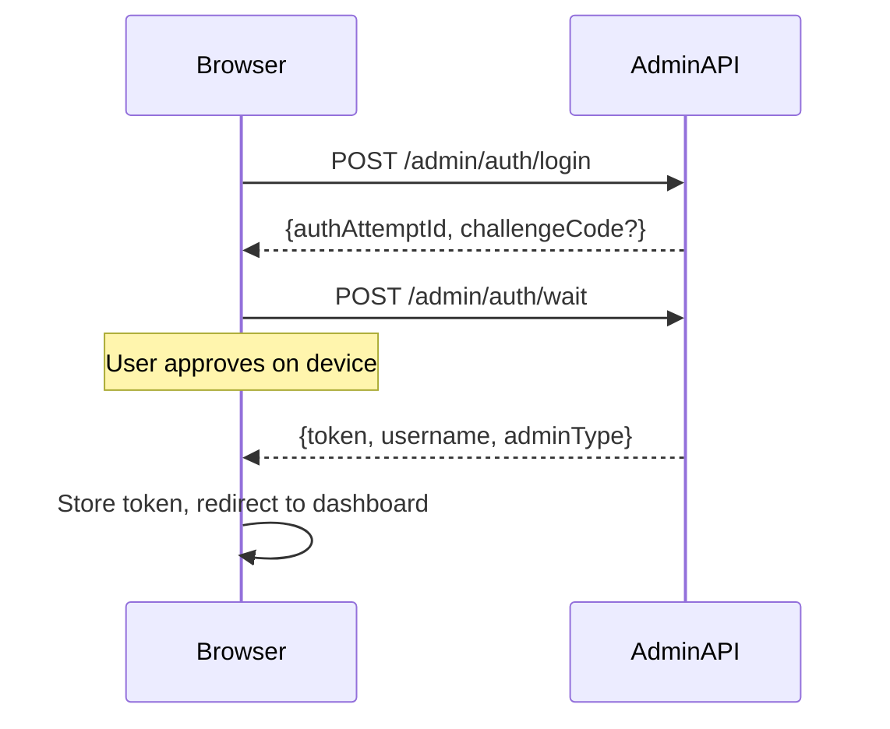

# EZKey Demo App ACME

Demo application showcasing EZKey passwordless login integration.

## Quick Start

### Docker (Recommended)

```bash
# From repo root
./docker/start.sh
# Access: http://localhost:8082
```

### IDE / Local

```bash
cd ezkey-demo-app-acme
mvn spring-boot:run
# Requires Admin API running on localhost:9080
```

## URLs

| Service | URL |
|---------|-----|
| Demo App | http://localhost:8082 |
| Login Page | http://localhost:8082/login |
| Dashboard | http://localhost:8082/dashboard |

## Login Flow



## Configuration

| Property | Default | Description |
|----------|---------|-------------|
| `ezkey.admin.api.url` | `http://localhost:9080` | Admin API URL for login calls |
| `ezkey.login.mode` | `frontend` | Login mode (frontend only for now) |

## Key Files

- `HomeController.java` - Routes for login/dashboard/logout
- `static/js/ezkey-login.js` - Frontend login logic
- `templates/login.html` - Login page
- `templates/dashboard.html` - Post-login dashboard
