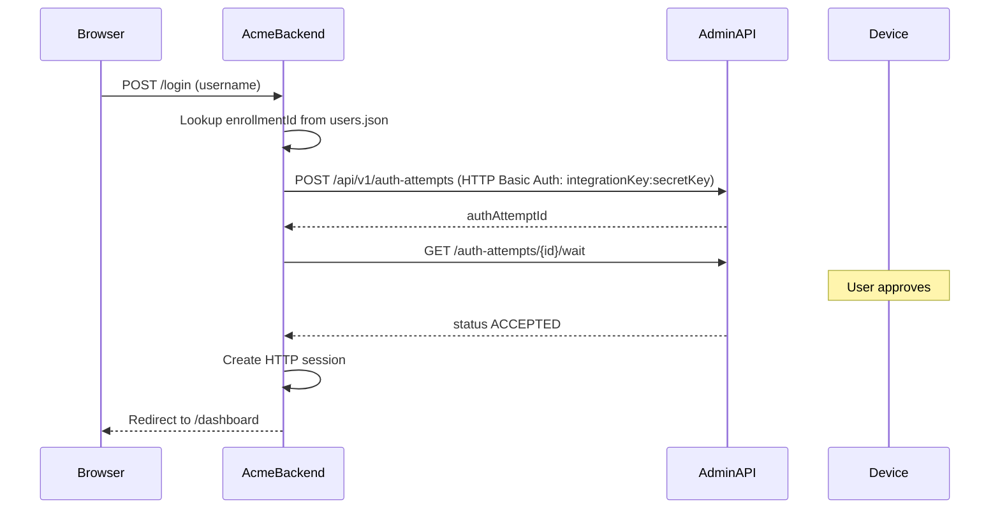

# EZKey Demo App ACME

Demo application showcasing EZKey passwordless login integration with backend-side authentication.

## Quick Start

### Docker (Recommended)

```bash
# From repo root
./docker/start.sh
# Access: http://localhost:8082

# API key credentials: set via config or use "Configure API Key" dialog on login page
export EZKEY_INTEGRATION_KEY=ezkey_ikey_xxx
export EZKEY_SECRET_KEY=ezkey_skey_xxx

# Ensure users mapping file exists:
# data/acme-users.json
```

For the internet-facing demo mode, the login page also supports entering the integration key and
secret interactively. Those credentials are stored only for the current browser session and can be
reused across multiple login/logout cycles in that same session.

### IDE / Local

```bash
cd ezkey-demo-app-acme
mvn spring-boot:run
# Requires Admin API running on localhost:9080
# Requires EZKEY_INTEGRATION_KEY and EZKEY_SECRET_KEY environment variables
# Requires data/acme-users.json file
```

## URLs

| Service | URL |
|---------|-----|
| Demo App | http://localhost:8082 |
| Login Page | http://localhost:8082/login |
| Dashboard | http://localhost:8082/dashboard |

## Login Flow



## Configuration

### External Configuration Override

Spring Boot supports external configuration files that override JAR-internal properties:

- **Docker**: Place `application.properties` in `/app/config/` (mounted volume)
- **Local**: Place `application.properties` in `./config/` directory next to the JAR

Properties can be hot-reloaded via Actuator `/refresh` endpoint:
```bash
curl -X POST http://localhost:8082/actuator/refresh
```

### Configuration Properties

| Property | Default | Description |
|----------|---------|-------------|
| `ezkey.admin.api.url` | `http://localhost:9080` | Admin API URL (use `http://admin-api:9080` in Docker) |
| `ezkey.integration.key` | (required) | Integration key for API key authentication (e.g., `ezkey_ikey_xxx`) |
| `ezkey.secret.key` | (required) | Secret key for API key authentication (e.g., `ezkey_skey_xxx`) |
| `ezkey.users.file` | `data/acme-users.json` | Path to users mapping file |
| `ezkey.users.file.check-interval` | `5` | Hot-reload check interval in seconds (0 to disable) |

**Authentication Format**: `Authorization: Basic base64(integrationKey:secretKey)`

## Demo Session Model

- API key credentials entered in the UI are scoped to the current browser session only.
- Logging out clears the authenticated demo user and pending auth flow state, but keeps the demo
  API key available for the next login attempt in that same browser session.
- A different browser or browser profile does not inherit another session's demo API key.
- Session expiry or losing the browser session can require re-entering the API key.

## Users Mapping File

Create `data/acme-users.json`:

```json
{
  "users": [
    {
      "username": "alice",
      "enrollmentId": 1,
      "displayName": "Alice Demo"
    },
    {
      "username": "bob",
      "enrollmentId": 2,
      "displayName": "Bob Test"
    }
  ]
}
```

The file is hot-reloadable - changes are detected and reloaded automatically (if `check-interval > 0`).

## Key Files

- `controller/LoginController.java` - Handles POST `/login`, coordinates auth flow
- `controller/HomeController.java` - Routes for dashboard/logout
- `config/EzkeyClientProvider.java` - Supplies EzkeyClient from current credentials
- `service/DemoApiKeyConfigService.java` - API key holder with runtime override support
- `service/UserMappingService.java` - Users file loader with hot-reload
- `config/EzkeyClientConfig.java` - Spring configuration
- `templates/login.html` - Login page with "Configure API Key" dialog
- `templates/dashboard.html` - Post-login dashboard

## Architecture

- **Backend-side authentication**: Server calls Admin API using API key (machine-to-machine) authentication
- **HTTP session**: Secure server-side session management
- **Session-scoped demo credentials**: API keys entered in the UI are isolated per browser session
- **User mapping**: External JSON file maps usernames to enrollment IDs
- **Hot-reload**: Users file changes detected and reloaded automatically

## Prerequisites

1. **API Key Credentials**: Must be created via Admin API for the ACME integration:
   - `integrationKey`: Public key (e.g., `ezkey_ikey_xxx`) - used as HTTP Basic Auth username
   - `secretKey`: Secret key (e.g., `ezkey_skey_xxx`) - used as HTTP Basic Auth password
   - Set via `EZKEY_INTEGRATION_KEY` and `EZKEY_SECRET_KEY` env vars, config file, or **"Configure API Key" dialog** on login page (no restart)
2. **Users File**: Automatically created by bootstrap-init with `admin.docker` user (enrollmentId: 1)
3. **Enrollments**: Users must have active enrollments in EZKey system

## Docker Setup

The Docker stack automatically:
- Creates `acme-users.json` with `admin.docker` user via bootstrap-init
- Mounts `/app/config/` volume for external `application.properties` override
- Mounts `/app/data/` volume for `acme-users.json` file

### Editing Configuration in Docker Desktop

1. **API Keys**: Use "Configure API Key" dialog on login page (no restart), or edit `/app/config/application.properties` and restart
2. **Users Mapping**: Edit `/app/data/acme-users.json` → Auto-reloaded every 5 seconds or click "Reload Users"

## Future Enhancements

- Bootstrap-init integration to automatically create API key and seed users file
- Multiple integration support
- User self-registration flow