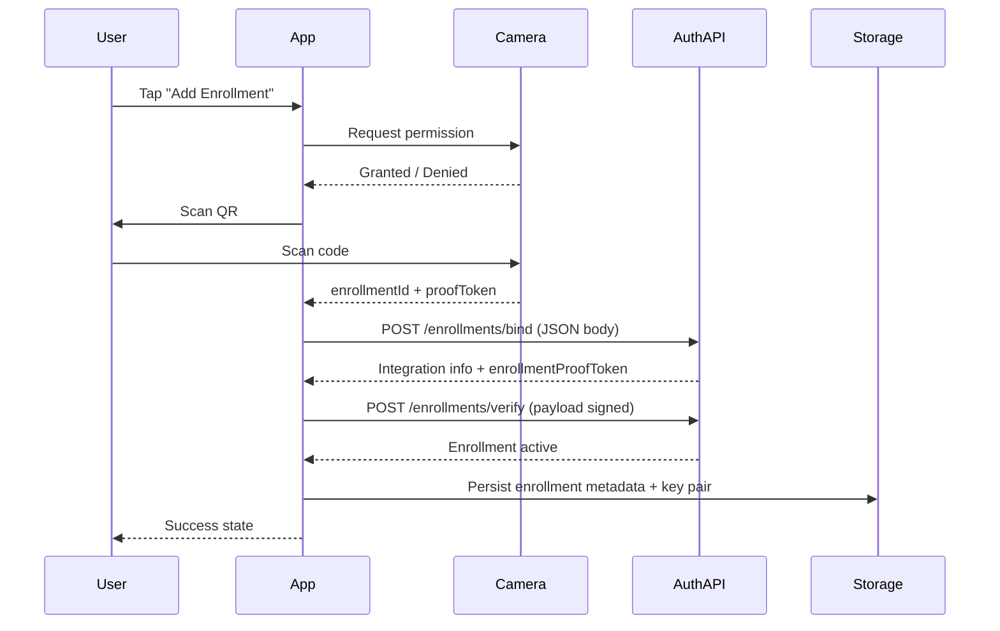
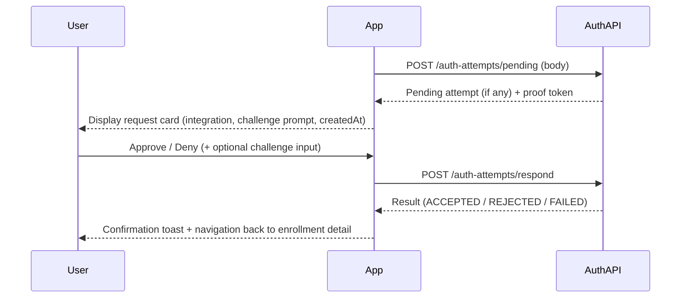

# Ezkey Mobile App – Product Requirements Document (PRD)

## 1. Vision & Context

### Background
Ezkey already provides a self-hosted, cryptographic MFA platform with documented admin and auth APIs (`admin-api/openapi-spec.json`, `auth-api/openapi-spec.json`). A Kotlin demo app (`v1/`) demonstrates the enrollment and authentication flows, but it is not production ready and does not cover key UX cases for end users.

### Vision Statement
Deliver a cross-platform (iOS + Android) React Native mobile application that makes Ezkey enrollments and authentication approvals effortless for end users, while showcasing the Ezkey platform for prospective adopters.

### Key Objectives
- Manage multiple Ezkey enrollments on-device with a polished UX.
- Handle the entire enrollment flow from QR scan to activation using the existing Auth API and an initial hard-coded ngrok base URL (`https://goateed-katalina-monsoonal.ngrok-free.dev`).
- Surface pending authentication attempts in real time and let the user approve or deny securely.
- Persist enrollment data locally so the app is functional across restarts and without constant network access.
- Provide a publish-ready codebase that respects platform guidelines and privacy expectations.

### Constraints & Assumptions
- Device authentication (PIN/biometric) is out-of-scope for the first iteration but must remain extensible.
- Push notifications are out-of-scope; polling and in-app refresh cover pending auth attempts.
- The ngrok URL may change; it must be isolated behind configuration to swap environments quickly.
- Integration logo has been removed from the platform; the app does not display or store logos.
- The app targets a single Ezkey instance at a time; multi-instance or environment switching is explicitly out of scope for v1.
- The mobile client interacts only with the Auth API; any admin-facing capabilities (metadata, deletion) remain server-side concerns.

### Design Decisions (Resolved)
1. **CLI/Admin sharing** – No shared design system deliverables are required; mobile consumes only Auth API resources.
2. **Enrollment entry** – QR code scanning is the sole enrollment entry point for v1.
3. **Help & education** – No in-app help center; outbound links may be added post-v1.
4. **Pending checks** – Absolutely no background polling; the user must deliberately trigger each pending check.
5. **Offline feedback** – Backend outages surface as toast notifications; no persistent banners for v1.
6. **Displayed metadata** – UI shows only what is required for enrollment/authentication (name, challenge info).
7. **Operational docs** – No shared documentation or credentials distribution is needed (single maintainer scenario).
8. **Mocking** – No mock mode; the app always talks to real endpoints.
9. **Destructive actions** – Enrollment deletion, reset, or destructive flows are deferred; v1 provides read-only management.
10. **Localization** – English-only runtime; no live locale switching.
11. **Data retention** – Local activity snapshots purge after 30 days; no additional compliance hooks required.
12. **Analytics** – No telemetry/analytics collection in v1; keep implementation minimal.

## 2. Target Users & Personas

- **End User (Primary)**: Employees or customers who need to approve authentication requests. Non-technical, expects quick trust signals (integration name) before acting.
- **Security/IT Administrator (Secondary)**: Technical stakeholder testing the Ezkey experience before wide rollout. Needs confidence that flows follow the documented protocol.
- **Developer Advocate / Demo Operator (Secondary)**: Uses the app in demos to showcase Ezkey capabilities.

## 3. High-Level Experience

```mermaid
flowchart TD
    A[Launch App] --> B{Cached enrollments?}
    B -->|No| C[Empty State CTA<br/>"Add Enrollment"]
    C --> D[QR Scan Flow]
    B -->|Yes| E[Home: Enrollment List]
    E --> F[Tap Enrollment]
    F --> G{Pending Auth?}
    G -->|Yes| H[Review Request Screen]
    G -->|No| I[Enrollment Detail]
    H --> J{User Decision}
    J -->|Approve| K[Send Approve]
    J -->|Deny| L[Send Deny]
    K --> M[Confirmation]
    L --> M
    M --> E
```

## 4. Core User Journeys

### 4.1 Enrollment Creation via QR



### 4.2 Handling Pending Authentication Attempt



## 5. Functional Requirements

### 5.1 Home – Enrollment List
- Displays all stored enrollments sorted by `favorited` flag then `createdAt`.
- Each list item shows integration name, tenant/app label, and status badge.
- Cards expose quick actions: `View` and `Check pending` (manual trigger only).
- Empty state conveys CTA to add first enrollment and links to Ezkey docs.
- Pull-to-refresh simply refreshes the locally cached state; no remote sync is attempted automatically.

### 5.2 Enrollment Detail
- Presents enrollment metadata (integration name, description, tenant, created on, last activity).
- `Check pending` button requests `POST /auth-attempts/pending` with the stored enrollment payload (ID + proof tokens) and routes to the request screen when data is returned.
- `See history` placeholder section (non-functional for MVP, but layout reserved).
- No destructive actions (delete/reset) are presented in v1.

### 5.3 Add Enrollment Flow
- Accessible from floating action button and empty state CTA.
- Guides through permission rationale (camera usage) before invoking scanner.
- QR parsing supports `enrollmentId` and `proofToken` in JSON or query-string format (same schema as Kotlin demo), which are passed in the POST `/enrollments/bind` payload.
- Generates/signs device key pair as per Ezkey documentation, stores private key securely (Keychain on iOS, EncryptedSharedPreferences on Android via native modules).
- Handles errors with actionable copy (invalid QR, API failure, network down).

### 5.4 Pending Authentication Screen
- Displays integration branding, request timestamp, location and device info if provided by API payload, challenge prompt input if `challengeRequired=true`.
- Contains approve/deny buttons with primary emphasis on `Approve` when allowed; both actions require explicit confirmation.
- Shows spinner while awaiting API response; handles error states with retry option.
- After submission, returns to enrollment detail with toast summarizing action.

### 5.5 Local Storage & State Sync
- Persisted attributes per enrollment: `enrollmentId`, `integrationId`, `integrationName`, `tenantName`, `publicKey`, `privateKeyRef`, `createdAt`, `lastSyncedAt`.
- Uses device-secure storage for private key reference (`react-native-keychain` or custom native module) and AsyncStorage/SQLite for metadata.
- Background sync relies solely on user-triggered refreshes; no automated polling or admin metadata fetch occurs.
- Enrollment activity snapshots (challenge outcomes, timestamps) are cached locally for convenience and automatically purged after 30 days; this does not affect server-side audit logs or compliance records.

## 6. Technical Requirements

### 6.1 API Integration
- Base URL defaults to `https://goateed-katalina-monsoonal.ngrok-free.dev`; expose `.env` support for overrides without rebuilding.
- Endpoints consumed:
  - `POST /api/v1/enrollments/bind` (body includes `enrollmentId` + `proofToken` from QR to mitigate enumeration attacks)
  - `POST /api/v1/enrollments/verify`
  - `POST /api/v1/auth-attempts/pending` (body includes enrollment/device proof to avoid path-based enumeration)
  - `POST /api/v1/auth-attempts/respond`
- Requests follow cryptographic expectations defined in `docs/CRYPTO.md`: EC P-256 (secp256r1) key pairs, ECDSA-SHA256 signatures, PKCS#8/X.509 key formats.
- Conservative networking stack: Axios (REST), exponential backoff, TLS pinning placeholder for future.

### 6.2 Permissions & Native Integrations
- Camera permission request with rationale, fallbacks for denial (manual code entry placeholder).
- Use `react-native-vision-camera` or nearest maintained library for QR scanning.
- For secure storage, prefer native modules to expose Keychain/Keystore.

### 6.3 State Management & Architecture
- React Query for server data fetching and caching.
- Zustand or Redux Toolkit for global UI/application state (selected enrollment, modals).
- TypeScript-first approach with generated API typings from OpenAPI specs (narrow scope to required endpoints for MVP).

### 6.4 Error Handling & Observability
- Centralized error boundary with user-friendly fallback message.
- Analytics events queued locally (no external service for MVP, but instrumentation hooks ready).
- Logging toggles via debug menu (`__DEV__` build only) to avoid leaking secrets.

## 7. Non-Functional Requirements
- **Performance**: Enrollment list renders < 100ms with up to 50 enrollments. API calls time out after 10s with user feedback.
- **Security**: No sensitive tokens stored in plain AsyncStorage; clear data on sign-out (future feature) and provide “reset app” debug action.
- **Reliability**: Retry policies for network operations (3 attempts with exponential backoff). App gracefully handles offline state with banners and cached data.
- **Accessibility**: WCAG AA color contrast, VoiceOver/TalkBack labels, dynamic font size support.
- **Localization**: English-only copy for MVP; text centralized in message catalog for future translations.
- **Telemetry**: Minimal local event log for QA builds; production builds omit verbose logs.

## 8. Success Metrics
- Time to complete first enrollment < 90 seconds for a new user.
- Approve/deny flow success rate > 95% without manual retries during user testing.
- Crash-free users > 99% in TestFlight/Internal testing.
- Positive qualitative feedback from 3 pilot administrators.

## 9. Dependencies & Tooling
- React Native 0.76+, TypeScript, React Navigation 7, React Query 5.
- `react-native-vision-camera` (QR), `react-native-permissions`, `@react-native-async-storage/async-storage`, secure storage module.
- Node.js LTS (20.x) and Yarn 4/Berry.
- Fastlane (build automation) in later phase.

## 10. Risks & Mitigations
- **Changing ngrok endpoint** – Abstract base URL in config and support remote override.
- **API evolution** – Track OpenAPI specs in repo; add smoke tests verifying contract on CI.
- **Secure storage limitations** – Provide fallback to encrypted file keystore with clear warnings if secure storage unavailable.
- **Camera permission denial** – Offer manual enrollment code entry as contingency in subsequent iteration (logged as backlog feature).
- **QR format drift** – Maintain compatibility layer and document expected schema in README.

## 11. Release Strategy

| Milestone | Scope | Deliverables | Exit Criteria |
|-----------|-------|--------------|----------------|
| **Sprint 1 – Foundations** | Project scaffolding, design system tokens, API client, local storage service, mocked data screens. | Running app with fake data and navigation skeleton. | QA walkthrough of navigation and state persistence with mock data. |
| **Sprint 2 – Enrollment Flow** | QR scanning, enrollment API integration, key management. | End-to-end enrollment success using ngrok base URL. | Two manual test cases (happy path + failure) pass on iOS and Android. |
| **Sprint 3 – Auth Handling** | Pending auth polling, respond screen, local history. | Approve/deny requests working against Ezkey sandbox. | Demo script recorded, acceptance tests scripted. |
| **Sprint 4 – Polish & Beta** | Error handling, accessibility, theming, documentation, release builds. | TestFlight/internal APK distributed, README/PRD/plan updated. | Pilot sign-off and go/no-go review completed. |

## 12. Outstanding Questions
- _None for v1._ All previously tracked questions are resolved in the Design Decisions section above.

---

**Document version**: 0.1 (November 2025)
**Owners**: Mobile squad @ Ezkey
**Next review**: December 2025
