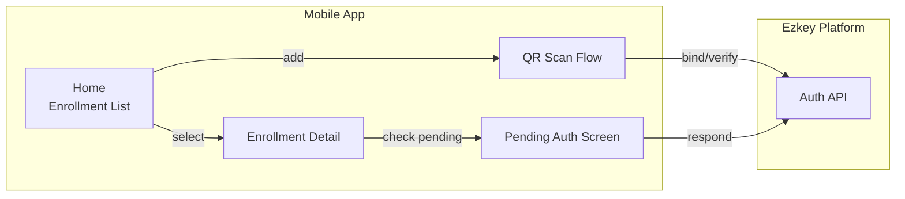
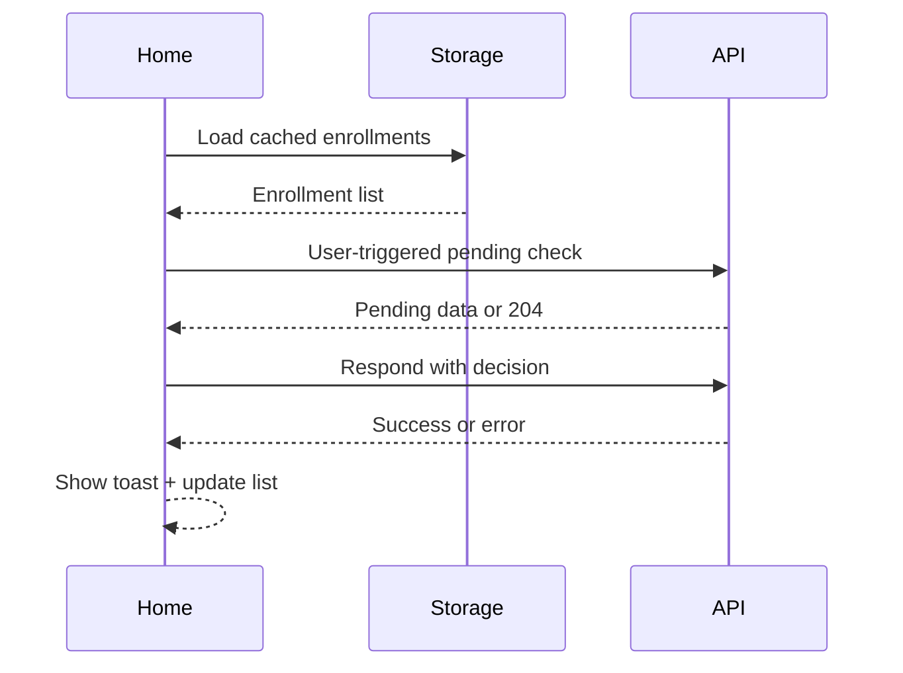

# Ezkey Mobile App (React Native)

> Cross-platform companion app for enrolling devices and handling authentication challenges in the Ezkey MFA ecosystem.

## Project Snapshot

- **Platforms**: iOS 15+/Android 8+ via React Native 0.76+
- **Core Flows**: Enrollment via QR, stored enrollment management, pending authentication approvals, denial handling, and challenge responses
- **APIs**: Ezkey Auth API (`auth-api/openapi-spec.json`) via a conservative REST client
- **Initial Environment**: `https://goateed-katalina-monsoonal.ngrok-free.dev` (configurable)
- **Instance Scope**: Targets one Ezkey environment at a time; multi-instance switching is out of scope for MVP.



## Features (MVP)

- Manage multiple enrollments with cached metadata captured at enrollment time (no post-enrollment refresh)
- Guided “Add enrollment” wizard with camera permission handling and QR scanning
- End-to-end enrollment activation using Ezkey cryptographic flow (RSA-2048, SHA-256 signatures)
- Manual, user-triggered polling of pending authentication attempts plus approval/denial UI with challenge input
- Toast feedback when the Auth API cannot be reached
- Secure storage of private keys (Keychain/Keystore) and local metadata persistence (AsyncStorage/SQLite)
- Debug tools: base URL override, clear local data, verbose logging in development builds

## Tech Stack & Key Dependencies

- React Native 0.76+, TypeScript, React Navigation 7 (stack/tab), React Query 5 for API access
- `react-native-vision-camera` or equivalent QR module, `react-native-permissions`, `@react-native-async-storage/async-storage`
- Secure storage abstraction (e.g., `react-native-keychain` + native modules for RSA keypair generation)
- Jest + React Native Testing Library + Detox (optional) for automated coverage

## Repository Layout (proposed)

```
ezkey-mobile/
├── app/
│   ├── components/
│   ├── hooks/
│   ├── navigation/
│   ├── screens/
│   │   ├── Home/
│   │   ├── EnrollmentDetail/
│   │   ├── EnrollmentWizard/
│   │   └── PendingAuth/
│   ├── services/
│   │   ├── api/
│   │   ├── crypto/
│   │   └── storage/
│   └── state/
├── ios/
├── android/
├── docs/
│   ├── PRD.md
│   ├── plan.md
│   └── design/
├── scripts/
└── package.json
```

## Getting Started

### 1. Prerequisites
- Node.js 20 LTS, Yarn 4 (Berry)
- Xcode 15.x (macOS) and Android Studio Giraffe+ with Android SDK 34
- Watchman (macOS), JDK 17+, CocoaPods 1.15+
- Access to the Ezkey Auth API; default base URL uses the provided ngrok endpoint

### 2. Installation
```bash
yarn install
```

### 3. Environment Configuration
Create `.env` from `.env.example`:
```
EZKEY_API_BASE_URL=https://goateed-katalina-monsoonal.ngrok-free.dev
EZKEY_REQUEST_TIMEOUT=10000
```

### 4. Running the App
```bash
# iOS
yarn ios

# Android (emulator or device)
yarn android

# Metro server only
yarn start
```

### 5. Testing & Linting
```bash
yarn test              # unit + component tests
yarn lint              # eslint + typescript
yarn typecheck         # tsc --noEmit
yarn detox:test        # optional e2e in CI
```

## Core Flows

### Enrollment
1. User taps `Add enrollment`
2. App requests camera permission and opens QR scanner
3. QR provides `enrollmentId` + `proofToken`
4. App posts to `POST /api/v1/enrollments/bind` (body includes the QR payload) to retrieve integration metadata + enrollment proof token
5. Generates RSA key pair, stores private key securely, and POSTs `verify`
6. On success, app saves enrollment locally and surfaces confirmation screen

### Pending Authentication
1. User opens enrollment detail and taps `Check pending`
2. App posts to `POST /api/v1/auth-attempts/pending` (payload carries enrollment + device proofs)
3. If a pending attempt exists, show request card with challenge input when required
4. User approves or denies; app sends `POST /api/v1/auth-attempts/respond`
5. App displays success or error feedback (toast on failure/offline) and navigates back

## API Contract (minimum surface)

- `POST /api/v1/enrollments/bind` *(body: `enrollmentId`, `proofToken`; hides identifiers from URL to prevent enumeration)*
- `POST /api/v1/enrollments/verify`
- `POST /api/v1/auth-attempts/pending` *(body: enrollmentId, enrollmentProofToken, deviceProofToken, deviceProofTokenSigned)*
    - `POST /api/v1/auth-attempts/respond`

All payload shapes mirror the Kotlin reference implementation in `v1/enrollment/EnrollmentService.kt` and `v1/auth/AuthService.kt`.

## Security & Privacy Checklist

- Private keys never leave device; store reference only
- AsyncStorage used for non-sensitive metadata; secure storage for secrets
- Clear data option in debug builds; production adds factory reset via settings screen later
- TLS enforcement, request timeouts (10s), exponential backoff (1s → 8s)
- No analytics SDKs in MVP; instrumentation hooks for later
- Local enrollment activity snapshots are cached for 30 days and auto-purged without impacting server-side auditing

## Development Guidelines

- TypeScript everywhere; enable strict compiler options
- Folder-by-feature organization for screens and services
    - React Query mutations handle API interactions; all mutations map directly to live API calls (no mocks)
- Follow Ezkey design tokens (to be defined) for colors, typography, spacing
- Unit tests for hooks/services, component tests for major screens, optional Detox happy path scenario



## Next Steps

1. Finalize wireframes and component inventory
2. Scaffold React Native project with tooling (EAS/Expo or bare RN decision pending)
3. Implement secure storage native bridge and cryptography helpers
4. Integrate enrollment flow end-to-end using sandbox environment
5. Build pending auth flow and finalize error copy
6. Prepare release checklist (app icons, splash screens, store assets)

## Reference Materials

- `PRD.md` – full product requirements
- `plan.md` – roadmap, milestones, open issues
- `auth-api/openapi-spec.json` – API contract
- `v1/` Kotlin demo – canonical example for crypto & payload structure

---

Maintainers: Ezkey Mobile Squad – November 2025
