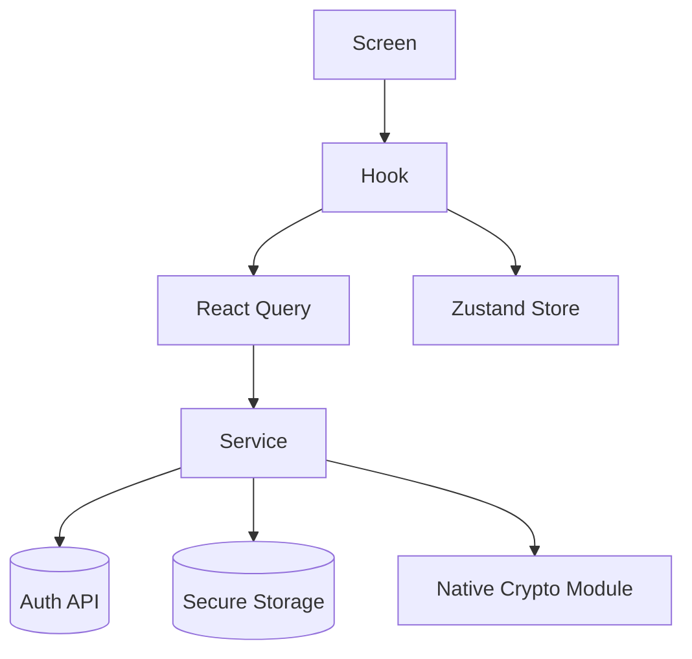

<!--
  Ezkey - Open Source Cryptographic MFA Platform
  Copyright (c) 2025 Ezkey contributors
  Licensed under the MIT License. See LICENSE file in the project root for full license information.
-->

# Ezkey Mobile Architecture

> High-level reference for the React Native mobile client, created to keep UI, state management, and native integrations aligned with current Ezkey backend conventions.

## Context

- **Platform**: React Native 0.76.0 targeting iOS 15+ and Android 8+
- **Language**: TypeScript with strict compiler options
- **Security references**:
  - [`docs/CRYPTO.md`](../../docs/CRYPTO.md) - canonical cryptographic wording and current guarantees
  - [`docs/features/AUTH_SECURITY.md`](../../docs/features/AUTH_SECURITY.md) - polling and proof-token safeguards
  - [`docs/ENDPOINT.md`](../../docs/ENDPOINT.md) - REST contract used by the mobile app

## Layer Overview

| Layer | Responsibility | Key directories |
| --- | --- | --- |
| Presentation | Screens, components, navigation, theming | `app/screens`, `app/components`, `app/navigation` |
| State and Hooks | Query caching, local state, storage orchestration | `app/hooks`, `app/state` |
| Services | API clients, crypto adapters, storage facades | `app/services/api`, `app/services/crypto`, `app/services/storage` |
| Native modules | Platform crypto bridge and QR frame processing | `android/app/src/main/java/com/ezkeymobile`, `ios/EzkeyMobile` |

## React Native Flow

- Screens call hooks which in turn use React Query for network calls and Zustand for UI state.
- API services wrap Axios with consistent headers, timeouts, and error handling.
- Crypto services require native modules; there is no production mock fallback.
- In the current Android implementation, EC P-256 enrollment keys are generated through `Android Keystore`, with `StrongBox` requested when available.
- Enrollment metadata is stored separately from sensitive proof-token material.

## Feature Breakdown

### Enrollment Wizard (`app/screens/EnrollmentWizard`)

Presentation uses a single scrollable flow: **Scan** (QR + bind) and **Verify** (6-digit challenge + enrollment summary) appear in one screen after bind succeeds; the protocol sequence below is unchanged.

1. Requests camera permission and launches `EnrollmentScannerModal`.
2. Parses QR payloads while validating proof-token structure.
3. Calls `enrollmentsApi.bind` to fetch integration metadata.
4. Ensures an enrollment key pair exists with `cryptoService.ensureEnrollmentKeyPair(enrollmentId)`.
5. Retrieves the enrollment public key through the native crypto bridge.
6. Completes verification through `enrollmentsApi.verify` and persists enrollment metadata with `enrollmentStorage`.

Security alignment:

- Proof tokens are handled in memory or secure storage only.
- Challenge enforcement follows the API contract and remains user-driven.

### Pending Authentication (`app/screens/PendingAuth`)

1. Ensures the enrollment key pair exists before polling.
2. Builds device proof tokens per poll to reduce replay risk.
3. Submits ECDSA-SHA256 signatures generated by `cryptoService.sign(enrollmentId, payload)`.
4. Responds with the user's decision while respecting challenge requirements.

Security alignment:

- Polling is user-initiated only, following the pull model described in [`docs/features/AUTH_SECURITY.md`](../../docs/features/AUTH_SECURITY.md).
- Mobile wording should not imply FIDO2/WebAuthn or attestation guarantees.

### Home and Enrollment Detail (`app/screens/Home`, `app/screens/EnrollmentDetail`)

- Provide entry points to the wizard and pending-auth flows.
- Use Zustand to share the selected enrollment across navigation.
- Remove enrollment metadata separately from native key material when clearing device state.

## Cross-Cutting Concerns

- **Error handling**: `httpClient` centralizes Axios interceptors; UI layers map server errors to actionable alerts.
- **Logging**: Development builds prefer `console.warn` / `console.error` to surface non-fatal issues; production logging remains a separate concern.
- **Localization**: Mobile UI copy is English-only today. The Auth API bind request accepts only `enrollmentId` and `enrollmentProofToken`; integration display strings in the bind response come from the integration record (single locale at the data layer).
- **Accessibility**: Screens rely on React Native primitives for accessible touch targets; platform-specific audits remain outstanding.

## Testing Strategy

- Jest unit tests for hooks and service functions.
- React Native Testing Library for component rendering.
- Detox (optional) for end-to-end validation of enrollment and pending flows.
- Kotlin and iOS native modules should include instrumentation or unit tests as the native paths stabilize.

## Documentation Guardrail

When describing the mobile security model, prefer:

- `Android Keystore`
- `StrongBox when available`
- `private key material is not exposed to application code`

Avoid unqualified claims such as:

- `hardware-backed everywhere`
- `Secure Enclave parity`
- `passkey-equivalent security`

For current guarantees and wording, defer to [`docs/CRYPTO.md`](../../docs/CRYPTO.md).
