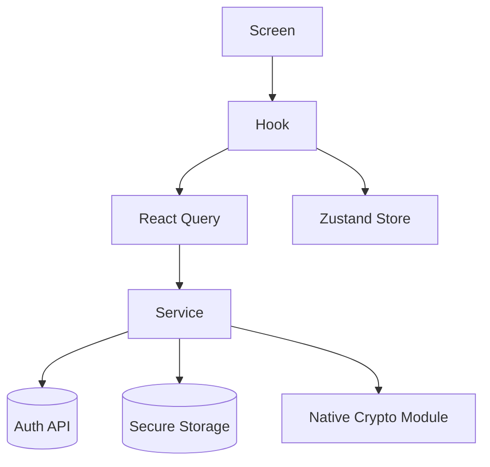

<!--
  Ezkey - Open Source MFA/Passkey Alternative
  Copyright (c) 2025 Ezkey contributors
  Licensed under the MIT License. See LICENSE file in the project root for full license information.
-->

# Ezkey Mobile Architecture

> High-level reference for the React Native mobile client, created to keep UI, state management, and native integrations aligned with Ezkey backend conventions.

## Context

- **Platform**: React Native 0.76 targeting iOS 15+ and Android 8+
- **Language**: TypeScript with strict compiler options
- **Security References**:
  - [`docs/CRYPTO.md`](../../docs/CRYPTO.md) – cryptographic requirements (RSA-2048, SHA256withRSA)
  - [`docs/features/AUTH_SECURITY.md`](../../docs/features/AUTH_SECURITY.md) – polling and proof-token safeguards
  - [`docs/ENDPOINT.md`](../../docs/ENDPOINT.md) – REST contract used by the mobile app

## Layer Overview

| Layer | Responsibility | Key Directories |
|-------|----------------|-----------------|
| Presentation | Screens, components, navigation, theming | `app/screens`, `app/components`, `app/navigation` |
| State & Hooks | Query caching, local state, storage orchestration | `app/hooks`, `app/state` |
| Services | API clients, crypto adapters, storage facades | `app/services/api`, `app/services/crypto`, `app/services/storage` |
| Native Modules | RSA key management, QR frame processing | `android/app/src/main/java/com/ezkeymobile`, `ios/EzkeyMobile` |

## React Native Flow

- Screens call hooks which in turn use React Query for network calls and Zustand for UI state.
- API services wrap Axios with consistent headers, timeouts, and error handling.
- Crypto services prefer native modules and fall back to mocks only during development.
- Storage separates sensitive device aliases (secure storage) from metadata (AsyncStorage).

## Feature Breakdown

### Enrollment Wizard (`app/screens/EnrollmentWizard`)

1. Requests camera permission and launches `EnrollmentScannerModal`.
2. Parses QR payloads via `parseQrPayload` while validating proof token structure.
3. Calls `enrollmentsApi.bind` to fetch integration metadata.
4. Generates RSA keys with `cryptoService.ensureKeyPair`.
5. Completes verification through `enrollmentsApi.verify` and persists records with `enrollmentStorage`.

Security Alignment:
- Proof tokens are read once and never cached in plaintext outside secure storage.
- Challenge enforcement aligns with the Admin API guidance on forced user interaction.

### Pending Authentication (`app/screens/PendingAuth`)

1. Loads secure device alias via `useSecureEnrollmentInfo`.
2. Builds device proof tokens per poll to prevent replay.
3. Submits signatures generated by `cryptoService.sign`.
4. Responds with decision, respecting challenge requirements.

Security Alignment:
- Polling is user-initiated only, following the pull model described in [`docs/features/AUTH_SECURITY.md`](../../docs/features/AUTH_SECURITY.md).
- Read-once semantics are retained by memoising the last seen proof token.

### Home + Enrollment Detail (`app/screens/Home`, `app/screens/EnrollmentDetail`)

- Provide entry points to the wizard and pending-auth flows.
- Use Zustand to share the selected enrollment across navigation.
- Invoke secure deletion that removes both metadata and native key pairs.

## Cross-Cutting Concerns

- **Error Handling**: `httpClient` centralises Axios interceptors; UI layers map server errors to actionable alerts.
- **Logging**: Development builds prefer `console.warn`/`console.error` to surface non-fatal issues; production builds should aggregate logs via platform-specific telemetry.
- **Localization**: Wizard defaults to English (`language: 'en'`), but API payloads accept locale overrides.
- **Accessibility**: Screens rely on React Native primitives for accessible touch targets; platform-specific audits remain outstanding.

## Testing Strategy

- Jest unit tests for hooks (`__tests__/`) and service functions.
- React Native Testing Library for component rendering.
- Detox (optional) for end-to-end validation of the enrollment + pending flows.
- Kotlin/iOS native modules should include instrumentation or unit tests once CI infrastructure is ready.

## Future Enhancements

- Expand theming to align with the shared Ezkey design tokens when available.

@since 2025

