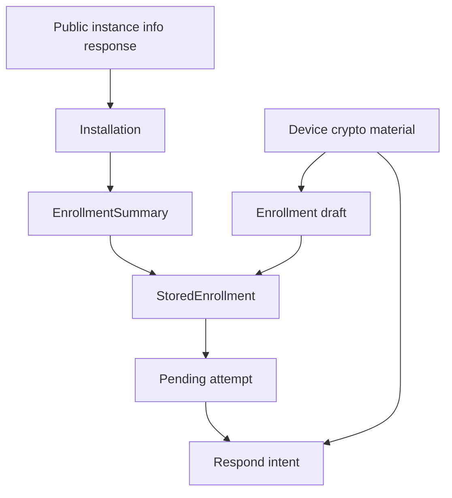

# Ezkey Mobile Data Model

## Purpose and Reading Scope

This document describes the conceptual entities used by the React Native reference app, the split between
persisted metadata and security-sensitive material, and the source-of-truth rules that keep the local model honest.
It is anchored on `app/services/api/types.ts`, `app/services/storage/enrollmentStorage.ts`, `app/hooks/useEnrollments.ts`,
and the screen/service code paths that move data across enrollment and authentication.

This document does not replace the canonical Auth API DTO definitions. It explains how the mobile app interprets,
persists, derives, and displays those values locally.

## Concept Inventory

| Concept | Purpose | Source | Persisted | Sensitive |
| --- | --- | --- | --- | --- |
| `PublicInstanceInfoResponse` | Public installation branding metadata from Auth API | `instanceInfoApi.get(...)` | Indirectly, after normalization into installation summary fields | No |
| `Installation` | Local **trust zone** for one Ezkey site (identity = normalized Auth URL) | Derived from normalized `authUrl`; optional `instance-info` enriches display only | Yes, nested inside each enrollment record (pragmatic packaging) | No |
| `EnrollmentSummary` | Core local view of an enrolled device that **belongs to** one installation | Local mobile contract layer in `app/services/api/types.ts` | Yes | Mostly no |
| `StoredEnrollment` | Runtime enrollment record used by Home, Detail, and auth flows | `EnrollmentSummary` plus secure proof-token material and integration verification metadata | Yes, after secure rehydration | Yes, because it contains `enrollmentProofToken` and `integrationPublicKey` |
| Enrollment draft | Temporary bind-stage object before enrollment is verified | Enrollment Wizard bind response mapping | No | Yes |
| Pending attempt | In-memory auth attempt returned by `pending` | Pending Authentication screen | No | Yes |
| Respond intent | User decision and optional challenge input before respond submission | Pending Authentication screen | No | Yes |
| Device crypto material | Device key pair, public key, signatures, storage tier | `cryptoService` / native bridge | Public key and derived tier only transiently; private key stays in keystore | Yes |
| Installation grouping model | Home-screen grouping by installation then tenant | `tenantGrouping.ts` | No, derived at render time | No |
| Local activity snapshot | Minimal locally known timestamps or derived status cues | Persisted enrollment timestamps and runtime auth flow state | Partly | No |

## Canonical Entity Map

**Product posture:** an Ezkey **installation** is a trust zone. Every enrollment **belongs to** exactly one
installation. The durable persisted *record* is still `StoredEnrollment` (one row per enrolled device), but that
record is owned by its installation trust zone — installation is not decoration around an enrollment-centric model.

Pragmatic packaging: the app nests `installation` inside each enrollment row rather than maintaining a separate
installation table. That is a storage convenience, not a claim that the installation is conceptually subordinate to
the enrollment lifecycle.

Transient flow state (`EnrollmentDraft`, pending attempt, respond intent) remains in-memory only.

## Installation Trust Zone

`Installation` is the mobile app’s first-class local representation of an Ezkey site / trust zone. Its **identity
anchor is always the normalized Auth API URL** (`normalizeInstallationId` / `validateAuthUrl`). Mutable public
branding from `instance-info` (`name`, `description`, `aboutUrl`) enriches Home and Detail only; it never replaces
URL identity and must never be treated as a cryptographic trust anchor.

There is **no installation UUID**. Uniqueness of a trust zone is the normalization contract (host case, trailing
slash, implicit HTTPS `:443`, distinct non-empty paths). Equivalent normalized URLs are the same installation even
when branding was missing on one enrollment path.

| Field/concept | Meaning | Source | Persisted | Displayed where |
| --- | --- | --- | --- | --- |
| `installation.id` | Canonical trust-zone identifier (= normalized Auth URL) | `normalizeInstallationId(authUrl)` | Yes | Not shown directly |
| `installation.authUrl` | Effective Auth API base URL for the installation | QR payload override or global environment fallback | Yes | Detail screen technical server block |
| `installation.host` | Host component of the effective Auth API URL | Derived from `authUrl` | Yes | Home installation headers, Detail hint |
| `installation.name` | Human-facing installation name | Public instance-info response or host fallback | Yes | Home installation headers, Detail identity zone |
| `installation.description` | Installation description text | Public instance-info response | Yes | Home installation headers, Detail description line |
| `installation.aboutUrl` | About URL for the installation | Public instance-info response | Yes | Not currently displayed in primary flow |
| `installation.lastRefreshedAt` | Timestamp for local metadata freshness | Local refresh process | Yes | Not shown directly |

Display fields may refresh silently when stale. Identity fields (`id`, `authUrl`) stay tied to URL normalization.

## Installation Association Pipeline

Enrollment → installation association is ownership, not optional UI decoration:

1. Resolve the effective `authUrl` from the QR payload override or the configured mobile environment fallback.
2. Normalize that URL with `validateAuthUrl()` / `normalizeInstallationId()` — that value **is** the trust-zone id.
3. Build or hydrate the `Installation` object from the normalized URL plus any cached or freshly fetched public
  instance-info metadata (branding only).
4. Persist the resulting `installation` object inside `StoredEnrollment` (nested packaging).
5. Group Home data by `installation.id`, then by tenant metadata inside each installation.

Invariant: two enrollments with equivalent normalized Auth API URLs belong to the **same** trust zone. Two distinct
normalized URLs are **independent** trust zones and must not encroach on each other (crypto/storage handles are
installation-scoped — MOB-011 / `I-2026-07-20-mobile-installation-scoped-enrollment-identity`, closed 2026-07-23).

**Identity contract (MOB-011 activity 2):** `StoredEnrollment.id` is the installation-scoped local
handle (`deriveLocalEnrollmentId`). Auth API bodies use `StoredEnrollment.enrollmentId` (server
numeric id). Keystore aliases and sealed-secret keys follow the local id so two installations
that both allocate server `enrollment_id = 1` cannot collide.

## Enrollment Summary and Stored Enrollment

`EnrollmentSummary` is the conceptual local model used by the app layer. `StoredEnrollment` extends it with the
proof token and integration verification material needed for later auth flows.

| Aspect | `EnrollmentSummary` | `StoredEnrollment` | Notes |
| --- | --- | --- | --- |
| Identity | `id`, `integrationId` | same | `id` is the installation-scoped local enrollment handle (navigation, storage, Keystore). |
| Integration display | `integrationName` | same | Primary end-user label across Home, Detail, and Pending flows. |
| Tenant grouping | `tenantName`, `tenantId`, `tenantDescription` | same | Supports tenant grouping in Home. |
| Trust-zone ownership | `installation` object | same | Enrollment belongs to this installation; identity = normalized Auth URL. |
| Activity timestamps | `createdAt`, `lastActivityAt` | same | Current app uses these as the minimal durable activity snapshot. |
| Favorites | `favorited` | same | A purely local ordering preference. |
| Server routing | `installation.authUrl` | same | Allows per-installation server targeting. |
| Proof token | absent | `enrollmentProofToken` | Needed for later `pending` requests and rehydrated from secure storage. |
| Integration verification key | absent | `integrationPublicKey` | Needed to verify bind, verify result, pending, and respond result signatures. |
| Device naming | absent | `enrollmentName`, `deviceLabel` | Friendly local display material originating from bind. |
| Backward-compatible alias field | absent | `enrollmentId` | Auth API / DB enrollment id for the trust zone (wire bodies). Required on new saves. |

The practical consequence is simple: only a verified enrollment is persisted as `StoredEnrollment`. Bind-stage data
stays in memory until the verify-result signature passes.

## Enrollment Cryptographic Material and Secure-Storage Split

The mobile app uses a split model: business-friendly metadata lives in AsyncStorage, while the device private key is
kept behind the native keystore path and long-lived enrollment secrets are stored as Android sealed-secret envelopes or
platform secure-storage entries, depending on platform. `StoredEnrollment` is rehydrated at runtime by combining
AsyncStorage metadata with the secure proof token and secure integration verification material needed for later auth
flows.

| Item | Origin | Storage location | Usage | Security note |
| --- | --- | --- | --- | --- |
| Device private key | Generated by `cryptoService.ensureEnrollmentKeyPair(localId)` at verify; pending/respond use `requireEnrollmentKeyPair` (no silent create) | Native keystore / secure hardware path | Used to sign verify, pending, and respond payloads | Alias is installation-scoped local id |
| Device public key | Derived from native key pair | Runtime only during verify | Sent on enrollment verify | Not currently persisted in `StoredEnrollment`. |
| `devicePrivateKeyStorageTier` | Native keystore introspection | Runtime only during verify | Sent on enrollment verify | Informational, client-reported, not server-proven. |
| `enrollmentProofToken` | QR payload / bind response | Android: sealed-secret envelope in AsyncStorage keyed by logical secret name, protected by a per-installation Keystore key (MOB-017). Other platforms: secure-storage entry keyed by enrollment ID. Rehydrated into `StoredEnrollment` at runtime | Used in later `pending` requests | Sensitive enrollment proof material no longer persists in the AsyncStorage enrollment collection in cleartext. |
| `integrationPublicKey` | Bind response | Android: sealed-secret envelope in AsyncStorage keyed by logical secret name, protected by a per-installation Keystore key (MOB-017). Other platforms: secure-storage entry keyed by enrollment ID. Rehydrated into `StoredEnrollment` at runtime | Used for all later integration-signature verification | Long-lived verification material kept out of the AsyncStorage metadata collection to reduce local tampering surface. |
| Bind/result signatures | Bind and verify responses | Runtime only | Trust checks during enrollment | Not persisted. |
| `authAttemptProofToken` | Pending response | Runtime only | Signed during respond | One-time token not persisted. |
| `deviceProofToken` | Locally generated on pending | Runtime only | Signed and sent to `pending` | Fresh proof material for poll cycle. |
| Sealed-secret storage delegate values | Android: AES/GCM envelopes in AsyncStorage protected by a per-installation Keystore key (`ezkey_seal_{installationScopeId}`, MOB-017). Other platforms: Keychain-backed generic password entries | Platform-aware secure storage wrapper | Protects enrollment proof tokens, integration verification keys, and other small local secrets | The enrollment storage class rehydrates those secure values through this delegate at read time. |

The trust boundary to keep in mind is that the enrollment proof token and integration verification material now live in
secure storage, while only lower-sensitivity metadata remains in AsyncStorage, and the device private key remains
off-limits to normal application code.

Important clarification: the current app does **not** use the per-enrollment EC P-256 private key as a master
decryption key for every other enrollment secret. The `Android Keystore` / `StrongBox` path protects the private
signing key, while a separate per-installation Android Keystore AES key (MOB-017) protects sealed-secret envelopes for
`enrollmentProofToken` and `integrationPublicKey` on Android — each installation trust zone gets its own seal key, so
two installations on the same phone never share ciphertext protection. Other platforms continue to use their
secure-storage delegate. Those are complementary protections, not a single per-enrollment "StrongBox unseals all
local app data" design.

## Enrollment Rehydration Outcomes and Local Failure Honesty (MOB-015)

Observed problem: rehydration used to collapse every local failure into a healthy-looking result —
a corrupt collection payload returned an empty list, and a row whose secret was missing or whose
sealed envelope failed to unseal was silently filtered out. Broken storage presented as "no
enrollments", inviting a duplicate enrollment while the real state stayed invisible.

Decision (Grill Me, 2026-07-25): listing is discriminated, and the app maps every internal
technical failure to a single user-facing state — "unusable on this device" — instead of exposing
failure taxonomy to the user.

| Outcome | Meaning | UI consequence |
| --- | --- | --- |
| Healthy enrollment | Metadata plus proof token and integration key fully rehydrated | Normal row; auth flows available |
| Broken enrollment | Metadata readable but a secret is missing or unsealing threw | Row stays visible with an "unusable" treatment and a remove action; no auth actions |
| Collection error | The whole collection payload is unreadable (corrupt JSON) | Dedicated "saved data unusable" state on Home — never the first-use welcome |

Rules that follow from the decision:

- **Fail-open visibility, fail-closed auth.** Broken rows are shown (metadata is display-safe,
  secrets are never exposed), but they can never sign or respond to anything.
- **Internal reasons stay internal.** The per-row reason (`missing_proof_token`,
  `missing_integration_public_key`, `secret_rehydration_failed`) exists for logs, `__DEV__`, and
  tests only; production copy never mentions JSON, keys, or unsealing.
- **Mutations preserve broken rows.** Save, delete, installation-metadata refresh, and
  last-activity updates operate on the raw persisted metadata, so a broken sibling row is never
  silently dropped by an unrelated write.
- **A corrupt collection is kept on disk.** Recovery is the explicit Danger Zone clear-all, not a
  silent auto-wipe.
- **Clear-all is a true local reset.** It deletes per-enrollment keys and secrets, sweeps orphaned
  secret entries (covers the corrupt-collection case), and deletes every per-installation seal key
  (`ezkey_seal_*`, MOB-017) so re-enrollment starts from a fresh seal key — a dead seal key must not
  survive the reset and poison future enrollments.
- **Recovery path is re-enrollment.** The server-side enrollment is untouched by local breakage;
  the user removes the broken row and asks their administrator for a new enrollment QR.

Provenance: mobile protocol security hygiene pass 2, MOB-015 —
[campaign note](../../product-docs/global/hygiene/mobile-protocol-security/2026-07-19-pass-2.md).

## Pending Authentication Attempt Model

The pending auth model is intentionally transient. A pending attempt is displayed only after the app has verified the
integration signature on the canonical pending payload.

| Field/concept | Meaning | Source | Nullable? | Consumer |
| --- | --- | --- | --- | --- |
| `authAttemptId` | Attempt identifier used for respond | `pending` response | No | Pending screen respond submission |
| `authAttemptProofToken` | One-time proof token for respond | `pending` response | No | Pending screen signing logic |
| `authAttemptProofTokenSignedByIntegration` | Integration signature over pending payload | `pending` response | No | Pending screen trust check |
| `challengeRequired` | Whether a 2-digit challenge must be collected | `pending` response | No | Pending screen form logic |
| `integrationName` | Integration label shown in pending UI | Persisted enrollment record | No | Pending screen display |
| `tenantName` | Tenant label for fallback identity display | Persisted enrollment record | Yes | Pending screen display |
| `createdAt` | Local timestamp when the attempt was materialized in UI | Pending screen local state | No | Pending screen result display |
| `contextTitle` | Primary title of the auth request | `pending` response | Yes | Pending screen display |
| `contextMessage` | Descriptive request body | `pending` response | Yes | Pending screen display |

No pending attempt is persisted today. If `pending` returns empty, the screen renders an empty state rather than a
durable local record.

## Authentication Response Intent and Result Model

The response side is split between what the user chooses locally and what the server returns after verification.

| Item | Origin | Sent to API? | Displayed? | Notes |
| --- | --- | --- | --- | --- |
| Approve / deny choice | User action on Pending screen | Yes, as `authAttemptAccepted` | Indirectly, through latest response summary | Primary human decision. |
| 2-digit challenge input | User input on Pending screen | Yes, when present | Yes while editing | Required only when `challengeRequired` is true. |
| Canonical respond payload | Built locally from `authAttemptProofToken` and decision | Signed, not sent raw | No | Device signs this payload. |
| `authAttemptProofTokenSignedByDevice` | Local device signature | Yes | No | Cryptographic proof of the decision. |
| `authAttemptResult` | `respond` response | No further | Yes | Drives the latest approved, rejected, or failed summary. |
| `authAttemptMessage` | `respond` response | No further | Yes in failed summaries or error states | Human-readable server message. |
| `authAttemptProofTokenResultSignedByIntegration` | `respond` response | No further | No | Must verify before the result is trusted. |

The current implementation treats respond results as a volatile latest-response summary on Enrollment Detail, not as durable local history.

## Local Activity and Derived State

The app intentionally keeps local activity modest. It does not pretend to know current server truth beyond what has
been directly observed during a flow.

| Fact/state | Observed or derived | Persistence | UI use | Caveat |
| --- | --- | --- | --- | --- |
| `createdAt` | Observed at local enrollment completion | Yes | Home ordering, Detail meta line | Local completion timestamp, not a full lifecycle audit. |
| `lastActivityAt` | Locally recorded when enrollment is saved | Yes | Detail meta line | Not currently updated for every later auth outcome. |
| Installation freshness | Derived from `installation.lastRefreshedAt` | Yes | Silent refresh logic | Not shown directly. |
| Grouping by installation and tenant | Derived from persisted enrollment metadata | No, render-time only | Home structure | Pure UI derivation. |
| Empty pending state | Observed from `pending` empty result | No | Detail or Pending screen depending on entry path | Not persisted as durable local history. |
| Latest approved / rejected / failed response summary | Observed from trusted `respond` result | No | Enrollment Detail | Volatile only; replaced by the next verified local response. |
| Favorite ordering | Local user preference | Yes | Home ordering | Purely local and non-protocol. |

This is an intentional honesty boundary: the app should show recent local facts, not invent server-side availability,
revocation, or readiness states that it cannot prove.

## Entity Lifecycle and Persistence Rules

| Entity/concept | Created when | Updated when | Cleared when | Notes |
| --- | --- | --- | --- | --- |
| Enrollment draft | Bind response passes algorithm and signature checks | Bind is retried or bind form is rescanned | Wizard cancel, verify completion, or bind reset | Purely in-memory workflow state. |
| `StoredEnrollment` | Verify-result signature passes and save mutation succeeds | Installation metadata refresh, future local edits, favorite changes | Individual delete or clear-all destructive action | Core durable local record. |
| `installation` object | Enrollment save or silent metadata refresh | When branding metadata is stale or incomplete | Enrollment deletion / clear all | Trust zone the enrollment belongs to; nested for packaging; identity is normalized Auth URL. |
| Pending attempt | Pending response passes signature verification | Re-check overwrites it | Empty result, failed state, leaving screen, or new load cycle | In-memory only. |
| Respond intent | User starts entering challenge or taps approve/deny | User edits challenge input or retries | After result or retry cycle | In-memory only. |
| Device key pair | First verify or first later ensure call for that enrollment | Not meaningfully updated in normal flow | Individual delete or clear-all (best-effort `nativeCrypto.deleteKeyPair`); also external keystore / app / device reset | Managed in Android Keystore outside AsyncStorage. Wipe paths remove the alias fail-open so storage cleanup is never blocked. |

## Source-of-Truth Matrix

| Field/concept | Canonical source | Secondary source | Notes |
| --- | --- | --- | --- |
| Auth API request/response DTO fields | Generated OpenAPI models and root Auth API docs | `app/services/api/types.ts` wrappers | Mobile wrappers should stay thin. |
| `StoredEnrollment` shape | `app/services/storage/enrollmentStorage.ts` | `MOBILE_API_MAPPINGS.md` | Durable local record contract. |
| Installation branding rules | `installationMetadata.ts` | Persisted enrollment records | Derived, then persisted. |
| Home grouping semantics | `tenantGrouping.ts` | Home screen rendering | Pure presentation derivation. |
| Device key handling | `cryptoService` and native bridge | `../../docs/CRYPTO.md` | Private key never becomes ordinary persisted app data. |
| Pending attempt runtime shape | Pending screen local state | `MOBILE_FUNCTIONAL_FLOWS.md` | Not a durable app-wide entity. |
| Respond result interpretation | Pending screen local state plus `authAttemptResult` enum | `MOBILE_API_MAPPINGS.md` | Currently transient. |
