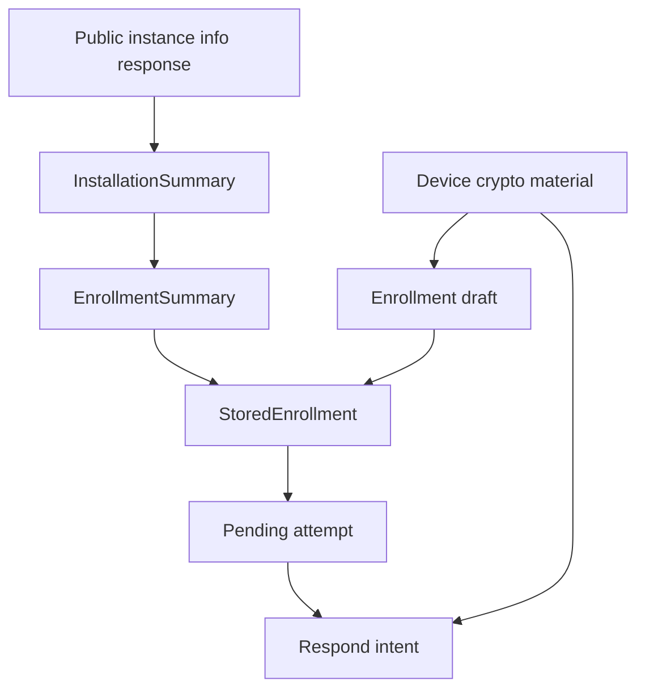

# Ezkey Mobile Data Model

## Purpose and Reading Scope

This document describes the conceptual entities used by the React Native reference app, the split between
persisted metadata and security-sensitive material, and the source-of-truth rules that keep the local model honest.
It is anchored on `app/services/api/types.ts`, `app/services/storage/enrollmentStorage.ts`, `app/hooks/useEnrollments.ts`,
and the screen/service code paths that move data across enrollment and authentication.

This document does not replace the canonical Auth API DTO definitions. It explains how the mobile app interprets,
persists, derives, and displays those values locally.

## Concept Inventory

| Concept | Purpose | Source | Persisted | Sensitive |
| --- | --- | --- | --- | --- |
| `PublicInstanceInfoResponse` | Public installation branding metadata from Auth API | `instanceInfoApi.get(...)` | Indirectly, after normalization into installation summary fields | No |
| `InstallationSummary` | Stable local installation branding attached to an enrollment | Derived from `authUrl` and optional public instance-info response | Yes | No |
| `EnrollmentSummary` | Core local view of an enrolled device and its business metadata | Local mobile contract layer in `app/services/api/types.ts` | Yes | Mostly no |
| `StoredEnrollment` | Persisted enrollment record used by Home, Detail, and auth flows | `EnrollmentSummary` plus sensitive enrollment metadata | Yes | Yes, because it contains `enrollmentProofToken` and `integrationPublicKey` |
| Enrollment draft | Temporary bind-stage object before enrollment is verified | Enrollment Wizard bind response mapping | No | Yes |
| Pending attempt | In-memory auth attempt returned by `pending` | Pending Authentication screen | No | Yes |
| Respond intent | User decision and optional challenge input before respond submission | Pending Authentication screen | No | Yes |
| Device crypto material | Device key pair, public key, signatures, storage tier | `cryptoService` / native bridge | Public key and derived tier only transiently; private key stays in keystore | Yes |
| Installation grouping model | Home-screen grouping by installation then tenant | `tenantGrouping.ts` | No, derived at render time | No |
| Local activity snapshot | Minimal locally known timestamps or derived status cues | Persisted enrollment timestamps and runtime auth flow state | Partly | No |

## Canonical Entity Map

The durable center of the local model is `StoredEnrollment`. Everything else is either a thinner contract view
(`EnrollmentSummary`, `InstallationSummary`) or transient flow state (`EnrollmentDraft`, pending attempt,
respond intent).

## Installation Metadata

Installation metadata exists to make Home and Detail truthful and human-readable without turning the mobile app into
an admin client. The app derives it from the effective Auth API URL and refreshes it opportunistically through the
public `instance-info` endpoint.

| Field/concept | Meaning | Source | Persisted | Displayed where |
| --- | --- | --- | --- | --- |
| `installationId` | Normalized stable installation identifier | Derived from `authUrl` via URL normalization | Yes | Not shown directly |
| `installationHost` | Host component of the effective Auth API URL | Derived from `authUrl` | Yes | Home installation headers, Detail hint |
| `installationName` | Human-facing installation name | Public instance-info response or host fallback | Yes | Home installation headers, Detail identity zone |
| `installationDescription` | Installation description text | Public instance-info response | Yes | Home installation headers, Detail description line |
| `installationAboutUrl` | About URL for the installation | Public instance-info response | Yes | Not currently displayed in primary flow |
| `installationLastRefreshedAt` | Timestamp for local metadata freshness | Local refresh process | Yes | Not shown directly |
| `authUrl` | Effective Auth API base URL for this enrollment | QR payload override or global environment fallback | Yes | Detail screen when custom server is shown |

Important rule: installation metadata is local presentation metadata attached to an enrollment. The app refreshes it
silently when stale, but it is still subordinate to the enrollment record and not treated as a standalone persisted
entity.

## Enrollment Summary and Stored Enrollment

`EnrollmentSummary` is the conceptual local model used by the app layer. `StoredEnrollment` extends it with the
proof token and integration verification material needed for later auth flows.

| Aspect | `EnrollmentSummary` | `StoredEnrollment` | Notes |
| --- | --- | --- | --- |
| Identity | `id`, `integrationId` | same | `id` is the main local enrollment identifier used in navigation and storage. |
| Integration display | `integrationName` | same | Primary end-user label across Home, Detail, and Pending flows. |
| Tenant grouping | `tenantName`, `tenantId`, `tenantDescription` | same | Supports tenant grouping in Home. |
| Installation branding | `installation*` fields | same | Hydrated from `authUrl` and public instance info. |
| Activity timestamps | `createdAt`, `lastActivityAt` | same | Current app uses these as the minimal durable activity snapshot. |
| Favorites | `favorited` | same | A purely local ordering preference. |
| Server routing | `authUrl` | same | Allows per-enrollment server targeting. |
| Proof token | absent | `enrollmentProofToken` | Needed for later `pending` requests. |
| Integration verification key | absent | `integrationPublicKey` | Needed to verify bind, verify result, pending, and respond result signatures. |
| Device naming | absent | `enrollmentName`, `deviceLabel` | Friendly local display material originating from bind. |
| Backward-compatible alias field | absent | `enrollmentId?` | Kept for compatibility in storage and key derivation contexts. |

The practical consequence is simple: only a verified enrollment is persisted as `StoredEnrollment`. Bind-stage data
stays in memory until the verify-result signature passes.

## Enrollment Cryptographic Material and Secure-Storage Split

The mobile app uses a split model: business-friendly metadata lives in AsyncStorage, while the device private key is
kept behind the native keystore path. The current `StoredEnrollment` record still contains some sensitive material,
especially the enrollment proof token and integration public key, because later auth flows need them locally.

| Item | Origin | Storage location | Usage | Security note |
| --- | --- | --- | --- | --- |
| Device private key | Generated by `cryptoService.ensureEnrollmentKeyPair(...)` | Native keystore / secure hardware path | Used to sign verify, pending, and respond payloads | Never exposed as raw application data. |
| Device public key | Derived from native key pair | Runtime only during verify | Sent on enrollment verify | Not currently persisted in `StoredEnrollment`. |
| `devicePrivateKeyStorageTier` | Native keystore introspection | Runtime only during verify | Sent on enrollment verify | Informational, client-reported, not server-proven. |
| `enrollmentProofToken` | QR payload / bind response | `StoredEnrollment` in AsyncStorage-backed collection | Used in later `pending` requests | Sensitive enrollment proof material retained locally. |
| `integrationPublicKey` | Bind response | `StoredEnrollment` in AsyncStorage-backed collection | Used for all later integration-signature verification | Public key material, but security-critical. |
| Bind/result signatures | Bind and verify responses | Runtime only | Trust checks during enrollment | Not persisted. |
| `authAttemptProofToken` | Pending response | Runtime only | Signed during respond | One-time token not persisted. |
| `deviceProofToken` | Locally generated on pending | Runtime only | Signed and sent to `pending` | Fresh proof material for poll cycle. |
| Secure storage delegate values | Keychain-backed generic password entries | `react-native-keychain` wrapper | Generic secure item storage | The wrapper exists, but the current enrollment storage class persists the main collection in AsyncStorage. |

The trust boundary to keep in mind is that proof tokens and integration verification material live in local storage,
while the device private key remains off-limits to normal application code.

## Pending Authentication Attempt Model

The pending auth model is intentionally transient. A pending attempt is displayed only after the app has verified the
integration signature on the canonical pending payload.

| Field/concept | Meaning | Source | Nullable? | Consumer |
| --- | --- | --- | --- | --- |
| `authAttemptId` | Attempt identifier used for respond | `pending` response | No | Pending screen respond submission |
| `authAttemptProofToken` | One-time proof token for respond | `pending` response | No | Pending screen signing logic |
| `authAttemptProofTokenSignedByIntegration` | Integration signature over pending payload | `pending` response | No | Pending screen trust check |
| `challengeRequired` | Whether a 2-digit challenge must be collected | `pending` response | No | Pending screen form logic |
| `integrationName` | Integration label shown in pending UI | Persisted enrollment record | No | Pending screen display |
| `tenantName` | Tenant label for fallback identity display | Persisted enrollment record | Yes | Pending screen display |
| `createdAt` | Local timestamp when the attempt was materialized in UI | Pending screen local state | No | Pending screen result display |
| `contextTitle` | Primary title of the auth request | `pending` response | Yes | Pending screen display |
| `contextMessage` | Descriptive request body | `pending` response | Yes | Pending screen display |

No pending attempt is persisted today. If `pending` returns empty, the screen renders an empty state rather than a
durable local record.

## Authentication Response Intent and Result Model

The response side is split between what the user chooses locally and what the server returns after verification.

| Item | Origin | Sent to API? | Displayed? | Notes |
| --- | --- | --- | --- | --- |
| Approve / deny choice | User action on Pending screen | Yes, as `authAttemptAccepted` | Indirectly, through result state | Primary human decision. |
| 2-digit challenge input | User input on Pending screen | Yes, when present | Yes while editing | Required only when `challengeRequired` is true. |
| Canonical respond payload | Built locally from `authAttemptProofToken` and decision | Signed, not sent raw | No | Device signs this payload. |
| `authAttemptProofTokenSignedByDevice` | Local device signature | Yes | No | Cryptographic proof of the decision. |
| `authAttemptResult` | `respond` response | No further | Yes | Drives accepted, rejected, or failed UI state. |
| `authAttemptMessage` | `respond` response | No further | Yes in failure-oriented states | Human-readable server message. |
| `authAttemptProofTokenResultSignedByIntegration` | `respond` response | No further | No | Must verify before the result is trusted. |

The current implementation treats respond results as terminal UI state, not as durable local history.

## Local Activity and Derived State

The app intentionally keeps local activity modest. It does not pretend to know current server truth beyond what has
been directly observed during a flow.

| Fact/state | Observed or derived | Persistence | UI use | Caveat |
| --- | --- | --- | --- | --- |
| `createdAt` | Observed at local enrollment completion | Yes | Home ordering, Detail meta line | Local completion timestamp, not a full lifecycle audit. |
| `lastActivityAt` | Locally recorded when enrollment is saved | Yes | Detail meta line | Not currently updated for every later auth outcome. |
| Installation freshness | Derived from `installationLastRefreshedAt` | Yes | Silent refresh logic | Not shown directly. |
| Grouping by installation and tenant | Derived from persisted enrollment metadata | No, render-time only | Home structure | Pure UI derivation. |
| Empty pending state | Observed from `pending` empty result | No | Pending screen | Not persisted as durable local history. |
| Approved / rejected / failed result state | Observed from trusted `respond` result | No | Pending screen | Terminal for the current screen session only. |
| Favorite ordering | Local user preference | Yes | Home ordering | Purely local and non-protocol. |

This is an intentional honesty boundary: the app should show recent local facts, not invent server-side availability,
revocation, or readiness states that it cannot prove.

## Entity Lifecycle and Persistence Rules

| Entity/concept | Created when | Updated when | Cleared when | Notes |
| --- | --- | --- | --- | --- |
| Enrollment draft | Bind response passes algorithm and signature checks | Bind is retried or bind form is rescanned | Wizard cancel, verify completion, or bind reset | Purely in-memory workflow state. |
| `StoredEnrollment` | Verify-result signature passes and save mutation succeeds | Installation metadata refresh, future local edits, favorite changes | Individual delete or clear-all destructive action | Core durable local record. |
| Installation summary fields | Enrollment save or silent metadata refresh | When metadata is stale or incomplete | Enrollment deletion / clear all | Subordinate to the enrollment record. |
| Pending attempt | Pending response passes signature verification | Re-check overwrites it | Empty result, failed state, leaving screen, or new load cycle | In-memory only. |
| Respond intent | User starts entering challenge or taps approve/deny | User edits challenge input or retries | After result or retry cycle | In-memory only. |
| Device key pair | First verify or first later ensure call for that enrollment | Not meaningfully updated in normal flow | External keystore reset or app/device reset | Managed outside AsyncStorage. |

## Source-of-Truth Matrix

| Field/concept | Canonical source | Secondary source | Notes |
| --- | --- | --- | --- |
| Auth API request/response DTO fields | Generated OpenAPI models and root Auth API docs | `app/services/api/types.ts` wrappers | Mobile wrappers should stay thin. |
| `StoredEnrollment` shape | `app/services/storage/enrollmentStorage.ts` | `MOBILE_API_MAPPINGS.md` | Durable local record contract. |
| Installation branding rules | `installationMetadata.ts` | Persisted enrollment records | Derived, then persisted. |
| Home grouping semantics | `tenantGrouping.ts` | Home screen rendering | Pure presentation derivation. |
| Device key handling | `cryptoService` and native bridge | `../../docs/CRYPTO.md` | Private key never becomes ordinary persisted app data. |
| Pending attempt runtime shape | Pending screen local state | `MOBILE_FUNCTIONAL_FLOWS.md` | Not a durable app-wide entity. |
| Respond result interpretation | Pending screen local state plus `authAttemptResult` enum | `MOBILE_API_MAPPINGS.md` | Currently transient. |
