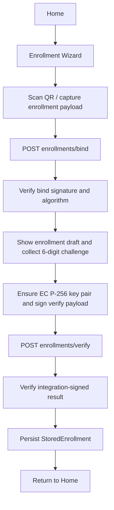
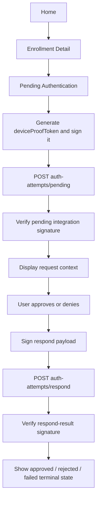

# Ezkey Mobile Functional Flows

## Purpose and Reading Scope

This document describes the two primary end-user processes implemented by the React Native reference app:
enrollment and authentication. It combines screen transitions, API calls, local mutations, and trust checks so the
reader can understand the mobile behavior end to end without reopening the source code.

Protocol semantics remain canonical in the root-level Auth API and signature payload documentation. This document is
the mobile operational view of those semantics.

## Flow Inventory and Notation

- `Nominal flow` means the intended successful path.
- `Exception flow` means a failure, empty, invalid, or terminal path the app must surface honestly.
- `Trust check` means a local verification step the app performs before trusting server-provided information.
- `Data mutation` means an in-memory draft, local persistent record, or UI state transition.

## Enrollment Nominal Flow

| Step | Screen | User/system action | API call | Data mutation | Trust check | Result |
| --- | --- | --- | --- | --- | --- | --- |
| 1 | Home | User taps `+` | None | None | None | Enrollment Wizard opens |
| 2 | Enrollment Wizard | User scans QR or enters bind payload | None | Bind form values captured | None | Enrollment payload available |
| 3 | Enrollment Wizard | Wizard starts bind | `POST /api/v1/enrollments/bind` | None yet | None before response | Bind response received |
| 4 | Enrollment Wizard | App validates bind result | None | `EnrollmentDraft` created in memory after validation | `integrationKeyAlgorithm == ed25519`; bind payload signature verified | Draft becomes trustworthy enough to display and replaces scan guidance with the verify step |
| 5 | Enrollment Wizard | User enters 6-digit challenge | None | Challenge input held in component state | Local length check | Verify can start |
| 6 | Enrollment Wizard | App ensures device key pair and prepares request | None | Device public key and storage tier derived locally | Device signs canonical verify payload | Verify request ready |
| 7 | Enrollment Wizard | Wizard submits verify | `POST /api/v1/enrollments/verify` | None yet | None before response | Verify response received |
| 8 | Enrollment Wizard | App validates verify result | None | Installation metadata may be fetched and assembled | Verify-result signature checked with stored integration public key | Enrollment completion becomes trustworthy |
| 9 | Enrollment Wizard | App persists record | Optional `GET /api/v1/public/instance-info` | `StoredEnrollment` written locally | None beyond prior checks | Wizard clears state and returns to Home |

## Enrollment Exception Flow

| Exception case | Where it occurs | Technical meaning | User-visible handling | Recovery path |
| --- | --- | --- | --- | --- |
| Missing enrollment ID or proof token | Enrollment Wizard before bind | QR/manual payload incomplete | Bind error shown | Re-scan or re-enter payload |
| Missing Auth API URL | Enrollment Wizard before bind | No per-enrollment or global base URL available | Bind error shown | Use QR with `authUrl` or configure `EZKEY_API_BASE_URL` |
| Bind request failure | Enrollment Wizard | Backend or transport failure | Bind error shown | Retry bind |
| Unsupported `integrationKeyAlgorithm` | Enrollment Wizard after bind | App cannot trust the integration key semantics | Bind error shown; flow stops | None until contract aligns |
| Invalid bind signature | Enrollment Wizard after bind | Server identity cannot be trusted for this response | Bind error shown; flow stops | Retry from scan if appropriate |
| Missing or invalid challenge input | Enrollment Wizard before verify | Local input validation failure | Challenge error shown | Correct and retry |
| Verify request failure | Enrollment Wizard | Backend or transport failure | Challenge error shown | Retry verify |
| Invalid verify-result signature | Enrollment Wizard after verify | Enrollment completion cannot be trusted | Challenge error shown; no persistence | Retry from scan if necessary |
| Local persistence failure | Enrollment Wizard after verify | Enrollment could not be saved locally | Error surfaced; flow does not complete | Retry after storage issue is resolved |

## Authentication Nominal Flow

| Step | Screen | User/system action | API call | Data mutation | Trust check | Result |
| --- | --- | --- | --- | --- | --- | --- |
| 1 | Home | User selects an enrollment | None | Selected enrollment stored in navigation/store context | None | Detail screen opens |
| 2 | Enrollment Detail | User taps `Check pending` | None | None | None | Pending Authentication opens |
| 3 | Pending Authentication | Screen loads and prepares poll | None | Fresh `deviceProofToken` generated in memory | Device signs the proof token | Pending request can be sent |
| 4 | Pending Authentication | App submits pending | `POST /api/v1/auth-attempts/pending` | None yet | None before response | Either request payload or empty result |
| 5 | Pending Authentication | App validates pending result | None | `PendingAttempt` created in memory only if signature passes | Pending payload signature verified with stored integration public key | Request details become displayable |
| 6 | Pending Authentication | User reviews context and chooses approve or deny | None | User intent stored in component state | Local challenge presence check when required | Respond can start |
| 7 | Pending Authentication | App signs canonical respond payload | None | Respond signature prepared in memory | Device signs one-time auth attempt proof token payload | Respond request ready |
| 8 | Pending Authentication | App submits respond | `POST /api/v1/auth-attempts/respond` | None yet | None before response | Respond result received |
| 9 | Pending Authentication | App validates respond result | None | Result state moved to `accepted`, `rejected`, or `failed` | Result signature verified with stored integration public key | Trusted outcome shown to user |

## Authentication Exception Flow

| Exception case | Where it occurs | Technical meaning | User-visible handling | Recovery path |
| --- | --- | --- | --- | --- |
| Enrollment missing locally | Pending Authentication before poll | Screen cannot target a valid enrollment | Error or missing state shown | Return to Home and reselect |
| Enrollment missing integration public key | Pending Authentication after API response | App cannot verify pending or respond signatures | Global error shown | Re-enroll or repair local record |
| Pending request failure | Pending Authentication | Backend or transport failure | Global error with retry | Tap `Try again` |
| No pending request | Pending Authentication | `204 No Content` / no usable pending body | Empty state shown | Tap `Check again` later |
| Invalid pending signature | Pending Authentication | Request context cannot be trusted | Global error shown | Retry only if a new request is expected |
| Missing required 2-digit challenge | Pending Authentication before respond | Local validation failure | Inline form error shown | Enter code and retry |
| Respond request failure | Pending Authentication | Backend or transport failure | Global error shown | Retry if attempt still valid |
| Missing respond-result signature | Pending Authentication after respond | Outcome cannot be trusted | Global error shown | No trusted outcome displayed |
| Invalid respond-result signature | Pending Authentication after respond | Outcome cannot be trusted | Global error shown | No trusted outcome displayed |
| Verified failed result | Pending Authentication after respond | Attempt ended unsuccessfully | Failure state shown with message | User must start a new auth attempt from the integrating app |

## Screen Transition Tables

| Event | Source screen | Destination screen | Condition |
| --- | --- | --- | --- |
| Tap add enrollment | Home | Enrollment Wizard | Always available |
| Successful enrollment persistence | Enrollment Wizard | Home | Verify-result signature accepted and storage write succeeds |
| Cancel wizard | Enrollment Wizard | Home or previous state | User cancels while not submitting |
| Select enrollment | Home | Enrollment Detail | Enrollment exists locally |
| Tap `Check pending` | Enrollment Detail | Pending Authentication | Enrollment exists locally |
| Respond approved / denied / failed | Pending Authentication | Pending Authentication result state | Trusted respond result received |
| Retry empty/error/failed auth state | Pending Authentication | Pending Authentication | User taps retry/check again |

## Data Mutation Tables

| Flow step | Data created | Data updated | Data retained | Data cleared |
| --- | --- | --- | --- | --- |
| Bind success | `EnrollmentDraft` | Bind form state | None | Prior draft/error state |
| Verify request preparation | Device public key/signature in memory | Challenge state | Draft | None |
| Verify success | `StoredEnrollment` local record | Installation metadata snapshot | Integration public key, proof token, auth URL | Draft and challenge state |
| Pending request preparation | Fresh `deviceProofToken` and signature | Debug/loading state | Persisted enrollment record | Prior global error |
| Pending success | `PendingAttempt` in memory | Challenge-required UI state | Persisted enrollment record | Empty/error state |
| Respond success | Result UI state | Challenge failure or result message state | Persisted enrollment record | `PendingAttempt` may be cleared on failed outcomes |

## Trust-Check Sequence Tables

| Step | Artifact checked | Verification type | Failure effect |
| --- | --- | --- | --- |
| Bind response acceptance | `integrationKeyAlgorithm` | Fail-closed algorithm tag check | Bind response rejected |
| Bind response acceptance | `enrollmentBindPayloadSignedByIntegration` | Ed25519 verification with `integrationPublicKey` | Bind response rejected |
| Verify request preparation | Canonical verify device payload | Device ECDSA signature generation | Verify cannot proceed |
| Verify response acceptance | `enrollmentVerifyPayloadSignedByIntegration` | Ed25519 verification with stored integration public key | Enrollment not persisted |
| Pending response acceptance | `authAttemptProofTokenSignedByIntegration` | Ed25519 verification with stored integration public key | Pending attempt not displayed |
| Respond request preparation | Canonical respond payload | Device ECDSA signature generation | Respond cannot proceed |
| Respond response acceptance | `authAttemptProofTokenResultSignedByIntegration` | Ed25519 verification with stored integration public key | Outcome not trusted or displayed |

## Known Deviations and Deferred Paths

- The current implementation exposes a `DangerZone` screen for destructive local actions even though the original mobile PRD framed v1 as read-only for destructive management.
- Enrollment Detail currently focuses on identity and the `Check pending` action; a dedicated history placeholder is not yet present.
- Pending and respond outcomes are not currently persisted as a rich local activity history.
- Home does not offer direct pending polling; the intentional path still goes through Enrollment Detail to preserve the user-driven posture.
