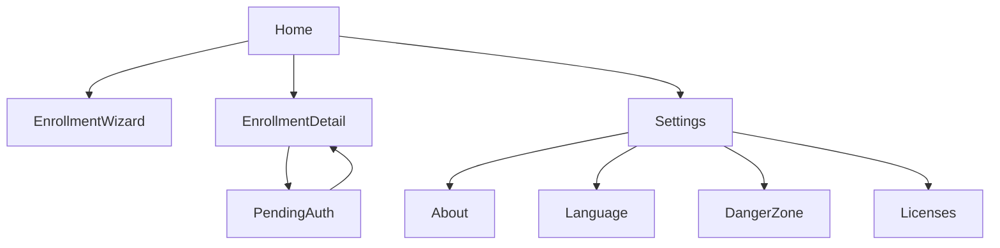
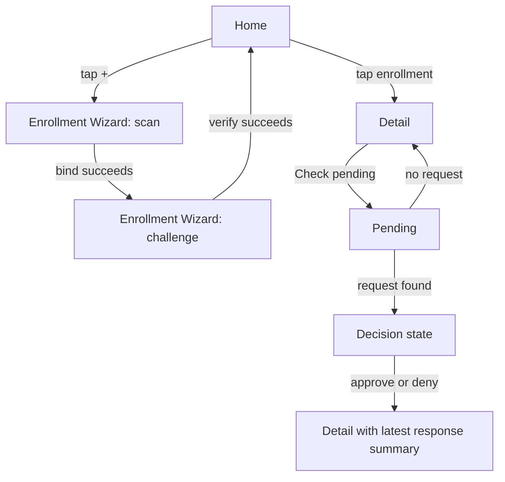
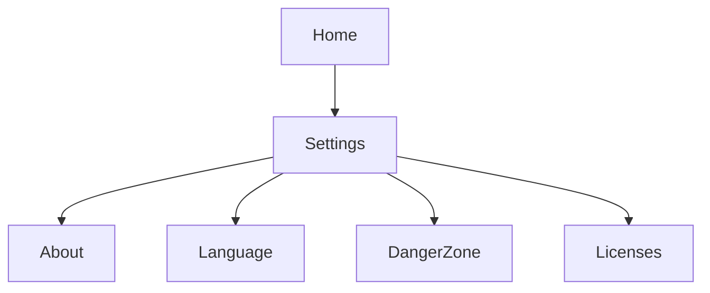

# Ezkey Mobile Screens and Wireflows

## Purpose and Reading Scope

This document describes the current screen model of the React Native reference app, what each primary screen shows,
which actions it owns, and how navigation moves across enrollment and authentication. It is grounded on the current
screen implementations rather than an idealized future UX.

It focuses on Home, Enrollment Wizard, Enrollment Detail, and Pending Authentication first, then captures the
secondary Settings, About, Danger Zone, and Licenses screens in an appendix.

## Navigation Model Overview

The main operational path is intentionally narrow: Home lists enrollments, Enrollment Detail confirms identity and
server context, and Pending Authentication owns polling plus approve/deny. The app does not poll from Home directly.

## Screen Inventory

| Screen | Purpose | Primary actions | Main dependencies | In primary flow? |
| --- | --- | --- | --- | --- |
| Home | List locally stored enrollments grouped by installation and tenant | Open enrollment, start enrollment wizard | `useEnrollments`, `useRefreshInstallationMetadata`, tenant grouping utilities | Yes |
| Enrollment Wizard | Bind and verify a new enrollment from QR payload | Scan QR, bind, enter challenge, complete enrollment | `enrollmentsApi`, `instanceInfoApi`, `cryptoService`, save mutation | Yes |
| Enrollment Detail | Show selected enrollment identity, own auth polling entry, and surface the latest local response summary | Check pending | `useEnrollments`, navigation store, volatile recent-auth summary state | Yes |
| Pending Authentication | Poll for pending auth, verify context, approve or deny | Check again, approve, deny | `authAttemptsApi`, `cryptoService`, payload builders | Yes |
| Settings | Secondary navigation hub | Open About, Language, Security, Danger Zone, or Licenses | Navigation only | No |
| Security | Manage the local approval-confirmation preference | Switch between Standard and Confirm before approvals | `securityPreferenceStorage`, native device confirmation for downgrade protection | No |
| About | Show app metadata and project link | Open `ezkey.org` | Native build timestamp, app info constants | No |
| Danger Zone | Perform destructive local actions | Delete one enrollment, clear all local data | `useEnrollments`, delete mutation, storage clear-all | No |
| Licenses | Show generated third-party dependency list | Scroll/read only | `thirdPartyLicenses.json` snapshot | No |

## Home Screen

Home is the landing screen for the mobile app. It acts as a local catalogue of enrollments, not as a polling surface.
Its structure emphasizes installation and tenant grouping so the user understands where a given enrollment belongs.

| Entry condition | Description |
| --- | --- |
| App launch with local enrollments | Home renders grouped enrollments and silently refreshes stale installation metadata. |
| App launch without local enrollments | Home renders a first-use empty state with QR enrollment guidance. |

| Content block | What it shows/collects | Data source |
| --- | --- | --- |
| Installation shell | Installation name, description, host hint, expand/collapse control | Derived installation metadata from persisted enrollments |
| Tenant section | Tenant name and optional description | Persisted enrollment tenant fields |
| Enrollment card | Integration name, optional enrollment/device name, optional integration description | `StoredEnrollment` |
| Empty state | Welcome message, one-line value proposition, QR hint card | Static copy |
| Floating action button | Entry point to enrollment wizard | Static action |

| User action | Effect | Next state/navigation |
| --- | --- | --- |
| Tap enrollment card | Select enrollment and open details | Navigates to Enrollment Detail |
| Tap installation header | Toggle expansion of installation group | Stays on Home |
| Tap `+` button | Start enrollment flow | Navigates to Enrollment Wizard |

| State type | How it appears | User consequence |
| --- | --- | --- |
| Loading | Full-screen spinner | Wait for persisted enrollments to hydrate |
| Empty | Welcome card and QR hint | User is directed to start enrollment |
| Populated | Grouped list by installation and tenant | User can inspect and select a specific enrollment |

## Enrollment Wizard

Enrollment Wizard is the only primary screen that creates a new durable enrollment record. It stages the bind response
in memory, collects the six-digit challenge, then persists the record only after verify-result trust checks pass.

| Entry condition | Description |
| --- | --- |
| User starts enrollment from Home | Wizard opens with no draft and expects QR-driven input. |
| QR includes or implies valid Auth API URL | Wizard can route bind/verify to the correct Auth API base URL. |

| Content block | What it shows/collects | Data source |
| --- | --- | --- |
| Scan stage | CTA to open scanner, camera-permission guidance, bind errors; hidden after a successful bind | Local wizard state |
| Enrollment info card | Integration name, description, organization, device label, optional server URL | Trusted bind response draft |
| Challenge stage | Six-box challenge input | User input |
| Primary/secondary actions | Open scanner, complete enrollment, cancel, learn more | Local wizard state |

| User action | Effect | Next state/navigation |
| --- | --- | --- |
| Open scanner | Requests camera access and opens QR modal | Remains in wizard |
| Successful scan/bind | Draft becomes available | Wizard hides scan guidance and switches focus to the challenge stage |
| Enter 6-digit challenge | Enables verify path | Remains in wizard |
| Complete enrollment | Runs verify and save flow | On success, returns to Home |
| Cancel after draft exists | Clears draft and challenge state | Stays in wizard reset state or returns |

| State type | How it appears | User consequence |
| --- | --- | --- |
| Pre-bind idle | Scan-focused CTA | User can start the flow |
| Binding | Primary CTA shows `Binding...` | User waits for bind result |
| Draft ready | Challenge input first, then enrollment info card; scan guidance is removed | User can inspect context and complete enrollment |
| Verify error | Challenge error below challenge stage | User can correct/retry |
| Submitting | Primary CTA shows `Finishing...` | User waits for final verification and persistence |

## Enrollment Detail

Enrollment Detail is a narrow identity and routing screen. It confirms which installation, tenant, integration, and
device the user is about to use, and exposes the single primary action `Check pending`.

| Entry condition | Description |
| --- | --- |
| Enrollment selected from Home | Route parameter or store selection identifies the target enrollment. |
| Enrollment still exists locally | Detail can render full identity block and metadata. |

| Content block | What it shows/collects | Data source |
| --- | --- | --- |
| Identity zone | Installation name, tenant name, integration name, enrollment/device name, installation description | Persisted enrollment record |
| Meta lines | Created and last verification timestamps | Persisted enrollment timestamps |
| Server zone | Custom Auth API URL when present | Persisted `authUrl` |
| Primary button | `Check pending` | Static action |
| Latest response card | Most recent verified local response summary for this enrollment, when available | Volatile local UI state |

| User action | Effect | Next state/navigation |
| --- | --- | --- |
| Tap `Check pending` | Starts the pending check for this enrollment | Stays on Enrollment Detail when nothing is pending; navigates to Pending Authentication only when a request exists |
| Tap back | Returns to previous screen | Usually Home |

| State type | How it appears | User consequence |
| --- | --- | --- |
| Loading | Full-screen spinner | Wait for enrollments query to hydrate |
| Missing enrollment | Error text and `Back to Home` button | User must recover by returning to Home |
| Normal detail view | Identity card plus primary action | User can intentionally trigger a pending check |

## Pending Authentication

Pending Authentication owns the trusted review/respond branch once a real pending request exists. It is the trust gate
for request context and respond submission, then returns control to Enrollment Detail.

| Entry condition | Description |
| --- | --- |
| User comes from Enrollment Detail with a real pending request | Enrollment ID is available via route params and the request exists. |
| Persisted enrollment contains proof token and integration public key | Screen can call `pending` and verify signatures. |

| Content block | What it shows/collects | Data source |
| --- | --- | --- |
| Enrollment identity box | Integration name and optional tenant fallback | Persisted enrollment |
| Request context block | `contextTitle`, `contextMessage`, challenge requirement | Trusted pending response |
| Two-digit challenge input | Challenge entry when required | User input |
| Action buttons | Approve, deny, retry/check again | Screen state |
| Debug panel | Optional diagnostics when `pendingAuthDebugPanel` is enabled | Screen debug snapshot |

| User action | Effect | Next state/navigation |
| --- | --- | --- |
| Wait for initial load | Screen may use a preloaded verified pending request or call `pending` when entered directly | Remains on screen |
| Tap `Check again` | Repeats `pending` load cycle | Remains on screen |
| Enter challenge | Satisfies local precondition for approve | Remains on screen |
| Tap approve | Signs and submits respond payload with accepted decision | Returns to Enrollment Detail with latest response summary |
| Tap deny | Signs and submits respond payload with denied decision | Returns to Enrollment Detail with latest response summary |

| State type | How it appears | User consequence |
| --- | --- | --- |
| Loading | Spinner and `Contacting Ezkey Auth API...` | Wait for pending result |
| Global error | Error body plus retry button | User can retry loading |
| Empty | `No pending requests` plus `Check again` | No auth attempt available now |
| Pending request | Request context and actions | User can approve or deny |
| Verified respond result | Immediate return to Enrollment Detail | User sees the latest response summary in the detail screen |

## Supporting Screens Appendix

| Screen | Purpose | Why secondary | Notes |
| --- | --- | --- | --- |
| Settings | Single hub for app-adjacent actions | Does not participate in enrollment/auth protocol flow directly | Routes to About, Language, Security, Danger Zone, and Licenses. |
| Security | Local security preference for this phone | Secondary preference surface, but security-sensitive when lowering protection | The app requires device confirmation before saving a downgrade from protected mode to standard. |
| Language | Manual language selection | Secondary preference only | Persists English/French selection and applies it immediately via i18next (no app restart). |
| About | App metadata and project context | Informational only | Shows version, native build timestamp, MIT/open-source note, and link to `ezkey.org`. |
| Danger Zone | Destructive local maintenance | Explicitly separated to avoid accidental deletion in the main flow | Supports deleting one enrollment or clearing all local enrollment data. |
| Licenses | Third-party package inventory | Compliance/information surface only | Reads generated JSON snapshot from `yarn license:app-data`. |

## Cross-Screen Data Visibility Matrix

| Field/concept | Home | Enrollment Wizard | Enrollment Detail | Pending Authentication | Supporting screens |
| --- | --- | --- | --- | --- | --- |
| `installation.name` | Shown in installation headers | Not primary, but derived server shown optionally | Shown | Not normally shown except fallback identity context | No |
| `installation.host` | Optional host hint in installation header | Optional server URL in info card | Optional host hint | No | No |
| `tenantName` | Shown in grouping headers | Shown in info card after bind | Shown | Shown as fallback identity | Danger Zone shows a minimal tenant line |
| `integrationName` | Shown on enrollment cards | Shown in info card after bind | Shown | Shown in enrollment box | Danger Zone row title |
| `integrationDescription` | Shown on enrollment cards when present | Shown in info card | Not shown directly | No | No |
| `enrollmentName` | Shown on cards when present | Shown in info card | Shown | No | No |
| `createdAt` | Not shown | Not shown | Shown in meta line | No | No |
| `lastActivityAt` | Not shown | Not shown | Shown in meta line | No | No |
| Latest verified response summary | No | No | Shown when available | No | No |
| `installation.authUrl` | Hidden | Optional server line during draft stage | Shown when custom server exists | Used for routing, not display | No |
| `enrollmentProofToken` | Hidden | Hidden | Hidden | Hidden | Hidden |
| `integrationPublicKey` | Hidden | Hidden | Hidden | Hidden | Hidden |
| `contextTitle` / `contextMessage` | No | No | No | Shown only after pending signature verification | No |

## Wireflow Diagrams

