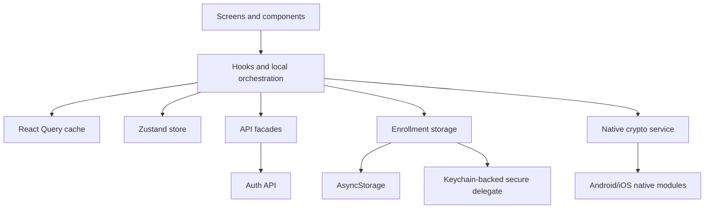
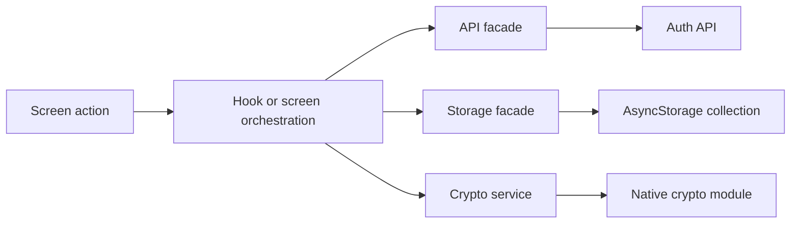

# Ezkey Mobile Stack and Architecture

## Purpose and Reading Scope

This document consolidates the stable technical structure of the React Native reference app: the selected stack,
runtime layers, trust boundaries, code-generation workflow, and the responsibilities shared across UI, hooks,
API services, storage, and native crypto bridges.

It is the architectural reading layer for the mobile app itself. It does not replace the canonical Auth API,
cryptographic, or payload-format documentation at the repository root, and it does not try to carry the detailed
screen-by-screen behavior already covered by the flow and mapping documents.

## Technology Stack Summary

| Concern | Technology | Why it is used | Notes |
| --- | --- | --- | --- |
| Runtime UI | React Native 0.86.2 | Shared iOS/Android UI codebase | Current Active 0.86 patch. 0.87 is a later program (Node 22, AGP 9, Strict TS API), not this baseline. |
| React runtime | React 19.2.7 | Rendering model used by the current workspace manifest | Keep React and React Native versions aligned with `package.json` and the RN-renderer constraint. |
| Language | TypeScript | Typed mobile domain and service layer | Thin wrapper types sit above generated DTOs. |
| Navigation | React Navigation stack | Simple screen-to-screen mobile flow control | Current stack includes Home, Enrollment, Pending, and supporting screens. |
| Localization | `i18next` plus `react-i18next` | Static message catalog, manual EN/FR language selection, and predictable fallback behavior | English is the default locale; locale preference is persisted locally and applied immediately via `i18n.changeLanguage` (also reloaded on cold start). |
| Remote data orchestration | React Query | Query/mutation lifecycle and cache invalidation | Used for enrollments hydration and local mutation coordination. |
| Local UI state | Zustand | Lightweight cross-screen state for selected enrollment | Small surface, no large global state machine. |
| HTTP contract client | Orval-generated Auth API client plus local facades | Keep contract aligned with OpenAPI while preserving mobile-friendly wrappers | `app/services/api/types.ts` stays intentionally thin. |
| Durable metadata storage | AsyncStorage-backed enrollment metadata collection and preferences | Persist local enrollment metadata, installation metadata, and language preference | Wrapped by `enrollmentStorage` and preference-specific storage facades. |
| Secure item storage | `react-native-keychain` wrapper | Device-local secure storage for small secret values such as enrollment proof tokens | Used by `enrollmentStorage` as the secure delegate; private key path remains native. |
| Device crypto | Native bridge (`EzkeyCryptoModule`) | Key generation, signing, public key retrieval, proof token generation | Android path is the current reference-strength implementation. |
| QR capture | Vision Camera 5 + `react-native-vision-camera-barcode-scanner` (ML Kit) | QR-first enrollment via `useBarcodeScannerOutput` | Android-first reference; iOS uses same ML Kit path. |
| Testing | Jest; Maestro for real-device pilot | Unit/component coverage plus optional device flows | Native instrumented crypto tests are separate (`yarn android:test:instrumented:crypto`). |

## Stack modernization program (2026-05-29)

Active toolchain program tracked outside this doc:

| Item | Value |
| --- | --- |
| GitHub issue | [#177](https://github.com/mgagp/ezkey/issues/177) |
| Branch | `feature/177-i-2026-05-29-mobile-stack-modernization` |
| Backlog idea | `I-2026-05-29-mobile-stack-modernization` |
| Tracer bullet | `TB-2026-05-29-mobile-stack-modernization` |
| Method log | `ML-2026-05-29-mobile-stack-modernization` |

Prior exhaustive dependency review (RN 0.85.2 baseline, May 2026) is archived under
`.github/prompts/archived/2026-05/plan-mobileDependencyReview.prompt.md` — do not repeat.

**Program status (2026-05-31):** Steps 1–6 executed on branch `#177`: CI `yarn validate`, RN 0.85.3,
Async Storage 3.x, Vision Camera 5 + `react-native-vision-camera-barcode-scanner`, ESLint 9 flat config.
Device smoke PASS (Pixel 7 Pro). Maestro deferred on this branch.

**Current workspace baseline (2026-08):** React Native `0.86.2` + aligned `@react-native/*` `0.86.2`,
React `19.2.7`, CLI `20.2.0`. The 0.85.x program above is historical. Stay on the 0.86 Active line
until a dedicated 0.87 program is opened.

## Runtime Architecture at a Glance

The app is intentionally layered. Screens remain mostly declarative and route user actions into hooks and service
facades. Contract-specific serialization stays in the API layer, durable record handling stays in the storage layer,
and cryptographic operations stay behind the native crypto bridge. This separation is what makes the flow docs and
API mapping docs practical: the screen does not reinvent protocol semantics.

## Secure Storage vs Keystore

The current Android reference app uses two distinct protection layers that should not be conflated:

| Layer | Protects | Current Ezkey mobile usage | Important boundary |
| --- | --- | --- | --- |
| `Android Keystore` / `StrongBox when available` | Cryptographic keys and key operations | One EC P-256 private signing key per enrollment plus one app-level AES seal key | Protects keys and cryptographic operations; the signing key and seal key remain distinct roles |
| Android sealed-secret envelopes in AsyncStorage | Small application secret values at rest | `enrollmentProofToken`, `integrationPublicKey`, and similar small secrets | Stores only ciphertext + metadata in app storage; plaintext is rehydrated on demand through the native crypto module |

So the honest current model is: the app signs with a per-enrollment keystore key, and on Android it seals small
persisted secrets with a separate app-level Keystore AES key before writing ciphertext envelopes into AsyncStorage. It
does **not** use the enrollment private key itself to unwrap all other local secrets on demand.

## Repository and Module Structure

| Path area | Responsibility | Notes |
| --- | --- | --- |
| `app/screens` | Primary and supporting mobile screens | Houses Home, Enrollment Wizard, Enrollment Detail, Pending Authentication, and settings-adjacent screens. |
| `app/components` | Reusable UI pieces | Includes items such as the scanner modal and shared display components. |
| `app/navigation` | Screen registration and route typing | `RootStackParamList` is the route contract. |
| `app/hooks` | React Query coordination and storage-facing orchestration | `useEnrollments` and related mutations are the main local data gateway. |
| `app/state` | Lightweight app state | Current main role is selected enrollment sharing. |
| `app/services/api` | Generated client, facades, mobile wrappers | Owns the thin interpretation layer on top of generated Auth API types. |
| `app/services/storage` | Enrollment persistence and secure item wrappers | Keeps local record handling out of screen code. |
| `app/services/crypto` | Native crypto abstraction and payload helpers | Owns device signing, verification, and payload construction. |
| `app/utils` | Focused derivation logic and formatting helpers | Installation metadata normalization, tenant grouping, proof token generation, URL validation. |
| `android` | Android native project | Current reference-strength native crypto path (`org.ezkey.mobile.crypto`). QR enrollment uses Vision Camera + ML Kit from JS. |
| `ios` | iOS native project | Native parity is in progress and documented conservatively. |
| `docs` | Mobile-specific documentation | Primary conceptual corpus plus supporting technical and operational notes. |

## Data Flow Across UI, Hooks, API, Storage, and Native Crypto

| Stage | Primary component | Input | Output | Notes |
| --- | --- | --- | --- | --- |
| Home hydration | `useEnrollments` | Local enrollment collection | `StoredEnrollment[]` query result | Silent installation metadata refresh may run after hydration. |
| Enrollment bind | Enrollment Wizard plus `enrollmentsApi.bind` | QR payload and effective `authUrl` | Bind response draft | No durable local write yet. |
| Enrollment verify | Enrollment Wizard plus `cryptoService` plus `enrollmentsApi.verify` | User challenge, device public key, device signature | Verify response and persisted enrollment record | Durable write occurs only after verify-result trust check. |
| Installation refresh | `useRefreshInstallationMetadata` | Persisted enrollments | Refreshed nested installation objects | Uses public instance-info endpoint opportunistically. |
| Pending load | Pending screen plus `authAttemptsApi.pending` plus `cryptoService` | Enrollment proof token, fresh device proof token, signature | Pending attempt in memory | Request context is shown only after signature verification. |
| Respond submit | Pending screen plus `authAttemptsApi.respond` plus `cryptoService` | User decision, optional challenge, one-time proof token signature | Trusted latest-response summary on Enrollment Detail | Current implementation does not persist detailed auth history. |

## Trust Boundaries and Security-Sensitive Responsibilities

| Component | Responsibility | Sensitive data/material | Failure impact |
| --- | --- | --- | --- |
| Screen layer | Collect user intent and display trusted state only | User-entered challenges, contextual request text | Misleading UI if trust checks are bypassed or presentation overstates certainty. |
| API facades | Serialize mobile wrapper inputs into Auth API DTOs | Enrollment IDs, proof tokens, signed payloads | Contract drift or wrong field coercion can break protocol correctness. |
| Storage layer | Persist local enrollment metadata and sealed-secret state | `enrollmentProofToken`, `integrationPublicKey`, local timestamps, routing URL | Data loss or stale local model can break later auth flows. |
| Native crypto service | Generate key pairs, retrieve public keys, sign payloads, verify integration signatures, seal and unseal Android secrets | Device private key path, app-level seal key, signatures, proof token generation | Trust chain breaks if signing, verification, or sealed-secret rehydration is incorrect |
| Generated OpenAPI client | Mirror backend contract | DTO structures, HTTP typing | Silent contract drift if spec refresh discipline is not maintained. |
| Auth API | Backend verification and lifecycle authority | Proof-token semantics, integration-signed payloads, final state | The mobile app must not try to replace backend authority with UI assumptions. |

Practical trust rule: the UI may present context only after the mobile client has performed the local trust checks
it is responsible for, but the backend remains authoritative for state transitions and validation outcomes.

## Contract Generation and OpenAPI Workflow

| Step | Source | Artifact | Owner rule |
| --- | --- | --- | --- |
| Auth API contract refresh | Root scripts `scripts/update-specs.*` | `ezkey_mobile/openapi-spec.json` | Never hand-edit the local spec copy. |
| Client regeneration | Local mobile command `yarn generate:api` | Generated client and generated models | Run after spec refresh only. |
| Mobile wrapper typing | `app/services/api/types.ts` | Thin local types | Keep thin; do not build a second hand-maintained contract universe. |
| API facade layer | `app/services/api/*.ts` | Mobile-friendly bind/verify/pending/respond helpers | Owns serialization details and optional per-enrollment base URL routing. |

Warnings:

- The generated models are the DTO source of truth for Auth API request and response shapes.
- The local `openapi-spec.json` is versioned for reproducibility, but it is still refreshed only through the root workflow.
- Mobile conceptual docs should map the contract, not restate the entire contract canonically.

## Architecture Decisions and Non-Goals

Key decisions:

- The mobile client consumes only the Auth API; admin concerns stay server-side.
- Enrollment entry is QR-first and intentionally narrow.
- Polling for pending auth remains user-initiated; there is no background polling loop.
- Device signing stays in native modules rather than reimplementing cryptography in JavaScript.
- The app stores enough local enrollment metadata and secure proof-token state to function across restarts and to verify later integration signatures.
- Installation branding is attached to enrollments and refreshed opportunistically rather than modeled as a full remote domain.

Non-goals:

- No second manually maintained copy of the Auth API contract.
- No claims of FIDO2/WebAuthn equivalence or attestation-backed hardware proof.
- No broad admin-management surface inside the mobile app.
- No push-notification architecture in the current flow model.
- No assumption of full Android/iOS native crypto parity in documentation when parity is not yet proven.

## Links to Deeper Technical References

- [README.md](README.md): entry point and reading order for the mobile documentation corpus.
- [MOBILE_API_MAPPINGS.md](MOBILE_API_MAPPINGS.md): precise field and ownership mapping between screens, internal structures, and Auth API operations.
- [MOBILE_FUNCTIONAL_FLOWS.md](MOBILE_FUNCTIONAL_FLOWS.md): nominal and exception flow execution across enrollment and authentication.
- [NATIVE_MODULES.md](NATIVE_MODULES.md): lower-level native bridge responsibilities and platform specifics.
- [MOBILE_CRYPTO_REFERENCE.md](MOBILE_CRYPTO_REFERENCE.md): mobile-specific crypto wording guardrails and storage-tier caveats.
- [../../docs/CRYPTO.md](../../docs/CRYPTO.md): canonical shared cryptographic wording.
- [../../docs/ENDPOINT.md](../../docs/ENDPOINT.md): canonical Auth API semantics.
