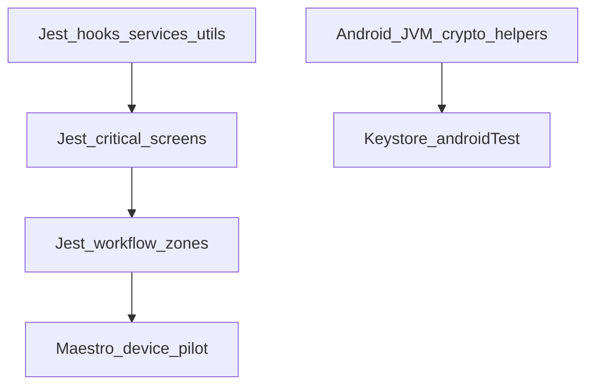

# Ezkey Mobile — Test Strategy

Living contract for how the reference Android app is tested. This is not a coverage-percentage
campaign and not a second product spec. Canon for flows remains
[`MOBILE_FUNCTIONAL_FLOWS.md`](MOBILE_FUNCTIONAL_FLOWS.md); canon for local trust remains
[`MOBILE_DATA_MODEL.md`](MOBILE_DATA_MODEL.md) § Cornerstone.

## Pyramid

| Layer | Owns | CI? |
| --- | --- | --- |
| Jest hooks / services / utils | Business logic and fail-closed contracts | Yes — `yarn validate:ci` |
| Jest critical screens | Navigation and user-initiated gates (Home, Enrollment Detail check-pending, Settings-style hubs) | Yes |
| Jest workflow zones | Product stories that must stay linked under evolution (protocol continuity; trust-zone crypto) | Yes, as those files land |
| Android JVM unit tests | Ed25519 verifier, sealed-secret envelope, ECDSA low-S | Yes — `testDebugUnitTest` |
| Instrumented `androidTest` | `EzkeyCryptoModule` Keystore round-trip, per-installation seal isolation (MOB-017) | No — run on device/emulator when native crypto changes: `yarn android:test:instrumented:crypto` |
| Maestro | Real-device evidence (`TB-2026-0002`) | No |
| StrongBox `STRONG` | Physical checklist only | No — [`MOBILE_STRONGBOX_MANUAL_CHECKLIST.md`](MOBILE_STRONGBOX_MANUAL_CHECKLIST.md) |

Detox is not in the stack. There is no `collectCoverage` threshold.

## What Jest screens cover

Thin interaction tests when a screen owns navigation or a pull-model gate. Do not chase About,
Licenses, logos, or presentation-only copy.

## Protocol workflow zones (commit 2)

Placeholder. The matrix mapping [`MOBILE_FUNCTIONAL_FLOWS.md`](MOBILE_FUNCTIONAL_FLOWS.md) and
product-intent cryptographic continuity (`bind`↔`verify`, `pending`↔`respond`, pull gate, MOB-015)
lands with the workflow Jest files.

## Trust-zone crypto (commit 3)

Placeholder. The matrix for installation trust-zone identity, complementary Keystore families
(signing vs per-installation seal), sealed-secret isolation, and honest StrongBox wording lands
with the trust-zone isolation workflow.

## When to run instrumented crypto tests

Required when editing `EzkeyCryptoModule` or seal/sign native helpers. Not required for Jest-only
or documentation changes. A green emulator run is **not** StrongBox proof.

@since 2026
