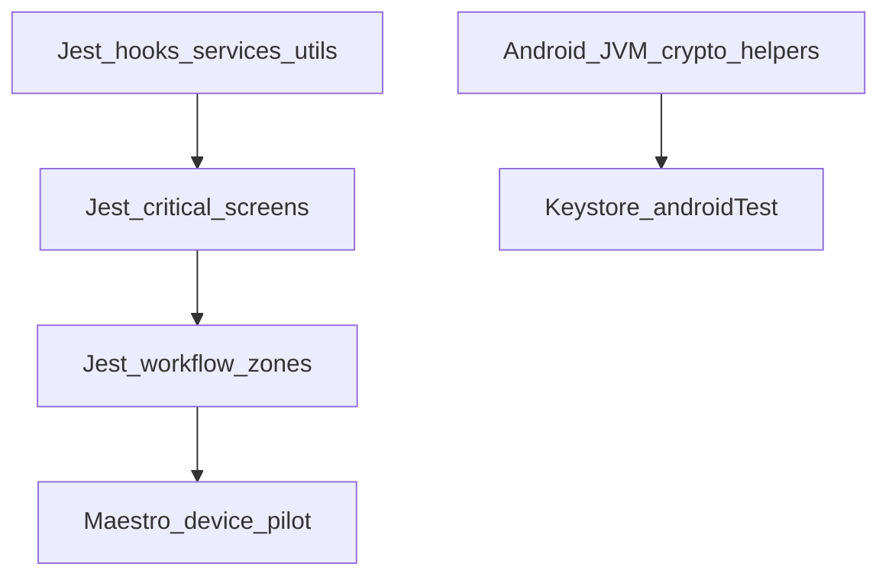

# Ezkey Mobile — Test Strategy

Living contract for how the reference Android app is tested. This is not a coverage-percentage
campaign and not a second product spec. Canon for flows remains
[`MOBILE_FUNCTIONAL_FLOWS.md`](MOBILE_FUNCTIONAL_FLOWS.md); canon for local trust remains
[`MOBILE_DATA_MODEL.md`](MOBILE_DATA_MODEL.md) § Cornerstone.

## Pyramid

| Layer | Owns | CI? |
| --- | --- | --- |
| Jest hooks / services / utils | Business logic and fail-closed contracts | Yes — `yarn validate:ci` |
| Jest critical screens | Navigation and user-initiated gates (Home, Enrollment Detail check-pending, Settings-style hubs) | Yes |
| Jest workflow zones | Product stories that must stay linked under evolution (protocol continuity; trust-zone crypto) | Yes — `yarn validate:ci` |
| Android JVM unit tests | Ed25519 verifier, sealed-secret envelope, ECDSA low-S | Yes — `testDebugUnitTest` |
| Instrumented `androidTest` | `EzkeyCryptoModule` Keystore round-trip, per-installation seal isolation (MOB-017) | No — run on device/emulator when native crypto changes: `yarn android:test:instrumented:crypto` |
| Maestro | Real-device evidence (`TB-2026-0002`) | No |
| StrongBox `STRONG` | Physical checklist only | No — [`MOBILE_STRONGBOX_MANUAL_CHECKLIST.md`](MOBILE_STRONGBOX_MANUAL_CHECKLIST.md) |

Detox is not in the stack. There is no `collectCoverage` threshold.

## What Jest screens cover

Thin interaction tests when a screen owns navigation or a pull-model gate. Do not chase About,
Licenses, logos, or presentation-only copy.

## Protocol workflow zones

Canon: [`MOBILE_FUNCTIONAL_FLOWS.md`](MOBILE_FUNCTIONAL_FLOWS.md) and
[`product-docs/global/product-intent.md`](../../product-docs/global/product-intent.md) § cryptographic
continuity. Each zone has one nominal `it()` and one fail-closed `it()`. Detail stays in unit files.

| Zone | Product intent | Nominal story | Fail-closed break | Primary files |
| --- | --- | --- | --- | --- |
| Enrollment continuity | bind↔verify linked | QR → bind + bind-sig OK → draft → 6-digit → verify + result-sig OK → persist → Home | Invalid verify-result signature → no persist, key deleted | `app/hooks/__tests__/enrollmentContinuity.workflow.test.ts` |
| Authentication continuity | pending↔respond linked | Detail check-pending → PendingAuth → approve → respond-sig OK → trusted summary | Invalid respond-result signature → no trusted outcome | `__tests__/authenticationContinuity.workflow.test.tsx` |
| Pull-model gate | user-initiated only | Home never calls pending; only Detail `Check pending` starts a claim | Broken enrollment offers no check-pending | `__tests__/HomeScreen.test.tsx`, `__tests__/EnrollmentDetailScreen.test.tsx` |
| Local honesty | MOB-015 fail-open visibility, fail-closed auth | Unusable row visible; Detail has no pending action | Collection error never looks like first-use empty Home | `__tests__/HomeScreen.test.tsx`, `__tests__/EnrollmentDetailScreen.test.tsx` |
| Protected-mode downgrade | local confirmation before lowering protection | Already owned | Cancel keeps protected | `__tests__/SecurityScreen.test.tsx`, `approvalRequirement.test.ts` |

Do not duplicate every exception row from the functional-flow tables here. Workflows own **linkage**.

## Trust-zone crypto

Canon: [`MOBILE_DATA_MODEL.md`](MOBILE_DATA_MODEL.md) § Cornerstone. Jest owns **JS forwarding** of
installation-scoped handles. Native AES isolation stays on instrumented `androidTest`. StrongBox
`STRONG` is never asserted in Jest or CI.

| Zone | Product intent | Nominal story | Fail-closed break | Primary files |
| --- | --- | --- | --- | --- |
| Installation identity | two Auth URLs, same server id | Distinct `deriveLocalEnrollmentId` / `deriveInstallationScopeId`; both rehydrate | — | `app/services/storage/__tests__/trustZoneIsolation.workflow.test.ts` |
| Seal isolation | per-installation AES scope | `sealSecret` called with distinct `installationScopeId`s | Unseal fail on A → A broken, B still claimable | `trustZoneIsolation.workflow.test.ts` |
| Signing alias | per-enrollment Keystore handle | Claim on A signs with A's local id and A's `authUrl` only | — | `trustZoneIsolation.workflow.test.ts` |
| Complementary split | signing key does not unseal; seal key is per-installation | `sign(localId)` vs `sealSecret(scopeId, logicalKey, …)` are distinct first arguments | `clearAll` deletes both signing aliases and every seal key | `app/services/crypto/__tests__/complementaryProtections.workflow.test.ts` |
| StrongBox `STRONG` | honest hardware evidence | — | Never assert `STRONG` in CI | [`MOBILE_STRONGBOX_MANUAL_CHECKLIST.md`](MOBILE_STRONGBOX_MANUAL_CHECKLIST.md) |

Native Keystore ciphertext isolation (`sealSecret_isIsolatedPerInstallationScope_MOB017`) is not
replaced by these Jest files.

## When to run instrumented crypto tests

Required when editing `EzkeyCryptoModule` or seal/sign native helpers. Not required for Jest-only
or documentation changes. A green emulator run is **not** StrongBox proof.

@since 2026
