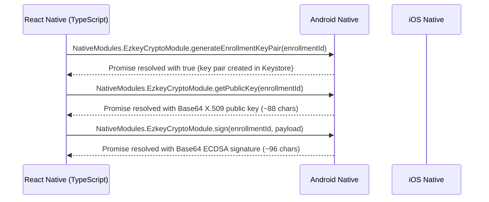

<!--
  Ezkey - Open Source Cryptographic MFA Platform
  Copyright (c) 2025 Ezkey contributors
  Licensed under the MIT License. See LICENSE file in the project root for full license information.
-->

# Native Modules Overview

> Reference guide for Ezkey Mobile native integrations and their interaction with the JavaScript runtime.

## Modules at a Glance

| Module | Platform | Responsibility | Entry Point |
|--------|----------|----------------|-------------|
| `EzkeyCryptoModule` | Android (Kotlin) | EC P-256 key management via `Android Keystore`, with `StrongBox` requested when available | `android/app/src/main/java/org/ezkey/mobile/crypto/EzkeyCryptoModule.kt` |
| `EzkeyCryptoModule` | iOS (Swift) | Native secure-hardware-backed EC P-256 parity is not yet complete | `ios/EzkeyMobile/Crypto/EzkeyCryptoModule.swift` |
| `EzkeyCryptoPackage` | Android (Kotlin) | Registers crypto module with React Native | `android/app/src/main/java/org/ezkey/mobile/crypto/EzkeyCryptoPackage.kt` |
| `EzkeyCryptoModuleBridge` | iOS (Objective-C) | Exposes Swift crypto module to React Native bridge | `ios/EzkeyMobile/Crypto/EzkeyCryptoModuleBridge.m` |

## Communication Flow

- JavaScript calls are issued through `app/services/crypto/nativeCrypto.ts`.
- Android uses `Android Keystore` (`AndroidKeyStore`) and requests `StrongBox` when available; one EC P-256 key pair is generated per enrollment, and private key material is not exposed to application code.
- iOS native secure-hardware-backed EC P-256 support is not yet at parity with the Android path and should be described as planned / in progress rather than assumed.
- Enrollment QR capture uses Vision Camera plus `react-native-vision-camera-barcode-scanner` (`useBarcodeScannerOutput` / ML Kit) in JavaScript — there is no custom native QR frame-processor plugin.

Important boundary: `EzkeyCryptoModule` is a **signing and verification** bridge. It does not currently expose a
general encrypt/decrypt or wrap/unwrap API for all local mobile secrets. In the present Android app,
`enrollmentProofToken` and `integrationPublicKey` are sealed through a dedicated per-installation Keystore AES key
(MOB-017), while the per-enrollment private signing key remains on the keystore signing path.

## Seal Key Lifecycle (MOB-015, revised MOB-017)

Each installation trust zone has its own AES/GCM seal key in `Android Keystore`, alias
`ezkey_seal_{installationScopeId}` where `installationScopeId` is the Keystore-safe hash produced by
`deriveInstallationScopeId` (same hash reused inside `deriveLocalEnrollmentId`, MOB-011) — so two installations on
one phone never share a seal key. `sealSecret` / `unsealSecret` take `installationScopeId` as an explicit parameter
and resolve or lazily create that installation's key on first seal.

Originally (MOB-015 Grill Me, 2026-07-25) there was a single app-wide seal key (`ezkey_app_seal_v1`) deleted on
Danger Zone clear-all via `deleteAppSealKey`. MOB-017 (2026-07-26 Grill Me) replaced the single key with one key per
installation and renamed the sweep to **`deleteAllSealKeys`**, which deletes every `ezkey_seal_*` alias present in
Keystore (not just one) so clear-all remains a true local reset regardless of how many installations were enrolled.
Rationale carries over: per-row enrollment deletion cannot recover from a dead or corrupted seal key, because the
next enrollment for that installation would seal against the same broken key; wiping every seal key forces a fresh
key on re-enrollment. Deletion is fail-open: a native failure is logged and never blocks the rest of the wipe. On
platforms without the Android seal-key model, the bridge resolves `false` (nothing to delete). This was a greenfield
cutover with no migration path for secrets sealed under the old shared key — same posture as MOB-011 (no production
fleet yet). Provenance:
[MOB-015 campaign note](../../product-docs/global/hygiene/mobile-protocol-security/2026-07-19-pass-2.md),
[MOB-017 campaign note](../../product-docs/global/hygiene/mobile-protocol-security/2026-07-26-pass-3.md).

## Security Alignment

- EC P-256 key format matches [`docs/CRYPTO.md`](../../docs/CRYPTO.md): PKCS#8 private key, X.509 public key, ECDSA-SHA256 signatures in ASN.1 DER format, Base64 transport.
- In the current Android implementation, per-enrollment EC P-256 key pairs are generated through `Android Keystore`; `StrongBox` remains conditional on device support.
- Enrollment key pairs generated natively by platform keystore (no manual derivation needed).
- Enrollment and authentication payloads follow [`docs/features/AUTH_SECURITY.md`](../../docs/features/AUTH_SECURITY.md) to prevent proof-token reuse and enumeration.
- Native modules never persist sensitive payloads; in the current Android implementation, EC P-256 private key material remains inside the platform keystore throughout its lifecycle.
- Error messages are intentionally generic in production to avoid leaking device state; detailed logs are limited to development builds.

## iOS Documentation Guidance

- Adopt Swift Quick Help comments (`///`) for public symbols, referencing the same docs noted above.
- Include `@since 2025` and mention security constraints wherever signatures or tokens are manipulated.
- Objective-C bridge files should contain header comments that mirror the Kotlin equivalents for parity.

## Testing Notes

- JVM unit tests cover envelope / Ed25519 helpers under `android/app/src/test/kotlin/…`.
- Instrumentation (`androidTest`) covers `EzkeyCryptoModule` Keystore lifecycle (MOB-006):
  enrollment key create / public key / sign, `deleteKeyPair`, seal/unseal via the module, and
  storage-tier membership (`NONE` / `STANDARD` / `STRONG`). MOB-017 adds coverage for
  per-installation seal-key isolation (two installation scopes cannot unseal each other's
  ciphertext) and for `deleteAllSealKeys` sweeping every installation's alias. Run with
  `yarn android:test:instrumented:crypto` (JDK 17 via `scripts/resolve-android-jdk.sh`).
- StrongBox `STRONG` tier and StrongBox→Keystore fallback evidence are **manual / physical device**
  only — see [`MOBILE_STRONGBOX_MANUAL_CHECKLIST.md`](MOBILE_STRONGBOX_MANUAL_CHECKLIST.md).
  Do not claim CI StrongBox.
- iOS modules should include XCTests verifying key generation and signing round trips using the Bridge module
  (later milestone; not current Android-first parity debt).
- Maestro pilots UI approve paths; they do not assert hardware tier.

@since 2025

